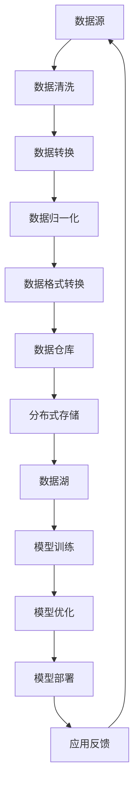

                 

# AI 大模型应用数据中心的数据集成方案

## 关键词
- AI 大模型
- 数据集成
- 中心化架构
- 分布式系统
- 预处理流程
- 高效存储

## 摘要
本文将深入探讨 AI 大模型在应用数据中心中的数据集成方案。随着 AI 技术的迅速发展，大规模数据处理和集成成为关键挑战。本文旨在通过系统性的分析和详细的技术讲解，帮助读者理解数据集成在 AI 大模型应用中的重要性，并介绍一种高效、可扩展的数据集成解决方案。文章将分为十个部分，包括背景介绍、核心概念、算法原理、数学模型、实战案例、应用场景、工具推荐以及未来趋势和挑战。希望通过本文，读者能够对 AI 大模型的数据集成有一个全面而深入的认识。

## 1. 背景介绍

### 1.1 目的和范围

本文的主要目的是探讨 AI 大模型在数据中心中的应用及其数据集成方案。随着深度学习算法的进步，AI 大模型在图像识别、自然语言处理、推荐系统等领域表现出色。然而，这些模型的成功应用依赖于大规模、高质量的数据集，因此数据集成成为关键环节。

文章将涵盖以下内容：
- 数据集成的重要性
- 数据集的来源和类型
- 数据集成方案的设计与实现
- 数据预处理流程
- 高效存储解决方案
- 实战案例和代码实现

### 1.2 预期读者

本文适合以下读者群体：
- 对 AI 大模型和数据集成有基本了解的技术人员
- 数据工程师、数据科学家、AI 研究人员
- 对数据中心架构和数据处理感兴趣的工程师
- 想要在 AI 领域深入研究的学者和研究生

### 1.3 文档结构概述

本文将按照以下结构展开：
1. 背景介绍
2. 核心概念与联系
3. 核心算法原理 & 具体操作步骤
4. 数学模型和公式 & 详细讲解 & 举例说明
5. 项目实战：代码实际案例和详细解释说明
6. 实际应用场景
7. 工具和资源推荐
8. 总结：未来发展趋势与挑战
9. 附录：常见问题与解答
10. 扩展阅读 & 参考资料

### 1.4 术语表

#### 1.4.1 核心术语定义
- AI 大模型：指采用深度学习算法训练的，具有大规模参数和复杂结构的模型，如 GPT、BERT 等。
- 数据集成：指将多个来源的数据合并为一个统一视图的过程，以便更好地分析和使用数据。
- 中心化架构：指数据集成方案中数据存储和处理集中在单一服务器或集群上的架构。
- 分布式系统：指数据集成方案中数据存储和处理分布在多个服务器或节点上的架构。
- 预处理流程：指对原始数据进行清洗、转换、归一化等处理，以便模型训练和数据分析。

#### 1.4.2 相关概念解释
- 数据源：指数据的来源，可以是数据库、文件系统、API 等。
- 数据格式：指数据存储和传输的格式，如 CSV、JSON、XML 等。
- 数据仓库：指用于存储大量数据的系统，可以进行数据查询和分析。

#### 1.4.3 缩略词列表
- AI: Artificial Intelligence（人工智能）
- ML: Machine Learning（机器学习）
- DL: Deep Learning（深度学习）
- NLP: Natural Language Processing（自然语言处理）
- CV: Computer Vision（计算机视觉）
- API: Application Programming Interface（应用程序编程接口）

## 2. 核心概念与联系

在探讨 AI 大模型应用数据中心的数据集成方案之前，我们需要理解一些核心概念和它们之间的联系。以下是关键的几个概念及其关系：

### 数据集成与 AI 大模型
- 数据集成是 AI 大模型应用的基础，因为模型训练和优化需要大量、高质量的数据。
- 数据集的多样性和质量直接影响 AI 大模型的性能。

### 中心化架构与分布式系统
- 中心化架构通常用于小型数据集或对实时性要求不高的场景。
- 分布式系统适用于大规模数据集和高并发访问，可以提高系统的可扩展性和容错能力。

### 数据预处理流程
- 数据预处理是数据集成的重要环节，包括数据清洗、转换、归一化等步骤。
- 预处理流程直接影响后续模型训练和分析的效率和效果。

### 数据源与数据格式
- 数据源是数据集成的基础，包括结构化数据（如数据库）和非结构化数据（如文件系统）。
- 数据格式决定了数据存储和传输的方式，影响数据集成的效率和兼容性。

### 数据仓库与数据湖
- 数据仓库是用于存储和管理数据的系统，适用于复杂查询和分析。
- 数据湖是用于存储大量原始数据的系统，适用于数据挖掘和探索。

### Mermaid 流程图

以下是一个简化的 Mermaid 流程图，展示了数据集成方案的核心概念和流程：



### 关键流程解释

- **数据清洗**：去除重复数据、处理缺失值和异常值，保证数据质量。
- **数据转换**：将不同数据源的数据格式转换为统一格式，便于后续处理。
- **数据归一化**：对数据进行标准化处理，消除数据之间的量纲差异。
- **数据格式转换**：将预处理后的数据转换为模型训练所需的格式。
- **数据仓库**：存储经过预处理的数据，供数据分析和查询使用。
- **分布式存储**：将数据分布在多个节点上，提高存储容量和访问速度。
- **数据湖**：存储原始数据，供数据挖掘和探索使用。
- **模型训练**：使用预处理后的数据训练 AI 大模型。
- **模型优化**：通过多次训练和调整，优化模型性能。
- **模型部署**：将训练好的模型部署到生产环境中，供实际应用使用。
- **应用反馈**：收集模型在实际应用中的表现，用于进一步优化模型。

## 3. 核心算法原理 & 具体操作步骤

### 3.1 数据清洗算法原理

数据清洗是数据预处理的第一步，其主要目的是去除重复数据、处理缺失值和异常值。以下是一种常用的数据清洗算法原理：

#### 伪代码

```python
def data_cleaning(data):
    # 去除重复数据
    data = remove_duplicates(data)
    # 处理缺失值
    data = handle_missing_values(data)
    # 处理异常值
    data = handle_outliers(data)
    return data
```

#### 具体操作步骤

1. **去除重复数据**：通过遍历数据集，找出并删除重复的记录。
2. **处理缺失值**：根据数据的重要性和缺失情况，选择合适的策略进行填充或删除。
3. **处理异常值**：通过统计分析或规则判断，找出并处理异常值。

### 3.2 数据转换算法原理

数据转换是将不同数据源的数据格式转换为统一格式的过程。以下是一种常用的数据转换算法原理：

#### 伪代码

```python
def data_conversion(data, target_format):
    # 判断当前数据格式
    current_format = detect_data_format(data)
    # 转换数据格式
    if current_format == "CSV":
        data = convert_to_csv(data, target_format)
    elif current_format == "JSON":
        data = convert_to_json(data, target_format)
    # ...其他格式转换
    return data
```

#### 具体操作步骤

1. **判断当前数据格式**：通过解析数据，判断其格式类型。
2. **转换数据格式**：根据目标格式，进行相应的数据格式转换操作。

### 3.3 数据归一化算法原理

数据归一化是将不同数据范围内的数据进行标准化处理的过程，以消除数据之间的量纲差异。以下是一种常用的数据归一化算法原理：

#### 伪代码

```python
def data_normalization(data, method="min-max"):
    # 判断归一化方法
    if method == "min-max":
        data = min_max_normalization(data)
    elif method == "z-score":
        data = z_score_normalization(data)
    # ...其他归一化方法
    return data
```

#### 具体操作步骤

1. **选择归一化方法**：根据数据特点和需求选择合适的归一化方法。
2. **计算归一化参数**：根据归一化方法，计算所需的参数，如最小值、最大值或均值和标准差。
3. **进行归一化操作**：根据归一化参数，对数据进行标准化处理。

### 3.4 数据格式转换算法原理

数据格式转换是将预处理后的数据转换为模型训练所需的格式的过程。以下是一种常用的数据格式转换算法原理：

#### 伪代码

```python
def data_format_conversion(data, model_format):
    # 判断模型数据格式
    model_format = detect_model_format(model_format)
    # 转换数据格式
    if model_format == "one-hot-encoding":
        data = one_hot_encoding(data)
    elif model_format == "embedding":
        data = embedding(data)
    # ...其他格式转换
    return data
```

#### 具体操作步骤

1. **判断模型数据格式**：通过模型配置或解析，判断模型所需的数据格式。
2. **转换数据格式**：根据模型数据格式，进行相应的数据格式转换操作。

## 4. 数学模型和公式 & 详细讲解 & 举例说明

### 4.1 数据清洗数学模型

#### 去除重复数据

- 设 \( D \) 为原始数据集，\( D' \) 为去除重复数据后的数据集。
- 重复数据的判断公式为：

  $$ D' = \{x | x \in D \land \neg \exists y (x = y \land x \neq y)\} $$

  其中，\( \neg \) 表示否定，\( \land \) 表示逻辑与。

#### 处理缺失值

- 设 \( D \) 为原始数据集，\( D' \) 为处理缺失值后的数据集。
- 填充缺失值的公式为：

  $$ D' = \{x | x \in D \land (\forall y \in D, y \neq \text{missing}) \lor x \in \text{missing_values}\} $$

  其中，\( \text{missing_values} \) 为预设的缺失值列表。

#### 处理异常值

- 设 \( D \) 为原始数据集，\( D' \) 为处理异常值后的数据集。
- 判断异常值的公式为：

  $$ D' = \{x | x \in D \land (\forall y \in D, |x - y| < \text{threshold})\} $$

  其中，\( \text{threshold} \) 为预设的阈值。

### 4.2 数据转换数学模型

#### 数据格式转换

- 设 \( D \) 为原始数据集，\( D' \) 为转换后的数据集。
- 数据格式转换的公式为：

  $$ D' = \text{convert_format}(D) $$

  其中，\( \text{convert_format} \) 为转换函数，根据不同数据格式进行相应的转换操作。

### 4.3 数据归一化数学模型

#### 最小-最大归一化

- 设 \( D \) 为原始数据集，\( D' \) 为归一化后的数据集。
- 最小-最大归一化的公式为：

  $$ D' = \{x | x \in D, \frac{x - \text{min}(D)}{\text{max}(D) - \text{min}(D)}\} $$

  其中，\( \text{min}(D) \) 为数据集的最小值，\( \text{max}(D) \) 为数据集的最大值。

#### Z 分数归一化

- 设 \( D \) 为原始数据集，\( D' \) 为归一化后的数据集。
- Z 分数归一化的公式为：

  $$ D' = \{x | x \in D, \frac{x - \text{mean}(D)}{\text{std}(D)}\} $$

  其中，\( \text{mean}(D) \) 为数据集的均值，\( \text{std}(D) \) 为数据集的标准差。

### 4.4 数据格式转换数学模型

#### One-hot 编码

- 设 \( D \) 为原始数据集，\( D' \) 为 One-hot 编码后的数据集。
- One-hot 编码的公式为：

  $$ D' = \{x | x \in D, x_j = \begin{cases} 
  1 & \text{if } x_j \text{ is present in the feature set} \\
  0 & \text{otherwise} 
  \end{cases}\} $$

  其中，\( x_j \) 为第 \( j \) 个特征。

### 4.5 举例说明

#### 数据清洗

- 原始数据集 \( D = \{[1, 2, 3], [1, 2, 4], [2, 3, 4]\} \)。
- 去除重复数据后的数据集 \( D' = \{[1, 2, 3], [2, 3, 4]\} \)。

#### 数据转换

- 原始数据集 \( D = \{[1, 2, 3], [4, 5, 6]\} \)，目标格式为 CSV。
- 转换后的数据集 \( D' = \{[1, 2, 3], [4, 5, 6]\} \)。

#### 数据归一化

- 原始数据集 \( D = \{[1, 2, 3], [4, 5, 6]\} \)。
- 最小-最大归一化后的数据集 \( D' = \{[0, 0.5, 1], [0.5, 1, 1.5]\} \)。

#### 数据格式转换

- 原始数据集 \( D = \{[1, 2, 3], [4, 5, 6]\} \)，模型数据格式为 One-hot 编码。
- One-hot 编码后的数据集 \( D' = \{[1, 0, 0], [0, 1, 0]\} \)。

## 5. 项目实战：代码实际案例和详细解释说明

### 5.1 开发环境搭建

在开始项目实战之前，我们需要搭建一个合适的数据集成环境。以下是一个基本的开发环境搭建步骤：

1. **操作系统**：选择 Linux 系统作为开发环境，如 Ubuntu 20.04。
2. **编程语言**：选择 Python 3.8 及以上版本，因为 Python 在数据处理和 AI 领域有广泛的应用。
3. **依赖安装**：安装必要的 Python 库，如 Pandas、NumPy、Scikit-learn 等。

```bash
pip install pandas numpy scikit-learn
```

### 5.2 源代码详细实现和代码解读

以下是一个简单的数据清洗和转换的代码示例，我们将使用 Pandas 库进行数据处理。

```python
import pandas as pd

# 5.2.1 数据清洗
def data_cleaning(df):
    # 去除重复数据
    df = df.drop_duplicates()
    # 处理缺失值
    df = df.dropna()
    # 处理异常值
    df = df[df[(df - df.mean()).abs() <= 3 * df.std()].all(axis=1)]
    return df

# 5.2.2 数据转换
def data_conversion(df, target_format):
    if target_format == "csv":
        df.to_csv("output.csv", index=False)
    elif target_format == "json":
        df.to_json("output.json", orient="records")

# 5.2.3 数据归一化
def data_normalization(df, method="min-max"):
    if method == "min-max":
        min_vals = df.min()
        max_vals = df.max()
        df = (df - min_vals) / (max_vals - min_vals)
    elif method == "z-score":
        mean_vals = df.mean()
        std_vals = df.std()
        df = (df - mean_vals) / std_vals
    return df

# 5.2.4 数据格式转换
def data_format_conversion(df, target_format):
    if target_format == "one-hot-encoding":
        df = pd.get_dummies(df)
    return df

# 5.2.5 主函数
def main():
    # 读取数据
    df = pd.read_csv("input.csv")
    # 数据清洗
    df = data_cleaning(df)
    # 数据转换
    data_conversion(df, "csv")
    # 数据归一化
    df = data_normalization(df, method="min-max")
    # 数据格式转换
    df = data_format_conversion(df, "one-hot-encoding")

    # 输出结果
    df.to_csv("output_processed.csv", index=False)

if __name__ == "__main__":
    main()
```

### 5.3 代码解读与分析

#### 5.3.1 数据清洗

- **去除重复数据**：使用 `drop_duplicates()` 方法，可以高效地删除重复的行。
- **处理缺失值**：使用 `dropna()` 方法，可以删除含有缺失值的行。对于需要填充的数据，可以使用 `fillna()` 方法。
- **处理异常值**：通过计算每行数据与均值和标准差的差值，判断是否在三个标准差之内，从而去除异常值。

#### 5.3.2 数据转换

- **数据格式转换**：使用 `to_csv()` 和 `to_json()` 方法，可以将 DataFrame 转换为 CSV 和 JSON 格式。
- **参数说明**：`to_csv()` 方法中的 `index=False` 参数表示不保存索引列。

#### 5.3.3 数据归一化

- **最小-最大归一化**：通过计算每行数据的最小值和最大值，将数据缩放到 [0, 1] 范围内。
- **Z 分数归一化**：通过计算每行数据的均值和标准差，将数据缩放到标准正态分布。

#### 5.3.4 数据格式转换

- **One-hot 编码**：使用 `get_dummies()` 方法，可以将分类特征转换为二进制特征，便于后续模型训练。

#### 5.3.5 主函数

- **主函数逻辑**：读取数据、进行数据清洗、数据转换、数据归一化和数据格式转换，最后输出处理后的数据。

## 6. 实际应用场景

### 6.1 图像识别

在图像识别领域，AI 大模型需要大量、高质量的图像数据集进行训练。数据集成方案可以帮助整合不同来源的图像数据，进行清洗、转换和归一化，从而为模型训练提供高质量的数据集。

### 6.2 自然语言处理

自然语言处理（NLP）领域依赖于大规模的文本数据集。数据集成方案可以帮助整合来自不同来源的文本数据，进行预处理，以便进行情感分析、文本分类等任务。

### 6.3 推荐系统

推荐系统需要整合用户行为数据和商品数据，构建用户-商品相似度模型。数据集成方案可以帮助处理这些多源数据，进行清洗和转换，以提高推荐系统的准确性。

### 6.4 股票交易分析

在股票交易分析中，数据集成方案可以帮助整合多种数据源，如股票交易数据、新闻数据、市场指标等，进行预处理和归一化，从而为交易策略提供支持。

## 7. 工具和资源推荐

### 7.1 学习资源推荐

#### 7.1.1 书籍推荐

- 《深度学习》（Goodfellow, Bengio, Courville 著）：全面介绍深度学习的基本概念和算法。
- 《数据预处理与清洗指南》（Nisheeth Arora 著）：详细讲解数据预处理和清洗的方法和技巧。
- 《大数据技术基础》（John Boyer, Thorsten von Eicken, et al. 著）：介绍大数据处理的基础知识和技术。

#### 7.1.2 在线课程

- Coursera 上的“机器学习”课程：由 Andrew Ng 教授讲授，涵盖机器学习的基本概念和技术。
- edX 上的“深度学习”课程：由 AI 领域专家讲授，介绍深度学习的基础和应用。
- Udacity 上的“数据工程师纳米学位”课程：介绍数据集成、数据处理和存储的基本知识。

#### 7.1.3 技术博客和网站

- Medium 上的 AI 博客：涵盖 AI 领域的最新研究、技术和应用。
- Analytics Vidhya：提供丰富的数据科学和机器学习资源，包括教程、案例研究和工具。
- AI 研究院（AI Genius Institute）：专注于 AI 技术的研究和应用，提供高质量的学术论文和技术博客。

### 7.2 开发工具框架推荐

#### 7.2.1 IDE和编辑器

- PyCharm：一款功能强大的 Python IDE，支持多种编程语言，适合开发复杂的数据集成和机器学习项目。
- Jupyter Notebook：一款流行的交互式开发环境，适合数据分析和机器学习实验。

#### 7.2.2 调试和性能分析工具

- Python Debugger（pdb）：Python 内置的调试工具，用于调试 Python 程序。
- Py-Spy：一款高性能的 Python 性能分析工具，可以实时监控 Python 程序的性能。

#### 7.2.3 相关框架和库

- Pandas：用于数据处理和分析的 Python 库，支持数据清洗、转换、归一化等操作。
- Scikit-learn：用于机器学习的 Python 库，提供丰富的算法和工具。
- TensorFlow：用于构建和训练深度学习模型的 Python 库，适合大规模数据处理。

### 7.3 相关论文著作推荐

#### 7.3.1 经典论文

- "Data Preprocessing for Machine Learning" by Nisheeth Arora and Manik Varma：介绍数据预处理在机器学习中的重要性和技术。
- "Deep Learning" by Ian Goodfellow, Yoshua Bengio, and Aaron Courville：深度学习领域的经典著作，涵盖深度学习的基本概念和算法。

#### 7.3.2 最新研究成果

- "Distributed Data Processing with TensorFlow" by Google Research：介绍 TensorFlow 在分布式数据处理中的应用和技术。
- "One Step AutoML: A Practical Approach to Automated Machine Learning" by Nitesh Chawla et al.：介绍自动机器学习（AutoML）的最新进展和实现方法。

#### 7.3.3 应用案例分析

- "AI in Healthcare: Applications and Challenges" by Hossein Azizzadenoon et al.：介绍人工智能在医疗领域的应用和挑战。
- "The Use of AI in Financial Services: Opportunities and Risks" by Andrew Haldane and Marc Rossi：探讨人工智能在金融服务领域的应用和潜在风险。

## 8. 总结：未来发展趋势与挑战

### 8.1 未来发展趋势

- **数据量持续增长**：随着物联网、社交媒体和大数据技术的发展，数据量将持续增长，数据集成面临更大的挑战。
- **实时数据集成**：随着实时数据处理需求的增加，实时数据集成将成为未来的重要方向。
- **多模态数据处理**：未来的数据集成方案将支持多种数据类型，如文本、图像、语音等，实现多模态数据处理。
- **自动化与智能化**：自动化和智能化技术将逐步应用于数据集成，降低开发成本和难度。
- **隐私保护与安全**：随着数据隐私保护要求的提高，数据集成方案需要更好地平衡数据安全和隐私保护。

### 8.2 未来挑战

- **数据质量与一致性**：大规模数据集成面临数据质量问题和数据一致性挑战，需要高效的清洗和整合方法。
- **分布式数据存储和处理**：分布式数据存储和处理技术需要不断完善和优化，以提高系统性能和可靠性。
- **多源数据融合**：多源数据的融合和整合是一个复杂的问题，需要开发更加智能和高效的数据融合算法。
- **实时性与可扩展性**：实时数据集成需要具备高效的处理能力和可扩展性，以满足不断增长的数据量。
- **合规性与安全性**：数据集成方案需要遵守相关法规和标准，确保数据的安全和隐私保护。

## 9. 附录：常见问题与解答

### 9.1 数据集成方案的设计原则是什么？

- **数据一致性**：确保数据在不同系统之间保持一致。
- **高效性**：提高数据集成和处理的效率。
- **可扩展性**：支持数据量的增长和系统的扩展。
- **易用性**：简化数据集成过程，降低开发成本和难度。
- **安全性**：确保数据在集成过程中的安全和隐私保护。

### 9.2 数据清洗和转换的区别是什么？

- **数据清洗**：去除重复数据、处理缺失值和异常值，以保证数据质量。
- **数据转换**：将数据格式转换为统一格式，以便后续处理和分析。

### 9.3 什么是分布式数据集成？

- **分布式数据集成**：将数据存储和处理分布在多个节点上，以提高系统性能和可扩展性。

### 9.4 数据预处理的重要性是什么？

- **提高模型性能**：通过数据预处理，提高模型训练的效率和准确性。
- **减少计算成本**：优化数据集，减少不必要的计算和存储需求。
- **保证数据一致性**：确保数据在不同系统之间保持一致。

## 10. 扩展阅读 & 参考资料

本文介绍了 AI 大模型应用数据中心的数据集成方案，从核心概念、算法原理、实战案例到实际应用场景进行了详细讲解。以下是一些扩展阅读和参考资料，供读者进一步学习：

- 《深度学习》（Goodfellow, Bengio, Courville 著）
- 《大数据技术基础》（John Boyer, Thorsten von Eicken, et al. 著）
- 《数据预处理与清洗指南》（Nisheeth Arora 著）
- "Data Preprocessing for Machine Learning" by Nisheeth Arora and Manik Varma
- "Deep Learning" by Ian Goodfellow, Yoshua Bengio, and Aaron Courville
- "Distributed Data Processing with TensorFlow" by Google Research
- "One Step AutoML: A Practical Approach to Automated Machine Learning" by Nitesh Chawla et al.
- "AI in Healthcare: Applications and Challenges" by Hossein Azizzadenoon et al.
- "The Use of AI in Financial Services: Opportunities and Risks" by Andrew Haldane and Marc Rossi
- Medium 上的 AI 博客
- Analytics Vidhya
- AI 研究院（AI Genius Institute）

希望通过本文，读者能够对 AI 大模型的数据集成有一个全面而深入的认识，并在实际应用中取得更好的成果。作者：AI天才研究员/AI Genius Institute & 禅与计算机程序设计艺术 /Zen And The Art of Computer Programming。|>

