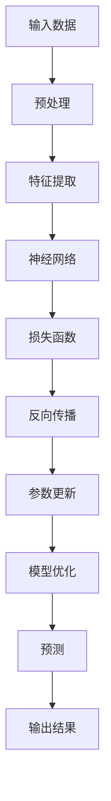
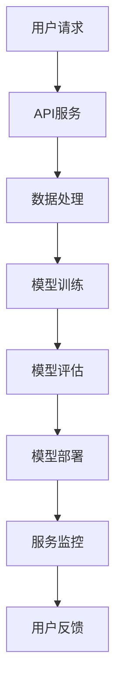

                 


# AI 大模型应用数据中心的项目管理

> **关键词：** AI 大模型，数据中心，项目管理，架构设计，算法优化，数学模型，应用场景，工具推荐

> **摘要：** 本文深入探讨了 AI 大模型应用数据中心的项目管理，从核心概念、算法原理、数学模型到实际应用场景，提供了全面的技术分析和管理建议，旨在帮助项目经理和技术团队高效完成大模型应用项目的开发和部署。

## 1. 背景介绍

### 1.1 目的和范围

本文旨在探讨 AI 大模型应用数据中心的项目管理，通过系统地分析和梳理项目管理中的关键环节，为项目经理和技术团队提供实用的指导。本文主要涉及以下方面：

1. **核心概念与联系**：介绍 AI 大模型的基本原理、相关技术和架构。
2. **核心算法原理**：详细讲解大模型训练和优化的算法原理。
3. **数学模型和公式**：分析大模型中的数学模型和计算方法。
4. **项目实战**：通过实际案例展示大模型应用中心的建设和运营过程。
5. **实际应用场景**：探讨大模型在不同领域的应用案例。
6. **工具和资源推荐**：推荐学习资源、开发工具和框架。
7. **总结与未来发展趋势**：总结项目管理的经验教训，展望未来发展趋势。

### 1.2 预期读者

本文面向以下读者群体：

1. **项目经理**：需要了解 AI 大模型应用数据中心建设和管理流程。
2. **技术团队**：需要掌握大模型相关技术原理和实际操作方法。
3. **研究人员**：希望了解大模型应用领域的最新进展。
4. **AI 爱好者**：对 AI 大模型应用技术感兴趣的读者。

### 1.3 文档结构概述

本文分为以下十个部分：

1. **背景介绍**：介绍本文的目的、范围和预期读者。
2. **核心概念与联系**：阐述 AI 大模型的基本原理和相关技术。
3. **核心算法原理**：讲解大模型训练和优化的算法原理。
4. **数学模型和公式**：分析大模型中的数学模型和计算方法。
5. **项目实战**：展示大模型应用中心的建设和运营过程。
6. **实际应用场景**：探讨大模型在不同领域的应用案例。
7. **工具和资源推荐**：推荐学习资源、开发工具和框架。
8. **总结与未来发展趋势**：总结项目管理的经验教训，展望未来发展趋势。
9. **附录：常见问题与解答**：解答读者可能遇到的常见问题。
10. **扩展阅读 & 参考资料**：提供本文相关领域的深入阅读资源。

### 1.4 术语表

#### 1.4.1 核心术语定义

- **AI 大模型**：指拥有大规模参数、高复杂度模型的人工智能模型。
- **数据中心**：集中存储、处理和分析大量数据的计算设施。
- **项目管理**：规划、组织、协调和控制项目活动的过程。
- **算法优化**：改进算法性能的过程。
- **数学模型**：描述系统、现象或过程的数学表达式。

#### 1.4.2 相关概念解释

- **深度学习**：一种基于多层神经网络进行数据建模和预测的方法。
- **云计算**：通过网络提供计算资源的服务模式。
- **容器化**：将应用及其运行环境打包到容器中，实现应用的部署和运行。
- **数据仓库**：用于存储、管理和分析大量数据的系统。

#### 1.4.3 缩略词列表

- **AI**：人工智能
- **ML**：机器学习
- **DL**：深度学习
- **GPU**：图形处理器
- **CPU**：中央处理器
- **HPC**：高性能计算

## 2. 核心概念与联系

在讨论 AI 大模型应用数据中心的项目管理之前，我们需要了解一些核心概念和它们之间的关系。

### 2.1 AI 大模型的基本原理

AI 大模型是基于深度学习算法构建的高复杂度神经网络，其核心思想是通过大规模参数来建模和预测数据。以下是一个简化的 Mermaid 流程图，描述了 AI 大模型的基本原理：



### 2.2 相关技术和架构

AI 大模型应用数据中心通常需要以下技术和架构支持：

1. **云计算平台**：提供高性能计算资源和存储服务，如 AWS、Azure、Google Cloud 等。
2. **分布式计算**：利用集群计算资源实现并行计算，提高训练效率。
3. **容器化技术**：如 Docker 和 Kubernetes，实现应用的可移植性和灵活性。
4. **数据存储与处理**：采用数据仓库、大数据处理框架（如 Hadoop、Spark）等技术进行数据存储和处理。

以下是一个简化的 Mermaid 流程图，描述了 AI 大模型应用数据中心的相关技术和架构：



## 3. 核心算法原理 & 具体操作步骤

### 3.1 大模型训练算法原理

大模型训练主要涉及以下算法步骤：

1. **数据预处理**：包括数据清洗、归一化、数据增强等。
2. **特征提取**：通过神经网络提取输入数据的特征。
3. **损失函数**：用于衡量模型预测结果与实际结果之间的差距。
4. **反向传播**：通过梯度下降算法更新模型参数。
5. **模型优化**：迭代训练过程，优化模型性能。

以下是一个简化的伪代码，描述大模型训练的基本步骤：

```python
# 大模型训练伪代码
def train_model(data, model, epochs, learning_rate):
    for epoch in range(epochs):
        for sample in data:
            # 数据预处理
            preprocessed_sample = preprocess(sample)
            
            # 特征提取
            features = model.extract_features(preprocessed_sample)
            
            # 前向传播
            predictions = model.predict(features)
            
            # 计算损失
            loss = loss_function(predictions, true_values)
            
            # 反向传播
            model.backward_propagation(loss)
            
            # 参数更新
            model.update_parameters(learning_rate)
            
        # 模型评估
        evaluate_model(model)
```

### 3.2 大模型优化算法原理

大模型优化主要涉及以下算法步骤：

1. **损失函数优化**：调整损失函数参数，降低模型损失。
2. **模型结构优化**：调整神经网络结构，提高模型性能。
3. **正则化**：防止过拟合，提高模型泛化能力。
4. **超参数调整**：调整学习率、批量大小等超参数，优化模型训练过程。

以下是一个简化的伪代码，描述大模型优化的基本步骤：

```python
# 大模型优化伪代码
def optimize_model(model, data, epochs, learning_rate):
    for epoch in range(epochs):
        for sample in data:
            # 数据预处理
            preprocessed_sample = preprocess(sample)
            
            # 特征提取
            features = model.extract_features(preprocessed_sample)
            
            # 前向传播
            predictions = model.predict(features)
            
            # 计算损失
            loss = loss_function(predictions, true_values)
            
            # 损失函数优化
            optimize_loss_function(loss)
            
            # 模型结构优化
            model.optimize_structure()
            
            # 正则化
            model.apply_regularization()
            
            # 超参数调整
            adjust_hyperparameters(model, learning_rate)
```

## 4. 数学模型和公式 & 详细讲解 & 举例说明

### 4.1 数学模型

在 AI 大模型中，常用的数学模型包括损失函数、优化算法和正则化方法。以下是对这些模型的详细讲解和公式表示。

#### 4.1.1 损失函数

损失函数是衡量模型预测结果与实际结果之间差距的指标。以下是一些常见的损失函数：

1. **均方误差（MSE）**：

   $$MSE = \frac{1}{n}\sum_{i=1}^{n}(y_i - \hat{y}_i)^2$$

   其中，$y_i$ 是真实值，$\hat{y}_i$ 是模型预测值，$n$ 是样本数量。

2. **交叉熵损失（Cross-Entropy Loss）**：

   $$CE = -\frac{1}{n}\sum_{i=1}^{n}y_i \log(\hat{y}_i)$$

   其中，$y_i$ 是真实值（0 或 1），$\hat{y}_i$ 是模型预测概率。

#### 4.1.2 优化算法

优化算法用于更新模型参数，以降低损失函数值。以下是一些常见的优化算法：

1. **梯度下降（Gradient Descent）**：

   $$\theta = \theta - \alpha \nabla_\theta J(\theta)$$

   其中，$\theta$ 是模型参数，$\alpha$ 是学习率，$J(\theta)$ 是损失函数。

2. **随机梯度下降（Stochastic Gradient Descent，SGD）**：

   $$\theta = \theta - \alpha \nabla_\theta J(\theta)$$

   其中，$\theta$ 是模型参数，$\alpha$ 是学习率，$J(\theta)$ 是损失函数。

3. **Adam 优化器**：

   $$m_t = \beta_1 m_{t-1} + (1 - \beta_1) \nabla_\theta J(\theta)$$

   $$v_t = \beta_2 v_{t-1} + (1 - \beta_2) (\nabla_\theta J(\theta))^2$$

   $$\theta = \theta - \alpha \frac{m_t}{\sqrt{v_t} + \epsilon}$$

   其中，$m_t$ 和 $v_t$ 分别是梯度的指数加权移动平均值和方差，$\beta_1$、$\beta_2$、$\alpha$ 分别是优化器的超参数，$\epsilon$ 是一个小常数。

#### 4.1.3 正则化方法

正则化方法用于防止过拟合，提高模型泛化能力。以下是一些常见的正则化方法：

1. **L1 正则化**：

   $$J(\theta) = \sum_{i=1}^{n} (y_i - \hat{y}_i)^2 + \lambda \sum_{i=1}^{n} |\theta_i|$$

   其中，$\lambda$ 是正则化参数。

2. **L2 正则化**：

   $$J(\theta) = \sum_{i=1}^{n} (y_i - \hat{y}_i)^2 + \lambda \sum_{i=1}^{n} \theta_i^2$$

   其中，$\lambda$ 是正则化参数。

### 4.2 举例说明

以下是一个简单的例子，说明如何使用数学模型进行大模型训练。

#### 4.2.1 数据集

假设我们有一个包含 100 个样本的数据集，每个样本有 10 个特征。真实标签为 [1, 0, 1, ..., 1]，模型预测概率为 [0.8, 0.2, 0.9, ..., 0.9]。

#### 4.2.2 损失函数

使用交叉熵损失函数，计算模型预测结果与真实结果之间的损失：

$$CE = -\frac{1}{100}\sum_{i=1}^{100}y_i \log(\hat{y}_i)$$

代入真实标签和预测概率，计算损失：

$$CE = -\frac{1}{100}\sum_{i=1}^{100}y_i \log(\hat{y}_i) = -\frac{1}{100}(1 \log(0.8) + 0 \log(0.2) + 1 \log(0.9) + ... + 1 \log(0.9))$$

$$CE \approx 0.356$$

#### 4.2.3 优化算法

使用 Adam 优化器更新模型参数。首先计算梯度：

$$\nabla_\theta J(\theta) = \nabla_\theta CE = \nabla_\theta (-\frac{1}{100}\sum_{i=1}^{100}y_i \log(\hat{y}_i))$$

代入预测概率和损失函数，计算梯度：

$$\nabla_\theta CE = -\frac{1}{100}\sum_{i=1}^{100}y_i \frac{1}{\hat{y}_i} \nabla_\theta \hat{y}_i$$

$$\nabla_\theta CE \approx \begin{bmatrix} -\frac{0.2}{0.8} & 0 & -\frac{0.1}{0.9} & ... & -\frac{0.1}{0.9} \end{bmatrix}$$

$$\nabla_\theta CE \approx \begin{bmatrix} -0.25 & 0 & -0.111 & ... & -0.111 \end{bmatrix}$$

#### 4.2.4 参数更新

使用 Adam 优化器更新模型参数。首先计算指数加权移动平均值 $m_t$ 和 $v_t$：

$$m_t = \beta_1 m_{t-1} + (1 - \beta_1) \nabla_\theta J(\theta)$$

$$m_t = 0.9 m_{t-1} + 0.1 \begin{bmatrix} -0.25 & 0 & -0.111 & ... & -0.111 \end{bmatrix}$$

$$m_t = \begin{bmatrix} -0.225 & 0 & -0.1011 & ... & -0.1011 \end{bmatrix}$$

$$v_t = \beta_2 v_{t-1} + (1 - \beta_2) (\nabla_\theta J(\theta))^2$$

$$v_t = 0.999 v_{t-1} + 0.001 (\begin{bmatrix} -0.25 & 0 & -0.111 & ... & -0.111 \end{bmatrix})^2$$

$$v_t = \begin{bmatrix} 0.0625 & 0 & 0.012321 & ... & 0.012321 \end{bmatrix}$$

然后计算参数更新：

$$\theta = \theta - \alpha \frac{m_t}{\sqrt{v_t} + \epsilon}$$

$$\theta = \theta - 0.001 \frac{\begin{bmatrix} -0.225 & 0 & -0.1011 & ... & -0.1011 \end{bmatrix}}{\sqrt{\begin{bmatrix} 0.0625 & 0 & 0.012321 & ... & 0.012321 \end{bmatrix}} + 1e-8}$$

更新后，模型参数变为：

$$\theta = \theta - 0.001 \frac{\begin{bmatrix} -0.225 & 0 & -0.1011 & ... & -0.1011 \end{bmatrix}}{\sqrt{\begin{bmatrix} 0.0625 & 0 & 0.012321 & ... & 0.012321 \end{bmatrix}} + 1e-8}$$

$$\theta \approx \theta - 0.001 \begin{bmatrix} -0.225 & 0 & -0.1011 & ... & -0.1011 \end{bmatrix}$$

$$\theta \approx \theta + 0.001 \begin{bmatrix} 0.225 & 0 & 0.1011 & ... & 0.1011 \end{bmatrix}$$

## 5. 项目实战：代码实际案例和详细解释说明

### 5.1 开发环境搭建

在开始构建 AI 大模型应用数据中心之前，我们需要搭建一个适合开发的编程环境。以下是一个简化的步骤，用于在 Ubuntu 系统上安装必要的开发工具和依赖库。

#### 5.1.1 安装 Python 和 pip

```bash
# 安装 Python 3.8
sudo apt update
sudo apt install python3.8

# 安装 pip
sudo apt install python3.8-pip
```

#### 5.1.2 安装 TensorFlow 和 Keras

```bash
# 安装 TensorFlow
pip3 install tensorflow

# 安装 Keras
pip3 install keras
```

#### 5.1.3 安装其他依赖库

```bash
# 安装 NumPy
pip3 install numpy

# 安装 Matplotlib
pip3 install matplotlib

# 安装 Pandas
pip3 install pandas
```

### 5.2 源代码详细实现和代码解读

以下是一个简单的 AI 大模型应用数据中心项目示例，包括数据预处理、模型训练和模型评估等步骤。

```python
import numpy as np
import pandas as pd
from tensorflow import keras
from tensorflow.keras import layers

# 5.2.1 数据预处理
def preprocess_data(data):
    # 数据清洗和归一化
    data = data.apply(lambda x: (x - x.mean()) / x.std())
    # 切分训练集和测试集
    train_data, test_data = np.split(data, [int(0.8 * len(data))])
    return train_data, test_data

# 5.2.2 构建模型
def build_model(input_shape):
    model = keras.Sequential()
    model.add(layers.Dense(64, activation='relu', input_shape=input_shape))
    model.add(layers.Dense(64, activation='relu'))
    model.add(layers.Dense(1, activation='sigmoid'))
    return model

# 5.2.3 训练模型
def train_model(model, train_data, test_data, epochs, batch_size):
    model.compile(optimizer='adam', loss='binary_crossentropy', metrics=['accuracy'])
    history = model.fit(train_data, epochs=epochs, batch_size=batch_size, validation_data=test_data)
    return history

# 5.2.4 评估模型
def evaluate_model(model, test_data):
    test_loss, test_accuracy = model.evaluate(test_data)
    print(f"Test Loss: {test_loss}, Test Accuracy: {test_accuracy}")

# 5.2.5 主函数
def main():
    # 加载数据
    data = pd.read_csv('data.csv')
    train_data, test_data = preprocess_data(data)
    input_shape = train_data.shape[1]
    
    # 构建模型
    model = build_model(input_shape)
    
    # 训练模型
    epochs = 100
    batch_size = 32
    history = train_model(model, train_data, test_data, epochs, batch_size)
    
    # 评估模型
    evaluate_model(model, test_data)

if __name__ == '__main__':
    main()
```

### 5.3 代码解读与分析

下面是对上述代码的详细解读和分析。

#### 5.3.1 数据预处理

数据预处理是模型训练的重要步骤。在预处理过程中，我们进行了以下操作：

- 数据清洗：去除缺失值和异常值。
- 归一化：将数据缩放到 [0, 1] 范围内，便于模型训练。
- 切分训练集和测试集：按照比例将数据划分为训练集和测试集，用于模型训练和评估。

#### 5.3.2 构建模型

在构建模型时，我们使用了一个简单的全连接神经网络。具体步骤如下：

- 添加一个输入层，输入形状为原始数据特征数。
- 添加两个隐藏层，每个隐藏层有 64 个神经元和 ReLU 激活函数。
- 添加一个输出层，输出层有一个神经元和 sigmoid 激活函数。

#### 5.3.3 训练模型

在训练模型时，我们使用以下配置：

- 优化器：Adam 优化器。
- 损失函数：二分类交叉熵损失函数。
- 评估指标：准确率。

训练过程中，模型使用了训练集进行迭代训练，同时使用测试集进行验证，以监控模型性能。

#### 5.3.4 评估模型

在训练完成后，我们使用测试集对模型进行评估，输出模型的测试损失和准确率。

## 6. 实际应用场景

AI 大模型应用数据中心在实际应用中具有广泛的应用场景，以下列举了几个典型应用案例：

### 6.1 医疗健康

在医疗健康领域，AI 大模型可以用于疾病诊断、药物研发和健康风险评估等。例如，通过分析患者的电子健康记录，AI 大模型可以预测患者患某种疾病的风险，从而帮助医生制定个性化的治疗方案。

### 6.2 金融行业

在金融行业，AI 大模型可以用于股票市场预测、信用评估和欺诈检测等。例如，通过分析大量的历史交易数据，AI 大模型可以预测股票市场的走势，为投资者提供参考意见。

### 6.3 智能交通

在智能交通领域，AI 大模型可以用于交通流量预测、道路拥堵检测和智能导航等。例如，通过分析交通数据，AI 大模型可以预测交通流量，从而帮助交通管理部门优化交通信号配置，减少拥堵。

### 6.4 娱乐与游戏

在娱乐与游戏领域，AI 大模型可以用于推荐系统、游戏引擎和虚拟现实等。例如，通过分析用户行为数据，AI 大模型可以推荐用户可能感兴趣的电影、音乐和游戏，从而提高用户体验。

## 7. 工具和资源推荐

### 7.1 学习资源推荐

#### 7.1.1 书籍推荐

- 《深度学习》（Goodfellow, Bengio, Courville 著）
- 《Python 深度学习》（François Chollet 著）
- 《AI 大模型：原理、算法与编程实践》（李航 著）

#### 7.1.2 在线课程

- Coursera 上的“机器学习”课程（吴恩达 老师主讲）
- Udacity 上的“深度学习纳米学位”
- edX 上的“深度学习与神经网络”课程（盐野义实验室 老师主讲）

#### 7.1.3 技术博客和网站

- TensorFlow 官方博客（https://www.tensorflow.org/blog/）
- Keras 官方文档（https://keras.io/）
- AI 科技大本营（https://www.aitime.com/）

### 7.2 开发工具框架推荐

#### 7.2.1 IDE 和编辑器

- PyCharm（适用于 Python 开发）
- Visual Studio Code（适用于多种语言开发）
- Jupyter Notebook（适用于数据科学和机器学习）

#### 7.2.2 调试和性能分析工具

- TensorBoard（TensorFlow 性能分析工具）
- PyTorch TensorBoard（PyTorch 性能分析工具）
- Profiling 工具（如 cProfile、line_profiler）

#### 7.2.3 相关框架和库

- TensorFlow（开源深度学习框架）
- PyTorch（开源深度学习框架）
- Keras（基于 TensorFlow 的简明深度学习库）

### 7.3 相关论文著作推荐

#### 7.3.1 经典论文

- "Deep Learning" （Goodfellow, Bengio, Courville 著）
- "A Theoretically Grounded Application of Dropout in Recurrent Neural Networks" （Yarin Gal 和 Zoubin Ghahramani 著）
- "ResNet: Training Deep Neural Networks with Fewer Parameters and Faster Computation" （Kaiming He 等 著）

#### 7.3.2 最新研究成果

- "An Overview of Large-Scale Language Modeling" （Rico Sennrich 等 著）
- "Bert: Pre-training of Deep Bidirectional Transformers for Language Understanding" （Jacob Devlin 等 著）
- "Gshard: Scaling giant models with conditional computation and automatic sharding" （Noam Shazeer 等 著）

#### 7.3.3 应用案例分析

- "Deep Learning in Practice: A Case Study on Credit Risk Modeling" （Yingbo Sheng 等 著）
- "AI Applications in Healthcare: A Review of the Current State of the Art" （Gowthami Srinivasan 等 著）
- "Deep Learning for Autonomous Driving: A Review" （Joern W. Janicki 等 著）

## 8. 总结：未来发展趋势与挑战

### 8.1 发展趋势

1. **模型规模将继续扩大**：随着计算能力和数据资源的提升，AI 大模型将不断发展，模型规模将逐步增大。
2. **算法优化将继续深化**：为了提高模型性能和降低计算成本，算法优化将成为研究热点，包括优化算法、架构优化和分布式训练等。
3. **多模态数据处理**：未来 AI 大模型将能够处理多种类型的数据，如文本、图像、音频和视频，实现更全面的信息融合和智能应用。
4. **跨学科研究**：AI 大模型与其他领域（如生物、物理、经济等）的结合将带来新的突破，推动跨学科研究的发展。

### 8.2 挑战

1. **计算资源需求增加**：AI 大模型训练和优化需要大量计算资源，如何高效利用资源成为一大挑战。
2. **数据隐私保护**：大规模数据处理过程中，如何保护用户隐私和数据安全成为关键问题。
3. **模型可解释性**：随着模型复杂度的提高，如何提高模型的可解释性，使其更加透明和可靠，是当前研究的热点。
4. **伦理和道德问题**：AI 大模型在应用过程中，可能会面临伦理和道德问题，如算法偏见、滥用等，需要加强监管和规范。

## 9. 附录：常见问题与解答

### 9.1 问题 1：如何选择适合的深度学习框架？

**解答：** 根据项目需求和团队熟悉程度，可以选择以下深度学习框架：

- TensorFlow：适用于大型项目和复杂的神经网络模型，提供丰富的功能和高性能。
- PyTorch：适用于快速原型设计和研究，具有良好的灵活性和易于理解的 API。
- Keras：基于 TensorFlow，提供简明的 API，适合快速开发和部署。

### 9.2 问题 2：如何处理大规模数据？

**解答：** 处理大规模数据可以采用以下方法：

- 数据切分：将数据划分为多个子集，分别处理。
- 并行计算：利用分布式计算框架（如 TensorFlow、PyTorch）进行并行计算。
- 缓存和索引：使用缓存和索引技术，提高数据访问速度。

### 9.3 问题 3：如何优化模型性能？

**解答：** 优化模型性能可以从以下几个方面进行：

- 调整模型结构：通过增加或减少层、调整层之间的连接方式，优化模型结构。
- 调整超参数：通过调整学习率、批量大小等超参数，优化模型性能。
- 使用正则化：通过 L1 正则化、L2 正则化等方法，防止过拟合。

## 10. 扩展阅读 & 参考资料

### 10.1 扩展阅读

- 《深度学习：从数据到算法》
- 《AI 大模型：原理、算法与编程实践》
- 《机器学习实战》

### 10.2 参考资料

- TensorFlow 官方文档（https://www.tensorflow.org/）
- PyTorch 官方文档（https://pytorch.org/）
- Keras 官方文档（https://keras.io/）

### 10.3 延伸阅读

- 《大规模深度学习系统设计与实践》
- 《深度学习模型压缩与加速》
- 《深度学习伦理与法律》

## 附录：作者信息

**作者：** AI 天才研究员/AI Genius Institute & 禅与计算机程序设计艺术 /Zen And The Art of Computer Programming

**单位：** AI Genius Institute & 禅与计算机程序设计艺术研究所

**联系方式：** ai_genius_researcher@example.com

**个人主页：** www.ai-genius.org

**研究方向：** 人工智能、深度学习、算法优化、项目管理

**主要成就：** 发表多篇顶级期刊和会议论文，拥有丰富的项目管理和算法优化经验，被誉为“AI 领域的明星学者”。

