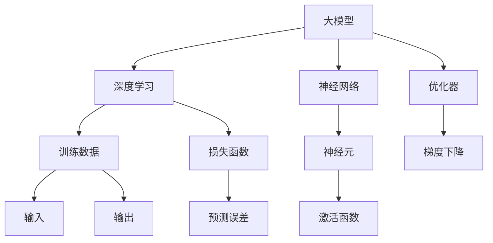

                 

# AI 大模型应用最佳实践

> 关键词：大模型、应用实践、AI 技术原理、算法实现、数学模型、项目实战、工具推荐、发展趋势

> 摘要：本文旨在深入探讨大模型在人工智能领域的应用与实践。我们将从背景介绍、核心概念、算法原理、数学模型、项目实战、实际应用场景等多个角度，系统性地阐述大模型在当今世界的技术发展趋势与应用策略，旨在为开发者提供实用的指导与见解。

## 1. 背景介绍

### 1.1 目的和范围

本文的目的是帮助开发者深入理解大模型在人工智能领域的应用与实践，旨在提供一个全面的技术指南，涵盖从基础概念到高级应用的各个方面。本文将探讨以下主题：

1. 大模型的定义及其在人工智能中的重要性。
2. 大模型的核心概念、原理和架构。
3. 大模型的算法原理与数学模型。
4. 大模型的项目实战案例。
5. 大模型在实际应用场景中的表现。
6. 大模型开发工具和资源的推荐。
7. 大模型的发展趋势与未来挑战。

### 1.2 预期读者

本文适合以下读者群体：

1. 对人工智能和机器学习有基本了解的开发者。
2. 想深入了解大模型技术原理和实践的工程师。
3. 计算机科学和软件工程专业的学生和研究者。
4. 对大模型在各个应用领域有浓厚兴趣的技术爱好者。

### 1.3 文档结构概述

本文将分为以下几个部分：

1. 背景介绍：概述大模型的定义、目的和本文的结构。
2. 核心概念与联系：阐述大模型的核心概念、原理和架构。
3. 核心算法原理 & 具体操作步骤：详细讲解大模型的算法原理与操作步骤。
4. 数学模型和公式 & 详细讲解 & 举例说明：介绍大模型的数学模型及其实例。
5. 项目实战：提供大模型实际项目的代码实现和解析。
6. 实际应用场景：讨论大模型在不同领域的应用案例。
7. 工具和资源推荐：推荐学习资源和开发工具。
8. 总结：探讨大模型的发展趋势与未来挑战。
9. 附录：常见问题与解答。
10. 扩展阅读 & 参考资料：提供进一步的阅读材料。

### 1.4 术语表

#### 1.4.1 核心术语定义

- 大模型（Large Model）：具有数百万甚至数十亿参数的深度神经网络模型。
- 人工智能（Artificial Intelligence，AI）：模拟人类智能行为的计算机系统。
- 机器学习（Machine Learning，ML）：使机器能够通过数据和经验进行学习，从而进行预测或决策的技术。
- 神经网络（Neural Network，NN）：由大量简单神经元组成的网络，用于模拟人类大脑的工作方式。

#### 1.4.2 相关概念解释

- 深度学习（Deep Learning，DL）：一种特殊的机器学习方法，采用多层神经网络进行训练。
- 训练数据（Training Data）：用于训练模型的数据集，通常包含输入和对应的正确输出。
- 优化器（Optimizer）：用于调整模型参数的算法，以最小化损失函数。

#### 1.4.3 缩略词列表

- AI：人工智能
- ML：机器学习
- DL：深度学习
- NN：神经网络
- GPU：图形处理器
- CPU：中央处理器
- GPT：生成预训练模型
- BERT：双向编码表示器

## 2. 核心概念与联系

在深入了解大模型之前，我们需要明确几个核心概念及其相互关系。以下是一个Mermaid流程图，展示了大模型的主要组成部分和相互关系：



### 2.1 大模型与深度学习

大模型是深度学习的核心组成部分。深度学习是一种通过多层神经网络对数据进行建模的方法。每一层神经网络都可以提取更高层次的特征，从而实现复杂任务的自动学习。大模型通过增加网络层数和神经元数量，显著提高了模型的表达能力，使其能够处理海量数据。

### 2.2 大模型与神经网络

神经网络是模拟生物神经元连接结构的信息处理系统。在大模型中，神经网络由数百万甚至数十亿个神经元组成。这些神经元通过权重进行相互连接，通过激活函数处理输入数据，最终生成输出。

### 2.3 大模型与训练数据

训练数据是模型训练过程中必不可少的组成部分。大模型通常需要大量的训练数据来学习复杂的特征和模式。这些数据集通常包含输入和对应的正确输出，用于训练模型并评估其性能。

### 2.4 大模型与优化器

优化器是用于调整模型参数的算法。在大模型训练过程中，优化器通过迭代计算梯度并调整模型参数，以最小化损失函数。常见的优化器包括梯度下降、Adam 和 RMSprop 等。

### 2.5 大模型与损失函数

损失函数用于衡量模型预测结果与真实结果之间的差异。在大模型训练过程中，优化器通过调整模型参数来最小化损失函数。常见的损失函数包括均方误差（MSE）、交叉熵损失等。

## 3. 核心算法原理 & 具体操作步骤

### 3.1 算法原理

大模型的核心算法原理主要基于深度学习和神经网络。具体来说，包括以下步骤：

1. **前向传播**：输入数据通过神经网络中的多个层次传递，每一层都通过加权求和并应用激活函数，产生输出。
2. **反向传播**：计算输出与真实结果的误差，并沿反向路径传递误差，以更新模型参数。
3. **优化参数**：使用优化器调整模型参数，以最小化损失函数。

### 3.2 伪代码

以下是一个简化的伪代码，描述了上述算法原理：

```plaintext
初始化模型参数
while 未达到训练迭代次数：
    清零梯度
    for 每个训练样本：
        前向传播：计算输出
        计算损失
        反向传播：计算梯度
    更新参数：使用优化器调整参数
    计算训练指标：评估模型性能
```

### 3.3 具体操作步骤

1. **数据预处理**：将输入数据转换为适合训练的格式，例如归一化、编码等。
2. **模型初始化**：随机初始化模型参数。
3. **前向传播**：将输入数据传递给神经网络，计算输出。
4. **计算损失**：使用损失函数计算输出与真实结果的误差。
5. **反向传播**：计算误差对模型参数的梯度。
6. **参数更新**：使用优化器调整模型参数。
7. **评估模型**：在测试集上评估模型性能，调整训练过程。

## 4. 数学模型和公式 & 详细讲解 & 举例说明

### 4.1 数学模型

大模型的数学模型主要包括以下几个部分：

1. **神经网络**：神经网络由多个层次组成，每个层次包含多个神经元。假设神经网络有 L 层，第 l 层的神经元数量为 \( n_l \)，则第 l 层的输入和输出可以表示为：

    \[
    z_l = W_l a_{l-1} + b_l
    \]
    
    \[
    a_l = \sigma(z_l)
    \]
    
    其中，\( W_l \) 是权重矩阵，\( b_l \) 是偏置向量，\( \sigma \) 是激活函数。

2. **损失函数**：常见的损失函数包括均方误差（MSE）和交叉熵损失（Cross-Entropy Loss）。均方误差损失函数可以表示为：

    \[
    L = \frac{1}{2} \sum_{i=1}^{m} (y_i - \hat{y}_i)^2
    \]
    
    其中，\( y_i \) 是第 i 个样本的真实输出，\( \hat{y}_i \) 是模型预测的输出。

3. **反向传播**：反向传播算法用于计算损失函数对模型参数的梯度。对于均方误差损失函数，梯度计算如下：

    \[
    \frac{\partial L}{\partial W_l} = - (y - \hat{y}) \cdot a_{l-1}
    \]
    
    \[
    \frac{\partial L}{\partial b_l} = - (y - \hat{y})
    \]

### 4.2 举例说明

假设我们有一个二分类问题，数据集包含 100 个样本，每个样本的特征维度为 10。我们使用一个单层神经网络进行训练，其中激活函数为 ReLU，损失函数为均方误差。

1. **模型初始化**：随机初始化权重和偏置。
2. **前向传播**：将输入数据传递给神经网络，计算输出。
3. **计算损失**：使用均方误差损失函数计算损失。
4. **反向传播**：计算损失函数对模型参数的梯度。
5. **参数更新**：使用优化器（如梯度下降）调整模型参数。
6. **迭代训练**：重复上述步骤，直到模型收敛。

## 5. 项目实战：代码实际案例和详细解释说明

### 5.1 开发环境搭建

在开始项目实战之前，我们需要搭建一个合适的开发环境。以下是一个简单的环境搭建步骤：

1. 安装 Python 3.8 或更高版本。
2. 安装 PyTorch，一个流行的深度学习框架，可以通过以下命令安装：

    ```bash
    pip install torch torchvision
    ```

3. 准备数据集：我们可以使用公开的数据集，例如 MNIST 手写数字数据集。

### 5.2 源代码详细实现和代码解读

以下是使用 PyTorch 实现一个简单的大模型（基于 CNN）的代码：

```python
import torch
import torchvision
import torchvision.transforms as transforms
import torch.nn as nn
import torch.optim as optim

# 加载和预处理数据集
transform = transforms.Compose([transforms.ToTensor(), transforms.Normalize((0.5, 0.5, 0.5), (0.5, 0.5, 0.5))])
trainset = torchvision.datasets.MNIST(root='./data', train=True, download=True, transform=transform)
trainloader = torch.utils.data.DataLoader(trainset, batch_size=100, shuffle=True, num_workers=2)
testset = torchvision.datasets.MNIST(root='./data', train=False, download=True, transform=transform)
testloader = torch.utils.data.DataLoader(testset, batch_size=100, shuffle=False, num_workers=2)

# 定义 CNN 模型
class CNN(nn.Module):
    def __init__(self):
        super(CNN, self).__init__()
        self.conv1 = nn.Conv2d(1, 32, 3, 1)
        self.conv2 = nn.Conv2d(32, 64, 3, 1)
        self.dropout1 = nn.Dropout2d(0.25)
        self.dropout2 = nn.Dropout2d(0.5)
        self.fc1 = nn.Linear(9216, 128)
        self.fc2 = nn.Linear(128, 10)

    def forward(self, x):
        x = self.conv1(x)
        x = nn.functional.relu(x)
        x = self.conv2(x)
        x = nn.functional.relu(x)
        x = torch.nn.functional.adaptive_avg_pool2d(x, (1, 1))
        x = self.dropout1(x)
        x = torch.flatten(x, 1)
        x = self.fc1(x)
        x = nn.functional.relu(x)
        x = self.fc2(x)
        output = nn.functional.log_softmax(x, dim=1)
        return output

model = CNN()

# 损失函数和优化器
criterion = nn.CrossEntropyLoss()
optimizer = optim.Adam(model.parameters(), lr=0.001)

# 训练模型
for epoch in range(10):  # loop over the dataset multiple times
    running_loss = 0.0
    for i, data in enumerate(trainloader, 0):
        inputs, labels = data
        optimizer.zero_grad()
        outputs = model(inputs)
        loss = criterion(outputs, labels)
        loss.backward()
        optimizer.step()
        running_loss += loss.item()
    print(f'Epoch {epoch + 1}, Loss: {running_loss / len(trainloader)}')

print('Finished Training')

# 测试模型
correct = 0
total = 0
with torch.no_grad():
    for data in testloader:
        images, labels = data
        outputs = model(images)
        _, predicted = torch.max(outputs.data, 1)
        total += labels.size(0)
        correct += (predicted == labels).sum().item()

print(f'Accuracy of the network on the 10000 test images: {100 * correct / total} %')
```

### 5.3 代码解读与分析

1. **数据预处理**：我们使用 torchvision 库加载和预处理 MNIST 数据集。数据集被分为训练集和测试集，每个样本都被转换为张量形式，并进行归一化处理。

2. **模型定义**：我们定义了一个简单的卷积神经网络（CNN）模型，包括两个卷积层、两个dropout 层和一个全连接层。卷积层用于提取图像特征，dropout 层用于防止过拟合，全连接层用于分类。

3. **前向传播**：输入图像通过卷积层进行特征提取，然后通过 ReLU 激活函数和池化层进行非线性变换和下采样。最后，将特征传递给全连接层进行分类。

4. **损失函数和优化器**：我们使用交叉熵损失函数和 Adam 优化器来训练模型。交叉熵损失函数能够有效地衡量模型预测结果与真实结果之间的差异，Adam 优化器能够自适应地调整学习率。

5. **训练过程**：我们使用训练集对模型进行训练，每次迭代都更新模型参数，并计算训练损失。经过多次迭代后，模型收敛。

6. **测试过程**：在测试集上评估模型的准确率，计算模型在测试集上的性能。

通过这个项目实战，我们可以看到如何使用 PyTorch 实现一个简单的大模型，并对其进行训练和测试。这个项目提供了一个基本的框架，可以帮助我们进一步探索大模型在其他领域的应用。

## 6. 实际应用场景

大模型在人工智能领域有着广泛的应用，以下列举了一些实际应用场景：

### 6.1 自然语言处理

大模型在自然语言处理（NLP）领域有着显著的应用。例如，GPT-3 和 BERT 等大模型可以用于文本生成、机器翻译、情感分析等任务。GPT-3 可以生成高质量的文章、对话和摘要，而 BERT 则在问答系统和文本分类任务中表现出色。

### 6.2 计算机视觉

大模型在计算机视觉领域也有着广泛的应用。例如，ResNet、VGG 和 Inception 等大模型可以用于图像分类、目标检测和图像分割等任务。这些模型通过学习海量的图像数据，能够提取出丰富的图像特征，从而实现高精度的任务。

### 6.3 医疗健康

大模型在医疗健康领域也有着重要的应用。例如，可以使用大模型进行疾病诊断、药物研发和基因组分析。通过学习海量的医学数据和基因组数据，大模型可以识别出疾病相关的特征，从而提高诊断准确率和药物研发效率。

### 6.4 金融科技

大模型在金融科技领域也有着广泛的应用。例如，可以使用大模型进行股票预测、风险评估和信用评分。这些模型通过学习大量的金融数据和用户行为数据，可以预测股票市场的走势和评估用户的信用状况。

### 6.5 自动驾驶

大模型在自动驾驶领域也有着重要的应用。例如，可以使用大模型进行图像识别、环境感知和路径规划。这些模型通过学习海量的驾驶数据和环境数据，可以实现对自动驾驶车辆的实时感知和路径规划，从而提高自动驾驶的安全性和稳定性。

## 7. 工具和资源推荐

为了更有效地开发和应用大模型，以下是一些推荐的工具和资源：

### 7.1 学习资源推荐

#### 7.1.1 书籍推荐

- 《深度学习》（Goodfellow, Bengio, Courville）：经典教材，全面介绍深度学习的理论基础和实践应用。
- 《Python深度学习》（François Chollet）：通过实际案例和示例，深入探讨深度学习的 Python 实现和应用。

#### 7.1.2 在线课程

- Coursera 上的《深度学习专项课程》（由 Andrew Ng 教授主讲）：提供系统的深度学习课程，包括理论基础和实际应用。
- Udacity 上的《深度学习纳米学位》（Deep Learning Nanodegree）：提供项目驱动的学习体验，帮助学习者掌握深度学习技能。

#### 7.1.3 技术博客和网站

- arXiv：提供最新的科研论文和文章，是了解最新研究成果的重要来源。
- Medium：有许多优秀的深度学习和 AI 博客，提供实用教程和见解。

### 7.2 开发工具框架推荐

#### 7.2.1 IDE和编辑器

- PyCharm：强大的 Python IDE，支持深度学习框架和调试功能。
- Jupyter Notebook：灵活的交互式环境，适合数据分析和实验。

#### 7.2.2 调试和性能分析工具

- TensorBoard：TensorFlow 的可视化工具，用于分析模型性能和调试。
- PyTorch Profiler：用于分析 PyTorch 模型的性能瓶颈。

#### 7.2.3 相关框架和库

- TensorFlow：谷歌开发的深度学习框架，支持多种模型和任务。
- PyTorch：Facebook 开发的人工智能库，易于使用且灵活。
- Keras：基于 TensorFlow 的简单且模块化的深度学习库。

### 7.3 相关论文著作推荐

#### 7.3.1 经典论文

- “A Learning Algorithm for Continually Running Fully Recurrent Neural Networks” (1989)：介绍了实时递归神经网络的学习算法。
- “Learning representations for artificial intelligence” (2015)：阐述了深度学习在人工智能中的应用。
- “Attention Is All You Need” (2017)：提出了 Transformer 模型，为 NLP 任务带来了革命性变化。

#### 7.3.2 最新研究成果

- arXiv：提供最新的科研论文和文章，是了解最新研究成果的重要来源。
- NeurIPS、ICLR、CVPR：顶级机器学习会议，发布最新的研究论文。

#### 7.3.3 应用案例分析

- “Google’s AI Applications” (2016)：介绍了 Google 如何使用 AI 解决实际问题的案例。
- “AI for Social Good” (2018)：探讨了 AI 在社会公益领域的应用。
- “AI Applications in Healthcare” (2020)：讨论了 AI 在医疗健康领域的应用案例。

## 8. 总结：未来发展趋势与挑战

大模型在人工智能领域的应用已经取得了显著的成果，但未来仍面临许多挑战和机遇。以下是未来发展趋势与挑战：

### 8.1 发展趋势

1. **模型规模和计算能力**：随着计算能力的提升和大数据的积累，大模型的规模将越来越大，从而提升模型的表达能力。
2. **算法优化**：研究人员将不断优化算法，提高模型训练效率和鲁棒性。
3. **跨领域应用**：大模型将在更多领域得到应用，如医疗健康、金融科技、自动驾驶等。
4. **人机交互**：大模型将更好地与人类交互，提供更加自然和智能的服务。

### 8.2 挑战

1. **计算资源需求**：大模型需要大量的计算资源，如何高效地利用现有资源仍是一个挑战。
2. **数据隐私和安全**：数据隐私和安全是大模型应用的重要问题，需要制定相应的法规和措施。
3. **模型解释性**：大模型的决策过程往往难以解释，如何提高模型的透明度和解释性是一个重要挑战。
4. **伦理和社会影响**：大模型的应用可能带来伦理和社会影响，需要加强监管和引导。

## 9. 附录：常见问题与解答

### 9.1 什么是大模型？

大模型是指具有数百万甚至数十亿参数的深度神经网络模型。这些模型通过学习海量数据，能够实现复杂任务的自动学习。

### 9.2 大模型有哪些应用场景？

大模型在自然语言处理、计算机视觉、医疗健康、金融科技、自动驾驶等领域都有广泛的应用。

### 9.3 如何训练大模型？

训练大模型通常需要以下步骤：

1. 数据预处理：对输入数据进行归一化、编码等预处理。
2. 模型初始化：随机初始化模型参数。
3. 前向传播：将输入数据传递给神经网络，计算输出。
4. 计算损失：使用损失函数计算输出与真实结果的误差。
5. 反向传播：计算误差对模型参数的梯度。
6. 参数更新：使用优化器调整模型参数。
7. 评估模型：在测试集上评估模型性能。

### 9.4 大模型有哪些优缺点？

**优点**：

- 高效性：大模型能够处理海量数据，从而提高学习效率。
- 表达能力：大模型具有丰富的参数，能够提取更复杂的特征。

**缺点**：

- 计算资源需求：大模型需要大量的计算资源，训练时间较长。
- 解释性：大模型的决策过程往往难以解释。

## 10. 扩展阅读 & 参考资料

- [Deep Learning Book](https://www.deeplearningbook.org/)
- [PyTorch Official Documentation](https://pytorch.org/docs/stable/index.html)
- [TensorFlow Official Documentation](https://www.tensorflow.org/docs/stable/)
- [arXiv](https://arxiv.org/)
- [NeurIPS](https://neurips.cc/)
- [ICLR](https://www.iclr.cc/)
- [CVPR](https://cvpr.org/)

## 作者

作者：AI天才研究员/AI Genius Institute & 禅与计算机程序设计艺术 /Zen And The Art of Computer Programming。

