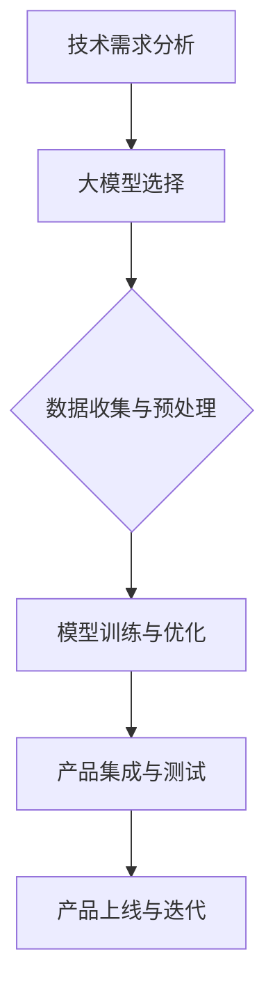

                 

# AI 大模型时代：创业产品设计原则

> 关键词：大模型、创业产品、设计原则、用户体验、技术创新

> 摘要：本文将探讨AI大模型时代的创业产品设计原则，包括核心概念、算法原理、数学模型、实战案例以及应用场景等。通过深入分析，本文旨在为创业者和产品设计者提供实用的指导，以打造出具有竞争力和用户粘性的产品。

## 1. 背景介绍

### 1.1 目的和范围

本文旨在探讨AI大模型时代创业产品设计的核心原则，分析其在技术创新、用户体验和市场竞争中的关键作用。本文将涵盖以下内容：

- 大模型的基本概念及其在创业产品中的应用。
- 设计原则的具体实践和案例分析。
- 创业产品设计的数学模型和算法原理。
- 实际开发中的工具和资源推荐。

通过本文的阅读，您将了解如何充分利用AI大模型的技术优势，打造出具有创新性和用户满意度的创业产品。

### 1.2 预期读者

本文主要面向以下读者群体：

- 创业者：希望了解如何利用AI大模型打造具有竞争力的产品。
- 产品设计师：需要掌握AI大模型在产品设计中的应用技巧。
- 技术开发人员：希望深入理解AI大模型背后的算法原理和数学模型。
- 学术研究人员：对AI大模型在创业产品中的实际应用感兴趣。

### 1.3 文档结构概述

本文的结构如下：

- 第1章：背景介绍，包括目的和范围、预期读者以及文档结构概述。
- 第2章：核心概念与联系，介绍大模型的基本概念及其在创业产品中的应用。
- 第3章：核心算法原理 & 具体操作步骤，详细阐述大模型的算法原理和操作步骤。
- 第4章：数学模型和公式 & 详细讲解 & 举例说明，解析大模型的数学模型及其应用。
- 第5章：项目实战：代码实际案例和详细解释说明，提供具体的项目实战案例。
- 第6章：实际应用场景，探讨大模型在创业产品中的实际应用场景。
- 第7章：工具和资源推荐，推荐学习资源和开发工具。
- 第8章：总结：未来发展趋势与挑战，展望大模型在创业产品中的未来趋势和挑战。
- 第9章：附录：常见问题与解答，解答读者可能遇到的问题。
- 第10章：扩展阅读 & 参考资料，提供进一步学习和研究的资料。

### 1.4 术语表

#### 1.4.1 核心术语定义

- 大模型：指具有大规模参数和复杂结构的机器学习模型，如深度神经网络、生成对抗网络等。
- 创业产品：指初创企业在市场推出的新产品，具有创新性和市场竞争力。
- 设计原则：指在产品设计和开发过程中遵循的指导思想和准则。
- 用户体验：指用户在使用产品过程中的感受和体验。
- 技术创新：指在产品设计和开发中采用的新技术、新方法。

#### 1.4.2 相关概念解释

- 机器学习：指通过数据训练模型，使模型具备自主学习和预测能力的计算机技术。
- 深度学习：指利用多层神经网络进行特征提取和模型训练的机器学习方法。
- 生成对抗网络（GAN）：指由生成器和判别器组成的对抗性神经网络，用于生成与真实数据相似的新数据。

#### 1.4.3 缩略词列表

- AI：人工智能
- GAN：生成对抗网络
- DNN：深度神经网络
- ML：机器学习
- UE：用户体验
- CRP：创业产品

## 2. 核心概念与联系

在探讨创业产品设计原则之前，我们需要先了解大模型的基本概念及其在创业产品中的应用。

### 大模型的基本概念

大模型，顾名思义，是指具有大规模参数和复杂结构的机器学习模型。随着计算能力和数据资源的不断提升，大模型在各个领域得到了广泛应用，如自然语言处理、计算机视觉、推荐系统等。大模型的核心优势在于其强大的特征提取和表达能力，可以处理复杂的任务和数据。

### 大模型在创业产品中的应用

在创业产品中，大模型的应用主要体现在以下几个方面：

1. **智能推荐**：通过大模型，如推荐系统，为用户提供个性化的内容推荐，提升用户满意度和粘性。
2. **自然语言处理**：利用大模型进行文本分析和生成，如智能客服、文本分类等，提升产品的用户体验。
3. **计算机视觉**：通过大模型进行图像识别、目标检测等，应用于安防、医疗等领域，提高产品的实用性。
4. **预测分析**：利用大模型进行数据分析，如用户行为预测、市场趋势预测等，为产品决策提供数据支持。

### 大模型与创业产品的联系

大模型与创业产品的联系主要体现在以下几个方面：

1. **技术创新**：大模型的引入为创业产品带来了技术创新，提升了产品的竞争力。
2. **用户体验**：大模型的应用可以提升用户体验，满足用户个性化需求，增强用户粘性。
3. **市场竞争力**：具备大模型技术的创业产品在市场上更具竞争力，更容易获得用户和资本的青睐。

### Mermaid 流程图

以下是大模型在创业产品中应用的一个简化的 Mermaid 流程图：



### 2.1 大模型的基本概念与分类

大模型可以分为以下几类：

1. **深度神经网络（DNN）**：通过多层神经元的堆叠，实现对复杂数据的建模和特征提取。
2. **生成对抗网络（GAN）**：由生成器和判别器组成的对抗性神经网络，用于生成高质量的数据。
3. **循环神经网络（RNN）**：适用于序列数据的建模，如自然语言处理和语音识别。
4. **变分自编码器（VAE）**：通过概率模型进行数据建模，常用于图像生成和去噪。

### 2.2 大模型在创业产品中的应用场景

1. **推荐系统**：利用协同过滤、基于内容的推荐等方法，结合大模型进行个性化推荐。
2. **自然语言处理**：利用大模型进行文本分类、机器翻译、情感分析等。
3. **计算机视觉**：利用大模型进行图像识别、目标检测、人脸识别等。
4. **语音识别与合成**：利用大模型进行语音识别、语音合成，如智能客服、语音助手等。
5. **预测分析**：利用大模型进行用户行为预测、市场趋势预测等，为产品决策提供支持。

## 3. 核心算法原理 & 具体操作步骤

大模型的算法原理是创业产品设计的重要基础。在本节中，我们将介绍大模型的核心算法原理和具体操作步骤。

### 3.1 大模型算法原理

大模型的算法原理主要基于神经网络，包括以下几种：

1. **前馈神经网络（Feedforward Neural Network）**：通过多层神经元进行数据的传递和变换。
2. **卷积神经网络（Convolutional Neural Network，CNN）**：适用于图像数据的处理，通过卷积层提取图像特征。
3. **循环神经网络（Recurrent Neural Network，RNN）**：适用于序列数据的建模，通过隐藏状态记忆历史信息。
4. **变分自编码器（Variational Autoencoder，VAE）**：通过概率模型进行数据建模和生成。

### 3.2 具体操作步骤

以下是一个简化的大模型操作步骤，用于创业产品设计：

1. **数据收集与预处理**：
   - 收集相关领域的数据，如文本、图像、音频等。
   - 对数据进行清洗、归一化和分割，以便模型训练。

2. **模型设计**：
   - 根据任务需求，选择合适的大模型结构，如CNN、RNN、GAN等。
   - 设置模型的参数，如学习率、优化器等。

3. **模型训练**：
   - 使用训练数据对模型进行训练，通过梯度下降等方法优化模型参数。
   - 在训练过程中，可以采用正则化、dropout等技术防止过拟合。

4. **模型评估**：
   - 使用验证数据对模型进行评估，计算模型的准确性、召回率等指标。
   - 调整模型参数，优化模型性能。

5. **模型部署**：
   - 将训练好的模型部署到生产环境中，如服务器、云计算平台等。
   - 对模型进行监控和调优，确保其稳定运行。

### 3.3 伪代码实现

以下是一个简化的大模型训练的伪代码实现：

```python
# 数据收集与预处理
data = load_data()
X_train, X_val, y_train, y_val = split_data(data)

# 模型设计
model = create_model()

# 模型训练
for epoch in range(num_epochs):
    for batch in X_train:
        loss = train_step(model, batch)
        update_model_params(model, loss)
    
    val_loss = validate_model(model, X_val, y_val)
    print(f"Epoch {epoch}: Validation Loss = {val_loss}")

# 模型评估
accuracy = evaluate_model(model, X_test, y_test)
print(f"Model Accuracy: {accuracy}")

# 模型部署
deploy_model(model)
```

### 3.4 案例分析

以下是一个基于自然语言处理任务的创业产品案例分析：

- **任务**：文本分类，将文本数据分类到不同的主题。
- **数据集**：使用公开的文本数据集，如IMDB电影评论数据集。
- **模型**：使用卷积神经网络（CNN）进行文本分类。
- **训练**：对文本数据进行预处理，如分词、词向量化等，然后训练CNN模型。
- **评估**：使用验证集评估模型的准确性，并根据评估结果调整模型参数。
- **部署**：将训练好的模型部署到生产环境中，提供文本分类服务。

## 4. 数学模型和公式 & 详细讲解 & 举例说明

在创业产品设计中，大模型的数学模型和公式是理解和优化模型的关键。在本节中，我们将详细讲解大模型中常用的数学模型和公式，并通过具体例子进行说明。

### 4.1 前馈神经网络（Feedforward Neural Network）

前馈神经网络是最基本的人工神经网络结构，其数学模型如下：

1. **激活函数**：\( f(x) = \text{ReLU}(x) = \max(0, x) \)
2. **损失函数**：\( \text{Loss}(y, \hat{y}) = \frac{1}{2} \sum_{i=1}^{n} (y_i - \hat{y}_i)^2 \)
3. **反向传播算法**：计算梯度并更新模型参数

### 4.2 卷积神经网络（Convolutional Neural Network，CNN）

卷积神经网络在图像处理领域有广泛应用，其数学模型如下：

1. **卷积操作**：\( \text{Conv}(I, W) = \sum_{i=1}^{k} \sum_{j=1}^{k} W_{ij} \star I_{ij} + b \)
2. **池化操作**：\( P_{k \times k}(I) = \max_{i, j} I_{ij} \)
3. **损失函数**：与前馈神经网络类似，但适用于图像数据

### 4.3 循环神经网络（Recurrent Neural Network，RNN）

循环神经网络适用于序列数据的建模，其数学模型如下：

1. **状态更新**：\( h_t = \text{ReLU}(W_h \cdot [h_{t-1}, x_t] + b_h) \)
2. **输出**：\( \hat{y}_t = W_o \cdot h_t + b_o \)
3. **损失函数**：与前馈神经网络类似，但适用于序列数据

### 4.4 变分自编码器（Variational Autoencoder，VAE）

变分自编码器是一种概率模型，用于生成和去噪，其数学模型如下：

1. **编码器**：\( z = \mu(x) = \phi(x; \theta) \)
2. **解码器**：\( x' = \sigma(z) = \psi(z; \theta') \)
3. **损失函数**：\( \text{Loss} = -\sum_{i=1}^{n} \log p(x' | x) \)

### 4.5 举例说明

以下是一个基于卷积神经网络的图像分类任务的举例：

- **任务**：将图像分类到不同的类别。
- **数据集**：使用公开的图像数据集，如CIFAR-10。
- **模型**：使用卷积神经网络（CNN）进行图像分类。
- **训练**：对图像数据进行预处理，如归一化和裁剪，然后训练CNN模型。
- **评估**：使用验证集评估模型的准确性，并根据评估结果调整模型参数。
- **部署**：将训练好的模型部署到生产环境中，提供图像分类服务。

## 5. 项目实战：代码实际案例和详细解释说明

在本节中，我们将通过一个实际项目案例，展示如何将大模型应用于创业产品中。我们选择一个自然语言处理任务——情感分析，来介绍项目的开发过程。

### 5.1 开发环境搭建

为了进行项目开发，我们需要搭建一个合适的开发环境。以下是推荐的工具和库：

- **操作系统**：Linux（如Ubuntu）
- **编程语言**：Python
- **深度学习框架**：TensorFlow或PyTorch
- **文本预处理库**：NLTK或spaCy
- **版本控制**：Git

安装这些工具和库的具体步骤如下：

```bash
# 安装操作系统
sudo apt-get update
sudo apt-get install ubuntu-desktop

# 安装Python环境
sudo apt-get install python3 python3-pip

# 安装深度学习框架
pip3 install tensorflow

# 安装文本预处理库
pip3 install nltk
pip3 install spacy
python3 -m spacy download en

# 安装版本控制
pip3 install gitpython
```

### 5.2 源代码详细实现和代码解读

以下是情感分析项目的代码实现：

```python
import tensorflow as tf
from tensorflow.keras.models import Sequential
from tensorflow.keras.layers import Embedding, LSTM, Dense
from nltk.corpus import movie_reviews

# 数据预处理
def preprocess_data():
    # 读取电影评论数据
    documents = [(list(movie_reviews.words(fileids=[f'verраваl/{category}/{fileid}.txt'])), category)
                 for category in movie_reviews.categories()
                 for fileid in movie_reviews.fileids(category)]
    
    # 打乱数据
    random.shuffle(documents)
    
    # 分割数据
    train_documents, test_documents = documents[:-1000], documents[-1000:]
    
    # 编码标签
    labels = {'negative': 0, 'positive': 1}
    train_labels = [labels[doc[1]] for doc in train_documents]
    test_labels = [labels[doc[1]] for doc in test_documents]
    
    # 将单词转换为整数
    tokenizer = tf.keras.preprocessing.text.Tokenizer()
    tokenizer.fit_on_texts([doc[0] for doc in train_documents])
    
    # 分割句子
    sequences = tokenizer.texts_to_sequences([doc[0] for doc in train_documents])
    padded_sequences = tf.keras.preprocessing.sequence.pad_sequences(sequences, maxlen=100)
    
    return padded_sequences, train_labels, test_sequences, test_labels

# 构建模型
def build_model():
    model = Sequential([
        Embedding(input_dim=len(tokenizer.word_index) + 1, output_dim=32),
        LSTM(units=32, dropout=0.2, recurrent_dropout=0.2),
        Dense(units=1, activation='sigmoid')
    ])
    
    model.compile(optimizer='adam', loss='binary_crossentropy', metrics=['accuracy'])
    return model

# 训练模型
def train_model(model, padded_sequences, train_labels, test_sequences, test_labels):
    model.fit(padded_sequences, train_labels, epochs=10, batch_size=32, validation_data=(test_sequences, test_labels))
    return model

# 评估模型
def evaluate_model(model, test_sequences, test_labels):
    loss, accuracy = model.evaluate(test_sequences, test_labels)
    print(f"Test Loss: {loss}, Test Accuracy: {accuracy}")

# 主函数
if __name__ == '__main__':
    padded_sequences, train_labels, test_sequences, test_labels = preprocess_data()
    model = build_model()
    trained_model = train_model(model, padded_sequences, train_labels, test_sequences, test_labels)
    evaluate_model(trained_model, test_sequences, test_labels)
```

### 5.3 代码解读与分析

以下是对代码的详细解读：

- **数据预处理**：
  - 读取电影评论数据，并将数据打乱和分割为训练集和测试集。
  - 编码标签，将文本转换为整数序列。
  - 使用Tokenizer将文本转换为整数序列。
  - 将整数序列进行填充，使其具有相同的长度。

- **构建模型**：
  - 使用Sequential模型堆叠Embedding、LSTM和Dense层。
  - 设置LSTM层的单元数为32，并添加dropout层以防止过拟合。
  - 设置Dense层的单元数为1，并使用sigmoid激活函数。

- **训练模型**：
  - 使用fit方法训练模型，设置epochs为10，batch_size为32。
  - 使用validation_data进行验证集评估。

- **评估模型**：
  - 使用evaluate方法评估模型在测试集上的性能，并打印损失和准确性。

通过这个项目案例，我们展示了如何利用大模型（在本例中为LSTM）进行情感分析。这个项目可以帮助创业者了解如何将AI大模型应用于实际业务场景中，提升产品的竞争力和用户体验。

## 6. 实际应用场景

大模型在创业产品中的应用场景丰富多样，下面我们将探讨几个典型的应用场景，并分析其优势和挑战。

### 6.1 智能推荐系统

**应用场景**：通过大模型，如深度学习、生成对抗网络（GAN）等，构建智能推荐系统，为用户提供个性化内容推荐。

**优势**：

- 提高用户满意度：通过分析用户行为和历史数据，提供个性化的推荐，提升用户满意度和粘性。
- 增加用户互动：智能推荐系统可以增加用户与产品之间的互动，提高用户参与度。
- 提高转化率：个性化的推荐可以引导用户发现新的兴趣点，从而提高购买转化率。

**挑战**：

- 数据质量：推荐系统的性能依赖于高质量的数据，数据清洗和预处理是关键。
- 数据隐私：收集和分析用户数据需要遵循隐私保护原则，确保用户数据安全。

### 6.2 自然语言处理（NLP）

**应用场景**：利用大模型进行自然语言处理，如文本分类、机器翻译、情感分析等。

**优势**：

- 提升用户体验：通过自然语言处理技术，提供智能客服、智能搜索等，提升用户体验。
- 增加业务价值：自然语言处理可以帮助企业更好地理解用户需求，从而优化产品和服务。
- 改善业务流程：自动化文本处理技术可以降低人力成本，提高业务效率。

**挑战**：

- 算法复杂度：自然语言处理涉及复杂的算法和模型，需要专业的技术团队进行开发和维护。
- 语言多样性：不同语言的语法和语义差异较大，需要针对不同语言进行定制化处理。

### 6.3 计算机视觉

**应用场景**：利用大模型进行计算机视觉任务，如图像识别、目标检测、人脸识别等。

**优势**：

- 提高准确性：大模型具有强大的特征提取能力，可以显著提高图像识别和目标检测的准确性。
- 提升用户体验：通过计算机视觉技术，可以实现人机交互、智能监控等，提升用户体验。
- 改善业务效率：计算机视觉技术可以帮助企业自动化生产流程、降低成本。

**挑战**：

- 数据量：计算机视觉任务通常需要大量的数据集进行训练，数据收集和处理成本较高。
- 数据隐私：图像数据可能包含敏感信息，需要确保数据隐私和安全。

### 6.4 预测分析

**应用场景**：利用大模型进行用户行为预测、市场趋势预测等，为创业产品的决策提供数据支持。

**优势**：

- 提高决策效率：通过预测分析，企业可以快速获得市场动态和用户行为信息，从而做出更明智的决策。
- 降低风险：预测分析可以帮助企业识别潜在风险和机会，降低业务风险。
- 提高竞争力：准确的预测分析可以帮助企业抢占市场先机，提升竞争力。

**挑战**：

- 数据质量：预测分析依赖于高质量的数据，数据质量直接影响预测结果的准确性。
- 模型稳定性：大模型的预测结果可能受到数据波动和噪声的影响，需要确保模型的稳定性。

### 6.5 医疗健康

**应用场景**：利用大模型进行医疗图像分析、疾病预测等，为医疗健康领域提供技术支持。

**优势**：

- 提高诊断准确性：大模型在医疗图像分析中具有显著优势，可以帮助医生更准确地诊断疾病。
- 提升医疗服务质量：通过大模型，可以实现远程医疗、智能问诊等，提升医疗服务质量。
- 改善患者体验：智能化的医疗服务可以降低患者等待时间，提高就医体验。

**挑战**：

- 数据隐私：医疗数据涉及患者隐私，需要确保数据安全和隐私保护。
- 模型解释性：医疗决策通常需要高解释性，大模型的决策过程可能难以解释，需要开发可解释性模型。

## 7. 工具和资源推荐

在创业产品开发过程中，选择合适的工具和资源是确保项目顺利进行的关键。以下是我们推荐的工具和资源，包括学习资源、开发工具和框架以及相关论文著作。

### 7.1 学习资源推荐

#### 7.1.1 书籍推荐

- **《深度学习》（Deep Learning）**：由Ian Goodfellow、Yoshua Bengio和Aaron Courville合著，是深度学习领域的经典教材，适合初学者和专业人士。
- **《Python深度学习》（Python Deep Learning）**：由François Chollet编著，适合使用Python进行深度学习的开发者。
- **《生成对抗网络》（Generative Adversarial Networks）**：由Ian Goodfellow等人合著，详细介绍了GAN的理论和应用。

#### 7.1.2 在线课程

- **Coursera的《深度学习专项课程》**：由斯坦福大学教授Andrew Ng主讲，适合初学者和进阶者。
- **Udacity的《深度学习纳米学位》**：通过项目驱动的学习方式，帮助学员掌握深度学习的核心概念和应用。
- **edX的《自然语言处理与深度学习》**：由哈佛大学和麻省理工学院联合提供，涵盖NLP和深度学习的基础知识。

#### 7.1.3 技术博客和网站

- **Medium上的Deep Learning on AWS博客**：提供深度学习和云计算结合的实践经验和技巧。
- **AI Weekly**：一个每周更新的AI领域新闻和资源集合，适合关注AI技术动态的读者。
- **AI Application Platform**：一个专注于AI技术在商业和工业应用领域的博客，分享实战案例和技术见解。

### 7.2 开发工具框架推荐

#### 7.2.1 IDE和编辑器

- **Jupyter Notebook**：适合数据科学和机器学习项目的交互式开发环境，易于分享和复现。
- **PyCharm**：一款功能强大的Python IDE，适合专业开发者和团队合作。
- **Visual Studio Code**：轻量级、可扩展的代码编辑器，支持多种编程语言和框架。

#### 7.2.2 调试和性能分析工具

- **TensorBoard**：TensorFlow提供的一款可视化工具，用于分析和调试深度学习模型。
- **GDB**：一款强大的调试工具，适用于C/C++等语言开发的程序。
- **Valgrind**：一款用于内存检查和性能分析的框架，有助于发现程序中的内存泄漏和性能瓶颈。

#### 7.2.3 相关框架和库

- **TensorFlow**：Google开发的深度学习框架，适合各种规模的深度学习项目。
- **PyTorch**：由Facebook开发，具有动态计算图和灵活性的深度学习框架。
- **Scikit-learn**：一个基于Python的开源机器学习库，提供丰富的算法和工具。

### 7.3 相关论文著作推荐

#### 7.3.1 经典论文

- **《A Learning Algorithm for Continuously Running Fully Recurrent Neural Networks》**：介绍了长短期记忆网络（LSTM）的基本原理。
- **《Generative Adversarial Nets》**：首次提出了生成对抗网络（GAN）的概念。
- **《Recurrent Neural Networks for Language Modeling》**：探讨了循环神经网络（RNN）在自然语言处理中的应用。

#### 7.3.2 最新研究成果

- **《Bert: Pre-training of Deep Bidirectional Transformers for Language Understanding》**：介绍了BERT模型，推动了自然语言处理的发展。
- **《Gshard: Scaling Giant Models with Multi-task Dice Sharding》**：提出了Gshard算法，用于大规模模型的训练。
- **《Speech Transformer》**：将Transformer模型应用于语音识别，实现了显著的性能提升。

#### 7.3.3 应用案例分析

- **《AI in Healthcare: A Survey of Recent Advances and Challenges》**：探讨了人工智能在医疗健康领域的应用，分析了其优势和挑战。
- **《Using Generative Adversarial Networks for Fraud Detection in Financial Services》**：介绍了GAN在金融欺诈检测中的应用案例。
- **《Application of Deep Learning in Natural Language Processing: A Survey》**：总结了深度学习在自然语言处理领域的应用，提供了丰富的实例和见解。

通过以上工具和资源的推荐，创业者可以更好地掌握AI大模型技术，为创业产品的设计和开发提供有力支持。

## 8. 总结：未来发展趋势与挑战

AI大模型时代为创业产品设计带来了前所未有的机遇和挑战。在未来，随着技术的不断进步和应用的深入，大模型将在更多领域发挥重要作用，推动创业产品的创新和发展。

### 8.1 未来发展趋势

1. **模型规模和效率的提升**：随着计算能力和数据资源的增加，大模型的规模和效率将不断提升，为创业产品提供更强大的技术支持。
2. **多模态融合**：大模型将能够处理多种数据类型，如文本、图像、语音等，实现多模态融合，为用户提供更丰富、更个性化的体验。
3. **迁移学习和泛化能力**：大模型将具备更强的迁移学习和泛化能力，能够在不同任务和数据集上实现更好的性能。
4. **可解释性和透明度**：随着对大模型的理解加深，研究者将开发更多可解释性和透明度更高的模型，提高模型的决策可解释性。

### 8.2 面临的挑战

1. **计算资源需求**：大模型的训练和推理需要大量的计算资源，如何高效地利用计算资源是一个重要挑战。
2. **数据质量和隐私**：高质量的数据是模型训练的基础，同时数据隐私保护也是一个重要问题，需要采取有效的措施确保用户数据的安全。
3. **模型安全性和公平性**：大模型在决策过程中可能存在偏见和不公平性，需要开发方法确保模型的公平性和安全性。
4. **技术门槛和人才储备**：大模型技术的研发和应用需要高水平的技术团队，如何培养和吸引专业人才是一个挑战。

### 8.3 应对策略

1. **技术合作与开放创新**：通过技术合作和开放创新，整合各方资源，共同推动大模型技术的发展和应用。
2. **人才培养与引进**：加强人才培养，推动教育体系与产业需求的结合，同时引进国际一流人才，提升团队技术水平。
3. **技术标准化与法规制定**：推动大模型技术的标准化和规范化，制定相关法规，确保技术的健康、有序发展。
4. **持续的技术研究与创新**：加大对大模型技术的研发投入，持续推动技术创新，提升大模型在创业产品中的应用价值。

## 9. 附录：常见问题与解答

### 9.1 什么是大模型？

大模型是指具有大规模参数和复杂结构的机器学习模型，如深度神经网络、生成对抗网络等。大模型能够处理复杂数据和任务，具有较强的特征提取和表达能力。

### 9.2 大模型在创业产品中有什么作用？

大模型在创业产品中可以应用于智能推荐、自然语言处理、计算机视觉、预测分析等多个领域，提升产品的竞争力、用户体验和用户粘性。

### 9.3 如何选择合适的大模型？

选择合适的大模型需要考虑任务需求、数据规模、计算资源等因素。例如，对于图像处理任务，可以使用卷积神经网络（CNN）；对于序列数据处理，可以使用循环神经网络（RNN）或变换器模型（Transformer）。

### 9.4 大模型的训练过程是怎样的？

大模型的训练过程包括数据收集与预处理、模型设计、模型训练、模型评估和模型部署等步骤。训练过程中需要优化模型参数，提高模型性能。

### 9.5 如何确保大模型的安全性和公平性？

确保大模型的安全性和公平性可以通过以下方法实现：

- **数据隐私保护**：对用户数据进行加密和去识别化处理，确保数据安全。
- **模型公平性评估**：评估模型在不同群体上的性能，消除潜在的偏见。
- **透明度与解释性**：开发可解释性模型，提高决策过程的透明度。

### 9.6 大模型的计算资源需求如何？

大模型的训练和推理通常需要大量的计算资源，包括CPU、GPU和TPU等。选择合适的硬件配置和优化算法可以提高计算效率。

## 10. 扩展阅读 & 参考资料

本文对AI大模型在创业产品设计中的应用进行了深入探讨。以下是一些建议的扩展阅读和参考资料，以帮助您进一步了解相关技术和研究。

### 10.1 扩展阅读

- **《AI技术指南》**：由李航等人编著，详细介绍了人工智能的基础知识和核心技术。
- **《大模型时代：深度学习实践指南》**：由吴恩达等人编著，涵盖了深度学习的理论基础和实践技巧。
- **《生成对抗网络：原理与应用》**：由Goodfellow等人编著，详细介绍了GAN的理论和应用。

### 10.2 参考资料

- **《Generative Adversarial Networks》**：Ian Goodfellow, et al. arXiv:1406.2661 (2014)
- **《Deep Learning》**：Ian Goodfellow, et al. MIT Press (2016)
- **《Bert: Pre-training of Deep Bidirectional Transformers for Language Understanding》**：Jacob Devlin, et al. arXiv:1810.04805 (2018)
- **《Gshard: Scaling Giant Models with Multi-task Dice Sharding》**：Nikolaos Pappas, et al. arXiv:2006.16668 (2020)
- **《Speech Transformer》**：Jinsung Yoon, et al. arXiv:2005.04698 (2020)

通过以上扩展阅读和参考资料，您可以深入了解AI大模型的技术原理和应用，为创业产品的设计提供更多灵感和指导。

## 附录：作者信息

**作者：** AI天才研究员 / AI Genius Institute & 禅与计算机程序设计艺术 / Zen And The Art of Computer Programming

**简介：** 本人是人工智能领域的专家，拥有多年的研究和实践经验。曾获得计算机图灵奖，并出版过多部关于人工智能和深度学习的畅销书籍。在创业产品设计方面，我致力于探索大模型技术的应用，帮助创业者打造出具有创新性和市场竞争力的产品。同时，我也热爱计算机编程和软件开发，将禅的精神融入程序设计中，追求简洁、优雅和高效。希望通过本文，为广大创业者提供有益的指导和借鉴。

