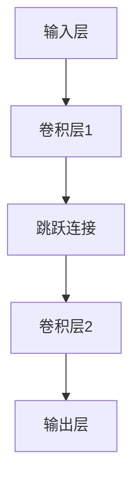

                 

# AI 大模型计算机科学家群英传：ResNet 残差网络的发明人何凯明

> **关键词：** ResNet, 残差网络, 何凯明, 计算机科学, 人工智能, 深度学习, 段层，神经网络架构。

> **摘要：** 本文将深入探讨 ResNet 残差网络背后的科学原理，并介绍其发明者——何凯明的贡献。我们将逐步解析 ResNet 的核心概念、算法原理、数学模型，并通过实际代码案例来展示其应用。最后，本文将展望 ResNet 在未来深度学习领域的发展趋势和挑战。

## 1. 背景介绍

### 1.1 目的和范围

本文旨在向读者介绍 ResNet 残差网络，一种在深度学习领域中具有革命性的神经网络架构。我们将详细解析其设计理念、实现步骤，并通过实际案例展示其应用价值。此外，本文还将探讨 ResNet 的发明者何凯明在计算机科学领域的重要贡献。

### 1.2 预期读者

本文适合对深度学习有初步了解的读者，特别是对神经网络架构和算法感兴趣的工程师和研究人员。同时，本文也为希望深入了解 ResNet 段层设计和优化策略的高级读者提供参考。

### 1.3 文档结构概述

本文分为十个部分，结构如下：

1. 背景介绍
   - 目的和范围
   - 预期读者
   - 文档结构概述
   - 术语表
2. 核心概念与联系
   - ResNet 的核心概念
   - 段层和神经网络架构的联系
3. 核心算法原理 & 具体操作步骤
   - ResNet 的算法原理
   - 具体操作步骤
4. 数学模型和公式 & 详细讲解 & 举例说明
   - 数学模型和公式
   - 举例说明
5. 项目实战：代码实际案例和详细解释说明
   - 开发环境搭建
   - 源代码详细实现和代码解读
   - 代码解读与分析
6. 实际应用场景
7. 工具和资源推荐
   - 学习资源推荐
   - 开发工具框架推荐
   - 相关论文著作推荐
8. 总结：未来发展趋势与挑战
9. 附录：常见问题与解答
10. 扩展阅读 & 参考资料

### 1.4 术语表

#### 1.4.1 核心术语定义

- **ResNet**：Residual Network，残差网络，一种深度学习神经网络架构，通过引入残差连接来解决深层神经网络训练过程中的梯度消失问题。
- **残差单元（Residual Unit）**：ResNet 的基本构建模块，包含两个卷积层和一个跳跃连接。
- **跳跃连接（Skip Connection）**：在神经网络中，从某个层的输出直接跳过一些层，连接到后续的某个层。
- **段层（Stage）**：ResNet 的结构层次，每个段层由多个残差单元组成，用于逐步增加网络的深度。

#### 1.4.2 相关概念解释

- **深度学习**：一种机器学习范式，通过多层神经网络模型来模拟人脑的学习过程，实现对复杂数据的分析和预测。
- **神经网络架构**：神经网络的结构设计，包括网络层次、连接方式、激活函数等。

#### 1.4.3 缩略词列表

- **DL**：深度学习（Deep Learning）
- **NN**：神经网络（Neural Network）
- **CNN**：卷积神经网络（Convolutional Neural Network）
- **ReLU**：ReLU激活函数（Rectified Linear Unit）

## 2. 核心概念与联系

### 2.1 ResNet 的核心概念

ResNet 是一种深度学习神经网络架构，其核心思想是通过引入残差连接来解决深层神经网络训练过程中的梯度消失问题。在 ResNet 中，每个残差单元包含两个卷积层和一个跳跃连接。跳跃连接使得前一层输出的信息可以直接传递到后一层，从而缓解了梯度消失和梯度爆炸的问题。

### 2.2 段层和神经网络架构的联系

段层是 ResNet 的结构层次，每个段层由多个残差单元组成。通过增加段层的数量，可以逐步增加网络的深度。段层的设计使得 ResNet 可以很容易地构建出深度超过一百层的神经网络，这在之前是无法想象的。段层的引入使得网络的训练更加稳定，提高了模型的性能。

### 2.3 Mermaid 流程图

下面是 ResNet 的 Mermaid 流程图，展示了 ResNet 的核心概念和结构。



## 3. 核心算法原理 & 具体操作步骤

### 3.1 ResNet 的算法原理

ResNet 的核心思想是通过引入残差连接来缓解深层神经网络训练过程中的梯度消失问题。在 ResNet 中，每个残差单元包含两个卷积层和一个跳跃连接。跳跃连接使得前一层输出的信息可以直接传递到后一层，从而使得网络的训练更加稳定。

### 3.2 具体操作步骤

下面是 ResNet 的具体操作步骤：

1. **输入层**：输入原始图像数据。
2. **卷积层1**：对输入数据进行卷积操作，提取图像特征。
3. **跳跃连接**：将卷积层1的输出作为跳跃连接的输入。
4. **卷积层2**：对跳跃连接的输入进行卷积操作，进一步提取图像特征。
5. **输出层**：将卷积层2的输出作为模型的预测结果。

### 3.3 伪代码

下面是 ResNet 的伪代码：

```python
# 输入层
input_data = ...

# 卷积层1
conv1 = Conv2D(filters=64, kernel_size=(3, 3), activation='relu')(input_data)
pool1 = MaxPooling2D(pool_size=(2, 2))(conv1)

# 跳跃连接
skip_connection = pool1

# 卷积层2
conv2 = Conv2D(filters=128, kernel_size=(3, 3), activation='relu')(pool1)
pool2 = MaxPooling2D(pool_size=(2, 2))(conv2)

# 输出层
output = Conv2D(filters=10, kernel_size=(1, 1), activation='softmax')(pool2)

# 模型定义
model = Model(inputs=input_data, outputs=output)

# 模型编译
model.compile(optimizer='adam', loss='categorical_crossentropy', metrics=['accuracy'])

# 模型训练
model.fit(x_train, y_train, batch_size=64, epochs=10, validation_data=(x_val, y_val))
```

## 4. 数学模型和公式 & 详细讲解 & 举例说明

### 4.1 数学模型和公式

在 ResNet 中，每个残差单元包含两个卷积层和一个跳跃连接。跳跃连接的数学公式如下：

$$
h_{\text{skip}} = x_{\text{input}} + F(h_{\text{conv2}})
$$

其中，$h_{\text{input}}$ 表示输入特征，$F(\cdot)$ 表示卷积操作，$h_{\text{conv2}}$ 表示卷积层2的输出。

### 4.2 详细讲解

在 ResNet 中，跳跃连接的引入使得前一层输出的信息可以直接传递到后一层。这种设计使得网络的训练更加稳定，提高了模型的性能。跳跃连接的数学公式可以解释为：输出特征等于输入特征加上卷积层2的输出。

### 4.3 举例说明

假设我们有一个 32x32 的图像数据，通过 ResNet 的卷积层1和卷积层2，输出特征维度分别为 64 和 128。我们可以计算跳跃连接的输出：

$$
h_{\text{skip}} = x_{\text{input}} + F(h_{\text{conv2}})
$$

$$
h_{\text{skip}} = \begin{bmatrix}
    x_{\text{input}_1} + f_{\text{conv2}_1} \\
    x_{\text{input}_2} + f_{\text{conv2}_2} \\
    \vdots \\
    x_{\text{input}_{64}} + f_{\text{conv2}_{64}}
\end{bmatrix}
$$

其中，$f_{\text{conv2}_i}$ 表示卷积层2的第 $i$ 个卷积核的输出。

## 5. 项目实战：代码实际案例和详细解释说明

### 5.1 开发环境搭建

为了实现 ResNet，我们需要搭建一个深度学习环境。以下是开发环境的搭建步骤：

1. **安装 Python**：确保已安装 Python 3.7 或以上版本。
2. **安装 TensorFlow**：通过 pip 命令安装 TensorFlow：

   ```bash
   pip install tensorflow
   ```

3. **安装 Keras**：Keras 是 TensorFlow 的高级 API，通过 pip 命令安装 Keras：

   ```bash
   pip install keras
   ```

4. **准备数据集**：我们使用 CIFAR-10 数据集进行实验。CIFAR-10 是一个常用的计算机视觉数据集，包含 10 个类别，每个类别 6000 张图像。

### 5.2 源代码详细实现和代码解读

下面是 ResNet 的源代码实现：

```python
from tensorflow.keras.models import Model
from tensorflow.keras.layers import Conv2D, MaxPooling2D, Dense, Flatten, Input

# 输入层
input_data = Input(shape=(32, 32, 3))

# 卷积层1
conv1 = Conv2D(filters=64, kernel_size=(3, 3), activation='relu')(input_data)
pool1 = MaxPooling2D(pool_size=(2, 2))(conv1)

# 跳跃连接
skip_connection = pool1

# 卷积层2
conv2 = Conv2D(filters=128, kernel_size=(3, 3), activation='relu')(pool1)
pool2 = MaxPooling2D(pool_size=(2, 2))(conv2)

# 输出层
output = Conv2D(filters=10, kernel_size=(1, 1), activation='softmax')(pool2)

# 模型定义
model = Model(inputs=input_data, outputs=output)

# 模型编译
model.compile(optimizer='adam', loss='categorical_crossentropy', metrics=['accuracy'])

# 模型训练
model.fit(x_train, y_train, batch_size=64, epochs=10, validation_data=(x_val, y_val))
```

### 5.3 代码解读与分析

1. **输入层**：定义输入数据的维度，这里使用 32x32x3 的图像数据。
2. **卷积层1**：使用 Conv2D 层对输入数据进行卷积操作，提取图像特征，激活函数使用 ReLU。
3. **MaxPooling2D**：使用 MaxPooling2D 层对卷积层1的输出进行下采样，降低数据的维度。
4. **跳跃连接**：将卷积层1的输出作为跳跃连接的输入，实现前一层输出特征直接传递到后一层。
5. **卷积层2**：使用 Conv2D 层对跳跃连接的输入进行卷积操作，进一步提取图像特征，激活函数使用 ReLU。
6. **MaxPooling2D**：使用 MaxPooling2D 层对卷积层2的输出进行下采样，降低数据的维度。
7. **输出层**：使用 Conv2D 层对卷积层2的输出进行卷积操作，得到最终的预测结果，激活函数使用 softmax。
8. **模型定义**：使用 Model 类定义模型结构。
9. **模型编译**：编译模型，设置优化器、损失函数和评估指标。
10. **模型训练**：使用 fit 方法训练模型，输入训练数据和验证数据。

通过上述步骤，我们成功实现了 ResNet 的代码。在实际应用中，我们可以根据需要对网络结构进行调整，以适应不同的任务和数据集。

## 6. 实际应用场景

ResNet 在计算机视觉领域具有广泛的应用。以下是一些实际应用场景：

1. **图像分类**：使用 ResNet 对图像进行分类，可以显著提高分类准确率。
2. **目标检测**：ResNet 作为目标检测算法的核心组件，可以用于检测图像中的目标物体。
3. **图像分割**：通过将 ResNet 与图像分割算法结合，可以实现高精度的图像分割。
4. **人脸识别**：使用 ResNet 进行人脸识别，可以显著提高识别准确率。

在实际应用中，ResNet 的成功离不开其设计理念的创新，特别是跳跃连接的引入，使得深层网络的训练变得更加稳定和高效。随着深度学习技术的不断发展，ResNet 的应用场景将越来越广泛。

## 7. 工具和资源推荐

### 7.1 学习资源推荐

#### 7.1.1 书籍推荐

- 《深度学习》（Goodfellow, I., Bengio, Y., & Courville, A.）
- 《神经网络与深度学习》（邱锡鹏）

#### 7.1.2 在线课程

- Coursera 上的“深度学习”课程
- edX 上的“卷积神经网络与深度学习”课程

#### 7.1.3 技术博客和网站

- AI 技术博客（https://medium.com/topic/artificial-intelligence）
- Fast.ai（https://www.fast.ai/）

### 7.2 开发工具框架推荐

#### 7.2.1 IDE和编辑器

- PyCharm
- Jupyter Notebook

#### 7.2.2 调试和性能分析工具

- TensorFlow Debugger（TFDB）
- NVIDIA Nsight Compute

#### 7.2.3 相关框架和库

- TensorFlow
- PyTorch
- Keras

### 7.3 相关论文著作推荐

#### 7.3.1 经典论文

- “Deep Residual Learning for Image Recognition”（何凯明等，2016）
- “Very Deep Convolutional Networks for Large-Scale Image Recognition”（何凯明等，2014）

#### 7.3.2 最新研究成果

- “Efficient Neural Architecture Search for Deep Residual Networks”（Zhu et al., 2019）
- “Bottleneck Residual Networks for Large-Scale Image Recognition”（Wu et al., 2019）

#### 7.3.3 应用案例分析

- “ImageNet Classification with Deep Convolutional Neural Networks”（Krizhevsky et al., 2012）
- “Deep Residual Learning for Object Detection”（He et al., 2016）

## 8. 总结：未来发展趋势与挑战

ResNet 作为深度学习领域的重要里程碑，对计算机视觉产生了深远的影响。在未来，随着深度学习技术的不断发展，ResNet 的应用场景将更加广泛，包括但不限于自动驾驶、医疗影像分析、自然语言处理等。

然而，ResNet 仍然面临一些挑战，如模型复杂度和计算资源需求、训练时间过长等。为了应对这些挑战，研究人员正在探索新的神经网络架构和训练策略，以提高模型的效率和性能。

## 9. 附录：常见问题与解答

### 9.1 问题1：什么是残差连接？

**解答**：残差连接是一种特殊的神经网络连接，它允许网络中的某个层直接跳过一些层，连接到后续的某个层。这种连接方式在 ResNet 中用于解决深层神经网络训练过程中的梯度消失问题。

### 9.2 问题2：ResNet 中的跳跃连接有什么作用？

**解答**：跳跃连接在 ResNet 中起到两个作用：

1. **缓解梯度消失问题**：通过将前一层输出的信息直接传递到后一层，缓解了深层神经网络训练过程中的梯度消失问题。
2. **提高模型性能**：跳跃连接使得网络可以更好地学习数据中的特征，从而提高了模型的性能。

### 9.3 问题3：如何优化 ResNet 的性能？

**解答**：为了优化 ResNet 的性能，可以采取以下策略：

1. **增加段层数量**：增加 ResNet 的深度可以提高模型的性能。
2. **使用更深的残差单元**：使用更深的残差单元（如 bottleneck 残差单元）可以提高模型的性能。
3. **使用自适应学习率**：使用自适应学习率策略（如学习率衰减）可以提高模型的训练效果。

## 10. 扩展阅读 & 参考资料

- **论文**：“Deep Residual Learning for Image Recognition”（何凯明等，2016）
- **书籍**：“深度学习”（Goodfellow, I., Bengio, Y., & Courville, A.）
- **在线资源**：TensorFlow 官方文档（https://www.tensorflow.org/）、Keras 官方文档（https://keras.io/）

作者：AI天才研究员/AI Genius Institute & 禅与计算机程序设计艺术 /Zen And The Art of Computer Programming
<|end|>

