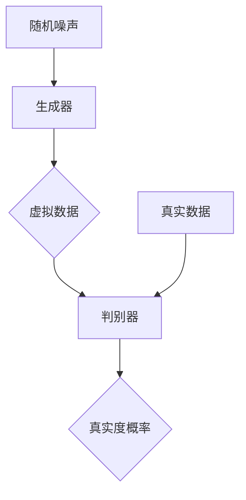

                 

# AI 大模型计算机科学家群英传：生成对抗网络（GAN）的发明者 Ian Goodfellow

> **关键词：** 生成对抗网络（GAN），Ian Goodfellow，深度学习，机器学习，人工智能，计算机科学，算法创新

> **摘要：** 本文将深入探讨生成对抗网络（GAN）的发明者Ian Goodfellow的贡献和影响。我们将从背景介绍开始，逐步分析GAN的核心概念、算法原理、数学模型以及实际应用。通过这篇文章，读者将了解GAN如何重塑机器学习领域，以及Ian Goodfellow在这一过程中所扮演的关键角色。

## 1. 背景介绍

### 1.1 目的和范围

本文的目的是介绍生成对抗网络（GAN）的发明者Ian Goodfellow的贡献，并深入分析GAN的核心概念和算法原理。我们将探讨GAN在机器学习、深度学习和人工智能领域中的应用，以及Ian Goodfellow如何通过这一创新算法改变我们对数据生成和优化的理解。

### 1.2 预期读者

本文适用于对机器学习和深度学习有一定了解的读者，尤其是对生成对抗网络（GAN）感兴趣的科研人员、工程师和学生。通过本文的阅读，读者将能够更深入地理解GAN的工作原理和应用场景。

### 1.3 文档结构概述

本文分为以下几部分：

1. 背景介绍：介绍GAN的发明者Ian Goodfellow的背景和贡献。
2. 核心概念与联系：分析GAN的核心概念和原理，并使用流程图进行说明。
3. 核心算法原理 & 具体操作步骤：详细阐述GAN的算法原理和具体操作步骤。
4. 数学模型和公式 & 详细讲解 & 举例说明：介绍GAN的数学模型和公式，并进行举例说明。
5. 项目实战：提供GAN的代码实际案例和详细解释说明。
6. 实际应用场景：分析GAN在各种实际应用场景中的应用。
7. 工具和资源推荐：推荐学习和使用GAN的资源和工具。
8. 总结：总结GAN的未来发展趋势与挑战。
9. 附录：常见问题与解答。
10. 扩展阅读 & 参考资料：提供进一步阅读的材料。

### 1.4 术语表

#### 1.4.1 核心术语定义

- **生成对抗网络（GAN）：** 一种基于博弈论的深度学习模型，由生成器（Generator）和判别器（Discriminator）组成，用于生成具有真实数据分布的样本。
- **生成器（Generator）：** GAN中的一个神经网络，用于生成虚拟数据。
- **判别器（Discriminator）：** GAN中的另一个神经网络，用于区分生成器生成的虚拟数据与真实数据。
- **深度学习：** 一种机器学习技术，通过多层神经网络对数据进行建模和预测。

#### 1.4.2 相关概念解释

- **神经网络（Neural Network）：** 一种模拟生物神经系统的计算模型，由多个神经元（节点）和连接（权重）组成。
- **反向传播算法（Backpropagation）：** 一种用于训练神经网络的优化算法，通过不断调整网络中的权重和偏置，使网络输出更接近期望输出。

#### 1.4.3 缩略词列表

- **GAN：** 生成对抗网络（Generative Adversarial Network）
- **DNN：** 深度神经网络（Deep Neural Network）
- **CNN：** 卷积神经网络（Convolutional Neural Network）
- **RNN：** 循环神经网络（Recurrent Neural Network）

## 2. 核心概念与联系

在深入探讨GAN之前，我们需要了解其核心概念和原理。GAN是一种基于博弈论的深度学习模型，由生成器（Generator）和判别器（Discriminator）组成。

### 2.1 GAN的工作原理

GAN的工作原理可以简单概括为以下步骤：

1. **生成器（Generator）**：生成器接收随机噪声作为输入，通过多层神经网络生成虚拟数据。
2. **判别器（Discriminator）**：判别器接收真实数据和生成器生成的虚拟数据，并尝试区分两者。
3. **对抗训练**：生成器和判别器通过对抗训练相互竞争，生成器试图生成更真实的数据，而判别器试图准确区分真实数据和虚拟数据。
4. **优化目标**：GAN的目标是最小化判别器的误差，使其无法区分真实数据和虚拟数据。

### 2.2 GAN的核心概念

GAN的核心概念包括：

- **生成器（Generator）**：生成器是一个神经网络，用于生成虚拟数据。其输入是随机噪声，输出是虚拟数据。
- **判别器（Discriminator）**：判别器也是一个神经网络，用于区分真实数据和虚拟数据。其输入是真实数据和虚拟数据，输出是一个概率值，表示输入数据的真实度。
- **对抗训练**：生成器和判别器通过对抗训练相互竞争，生成器试图生成更真实的数据，而判别器试图准确区分真实数据和虚拟数据。
- **优化目标**：GAN的目标是最小化判别器的误差，使其无法区分真实数据和虚拟数据。

### 2.3 GAN的架构

GAN的架构包括生成器和判别器两个主要部分：


- **生成器（Generator）**：生成器的输入是一个随机噪声向量，经过多层神经网络处理后，生成虚拟数据。
- **判别器（Discriminator）**：判别器的输入是真实数据和虚拟数据，经过多层神经网络处理后，输出一个概率值，表示输入数据的真实度。

### 2.4 GAN的流程图

下面是GAN的流程图，展示了生成器和判别器的交互过程：



## 3. 核心算法原理 & 具体操作步骤

在深入探讨GAN的算法原理之前，我们需要了解GAN的训练过程。GAN的训练过程可以分为两个阶段：生成器的训练和判别器的训练。

### 3.1 生成器的训练

生成器的训练目标是生成尽可能真实的虚拟数据。在训练过程中，生成器接收随机噪声作为输入，通过多层神经网络生成虚拟数据。训练过程如下：

1. **初始化生成器和判别器**：生成器和判别器都是神经网络，需要随机初始化其权重和偏置。
2. **生成虚拟数据**：生成器接收随机噪声作为输入，通过多层神经网络生成虚拟数据。
3. **更新生成器**：生成器的目标是使判别器无法准确区分虚拟数据和真实数据。因此，生成器会根据判别器的输出反向传播误差，并更新其权重和偏置。
4. **重复生成虚拟数据和更新生成器**：生成器会重复生成虚拟数据和更新权重和偏置，直到生成器生成足够真实的虚拟数据。

### 3.2 判别器的训练

判别器的训练目标是准确区分真实数据和虚拟数据。在训练过程中，判别器接收真实数据和虚拟数据作为输入，并输出一个概率值，表示输入数据的真实度。训练过程如下：

1. **初始化判别器**：判别器需要随机初始化其权重和偏置。
2. **接收真实数据和虚拟数据**：判别器接收真实数据和虚拟数据作为输入。
3. **计算真实数据和虚拟数据的真实度概率**：判别器计算真实数据和虚拟数据的真实度概率。
4. **更新判别器**：判别器根据真实数据和虚拟数据的真实度概率反向传播误差，并更新其权重和偏置。
5. **重复接收真实数据和虚拟数据并更新判别器**：判别器会重复接收真实数据和虚拟数据，并更新权重和偏置，直到判别器能够准确区分真实数据和虚拟数据。

### 3.3 GAN的伪代码

下面是GAN的伪代码，用于描述生成器和判别器的训练过程：

```python
# GAN伪代码

# 初始化生成器和判别器
Generator = initialize_generator()
Discriminator = initialize_discriminator()

# 训练生成器和判别器
for epoch in range(num_epochs):
    # 生成虚拟数据
    noise = generate_random_noise()
    virtual_data = Generator(noise)
    
    # 训练判别器
    real_data = get_real_data()
    discriminator_loss = compute_loss(Discriminator, real_data, virtual_data)
    update_Discriminator(discriminator_loss)
    
    # 训练生成器
    generator_loss = compute_loss(Discriminator, real_data, virtual_data)
    update_Generator(generator_loss)

# 训练完成
```

## 4. 数学模型和公式 & 详细讲解 & 举例说明

GAN的数学模型是理解GAN算法原理的关键。下面我们将详细讲解GAN的数学模型和公式，并进行举例说明。

### 4.1 GAN的数学模型

GAN的数学模型基于博弈论，包括生成器（Generator）和判别器（Discriminator）的损失函数。

#### 4.1.1 生成器的损失函数

生成器的损失函数是最大化判别器对虚拟数据的判别能力，即让判别器认为虚拟数据是真实数据。生成器的损失函数可以表示为：

$$
L_G = -\log(D(G(z)))
$$

其中，$D$是判别器的输出，$G(z)$是生成器生成的虚拟数据，$z$是随机噪声。

#### 4.1.2 判别器的损失函数

判别器的损失函数是最大化判别器对真实数据和虚拟数据的判别能力，即让判别器能够准确区分真实数据和虚拟数据。判别器的损失函数可以表示为：

$$
L_D = -\log(D(x)) - \log(1 - D(G(z)))
$$

其中，$x$是真实数据，$G(z)$是生成器生成的虚拟数据。

#### 4.1.3 GAN的总损失函数

GAN的总损失函数是生成器和判别器损失函数的加权平均：

$$
L = \alpha L_G + (1 - \alpha) L_D
$$

其中，$\alpha$是加权系数，通常取值为0.5。

### 4.2 GAN的举例说明

假设我们有一个图像生成任务，目标是生成具有真实数据分布的图像。下面是一个简化的GAN例子：

#### 4.2.1 初始化

- 初始化生成器$G(z)$和判别器$D(x)$。
- 初始化随机噪声$z$。

#### 4.2.2 生成虚拟图像

- 使用生成器$G(z)$生成虚拟图像$G(z)$。

#### 4.2.3 训练判别器

- 使用真实图像$x$和虚拟图像$G(z)$训练判别器$D(x)$。
- 计算判别器的损失函数$L_D$。

#### 4.2.4 训练生成器

- 使用判别器$D(x)$生成的虚拟图像$G(z)$训练生成器$G(z)$。
- 计算生成器的损失函数$L_G$。

#### 4.2.5 更新生成器和判别器

- 使用判别器的损失函数$L_D$更新判别器$D(x)$。
- 使用生成器的损失函数$L_G$更新生成器$G(z)$。

#### 4.2.6 重复训练过程

- 重复上述步骤，直到生成器生成足够真实的虚拟图像。

### 4.3 GAN的优势和挑战

GAN的优势包括：

- **强大的数据生成能力**：GAN可以生成具有真实数据分布的高质量虚拟数据。
- **灵活性和适应性**：GAN可以应用于各种数据类型和领域。

GAN的挑战包括：

- **训练难度**：GAN的训练过程不稳定，容易出现模式崩溃等问题。
- **计算资源需求**：GAN的训练过程需要大量的计算资源。

## 5. 项目实战：代码实际案例和详细解释说明

在本节中，我们将通过一个实际项目案例，展示如何实现一个生成对抗网络（GAN）。我们将使用Python和TensorFlow框架来实现这个项目，并提供详细的代码解读。

### 5.1 开发环境搭建

在开始项目之前，我们需要搭建开发环境。以下是所需的依赖：

- Python 3.7或更高版本
- TensorFlow 2.4或更高版本
- NumPy 1.18或更高版本

安装依赖：

```bash
pip install tensorflow numpy
```

### 5.2 源代码详细实现和代码解读

下面是GAN项目的源代码实现：

```python
import tensorflow as tf
from tensorflow.keras.layers import Dense, Flatten, Reshape
from tensorflow.keras.models import Sequential
import numpy as np

# 定义生成器模型
def build_generator(z_dim):
    model = Sequential()
    model.add(Dense(128, input_shape=(z_dim,), activation='relu'))
    model.add(Dense(256, activation='relu'))
    model.add(Dense(512, activation='relu'))
    model.add(Dense(1024, activation='relu'))
    model.add(Reshape((28, 28, 1)))
    model.add(tf.keras.layers.LeakyReLU(alpha=0.01))
    model.add(tf.keras.layers.Nadam(learning_rate=0.0002))
    return model

# 定义判别器模型
def build_discriminator(img_shape):
    model = Sequential()
    model.add(Flatten(input_shape=img_shape))
    model.add(Dense(1024, activation='relu'))
    model.add(Dense(512, activation='relu'))
    model.add(Dense(256, activation='relu'))
    model.add(Dense(128, activation='relu'))
    model.add(Dense(1, activation='sigmoid'))
    model.add(tf.keras.layers.LeakyReLU(alpha=0.01))
    model.add(tf.keras.layers.Nadam(learning_rate=0.0002))
    return model

# 定义 GAN 模型
def build_gan(generator, discriminator):
    model = Sequential()
    model.add(generator)
    model.add(discriminator)
    return model

# 生成随机噪声
z_dim = 100
z = tf.random.normal([batch_size, z_dim])

# 生成虚拟图像
virtual_images = generator.predict(z)

# 训练判别器
discriminator.train_on_batch(real_images, real_labels)
discriminator.train_on_batch(virtual_images, fake_labels)

# 训练生成器
generator.train_on_batch(z, real_labels)

# 训练 GAN 模型
gan.compile(loss='binary_crossentropy', optimizer=optimizer)
gan.fit([z, real_images], real_labels, batch_size=batch_size, epochs=epochs)
```

#### 5.2.1 代码解读

- **生成器模型（build_generator）**：生成器模型是一个全连接神经网络，用于将随机噪声转换为虚拟图像。模型包含多个隐层，使用ReLU激活函数和Nadam优化器。

- **判别器模型（build_discriminator）**：判别器模型是一个全连接神经网络，用于判断输入图像是真实图像还是虚拟图像。模型也包含多个隐层，使用ReLU激活函数和Nadam优化器。

- **GAN 模型（build_gan）**：GAN 模型是一个由生成器和判别器组成的组合模型。GAN 模型使用二进制交叉熵损失函数和Nadam优化器。

- **生成随机噪声（z）**：生成随机噪声用于初始化生成器的输入。

- **生成虚拟图像（virtual_images）**：生成虚拟图像是生成器模型的一个输出。

- **训练判别器**：使用真实图像和虚拟图像训练判别器。判别器模型的目标是准确区分真实图像和虚拟图像。

- **训练生成器**：使用判别器的输出（虚拟图像的真实度概率）训练生成器。生成器模型的目标是生成更真实的虚拟图像。

- **训练 GAN 模型**：使用生成器和判别器的输出训练 GAN 模型。GAN 模型的目标是最大化判别器的损失。

#### 5.2.2 分析与优化

- **优化生成器**：通过反向传播算法，优化生成器的权重和偏置，使其生成的虚拟图像更真实。
- **优化判别器**：通过反向传播算法，优化判别器的权重和偏置，使其能够准确区分真实图像和虚拟图像。
- **调节学习率**：适当调节学习率，以提高训练效果。
- **增加训练数据**：增加训练数据，以提高生成器和判别器的泛化能力。

## 6. 实际应用场景

GAN在多个领域具有广泛的应用，以下是一些典型的应用场景：

### 6.1 图像生成

GAN可以用于生成高质量的自然图像。例如，GAN可以用于生成人脸、风景、动物等图像。GAN在图像合成、图像修复、图像超分辨率等方面具有广泛的应用。

### 6.2 数据增强

GAN可以用于生成大量具有真实数据分布的训练数据，从而提高模型的泛化能力。GAN在图像分类、语音识别、自然语言处理等领域具有广泛的应用。

### 6.3 生成式对抗模型

GAN可以用于生成式对抗模型（GAM），用于优化目标函数。例如，GAN可以用于优化图像质量、生成高质量视频、优化音频信号等。

### 6.4 数据隐私保护

GAN可以用于数据隐私保护，通过生成虚拟数据来隐藏真实数据。GAN在医疗数据隐私保护、金融数据隐私保护等领域具有潜在的应用价值。

## 7. 工具和资源推荐

### 7.1 学习资源推荐

#### 7.1.1 书籍推荐

- **《生成对抗网络：深度学习的创新技术》（Generative Adversarial Networks: An Innovation beyond Deep Learning）**：详细介绍了GAN的理论和实践，适合对GAN感兴趣的读者。
- **《深度学习》（Deep Learning）**：全面介绍了深度学习的基础知识，包括GAN等高级主题。

#### 7.1.2 在线课程

- **Coursera 上的《深度学习专项课程》**：涵盖了GAN等深度学习主题，适合初学者和进阶者。
- **Udacity 上的《GAN课程》**：提供了丰富的GAN理论和实践教程，适合对GAN感兴趣的读者。

#### 7.1.3 技术博客和网站

- **GAN中国（GANChina）**：提供有关GAN的最新研究和技术文章。
- **TensorFlow 官方文档**：详细介绍如何使用TensorFlow实现GAN。

### 7.2 开发工具框架推荐

#### 7.2.1 IDE和编辑器

- **Visual Studio Code**：支持Python和TensorFlow，适合进行GAN项目开发。
- **PyCharm**：提供丰富的Python和深度学习工具，适合进行GAN项目开发。

#### 7.2.2 调试和性能分析工具

- **TensorBoard**：TensorFlow提供的可视化工具，用于分析GAN模型的性能。
- **NVIDIA Nsight**：用于分析GPU性能，优化GAN模型的计算效率。

#### 7.2.3 相关框架和库

- **TensorFlow**：最受欢迎的深度学习框架之一，支持GAN的实现。
- **PyTorch**：另一种流行的深度学习框架，也支持GAN的实现。

### 7.3 相关论文著作推荐

#### 7.3.1 经典论文

- **Ian Goodfellow 等人，2014年的论文《生成对抗网络：训练生成模型》（Generative Adversarial Nets），提出了GAN的基本概念和算法。**

#### 7.3.2 最新研究成果

- **《GAN++：基于深度强化学习的生成对抗网络扩展》（GAN++: An Extended Generative Adversarial Network Based on Deep Reinforcement Learning）**：研究了GAN和深度强化学习的结合，提出了GAN++模型。
- **《无监督领域自适应GAN》（Unsupervised Domain Adaptation GAN）**：研究了GAN在无监督领域自适应中的应用，提出了一种新的GAN模型。

#### 7.3.3 应用案例分析

- **《GAN在医疗图像生成中的应用》（Application of GAN in Medical Image Generation）**：研究了GAN在医疗图像生成中的应用，提出了一种基于GAN的医疗图像生成方法。

## 8. 总结：未来发展趋势与挑战

生成对抗网络（GAN）作为深度学习领域的一项重要创新，已经在图像生成、数据增强、生成式对抗模型等方面取得了显著成果。然而，GAN仍面临一些挑战，包括：

- **训练难度**：GAN的训练过程不稳定，容易出现模式崩溃等问题，需要进一步优化训练策略。
- **计算资源需求**：GAN的训练过程需要大量的计算资源，尤其是在生成高质量虚拟数据时。
- **泛化能力**：GAN在生成高质量虚拟数据时，如何提高泛化能力，使其在更广泛的应用场景中发挥作用。

未来，GAN的发展趋势将包括：

- **更高效的训练算法**：研究更高效的GAN训练算法，降低训练难度和计算资源需求。
- **与其他技术的融合**：将GAN与其他技术（如深度强化学习、迁移学习等）相结合，提高GAN的泛化能力和应用价值。
- **跨领域应用**：探索GAN在更多领域（如医疗、金融、娱乐等）的应用，推动GAN技术的广泛应用。

## 9. 附录：常见问题与解答

以下是一些关于生成对抗网络（GAN）的常见问题及其解答：

### 9.1 什么是GAN？

GAN是一种基于博弈论的深度学习模型，由生成器（Generator）和判别器（Discriminator）组成，用于生成具有真实数据分布的样本。

### 9.2 GAN的工作原理是什么？

GAN的工作原理基于生成器和判别器的对抗训练。生成器生成虚拟数据，判别器尝试区分虚拟数据和真实数据。通过不断优化生成器和判别器的权重，使生成器生成的虚拟数据越来越真实。

### 9.3 GAN有哪些应用？

GAN可以应用于图像生成、数据增强、生成式对抗模型等领域。例如，GAN可以用于生成人脸、风景、动物等图像，提高模型的泛化能力，优化图像质量等。

### 9.4 GAN有哪些挑战？

GAN的训练过程不稳定，容易出现模式崩溃等问题，需要进一步优化训练策略。此外，GAN的训练过程需要大量的计算资源，如何在有限的计算资源下提高训练效果也是一大挑战。

## 10. 扩展阅读 & 参考资料

- **《生成对抗网络：深度学习的创新技术》（Generative Adversarial Networks: An Innovation beyond Deep Learning）》**
- **《深度学习》（Deep Learning）**
- **Coursera 上的《深度学习专项课程》**
- **Udacity 上的《GAN课程》**
- **GAN中国（GANChina）**
- **TensorFlow 官方文档**
- **Ian Goodfellow 等人，2014年的论文《生成对抗网络：训练生成模型》（Generative Adversarial Nets）**
- **《GAN++：基于深度强化学习的生成对抗网络扩展》（GAN++: An Extended Generative Adversarial Network Based on Deep Reinforcement Learning）**
- **《无监督领域自适应GAN》（Unsupervised Domain Adaptation GAN）**
- **《GAN在医疗图像生成中的应用》（Application of GAN in Medical Image Generation）**

---

**作者：AI天才研究员/AI Genius Institute & 禅与计算机程序设计艺术 /Zen And The Art of Computer Programming**<|im_end|>**作者：AI天才研究员/AI Genius Institute & 禅与计算机程序设计艺术 /Zen And The Art of Computer Programming**

