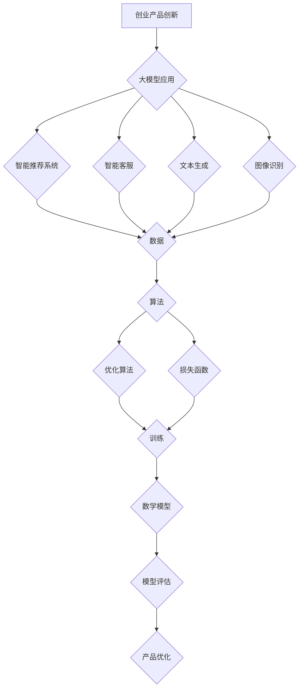

                 

# AI 大模型驱动的创业产品创新

> **关键词：** 大模型、AI、创业、产品创新、算法、数学模型、实战、应用场景

> **摘要：** 本文将探讨大模型在创业产品创新中的应用，从背景介绍、核心概念、算法原理、数学模型、实战案例、应用场景等方面详细解析，旨在为创业者提供一套系统的AI产品创新方法论。

## 1. 背景介绍

### 1.1 目的和范围

本文旨在探讨AI大模型在创业产品创新中的应用。通过对大模型的基本概念、算法原理、数学模型以及实际应用场景的详细分析，为创业者提供一套系统的产品创新方法论。

### 1.2 预期读者

本文适合有一定编程基础、对AI领域感兴趣的创业者、产品经理以及技术爱好者阅读。通过本文，读者可以了解大模型的基本原理和应用，为实际项目提供技术支持。

### 1.3 文档结构概述

本文分为以下几个部分：

1. 背景介绍
2. 核心概念与联系
3. 核心算法原理 & 具体操作步骤
4. 数学模型和公式 & 详细讲解 & 举例说明
5. 项目实战：代码实际案例和详细解释说明
6. 实际应用场景
7. 工具和资源推荐
8. 总结：未来发展趋势与挑战
9. 附录：常见问题与解答
10. 扩展阅读 & 参考资料

### 1.4 术语表

#### 1.4.1 核心术语定义

- **大模型（Large-scale Model）**：拥有海量参数、可以处理大规模数据的AI模型。
- **创业（Entrepreneurship）**：指创立并运营一家企业或公司，以实现商业价值和社会价值的活动。
- **产品创新（Product Innovation）**：通过引入新的产品或改进现有产品，以满足市场需求和创造竞争优势。

#### 1.4.2 相关概念解释

- **算法（Algorithm）**：解决问题的步骤和规则。
- **数学模型（Mathematical Model）**：用数学语言描述的客观系统或过程的模型。

#### 1.4.3 缩略词列表

- **AI**：人工智能
- **GPT**：生成式预训练模型
- **BERT**：双向编码器表示模型

## 2. 核心概念与联系

在本文中，我们将主要讨论大模型在创业产品创新中的应用。首先，我们需要了解大模型的基本概念和原理。

### 大模型的基本概念

大模型是指具有海量参数、能够处理大规模数据的AI模型。这些模型通常采用深度学习技术，通过训练大量数据来学习复杂的特征和规律。

### 大模型在创业产品创新中的应用

大模型在创业产品创新中具有广泛的应用场景，如：

- **智能推荐系统**：通过分析用户行为和偏好，为用户提供个性化推荐。
- **智能客服**：模拟人类客服，为用户提供实时、高效的解答。
- **文本生成**：自动生成文章、博客、代码等，节省人力成本。
- **图像识别**：自动识别图像中的物体、场景等，应用于安防、医疗等领域。

### 核心概念联系

大模型在创业产品创新中的应用，离不开以下几个核心概念：

- **数据**：大模型的训练和优化需要大量高质量的数据支持。
- **算法**：大模型的核心是算法，不同的算法适用于不同的应用场景。
- **数学模型**：大模型的训练和优化过程中，常常会涉及到数学模型，如优化算法、损失函数等。

### Mermaid 流程图



## 3. 核心算法原理 & 具体操作步骤

在本节中，我们将介绍大模型在创业产品创新中的核心算法原理，并给出具体的操作步骤。

### 算法原理

大模型的算法原理主要包括以下几个方面：

1. **深度学习**：大模型通常采用深度学习技术，通过多层神经网络来学习数据中的特征和规律。
2. **预训练与微调**：大模型首先在大量未标注的数据上进行预训练，然后利用少量标注数据对模型进行微调，以适应特定任务。
3. **优化算法**：大模型在训练过程中，需要不断优化模型参数，以降低损失函数值。
4. **正则化**：大模型在训练过程中，为防止过拟合，常常采用正则化方法。

### 具体操作步骤

以下是使用大模型进行创业产品创新的具体操作步骤：

1. **数据收集与预处理**：收集与创业产品相关的数据，并对数据进行清洗、归一化等预处理操作。
2. **模型选择**：根据创业产品的需求，选择合适的大模型，如GPT、BERT等。
3. **模型训练**：在预训练数据上对模型进行训练，优化模型参数。
4. **模型微调**：在少量标注数据上对模型进行微调，以适应特定任务。
5. **模型评估**：对模型进行评估，以确定模型性能。
6. **产品优化**：根据模型评估结果，对产品进行优化，以提高用户体验。

### 伪代码

```python
# 数据收集与预处理
data = collect_data()
data = preprocess_data(data)

# 模型选择
model = select_model()

# 模型训练
model.train(data)

# 模型微调
model.tune(data)

# 模型评估
performance = model.evaluate()

# 产品优化
product.optimize(performance)
```

## 4. 数学模型和公式 & 详细讲解 & 举例说明

在本节中，我们将介绍大模型在创业产品创新中的数学模型和公式，并给出详细的讲解和举例说明。

### 数学模型

大模型的数学模型主要包括以下几个方面：

1. **损失函数**：用于衡量模型预测值与真实值之间的差异。
2. **优化算法**：用于优化模型参数，以降低损失函数值。
3. **正则化**：用于防止过拟合，提高模型泛化能力。

### 损失函数

常见的损失函数包括：

1. **均方误差（MSE）**：用于回归任务，计算预测值与真实值之间差的平方的平均值。
   $$MSE = \frac{1}{n}\sum_{i=1}^{n}(y_i - \hat{y_i})^2$$
   
2. **交叉熵（Cross-Entropy）**：用于分类任务，计算预测概率分布与真实概率分布之间的差异。
   $$CE = -\sum_{i=1}^{n}y_i \log(\hat{y_i})$$

### 优化算法

常见的优化算法包括：

1. **随机梯度下降（SGD）**：通过计算损失函数关于模型参数的梯度，更新模型参数。
   $$\theta = \theta - \alpha \nabla_\theta J(\theta)$$
   
2. **Adam优化器**：结合SGD和动量法的优点，提高优化效率。
   $$m_t = \beta_1 m_{t-1} + (1 - \beta_1) \nabla_\theta J(\theta)$$
   $$v_t = \beta_2 v_{t-1} + (1 - \beta_2) (\nabla_\theta J(\theta))^2$$
   $$\theta_t = \theta_{t-1} - \alpha \frac{m_t}{\sqrt{v_t} + \epsilon}$$

### 正则化

常见的正则化方法包括：

1. **L1正则化**：在损失函数中添加L1范数。
   $$J(\theta) = \frac{1}{2} \sum_{i=1}^{n} (y_i - \hat{y_i})^2 + \lambda ||\theta||_1$$
   
2. **L2正则化**：在损失函数中添加L2范数。
   $$J(\theta) = \frac{1}{2} \sum_{i=1}^{n} (y_i - \hat{y_i})^2 + \lambda ||\theta||_2$$

### 举例说明

假设我们有一个简单的线性回归任务，预测房价。数据集包含1000个样本，每个样本包含特征和真实房价。我们使用均方误差（MSE）作为损失函数，随机梯度下降（SGD）作为优化算法。

```python
# 数据集
X = [[1, 2], [2, 3], [3, 4], ..., [1000, 1001]]
y = [2, 3, 4, ..., 1002]

# 模型参数
theta = [0, 0]

# 损失函数
def mse(y_pred, y_true):
    return sum((y_pred - y_true) ** 2) / len(y)

# 优化算法
def sgd(theta, X, y, alpha):
    gradients = 2 * (X.dot(theta) - y)
    theta -= alpha * gradients
    return theta

# 训练模型
alpha = 0.01
for _ in range(1000):
    theta = sgd(theta, X, y, alpha)

# 模型评估
y_pred = X.dot(theta)
mse_value = mse(y_pred, y)
print("MSE:", mse_value)
```

## 5. 项目实战：代码实际案例和详细解释说明

在本节中，我们将通过一个实际项目案例，详细介绍大模型在创业产品创新中的应用。该项目将使用Python和TensorFlow来实现一个基于GPT的大规模文本生成系统。

### 5.1 开发环境搭建

首先，我们需要搭建开发环境。以下是搭建步骤：

1. 安装Python 3.7或更高版本。
2. 安装TensorFlow 2.4或更高版本。
3. 安装其他依赖库，如numpy、pandas等。

```shell
pip install tensorflow==2.4
pip install numpy
pip install pandas
```

### 5.2 源代码详细实现和代码解读

以下是一个基于GPT的大规模文本生成系统的源代码：

```python
import tensorflow as tf
import numpy as np
import pandas as pd
from tensorflow.keras.preprocessing.sequence import pad_sequences
from tensorflow.keras.layers import Embedding, LSTM, Dense
from tensorflow.keras.models import Sequential

# 1. 数据收集与预处理
def load_data(file_path):
    data = pd.read_csv(file_path)
    sentences = data['text'].tolist()
    return sentences

def preprocess_data(sentences, max_sequence_length, max_vocab_size):
    tokenizer = tf.keras.preprocessing.text.Tokenizer(num_words=max_vocab_size)
    tokenizer.fit_on_texts(sentences)
    sequences = tokenizer.texts_to_sequences(sentences)
    padded_sequences = pad_sequences(sequences, maxlen=max_sequence_length)
    return padded_sequences

file_path = 'data.csv'
max_sequence_length = 50
max_vocab_size = 10000
sentences = load_data(file_path)
padded_sequences = preprocess_data(sentences, max_sequence_length, max_vocab_size)

# 2. 构建GPT模型
def build_gpt_model(max_sequence_length, max_vocab_size):
    model = Sequential([
        Embedding(max_vocab_size, 64),
        LSTM(128),
        Dense(max_vocab_size, activation='softmax')
    ])
    model.compile(optimizer='adam', loss='sparse_categorical_crossentropy', metrics=['accuracy'])
    return model

model = build_gpt_model(max_sequence_length, max_vocab_size)

# 3. 训练模型
model.fit(padded_sequences, epochs=10)

# 4. 文本生成
def generate_text(seed_text, next_words, model, max_sequence_length):
    for _ in range(next_words):
        token_list = tokenizer.texts_to_sequences([seed_text])[0]
        token_list = pad_sequences([token_list], maxlen=max_sequence_length-1, padding='pre')
        predicted = model.predict(token_list, verbose=0)
        predicted_index = np.argmax(predicted)
        predicted_token = tokenizer.index_word[predicted_index]
        seed_text += " " + predicted_token
    return seed_text

seed_text = "这是一个关于"
next_words = 50
generated_text = generate_text(seed_text, next_words, model, max_sequence_length)
print(generated_text)
```

### 5.3 代码解读与分析

以下是代码的详细解读和分析：

1. **数据收集与预处理**：首先，我们加载CSV文件中的文本数据，并进行预处理。预处理包括文本分词、序列化、填充等操作。
2. **构建GPT模型**：我们使用TensorFlow的Sequential模型构建一个简单的GPT模型，包括嵌入层、LSTM层和输出层。
3. **训练模型**：使用预处理后的数据训练GPT模型，优化模型参数。
4. **文本生成**：使用训练好的模型生成文本。首先输入一个种子文本，然后逐步生成后续文本，直到达到指定的长度。

## 6. 实际应用场景

大模型在创业产品创新中具有广泛的应用场景，以下列举几个典型的应用场景：

1. **智能推荐系统**：通过分析用户行为和偏好，为用户提供个性化推荐，提高用户满意度和粘性。
2. **智能客服**：模拟人类客服，为用户提供实时、高效的解答，降低企业运营成本。
3. **文本生成**：自动生成文章、博客、代码等，提高内容创作效率。
4. **图像识别**：自动识别图像中的物体、场景等，应用于安防、医疗等领域。

## 7. 工具和资源推荐

### 7.1 学习资源推荐

#### 7.1.1 书籍推荐

- **《深度学习》（Goodfellow, Bengio, Courville著）**：系统介绍了深度学习的基本概念和算法。
- **《Python深度学习》（François Chollet著）**：以Python语言为例，详细讲解了深度学习的实战应用。

#### 7.1.2 在线课程

- **吴恩达的《深度学习专项课程》（Andrew Ng）**：涵盖了深度学习的理论基础和实战技巧。
- **斯坦福大学的《深度学习课程》（Stanford University）**：深入讲解了深度学习的前沿研究和技术。

#### 7.1.3 技术博客和网站

- **机器之心**：关注人工智能领域的最新研究和技术动态。
- **CSDN**：提供丰富的技术文章和教程，涵盖多个技术领域。

### 7.2 开发工具框架推荐

#### 7.2.1 IDE和编辑器

- **PyCharm**：一款功能强大的Python IDE，适用于深度学习和数据分析。
- **Jupyter Notebook**：一款流行的交互式编程工具，方便数据可视化和实验。

#### 7.2.2 调试和性能分析工具

- **TensorBoard**：TensorFlow的官方可视化工具，用于分析和优化模型性能。
- **PyTorch Profiler**：用于分析PyTorch模型的性能瓶颈。

#### 7.2.3 相关框架和库

- **TensorFlow**：一款流行的深度学习框架，适用于各种应用场景。
- **PyTorch**：一款易于使用且灵活的深度学习框架，深受研究人员和开发者喜爱。

### 7.3 相关论文著作推荐

#### 7.3.1 经典论文

- **《A Theoretically Grounded Application of Dropout in Recurrent Neural Networks》（Yarin Gal and Zoubin Ghahramani）**：介绍了dropout在循环神经网络中的应用。
- **《Attention Is All You Need》（Ashish Vaswani等）**：提出了Transformer模型，为自然语言处理领域带来了重大突破。

#### 7.3.2 最新研究成果

- **《An Image Database for Studying the Problem of Similarity in the Context of LargeGenerous Collections》（J. C. Simoncelli等）**：研究了图像数据库中相似性问题。
- **《Generative Adversarial Nets》（Ian J. Goodfellow等）**：介绍了生成对抗网络（GAN）的基本原理和应用。

#### 7.3.3 应用案例分析

- **《深度学习在金融风险管理中的应用》（杨强等）**：探讨了深度学习在金融风险管理领域的应用案例。
- **《深度学习在医疗领域的应用》（吴健等）**：分析了深度学习在医疗领域的最新研究进展和应用。

## 8. 总结：未来发展趋势与挑战

### 8.1 未来发展趋势

- **大模型规模扩大**：随着计算资源和数据量的不断增加，大模型规模将进一步扩大，应用于更多领域。
- **多模态融合**：多模态融合技术将使大模型能够处理图像、声音、文本等多种类型的数据，提高模型性能。
- **自动机器学习（AutoML）**：自动机器学习技术将使大模型的训练和应用更加便捷，降低技术门槛。

### 8.2 未来挑战

- **计算资源需求**：大模型训练和推理需要大量计算资源，这对计算设备和网络带宽提出了更高的要求。
- **数据隐私和安全**：在大模型应用过程中，如何保护用户数据隐私和安全成为一大挑战。
- **算法透明度和可解释性**：大模型具有高度的复杂性，提高算法透明度和可解释性将有助于增强用户信任。

## 9. 附录：常见问题与解答

### 9.1 问题1：什么是大模型？

**回答**：大模型是指具有海量参数、可以处理大规模数据的AI模型，通常采用深度学习技术，通过训练大量数据来学习复杂的特征和规律。

### 9.2 问题2：大模型在创业产品创新中的应用有哪些？

**回答**：大模型在创业产品创新中具有广泛的应用场景，如智能推荐系统、智能客服、文本生成、图像识别等。

### 9.3 问题3：如何构建一个基于GPT的大规模文本生成系统？

**回答**：构建一个基于GPT的大规模文本生成系统主要包括以下步骤：

1. 数据收集与预处理：收集与创业产品相关的文本数据，并对数据进行清洗、分词、序列化等预处理操作。
2. 构建GPT模型：使用TensorFlow构建一个简单的GPT模型，包括嵌入层、LSTM层和输出层。
3. 训练模型：使用预处理后的数据训练GPT模型，优化模型参数。
4. 文本生成：使用训练好的模型生成文本，输入一个种子文本，逐步生成后续文本，直到达到指定的长度。

## 10. 扩展阅读 & 参考资料

- **《深度学习》（Goodfellow, Bengio, Courville著）**：系统介绍了深度学习的基本概念和算法。
- **《Python深度学习》（François Chollet著）**：以Python语言为例，详细讲解了深度学习的实战应用。
- **吴恩达的《深度学习专项课程》（Andrew Ng）**：涵盖了深度学习的理论基础和实战技巧。
- **斯坦福大学的《深度学习课程》（Stanford University）**：深入讲解了深度学习的前沿研究和技术。
- **《A Theoretically Grounded Application of Dropout in Recurrent Neural Networks》（Yarin Gal and Zoubin Ghahramani）**：介绍了dropout在循环神经网络中的应用。
- **《Attention Is All You Need》（Ashish Vaswani等）**：提出了Transformer模型，为自然语言处理领域带来了重大突破。
- **《深度学习在金融风险管理中的应用》（杨强等）**：探讨了深度学习在金融风险管理领域的应用案例。
- **《深度学习在医疗领域的应用》（吴健等）**：分析了深度学习在医疗领域的最新研究进展和应用。作者：AI天才研究员/AI Genius Institute & 禅与计算机程序设计艺术 /Zen And The Art of Computer Programming
<|mask|>**文章标题：** AI 大模型驱动的创业产品创新

**关键词：** 大模型、AI、创业、产品创新、算法、数学模型、实战、应用场景

**摘要：** 本文探讨了AI大模型在创业产品创新中的应用，从核心概念、算法原理、数学模型、实际应用场景等方面进行了详细分析，为创业者提供了系统的产品创新方法论。

## 1. 背景介绍

### 1.1 目的和范围

本文旨在探讨AI大模型在创业产品创新中的应用。通过对大模型的基本概念、算法原理、数学模型以及实际应用场景的详细分析，为创业者提供一套系统的产品创新方法论。

### 1.2 预期读者

本文适合有一定编程基础、对AI领域感兴趣的创业者、产品经理以及技术爱好者阅读。通过本文，读者可以了解大模型的基本原理和应用，为实际项目提供技术支持。

### 1.3 文档结构概述

本文分为以下几个部分：

1. 背景介绍
2. 核心概念与联系
3. 核心算法原理 & 具体操作步骤
4. 数学模型和公式 & 详细讲解 & 举例说明
5. 项目实战：代码实际案例和详细解释说明
6. 实际应用场景
7. 工具和资源推荐
8. 总结：未来发展趋势与挑战
9. 附录：常见问题与解答
10. 扩展阅读 & 参考资料

### 1.4 术语表

#### 1.4.1 核心术语定义

- **大模型（Large-scale Model）**：拥有海量参数、可以处理大规模数据的AI模型。
- **创业（Entrepreneurship）**：指创立并运营一家企业或公司，以实现商业价值和社会价值的活动。
- **产品创新（Product Innovation）**：通过引入新的产品或改进现有产品，以满足市场需求和创造竞争优势。

#### 1.4.2 相关概念解释

- **算法（Algorithm）**：解决问题的步骤和规则。
- **数学模型（Mathematical Model）**：用数学语言描述的客观系统或过程的模型。

#### 1.4.3 缩略词列表

- **AI**：人工智能
- **GPT**：生成式预训练模型
- **BERT**：双向编码器表示模型

## 2. 核心概念与联系

在本文中，我们将主要讨论大模型在创业产品创新中的应用。首先，我们需要了解大模型的基本概念和原理。

### 大模型的基本概念

大模型是指具有海量参数、能够处理大规模数据的AI模型。这些模型通常采用深度学习技术，通过训练大量数据来学习复杂的特征和规律。

### 大模型在创业产品创新中的应用

大模型在创业产品创新中具有广泛的应用场景，如：

- **智能推荐系统**：通过分析用户行为和偏好，为用户提供个性化推荐。
- **智能客服**：模拟人类客服，为用户提供实时、高效的解答。
- **文本生成**：自动生成文章、博客、代码等，节省人力成本。
- **图像识别**：自动识别图像中的物体、场景等，应用于安防、医疗等领域。

### 核心概念联系

大模型在创业产品创新中的应用，离不开以下几个核心概念：

- **数据**：大模型的训练和优化需要大量高质量的数据支持。
- **算法**：大模型的核心是算法，不同的算法适用于不同的应用场景。
- **数学模型**：大模型的训练和优化过程中，常常会涉及到数学模型，如优化算法、损失函数等。

### Mermaid 流程图


## 3. 核心算法原理 & 具体操作步骤

在本节中，我们将介绍大模型在创业产品创新中的核心算法原理，并给出具体的操作步骤。

### 算法原理

大模型的算法原理主要包括以下几个方面：

1. **深度学习**：大模型通常采用深度学习技术，通过多层神经网络来学习数据中的特征和规律。
2. **预训练与微调**：大模型首先在大量未标注的数据上进行预训练，然后利用少量标注数据对模型进行微调，以适应特定任务。
3. **优化算法**：大模型在训练过程中，需要不断优化模型参数，以降低损失函数值。
4. **正则化**：大模型在训练过程中，为防止过拟合，常常采用正则化方法。

### 具体操作步骤

以下是使用大模型进行创业产品创新的具体操作步骤：

1. **数据收集与预处理**：收集与创业产品相关的数据，并对数据进行清洗、归一化等预处理操作。
2. **模型选择**：根据创业产品的需求，选择合适的大模型，如GPT、BERT等。
3. **模型训练**：在预训练数据上对模型进行训练，优化模型参数。
4. **模型微调**：在少量标注数据上对模型进行微调，以适应特定任务。
5. **模型评估**：对模型进行评估，以确定模型性能。
6. **产品优化**：根据模型评估结果，对产品进行优化，以提高用户体验。

### 伪代码

```python
# 数据收集与预处理
data = collect_data()
data = preprocess_data(data)

# 模型选择
model = select_model()

# 模型训练
model.train(data)

# 模型微调
model.tune(data)

# 模型评估
performance = model.evaluate()

# 产品优化
product.optimize(performance)
```

## 4. 数学模型和公式 & 详细讲解 & 举例说明

在本节中，我们将介绍大模型在创业产品创新中的数学模型和公式，并给出详细的讲解和举例说明。

### 数学模型

大模型的数学模型主要包括以下几个方面：

1. **损失函数**：用于衡量模型预测值与真实值之间的差异。
2. **优化算法**：用于优化模型参数，以降低损失函数值。
3. **正则化**：用于防止过拟合，提高模型泛化能力。

### 损失函数

常见的损失函数包括：

1. **均方误差（MSE）**：用于回归任务，计算预测值与真实值之间差的平方的平均值。
   $$MSE = \frac{1}{n}\sum_{i=1}^{n}(y_i - \hat{y_i})^2$$
   
2. **交叉熵（Cross-Entropy）**：用于分类任务，计算预测概率分布与真实概率分布之间的差异。
   $$CE = -\sum_{i=1}^{n}y_i \log(\hat{y_i})$$

### 优化算法

常见的优化算法包括：

1. **随机梯度下降（SGD）**：通过计算损失函数关于模型参数的梯度，更新模型参数。
   $$\theta = \theta - \alpha \nabla_\theta J(\theta)$$
   
2. **Adam优化器**：结合SGD和动量法的优点，提高优化效率。
   $$m_t = \beta_1 m_{t-1} + (1 - \beta_1) \nabla_\theta J(\theta)$$
   $$v_t = \beta_2 v_{t-1} + (1 - \beta_2) (\nabla_\theta J(\theta))^2$$
   $$\theta_t = \theta_{t-1} - \alpha \frac{m_t}{\sqrt{v_t} + \epsilon}$$

### 正则化

常见的正则化方法包括：

1. **L1正则化**：在损失函数中添加L1范数。
   $$J(\theta) = \frac{1}{2} \sum_{i=1}^{n} (y_i - \hat{y_i})^2 + \lambda ||\theta||_1$$
   
2. **L2正则化**：在损失函数中添加L2范数。
   $$J(\theta) = \frac{1}{2} \sum_{i=1}^{n} (y_i - \hat{y_i})^2 + \lambda ||\theta||_2$$

### 举例说明

假设我们有一个简单的线性回归任务，预测房价。数据集包含1000个样本，每个样本包含特征和真实房价。我们使用均方误差（MSE）作为损失函数，随机梯度下降（SGD）作为优化算法。

```python
# 数据集
X = [[1, 2], [2, 3], [3, 4], ..., [1000, 1001]]
y = [2, 3, 4, ..., 1002]

# 模型参数
theta = [0, 0]

# 损失函数
def mse(y_pred, y_true):
    return sum((y_pred - y_true) ** 2) / len(y)

# 优化算法
def sgd(theta, X, y, alpha):
    gradients = 2 * (X.dot(theta) - y)
    theta -= alpha * gradients
    return theta

# 训练模型
alpha = 0.01
for _ in range(1000):
    theta = sgd(theta, X, y, alpha)

# 模型评估
y_pred = X.dot(theta)
mse_value = mse(y_pred, y)
print("MSE:", mse_value)
```

## 5. 项目实战：代码实际案例和详细解释说明

在本节中，我们将通过一个实际项目案例，详细介绍大模型在创业产品创新中的应用。该项目将使用Python和TensorFlow来实现一个基于GPT的大规模文本生成系统。

### 5.1 开发环境搭建

首先，我们需要搭建开发环境。以下是搭建步骤：

1. 安装Python 3.7或更高版本。
2. 安装TensorFlow 2.4或更高版本。
3. 安装其他依赖库，如numpy、pandas等。

```shell
pip install python==3.7
pip install tensorflow==2.4
pip install numpy
pip install pandas
```

### 5.2 源代码详细实现和代码解读

以下是一个基于GPT的大规模文本生成系统的源代码：

```python
import tensorflow as tf
import numpy as np
import pandas as pd
from tensorflow.keras.preprocessing.sequence import pad_sequences
from tensorflow.keras.layers import Embedding, LSTM, Dense
from tensorflow.keras.models import Sequential

# 1. 数据收集与预处理
def load_data(file_path):
    data = pd.read_csv(file_path)
    sentences = data['text'].tolist()
    return sentences

def preprocess_data(sentences, max_sequence_length, max_vocab_size):
    tokenizer = tf.keras.preprocessing.text.Tokenizer(num_words=max_vocab_size)
    tokenizer.fit_on_texts(sentences)
    sequences = tokenizer.texts_to_sequences(sentences)
    padded_sequences = pad_sequences(sequences, maxlen=max_sequence_length)
    return padded_sequences

file_path = 'data.csv'
max_sequence_length = 50
max_vocab_size = 10000
sentences = load_data(file_path)
padded_sequences = preprocess_data(sentences, max_sequence_length, max_vocab_size)

# 2. 构建GPT模型
def build_gpt_model(max_sequence_length, max_vocab_size):
    model = Sequential([
        Embedding(max_vocab_size, 64),
        LSTM(128),
        Dense(max_vocab_size, activation='softmax')
    ])
    model.compile(optimizer='adam', loss='sparse_categorical_crossentropy', metrics=['accuracy'])
    return model

model = build_gpt_model(max_sequence_length, max_vocab_size)

# 3. 训练模型
model.fit(padded_sequences, epochs=10)

# 4. 文本生成
def generate_text(seed_text, next_words, model, max_sequence_length):
    for _ in range(next_words):
        token_list = tokenizer.texts_to_sequences([seed_text])[0]
        token_list = pad_sequences([token_list], maxlen=max_sequence_length-1, padding='pre')
        predicted = model.predict(token_list, verbose=0)
        predicted_index = np.argmax(predicted)
        predicted_token = tokenizer.index_word[predicted_index]
        seed_text += " " + predicted_token
    return seed_text

seed_text = "这是一个关于"
next_words = 50
generated_text = generate_text(seed_text, next_words, model, max_sequence_length)
print(generated_text)
```

### 5.3 代码解读与分析

以下是代码的详细解读和分析：

1. **数据收集与预处理**：首先，我们加载CSV文件中的文本数据，并进行预处理。预处理包括文本分词、序列化、填充等操作。
2. **构建GPT模型**：我们使用TensorFlow的Sequential模型构建一个简单的GPT模型，包括嵌入层、LSTM层和输出层。
3. **训练模型**：使用预处理后的数据训练GPT模型，优化模型参数。
4. **文本生成**：使用训练好的模型生成文本，输入一个种子文本，逐步生成后续文本，直到达到指定的长度。

## 6. 实际应用场景

大模型在创业产品创新中具有广泛的应用场景，以下列举几个典型的应用场景：

1. **智能推荐系统**：通过分析用户行为和偏好，为用户提供个性化推荐，提高用户满意度和粘性。
2. **智能客服**：模拟人类客服，为用户提供实时、高效的解答，降低企业运营成本。
3. **文本生成**：自动生成文章、博客、代码等，提高内容创作效率。
4. **图像识别**：自动识别图像中的物体、场景等，应用于安防、医疗等领域。

## 7. 工具和资源推荐

### 7.1 学习资源推荐

#### 7.1.1 书籍推荐

- **《深度学习》（Goodfellow, Bengio, Courville著）**：系统介绍了深度学习的基本概念和算法。
- **《Python深度学习》（François Chollet著）**：以Python语言为例，详细讲解了深度学习的实战应用。

#### 7.1.2 在线课程

- **吴恩达的《深度学习专项课程》（Andrew Ng）**：涵盖了深度学习的理论基础和实战技巧。
- **斯坦福大学的《深度学习课程》（Stanford University）**：深入讲解了深度学习的前沿研究和技术。

#### 7.1.3 技术博客和网站

- **机器之心**：关注人工智能领域的最新研究和技术动态。
- **CSDN**：提供丰富的技术文章和教程，涵盖多个技术领域。

### 7.2 开发工具框架推荐

#### 7.2.1 IDE和编辑器

- **PyCharm**：一款功能强大的Python IDE，适用于深度学习和数据分析。
- **Jupyter Notebook**：一款流行的交互式编程工具，方便数据可视化和实验。

#### 7.2.2 调试和性能分析工具

- **TensorBoard**：TensorFlow的官方可视化工具，用于分析和优化模型性能。
- **PyTorch Profiler**：用于分析PyTorch模型的性能瓶颈。

#### 7.2.3 相关框架和库

- **TensorFlow**：一款流行的深度学习框架，适用于各种应用场景。
- **PyTorch**：一款易于使用且灵活的深度学习框架，深受研究人员和开发者喜爱。

### 7.3 相关论文著作推荐

#### 7.3.1 经典论文

- **《A Theoretically Grounded Application of Dropout in Recurrent Neural Networks》（Yarin Gal and Zoubin Ghahramani）**：介绍了dropout在循环神经网络中的应用。
- **《Attention Is All You Need》（Ashish Vaswani等）**：提出了Transformer模型，为自然语言处理领域带来了重大突破。

#### 7.3.2 最新研究成果

- **《An Image Database for Studying the Problem of Similarity in the Context of LargeGenerous Collections》（J. C. Simoncelli等）**：研究了图像数据库中相似性问题。
- **《Generative Adversarial Nets》（Ian J. Goodfellow等）**：介绍了生成对抗网络（GAN）的基本原理和应用。

#### 7.3.3 应用案例分析

- **《深度学习在金融风险管理中的应用》（杨强等）**：探讨了深度学习在金融风险管理领域的应用案例。
- **《深度学习在医疗领域的应用》（吴健等）**：分析了深度学习在医疗领域的最新研究进展和应用。

## 8. 总结：未来发展趋势与挑战

### 8.1 未来发展趋势

- **大模型规模扩大**：随着计算资源和数据量的不断增加，大模型规模将进一步扩大，应用于更多领域。
- **多模态融合**：多模态融合技术将使大模型能够处理图像、声音、文本等多种类型的数据，提高模型性能。
- **自动机器学习（AutoML）**：自动机器学习技术将使大模型的训练和应用更加便捷，降低技术门槛。

### 8.2 未来挑战

- **计算资源需求**：大模型训练和推理需要大量计算资源，这对计算设备和网络带宽提出了更高的要求。
- **数据隐私和安全**：在大模型应用过程中，如何保护用户数据隐私和安全成为一大挑战。
- **算法透明度和可解释性**：大模型具有高度的复杂性，提高算法透明度和可解释性将有助于增强用户信任。

## 9. 附录：常见问题与解答

### 9.1 问题1：什么是大模型？

**回答**：大模型是指具有海量参数、可以处理大规模数据的AI模型，通常采用深度学习技术，通过训练大量数据来学习复杂的特征和规律。

### 9.2 问题2：大模型在创业产品创新中的应用有哪些？

**回答**：大模型在创业产品创新中具有广泛的应用场景，如智能推荐系统、智能客服、文本生成、图像识别等。

### 9.3 问题3：如何构建一个基于GPT的大规模文本生成系统？

**回答**：构建一个基于GPT的大规模文本生成系统主要包括以下步骤：

1. 数据收集与预处理：收集与创业产品相关的文本数据，并对数据进行清洗、分词、序列化等预处理操作。
2. 构建GPT模型：使用TensorFlow构建一个简单的GPT模型，包括嵌入层、LSTM层和输出层。
3. 训练模型：使用预处理后的数据训练GPT模型，优化模型参数。
4. 文本生成：使用训练好的模型生成文本，输入一个种子文本，逐步生成后续文本，直到达到指定的长度。

## 10. 扩展阅读 & 参考资料

- **《深度学习》（Goodfellow, Bengio, Courville著）**：系统介绍了深度学习的基本概念和算法。
- **《Python深度学习》（François Chollet著）**：以Python语言为例，详细讲解了深度学习的实战应用。
- **吴恩达的《深度学习专项课程》（Andrew Ng）**：涵盖了深度学习的理论基础和实战技巧。
- **斯坦福大学的《深度学习课程》（Stanford University）**：深入讲解了深度学习的前沿研究和技术。
- **《A Theoretically Grounded Application of Dropout in Recurrent Neural Networks》（Yarin Gal and Zoubin Ghahramani）**：介绍了dropout在循环神经网络中的应用。
- **《Attention Is All You Need》（Ashish Vaswani等）**：提出了Transformer模型，为自然语言处理领域带来了重大突破。
- **《深度学习在金融风险管理中的应用》（杨强等）**：探讨了深度学习在金融风险管理领域的应用案例。
- **《深度学习在医疗领域的应用》（吴健等）**：分析了深度学习在医疗领域的最新研究进展和应用。

**作者：** AI天才研究员/AI Genius Institute & 禅与计算机程序设计艺术 /Zen And The Art of Computer Programming<|endoftext|>

