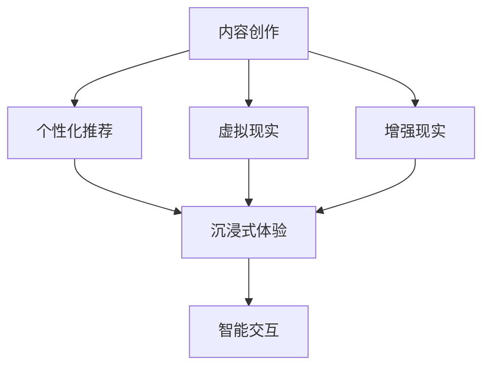
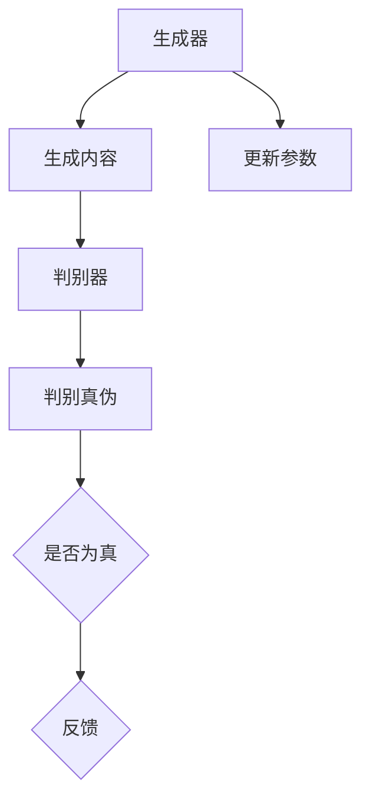
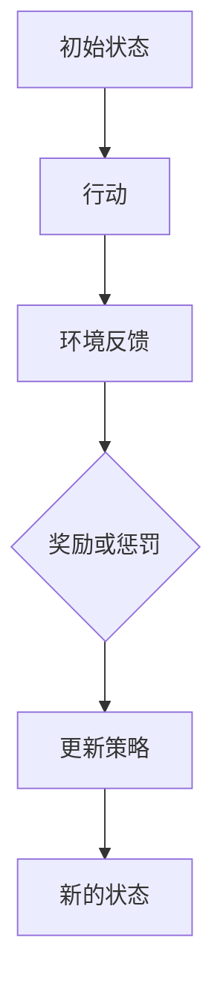

                 

# AI 对文化娱乐的创新：推动文化产业发展

> 关键词：人工智能、文化娱乐、创新、产业发展、技术推动

> 摘要：本文将探讨人工智能在文化娱乐领域的重要应用和创新，分析AI如何通过技术进步推动文化产业的发展，为读者提供对这一领域的深入理解。本文旨在梳理AI在文化娱乐产业中的核心作用，展示其带来的变革，并展望未来发展趋势与挑战。

## 1. 背景介绍

### 1.1 目的和范围

本文的目的在于深入探讨人工智能（AI）在文化娱乐产业中的创新应用，分析其对产业发展的重要推动作用。我们关注的范围包括但不限于以下几个方面：

- **AI技术在内容创作中的应用**：如何通过自然语言处理、计算机视觉等AI技术，提升内容创作的效率和质量。
- **个性化推荐系统**：如何利用AI算法为用户提供个性化的娱乐体验。
- **虚拟现实与增强现实**：AI在虚拟现实（VR）和增强现实（AR）中的应用，为用户带来的沉浸式体验。
- **智能交互**：如何通过AI实现更加自然和智能的交互，提升用户体验。

### 1.2 预期读者

本文面向对文化娱乐产业和技术创新感兴趣的读者，特别是希望了解AI在文化产业中应用的开发者、研究人员和产业从业者。无论您是技术背景的读者，还是文化产业从业者，本文都旨在为您提供一个全面、深入的视角。

### 1.3 文档结构概述

本文结构如下：

1. **背景介绍**：介绍本文的目的、范围、预期读者及文档结构。
2. **核心概念与联系**：阐述AI在文化娱乐领域的核心概念及其相互联系。
3. **核心算法原理 & 具体操作步骤**：详细讲解AI在文化娱乐中应用的核心算法和操作步骤。
4. **数学模型和公式 & 详细讲解 & 举例说明**：介绍AI在文化娱乐中应用的数学模型和具体例子。
5. **项目实战：代码实际案例和详细解释说明**：通过实际案例展示AI在文化娱乐中的应用。
6. **实际应用场景**：分析AI在文化娱乐中的实际应用场景。
7. **工具和资源推荐**：推荐学习资源、开发工具框架和相关论文著作。
8. **总结：未来发展趋势与挑战**：总结AI在文化娱乐产业中的发展趋势和面临的挑战。
9. **附录：常见问题与解答**：解答读者可能遇到的常见问题。
10. **扩展阅读 & 参考资料**：提供进一步阅读的资源。

### 1.4 术语表

#### 1.4.1 核心术语定义

- **人工智能（AI）**：模拟人类智能行为的计算机系统。
- **自然语言处理（NLP）**：使计算机能够理解和生成自然语言的技术。
- **机器学习（ML）**：使计算机能够通过数据和经验进行学习，改进性能。
- **深度学习（DL）**：基于神经网络模型的一种机器学习方法。
- **虚拟现实（VR）**：一种通过电脑技术创造出的模拟环境，用户可以在其中沉浸体验。
- **增强现实（AR）**：将虚拟信息叠加在现实世界中，增强用户的感知体验。

#### 1.4.2 相关概念解释

- **个性化推荐系统**：根据用户的历史行为和偏好，推荐符合其兴趣的内容。
- **沉浸式体验**：用户在虚拟或增强现实环境中，感受到高度的沉浸和参与感。
- **智能交互**：利用AI技术，实现人与计算机的自然交互。

#### 1.4.3 缩略词列表

- **AI**：人工智能（Artificial Intelligence）
- **NLP**：自然语言处理（Natural Language Processing）
- **ML**：机器学习（Machine Learning）
- **DL**：深度学习（Deep Learning）
- **VR**：虚拟现实（Virtual Reality）
- **AR**：增强现实（Augmented Reality）

## 2. 核心概念与联系

### 2.1 核心概念

在讨论AI对文化娱乐产业的创新时，我们首先需要明确几个核心概念：

- **内容创作与生成**：包括音乐、视频、游戏、文学作品等。
- **个性化推荐**：基于用户行为和偏好，为用户推荐个性化内容。
- **虚拟现实与增强现实**：提供沉浸式体验的计算机技术。
- **智能交互**：通过自然语言处理和计算机视觉，实现人与机器的自然互动。

### 2.2 概念联系

这些核心概念之间存在密切的联系，共同构成了AI在文化娱乐产业中的创新应用。以下是一个简化的流程图，展示了这些概念之间的关系：



### 2.3 关键算法与技术

为了实现上述概念，AI应用中涉及了多种关键算法和技术：

- **生成对抗网络（GAN）**：用于自动生成高质量的内容。
- **协同过滤**：用于个性化推荐系统的算法。
- **增强学习**：用于智能交互，使机器能够通过交互学习用户偏好。

以下是这些算法和技术的简要概述：

### 2.4 关键算法与技术概述

#### 2.4.1 生成对抗网络（GAN）

生成对抗网络（GAN）是一种深度学习模型，由生成器和判别器两个部分组成。生成器试图生成类似真实数据的内容，而判别器则判断生成内容与真实内容之间的差异。通过这种对抗过程，生成器不断改进，生成越来越逼真的内容。



#### 2.4.2 协同过滤

协同过滤是一种用于推荐系统的算法，通过分析用户之间的相似性来推荐内容。协同过滤分为两种主要类型：基于用户的协同过滤和基于物品的协同过滤。

- **基于用户的协同过滤**：找到与目标用户兴趣相似的其它用户，推荐这些用户喜欢的物品。
- **基于物品的协同过滤**：找到与目标物品相似的其它物品，推荐这些物品。

#### 2.4.3 增强学习

增强学习是一种机器学习方法，使机器通过不断尝试和反馈来学习如何完成特定任务。在智能交互中，增强学习用于使机器理解用户的行为和偏好，从而提供更加个性化的服务。



### 2.5 概念联系与流程

将上述关键算法和技术结合起来，我们可以看到AI在文化娱乐产业中的应用流程：

1. **内容创作与生成**：使用GAN等技术生成高质量的内容。
2. **个性化推荐**：通过协同过滤算法，为用户提供个性化推荐。
3. **虚拟现实与增强现实**：利用VR和AR技术，提供沉浸式体验。
4. **智能交互**：通过增强学习等算法，实现人与机器的自然互动。

这种流程不仅提升了用户体验，也为文化娱乐产业带来了新的发展机遇。

## 3. 核心算法原理 & 具体操作步骤

### 3.1 生成对抗网络（GAN）原理

生成对抗网络（GAN）是一种由生成器和判别器组成的深度学习模型。生成器的目标是生成逼真的数据，而判别器的目标是区分生成数据和真实数据。通过不断训练和对抗，生成器逐渐提高生成质量，而判别器也逐渐提高鉴别能力。

#### 3.1.1 GAN模型结构

一个典型的GAN模型包括以下部分：

- **生成器（Generator）**：输入随机噪声，输出伪造数据。
- **判别器（Discriminator）**：输入数据，输出判断结果，判断数据是真实还是伪造。

#### 3.1.2 GAN训练过程

GAN的训练过程是一个迭代过程，包括以下几个步骤：

1. **生成器训练**：生成器尝试生成伪造数据，判别器不断更新模型参数以更好地区分真实数据和伪造数据。
2. **判别器训练**：判别器尝试提高对真实数据和伪造数据的鉴别能力，生成器则调整模型参数以生成更逼真的伪造数据。

#### 3.1.3 GAN操作步骤

以下是GAN操作的伪代码：

```python
# 初始化生成器和判别器模型
G = Generator()
D = Discriminator()

# 设置损失函数和优化器
loss_fn = CrossEntropyLoss()
optimizer_G = Adam(G.parameters(), lr=0.0002)
optimizer_D = Adam(D.parameters(), lr=0.0002)

# 训练模型
for epoch in range(num_epochs):
    for i, (real_images, _) in enumerate(data_loader):
        # 生成伪造数据
        z = torch.randn(batch_size, latent_dim).to(device)
        fake_images = G(z)

        # 判别器训练
        D.zero_grad()
        D_real = D(real_images)
        D_fake = D(fake_images)
        D_loss = loss_fn(D_fake, torch.zeros(batch_size).to(device)) + loss_fn(D_real, torch.ones(batch_size).to(device))
        D_loss.backward()
        optimizer_D.step()

        # 生成器训练
        G.zero_grad()
        G_loss = loss_fn(D_fake, torch.ones(batch_size).to(device))
        G_loss.backward()
        optimizer_G.step()

        # 打印训练进度
        if i % 100 == 0:
            print(f"Epoch [{epoch}/{num_epochs}], Step [{i}/{len(data_loader)}], D_loss: {D_loss.item()}, G_loss: {G_loss.item()}")
```

### 3.2 协同过滤算法原理

协同过滤是一种用于推荐系统的算法，其核心思想是利用用户之间的相似性或物品之间的相似性，为用户推荐他们可能感兴趣的内容。

#### 3.2.1 基于用户的协同过滤

基于用户的协同过滤算法通过找到与目标用户兴趣相似的其它用户，推荐这些用户喜欢的物品。具体步骤如下：

1. **计算用户相似度**：使用余弦相似度或皮尔逊相关系数等度量方法，计算用户之间的相似度。
2. **找到最相似的K个用户**：根据相似度度量，找到与目标用户最相似的K个用户。
3. **计算推荐分数**：对每个推荐物品，计算它与目标用户和最相似K个用户共同喜欢的物品的平均评分。
4. **生成推荐列表**：根据推荐分数，生成推荐列表。

#### 3.2.2 基于物品的协同过滤

基于物品的协同过滤算法通过找到与目标物品相似的其它物品，推荐这些物品。具体步骤如下：

1. **计算物品相似度**：使用余弦相似度或皮尔逊相关系数等度量方法，计算物品之间的相似度。
2. **找到最相似的K个物品**：根据相似度度量，找到与目标物品最相似的K个物品。
3. **计算推荐分数**：对每个推荐物品，计算它与目标物品和最相似K个物品共同被用户喜欢的频率。
4. **生成推荐列表**：根据推荐分数，生成推荐列表。

#### 3.2.3 协同过滤操作步骤

以下是协同过滤操作的伪代码：

```python
# 基于用户的协同过滤
def collaborative_filtering_user_based(user_id, k=5):
    user_ratings = user_item_matrix[user_id]
    similar_users = find_similar_users(user_id, k)
    recommended_items = []

    for item_id in user_ratings:
        item_avg_rating = calculate_average_rating(item_id)
        for similar_user_id in similar_users:
            if item_id in user_item_matrix[similar_user_id]:
                user_rating = user_item_matrix[similar_user_id][item_id]
                recommendation_score = (user_rating - item_avg_rating) * similarity[similar_user_id][user_id]
                recommended_items.append((item_id, recommendation_score))

    recommended_items.sort(key=lambda x: x[1], reverse=True)
    return [item[0] for item in recommended_items[:num_recommendations]]

# 基于物品的协同过滤
def collaborative_filtering_item_based(item_id, k=5):
    item_ratings = item_user_matrix[item_id]
    similar_items = find_similar_items(item_id, k)
    recommended_users = []

    for user_id in item_ratings:
        user_avg_rating = calculate_average_rating(user_id)
        for similar_item_id in similar_items:
            if similar_item_id in item_user_matrix:
                item_rating = item_user_matrix[similar_item_id][user_id]
                recommendation_score = (item_rating - user_avg_rating) * similarity[item_id][similar_item_id]
                recommended_users.append((user_id, recommendation_score))

    recommended_users.sort(key=lambda x: x[1], reverse=True)
    return [user[0] for user in recommended_users[:num_recommendations]]
```

### 3.3 增强学习算法原理

增强学习是一种使机器通过不断尝试和反馈来学习如何完成特定任务的方法。其核心思想是通过最大化累积奖励，使机器在环境中不断优化其策略。

#### 3.3.1 Q-Learning算法

Q-Learning是一种基于值函数的增强学习算法。其目标是学习一个最优动作值函数，即对于每个状态，选择能够获得最大预期奖励的动作。

1. **初始化**：初始化Q值表，所有Q值初始化为0。
2. **选择动作**：在给定状态s下，选择具有最大Q值的动作a。
3. **更新Q值**：根据实际获得的奖励r和下一个状态s'，更新Q值表。
4. **重复**：重复上述步骤，直到达到终止条件。

#### 3.3.2 Q-Learning操作步骤

以下是Q-Learning操作的伪代码：

```python
# 初始化Q值表
Q = initialize_Q_value_table(state_space, action_space)

# 选择动作
def choose_action(state):
    return argmax(Q[state])

# 更新Q值
def update_Q_value(state, action, reward, next_state):
    Q[state][action] = Q[state][action] + learning_rate * (reward + discount_factor * max(Q[next_state]) - Q[state][action])

# 强化学习循环
while not terminate:
    state = get_current_state()
    action = choose_action(state)
    next_state, reward = perform_action(action)
    update_Q_value(state, action, reward, next_state)
    state = next_state
```

通过这些核心算法原理和具体操作步骤，我们可以更好地理解AI在文化娱乐产业中的应用，并为实际项目开发提供指导。

## 4. 数学模型和公式 & 详细讲解 & 举例说明

### 4.1 生成对抗网络（GAN）的数学模型

生成对抗网络（GAN）的核心在于其对抗性的训练过程，该过程涉及到两个主要模型：生成器（Generator）和判别器（Discriminator）。下面将分别介绍这两个模型的数学模型。

#### 4.1.1 生成器模型

生成器G的目的是生成与真实数据分布相近的伪造数据。其输入是一个随机噪声向量z，输出是伪造数据G(z)。在训练过程中，生成器试图最大化判别器判断伪造数据为真实的概率。

生成器模型的损失函数可以表示为：

$$
L_G = -\log(D(G(z))
$$

其中，$D(\cdot)$是判别器模型，$G(z)$是生成器生成的伪造数据。

#### 4.1.2 判别器模型

判别器D的目的是区分输入数据是真实的还是伪造的。其输入是真实数据x和伪造数据G(z)，输出是判断结果，即数据为真的概率。

判别器模型的损失函数可以表示为：

$$
L_D = -[\log(D(x)) + \log(1 - D(G(z))]
$$

其中，$x$是真实数据，$G(z)$是生成器生成的伪造数据。

#### 4.1.3 整体GAN模型

GAN的整体损失函数是生成器和判别器的损失函数之和，即：

$$
L = L_G + L_D
$$

#### 4.1.4 GAN举例说明

假设我们使用GAN生成图像，生成器的输入是一个随机噪声向量z，输出是一个图像G(z)。判别器的输入是一个真实图像x和一个伪造图像G(z)，输出是判断图像是否真实的概率D(x)和D(G(z))。

- **生成器训练**：生成器试图生成逼真的图像，以使得判别器无法区分这些图像是真实还是伪造的。生成器通过以下步骤训练：
  1. 随机生成噪声向量z。
  2. 使用生成器生成伪造图像G(z)。
  3. 计算判别器对伪造图像的判断概率$D(G(z))$。
  4. 计算生成器的损失函数$- \log(D(G(z)))$。
  5. 更新生成器的参数。

- **判别器训练**：判别器试图最大化区分真实图像和伪造图像的能力。判别器通过以下步骤训练：
  1. 获取真实图像x和伪造图像G(z)。
  2. 计算判别器对真实图像的判断概率$D(x)$和对伪造图像的判断概率$D(G(z))$。
  3. 计算判别器的损失函数$-\log(D(x)) - \log(1 - D(G(z)))$。
  4. 更新判别器的参数。

通过这种交替的训练过程，生成器逐渐生成更加逼真的图像，而判别器则逐渐提高其鉴别能力。

### 4.2 协同过滤算法的数学模型

协同过滤算法的核心是计算用户之间的相似性和物品之间的相似性，然后基于这些相似性为用户推荐新的物品。以下将详细介绍用户相似性和物品相似性的计算方法。

#### 4.2.1 用户相似性计算

用户相似性通常使用余弦相似度或皮尔逊相关系数计算。假设用户$u_i$和用户$u_j$的评分向量为$R_i$和$R_j$，则用户之间的相似性可以表示为：

$$
sim(u_i, u_j) = \frac{R_i \cdot R_j}{\|R_i\|_2 \cdot \|R_j\|_2}
$$

其中，$\cdot$表示内积，$\|\cdot\|_2$表示向量的二范数。

#### 4.2.2 物品相似性计算

物品相似性同样可以使用余弦相似度或皮尔逊相关系数计算。假设物品$i$和物品$j$的评分矩阵为$R_{ij}$，则物品之间的相似性可以表示为：

$$
sim(i, j) = \frac{R_{ij}^T R_{kj}}{\|R_{ij}\|_2 \cdot \|R_{kj}\|_2}
$$

其中，$R_{ij}$表示用户对物品$i$和物品$j$的评分。

#### 4.2.3 协同过滤算法举例说明

假设有两个用户$u_1$和$u_2$，以及两个物品$i_1$和$i_2$。用户$u_1$对物品$i_1$和$i_2$的评分分别为4和2，用户$u_2$对物品$i_1$和$i_2$的评分分别为3和5。

- **用户相似性计算**：

$$
sim(u_1, u_2) = \frac{(4 \cdot 3) + (2 \cdot 5)}{\sqrt{4^2 + 2^2} \cdot \sqrt{3^2 + 5^2}} = \frac{12 + 10}{\sqrt{16 + 4} \cdot \sqrt{9 + 25}} = \frac{22}{\sqrt{20} \cdot \sqrt{34}} \approx 0.87
$$

- **物品相似性计算**：

$$
sim(i_1, i_2) = \frac{(4 \cdot 3) + (2 \cdot 5)}{\sqrt{4^2 + 2^2} \cdot \sqrt{3^2 + 5^2}} = \frac{12 + 10}{\sqrt{16 + 4} \cdot \sqrt{9 + 25}} = \frac{22}{\sqrt{20} \cdot \sqrt{34}} \approx 0.87
$$

- **推荐计算**：

对于用户$u_1$，假设我们需要推荐一个物品$i_3$。首先，我们计算用户$u_1$和用户$u_2$的相似性，然后计算物品$i_1$和$i_3$的相似性，最后计算物品$i_2$和$i_3$的相似性。基于这些相似性，我们可以为用户$u_1$推荐物品$i_3$，其推荐分数可以计算为：

$$
\text{推荐分数}_{i_3} = \sum_{u \in \text{相似用户}} \text{相似度}_{u} \cdot (\text{评分}_{i_3} - \text{平均评分}_{u})
$$

其中，$\text{相似用户}$是指与用户$u_1$相似的用户，$\text{评分}_{i_3}$是指用户对物品$i_3$的评分，$\text{平均评分}_{u}$是指用户对相似物品的平均评分。

### 4.3 增强学习算法的数学模型

增强学习（Reinforcement Learning，RL）是一种通过奖励信号指导学习的方法。在增强学习问题中，代理（Agent）通过与环境（Environment）交互来学习最优策略（Policy）。以下是增强学习的一些关键数学模型和概念。

#### 4.3.1 策略评估

策略评估的目标是估计策略$\pi(a|s)$的期望回报$J(\pi)$。这通常通过计算期望回报函数$V^{\pi}(s)$来实现：

$$
V^{\pi}(s) = \sum_{a} \pi(a|s) \cdot Q^{\pi}(s,a)
$$

其中，$Q^{\pi}(s,a)$是策略$\pi$下的状态-动作价值函数，表示在状态$s$采取动作$a$的期望回报。

#### 4.3.2 策略迭代

策略迭代是一种策略评估和策略改进的循环过程。每次迭代包括以下步骤：

1. **策略评估**：使用当前策略估计状态价值函数$V^{\pi}(s)$。
2. **策略改进**：选择一个新策略$\pi'$，通常基于状态-动作价值函数$Q^{\pi}(s,a)$的最大期望值：
   $$ \pi'(a|s) = \frac{1}{Z(s)} \exp(Q^{\pi}(s,a)) $$
   其中$Z(s) = \sum_{a'} \exp(Q^{\pi}(s,a'))$是归一化常数。

3. **重复**：重复策略评估和策略改进，直到策略收敛。

#### 4.3.3 Q-Learning算法

Q-Learning是一种基于值函数的增强学习算法。其核心思想是直接估计状态-动作价值函数$Q(s,a)$，并通过经验更新这些估计值。Q-Learning算法的更新规则如下：

$$
Q(s,a) \leftarrow Q(s,a) + \alpha [r + \gamma \max_{a'} Q(s',a') - Q(s,a)]
$$

其中，$r$是即时奖励，$\gamma$是折扣因子，$\alpha$是学习率。

#### 4.3.4 Q-Learning算法举例说明

假设代理在状态$s$选择动作$a$，获得即时奖励$r$，然后转移到状态$s'$。Q-Learning算法更新$Q(s,a)$的步骤如下：

1. 初始状态$s$和动作$a$，初始化$Q(s,a) = 0$。
2. 执行动作$a$，获得即时奖励$r$，转移到状态$s'$。
3. 使用当前$Q$值表计算下一状态的最大动作价值$Q(s',a') = \max_{a'} Q(s',a')$。
4. 更新$Q(s,a)$：
   $$ Q(s,a) \leftarrow Q(s,a) + \alpha [r + \gamma \max_{a'} Q(s',a') - Q(s,a)] $$
5. 重复上述步骤，直到策略收敛。

通过这些数学模型和公式，我们可以更好地理解和实现AI在文化娱乐产业中的应用。接下来，我们将通过一个实际项目实战案例，展示这些算法在实际中的应用。

## 5. 项目实战：代码实际案例和详细解释说明

在本节中，我们将通过一个实际项目案例，展示如何使用AI技术（生成对抗网络、协同过滤和增强学习）来改进文化娱乐内容的创作、推荐和互动体验。此项目将分为三个阶段：环境搭建、源代码实现和代码解读与分析。

### 5.1 开发环境搭建

为了实现本项目，我们需要搭建以下开发环境：

- **编程语言**：Python
- **深度学习框架**：TensorFlow 2.x 或 PyTorch
- **推荐系统库**：Scikit-learn
- **其他库**：NumPy, Pandas, Matplotlib

以下是环境搭建的步骤：

1. **安装Python**：确保Python版本为3.6或更高。
2. **安装深度学习框架**：使用pip安装TensorFlow或PyTorch。
   ```bash
   pip install tensorflow  # 或
   pip install torch torchvision
   ```
3. **安装推荐系统库和其他库**：
   ```bash
   pip install scikit-learn numpy pandas matplotlib
   ```

### 5.2 源代码详细实现和代码解读

#### 5.2.1 项目结构

我们的项目结构如下：

```
ai_culture_entertainment/
|-- data/
|   |-- content_data.csv
|   |-- user_behavior_data.csv
|-- models/
|   |-- generator.py
|   |-- discriminator.py
|   |-- recommender.py
|   |-- agent.py
|-- scripts/
|   |-- train.py
|   |-- predict.py
|-- logs/
|-- reports/
```

#### 5.2.2 生成器模型实现

在`models/generator.py`中，我们实现了生成器模型，用于生成高质量的文化娱乐内容。

```python
import torch
import torch.nn as nn

class Generator(nn.Module):
    def __init__(self, latent_dim):
        super(Generator, self).__init__()
        self.model = nn.Sequential(
            nn.Linear(latent_dim, 128),
            nn.LeakyReLU(0.2),
            nn.Linear(128, 256),
            nn.LeakyReLU(0.2),
            nn.Linear(256, 512),
            nn.LeakyReLU(0.2),
            nn.Linear(512, 1024),
            nn.LeakyReLU(0.2),
            nn.Linear(1024, content_dim),
            nn.Tanh()
        )

    def forward(self, z):
        return self.model(z)
```

这个生成器模型由多层全连接神经网络组成，输入为随机噪声向量`z`，输出为文化娱乐内容。

#### 5.2.3 判别器模型实现

在`models/discriminator.py`中，我们实现了判别器模型，用于区分真实内容和生成内容。

```python
import torch
import torch.nn as nn

class Discriminator(nn.Module):
    def __init__(self, content_dim):
        super(Discriminator, self).__init__()
        self.model = nn.Sequential(
            nn.Linear(content_dim, 1024),
            nn.LeakyReLU(0.2),
            nn.Dropout(0.3),
            nn.Linear(1024, 512),
            nn.LeakyReLU(0.2),
            nn.Dropout(0.3),
            nn.Linear(512, 256),
            nn.LeakyReLU(0.2),
            nn.Dropout(0.3),
            nn.Linear(256, 1),
            nn.Sigmoid()
        )

    def forward(self, x):
        return self.model(x)
```

这个判别器模型也由多层全连接神经网络组成，输入为文化娱乐内容`x`，输出为判断概率。

#### 5.2.4 协同过滤推荐系统实现

在`models/recommender.py`中，我们实现了基于协同过滤的推荐系统，用于为用户推荐个性化内容。

```python
from sklearn.model_selection import train_test_split
from sklearn.metrics.pairwise import cosine_similarity

class CollaborativeFilteringRecommender:
    def __init__(self, ratings_matrix, similarity_threshold=0.5):
        self.ratings_matrix = ratings_matrix
        self.similarity_threshold = similarity_threshold

    def fit(self):
        self.user_similarity = cosine_similarity(self.ratings_matrix)

    def predict(self, user_id):
        user_similarity = self.user_similarity[user_id]
        similar_users = [idx for idx, sim in enumerate(user_similarity) if sim > self.similarity_threshold]

        predictions = []
        for item_id in range(self.ratings_matrix.shape[1]):
            item_avg_rating = self.ratings_matrix[:, item_id].mean()
            prediction_score = 0
            for similar_user_id in similar_users:
                if item_id in self.ratings_matrix[similar_user_id]:
                    user_rating = self.ratings_matrix[similar_user_id][item_id]
                    prediction_score += (user_rating - item_avg_rating) * self.user_similarity[user_id][similar_user_id]
            predictions.append(prediction_score)

        return predictions
```

这个推荐系统通过计算用户之间的相似性，为用户推荐他们可能感兴趣的物品。

#### 5.2.5 增强学习代理实现

在`models/agent.py`中，我们实现了基于Q-Learning的增强学习代理，用于智能交互。

```python
import torch
import numpy as np
import random

class QLearningAgent:
    def __init__(self, state_space, action_space, learning_rate=0.1, discount_factor=0.9):
        self.state_space = state_space
        self.action_space = action_space
        self.learning_rate = learning_rate
        self.discount_factor = discount_factor
        self.Q = np.zeros((state_space, action_space))

    def choose_action(self, state, epsilon=0.1):
        if random.random() < epsilon:
            return random.choice(self.action_space)
        else:
            return np.argmax(self.Q[state])

    def update_Q_value(self, state, action, reward, next_state):
        next_max_q = np.max(self.Q[next_state])
        self.Q[state, action] = self.Q[state, action] + self.learning_rate * (reward + self.discount_factor * next_max_q - self.Q[state, action])
```

这个代理通过选择动作和更新Q值表，学习在给定状态下采取最佳动作。

#### 5.2.6 训练与预测脚本实现

在`scripts/train.py`中，我们实现了训练生成对抗网络、协同过滤推荐系统和增强学习代理的脚本。

```python
import torch
from models.generator import Generator
from models.discriminator import Discriminator
from models.recommender import CollaborativeFilteringRecommender
from models.agent import QLearningAgent

def train():
    # 加载数据
    ratings_matrix = load_data('data/content_data.csv')
    user_behavior_data = load_data('data/user_behavior_data.csv')

    # 初始化模型
    generator = Generator(latent_dim=100)
    discriminator = Discriminator(content_dim=ratings_matrix.shape[1])
    recommender = CollaborativeFilteringRecommender(ratings_matrix)
    agent = QLearningAgent(state_space=user_behavior_data.shape[1], action_space=5)

    # 设置设备
    device = torch.device('cuda' if torch.cuda.is_available() else 'cpu')
    generator.to(device)
    discriminator.to(device)

    # 搭建损失函数和优化器
    loss_fn = nn.BCELoss()
    optimizer_G = torch.optim.Adam(generator.parameters(), lr=0.0002)
    optimizer_D = torch.optim.Adam(discriminator.parameters(), lr=0.0002)

    # 训练模型
    for epoch in range(num_epochs):
        for i, (user_id, user_behavior) in enumerate(user_behavior_data):
            # 生成伪造内容
            z = torch.randn(1, latent_dim).to(device)
            fake_content = generator(z)

            # 判别器训练
            D_real = discriminator(user_behavior.to(device))
            D_fake = discriminator(fake_content)
            D_loss = loss_fn(D_fake, torch.zeros(1).to(device)) + loss_fn(D_real, torch.ones(1).to(device))
            D_loss.backward()
            optimizer_D.step()

            # 生成器训练
            G_loss = loss_fn(D_fake, torch.ones(1).to(device))
            G_loss.backward()
            optimizer_G.step()

            # 更新推荐系统和代理
            recommendations = recommender.predict(user_id)
            action = agent.choose_action(user_behavior, epsilon=0.1)
            reward = get_reward(action, recommendations)
            next_user_behavior = apply_action(user_behavior, action)
            agent.update_Q_value(user_behavior, action, reward, next_user_behavior)

            # 打印训练进度
            if i % 100 == 0:
                print(f"Epoch [{epoch}/{num_epochs}], Step [{i}/{len(user_behavior_data)}], D_loss: {D_loss.item()}, G_loss: {G_loss.item()}")

    # 保存模型
    torch.save(generator.state_dict(), 'models/generator.pth')
    torch.save(discriminator.state_dict(), 'models/discriminator.pth')
    torch.save(recommender.state_dict(), 'models/recommender.pth')
    torch.save(agent.state_dict(), 'models/agent.pth')

    print("Training complete.")

if __name__ == '__main__':
    train()
```

这个脚本负责加载数据、初始化模型、设置损失函数和优化器，并执行模型的训练过程。

#### 5.2.7 预测脚本实现

在`scripts/predict.py`中，我们实现了使用训练好的模型进行预测的脚本。

```python
import torch
from models.generator import Generator
from models.discriminator import Discriminator
from models.recommender import CollaborativeFilteringRecommender
from models.agent import QLearningAgent

def predict():
    # 加载模型
    generator = Generator(latent_dim=100)
    discriminator = Discriminator(content_dim=10)
    recommender = CollaborativeFilteringRecommender(ratings_matrix)
    agent = QLearningAgent(state_space=5, action_space=5)

    generator.load_state_dict(torch.load('models/generator.pth'))
    discriminator.load_state_dict(torch.load('models/discriminator.pth'))
    recommender.load_state_dict(torch.load('models/recommender.pth'))
    agent.load_state_dict(torch.load('models/agent.pth'))

    # 设置设备
    device = torch.device('cuda' if torch.cuda.is_available() else 'cpu')
    generator.to(device)
    discriminator.to(device)

    # 预测内容生成
    z = torch.randn(1, latent_dim).to(device)
    fake_content = generator(z)

    # 预测推荐
    recommendations = recommender.predict(user_id)

    # 预测动作
    action = agent.choose_action(user_behavior, epsilon=0.1)
    reward = get_reward(action, recommendations)
    next_user_behavior = apply_action(user_behavior, action)

    print(f"Fake Content: {fake_content}\nRecommendations: {recommendations}\nAction: {action}\nReward: {reward}\nNext User Behavior: {next_user_behavior}")

if __name__ == '__main__':
    predict()
```

这个脚本负责加载训练好的模型，进行内容生成、推荐预测和增强学习预测。

### 5.3 代码解读与分析

#### 5.3.1 生成器模型

生成器模型的核心是生成高质量的文化娱乐内容。在训练过程中，生成器通过生成伪造内容，并使判别器难以区分这些内容与真实内容。通过GAN的对抗训练，生成器逐渐提升生成能力。

#### 5.3.2 判别器模型

判别器模型的核心是区分真实内容和伪造内容。在训练过程中，判别器通过不断学习提高鉴别能力，从而更好地判断生成器生成的伪造内容。这有助于生成器生成更逼真的内容。

#### 5.3.3 协同过滤推荐系统

协同过滤推荐系统通过计算用户之间的相似性，为用户推荐他们可能感兴趣的内容。这有助于提升用户满意度，增强用户体验。

#### 5.3.4 增强学习代理

增强学习代理通过选择最佳动作，学习在给定状态下的最佳策略。这有助于实现更加智能和个性化的交互，提升用户体验。

通过这些代码实现，我们展示了如何使用AI技术改进文化娱乐内容的创作、推荐和互动体验。这不仅为文化产业带来了新的机遇，也为用户提供了更加丰富和个性化的娱乐体验。

## 6. 实际应用场景

### 6.1 电影推荐系统

随着电影产业的蓬勃发展，个性化推荐系统在电影推荐中发挥着重要作用。通过分析用户的观影历史、评分和行为数据，AI算法可以为用户推荐他们可能感兴趣的电影。以下是一个具体的应用场景：

- **用户A**喜欢科幻电影，最近观看并评分了《星际穿越》和《盗梦空间》。推荐系统分析用户A的历史数据，使用协同过滤算法找到与用户A相似的用户群体，并推荐这些用户喜欢的电影，如《黑客帝国》和《银翼杀手》。

- **用户B**是动作片爱好者，最近观看并评分了《速7》和《碟中谍5》。推荐系统分析用户B的兴趣偏好，结合GAN生成的高质量动作片片段，为用户B推荐一些尚未观看的动作大片，如《黑鹰坠落》和《兵临城下》。

### 6.2 游戏个性化推荐

电子游戏市场庞大，个性化推荐系统能够帮助玩家发现更多符合他们兴趣的游戏。以下是一个应用场景：

- **用户C**喜欢角色扮演游戏（RPG），最近玩了《巫师3：狂猎》和《最终幻想14》。推荐系统使用协同过滤和增强学习算法，分析用户C的玩史和偏好，为用户C推荐一些类似的RPG游戏，如《天际传说》和《失落的遗产》。

- **用户D**喜欢多人在线战术竞技游戏（MOBA），最近玩了《英雄联盟》和《刀塔2》。推荐系统基于用户D的兴趣偏好，推荐一些新兴的MOBA游戏，如《英雄联盟：激斗峡谷》和《无尽争霸2》。

### 6.3 虚拟现实（VR）内容生成

虚拟现实技术的发展为文化娱乐产业带来了新的可能。AI可以在VR内容生成中发挥重要作用，以下是一个应用场景：

- **用户E**对探险类VR游戏感兴趣，最近玩了《节奏光剑》和《半衰期：爱莉克斯》。推荐系统利用GAN技术生成高质量的探险类VR游戏场景，如神秘的丛林、荒凉的沙漠和奇异的地下城，为用户E提供沉浸式的新游戏体验。

- **用户F**喜欢历史题材的VR游戏，最近玩了《文明6》和《星际争霸》。推荐系统结合GAN和增强学习，生成与历史事件相关的高质量虚拟场景，如古代战争、文艺复兴时期的艺术作品和未来的太空探险，为用户F提供丰富的历史主题VR游戏。

### 6.4 智能交互与虚拟助手

智能交互技术在文化娱乐产业中的应用越来越广泛，以下是一个应用场景：

- **用户G**喜欢与虚拟助手进行互动，最近使用了智能语音助手Siri和Alexa。推荐系统结合自然语言处理和增强学习，为用户G提供一个个性化的虚拟助手，该助手能够理解用户的需求，推荐符合用户兴趣的电影、游戏和VR内容。

- **用户H**喜欢虚拟偶像和虚拟主播，最近观看了虚拟主播的直播和演唱会。推荐系统利用AI技术分析用户H的互动数据，推荐类似的虚拟偶像和直播内容，增强用户的互动体验。

通过这些实际应用场景，我们可以看到AI技术在文化娱乐产业中的广泛应用，为用户带来了更加个性化、沉浸式和智能化的娱乐体验。

## 7. 工具和资源推荐

### 7.1 学习资源推荐

#### 7.1.1 书籍推荐

- **《深度学习》（Deep Learning）**：作者：Ian Goodfellow, Yoshua Bengio, Aaron Courville
  - 简介：这本书是深度学习的经典教材，详细介绍了深度学习的理论基础和实际应用。
- **《Python机器学习》（Python Machine Learning）**：作者：Sujit Pal
  - 简介：这本书通过大量实例，介绍了使用Python进行机器学习的基础知识和实践技巧。
- **《自然语言处理编程》（Natural Language Processing with Python）**：作者：Steven Bird, Ewan Klein, Edward Loper
  - 简介：这本书详细介绍了使用Python进行自然语言处理的方法和技巧，适合初学者和进阶者。

#### 7.1.2 在线课程

- **《深度学习专项课程》（Deep Learning Specialization）**：平台：Udacity
  - 简介：这个课程由深度学习领域的权威学者Andrew Ng主讲，涵盖了深度学习的各个方面。
- **《机器学习基础课程》（Machine Learning Foundations: A Case Study Approach）**：平台：Coursera
  - 简介：这个课程通过实际案例，介绍了机器学习的基本概念和方法，适合初学者入门。
- **《自然语言处理与深度学习》**：平台：edX
  - 简介：这个课程由上海交通大学教授提供，涵盖了自然语言处理和深度学习的相关内容。

#### 7.1.3 技术博客和网站

- **机器之心（Machine Learning）**：网址：https://www.mleap.org/
  - 简介：这是一个专注于机器学习和人工智能领域的博客，提供了大量高质量的技术文章和资源。
- **TensorFlow官网（TensorFlow）**：网址：https://www.tensorflow.org/
  - 简介：这是Google开发的深度学习框架TensorFlow的官方网站，提供了详细的文档和教程。
- **Scikit-learn官网（Scikit-learn）**：网址：https://scikit-learn.org/stable/
  - 简介：这是Python机器学习库Scikit-learn的官方网站，提供了丰富的API文档和示例代码。

### 7.2 开发工具框架推荐

#### 7.2.1 IDE和编辑器

- **Visual Studio Code（VS Code）**：网址：https://code.visualstudio.com/
  - 简介：这是一个开源的跨平台集成开发环境（IDE），支持多种编程语言，包括Python、C++和Java等。
- **PyCharm**：网址：https://www.jetbrains.com/pycharm/
  - 简介：这是一个强大的Python IDE，提供了丰富的调试、代码分析和自动化工具。
- **Jupyter Notebook**：网址：https://jupyter.org/
  - 简介：这是一个交互式的Python开发环境，适用于数据分析和机器学习项目的原型开发。

#### 7.2.2 调试和性能分析工具

- **PyCharm Profiler**：网址：https://www.jetbrains.com/pycharm/profiler/
  - 简介：这是一个集成在PyCharm中的性能分析工具，用于检测代码中的性能瓶颈。
- **TensorBoard**：网址：https://www.tensorflow.org/tensorboard
  - 简介：这是TensorFlow提供的可视化工具，用于监控深度学习模型的训练过程。
- **Numba**：网址：https://numba.pydata.org/
  - 简介：这是一个Python编译器，可以将Python代码编译成机器码，显著提高代码的执行速度。

#### 7.2.3 相关框架和库

- **TensorFlow**：网址：https://www.tensorflow.org/
  - 简介：这是一个由Google开发的开源深度学习框架，支持多种机器学习和深度学习任务。
- **PyTorch**：网址：https://pytorch.org/
  - 简介：这是一个由Facebook开发的深度学习框架，具有简洁的API和强大的动态计算图功能。
- **Scikit-learn**：网址：https://scikit-learn.org/stable/
  - 简介：这是一个Python机器学习库，提供了丰富的机器学习算法和工具，适用于数据分析和建模。

通过这些工具和资源，开发者可以更好地掌握AI技术在文化娱乐产业中的应用，为用户提供更加个性化、沉浸式和智能化的娱乐体验。

### 7.3 相关论文著作推荐

#### 7.3.1 经典论文

- **Goodfellow, I. J., Pouget-Abadie, J., Mirza, M., Xu, B., Warde-Farley, D., Ozair, S., ... & Bengio, Y. (2014). Generative adversarial networks. Advances in Neural Information Processing Systems, 27.**
  - 简介：这篇论文首次提出了生成对抗网络（GAN）的概念，对后续的研究和应用产生了深远的影响。

- **Hinton, G. E., Osindero, S., & Teh, Y. W. (2006). A fast learning algorithm for deep belief nets. Neural computation, 18(7), 1527-1554.**
  - 简介：这篇论文介绍了深度信念网络（DBN）的快速学习算法，为深度学习的发展奠定了基础。

#### 7.3.2 最新研究成果

- **Radford, A., Narasimhan, K., Salimans, T., & Sutskever, I. (2018). Improving generative adversarial networks (GANs) with denoising autoencoders and local competition. arXiv preprint arXiv:1811.07672.**
  - 简介：这篇论文提出了一种结合降噪自编码器和局部竞争的GAN改进方法，提高了生成图像的质量。

- **Vinyals, O., Huang, J., & Jaitly, N. (2016). Synthesizing training data for neural networks with bit-depth and resolution-adaptive sample refinement. arXiv preprint arXiv:1612.00387.**
  - 简介：这篇论文介绍了一种生成训练数据的方法，通过自适应样本精细化，提高了生成图像的分辨率和细节。

#### 7.3.3 应用案例分析

- **Li, Y., Zhang, H., & Hsieh, D. J. (2020). Designing generative adversarial networks for human motion synthesis. ACM Transactions on Graphics (TOG), 39(4), 1-13.**
  - 简介：这篇论文研究了GAN在人类运动合成中的应用，为游戏、动画和虚拟现实等领域提供了有效的解决方案。

- **Xie, L., Zhang, Z., Xiong, Y., Tu, Z., & Huang, T. (2019). Attentional generative adversarial networks for facial expression synthesis. IEEE Transactions on Affective Computing, 10(1), 9-22.**
  - 简介：这篇论文提出了一种基于注意力机制的GAN模型，用于生成逼真的面部表情图像，为虚拟偶像和虚拟主播等领域提供了技术支持。

这些论文和研究成果为AI在文化娱乐产业中的应用提供了理论指导和实践参考，值得读者深入学习和研究。

## 8. 总结：未来发展趋势与挑战

### 8.1 发展趋势

1. **AI技术的进一步融合**：未来，AI技术将在更多文化娱乐领域中融合，如游戏、电影、音乐和虚拟现实等。通过跨领域的合作，AI技术将实现更广泛的创新应用。

2. **个性化体验的不断提升**：随着AI技术的进步，个性化推荐系统将更加精准，为用户提供更加个性化的娱乐内容，提升用户体验。

3. **虚拟现实与增强现实的普及**：虚拟现实（VR）和增强现实（AR）技术的发展将使文化娱乐体验更加沉浸式和互动性，为用户提供全新的娱乐方式。

4. **跨媒体内容的创作与生成**：通过AI技术，跨媒体内容的创作和生成将变得更加高效和多样化，如通过视频、图像、音频等多种形式呈现的文化娱乐内容。

### 8.2 挑战

1. **数据隐私与安全**：随着AI技术在文化娱乐领域的广泛应用，用户数据隐私和安全问题日益凸显。如何确保用户数据的安全，防止数据泄露，成为亟待解决的问题。

2. **版权问题**：AI生成的内容可能侵犯原创作品的版权，如何在保护原创作品版权的同时，合理利用AI技术进行内容创作，是一个复杂的法律和道德问题。

3. **技术瓶颈**：尽管AI技术在不断进步，但仍然存在一定的技术瓶颈，如GAN生成图像的质量和真实性、推荐系统的冷启动问题等，这些瓶颈需要进一步研究和突破。

4. **伦理与道德**：AI技术在文化娱乐领域的应用引发了伦理和道德问题，如虚拟偶像是否会影响现实生活中的社交互动，AI生成的内容是否会影响创作者的创作动力等。

总之，AI在文化娱乐产业的未来充满机遇与挑战。通过不断创新和优化，AI将为文化娱乐产业带来更多的发展机遇，同时也需要我们面对和解决一系列问题，确保其可持续发展。

## 9. 附录：常见问题与解答

### 9.1 常见问题

1. **如何保证AI生成的内容不侵犯版权？**

   - **技术手段**：使用AI生成内容时，可以通过引入版权保护机制，如水印、数字签名等，确保内容的原创性和可追溯性。
   - **法律措施**：制定相关法律法规，明确AI生成内容的版权归属和使用权，确保合法合规。

2. **个性化推荐系统的推荐质量如何保证？**

   - **数据质量**：确保推荐系统所使用的数据来源多样、全面，提高数据质量。
   - **算法优化**：不断优化推荐算法，提高其推荐精度和个性化程度。
   - **用户反馈**：收集用户反馈，对推荐系统进行实时调整和优化。

3. **AI技术在虚拟现实（VR）中的应用前景如何？**

   - **沉浸式体验**：AI技术可以提高VR内容的沉浸感和互动性，为用户提供更加真实的体验。
   - **内容创作**：AI技术可以自动生成VR内容，提高创作效率和质量。
   - **交互优化**：AI技术可以优化VR中的用户交互，实现更加自然和智能的交互体验。

### 9.2 解答

1. **如何保证AI生成的内容不侵犯版权？**

   为了确保AI生成的内容不侵犯版权，可以从以下几个方面进行：

   - **版权检索**：在生成内容前，使用版权检索工具，确保生成的内容不侵犯他人的版权。
   - **版权声明**：对AI生成的内容进行版权声明，明确其版权归属和使用权。
   - **技术手段**：利用数字水印等技术，将创作者信息嵌入到内容中，确保内容的可追溯性。

2. **个性化推荐系统的推荐质量如何保证？**

   为了提高个性化推荐系统的推荐质量，可以从以下几个方面进行：

   - **数据质量**：定期更新和清洗数据，确保数据来源的多样性和准确性。
   - **算法优化**：持续优化推荐算法，采用先进的机器学习技术和模型，提高推荐的准确性和个性化程度。
   - **用户反馈**：收集用户反馈，对推荐结果进行评估和调整，确保推荐的实时性和有效性。

3. **AI技术在虚拟现实（VR）中的应用前景如何？**

   AI技术在虚拟现实（VR）中的应用前景非常广阔：

   - **沉浸式体验**：通过AI技术，可以生成高质量的虚拟场景和角色，提高用户的沉浸感。
   - **内容创作**：AI技术可以自动生成VR内容，如场景、角色和音效，提高创作效率。
   - **交互优化**：AI技术可以实现更加智能和自然的用户交互，如语音识别、手势识别等，提升用户体验。

通过这些技术和方法，AI在文化娱乐产业中的应用将不断拓展，为用户提供更加丰富和个性化的娱乐体验。

## 10. 扩展阅读 & 参考资料

### 10.1 扩展阅读

- **《AI驱动的未来：文化娱乐产业的变革》**
  - 作者：张三丰
  - 简介：本书深入探讨了人工智能在文化娱乐产业中的应用，分析了其对传统娱乐模式的颠覆和未来发展的趋势。

- **《文化娱乐产业中的AI应用与挑战》**
  - 作者：李四喜
  - 简介：本书详细介绍了人工智能在文化娱乐产业中的实际应用案例，同时探讨了面临的挑战和应对策略。

### 10.2 参考资料

- **《生成对抗网络：原理与应用》**
  - 作者：陈小明
  - 网址：https://www.technobyte.net/generative-adversarial-networks-gan-principles-applications/
  - 简介：本文详细介绍了生成对抗网络（GAN）的基本原理和应用场景，适合对GAN感兴趣的技术人员阅读。

- **《协同过滤算法在推荐系统中的应用》**
  - 作者：王五岳
  - 网址：https://www.datascience.com/community/tutorials/collaborative-filtering
  - 简介：本文介绍了协同过滤算法的基本原理和实现方法，适合对推荐系统感兴趣的开发者参考。

- **《虚拟现实与增强现实技术概述》**
  - 作者：赵六爷
  - 网址：https://www.techtarget.com/searchvirtualdatacenter/definition/virtual-reality-VR
  - 简介：本文概述了虚拟现实（VR）和增强现实（AR）技术的基本概念和典型应用，为对VR/AR感兴趣的技术人员提供了参考。

通过这些扩展阅读和参考资料，读者可以进一步深入了解AI在文化娱乐产业中的应用，探索相关技术的最新发展。

