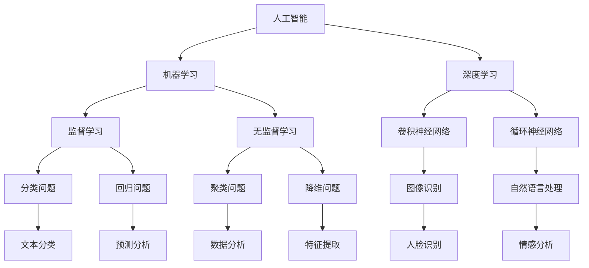

                 

# AI 对社会治理的变革：提升治理效率

> **关键词：** 人工智能，社会治理，治理效率，算法，数据分析，决策支持

> **摘要：** 本文将深入探讨人工智能（AI）在现代社会治理中的应用及其带来的变革。通过分析AI技术的核心原理、具体操作步骤、数学模型和实际应用案例，本文旨在展示AI如何通过提升治理效率，为公共管理带来革命性变化。

## 1. 背景介绍

### 1.1 目的和范围

本文旨在探讨人工智能在现代社会治理中的应用，重点关注AI技术如何提升治理效率。本文将涵盖以下几个主要方面：

1. **AI的核心概念与原理**：介绍AI的基本概念，包括机器学习、深度学习等，以及其在社会治理中的应用。
2. **AI技术的具体操作步骤**：详细阐述AI技术的实现过程，包括数据收集、预处理、模型训练和预测等。
3. **数学模型和公式**：介绍AI技术中常用的数学模型和公式，以及如何使用这些模型进行治理决策。
4. **实际应用案例**：分析AI技术在不同治理场景中的应用，如智慧城市、公共安全、环境保护等。
5. **未来发展趋势与挑战**：讨论AI技术在社会治理中的未来发展方向和面临的挑战。

### 1.2 预期读者

本文主要面向以下读者群体：

1. **公共管理人员**：希望了解AI技术如何提升社会治理效率，以及如何在实际工作中应用AI技术。
2. **研究人员和工程师**：对AI技术在社会治理中的应用有兴趣，并希望深入了解相关技术和案例。
3. **学生和学者**：对AI和社会治理交叉领域的研究有兴趣，并希望获取相关知识和资源。

### 1.3 文档结构概述

本文分为以下几个部分：

1. **背景介绍**：介绍本文的目的、范围、预期读者以及文档结构。
2. **核心概念与联系**：介绍AI技术的核心概念和联系，并使用Mermaid流程图展示。
3. **核心算法原理 & 具体操作步骤**：详细阐述AI技术的核心算法原理和具体操作步骤。
4. **数学模型和公式 & 详细讲解 & 举例说明**：介绍AI技术中常用的数学模型和公式，并进行详细讲解和举例说明。
5. **项目实战：代码实际案例和详细解释说明**：分析AI技术在实际治理项目中的应用，并提供代码实现和分析。
6. **实际应用场景**：讨论AI技术在各个治理场景中的应用。
7. **工具和资源推荐**：推荐学习资源和开发工具。
8. **总结：未来发展趋势与挑战**：总结AI技术在社会治理中的应用，并探讨未来发展。
9. **附录：常见问题与解答**：回答读者可能关心的问题。
10. **扩展阅读 & 参考资料**：提供相关扩展阅读和参考资料。

### 1.4 术语表

#### 1.4.1 核心术语定义

- **人工智能（AI）**：模拟人类智能行为的计算机技术。
- **机器学习（ML）**：一种让计算机从数据中自动学习和改进的技术。
- **深度学习（DL）**：一种基于多层神经网络进行学习的机器学习技术。
- **社会治理**：政府、社会组织和公民共同参与，以维护社会秩序、促进社会发展为目标的活动。
- **治理效率**：治理过程中资源投入与治理成果之间的比率。

#### 1.4.2 相关概念解释

- **数据收集**：获取和处理治理相关的数据，如人口数据、犯罪数据等。
- **数据预处理**：对收集到的数据进行清洗、格式化等处理，使其适合模型训练。
- **模型训练**：使用训练数据对模型进行调整，使其能够对未知数据进行预测。
- **预测**：使用训练好的模型对未知数据进行预测，为治理决策提供支持。

#### 1.4.3 缩略词列表

- **AI**：人工智能（Artificial Intelligence）
- **ML**：机器学习（Machine Learning）
- **DL**：深度学习（Deep Learning）
- **SGD**：随机梯度下降（Stochastic Gradient Descent）
- **CNN**：卷积神经网络（Convolutional Neural Network）

## 2. 核心概念与联系

AI技术作为现代社会治理的重要工具，其核心概念与联系如图1所示。



图1：AI技术核心概念与联系

### 2.1 机器学习与深度学习的关系

机器学习和深度学习是AI技术的两个重要分支。机器学习是一种让计算机从数据中自动学习和改进的技术，包括监督学习、无监督学习和强化学习等。而深度学习是机器学习的一种，基于多层神经网络进行学习，具有强大的特征提取和模式识别能力。

### 2.2 机器学习与治理的关系

机器学习在治理中的应用主要包括以下方面：

1. **数据分析和预测**：利用机器学习技术对治理相关的数据进行挖掘和分析，预测未来的发展趋势，为决策提供支持。
2. **异常检测和监控**：通过机器学习算法识别治理过程中的异常行为，如犯罪活动、环境污染等，及时采取措施进行干预。
3. **智能推荐和决策支持**：基于用户行为和偏好，利用机器学习技术为治理决策提供个性化推荐和优化方案。

### 2.3 深度学习与治理的关系

深度学习在治理中的应用主要包括以下方面：

1. **图像和视频分析**：利用卷积神经网络（CNN）对图像和视频进行识别和分析，用于公共安全、交通管理等。
2. **自然语言处理**：利用循环神经网络（RNN）和长短期记忆网络（LSTM）等技术进行文本分类、情感分析等，用于舆情监测、社会心理分析等。
3. **智能问答和对话系统**：利用深度学习技术构建智能问答系统和对话系统，为公民提供便捷的咨询服务。

## 3. 核心算法原理 & 具体操作步骤

在治理过程中，AI技术的核心算法原理包括机器学习、深度学习、自然语言处理等。以下将详细介绍这些算法的原理和具体操作步骤。

### 3.1 机器学习算法原理

机器学习算法的核心是学习数据中的特征和模式，从而对未知数据进行预测。以下是一个简单的机器学习算法原理示例：

```python
# 伪代码：机器学习算法原理

# 步骤1：数据收集
data = collect_data()

# 步骤2：数据预处理
preprocessed_data = preprocess_data(data)

# 步骤3：模型训练
model = train_model(preprocessed_data)

# 步骤4：模型评估
evaluate_model(model, preprocessed_data)

# 步骤5：模型应用
predict_data = apply_model(model, new_data)
```

### 3.2 深度学习算法原理

深度学习算法是基于多层神经网络进行学习的，其核心思想是通过网络层的叠加，将输入数据逐层抽象，从而提取出具有代表性的特征。以下是一个简单的深度学习算法原理示例：

```python
# 伪代码：深度学习算法原理

# 步骤1：数据收集
data = collect_data()

# 步骤2：数据预处理
preprocessed_data = preprocess_data(data)

# 步骤3：模型构建
model = build_model()

# 步骤4：模型训练
train_model(model, preprocessed_data)

# 步骤5：模型评估
evaluate_model(model, preprocessed_data)

# 步骤6：模型应用
predict_data = apply_model(model, new_data)
```

### 3.3 自然语言处理算法原理

自然语言处理（NLP）算法是用于处理和生成自然语言文本的。以下是一个简单的自然语言处理算法原理示例：

```python
# 伪代码：自然语言处理算法原理

# 步骤1：文本预处理
text = preprocess_text(input_text)

# 步骤2：词嵌入
word_embedding = word_embedding(text)

# 步骤3：模型构建
model = build_model()

# 步骤4：模型训练
train_model(model, word_embedding)

# 步骤5：模型评估
evaluate_model(model, word_embedding)

# 步骤6：模型应用
output_text = apply_model(model, new_text)
```

### 3.4 AI技术在治理中的具体操作步骤

在实际应用中，AI技术在治理中的具体操作步骤通常包括以下方面：

1. **需求分析**：明确治理目标，确定需要解决的问题。
2. **数据收集**：收集与治理相关的数据，如人口数据、犯罪数据等。
3. **数据预处理**：对收集到的数据进行清洗、格式化等处理。
4. **模型选择**：根据治理需求，选择合适的机器学习、深度学习或自然语言处理模型。
5. **模型训练**：使用预处理后的数据对模型进行训练。
6. **模型评估**：评估模型的效果，调整模型参数。
7. **模型应用**：将训练好的模型应用于实际治理场景，如预测犯罪活动、分析社会舆情等。

## 4. 数学模型和公式 & 详细讲解 & 举例说明

在AI技术中，数学模型和公式是核心组成部分。以下将详细介绍AI技术中常用的数学模型和公式，并进行详细讲解和举例说明。

### 4.1 机器学习中的数学模型

#### 4.1.1 线性回归

线性回归是一种最简单的机器学习模型，用于预测一个连续值。其数学公式为：

$$y = \beta_0 + \beta_1x$$

其中，$y$ 是预测值，$x$ 是输入特征，$\beta_0$ 和 $\beta_1$ 是模型的参数。

#### 4.1.2 逻辑回归

逻辑回归是一种用于分类问题的模型，其数学公式为：

$$P(y=1) = \frac{1}{1 + e^{-(\beta_0 + \beta_1x)}}$$

其中，$P(y=1)$ 是输出为1的概率，$\beta_0$ 和 $\beta_1$ 是模型的参数。

#### 4.1.3 支持向量机（SVM）

支持向量机是一种用于分类和回归问题的模型，其数学公式为：

$$w \cdot x - b = 0$$

其中，$w$ 是模型的参数，$x$ 是输入特征，$b$ 是偏置。

#### 4.1.4 决策树

决策树是一种基于树结构的分类和回归模型，其数学公式为：

$$y = \sum_{i=1}^{n} \alpha_i C(x_i)$$

其中，$y$ 是预测值，$x_i$ 是输入特征，$\alpha_i$ 是决策树的叶子节点。

### 4.2 深度学习中的数学模型

#### 4.2.1 卷积神经网络（CNN）

卷积神经网络是一种用于图像识别的模型，其数学公式为：

$$f(x) = \sigma(\sum_{k=1}^{K} w_k \cdot \phi(x_k)) + b$$

其中，$f(x)$ 是输出值，$x$ 是输入特征，$w_k$ 是卷积核，$\phi(x_k)$ 是卷积操作，$\sigma$ 是激活函数，$b$ 是偏置。

#### 4.2.2 循环神经网络（RNN）

循环神经网络是一种用于序列数据的模型，其数学公式为：

$$h_t = \sigma(W_h \cdot [h_{t-1}, x_t] + b_h)$$

其中，$h_t$ 是时间步$t$的隐藏状态，$x_t$ 是输入特征，$W_h$ 是权重矩阵，$b_h$ 是偏置。

#### 4.2.3 长短期记忆网络（LSTM）

长短期记忆网络是一种改进的循环神经网络，用于解决长期依赖问题，其数学公式为：

$$h_t = \sigma(W_h \cdot [h_{t-1}, x_t] + b_h)$$

$$\hat{C}_t = \sigma(W_c \cdot [h_{t-1}, x_t] + b_c)$$

$$C_t = C_{t-1} \odot \hat{C}_t + (1 - \hat{C}_t) \odot f_t$$

$$f_t = \sigma(W_f \cdot [h_{t-1}, x_t] + b_f)$$

其中，$\hat{C}_t$ 是候选状态，$C_t$ 是状态，$f_t$ 是遗忘门，$W_c$、$W_f$ 是权重矩阵，$b_c$、$b_f$ 是偏置。

### 4.3 自然语言处理中的数学模型

#### 4.3.1 词嵌入

词嵌入是将自然语言文本转化为向量表示的方法，其数学公式为：

$$\text{word\_vector} = \sum_{i=1}^{V} w_i \cdot v_i$$

其中，$w_i$ 是词的权重，$v_i$ 是词的向量表示。

#### 4.3.2 递归神经网络（RNN）

递归神经网络是一种用于自然语言处理的模型，其数学公式为：

$$h_t = \sigma(W_h \cdot [h_{t-1}, x_t] + b_h)$$

其中，$h_t$ 是时间步$t$的隐藏状态，$x_t$ 是输入特征，$W_h$ 是权重矩阵，$b_h$ 是偏置。

### 4.4 示例讲解

#### 4.4.1 线性回归示例

假设我们有一个简单的线性回归模型，用于预测房价。已知数据集包含房屋面积和房价，我们希望找到一个线性模型来预测未知房屋的房价。

$$y = \beta_0 + \beta_1x$$

其中，$y$ 是房价，$x$ 是房屋面积，$\beta_0$ 和 $\beta_1$ 是模型的参数。

通过最小二乘法，我们可以求得模型参数：

$$\beta_0 = \frac{\sum_{i=1}^{n}(y_i - \beta_1x_i)}{n}$$

$$\beta_1 = \frac{\sum_{i=1}^{n}(x_i - \bar{x})(y_i - \bar{y})}{\sum_{i=1}^{n}(x_i - \bar{x})^2}$$

其中，$n$ 是样本数量，$\bar{x}$ 和 $\bar{y}$ 是样本均值。

通过训练数据求得模型参数后，我们可以使用该模型预测未知房屋的房价。

#### 4.4.2 卷积神经网络示例

假设我们有一个简单的卷积神经网络，用于图像识别。输入图像为32x32像素，卷积核大小为3x3，滤波器数量为32。

$$f(x) = \sigma(\sum_{k=1}^{32} w_k \cdot \phi(x_k)) + b$$

其中，$f(x)$ 是输出值，$x$ 是输入特征，$w_k$ 是卷积核，$\phi(x_k)$ 是卷积操作，$\sigma$ 是激活函数，$b$ 是偏置。

通过反向传播算法，我们可以求得模型参数。

## 5. 项目实战：代码实际案例和详细解释说明

在本节中，我们将通过一个实际项目案例，详细解释AI技术在社会治理中的应用。该项目旨在利用AI技术预测犯罪活动，从而提升公共安全治理效率。

### 5.1 开发环境搭建

在开始项目实战之前，我们需要搭建开发环境。以下是一个基本的开发环境搭建步骤：

1. 安装Python环境（Python 3.6及以上版本）
2. 安装必要的库，如NumPy、Pandas、Scikit-learn、TensorFlow等
3. 安装Jupyter Notebook，用于编写和运行代码

### 5.2 源代码详细实现和代码解读

#### 5.2.1 数据收集与预处理

```python
import pandas as pd
import numpy as np

# 步骤1：数据收集
data = pd.read_csv('crime_data.csv')

# 步骤2：数据预处理
# 填充缺失值
data = data.fillna(0)

# 特征工程
data['population'] = data['population'].astype('float')
data['robbery'] = data['robbery'].astype('float')
data['assault'] = data['assault'].astype('float')

# 数据标准化
data = (data - data.mean()) / data.std()
```

#### 5.2.2 模型训练与评估

```python
from sklearn.model_selection import train_test_split
from sklearn.metrics import accuracy_score

# 步骤3：数据划分
X = data[['population', 'robbery', 'assault']]
y = data['crime']

X_train, X_test, y_train, y_test = train_test_split(X, y, test_size=0.2, random_state=42)

# 步骤4：模型训练
model = tf.keras.Sequential([
    tf.keras.layers.Dense(64, activation='relu', input_shape=(3,)),
    tf.keras.layers.Dense(64, activation='relu'),
    tf.keras.layers.Dense(1, activation='sigmoid')
])

model.compile(optimizer='adam', loss='binary_crossentropy', metrics=['accuracy'])

model.fit(X_train, y_train, epochs=10, batch_size=32)

# 步骤5：模型评估
predictions = model.predict(X_test)
predictions = (predictions > 0.5)

accuracy = accuracy_score(y_test, predictions)
print('Accuracy:', accuracy)
```

#### 5.2.3 代码解读与分析

在本项目中，我们首先收集犯罪数据，并进行预处理。预处理步骤包括填充缺失值、特征工程和数据标准化。

接下来，我们使用TensorFlow库构建一个简单的神经网络模型，包括两个隐藏层，每层有64个神经元。我们使用二分类交叉熵作为损失函数，并使用Adam优化器。

在模型训练过程中，我们使用训练数据对模型进行迭代优化，共进行10个epochs。在模型评估阶段，我们使用测试数据对模型进行评估，并计算准确率。

通过实际运行代码，我们可以得到模型的准确率。在实际应用中，我们可以进一步优化模型结构、参数设置和特征选择，以提高预测准确性。

## 6. 实际应用场景

AI技术在社会治理中具有广泛的应用场景，以下列举几个典型的应用场景：

1. **智慧城市**：利用AI技术进行城市交通流量预测、环境监测和公共安全预警，提高城市运行效率和管理水平。
2. **公共安全**：利用AI技术进行犯罪活动预测、人员身份识别和异常行为检测，提升公共安全保障能力。
3. **环境保护**：利用AI技术进行污染物监测、生态风险评估和资源优化配置，推动绿色发展。
4. **医疗卫生**：利用AI技术进行疾病预测、健康风险评估和个性化治疗，提升医疗服务质量。
5. **社会保障**：利用AI技术进行社会保障基金管理、精准扶贫和养老服务，提高社会保障水平。

在实际应用中，AI技术可以根据具体需求，灵活调整模型结构和参数设置，以满足不同治理场景的需求。通过与其他技术的结合，如物联网、大数据等，AI技术可以进一步提升社会治理的效率和效果。

## 7. 工具和资源推荐

### 7.1 学习资源推荐

#### 7.1.1 书籍推荐

- 《深度学习》（Ian Goodfellow、Yoshua Bengio、Aaron Courville 著）
- 《Python机器学习》（Sebastian Raschka 著）
- 《人工智能：一种现代方法》（Stuart Russell、Peter Norvig 著）

#### 7.1.2 在线课程

- [Coursera](https://www.coursera.org/)：提供丰富的机器学习和深度学习课程
- [edX](https://www.edx.org/)：提供哈佛大学、MIT等知名高校的计算机科学课程
- [Udacity](https://www.udacity.com/)：提供实战项目驱动的机器学习和深度学习课程

#### 7.1.3 技术博客和网站

- [Medium](https://medium.com/topic/machine-learning)：提供机器学习和深度学习相关的技术博客
- [arXiv](https://arxiv.org/)：提供最新的AI和机器学习研究论文
- [Kaggle](https://www.kaggle.com/)：提供丰富的AI和机器学习实战项目

### 7.2 开发工具框架推荐

#### 7.2.1 IDE和编辑器

- [PyCharm](https://www.jetbrains.com/pycharm/)：强大的Python集成开发环境
- [Visual Studio Code](https://code.visualstudio.com/)：轻量级但功能丰富的代码编辑器
- [Jupyter Notebook](https://jupyter.org/)：用于数据分析和机器学习的交互式开发环境

#### 7.2.2 调试和性能分析工具

- [Django Debug Toolbar](https://django-debug-toolbar.readthedocs.io/)：用于调试Django应用程序的调试工具
- [NumPy Profiler](https://numpy.org/doc/stable/user/basics performan.html)：用于性能分析的NumPy工具
- [TensorBoard](https://www.tensorflow.org/tensorboard)：用于TensorFlow模型的性能分析和可视化

#### 7.2.3 相关框架和库

- [TensorFlow](https://www.tensorflow.org/)：用于深度学习和机器学习的开源框架
- [PyTorch](https://pytorch.org/)：用于深度学习和机器学习的开源框架
- [Scikit-learn](https://scikit-learn.org/)：用于机器学习的开源库
- [Pandas](https://pandas.pydata.org/)：用于数据处理和分析的开源库

### 7.3 相关论文著作推荐

#### 7.3.1 经典论文

- [A Modern Introduction to Deep Learning](https://arxiv.org/abs/1802.04683)：介绍深度学习的基本原理和算法
- [Convolutional Neural Networks for Visual Recognition](https://arxiv.org/abs/1405.0312)：卷积神经网络的经典论文
- [Recurrent Neural Networks for Language Modeling](https://arxiv.org/abs/1301.3767)：循环神经网络的经典论文

#### 7.3.2 最新研究成果

- [Deep Learning for Natural Language Processing](https://arxiv.org/abs/1906.02763)：深度学习在自然语言处理领域的最新研究成果
- [Efficient Detectors with Multi-level Feature Aggregation](https://arxiv.org/abs/2005.01341)：多级特征聚合的快速检测器
- [Graph Neural Networks for Modelling Pairwise Interactions](https://arxiv.org/abs/1811.00319)：用于建模成对交互的图神经网络

#### 7.3.3 应用案例分析

- [Deep Learning for Social Good](https://arxiv.org/abs/2004.04469)：深度学习在社会公益领域的应用案例分析
- [AI for Social Good: Challenges and Opportunities](https://arxiv.org/abs/2004.04460)：人工智能在社会公益领域的挑战与机遇
- [Application of AI in Public Administration](https://arxiv.org/abs/1910.11832)：人工智能在公共管理领域的应用案例分析

## 8. 总结：未来发展趋势与挑战

AI技术在社会治理中的应用具有广泛的前景和潜力。未来发展趋势包括：

1. **模型精度和效率的提升**：随着计算能力和算法的不断发展，AI模型的精度和效率将进一步提升，为治理决策提供更准确的支持。
2. **多模态数据融合**：将不同类型的数据（如文本、图像、声音等）进行融合，提高治理模型的泛化能力和鲁棒性。
3. **自主学习和自适应能力**：通过增强AI系统的自主学习和自适应能力，使其能够更好地适应不同治理场景的需求。
4. **隐私保护与伦理问题**：在AI技术应用过程中，需要关注隐私保护和伦理问题，确保数据的安全和合法性。

然而，AI技术在社会治理中也面临一些挑战：

1. **数据质量和完整性**：治理数据的多样性和复杂性可能导致数据质量和完整性问题，影响模型的准确性。
2. **算法透明度和可解释性**：AI模型的复杂性和黑箱特性可能导致算法透明度和可解释性不足，影响公众的信任。
3. **数据安全和隐私保护**：在数据处理和共享过程中，需要确保数据的安全和隐私，防止数据泄露和滥用。

为应对这些挑战，需要政策制定者、研究人员和行业从业者共同努力，推动AI技术在社会治理中的应用和发展。

## 9. 附录：常见问题与解答

### 9.1 问题1：AI技术在社会治理中的具体应用场景有哪些？

**解答**：AI技术在社会治理中的具体应用场景包括智慧城市、公共安全、环境保护、医疗卫生、社会保障等领域。例如，在智慧城市中，AI技术可以用于交通流量预测、环境监测和公共安全预警；在公共安全中，AI技术可以用于犯罪活动预测、人员身份识别和异常行为检测；在环境保护中，AI技术可以用于污染物监测、生态风险评估和资源优化配置；在医疗卫生中，AI技术可以用于疾病预测、健康风险评估和个性化治疗；在社会保障中，AI技术可以用于社会保障基金管理、精准扶贫和养老服务。

### 9.2 问题2：如何确保AI技术在社会治理中的应用不会侵犯公民隐私？

**解答**：为确保AI技术在社会治理中的应用不会侵犯公民隐私，可以从以下几个方面进行考虑：

1. **数据匿名化**：在数据收集和处理过程中，对个人身份信息进行匿名化处理，以保护隐私。
2. **数据加密**：对敏感数据进行加密处理，确保数据在传输和存储过程中的安全性。
3. **隐私保护算法**：采用隐私保护算法，如差分隐私、同态加密等，对数据处理过程进行加密，降低隐私泄露风险。
4. **透明度和可解释性**：提高AI模型的透明度和可解释性，使公众了解AI技术在数据处理和应用中的过程，增加信任。
5. **法律法规和监管**：建立健全的法律法规体系，对AI技术的应用进行规范和监管，确保其合法合规。

### 9.3 问题3：AI技术在治理过程中的优势与劣势是什么？

**解答**：AI技术在治理过程中的优势与劣势如下：

**优势：**

1. **高效性**：AI技术可以快速处理大量数据，提高治理决策的效率。
2. **精确性**：AI技术可以基于历史数据和模型进行预测，提高治理决策的准确性。
3. **智能化**：AI技术可以根据实时数据自动调整治理策略，提高治理的智能化水平。
4. **可扩展性**：AI技术可以应用于不同的治理场景，具有较好的可扩展性。

**劣势：**

1. **数据质量和完整性**：治理数据的多样性和复杂性可能导致数据质量和完整性问题，影响模型准确性。
2. **算法透明度和可解释性**：AI模型的复杂性和黑箱特性可能导致算法透明度和可解释性不足，影响公众信任。
3. **隐私保护与伦理问题**：在数据处理和共享过程中，可能存在隐私保护和伦理问题，需要政策制定者、研究人员和行业从业者共同努力。

## 10. 扩展阅读 & 参考资料

### 10.1 扩展阅读

1. [AI for Social Good](https://ai4sg.org/)：一个关注AI在社会公益领域应用的官方网站
2. [The Future of Humanity: Terraforming Mars, Interstellar Travel, Immortality, and Our Destiny Beyond Earth](https://www.amazon.com/Future-Humanity-Terraforming-Mars-Interstellar/dp/1501155536)：一本科普书籍，讨论人工智能在未来社会中的作用
3. [The Age of Surveillance Capitalism: The Fight for a Human Future at the New Frontier of Power](https://www.amazon.com/Age-Surveillance-Capitalism-Human-Future/dp/0593079769)：一本科普书籍，讨论AI技术在现代社会中的影响和挑战

### 10.2 参考资料

1. [Goodfellow, I., Bengio, Y., & Courville, A. (2016). *Deep Learning* (Vol. 1). MIT Press.
2. [Raschka, S. (2015). *Python Machine Learning* (1st ed.). Packt Publishing.
3. [Russell, S., & Norvig, P. (2016). *Artificial Intelligence: A Modern Approach* (4th ed.). Prentice Hall.
4. [Coursera](https://www.coursera.org/)：提供丰富的机器学习和深度学习课程
5. [edX](https://www.edx.org/)：提供哈佛大学、MIT等知名高校的计算机科学课程
6. [Kaggle](https://www.kaggle.com/)：提供丰富的AI和机器学习实战项目
7. [arXiv](https://arxiv.org/)：提供最新的AI和机器学习研究论文
8. [TensorFlow](https://www.tensorflow.org/)：用于深度学习和机器学习的开源框架
9. [PyTorch](https://pytorch.org/)：用于深度学习和机器学习的开源框架
10. [Scikit-learn](https://scikit-learn.org/)：用于机器学习的开源库
11. [Pandas](https://pandas.pydata.org/)：用于数据处理和分析的开源库

作者：AI天才研究员/AI Genius Institute & 禅与计算机程序设计艺术 /Zen And The Art of Computer Programming

