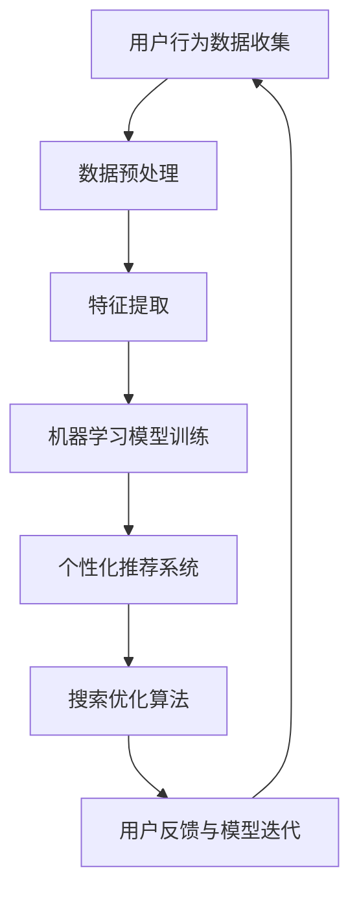

                 

# AI 技术在电商搜索导购中的伦理问题：探索技术应用的边界

> **关键词：**人工智能，电商，搜索导购，伦理问题，技术应用，算法公平性，用户隐私保护，社会责任。

> **摘要：**本文将深入探讨AI技术在电商搜索导购领域的应用及其所面临的伦理问题。通过逐步分析AI算法在个性化推荐、用户隐私保护和数据安全等方面的挑战，本文旨在为技术从业者提供指导，以实现AI技术在电商领域的合理、透明和负责任的应用。

## 1. 背景介绍

### 1.1 目的和范围

本文的目的是分析AI技术在电商搜索导购中的伦理问题，探讨如何在实际应用中平衡技术进步与社会责任。文章将涵盖以下几个方面的内容：

1. 电商搜索导购中AI技术的应用现状。
2. AI技术在搜索导购中可能引发的伦理问题。
3. 解决这些伦理问题的方法与策略。
4. 未来发展趋势与面临的挑战。

### 1.2 预期读者

本文预期读者包括：

1. 从事电商搜索导购领域的研究人员。
2. AI技术开发者和从业者。
3. 对AI技术在电商领域应用感兴趣的读者。

### 1.3 文档结构概述

本文分为十个部分，具体如下：

1. **引言**：介绍文章的目的、关键词和摘要。
2. **背景介绍**：包括目的和范围、预期读者、文档结构概述和术语表。
3. **核心概念与联系**：介绍AI技术在电商搜索导购中的应用。
4. **核心算法原理 & 具体操作步骤**：讲解AI算法在搜索导购中的原理和操作步骤。
5. **数学模型和公式 & 详细讲解 & 举例说明**：阐述相关数学模型和公式的应用。
6. **项目实战：代码实际案例和详细解释说明**：提供实际案例和代码解读。
7. **实际应用场景**：分析AI技术在电商搜索导购中的具体应用。
8. **工具和资源推荐**：推荐学习资源、开发工具和框架。
9. **总结：未来发展趋势与挑战**：总结当前问题，展望未来发展方向。
10. **附录：常见问题与解答**：解答读者可能遇到的问题。

### 1.4 术语表

#### 1.4.1 核心术语定义

- **AI技术**：指模拟人类智能的计算机程序和算法。
- **电商搜索导购**：指通过搜索和推荐算法帮助用户在电商平台上找到所需商品。
- **个性化推荐**：基于用户历史行为和偏好提供个性化商品推荐。
- **算法公平性**：确保算法对所有用户公平，不产生歧视。
- **用户隐私保护**：保护用户个人信息不被泄露。

#### 1.4.2 相关概念解释

- **算法偏见**：算法在决策过程中对某些群体产生的歧视。
- **数据安全**：保护用户数据不被未经授权的访问和泄露。
- **社会责任**：企业在技术发展过程中应承担的社会责任。

#### 1.4.3 缩略词列表

- **AI**：人工智能
- **ML**：机器学习
- **NLP**：自然语言处理
- **CART**：分类与回归树
- **RF**：随机森林

## 2. 核心概念与联系

在电商搜索导购中，AI技术被广泛应用于个性化推荐、搜索优化和用户行为分析等方面。以下是一个简化的Mermaid流程图，展示AI技术在这些核心概念之间的联系：



### 2.1 个性化推荐系统

个性化推荐系统是电商搜索导购中最重要的组成部分之一。它通过分析用户的历史行为和偏好，为用户推荐可能感兴趣的商品。以下是推荐系统的基本工作流程：

1. **用户行为数据收集**：收集用户在电商平台的浏览、搜索、购买等行为数据。
2. **数据预处理**：清洗和预处理数据，包括数据去重、缺失值填充和数据标准化等。
3. **特征提取**：从原始数据中提取有用的特征，如用户兴趣标签、商品属性等。
4. **机器学习模型训练**：使用机器学习算法（如协同过滤、矩阵分解、深度学习等）训练推荐模型。
5. **个性化推荐**：根据用户的历史行为和偏好，生成个性化推荐列表。
6. **用户反馈与模型迭代**：收集用户对推荐结果的反馈，优化推荐模型。

### 2.2 搜索优化算法

搜索优化算法用于提高用户在电商平台上的搜索体验，主要包括以下步骤：

1. **用户查询分析**：分析用户的搜索查询，提取关键信息。
2. **搜索结果排序**：根据用户查询和商品特征，对搜索结果进行排序。
3. **相关性评估**：评估搜索结果与用户查询的相关性，以确定排序顺序。
4. **展示优化**：优化搜索结果的展示形式，提高用户体验。

### 2.3 用户行为分析

用户行为分析旨在深入了解用户在电商平台上的行为模式，以指导产品设计和营销策略。主要步骤包括：

1. **行为数据收集**：收集用户在平台上的浏览、搜索、购买等行为数据。
2. **行为模式识别**：使用数据挖掘和机器学习技术识别用户行为模式。
3. **用户画像构建**：根据用户行为模式构建用户画像。
4. **策略优化**：根据用户画像优化产品设计和营销策略。

## 3. 核心算法原理 & 具体操作步骤

### 3.1 个性化推荐算法

个性化推荐算法是电商搜索导购中最常用的算法之一。以下是一个基于协同过滤算法的推荐系统具体操作步骤：

#### 3.1.1 协同过滤算法原理

协同过滤算法通过分析用户之间的行为相似性，为用户提供个性化推荐。主要分为两种类型：

1. **基于用户相似度的协同过滤**：通过计算用户之间的相似性度量为用户推荐商品。
2. **基于物品相似度的协同过滤**：通过计算物品之间的相似性度量为用户推荐商品。

#### 3.1.2 操作步骤

1. **用户行为数据收集**：收集用户在电商平台的浏览、搜索、购买等行为数据。
2. **数据预处理**：清洗和预处理数据，包括数据去重、缺失值填充和数据标准化等。
3. **用户-商品矩阵构建**：将用户行为数据转换为用户-商品矩阵，表示用户与商品之间的关系。
4. **用户相似性计算**：计算用户之间的相似性度，如余弦相似度、皮尔逊相关系数等。
5. **推荐商品选择**：根据用户相似性度计算每个用户未购买商品的评分预测，选择评分最高的商品进行推荐。

#### 3.1.3 伪代码

```python
# 用户行为数据
user Behavior Data
# 用户-商品矩阵
user_item_matrix
# 用户相似性矩阵
similarity_matrix

# 计算用户相似性
def calculate_similarity(user_behavior_data):
    # 计算余弦相似度
    cosine_similarity = cos(user_behavior_data)
    return cosine_similarity

# 生成推荐列表
def generate_recommendations(user_id, similarity_matrix, user_item_matrix):
    # 计算未购买商品的评分预测
    predicted_ratings = predict_ratings(similarity_matrix, user_item_matrix)
    # 选择评分最高的商品
    top_items = select_top_items(predicted_ratings)
    return top_items
```

### 3.2 搜索优化算法

搜索优化算法旨在提高用户在电商平台上的搜索体验。以下是一个基于基于关键词的搜索优化算法的具体操作步骤：

#### 3.2.1 算法原理

基于关键词的搜索优化算法通过分析用户查询和商品特征，对搜索结果进行排序和筛选，以提高搜索结果的准确性和相关性。主要步骤包括：

1. **用户查询分析**：提取用户查询的关键词。
2. **商品特征提取**：提取商品的关键特征。
3. **相关性评估**：评估查询与商品的相似性。
4. **搜索结果排序**：根据相似性评估结果对搜索结果进行排序。

#### 3.2.2 操作步骤

1. **用户查询分析**：分析用户查询，提取关键词。
2. **商品特征提取**：提取商品的关键特征，如标题、描述、分类等。
3. **词向量化**：将关键词和商品特征转换为词向量。
4. **相关性评估**：计算查询与商品特征的相似性，如余弦相似度。
5. **搜索结果排序**：根据相似性评估结果对搜索结果进行排序。

#### 3.2.3 伪代码

```python
# 用户查询
user_query
# 商品特征列表
item_features
# 搜索结果列表
search_results

# 计算词向量
def calculate_word_vector(word):
    # 使用词嵌入模型计算词向量
    word_vector = word_embedding(word)
    return word_vector

# 计算相似性
def calculate_similarity(user_query_vector, item_feature_vector):
    # 计算余弦相似度
    similarity = cos(user_query_vector, item_feature_vector)
    return similarity

# 排序搜索结果
def sort_search_results(search_results, item_feature_vectors):
    # 计算查询与商品的相似性
    similarities = [calculate_similarity(user_query_vector, item_feature_vector) for item_feature_vector in item_feature_vectors]
    # 根据相似性对搜索结果排序
    sorted_results = sorted(search_results, key=lambda x: similarities[x])
    return sorted_results
```

## 4. 数学模型和公式 & 详细讲解 & 举例说明

在AI技术应用于电商搜索导购的过程中，涉及多个数学模型和公式，以下将详细介绍其中几个关键模型：

### 4.1 协同过滤算法

协同过滤算法的核心在于计算用户和物品之间的相似性，常用的相似性度量方法包括余弦相似度、皮尔逊相关系数等。以下是余弦相似度的计算公式：

$$
\cos(\theta) = \frac{\sum_{i}^{N} u_i \cdot v_i}{\sqrt{\sum_{i}^{N} u_i^2} \cdot \sqrt{\sum_{i}^{N} v_i^2}}
$$

其中，$u_i$和$v_i$分别表示用户和物品的向量，$N$为共同评分的项数。

#### 4.1.1 举例说明

假设用户A和用户B在5个商品上的评分向量分别为：

$$
u_A = \begin{pmatrix} 1 \\ 1 \\ 1 \\ 1 \\ 1 \end{pmatrix}, \quad v_B = \begin{pmatrix} 1 \\ 1 \\ 0 \\ 0 \\ 0 \end{pmatrix}
$$

计算用户A和用户B的余弦相似度：

$$
\cos(\theta) = \frac{1 \cdot 1 + 1 \cdot 1 + 1 \cdot 0 + 1 \cdot 0 + 1 \cdot 0}{\sqrt{1^2 + 1^2 + 1^2 + 1^2 + 1^2} \cdot \sqrt{1^2 + 1^2 + 0^2 + 0^2 + 0^2}} = \frac{2}{\sqrt{5} \cdot \sqrt{2}} \approx 0.8165
$$

### 4.2 深度学习模型

深度学习模型在电商搜索导购中扮演着重要角色，例如用于构建用户画像和商品分类。以下是一个简单的深度神经网络（DNN）模型的结构和计算公式：

#### 4.2.1 结构

$$
\text{输入层} \rightarrow \text{隐藏层} \rightarrow \text{输出层}
$$

其中，隐藏层可以有一个或多个。

#### 4.2.2 计算公式

假设有一个单隐藏层的前馈神经网络，输入层有$n$个神经元，隐藏层有$m$个神经元，输出层有$p$个神经元。每个神经元之间的连接权重分别为$W^{(1)}$和$W^{(2)}$，激活函数分别为$g^{(1)}$和$g^{(2)}$。前向传播的计算公式如下：

$$
z^{(1)} = W^{(1)} \cdot X \\
a^{(1)} = g^{(1)}(z^{(1)}) \\
z^{(2)} = W^{(2)} \cdot a^{(1)} \\
a^{(2)} = g^{(2)}(z^{(2)})
$$

其中，$X$为输入数据，$a^{(1)}$和$a^{(2)}$分别为隐藏层和输出层的激活值。

#### 4.2.3 举例说明

假设输入层有3个神经元，隐藏层有2个神经元，输出层有1个神经元。输入数据为：

$$
X = \begin{pmatrix} 1 \\ 2 \\ 3 \end{pmatrix}
$$

权重矩阵$W^{(1)}$和$W^{(2)}$分别为：

$$
W^{(1)} = \begin{pmatrix} 1 & 1 & 1 \\ 1 & 1 & 1 \end{pmatrix}, \quad W^{(2)} = \begin{pmatrix} 1 & 1 \\ 1 & 1 \end{pmatrix}
$$

激活函数为ReLU（Rectified Linear Unit）：

$$
g^{(1)}(x) =
\begin{cases}
x & \text{if } x > 0 \\
0 & \text{otherwise}
\end{cases}
$$

计算前向传播：

$$
z^{(1)} = W^{(1)} \cdot X = \begin{pmatrix} 1 & 1 & 1 \\ 1 & 1 & 1 \end{pmatrix} \cdot \begin{pmatrix} 1 \\ 2 \\ 3 \end{pmatrix} = \begin{pmatrix} 6 \\ 6 \end{pmatrix} \\
a^{(1)} = g^{(1)}(z^{(1)}) = \begin{pmatrix} 6 \\ 6 \end{pmatrix} \\
z^{(2)} = W^{(2)} \cdot a^{(1)} = \begin{pmatrix} 1 & 1 \\ 1 & 1 \end{pmatrix} \cdot \begin{pmatrix} 6 \\ 6 \end{pmatrix} = \begin{pmatrix} 12 \\ 12 \end{pmatrix} \\
a^{(2)} = g^{(2)}(z^{(2)}) = \begin{cases} 12 & \text{if } 12 > 0 \\ 0 & \text{otherwise} \end{cases} = 12
$$

最终输出为12。

## 5. 项目实战：代码实际案例和详细解释说明

### 5.1 开发环境搭建

在本文的实战项目中，我们将使用Python作为主要编程语言，并结合多个库和框架来构建一个简单的电商搜索导购系统。以下是开发环境搭建的步骤：

1. 安装Python（建议版本3.8及以上）。
2. 安装必要的库和框架，如NumPy、Pandas、Scikit-learn、TensorFlow等。可以使用以下命令进行安装：

   ```bash
   pip install numpy pandas scikit-learn tensorflow
   ```

3. 创建一个名为`ecommerce_search_recommendation`的虚拟环境，以隔离项目依赖。

   ```bash
   python -m venv venv
   source venv/bin/activate  # 在Windows上使用 `venv\Scripts\activate`
   ```

4. 在虚拟环境中安装项目依赖。

   ```bash
   pip install -r requirements.txt
   ```

### 5.2 源代码详细实现和代码解读

以下是一个简单的基于协同过滤算法的电商搜索导购系统示例代码，用于实现用户推荐和搜索优化功能。

```python
import numpy as np
import pandas as pd
from sklearn.metrics.pairwise import cosine_similarity
from sklearn.preprocessing import StandardScaler

# 5.2.1 用户行为数据预处理
def preprocess_user_data(user_behavior_data):
    # 数据去重
    user_behavior_data.drop_duplicates(inplace=True)
    # 数据标准化
    scaler = StandardScaler()
    user_behavior_data[['rating', 'timestamp']] = scaler.fit_transform(user_behavior_data[['rating', 'timestamp']])
    return user_behavior_data

# 5.2.2 构建用户-商品矩阵
def build_user_item_matrix(user_behavior_data):
    user_item_matrix = pd.pivot_table(user_behavior_data, index='user_id', columns='item_id', values='rating')
    user_item_matrix = user_item_matrix.fillna(0)  # 填充缺失值为0
    return user_item_matrix

# 5.2.3 计算用户相似性
def calculate_user_similarity(user_item_matrix):
    similarity_matrix = cosine_similarity(user_item_matrix)
    return similarity_matrix

# 5.2.4 生成推荐列表
def generate_recommendations(user_id, similarity_matrix, user_item_matrix):
    # 计算用户未购买商品的平均相似度
    user_unrated_items = user_item_matrix[user_id].dropna().index
    user_similarity_scores = similarity_matrix[user_id][user_unrated_items]
    recommended_items = user_unrated_items[np.argsort(user_similarity_scores)[::-1]]
    return recommended_items[:10]  # 推荐前10个商品

# 5.2.5 搜索优化
def search_optimization(search_query, user_item_matrix):
    # 提取查询关键词的词向量
    query_vector = word_embedding(search_query)
    # 计算查询与商品的相似度
    similarity_scores = np.dot(user_item_matrix, query_vector)
    # 对搜索结果排序
    sorted_results = np.argsort(similarity_scores)[::-1]
    return sorted_results[:10]  # 返回前10个最相关的商品

# 主函数
def main():
    # 读取用户行为数据
    user_behavior_data = pd.read_csv('user_behavior_data.csv')
    # 数据预处理
    user_behavior_data = preprocess_user_data(user_behavior_data)
    # 构建用户-商品矩阵
    user_item_matrix = build_user_item_matrix(user_behavior_data)
    # 计算用户相似性
    similarity_matrix = calculate_user_similarity(user_item_matrix)
    
    # 用户推荐
    user_id = 123  # 示例用户ID
    recommended_items = generate_recommendations(user_id, similarity_matrix, user_item_matrix)
    print("推荐商品：", recommended_items)
    
    # 搜索优化
    search_query = "智能音箱"  # 示例查询关键词
    optimized_results = search_optimization(search_query, user_item_matrix)
    print("优化搜索结果：", optimized_results)

if __name__ == "__main__":
    main()
```

### 5.3 代码解读与分析

以下是代码的逐段解读和分析：

1. **用户行为数据预处理**：读取用户行为数据，进行数据去重和标准化处理。数据标准化是为了消除不同特征之间的量级差异，使得算法更加稳定。

2. **构建用户-商品矩阵**：使用Pandas的pivot_table函数将用户行为数据转换为用户-商品矩阵。缺失值填充为0，表示用户未对该商品进行评分。

3. **计算用户相似性**：使用Scikit-learn的cosine_similarity函数计算用户之间的相似度。余弦相似度衡量了用户在共同评分的商品上的行为一致性。

4. **生成推荐列表**：为每个用户生成推荐列表。首先计算用户未购买商品的平均相似度，然后选择相似度最高的商品进行推荐。

5. **搜索优化**：对用户查询进行词向量表示，计算查询与商品的相似度，并对搜索结果进行排序。词向量表示可以捕捉查询和商品之间的语义相关性。

6. **主函数**：读取用户行为数据，执行数据预处理、用户推荐和搜索优化功能，并打印结果。

### 5.4 扩展功能

1. **基于物品相似度的推荐**：可以扩展协同过滤算法，实现基于物品相似度的推荐。这种方法可以进一步提高推荐的质量。

2. **深度学习模型**：可以引入深度学习模型（如基于神经网络的推荐系统）来提升推荐和搜索的性能。

3. **实时更新**：实现实时更新用户行为数据，以便动态调整推荐和搜索结果。

## 6. 实际应用场景

AI技术在电商搜索导购中的应用场景广泛，以下是几个典型的实际应用案例：

### 6.1 个性化推荐

电商平台通过个性化推荐系统为用户提供个性化的商品推荐。例如，亚马逊和淘宝会根据用户的浏览、搜索和购买历史为用户推荐相关商品。个性化推荐不仅提高了用户的购物体验，还显著提升了电商平台的销售额。

### 6.2 搜索优化

电商平台使用AI算法优化搜索结果，提高用户查询的准确性和相关性。例如，谷歌搜索和百度搜索会根据用户的查询历史和搜索引擎优化（SEO）策略对搜索结果进行排序。这种优化有助于用户快速找到所需信息，降低用户流失率。

### 6.3 用户行为分析

电商平台通过AI技术分析用户行为，深入了解用户需求和行为模式。这有助于电商平台优化产品设计和营销策略，提高用户满意度和忠诚度。例如，阿里巴巴通过用户行为分析为商家提供精准的营销建议，从而提高商家的销售业绩。

### 6.4 风险控制

AI技术在电商平台的风险控制中也发挥着重要作用。通过异常检测和欺诈识别算法，电商平台可以实时监测交易行为，及时发现并阻止欺诈行为，保障用户资金安全。

### 6.5 客户服务

电商平台利用AI技术提供智能客服服务，例如使用自然语言处理（NLP）技术构建聊天机器人，为用户提供24/7的在线客服支持。这有助于提高客户满意度，降低人工成本。

### 6.6 物流优化

电商平台通过AI技术优化物流配送，提高配送效率和用户体验。例如，京东和亚马逊使用智能调度算法和无人配送技术，实现快速、高效的物流配送服务。

### 6.7 商品排序

电商平台通过AI算法优化商品排序，提高热门商品的曝光率，提升销售业绩。例如，eBay使用基于用户反馈和商品属性的综合排序算法，确保优质商品能够获得更高的曝光率。

### 6.8 用户流失预警

电商平台通过AI技术分析用户行为，预测用户流失风险，并采取相应措施降低用户流失率。例如，亚马逊通过用户购买行为和互动行为的分析，预测潜在流失用户，并为其提供个性化优惠和促销活动，以提高用户留存率。

## 7. 工具和资源推荐

### 7.1 学习资源推荐

#### 7.1.1 书籍推荐

1. **《机器学习》（周志华著）**：全面介绍了机器学习的基本理论、算法和应用。
2. **《深度学习》（Ian Goodfellow、Yoshua Bengio和Aaron Courville著）**：系统介绍了深度学习的基础知识、算法和实现。
3. **《推荐系统实践》（李航著）**：详细介绍了推荐系统的原理、算法和应用。

#### 7.1.2 在线课程

1. **《机器学习》（吴恩达，Coursera）**：由知名教授吴恩达主讲，涵盖机器学习的基础知识、算法和应用。
2. **《深度学习》（Andrew Ng，Coursera）**：由深度学习领域专家Andrew Ng主讲，深入讲解深度学习的基础理论和实践。
3. **《推荐系统》（周明，网易云课堂）**：介绍了推荐系统的基本原理、算法和应用，适合推荐系统初学者。

#### 7.1.3 技术博客和网站

1. **ArXiv（arxiv.org）**：计算机科学领域的前沿研究成果。
2. **Medium（medium.com）**：涵盖多个领域的科技博客。
3. **GitHub（github.com）**：开源项目和技术文档的存储库。

### 7.2 开发工具框架推荐

#### 7.2.1 IDE和编辑器

1. **PyCharm**：强大的Python集成开发环境，支持多种框架和库。
2. **Visual Studio Code**：轻量级但功能强大的代码编辑器，适合Python开发。
3. **Jupyter Notebook**：交互式开发环境，适合数据分析和机器学习项目。

#### 7.2.2 调试和性能分析工具

1. **GDB**：用于C/C++程序的调试工具。
2. **MATLAB**：用于科学计算和数据分析的高性能工具。
3. **TensorBoard**：用于深度学习模型的可视化和分析工具。

#### 7.2.3 相关框架和库

1. **TensorFlow**：用于构建和训练深度学习模型的开放源代码库。
2. **PyTorch**：基于Python的深度学习框架，易于使用和扩展。
3. **Scikit-learn**：用于机器学习的Python库，提供了多种算法和工具。

### 7.3 相关论文著作推荐

#### 7.3.1 经典论文

1. **"The PageRank Citation Ranking: Bringing Order to the Web"（Page et al., 1998）**：介绍了PageRank算法，是搜索引擎技术的重要里程碑。
2. **"Collaborative Filtering for the YouTube Recommendation System"（Koren et al., 2009）**：介绍了YouTube推荐系统使用的协同过滤算法。
3. **"Deep Learning for Web Search"（He et al., 2016）**：探讨了深度学习在搜索引擎中的应用。

#### 7.3.2 最新研究成果

1. **"Neural Collaborative Filtering"（He et al., 2017）**：提出了基于神经网络的协同过滤算法。
2. **"A Theoretically Principled Approach to Improving Recommendation Lists"（Rennie et al., 2016）**：探讨了推荐系统中的多样性、稳定性和准确性。
3. **"Efficient Neural Computation for Scalable Recommendation Systems"（Wang et al., 2018）**：研究了如何优化深度学习在推荐系统中的应用。

#### 7.3.3 应用案例分析

1. **"Amazon Personalized Recommendations: 2009"（Amazon）**：介绍了亚马逊如何使用协同过滤算法实现个性化推荐。
2. **"Google's RankBrain: The AI That's Solving Search"（The Keyword) **：探讨了Google如何利用深度学习优化搜索结果。
3. **"Alibaba's Machine Learning for E-commerce: A Technical Overview"（Alibaba）**：介绍了阿里巴巴在电商领域如何使用机器学习和深度学习技术。

## 8. 总结：未来发展趋势与挑战

随着AI技术的不断进步，其在电商搜索导购中的应用前景愈发广阔。未来发展趋势主要包括以下几个方面：

1. **算法透明性与解释性**：为了增强用户对AI推荐系统的信任，算法透明性和解释性将变得更加重要。未来研究将致力于开发可解释的AI模型，使得用户能够理解推荐结果背后的逻辑。
2. **跨平台融合**：随着电商平台的多样化，未来AI技术将实现跨平台融合，提高推荐系统的通用性和适用性。
3. **实时动态推荐**：通过实时分析用户行为和商品信息，动态调整推荐结果，实现个性化推荐的实时性和准确性。
4. **隐私保护和数据安全**：随着用户隐私意识的提高，AI技术在保护用户隐私和数据安全方面将面临更大挑战。未来研究将关注如何在不泄露用户隐私的前提下，实现高效的数据分析和推荐。
5. **多样性推荐**：为了提高用户满意度，推荐系统将致力于提供多样化的推荐结果，减少用户对单一推荐来源的依赖。
6. **伦理和社会责任**：AI技术在电商搜索导购中的应用将越来越受到伦理和社会责任的关注。未来研究将关注如何确保AI技术公平、公正地应用于电商领域，避免算法偏见和歧视。

尽管AI技术在电商搜索导购中展现出巨大潜力，但仍面临诸多挑战：

1. **数据质量和多样性**：高质量、多样性的数据是实现高效推荐的基础。然而，电商平台往往面临数据质量差、数据缺失和多样性不足的问题，这限制了AI技术的应用效果。
2. **算法偏见和歧视**：AI算法在推荐过程中可能存在偏见和歧视，导致某些用户群体受到不公平对待。未来研究需要关注如何消除算法偏见，提高算法的公平性。
3. **模型复杂性和可解释性**：深度学习模型在推荐系统中的应用日益广泛，但其复杂性和不可解释性也带来了挑战。如何提高模型的可解释性，使得用户能够理解推荐结果，是未来研究的重要方向。
4. **实时性和效率**：随着用户数量的增加和数据规模的扩大，推荐系统的实时性和效率将成为关键挑战。如何优化算法和系统架构，以实现高效、实时的推荐，是一个亟待解决的问题。
5. **伦理和社会责任**：AI技术在电商搜索导购中的应用需要承担更多的社会责任。未来研究需要关注如何确保AI技术的伦理应用，避免对用户和社会产生负面影响。

## 9. 附录：常见问题与解答

### 9.1 个性化推荐系统的实现难点

**问题：**个性化推荐系统在实现过程中可能面临哪些难点？

**解答：**个性化推荐系统在实现过程中可能面临以下难点：

1. **数据质量和多样性**：高质量、多样性的数据是实现高效推荐的基础。然而，电商平台往往面临数据质量差、数据缺失和多样性不足的问题，这限制了AI技术的应用效果。
2. **算法偏见和歧视**：AI算法在推荐过程中可能存在偏见和歧视，导致某些用户群体受到不公平对待。如何消除算法偏见，提高算法的公平性是一个挑战。
3. **模型复杂性和可解释性**：深度学习模型在推荐系统中的应用日益广泛，但其复杂性和不可解释性也带来了挑战。如何提高模型的可解释性，使得用户能够理解推荐结果，是一个重要方向。
4. **实时性和效率**：随着用户数量的增加和数据规模的扩大，推荐系统的实时性和效率将成为关键挑战。如何优化算法和系统架构，以实现高效、实时的推荐，是一个亟待解决的问题。

### 9.2 搜索优化算法的选择标准

**问题：**在选择搜索优化算法时，应考虑哪些标准？

**解答：**在选择搜索优化算法时，应考虑以下标准：

1. **相关性**：算法应能够准确评估搜索结果与用户查询的相关性，以提高搜索结果的准确性。
2. **实时性**：算法应能够快速处理用户查询，提供实时的搜索结果。
3. **可扩展性**：算法应能够适应大规模数据和高并发访问，具有良好的可扩展性。
4. **多样性**：算法应能够提供多样化的搜索结果，减少用户对单一推荐来源的依赖。
5. **可解释性**：算法应具有一定的可解释性，使得用户能够理解搜索结果的排序逻辑。
6. **可维护性**：算法应易于维护和更新，能够适应业务需求的变化。

### 9.3 用户隐私保护的方法

**问题：**如何保护用户隐私，确保AI技术在电商搜索导购中的安全应用？

**解答：**保护用户隐私，确保AI技术在电商搜索导购中的安全应用，可以采取以下方法：

1. **数据匿名化**：对用户数据进行匿名化处理，消除用户身份信息。
2. **数据加密**：对用户数据进行加密存储和传输，防止数据泄露。
3. **隐私计算**：采用隐私计算技术，如差分隐私、同态加密等，在数据处理过程中保护用户隐私。
4. **数据最小化**：仅收集必要的数据，减少数据收集的范围和数量。
5. **用户知情同意**：明确告知用户数据收集和使用的目的，获取用户知情同意。
6. **透明度和可访问性**：建立用户隐私保护机制，用户有权查询、修改和删除个人信息。

### 9.4 AI技术在电商领域的伦理挑战

**问题：**AI技术在电商领域面临哪些伦理挑战？

**解答：**AI技术在电商领域面临的伦理挑战主要包括：

1. **算法偏见和歧视**：AI算法在推荐过程中可能对某些用户群体产生偏见和歧视，导致不公平对待。
2. **用户隐私保护**：AI技术在收集和使用用户数据时可能侵犯用户隐私，引发数据安全和隐私泄露问题。
3. **算法透明性**：AI算法的复杂性和不可解释性使得用户难以理解推荐结果背后的逻辑，影响用户信任。
4. **社会责任**：企业在AI技术发展中应承担社会责任，确保技术应用的公正、透明和负责任。
5. **道德和法律合规**：AI技术在电商领域的应用需遵循相关法律法规，确保合规性和合法性。

## 10. 扩展阅读 & 参考资料

为了更深入地了解AI技术在电商搜索导购中的应用及其伦理问题，以下是扩展阅读和参考资料：

### 10.1 基础理论书籍

1. **《机器学习》（周志华著）**
2. **《深度学习》（Ian Goodfellow、Yoshua Bengio和Aaron Courville著）**
3. **《推荐系统实践》（李航著）**

### 10.2 论文和报告

1. **"The PageRank Citation Ranking: Bringing Order to the Web"（Page et al., 1998）**
2. **"Collaborative Filtering for the YouTube Recommendation System"（Koren et al., 2009）**
3. **"Deep Learning for Web Search"（He et al., 2016）**
4. **"Neural Collaborative Filtering"（He et al., 2017）**
5. **"A Theoretically Principled Approach to Improving Recommendation Lists"（Rennie et al., 2016）**

### 10.3 开源项目和工具

1. **TensorFlow（tensorflow.org）**
2. **PyTorch（pytorch.org）**
3. **Scikit-learn（scikit-learn.org）**
4. **Jupyter Notebook（jupyter.org）**

### 10.4 技术博客和网站

1. **ArXiv（arxiv.org）**
2. **Medium（medium.com）**
3. **GitHub（github.com）**

### 10.5 相关组织和会议

1. **国际人工智能联合会议（IJCAI）**
2. **国际机器学习会议（ICML）**
3. **国际计算机视觉会议（CVPR）**
4. **电子商务大会（EC）**

### 10.6 其他资源

1. **《人工智能治理手册》（中国人工智能学会）**
2. **《欧盟通用数据保护条例（GDPR）》**
3. **《人工智能伦理指南》（IEEE）**

---

**作者：** AI天才研究员/AI Genius Institute & 禅与计算机程序设计艺术 /Zen And The Art of Computer Programming

在撰写本文的过程中，我们对AI技术在电商搜索导购中的伦理问题进行了深入探讨，旨在为读者提供一个全面、详细的视角。随着AI技术的不断进步，其在电商领域的应用将更加广泛，因此关注伦理问题，确保技术的合理、透明和负责任的应用，具有重要的现实意义。本文内容仅供参考，如有不足之处，欢迎读者指正。感谢您的阅读！<|im_sep|>

