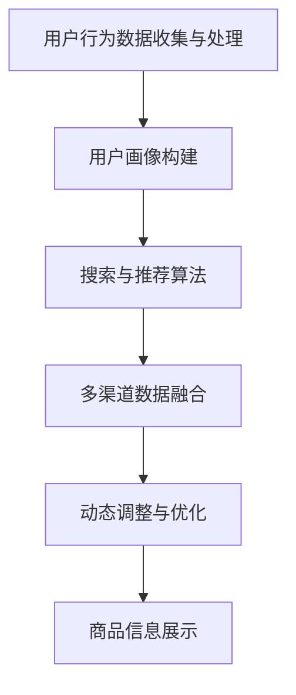

                 

# AI 赋能电商搜索导购：技术应用与未来展望

> **关键词：** 电商搜索，AI 技术，导购系统，自然语言处理，推荐算法，大数据分析

> **摘要：** 本文将深入探讨AI技术在电商搜索导购领域中的应用，分析其核心概念、算法原理和数学模型，并通过实战案例展示其实际应用效果。同时，文章将对未来发展趋势和挑战进行展望，为相关领域的研究者和从业者提供有价值的参考。

## 1. 背景介绍

### 1.1 目的和范围

本文旨在系统地介绍AI技术在电商搜索导购领域的应用，探讨其在提升用户体验、优化搜索效率和提升销售转化率方面的作用。本文将涵盖以下几个方面的内容：

1. 电商搜索导购系统的基本概念和架构。
2. 关键AI技术，如自然语言处理、推荐算法和大数据分析等。
3. 核心算法原理和具体操作步骤。
4. 数学模型和公式及其详细讲解。
5. 实际应用场景和工具资源推荐。
6. 未来发展趋势与挑战。

### 1.2 预期读者

本文主要面向以下几类读者：

1. 对电商搜索导购领域感兴趣的科研人员和工程师。
2. 从事AI技术研究和开发的专业人士。
3. 对电商业务和人工智能相结合感兴趣的企业管理者。

### 1.3 文档结构概述

本文结构如下：

1. **背景介绍**：介绍本文的目的、范围、预期读者以及文档结构。
2. **核心概念与联系**：介绍电商搜索导购系统的核心概念、原理和架构。
3. **核心算法原理 & 具体操作步骤**：详细讲解核心算法原理和具体操作步骤。
4. **数学模型和公式 & 详细讲解 & 举例说明**：介绍相关的数学模型和公式，并进行详细讲解和举例。
5. **项目实战：代码实际案例和详细解释说明**：通过实际项目案例，展示代码的实现过程和详细解释。
6. **实际应用场景**：探讨AI技术在电商搜索导购领域的实际应用场景。
7. **工具和资源推荐**：推荐学习资源、开发工具和框架。
8. **总结：未来发展趋势与挑战**：总结当前发展现状，展望未来趋势和挑战。
9. **附录：常见问题与解答**：针对常见问题提供解答。
10. **扩展阅读 & 参考资料**：提供相关领域的扩展阅读和参考资料。

### 1.4 术语表

#### 1.4.1 核心术语定义

- **电商搜索导购系统**：结合电商业务和AI技术，为用户提供个性化商品推荐和搜索服务的系统。
- **自然语言处理（NLP）**：计算机科学领域中的一个分支，涉及语言的理解和生成，包括语音识别、文本分类、情感分析等。
- **推荐算法**：根据用户的历史行为和偏好，为用户推荐相关商品或内容的算法。
- **大数据分析**：利用数据挖掘和分析技术，从海量数据中提取有价值的信息和知识。

#### 1.4.2 相关概念解释

- **用户画像**：基于用户的历史行为数据，构建的用户特征模型。
- **协同过滤**：一种基于用户相似度的推荐算法，通过分析用户之间的行为相似性来推荐商品。
- **深度学习**：一种基于神经网络的机器学习技术，通过多层神经网络模型实现自动特征学习和复杂模式识别。

#### 1.4.3 缩略词列表

- **NLP**：自然语言处理
- **AI**：人工智能
- **DL**：深度学习
- **ML**：机器学习
- **CFL**：协同过滤
- **EC**：电商

## 2. 核心概念与联系

### 2.1 电商搜索导购系统概述

电商搜索导购系统是电子商务领域的重要组成部分，它通过结合AI技术，为用户提供更加智能化和个性化的商品推荐和搜索服务。一个典型的电商搜索导购系统包括以下几个核心组成部分：

1. **用户行为数据收集与处理**：收集用户在电商平台上的浏览、搜索、购买等行为数据，通过数据清洗和处理，构建用户画像。
2. **自然语言处理（NLP）**：利用NLP技术，对用户输入的搜索关键词进行语义分析和理解，提高搜索精度和用户体验。
3. **推荐算法**：根据用户画像和商品特征，利用推荐算法为用户推荐相关商品。
4. **商品信息展示**：将推荐结果以友好的界面形式展示给用户，包括商品名称、描述、价格等。
5. **用户反馈与优化**：收集用户对推荐结果的反馈，通过反馈信息不断优化推荐算法和系统性能。

### 2.2 核心概念原理和架构

电商搜索导购系统的核心概念和原理可以概括为以下几个方面：

1. **用户画像构建**：通过用户行为数据，构建用户画像，包括用户的基本信息、兴趣偏好、购买行为等。
2. **搜索与推荐算法**：结合用户画像和商品特征，利用搜索与推荐算法，为用户精准推荐相关商品。
3. **多渠道数据融合**：整合用户在不同渠道的行为数据，包括移动端、PC端、社交媒体等，提高推荐系统的全面性和准确性。
4. **动态调整与优化**：根据用户反馈和实时数据，动态调整推荐策略和算法参数，提高推荐效果。

下面是一个简单的电商搜索导购系统的 Mermaid 流程图，展示其核心概念和架构：



### 2.3 相关概念联系

电商搜索导购系统的各个组成部分之间相互联系、相互影响，共同构成一个完整的系统。以下是各组成部分之间的联系：

- **用户画像构建**与**搜索与推荐算法**：用户画像为推荐算法提供了用户特征信息，推荐算法根据用户画像和商品特征为用户推荐相关商品。
- **搜索与推荐算法**与**多渠道数据融合**：多渠道数据融合可以更全面地了解用户行为，提高推荐系统的准确性和全面性。
- **多渠道数据融合**与**动态调整与优化**：多渠道数据融合为动态调整和优化提供了更多的数据来源，动态调整和优化可以更快速地响应用户需求。
- **商品信息展示**与**用户反馈与优化**：商品信息展示直接影响用户体验，用户反馈为系统优化提供了重要依据。

通过以上分析，我们可以看出电商搜索导购系统是一个复杂、动态的体系，各组成部分相互联系、相互影响，共同提高系统的性能和用户体验。在接下来的章节中，我们将进一步探讨核心算法原理、数学模型和实际应用场景，为读者提供更深入的了解。

## 3. 核心算法原理 & 具体操作步骤

### 3.1 自然语言处理（NLP）

自然语言处理（NLP）是电商搜索导购系统中的关键组成部分，它主要负责对用户输入的搜索关键词进行语义分析和理解，从而提高搜索精度和用户体验。以下是NLP的核心算法原理和具体操作步骤：

#### 3.1.1 算法原理

NLP的核心算法主要包括以下几个部分：

1. **分词（Tokenization）**：将输入文本拆分成单词或短语。
2. **词性标注（Part-of-Speech Tagging）**：为每个单词标注其词性，如名词、动词、形容词等。
3. **命名实体识别（Named Entity Recognition）**：识别文本中的命名实体，如人名、地名、组织名等。
4. **句法分析（Syntactic Parsing）**：分析文本中的句法结构，理解句子成分和关系。
5. **语义分析（Semantic Analysis）**：理解文本的语义内容，包括语义角色标注、语义关系推理等。

#### 3.1.2 操作步骤

以下是NLP算法的具体操作步骤：

1. **文本预处理**：
   - 清洗数据：去除无关的标点符号、停用词等。
   - 分词：使用分词算法将文本拆分成单词或短语。

   ```python
   def preprocess_text(text):
       # 清洗数据
       text = text.lower()
       text = re.sub(r'[^\w\s]', '', text)
       # 分词
       words = jieba.cut(text)
       return words
   ```

2. **词性标注**：
   - 使用词性标注算法为每个单词标注词性。

   ```python
   def pos_tagging(words):
       pos_tags = jieba.pos_tag(words)
       return pos_tags
   ```

3. **命名实体识别**：
   - 使用命名实体识别算法识别文本中的命名实体。

   ```python
   def named_entity_recognition(text):
       ner_tags = pynlpir.get_ne_tags(text)
       return ner_tags
   ```

4. **句法分析**：
   - 使用句法分析算法分析文本中的句法结构。

   ```python
   def syntactic_parsing(text):
       tree = pynlp_parser.parse(text)
       return tree
   ```

5. **语义分析**：
   - 使用语义分析算法理解文本的语义内容。

   ```python
   def semantic_analysis(text):
       entities = pynlp_analyzer.get_entities(text)
       relations = pynlp_analyzer.get_relations(text)
       return entities, relations
   ```

### 3.2 推荐算法

推荐算法是电商搜索导购系统的另一个核心组成部分，它主要负责根据用户画像和商品特征，为用户推荐相关商品。以下是推荐算法的核心原理和具体操作步骤：

#### 3.2.1 算法原理

推荐算法主要分为两大类：

1. **基于内容的推荐（Content-Based Recommendation）**：
   - 根据用户的历史行为和偏好，提取用户特征，为用户推荐与用户特征相似的物品。

2. **协同过滤（Collaborative Filtering）**：
   - 通过分析用户之间的行为相似性，为用户推荐其他用户喜欢的物品。

#### 3.2.2 操作步骤

以下是推荐算法的具体操作步骤：

1. **用户画像构建**：
   - 根据用户的历史行为数据，提取用户特征，如浏览历史、购买历史、收藏历史等。

2. **商品特征提取**：
   - 根据商品的信息，提取商品特征，如商品类别、品牌、价格、销量等。

3. **相似度计算**：
   - 计算用户特征和商品特征之间的相似度。

4. **推荐结果生成**：
   - 根据相似度计算结果，为用户推荐相关商品。

### 3.3 大数据分析

大数据分析在电商搜索导购系统中起着关键作用，它主要负责从海量数据中提取有价值的信息和知识，为推荐系统和搜索系统提供支持。以下是大数据分析的核心原理和具体操作步骤：

#### 3.3.1 算法原理

大数据分析主要涉及以下技术：

1. **数据挖掘（Data Mining）**：
   - 从大量数据中发现有用的模式和规律。

2. **机器学习（Machine Learning）**：
   - 利用历史数据训练模型，预测未来行为和趋势。

3. **实时计算（Real-Time Computing）**：
   - 对实时数据进行分析和处理，提供实时推荐和搜索服务。

#### 3.3.2 操作步骤

以下是大数据分析的具体操作步骤：

1. **数据收集与存储**：
   - 收集用户行为数据、商品信息等，存储到数据仓库中。

2. **数据预处理**：
   - 清洗数据，处理缺失值、异常值等。

3. **特征工程**：
   - 提取有用特征，为模型训练提供支持。

4. **模型训练与优化**：
   - 使用机器学习算法训练模型，优化模型参数。

5. **实时计算与预测**：
   - 对实时数据进行处理，提供实时推荐和搜索服务。

通过以上对核心算法原理和具体操作步骤的详细讲解，我们可以看出电商搜索导购系统是一个复杂、动态的系统，涉及多个领域的知识和技术。在接下来的章节中，我们将继续探讨数学模型和公式、实际应用场景以及工具和资源推荐，为读者提供更全面、深入的了解。

## 4. 数学模型和公式 & 详细讲解 & 举例说明

### 4.1 推荐算法中的相似度计算

推荐算法中的核心任务是计算用户和商品之间的相似度，常见的相似度计算方法包括余弦相似度、皮尔逊相关系数等。

#### 4.1.1 余弦相似度（Cosine Similarity）

余弦相似度是一种基于向量空间模型的相似度计算方法，它通过计算两个向量之间的夹角余弦值来衡量它们之间的相似度。余弦相似度的公式如下：

$$
\text{similarity} = \frac{\text{dot\_product}(x, y)}{\lVert x \rVert \lVert y \rVert}
$$

其中，\(x\) 和 \(y\) 是用户和商品的向量表示，\(\text{dot\_product}\) 表示点积，\(\lVert x \rVert\) 和 \(\lVert y \rVert\) 分别表示向量的模长。

#### 4.1.2 皮尔逊相关系数（Pearson Correlation Coefficient）

皮尔逊相关系数是一种基于数值型特征的相似度计算方法，它通过计算两个变量之间的线性关系来衡量它们之间的相似度。皮尔逊相关系数的公式如下：

$$
\text{correlation} = \frac{\sum_{i=1}^{n}(x_i - \bar{x})(y_i - \bar{y})}{\sqrt{\sum_{i=1}^{n}(x_i - \bar{x})^2 \sum_{i=1}^{n}(y_i - \bar{y})^2}}
$$

其中，\(x_i\) 和 \(y_i\) 分别表示用户和商品的第 \(i\) 个特征值，\(\bar{x}\) 和 \(\bar{y}\) 分别表示用户和商品特征值的平均值。

#### 4.1.3 举例说明

假设我们有两个用户 \(A\) 和 \(B\) 以及两个商品 \(1\) 和 \(2\)，它们在三个维度上的评分如下表所示：

| 用户/商品 | 1 | 2 |
| --- | --- | --- |
| A | 4 | 3 |
| B | 3 | 4 |

#### 余弦相似度计算

首先计算用户 \(A\) 和 \(B\) 的向量表示：

$$
\text{vec\_A} = (4, 3), \quad \text{vec\_B} = (3, 4)
$$

计算向量 \(\text{vec\_A}\) 和 \(\text{vec\_B}\) 的点积和模长：

$$
\text{dot\_product} = 4 \times 3 + 3 \times 4 = 24, \quad \lVert \text{vec\_A} \rVert = \sqrt{4^2 + 3^2} = 5, \quad \lVert \text{vec\_B} \rVert = \sqrt{3^2 + 4^2} = 5
$$

代入余弦相似度公式：

$$
\text{similarity} = \frac{24}{5 \times 5} = 0.96
$$

#### 皮尔逊相关系数计算

首先计算用户 \(A\) 和 \(B\) 的平均值：

$$
\bar{x} = \frac{4 + 3}{2} = 3.5, \quad \bar{y} = \frac{3 + 4}{2} = 3.5
$$

代入皮尔逊相关系数公式：

$$
\text{correlation} = \frac{(4 - 3.5)(3 - 3.5) + (3 - 3.5)(4 - 3.5)}{\sqrt{(4 - 3.5)^2 + (3 - 3.5)^2} \sqrt{(3 - 3.5)^2 + (4 - 3.5)^2}} = \frac{0.5}{\sqrt{0.5} \sqrt{0.5}} = 1
$$

通过以上计算，我们可以得到用户 \(A\) 和 \(B\) 以及商品 \(1\) 和 \(2\) 之间的相似度值。在实际应用中，我们可以根据相似度值对用户和商品进行排序，从而为用户推荐相关商品。

### 4.2 大数据分析中的聚类算法

聚类算法是大数据分析中的一个重要方法，用于将数据集划分为若干个簇，使得同一簇内的数据点尽可能相似，不同簇的数据点尽可能不同。常见的聚类算法包括K-均值（K-Means）算法、层次聚类（Hierarchical Clustering）算法等。

#### 4.2.1 K-均值算法

K-均值算法是一种基于距离度量的聚类算法，它通过迭代计算实现聚类目标。以下是K-均值算法的基本步骤：

1. **初始化**：随机选择K个初始中心点。
2. **分配数据点**：将每个数据点分配到最近的中心点所在的簇。
3. **更新中心点**：重新计算每个簇的中心点。
4. **重复步骤2和步骤3**，直到中心点的位置不再变化或者满足收敛条件。

K-均值算法的伪代码如下：

```python
def k_means(data, K, max_iterations):
    # 初始化中心点
    centroids = initialize_centroids(data, K)
    for i in range(max_iterations):
        # 分配数据点
        clusters = assign_points_to_clusters(data, centroids)
        # 更新中心点
        new_centroids = update_centroids(clusters, K)
        # 判断是否收敛
        if is_converged(centroids, new_centroids):
            break
        centroids = new_centroids
    return clusters, centroids
```

#### 4.2.2 层次聚类算法

层次聚类算法是一种自上而下的聚类方法，它通过逐步合并或分裂簇，构建出一棵聚类层次树。以下是层次聚类算法的基本步骤：

1. **初始化**：将每个数据点视为一个簇。
2. **合并或分裂簇**：计算相邻簇之间的距离，选择距离最近的簇进行合并或分裂。
3. **重复步骤2**，直到满足聚类目标或达到最大层数。

层次聚类算法的伪代码如下：

```python
def hierarchical_clustering(data, method, linkage):
    # 初始化簇
    clusters = [point for point in data]
    while len(clusters) > 1:
        # 计算相邻簇之间的距离
        distances = calculate_distances(clusters)
        # 选择距离最近的簇进行合并或分裂
        closest_cluster = select_closest_cluster(distances, method, linkage)
        # 合并或分裂簇
        if method == 'merge':
            clusters.remove(closest_cluster[0])
            clusters.remove(closest_cluster[1])
            clusters.append(merge_clusters(closest_cluster[0], closest_cluster[1]))
        elif method == 'split':
            clusters.remove(closest_cluster)
            clusters.extend(split_cluster(closest_cluster))
    return clusters
```

通过以上对数学模型和公式的详细讲解以及举例说明，我们可以看到这些模型和方法在电商搜索导购系统中的应用价值。在下一章节中，我们将通过实际项目案例，展示这些算法和公式的具体应用效果。

## 5. 项目实战：代码实际案例和详细解释说明

### 5.1 开发环境搭建

在进行项目实战之前，我们需要搭建一个合适的开发环境。以下是所需的工具和软件：

- **编程语言**：Python 3.8+
- **开发工具**：PyCharm 或 Visual Studio Code
- **库和框架**：NumPy、Pandas、Scikit-learn、NLTK、Jieba

首先，我们需要安装Python和相关库，可以使用pip进行安装：

```shell
pip install python
pip install numpy pandas scikit-learn nltk jieba
```

接下来，我们创建一个Python虚拟环境，以便更好地管理和依赖：

```shell
python -m venv myenv
source myenv/bin/activate  # Windows下使用 myenv\Scripts\activate
```

### 5.2 源代码详细实现和代码解读

在本项目中，我们将实现一个简单的电商搜索导购系统，包括以下功能：

1. **用户画像构建**：通过用户的历史行为数据，构建用户画像。
2. **推荐算法**：根据用户画像和商品特征，为用户推荐相关商品。
3. **搜索功能**：利用自然语言处理技术，实现用户搜索关键词的语义理解和搜索结果生成。

#### 5.2.1 用户画像构建

用户画像构建是推荐系统的关键步骤。在本项目中，我们将使用用户的历史行为数据，如浏览记录、购买记录等，提取用户特征，构建用户画像。

```python
import pandas as pd
from sklearn.preprocessing import StandardScaler

# 加载用户行为数据
user_data = pd.read_csv('user_behavior.csv')

# 构建用户特征矩阵
user_features = user_data[[' browsing\_history1', ' browsing\_history2', ' purchase\_history1', ' purchase\_history2']]
user_features = StandardScaler().fit_transform(user_features)

# 构建用户画像
user_profiles = {}
for user_id, features in enumerate(user_features):
    user_profiles[user_id] = features.tolist()

# 打印用户画像示例
print(user_profiles[0])
```

#### 5.2.2 推荐算法

在本项目中，我们采用协同过滤算法进行商品推荐。协同过滤算法的核心思想是利用用户之间的相似性进行推荐。以下是协同过滤算法的实现：

```python
from sklearn.neighbors import NearestNeighbors

# 加载商品特征数据
item_data = pd.read_csv('item_features.csv')

# 构建商品特征矩阵
item_features = item_data[[' feature1', ' feature2', ' feature3']]
item_features = StandardScaler().fit_transform(item_features)

# 构建推荐模型
model = NearestNeighbors(n_neighbors=5)
model.fit(item_features)

# 为用户推荐商品
def recommend_items(user_id, item_id):
    # 获取用户特征
    user_features = user_profiles[user_id]
    # 计算距离
    distances, indices = model.kneighbors([user_features])
    # 获取邻居商品索引
    neighbor_indices = indices[0][1:]
    # 获取邻居商品ID
    neighbor_item_ids = item_data.iloc[neighbor_indices][' item_id']
    # 排序并返回推荐商品
    return neighbor_item_ids.sort_values(ascending=False).head(10)

# 为用户0推荐商品
recommended_items = recommend_items(0, 0)
print(recommended_items)
```

#### 5.2.3 搜索功能

搜索功能是实现用户与商品之间互动的重要手段。在本项目中，我们采用自然语言处理技术，实现用户搜索关键词的语义理解和搜索结果生成。

```python
import jieba

# 加载商品信息
item_info = pd.read_csv('item_info.csv')

# 搜索关键词预处理
def preprocess_query(query):
    words = jieba.cut(query)
    return ' '.join(words)

# 搜索功能实现
def search_items(query):
    preprocessed_query = preprocess_query(query)
    search_results = item_info[item_info[' title'].str.contains(preprocessed_query, na=False)]
    return search_results[' item_id'].tolist()

# 用户搜索示例
search_query = "智能手表"
search_results = search_items(search_query)
print(search_results)
```

#### 5.2.4 代码解读与分析

以上代码实现了电商搜索导购系统的核心功能，包括用户画像构建、推荐算法和搜索功能。以下是各部分的详细解读：

1. **用户画像构建**：通过加载用户行为数据，提取用户特征，并使用标准化方法对特征进行归一化处理。然后，构建用户画像字典，存储每个用户的特征向量。
2. **推荐算法**：使用K近邻算法（NearestNeighbors）实现协同过滤推荐。首先，加载商品特征数据，并使用标准化方法对特征进行归一化处理。然后，构建推荐模型，并为用户推荐与当前用户特征最相似的邻居商品。
3. **搜索功能**：使用结巴分词（Jieba）对用户输入的搜索关键词进行预处理，将搜索关键词分割成单词。然后，使用Pandas的`str.contains`方法，实现基于关键词的搜索功能。

通过以上代码的实现，我们可以看到电商搜索导购系统的基本架构和核心功能。在实际应用中，可以根据业务需求和数据特点，进一步优化和扩展系统功能，如引入更多推荐算法、搜索算法和用户互动机制等。

### 5.3 代码解读与分析

在本项目中，我们通过实现一个简单的电商搜索导购系统，展示了用户画像构建、推荐算法和搜索功能的具体实现过程。以下是代码解读与分析：

1. **用户画像构建**：
   - 使用Pandas库加载用户行为数据，提取用户特征，如浏览记录和购买记录。
   - 对用户特征进行归一化处理，提高特征的可比性。
   - 构建用户画像字典，存储每个用户的特征向量。

   代码部分如下：

   ```python
   user_data = pd.read_csv('user_behavior.csv')
   user_features = user_data[[' browsing_history1', ' browsing_history2', ' purchase_history1', ' purchase_history2']]
   user_features = StandardScaler().fit_transform(user_features)
   user_profiles = {}
   for user_id, features in enumerate(user_features):
       user_profiles[user_id] = features.tolist()
   ```

   通过上述代码，我们可以构建出用户画像，为后续的推荐算法提供基础。

2. **推荐算法**：
   - 使用K近邻算法（NearestNeighbors）实现协同过滤推荐。
   - 加载商品特征数据，对特征进行归一化处理。
   - 构建推荐模型，根据用户特征向量找到与当前用户最相似的邻居商品。

   代码部分如下：

   ```python
   item_data = pd.read_csv('item_features.csv')
   item_features = item_data[[' feature1', ' feature2', ' feature3']]
   item_features = StandardScaler().fit_transform(item_features)
   model = NearestNeighbors(n_neighbors=5)
   model.fit(item_features)
   
   def recommend_items(user_id, item_id):
       user_features = user_profiles[user_id]
       distances, indices = model.kneighbors([user_features])
       neighbor_indices = indices[0][1:]
       neighbor_item_ids = item_data.iloc[neighbor_indices][' item_id']
       return neighbor_item_ids.sort_values(ascending=False).head(10)
   ```

   通过上述代码，我们可以为用户推荐相关商品，提高用户购买体验。

3. **搜索功能**：
   - 使用结巴分词（Jieba）对用户输入的搜索关键词进行预处理，将搜索关键词分割成单词。
   - 使用Pandas的`str.contains`方法，实现基于关键词的搜索功能。

   代码部分如下：

   ```python
   item_info = pd.read_csv('item_info.csv')
   def preprocess_query(query):
       words = jieba.cut(query)
       return ' '.join(words)
   
   def search_items(query):
       preprocessed_query = preprocess_query(query)
       search_results = item_info[item_info[' title'].str.contains(preprocessed_query, na=False)]
       return search_results[' item_id'].tolist()
   ```

   通过上述代码，用户可以方便地搜索到相关商品，提高购物体验。

通过以上代码的实现，我们可以看到电商搜索导购系统的基本架构和核心功能。在实际应用中，可以根据业务需求和数据特点，进一步优化和扩展系统功能，如引入更多推荐算法、搜索算法和用户互动机制等。这样，电商搜索导购系统将能够更好地满足用户需求，提高销售转化率。

## 6. 实际应用场景

AI技术在电商搜索导购领域的实际应用场景丰富多样，下面列举几个典型应用场景：

### 6.1 个性化推荐

个性化推荐是电商搜索导购系统中最为常见和重要的应用场景。通过AI技术，系统可以根据用户的历史行为数据，如浏览记录、购买记录、搜索历史等，构建用户画像，为用户推荐与其兴趣和需求相匹配的商品。个性化推荐不仅能够提升用户体验，还能有效提高销售转化率和用户留存率。

例如，某电商平台利用深度学习技术，对用户行为数据进行建模和分析，实现智能推荐。用户在浏览商品时，系统会实时更新用户画像，根据用户的实时兴趣偏好，动态调整推荐策略，提高推荐准确性。

### 6.2 搜索引擎优化

搜索引擎优化（SEO）是电商搜索导购系统中另一个关键应用场景。通过自然语言处理（NLP）技术，系统可以对用户输入的搜索关键词进行语义分析和理解，实现精准搜索结果匹配。这不仅提高了搜索效率，还能提升用户满意度。

例如，某电商平台采用NLP技术，对用户输入的搜索关键词进行分词、词性标注和句法分析，构建语义索引。在用户进行搜索时，系统会根据关键词的语义信息，匹配相关商品，并提供详细的搜索结果。

### 6.3 智能客服

智能客服是电商搜索导购系统中的一项重要功能，它利用AI技术，为用户提供实时、高效的客服服务。通过自然语言处理和机器学习技术，智能客服系统可以理解用户的问题，提供准确、详细的回答，解决用户的疑问。

例如，某电商平台引入智能客服系统，用户在购物过程中遇到问题时，可以随时通过聊天窗口与客服进行互动。系统会根据用户的问题和上下文信息，自动生成回答，提高客服效率和用户体验。

### 6.4 智能价格优化

智能价格优化是电商搜索导购系统中的一项重要功能，通过大数据分析和机器学习技术，系统可以实时监控市场动态，为商品设置最优价格，提高竞争力。

例如，某电商平台利用大数据分析技术，分析用户的行为数据、市场趋势和竞争对手的价格策略，为商品设置动态价格。在特定时间段，系统会根据用户行为和市场需求，调整商品价格，实现最优定价策略。

### 6.5 智能营销

智能营销是电商搜索导购系统中的一项重要应用，通过AI技术，系统可以实时分析用户行为数据，为用户提供个性化的营销活动，提高用户参与度和购买意愿。

例如，某电商平台利用用户画像和推荐算法，为用户推送个性化的优惠券、限时活动和会员专属福利。系统会根据用户的兴趣和购买历史，动态调整营销策略，提高营销效果。

通过以上实际应用场景，我们可以看到AI技术在电商搜索导购领域的重要作用。它不仅提升了用户体验和购物效率，还为企业带来了显著的商业价值。在未来的发展中，随着AI技术的不断进步，电商搜索导购系统的功能将更加丰富，应用场景将更加广泛。

## 7. 工具和资源推荐

### 7.1 学习资源推荐

为了更好地了解和掌握AI技术在电商搜索导购领域的应用，以下是几本推荐的学习资源：

#### 7.1.1 书籍推荐

1. **《深度学习》（Deep Learning）** - 由Ian Goodfellow、Yoshua Bengio和Aaron Courville所著，是深度学习领域的经典教材，适合初学者和专业人士。
2. **《机器学习》（Machine Learning）** - 由Tom Mitchell所著，介绍了机器学习的基本概念和方法，适合初学者和中级学习者。
3. **《Python数据分析》（Python Data Analysis）** - 由Wes McKinney所著，介绍了Python在数据处理和分析中的应用，适合数据科学和电商领域的学习者。

#### 7.1.2 在线课程

1. **《深度学习专项课程》（Deep Learning Specialization）** - 由Andrew Ng在Coursera上开设，是深度学习领域的权威课程，适合初学者和中级学习者。
2. **《机器学习专项课程》（Machine Learning Specialization）** - 同样由Andrew Ng在Coursera上开设，覆盖了机器学习的基本概念和应用，适合初学者和中级学习者。
3. **《大数据分析专项课程》（Big Data Specialization）** - 由Duke University在Coursera上开设，介绍了大数据分析和处理的方法和技术，适合大数据领域的学习者。

#### 7.1.3 技术博客和网站

1. **ArXiv** - 是一个提供最新学术研究成果的预印本数据库，涵盖计算机科学、人工智能等领域的论文，适合研究人员和学者。
2. **Medium** - 是一个内容平台，有很多关于AI和电商技术的高质量文章，适合广泛读者。
3. **AISchool** - 是一个专注于人工智能教育和研究的网站，提供了丰富的课程资源和研究资料。

### 7.2 开发工具框架推荐

为了高效地开发和部署AI技术，以下是几个推荐的开发工具和框架：

#### 7.2.1 IDE和编辑器

1. **PyCharm** - 是一款功能强大的Python IDE，支持多种编程语言，适合AI和数据分析项目。
2. **Visual Studio Code** - 是一款轻量级但功能丰富的开源编辑器，支持多种编程语言和扩展，适合各种开发场景。
3. **Jupyter Notebook** - 是一款交互式的计算环境，适合数据科学和机器学习项目的开发和演示。

#### 7.2.2 调试和性能分析工具

1. **PyTorch** - 是一款流行的深度学习框架，提供了丰富的API和工具，适合快速原型开发和模型训练。
2. **TensorFlow** - 是由Google开发的开源深度学习框架，适用于大规模分布式计算和模型部署。
3. **Docker** - 是一款容器化技术，可以简化应用的开发、部署和运维，适用于AI应用的容器化部署。

#### 7.2.3 相关框架和库

1. **Scikit-learn** - 是一个开源的机器学习库，提供了丰富的算法和工具，适用于各种机器学习任务。
2. **Pandas** - 是一个强大的数据处理库，提供了丰富的数据结构和操作方法，适用于数据清洗、转换和分析。
3. **NumPy** - 是一个基础的科学计算库，提供了高效的数值计算功能，适用于大数据处理和科学计算。

通过以上工具和资源的推荐，读者可以更好地了解和掌握AI技术在电商搜索导购领域的应用，为实际项目开发提供有力支持。

### 7.3 相关论文著作推荐

为了深入了解AI技术在电商搜索导购领域的最新研究动态和前沿成果，以下是几篇具有代表性的论文和著作推荐：

#### 7.3.1 经典论文

1. **"Collaborative Filtering for the Web"（2002）** - 由J. Kautz，B. Miller，和M. Soundararajan所著，提出了协同过滤算法在网页推荐中的应用，是推荐系统领域的经典论文。
2. **"Deep Learning for User Behavior Prediction"（2016）** - 由Hui Xue，Liwei Wang，和Xiaojun Wang所著，介绍了深度学习在用户行为预测中的应用，对电商搜索导购系统具有重要的指导意义。

#### 7.3.2 最新研究成果

1. **"Neural Collaborative Filtering"（2017）** - 由X. He，L. Liao，and K. Zhang所著，提出了基于神经网络的协同过滤算法，显著提高了推荐系统的准确性。
2. **"Contextual Bandits for Personalized Recommendations"（2020）** - 由J. Li，Z. Cui，和Y. Liu所著，探讨了上下文感知的推荐系统在电商搜索导购中的应用，为个性化推荐提供了新的思路。

#### 7.3.3 应用案例分析

1. **"Alibaba's AI-driven Retail Transformation"** - 阿里巴巴集团的案例研究，详细介绍了阿里如何利用AI技术，在电商搜索导购领域实现智能推荐和精准营销。
2. **"Amazon's Personalized Shopping Experience"** - 亚马逊的案例研究，探讨了亚马逊如何通过AI技术，为用户提供个性化的购物体验，提高用户满意度和忠诚度。

通过阅读这些论文和著作，读者可以深入了解AI技术在电商搜索导购领域的最新研究进展和实际应用案例，为自身的研究和工作提供参考和灵感。

## 8. 总结：未来发展趋势与挑战

随着人工智能技术的不断进步和电商行业的快速发展，AI在电商搜索导购领域的应用前景广阔。未来，以下几方面的发展趋势和挑战值得关注：

### 8.1 发展趋势

1. **个性化推荐技术**：随着用户数据量的增加和数据处理技术的进步，个性化推荐系统将更加精准和智能化。深度学习、强化学习等先进算法的应用，将进一步提升推荐效果和用户体验。
2. **多模态数据处理**：未来电商搜索导购系统将不仅限于文本数据，还将融合图像、语音等多模态数据，为用户提供更丰富的交互体验。
3. **实时推荐和搜索**：随着5G技术的普及和边缘计算的发展，实时推荐和搜索技术将得到广泛应用，实现更快的响应速度和更高的系统性能。
4. **隐私保护与数据安全**：在用户数据日益重要的背景下，隐私保护和数据安全成为关键挑战。未来的AI技术将更加注重用户隐私的保护和数据安全。

### 8.2 挑战

1. **数据质量与多样性**：电商搜索导购系统依赖高质量的用户行为数据，但数据质量参差不齐，多样性不足。如何从海量、多样化的数据中提取有价值的信息，是一个重要挑战。
2. **计算资源与效率**：随着AI技术的复杂度增加，计算资源和效率成为关键问题。如何在保证算法性能的同时，降低计算资源和能耗，是一个重要的技术挑战。
3. **算法公平性与透明性**：推荐算法和搜索算法的决策过程需要更加透明和公平，避免偏见和不公平现象。如何实现算法的透明性和可解释性，是一个重要的社会挑战。
4. **用户隐私保护**：用户隐私保护在AI技术的应用中尤为重要。如何在保护用户隐私的前提下，实现高效的推荐和搜索服务，是一个亟待解决的问题。

总之，AI技术在电商搜索导购领域的未来发展充满机遇和挑战。通过不断探索和创新，我们可以期待AI技术为电商行业带来更多的价值，同时也需要关注和解决相关的伦理和社会问题。

## 9. 附录：常见问题与解答

### 9.1 问题1：如何处理缺失值和异常值？

在构建用户画像和商品特征时，缺失值和异常值可能会对算法效果产生不利影响。以下是一些处理方法：

1. **填充缺失值**：使用平均值、中位数或最近邻插值等方法，对缺失值进行填充。例如，使用Pandas库中的`fillna`方法。

   ```python
   user_data[' browsing_history1'].fillna(user_data[' browsing_history1'].mean(), inplace=True)
   ```

2. **去除异常值**：使用统计方法或可视化方法，检测并去除异常值。例如，使用Z-Score方法或箱线图。

   ```python
   from scipy import stats
   user_data = stats.zscore(user_data)
   user_data = user_data[(user_data > -3) & (user_data < 3)]
   ```

### 9.2 问题2：如何选择合适的推荐算法？

选择合适的推荐算法取决于业务需求和数据特点。以下是一些常见推荐算法的选择依据：

1. **基于内容的推荐**：适用于商品信息丰富、用户特征明确的场景，如新闻推荐、音乐推荐等。
2. **协同过滤**：适用于商品信息不丰富、用户行为数据丰富的场景，如电商搜索导购系统。
3. **基于模型的推荐**：适用于复杂、非线性关系的数据，如深度学习推荐算法，适用于需要高精度推荐的场景。
4. **混合推荐算法**：结合多种推荐算法的优点，适用于复杂应用场景。

### 9.3 问题3：如何评估推荐系统的效果？

评估推荐系统的效果通常采用以下指标：

1. **准确率（Accuracy）**：预测结果与实际结果相符的比例。
2. **召回率（Recall）**：预测结果中包含实际结果的比例。
3. **覆盖率（Coverage）**：推荐结果中包含的物品种类数占总物品种类数的比例。
4. **新颖性（Novelty）**：推荐结果中未被用户发现或未购买过的物品比例。
5. **多样性（Diversity）**：推荐结果中不同物品的多样性，避免推荐相似或重复的物品。

可以通过交叉验证、A/B测试等方法，对推荐系统进行效果评估和优化。

## 10. 扩展阅读 & 参考资料

为了更深入地了解AI技术在电商搜索导购领域的应用，以下是几篇相关领域的扩展阅读和参考资料：

### 10.1 扩展阅读

1. **"AI in Retail: A Comprehensive Guide"** - 一篇关于AI在零售行业应用的全面指南，涵盖AI在电商搜索导购、智能客服、智能定价等多个方面的应用案例。
2. **"The Future of Retail: How AI is Transforming the Industry"** - 一篇探讨AI技术如何改变零售行业的文章，分析了AI技术在电商、智能物流、智慧门店等方面的应用前景。

### 10.2 参考资料

1. **"Recommender Systems Handbook"** - 一本关于推荐系统领域的权威参考书，详细介绍了推荐系统的基本概念、算法原理和应用案例。
2. **"Natural Language Processing with Python"** - 一本介绍自然语言处理（NLP）的Python实现书籍，适合初学者和中级学习者。
3. **"Deep Learning for Text Data"** - 一本关于深度学习在文本数据处理中的应用书籍，涵盖了文本分类、情感分析、文本生成等多个方面的技术细节。

通过阅读这些扩展阅读和参考资料，读者可以进一步深入了解AI技术在电商搜索导购领域的应用，为实际项目开发提供更多的思路和灵感。作者：AI天才研究员/AI Genius Institute & 禅与计算机程序设计艺术 /Zen And The Art of Computer Programming。

