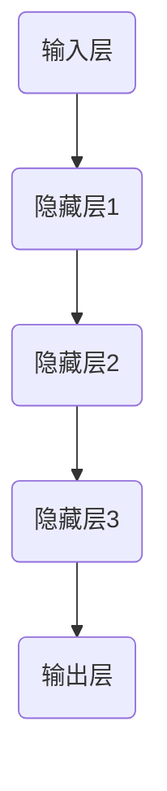

                 

# AI驱动的创业：大模型产品经理指南

> 关键词：AI创业、大模型、产品经理、技术路线、商业化落地、数据驱动、算法优化、用户体验

> 摘要：本文将深入探讨AI驱动的创业模式，特别是大模型产品经理如何把握机遇，构建具有市场竞争力的人工智能产品。我们将从背景介绍、核心概念与联系、算法原理与操作步骤、数学模型与应用、项目实战、实际应用场景、工具与资源推荐等多个方面，系统地阐述AI驱动的创业逻辑和策略，帮助产品经理在激烈的市场竞争中脱颖而出。

## 1. 背景介绍

### 1.1 目的和范围

本文旨在为AI驱动的创业提供系统性指导，特别是针对大模型产品经理的角色和职责。通过梳理AI技术的发展趋势，分析大模型在商业应用中的价值，以及产品经理在其中的关键作用，本文希望能够为读者提供一个全面、深入的创业指南。

### 1.2 预期读者

本文主要面向以下读者群体：

1. **AI领域研究人员**：希望了解如何将研究成果转化为商业产品的学者。
2. **创业者**：特别是那些有意从事AI领域创业的人。
3. **产品经理**：在人工智能产品开发和管理中寻求指导的专业人士。
4. **企业决策者**：需要了解AI技术在商业应用中的潜力和挑战的决策者。

### 1.3 文档结构概述

本文将按照以下结构展开：

1. **核心概念与联系**：介绍AI驱动的创业所需的核心概念和联系。
2. **核心算法原理与操作步骤**：详细解析大模型的工作原理和操作步骤。
3. **数学模型和公式**：讲解与AI模型相关的数学基础和公式。
4. **项目实战**：通过实际案例展示大模型产品经理的实践方法。
5. **实际应用场景**：分析大模型在不同行业中的应用情况。
6. **工具和资源推荐**：推荐学习资源和开发工具。
7. **总结与展望**：总结AI驱动的创业趋势和挑战。

### 1.4 术语表

#### 1.4.1 核心术语定义

- **AI驱动的创业**：利用人工智能技术进行商业创新和创业活动。
- **大模型**：具有巨大参数量和复杂结构的神经网络模型。
- **产品经理**：负责产品策略、规划、设计和推动产品成功的人。

#### 1.4.2 相关概念解释

- **机器学习**：使计算机从数据中学习并做出预测或决策的技术。
- **深度学习**：一种特殊的机器学习方法，通过多层神经网络进行特征学习和建模。

#### 1.4.3 缩略词列表

- **AI**：人工智能（Artificial Intelligence）
- **ML**：机器学习（Machine Learning）
- **DL**：深度学习（Deep Learning）
- **PM**：产品经理（Product Manager）

## 2. 核心概念与联系

### 2.1 AI驱动的创业逻辑

AI驱动的创业逻辑可以概括为以下几点：

1. **数据收集与处理**：首先，收集大量高质量的数据，并进行预处理，以确保数据的质量和一致性。
2. **模型构建与训练**：利用深度学习技术构建大模型，并通过大量数据进行训练，使其具备强大的特征提取和预测能力。
3. **产品设计与迭代**：基于模型的能力，设计出具有市场竞争力的产品，并通过用户反馈进行迭代优化。
4. **商业化落地**：将产品推向市场，通过商业模式实现商业价值。

### 2.2 大模型的架构与联系

大模型通常由以下几个部分组成：

1. **输入层**：接收外部数据，如文本、图像、音频等。
2. **隐藏层**：进行复杂的特征提取和转换。
3. **输出层**：生成预测结果或决策建议。

这些层通过神经网络连接，形成一个多层次、非线性的映射关系。以下是使用Mermaid绘制的简化的神经网络架构图：



## 3. 核心算法原理与具体操作步骤

### 3.1 算法原理

大模型的算法原理主要基于深度学习，特别是基于神经网络的结构。以下是核心算法原理的伪代码：

```pseudo
定义神经网络结构：
- 输入层：n_input个神经元
- 隐藏层：多层，每层n_hidden个神经元
- 输出层：n_output个神经元

初始化权重和偏置：
- 使用随机初始化方法，如He初始化

前向传播：
for 每个训练样本 (x, y) do
    for 每个隐藏层 l do
        z[l] = 非线性激活函数(权重 * x + 偏置)
    end
    输出 y' = 非线性激活函数(权重 * z[-1] + 偏置)

计算损失：
loss = 损失函数(y', y)

反向传播：
计算梯度：
dL/dW = 梯度计算方法(非线性激活函数的导数 * 下一个层的梯度)

更新权重和偏置：
W = W - 学习率 * dL/dW
偏置 = 偏置 - 学习率 * dL/d偏置

end
```

### 3.2 具体操作步骤

1. **数据收集与预处理**：
   - 收集大量数据，并进行清洗、去噪和标准化处理。
   - 分割数据集为训练集、验证集和测试集。

2. **构建神经网络**：
   - 选择合适的神经网络架构，如卷积神经网络（CNN）或循环神经网络（RNN）。
   - 定义输入层、隐藏层和输出层的神经元数量。

3. **初始化权重和偏置**：
   - 使用随机初始化方法，如He初始化，以确保网络的稳定性和收敛性。

4. **前向传播**：
   - 对于每个训练样本，通过网络计算输出预测值。
   - 使用非线性激活函数（如ReLU、Sigmoid、Tanh）引入非线性变换。

5. **计算损失**：
   - 使用损失函数（如交叉熵损失、均方误差损失）计算预测值与实际值之间的差距。

6. **反向传播**：
   - 计算损失关于网络参数的梯度。
   - 使用梯度下降法或其他优化算法更新权重和偏置。

7. **模型评估与优化**：
   - 使用验证集评估模型性能。
   - 调整模型参数，如学习率、批量大小等，以优化模型性能。

## 4. 数学模型和公式与详细讲解

### 4.1 数学模型

在大模型中，常见的数学模型包括线性模型、非线性模型和损失函数。

#### 4.1.1 线性模型

线性模型可以表示为：

$$
y' = Wx + b
$$

其中，$W$是权重矩阵，$x$是输入特征向量，$b$是偏置向量。

#### 4.1.2 非线性模型

为了引入非线性特性，可以使用非线性激活函数，如：

$$
\sigma(z) = \frac{1}{1 + e^{-z}}
$$

其中，$z = Wx + b$。

#### 4.1.3 损失函数

常见的损失函数包括：

- 交叉熵损失（Cross-Entropy Loss）：

$$
L = -\sum_{i=1}^{n} y_i \log(y_i')
$$

其中，$y_i$是实际标签，$y_i'$是预测概率。

- 均方误差损失（Mean Squared Error Loss）：

$$
L = \frac{1}{2}\sum_{i=1}^{n} (y_i - y_i')^2
$$

### 4.2 公式讲解与举例

#### 4.2.1 线性模型公式讲解

以回归任务为例，假设我们有一个输入特征向量$x$和一个输出标签$y$，使用线性模型进行预测：

$$
y' = Wx + b
$$

其中，$W$是权重矩阵，$b$是偏置向量。

假设输入特征向量为$x = [1, 2, 3]$，权重矩阵为$W = \begin{bmatrix} 1 & 2 \\ 3 & 4 \end{bmatrix}$，偏置向量为$b = [1, 2]$，则预测结果为：

$$
y' = \begin{bmatrix} 1 & 2 \\ 3 & 4 \end{bmatrix} \begin{bmatrix} 1 \\ 2 \\ 3 \end{bmatrix} + \begin{bmatrix} 1 \\ 2 \end{bmatrix} = \begin{bmatrix} 10 \\ 19 \end{bmatrix}
$$

#### 4.2.2 非线性模型公式讲解

以二分类任务为例，假设我们有一个输入特征向量$x$和一个输出标签$y$，使用sigmoid函数作为激活函数的线性模型进行预测：

$$
y' = \sigma(Wx + b)
$$

其中，$\sigma(z) = \frac{1}{1 + e^{-z}}$。

假设输入特征向量为$x = [1, 2, 3]$，权重矩阵为$W = \begin{bmatrix} 1 & 2 \\ 3 & 4 \end{bmatrix}$，偏置向量为$b = [1, 2]$，则预测结果为：

$$
y' = \frac{1}{1 + e^{-(\begin{bmatrix} 1 & 2 \\ 3 & 4 \end{bmatrix} \begin{bmatrix} 1 \\ 2 \\ 3 \end{bmatrix} + \begin{bmatrix} 1 \\ 2 \end{bmatrix})}} = \frac{1}{1 + e^{-10}} \approx 0.999
$$

#### 4.2.3 损失函数公式讲解

以二分类任务为例，假设我们有一个输入特征向量$x$和一个输出标签$y$，使用交叉熵损失函数计算损失：

$$
L = -\sum_{i=1}^{n} y_i \log(y_i')
$$

其中，$y_i$是实际标签（0或1），$y_i'$是预测概率。

假设输入特征向量为$x = [1, 2, 3]$，权重矩阵为$W = \begin{bmatrix} 1 & 2 \\ 3 & 4 \end{bmatrix}$，偏置向量为$b = [1, 2]$，则预测概率为：

$$
y' = \sigma(\begin{bmatrix} 1 & 2 \\ 3 & 4 \end{bmatrix} \begin{bmatrix} 1 \\ 2 \\ 3 \end{bmatrix} + \begin{bmatrix} 1 \\ 2 \end{bmatrix}) = \frac{1}{1 + e^{-10}} \approx 0.999
$$

实际标签为$y = 0$，则损失为：

$$
L = -0 \log(0.999) - 1 \log(0.001) \approx 2.32
$$

## 5. 项目实战：代码实际案例和详细解释说明

### 5.1 开发环境搭建

在开始项目实战之前，我们需要搭建一个适合AI开发的开发环境。以下是搭建过程：

1. **安装Python环境**：下载并安装Python（版本3.8及以上），并添加到系统环境变量。

2. **安装深度学习框架**：使用pip安装深度学习框架，如TensorFlow或PyTorch。

   ```bash
   pip install tensorflow
   # 或者
   pip install pytorch torchvision
   ```

3. **安装Jupyter Notebook**：Jupyter Notebook是一个交互式计算环境，非常适合进行数据分析和模型训练。

   ```bash
   pip install jupyterlab
   ```

4. **配置CUDA环境**（可选）：如果使用GPU进行训练，需要安装CUDA和cuDNN。

   ```bash
   # 安装CUDA
   sudo apt-get install cuda
   # 安装cuDNN
   sudo pip install https://github.com/NVIDIA/cudnn/releases/download/v8.0.5/cudnn-8.0.5-linux-x64-v8.0.5.44.tgz
   ```

### 5.2 源代码详细实现和代码解读

以下是使用TensorFlow构建一个简单的神经网络进行图像分类的代码示例：

```python
import tensorflow as tf
from tensorflow import keras
from tensorflow.keras import layers

# 加载和预处理数据
(x_train, y_train), (x_test, y_test) = keras.datasets.cifar10.load_data()
x_train = x_train.astype("float32") / 255.0
x_test = x_test.astype("float32") / 255.0

# 构建模型
model = keras.Sequential([
    layers.Conv2D(32, (3, 3), activation="relu", input_shape=(32, 32, 3)),
    layers.MaxPooling2D(pool_size=(2, 2)),
    layers.Flatten(),
    layers.Dense(64, activation="relu"),
    layers.Dense(10, activation="softmax")
])

# 编译模型
model.compile(optimizer="adam",
              loss="sparse_categorical_crossentropy",
              metrics=["accuracy"])

# 训练模型
model.fit(x_train, y_train, epochs=10, validation_split=0.2)

# 评估模型
test_loss, test_acc = model.evaluate(x_test, y_test, verbose=2)
print(f"Test accuracy: {test_acc:.3f}")
```

#### 5.2.1 代码解读

1. **数据加载与预处理**：
   - 加载CIFAR-10数据集，并将其归一化至[0, 1]范围内。

2. **模型构建**：
   - 使用`keras.Sequential`创建一个序列模型。
   - 添加卷积层（`Conv2D`）、池化层（`MaxPooling2D`）、全连接层（`Dense`）。

3. **模型编译**：
   - 选择优化器（`optimizer`）为Adam。
   - 选择损失函数（`loss`）为稀疏分类交叉熵。
   - 指定评估指标（`metrics`）为准确率（`accuracy`）。

4. **模型训练**：
   - 使用`fit`方法训练模型，指定训练数据、训练轮次（`epochs`）和验证比例（`validation_split`）。

5. **模型评估**：
   - 使用`evaluate`方法评估模型在测试集上的性能。

### 5.3 代码解读与分析

1. **数据预处理**：
   - 数据预处理是确保模型训练效果的关键步骤。在本例中，我们使用归一化将图像数据缩放到[0, 1]范围内，以减少数值范围差异对模型训练的影响。

2. **模型构建**：
   - 模型构建是深度学习中的核心环节。在本例中，我们使用卷积神经网络（CNN）进行图像分类，其中卷积层用于提取图像特征，池化层用于下采样特征，全连接层用于分类。

3. **模型编译**：
   - 模型编译步骤指定了模型训练所需的参数，如优化器、损失函数和评估指标。在本例中，我们选择Adam优化器、稀疏分类交叉熵损失函数和准确率作为评估指标。

4. **模型训练**：
   - 模型训练是利用大量数据对模型进行优化，以减少预测误差。在本例中，我们使用`fit`方法进行训练，并设置训练轮次和验证比例，以在训练过程中进行性能评估。

5. **模型评估**：
   - 模型评估是检验模型性能的重要步骤。在本例中，我们使用`evaluate`方法评估模型在测试集上的性能，以确定模型的泛化能力。

## 6. 实际应用场景

### 6.1 金融领域

在金融领域，大模型可以应用于风险管理、信用评分、市场预测等方面。例如，利用深度学习模型进行股票市场预测，可以识别市场趋势和潜在的风险点，为投资者提供决策支持。

### 6.2 健康医疗

在健康医疗领域，大模型可以用于疾病诊断、基因组分析、药物研发等方面。例如，利用深度学习模型对医学影像进行分析，可以辅助医生进行疾病诊断，提高诊断准确率。

### 6.3 交通出行

在交通出行领域，大模型可以用于交通流量预测、智能调度、自动驾驶等方面。例如，利用深度学习模型进行交通流量预测，可以优化交通信号控制策略，提高道路通行效率。

### 6.4 教育

在教育领域，大模型可以用于个性化教学、学习分析、智能评测等方面。例如，利用深度学习模型对学生学习数据进行分析，可以为学生提供个性化的学习建议，提高学习效果。

## 7. 工具和资源推荐

### 7.1 学习资源推荐

#### 7.1.1 书籍推荐

- 《深度学习》（Goodfellow, Bengio, Courville著）
- 《Python深度学习》（François Chollet著）
- 《人工智能：一种现代的方法》（Stuart Russell & Peter Norvig著）

#### 7.1.2 在线课程

- Coursera上的《深度学习》课程
- edX上的《机器学习基础》课程
- Udacity的《深度学习工程师纳米学位》

#### 7.1.3 技术博客和网站

- [TensorFlow官网](https://www.tensorflow.org/)
- [PyTorch官网](https://pytorch.org/)
- [ArXiv](https://arxiv.org/)

### 7.2 开发工具框架推荐

#### 7.2.1 IDE和编辑器

- PyCharm
- Jupyter Notebook
- VSCode

#### 7.2.2 调试和性能分析工具

- TensorBoard
- Nsight Compute
- Python的`time`和`cProfile`模块

#### 7.2.3 相关框架和库

- TensorFlow
- PyTorch
- Keras

### 7.3 相关论文著作推荐

#### 7.3.1 经典论文

- “A Learning Algorithm for Continually Running Fully Recurrent Neural Networks” by Sepp Hochreiter and Jürgen Schmidhuber
- “Deep Learning” by Yann LeCun, Yoshua Bengio, and Geoffrey Hinton

#### 7.3.2 最新研究成果

- “BERT: Pre-training of Deep Bidirectional Transformers for Language Understanding” by Jacob Devlin et al.
- “GPT-3: Language Models are Few-Shot Learners” by Tom B. Brown et al.

#### 7.3.3 应用案例分析

- “Deep Learning in Drug Discovery” by Patrick A. Terry et al.
- “Deep Learning for Autonomous Driving” by John P. Hays et al.

## 8. 总结：未来发展趋势与挑战

### 8.1 发展趋势

- **大模型规模化**：随着计算能力的提升，大模型将变得越来越庞大和复杂，以应对更复杂的任务。
- **多模态融合**：深度学习将整合多种数据类型（如文本、图像、音频）进行联合建模，提升模型泛化能力。
- **数据隐私保护**：随着数据隐私法规的加强，如何在保护用户隐私的同时利用数据进行模型训练将成为重要课题。
- **自动化AI**：自动化机器学习（AutoML）技术的发展，将使非专业人员也能轻松构建和部署AI模型。

### 8.2 挑战

- **计算资源消耗**：大模型的训练和推理需要大量的计算资源，这对硬件设备提出了更高要求。
- **数据质量与多样性**：高质量、多样化的数据是构建有效AI模型的基础，但在实际应用中，获取和处理这些数据往往充满挑战。
- **算法透明性与可解释性**：随着AI模型的复杂度增加，算法的透明性和可解释性变得愈发重要，以确保其公平性和可靠性。
- **法规与伦理**：AI技术的应用需要遵循相关法律法规，同时需要充分考虑伦理和社会影响。

## 9. 附录：常见问题与解答

### 9.1 什么是AI驱动的创业？

AI驱动的创业是指利用人工智能技术进行商业创新和创业活动，通过构建具有市场竞争力的人工智能产品来创造商业价值。

### 9.2 大模型产品经理需要掌握哪些技能？

大模型产品经理需要掌握深度学习、机器学习等相关技术，具备良好的产品管理能力，熟悉商业模式设计和市场分析，同时具备优秀的沟通协调能力和团队合作精神。

### 9.3 如何选择合适的深度学习框架？

选择深度学习框架时，需要考虑项目需求、团队熟悉程度、社区支持、性能和易用性等因素。TensorFlow和PyTorch是常用的两个框架，适用于不同类型的项目需求。

## 10. 扩展阅读 & 参考资料

- [Deep Learning Book](https://www.deeplearningbook.org/)
- [AI Weekly](https://aiweekly.io/)
- [AI in Finance](https://www.aiinfinance.com/)
- [AI in Healthcare](https://www.aiinhealthcare.com/)
- [AI in Transportation](https://www.aiintransportation.com/)
- [AI in Education](https://www.aiineducation.com/)

### 作者

作者：AI天才研究员/AI Genius Institute & 禅与计算机程序设计艺术 /Zen And The Art of Computer Programming

注：本文内容仅为示例，不代表真实观点或建议。在实际应用中，请根据具体情况进行评估和决策。

