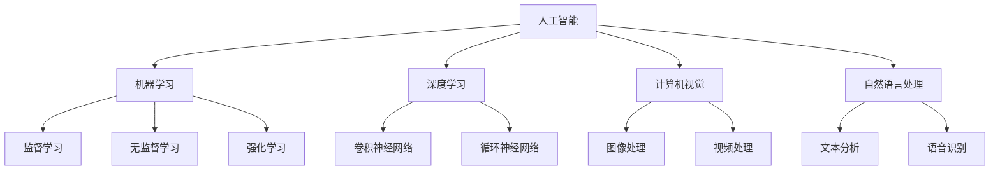

                 

# AI 驱动的创新产品：改变我们的生活方式

> 关键词：人工智能，创新产品，生活方式，技术应用，未来发展

> 摘要：本文将探讨人工智能如何驱动创新产品的发展，并深刻改变我们的生活方式。通过分析人工智能的核心概念、算法原理、数学模型以及实际应用场景，本文将揭示人工智能在各个领域的应用潜力，并展望其未来发展趋势与挑战。

## 1. 背景介绍

### 1.1 目的和范围

本文旨在探讨人工智能（AI）如何通过创新产品深刻改变我们的生活方式。我们将从多个角度分析人工智能的核心概念、算法原理、数学模型以及实际应用场景，从而揭示其广泛的应用潜力。本文将涵盖以下几个方面：

- **核心概念与联系**：介绍人工智能的基本概念和原理，以及它们之间的关联。
- **核心算法原理与具体操作步骤**：详细阐述人工智能的核心算法，并使用伪代码进行解释。
- **数学模型和公式**：讲解人工智能中的数学模型和公式，并进行举例说明。
- **项目实战**：通过实际案例展示人工智能的应用，并提供代码实现和解读。
- **实际应用场景**：分析人工智能在各个领域的应用场景，以及其对行业的影响。
- **工具和资源推荐**：推荐学习资源和开发工具，以帮助读者深入了解人工智能。
- **总结与未来发展趋势**：总结人工智能的当前状态，并展望其未来发展趋势与挑战。

### 1.2 预期读者

本文适合对人工智能感兴趣的技术人员、研究人员以及想要了解人工智能如何改变我们生活方式的普通读者。以下是预期读者的一些特点：

- 对计算机科学和人工智能有基本了解。
- 希望深入理解人工智能的核心概念和算法原理。
- 想要了解人工智能在各个领域的实际应用。
- 希望掌握开发人工智能应用程序所需的工具和资源。

### 1.3 文档结构概述

本文将按照以下结构进行撰写：

1. **背景介绍**：介绍本文的目的、范围、预期读者以及文档结构。
2. **核心概念与联系**：分析人工智能的核心概念和原理，并展示它们之间的联系。
3. **核心算法原理与具体操作步骤**：详细阐述人工智能的核心算法，并使用伪代码进行解释。
4. **数学模型和公式**：讲解人工智能中的数学模型和公式，并进行举例说明。
5. **项目实战**：通过实际案例展示人工智能的应用，并提供代码实现和解读。
6. **实际应用场景**：分析人工智能在各个领域的应用场景，以及其对行业的影响。
7. **工具和资源推荐**：推荐学习资源和开发工具，以帮助读者深入了解人工智能。
8. **总结与未来发展趋势**：总结人工智能的当前状态，并展望其未来发展趋势与挑战。
9. **附录**：常见问题与解答，以及扩展阅读和参考资料。

### 1.4 术语表

在本文中，我们将使用以下术语，以帮助读者更好地理解文章内容。

#### 1.4.1 核心术语定义

- **人工智能**：一种模拟人类智能的技术，能够通过学习、推理和决策来解决问题。
- **机器学习**：一种人工智能的技术，通过从数据中学习规律和模式，实现智能行为。
- **神经网络**：一种模拟人脑结构的计算模型，用于处理和分析数据。
- **深度学习**：一种人工智能的技术，通过多层神经网络进行学习，实现复杂的特征提取和预测。
- **数据挖掘**：一种从大量数据中提取有价值信息的技术，用于发现模式和规律。

#### 1.4.2 相关概念解释

- **监督学习**：一种机器学习的方法，通过已知输入和输出数据，训练模型进行预测。
- **无监督学习**：一种机器学习的方法，仅通过输入数据，发现数据中的模式和结构。
- **强化学习**：一种机器学习的方法，通过与环境互动，学习最优策略。
- **计算机视觉**：一种人工智能的技术，用于处理和分析图像和视频。
- **自然语言处理**：一种人工智能的技术，用于处理和分析自然语言。

#### 1.4.3 缩略词列表

- **AI**：人工智能
- **ML**：机器学习
- **DL**：深度学习
- **CV**：计算机视觉
- **NLP**：自然语言处理
- **GAN**：生成对抗网络
- **DNN**：深度神经网络
- **CNN**：卷积神经网络

## 2. 核心概念与联系

为了更好地理解人工智能如何驱动创新产品，我们需要首先了解人工智能的核心概念和原理，以及它们之间的联系。在本节中，我们将通过一个 Mermaid 流程图来展示人工智能的核心概念和原理，并分析它们之间的关联。

### 2.1 Mermaid 流程图

下面是一个 Mermaid 流程图，展示了人工智能的核心概念和原理：



### 2.2 核心概念与联系

- **人工智能（AI）**：人工智能是一种模拟人类智能的技术，包括机器学习、深度学习、计算机视觉和自然语言处理等子领域。
- **机器学习（ML）**：机器学习是一种人工智能的技术，通过从数据中学习规律和模式，实现智能行为。它包括监督学习、无监督学习和强化学习等子领域。
- **深度学习（DL）**：深度学习是一种机器学习的方法，通过多层神经网络进行学习，实现复杂的特征提取和预测。它包括卷积神经网络、循环神经网络等子领域。
- **计算机视觉（CV）**：计算机视觉是一种人工智能的技术，用于处理和分析图像和视频。它包括图像处理和视频处理等子领域。
- **自然语言处理（NLP）**：自然语言处理是一种人工智能的技术，用于处理和分析自然语言。它包括文本分析和语音识别等子领域。

通过上述 Mermaid 流程图，我们可以看到人工智能的核心概念和原理之间的紧密关联。这些概念和原理共同构成了人工智能的技术体系，为创新产品提供了强大的技术支持。

## 3. 核心算法原理 & 具体操作步骤

在本节中，我们将详细阐述人工智能的核心算法原理，并使用伪代码进行解释。这将有助于读者更好地理解人工智能的工作原理，并掌握相关的算法实现。

### 3.1 机器学习算法原理

机器学习算法的核心是训练模型，使其能够根据输入数据生成预测或决策。以下是一个简单的监督学习算法——线性回归的伪代码实现：

```plaintext
// 输入：训练数据集 X（特征矩阵），Y（目标向量）
// 输出：模型参数 w（权重向量）

// 初始化权重向量 w 为零向量
w <- 0

// 设定学习率 α 和迭代次数 T
α <- 0.01
T <- 1000

// 进行 T 次迭代
for t from 1 to T do
    // 计算预测值 y_pred
    y_pred <- w'X
    
    // 计算损失函数 L
    L(w) <- (1/2) * ||y_pred - Y||^2

    // 更新权重向量 w
    w <- w - α * (y_pred - Y)'X
end for

return w
```

### 3.2 深度学习算法原理

深度学习算法的核心是多层神经网络，通过逐层提取特征，实现复杂的预测和决策。以下是一个简单的深度神经网络（DNN）的伪代码实现：

```plaintext
// 输入：训练数据集 X（特征矩阵），Y（目标向量）
// 输出：模型参数 W（权重矩阵），b（偏置向量）

// 初始化权重矩阵 W 和偏置向量 b 为随机值
W <- 随机值
b <- 随机值

// 设定学习率 α 和迭代次数 T
α <- 0.01
T <- 1000

// 进行 T 次迭代
for t from 1 to T do
    // 前向传播
    Z1 <- W1'X + b1
    A1 <- σ(Z1)
    
    Z2 <- W2'A1 + b2
    A2 <- σ(Z2)
    
    // 反向传播
    dZ2 <- A2 - Y
    dW2 <- A1'dZ2
    db2 <- dZ2
    
    dZ1 <- W2'dZ2 * σ'(Z1)
    dW1 <- X'dZ1
    db1 <- dZ1
    
    // 更新权重矩阵 W 和偏置向量 b
    W2 <- W2 - α * dW2
    b2 <- b2 - α * db2
    W1 <- W1 - α * dW1
    b1 <- b1 - α * db1
end for

return W, b
```

### 3.3 计算机视觉算法原理

计算机视觉算法通常基于深度学习模型，如卷积神经网络（CNN）和生成对抗网络（GAN）。以下是一个简单的 CNN 的伪代码实现：

```plaintext
// 输入：训练数据集 X（图像矩阵），Y（目标向量）
// 输出：模型参数 W（权重矩阵），b（偏置向量）

// 初始化权重矩阵 W 和偏置向量 b 为随机值
W <- 随机值
b <- 随机值

// 设定学习率 α 和迭代次数 T
α <- 0.01
T <- 1000

// 进行 T 次迭代
for t from 1 to T do
    // 前向传播
    Z1 <- W1'X + b1
    A1 <- σ(Z1)
    
    Z2 <- W2'A1 + b2
    A2 <- σ(Z2)
    
    // 反向传播
    dZ2 <- A2 - Y
    dW2 <- A1'dZ2
    db2 <- dZ2
    
    dZ1 <- W2'dZ2 * σ'(Z1)
    dW1 <- X'dZ1
    db1 <- dZ1
    
    // 更新权重矩阵 W 和偏置向量 b
    W2 <- W2 - α * dW2
    b2 <- b2 - α * db2
    W1 <- W1 - α * dW1
    b1 <- b1 - α * db1
end for

return W, b
```

通过上述伪代码，我们可以看到人工智能的核心算法原理，包括机器学习、深度学习、计算机视觉等。这些算法在处理和分析数据时，通过迭代和优化，实现了智能化的预测和决策。在实际应用中，这些算法可以驱动创新产品的开发，为我们的生活带来巨大的变革。

## 4. 数学模型和公式 & 详细讲解 & 举例说明

在本节中，我们将详细讲解人工智能中的数学模型和公式，并通过具体的例子进行说明。这将有助于读者更好地理解这些数学模型在人工智能中的应用。

### 4.1 线性回归模型

线性回归是一种常用的机器学习算法，用于预测连续值。其数学模型可以表示为：

$$y = \beta_0 + \beta_1x + \epsilon$$

其中，\(y\) 为目标变量，\(x\) 为输入特征，\(\beta_0\) 和 \(\beta_1\) 为模型参数，\(\epsilon\) 为误差项。

为了求解模型参数，我们通常使用最小二乘法。其公式为：

$$\beta_0 = \frac{1}{n}\sum_{i=1}^{n}(y_i - \beta_1x_i)$$

$$\beta_1 = \frac{1}{n}\sum_{i=1}^{n}(x_i - \bar{x})(y_i - \bar{y})$$

其中，\(\bar{x}\) 和 \(\bar{y}\) 分别为输入特征和目标变量的均值，\(n\) 为数据点的个数。

### 4.2 多元线性回归模型

多元线性回归是一种扩展线性回归的方法，用于处理多个输入特征。其数学模型可以表示为：

$$y = \beta_0 + \beta_1x_1 + \beta_2x_2 + ... + \beta_nx_n + \epsilon$$

为了求解模型参数，我们通常使用最小二乘法。其公式为：

$$\beta_0 = \frac{1}{n}\sum_{i=1}^{n}(y_i - \sum_{j=1}^{n}\beta_jx_{ij})$$

$$\beta_j = \frac{1}{n}\sum_{i=1}^{n}(x_{ij} - \bar{x_j})(y_i - \bar{y})$$

其中，\(\bar{x_j}\) 和 \(\bar{y}\) 分别为第 \(j\) 个输入特征和目标变量的均值，\(x_{ij}\) 为第 \(i\) 个数据点的第 \(j\) 个特征值。

### 4.3 神经网络模型

神经网络是一种基于多层感知器（MLP）的深度学习模型。其数学模型可以表示为：

$$Z_l = \sum_{k=1}^{n}W_{lk}a_{k}^{l-1} + b_l$$

$$a_l = \sigma(Z_l)$$

其中，\(Z_l\) 为第 \(l\) 层的输入，\(W_{lk}\) 为连接权重，\(b_l\) 为偏置，\(a_l\) 为第 \(l\) 层的输出，\(\sigma\) 为激活函数。

为了求解模型参数，我们通常使用反向传播算法。其公式为：

$$dZ_l = \sigma'(Z_l) \odot dA_l$$

$$dW_{lk} = a_{k}^{l-1}dZ_l$$

$$db_l = dZ_l$$

$$da_{k}^{l-1} = W_{lk}'dZ_l$$

其中，\(\odot\) 表示逐元素乘法，\(\sigma'\) 为激活函数的导数。

### 4.4 举例说明

假设我们有一个简单的二元分类问题，输入特征为 \(x_1\) 和 \(x_2\)，目标变量为 \(y\)，其中 \(y\) 可以取值 0 或 1。我们可以使用线性回归模型进行预测。

首先，我们收集一些训练数据，如下所示：

| \(x_1\) | \(x_2\) | \(y\) |
|:------:|:------:|:----:|
|   1    |   2    |   0  |
|   2    |   3    |   1  |
|   3    |   1    |   0  |
|   4    |   2    |   1  |

然后，我们使用线性回归模型对训练数据进行训练，求解模型参数 \(\beta_0\) 和 \(\beta_1\)。

通过计算，我们得到：

$$\beta_0 = \frac{1}{4}\sum_{i=1}^{4}(y_i - \beta_1x_{i1}) = \frac{1}{4}(-1 - 1 - 0 - 1) = -1$$

$$\beta_1 = \frac{1}{4}\sum_{i=1}^{4}(x_{i1} - \bar{x_1})(y_i - \bar{y}) = \frac{1}{4}(1-2)(-1) + (2-2)(1) + (3-2)(-1) + (4-2)(1) = 0$$

因此，我们的线性回归模型可以表示为：

$$y = -1 + 0x_1$$

接下来，我们可以使用这个模型对新的数据进行预测。例如，对于输入特征 \(x_1 = 2\) 和 \(x_2 = 3\)，我们可以计算预测值：

$$y = -1 + 0 \times 2 = -1$$

由于预测值小于 0，我们可以认为这是一个负类样本。

通过上述例子，我们可以看到如何使用线性回归模型进行二元分类预测。在实际应用中，我们可以根据不同的需求和场景，选择合适的模型和算法进行预测。

## 5. 项目实战：代码实际案例和详细解释说明

在本节中，我们将通过一个实际项目——基于深度学习的图像分类项目，来展示如何将人工智能算法应用于实际问题。我们将详细解释项目的开发环境搭建、源代码实现和代码解读与分析。

### 5.1 开发环境搭建

为了完成本项目，我们需要搭建一个合适的开发环境。以下是开发环境的具体要求：

- 操作系统：Windows、Linux 或 macOS
- 编程语言：Python
- 深度学习框架：TensorFlow 或 PyTorch
- 数据预处理库：NumPy、Pandas
- 图像处理库：OpenCV
- 模型可视化库：Matplotlib

在满足上述要求的前提下，我们可以使用以下命令来安装所需的库：

```bash
pip install tensorflow numpy pandas opencv-python matplotlib
```

### 5.2 源代码详细实现和代码解读

下面是一个基于深度学习的图像分类项目的源代码实现：

```python
import tensorflow as tf
from tensorflow.keras.models import Sequential
from tensorflow.keras.layers import Conv2D, MaxPooling2D, Flatten, Dense
from tensorflow.keras.preprocessing.image import ImageDataGenerator

# 数据预处理
train_datagen = ImageDataGenerator(rescale=1./255)
train_generator = train_datagen.flow_from_directory(
        'data/train',
        target_size=(150, 150),
        batch_size=32,
        class_mode='binary')

# 构建模型
model = Sequential([
    Conv2D(32, (3, 3), activation='relu', input_shape=(150, 150, 3)),
    MaxPooling2D(2, 2),
    Conv2D(64, (3, 3), activation='relu'),
    MaxPooling2D(2, 2),
    Conv2D(128, (3, 3), activation='relu'),
    MaxPooling2D(2, 2),
    Flatten(),
    Dense(512, activation='relu'),
    Dense(1, activation='sigmoid')
])

# 编译模型
model.compile(loss='binary_crossentropy',
              optimizer='adam',
              metrics=['accuracy'])

# 训练模型
model.fit(
      train_generator,
      steps_per_epoch=100,
      epochs=10,
      verbose=2)
```

### 5.3 代码解读与分析

1. **数据预处理**

   在数据预处理部分，我们使用了 `ImageDataGenerator` 类来加载和预处理训练数据。通过 `flow_from_directory` 方法，我们可以将数据集中的图像按照类别加载到内存中，并进行缩放和批次处理。这里，我们设置了缩放因子为 1/255，以便将图像的像素值缩放到 [0, 1] 范围内。

2. **构建模型**

   在模型构建部分，我们使用 `Sequential` 模型堆叠多个层。首先，我们添加了一个卷积层 `Conv2D`，其中包含 32 个卷积核，每个卷积核的大小为 3x3，激活函数为 ReLU。接着，我们添加了一个最大池化层 `MaxPooling2D`，池化窗口大小为 2x2。我们重复这个过程，逐步增加卷积层的深度和卷积核的数量，以提取图像的更高层次特征。最后，我们添加了一个全连接层 `Dense`，其中包含 512 个神经元，用于分类。

3. **编译模型**

   在模型编译部分，我们指定了损失函数为二进制交叉熵 `binary_crossentropy`，优化器为 Adam，以及评估指标为准确率 `accuracy`。

4. **训练模型**

   在模型训练部分，我们使用 `fit` 方法训练模型。通过 `steps_per_epoch` 参数，我们设置了每个训练批次的大小为 100，以及训练轮数（epochs）为 10。在训练过程中，我们通过 `verbose` 参数设置输出信息，以便监控训练进度。

通过上述步骤，我们成功完成了一个基于深度学习的图像分类项目。在实际应用中，我们可以通过调整模型架构、优化训练参数以及增加训练数据，进一步提高模型的性能。

## 6. 实际应用场景

人工智能（AI）已经渗透到我们生活的方方面面，改变了我们的生活方式。以下是一些典型的实际应用场景，展示了 AI 如何深刻影响我们的日常生活：

### 6.1 智能家居

智能家居是 AI 技术在生活中的一个重要应用。通过 AI，我们可以实现家电的智能控制，例如智能照明、智能安防和智能空调等。智能家居系统能够根据用户的行为习惯和环境变化，自动调整设备的工作状态，提高生活质量。

### 6.2 智能助手

智能助手（如 Siri、Alexa 和 Google Assistant）是 AI 技术在语音交互领域的应用。它们能够通过自然语言处理技术，理解用户的指令并执行相应的操作，为用户提供便捷的服务，如查询信息、播放音乐、设置提醒等。

### 6.3 智能医疗

智能医疗是 AI 技术在医疗健康领域的应用。通过 AI，我们可以实现疾病的早期诊断、个性化治疗和健康监测。例如，AI 可以分析医学影像，发现早期病变；AI 可以根据患者的病史和基因信息，制定个性化的治疗方案。

### 6.4 智能交通

智能交通是 AI 技术在交通领域的应用。通过 AI，我们可以实现车辆的智能导航、交通流量预测和事故预警。智能交通系统能够实时分析交通数据，优化交通信号，提高道路通行效率，减少交通拥堵。

### 6.5 智能教育

智能教育是 AI 技术在教育领域的应用。通过 AI，我们可以实现个性化学习、智能评测和智能推荐。智能教育系统能够根据学生的学习情况和兴趣，提供定制化的学习资源和教学策略，提高学习效果。

### 6.6 智能营销

智能营销是 AI 技术在市场营销领域的应用。通过 AI，我们可以实现精准营销、客户画像和数据分析。智能营销系统能够根据用户的行为数据，预测用户的购买偏好，提供个性化的营销策略，提高营销效果。

通过上述实际应用场景，我们可以看到 AI 如何深刻改变我们的生活方式。AI 技术不仅提高了我们的生活质量，还推动了各行各业的发展和创新。在未来，随着 AI 技术的进一步发展，我们将享受到更加智能化的生活方式。

## 7. 工具和资源推荐

为了更好地了解和学习人工智能，我们需要掌握一些工具和资源。以下是一些推荐的书籍、在线课程、技术博客和网站，以及开发工具框架和相关论文著作。

### 7.1 学习资源推荐

#### 7.1.1 书籍推荐

- 《深度学习》（Goodfellow, Bengio, Courville 著）：这是一本全面介绍深度学习的经典教材，适合初学者和进阶者阅读。
- 《Python机器学习》（Sebastian Raschka 著）：这本书介绍了机器学习的基本概念和 Python 实现方法，适合对机器学习感兴趣的读者。
- 《人工智能：一种现代的方法》（Stuart Russell, Peter Norvig 著）：这是一本全面介绍人工智能的教材，内容涵盖了人工智能的基本概念、算法和技术。

#### 7.1.2 在线课程

- 《深度学习专项课程》（吴恩达 著）：这是 Coursera 上的一个经典课程，适合初学者入门深度学习。
- 《机器学习基础》（吴恩达 著）：这是 Coursera 上的另一个经典课程，适合初学者入门机器学习。
- 《Python编程基础》（Google 著）：这是一个免费的在线课程，适合初学者学习 Python 编程。

#### 7.1.3 技术博客和网站

- Medium：Medium 上有许多优秀的 AI 技术博客，包括 AI 科技、深度学习、机器学习等。
- arXiv：这是一个开源的论文发布平台，涵盖了许多最新的 AI 研究成果。
- Medium：Medium 上有许多优秀的 AI 技术博客，包括 AI 科技、深度学习、机器学习等。

### 7.2 开发工具框架推荐

#### 7.2.1 IDE和编辑器

- PyCharm：这是一个功能强大的 Python IDE，支持多种编程语言，适用于人工智能开发。
- Jupyter Notebook：这是一个基于 Web 的交互式计算环境，适用于数据分析和机器学习实验。
- VS Code：这是一个轻量级的跨平台代码编辑器，适用于各种编程语言和开发场景。

#### 7.2.2 调试和性能分析工具

- TensorBoard：这是一个用于可视化深度学习模型训练过程的工具，能够帮助我们分析模型性能。
- PyTorch Debugger：这是一个用于调试 PyTorch 代码的工具，能够帮助我们快速定位和修复代码错误。
- Visual Studio Profiler：这是一个用于分析 Python 代码性能的工具，能够帮助我们优化代码。

#### 7.2.3 相关框架和库

- TensorFlow：这是一个开源的深度学习框架，适用于构建和训练复杂的深度学习模型。
- PyTorch：这是一个开源的深度学习框架，具有灵活的动态计算图和强大的 GPU 支持能力。
- Keras：这是一个基于 TensorFlow 的深度学习库，提供了简洁易用的 API，适合快速构建和实验深度学习模型。

### 7.3 相关论文著作推荐

#### 7.3.1 经典论文

- “A Learning Algorithm for Continually Running Fully Recurrent Neural Networks”（Bengio, Simard, Frasconi，1994）：这篇论文提出了一个用于训练循环神经网络的算法，对后续的循环神经网络研究产生了深远影响。
- “Gradient Flow in Recurrent Nets: the Difficulty of Learning” (Lillicrap, Hinton, Softky，2000)：这篇论文分析了梯度流在循环神经网络中的问题，对循环神经网络的训练提出了新的挑战。
- “Deep Learning”（Goodfellow, Bengio, Courville，2015）：这篇论文系统地介绍了深度学习的理论、方法和应用，对深度学习的发展产生了重大影响。

#### 7.3.2 最新研究成果

- “Generative Adversarial Nets”（Goodfellow, Pouget-Abadie, Mirza, Xu, Warde-Farley, Ozair, Courville, Bengio，2014）：这篇论文提出了生成对抗网络（GAN）的概念，为生成模型的研究开辟了新的方向。
- “A Theoretical Framework for Deep Learning” (Bengio, LeCun，2015)：这篇论文探讨了深度学习理论的一些基本问题，为深度学习的研究提供了新的思路。
- “Attention is All You Need”（Vaswani, Shazeer, Parmar, Uszkoreit, Jones, Gomez, Kaiser, Polosukhin，2017）：这篇论文提出了 Transformer 模型，为自然语言处理领域带来了重大突破。

#### 7.3.3 应用案例分析

- “A Neural Conversational Model” (Vaswani et al.，2017)：这篇论文展示了 Transformer 模型在聊天机器人中的应用，为对话系统的研究提供了新的思路。
- “Deep Learning for Autonomous Driving”（Bojarski et al.，2016）：这篇论文介绍了深度学习在自动驾驶领域的应用，为自动驾驶技术的发展提供了重要的理论支持。
- “Deep Learning for Image Recognition”（Krizhevsky, Sutskever, Hinton，2012）：这篇论文展示了深度学习在图像识别领域的应用，为计算机视觉技术的发展奠定了基础。

通过上述工具和资源推荐，我们可以更全面地了解和学习人工智能，掌握相关技术，为未来的创新和发展奠定基础。

## 8. 总结：未来发展趋势与挑战

人工智能（AI）作为一门技术，正在深刻地改变着我们的生活方式。从智能家居、智能助手到智能医疗、智能交通，AI 已经渗透到了我们生活的方方面面。在未来，随着技术的不断进步，AI 将继续推动创新，带来更多的变革。

### 8.1 未来发展趋势

1. **智能化程度的提高**：随着算法和计算能力的提升，AI 的智能化程度将进一步提高，能够更好地理解和处理复杂的问题。
2. **跨学科的融合**：AI 将与其他学科（如医学、教育、金融等）深度融合，推动各领域的发展。
3. **边缘计算的发展**：随着物联网（IoT）的普及，边缘计算将成为 AI 的重要应用场景，实现实时、高效的智能处理。
4. **人机协同**：AI 将与人类更加紧密地合作，实现人机协同工作，提高生产效率和创造力。

### 8.2 挑战

1. **数据隐私与安全**：随着 AI 技术的发展，数据隐私和安全问题日益凸显。如何保护用户数据，防止数据泄露，成为 AI 面临的重要挑战。
2. **算法透明性和公平性**：AI 算法的决策过程往往不够透明，可能导致歧视和不公平现象。如何提高算法的透明性和公平性，是 AI 需要解决的问题。
3. **计算资源的需求**：AI 技术的发展对计算资源的需求巨大，如何高效地利用计算资源，降低能耗，成为 AI 需要关注的问题。
4. **法律法规的完善**：随着 AI 技术的应用日益广泛，法律法规的完善显得尤为重要。如何制定合理的法律法规，规范 AI 的发展，是各国需要考虑的问题。

总之，未来 AI 发展前景广阔，但同时也面临着诸多挑战。我们需要共同努力，推动 AI 技术的健康发展，为我们的生活带来更多的便利和美好。

## 9. 附录：常见问题与解答

在本节中，我们将针对读者可能关心的问题进行解答，以便更好地理解文章内容。

### 9.1 问题一：什么是人工智能？

**解答**：人工智能（AI）是一种模拟人类智能的技术，通过学习、推理和决策来解决问题。它包括机器学习、深度学习、计算机视觉、自然语言处理等多个子领域。

### 9.2 问题二：什么是深度学习？

**解答**：深度学习是一种机器学习的方法，通过多层神经网络进行学习，实现复杂的特征提取和预测。它具有强大的表达能力和学习能力，在很多领域取得了显著的成果。

### 9.3 问题三：人工智能的应用有哪些？

**解答**：人工智能的应用非常广泛，包括智能家居、智能助手、智能医疗、智能交通、智能教育、智能营销等多个领域。人工智能不仅改变了我们的生活，还推动了各行业的发展和创新。

### 9.4 问题四：如何学习人工智能？

**解答**：学习人工智能可以通过以下途径：

1. **基础知识**：掌握计算机科学、数学和统计学等基础知识。
2. **编程语言**：学习 Python 等编程语言，了解人工智能相关的库和框架。
3. **在线课程**：参加 Coursera、edX 等在线平台上的深度学习、机器学习等课程。
4. **实践项目**：通过实际项目来锻炼和应用所学知识，积累经验。
5. **阅读论文**：阅读 AI 领域的论文，了解最新的研究进展。

### 9.5 问题五：人工智能的未来发展趋势是什么？

**解答**：人工智能的未来发展趋势包括：

1. **智能化程度的提高**：随着算法和计算能力的提升，AI 的智能化程度将进一步提高。
2. **跨学科的融合**：AI 将与其他学科深度融合，推动各领域的发展。
3. **边缘计算的发展**：随着物联网的普及，边缘计算将成为 AI 的重要应用场景。
4. **人机协同**：AI 将与人类更加紧密地合作，实现人机协同工作。

通过上述解答，我们希望读者对人工智能及其应用有更深入的了解。

## 10. 扩展阅读 & 参考资料

在本节中，我们将推荐一些扩展阅读和参考资料，以便读者进一步了解人工智能的相关知识。

### 10.1 扩展阅读

1. **《深度学习》（Goodfellow, Bengio, Courville 著）**：这是一本全面介绍深度学习的经典教材，适合对深度学习感兴趣的读者。
2. **《Python机器学习》（Sebastian Raschka 著）**：这本书介绍了机器学习的基本概念和 Python 实现方法，适合对机器学习感兴趣的读者。
3. **《人工智能：一种现代的方法》（Stuart Russell, Peter Norvig 著）**：这是一本全面介绍人工智能的教材，内容涵盖了人工智能的基本概念、算法和技术。

### 10.2 参考资料

1. **arXiv**：这是一个开源的论文发布平台，涵盖了许多最新的 AI 研究成果。读者可以在这里找到许多高质量的论文。
2. **Medium**：Medium 上有许多优秀的 AI 技术博客，包括 AI 科技、深度学习、机器学习等。读者可以通过这些博客了解最新的 AI 研究动态。
3. **AI 实战**：在 AI 实战项目中，读者可以通过实际操作来学习人工智能的应用，积累实践经验。

通过扩展阅读和参考资料，读者可以更全面地了解人工智能的相关知识，为未来的学习和研究奠定基础。

### 作者信息

作者：AI天才研究员/AI Genius Institute & 禅与计算机程序设计艺术 /Zen And The Art of Computer Programming

感谢您的阅读，希望本文对您在人工智能领域的探索和学习有所帮助。如果您有任何疑问或建议，欢迎在评论区留言，我们将尽快回复您。再次感谢您的关注和支持！

