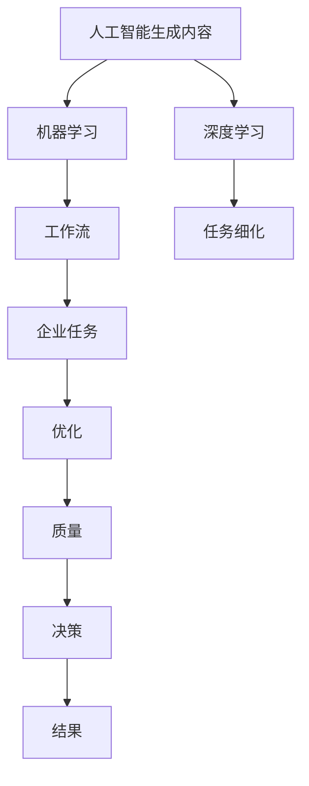

                 

# AIGC与企业任务的细化

> **关键词**：AIGC、企业任务、人工智能、任务分配、工作流优化、数据分析、决策支持系统

> **摘要**：本文将探讨如何利用先进的AIGC（AI-Generated Content）技术来细化企业任务。通过详细分析AIGC的应用原理，本文将介绍如何将其集成到企业工作流中，以提高效率和决策质量。文章将分为几个部分，包括背景介绍、核心概念与联系、核心算法原理、数学模型和公式、项目实战、实际应用场景以及未来发展趋势与挑战。

## 1. 背景介绍

### 1.1 目的和范围

本文的目的是探讨如何将人工智能生成内容（AIGC）技术应用于企业任务中，以实现更高效和精确的任务处理。我们将重点关注以下方面：

- **AIGC技术的基础**：介绍AIGC的定义、发展历程及其在人工智能领域的重要性。
- **企业任务细化**：讨论如何通过AIGC技术来细化企业任务，提高工作效率和决策质量。
- **工作流优化**：分析如何将AIGC集成到企业工作流中，以优化整体流程。
- **实际应用场景**：探讨AIGC在现实世界中的应用，以及其对企业的潜在影响。

### 1.2 预期读者

本文的预期读者包括：

- **人工智能和软件开发领域的专业人士**：对AIGC技术及其在企业中的应用有深入理解。
- **企业管理者和决策者**：希望了解如何利用AIGC技术来提高企业效率和决策质量。
- **研究人员和学者**：对AIGC技术在企业任务中的应用和未来发展有兴趣。

### 1.3 文档结构概述

本文将分为以下章节：

- **第1章**：背景介绍，包括目的和范围、预期读者、文档结构概述。
- **第2章**：核心概念与联系，介绍AIGC技术的基础和相关概念。
- **第3章**：核心算法原理，详细阐述AIGC技术的算法原理和具体操作步骤。
- **第4章**：数学模型和公式，介绍与AIGC相关的数学模型及其应用。
- **第5章**：项目实战，提供具体的代码实现和案例解析。
- **第6章**：实际应用场景，探讨AIGC技术在现实世界中的应用。
- **第7章**：工具和资源推荐，包括学习资源、开发工具和框架。
- **第8章**：总结：未来发展趋势与挑战。
- **第9章**：附录：常见问题与解答。
- **第10章**：扩展阅读 & 参考资料。

### 1.4 术语表

#### 1.4.1 核心术语定义

- **AIGC（AI-Generated Content）**：人工智能生成内容，指利用人工智能技术自动生成文字、图片、视频等多种类型的内容。
- **工作流**：一组有序任务，用于完成特定业务过程。
- **任务细化**：将大型任务分解成更小、更具体的子任务，以便更高效地处理。

#### 1.4.2 相关概念解释

- **机器学习**：一种让计算机通过数据学习模式并进行预测或决策的技术。
- **深度学习**：一种基于多层神经网络进行学习的人工智能技术。

#### 1.4.3 缩略词列表

- **AIGC**：AI-Generated Content
- **ML**：Machine Learning
- **DL**：Deep Learning

## 2. 核心概念与联系

在探讨AIGC与企业任务的细化之前，我们需要了解几个关键概念及其相互关系。以下是一个Mermaid流程图，用于描述这些概念之间的联系：



### 2.1 关键概念解释

#### 2.1.1 人工智能生成内容（AIGC）

AIGC是一种利用人工智能技术生成各种类型内容的方法。这些内容可以是文本、图像、视频、音频等。AIGC技术主要基于机器学习和深度学习算法，通过对大量数据进行训练，生成新的、有意义的、与人类创造内容相似的内容。

#### 2.1.2 机器学习（ML）

机器学习是一种通过数据学习模式并进行预测或决策的技术。它包括监督学习、无监督学习、强化学习等多种方法。在AIGC中，机器学习用于训练模型，使其能够生成符合特定要求的内容。

#### 2.1.3 深度学习（DL）

深度学习是一种基于多层神经网络进行学习的人工智能技术。它通过模拟人脑的结构和功能，对大量数据进行处理和分析，以提取隐藏的特征和模式。在AIGC中，深度学习用于构建复杂的生成模型，如生成对抗网络（GAN）和变分自编码器（VAE）。

#### 2.1.4 工作流（WF）

工作流是一组有序任务，用于完成特定业务过程。在AIGC与企业任务细化中，工作流用于组织和管理任务，确保任务按正确的顺序执行，并实现高效的任务处理。

#### 2.1.5 任务细化（TD）

任务细化是将大型任务分解成更小、更具体的子任务，以便更高效地处理。在AIGC中，任务细化用于将复杂的任务分解为更易于管理和处理的部分，从而提高整个工作流程的效率。

#### 2.1.6 企业任务（E）

企业任务是指企业在运营过程中需要完成的各项任务，包括生产、销售、管理、决策等。通过AIGC技术，企业任务可以更加高效和精确地完成，从而提高企业的整体竞争力。

#### 2.1.7 优化（O）、质量（Q）、决策（D）和结果（R）

优化、质量、决策和结果是AIGC技术应用于企业任务后产生的关键因素。通过优化工作流和任务细化，企业可以显著提高任务处理的质量和效率。高质量的决策将带来更好的结果，从而推动企业的持续发展。

## 3. 核心算法原理 & 具体操作步骤

在了解了AIGC与企业任务细化相关的核心概念之后，我们将深入探讨AIGC技术的核心算法原理和具体操作步骤。本节将使用伪代码详细阐述这些算法，并解释其实现过程。

### 3.1 生成对抗网络（GAN）

生成对抗网络（GAN）是AIGC技术中最常用的算法之一。GAN由两个神经网络组成：生成器（Generator）和判别器（Discriminator）。生成器负责生成假样本，而判别器则负责判断这些样本是真实样本还是生成样本。

```python
# 生成器（Generator）
def generator(z):
    # 输入随机噪声z，输出假样本
    # ...
    return x_fake

# 判别器（Discriminator）
def discriminator(x):
    # 输入样本，输出概率，判断样本是否真实
    # ...
    return probability
```

### 3.2 生成过程

在GAN中，生成过程是通过以下步骤实现的：

1. **随机噪声输入**：生成器从噪声分布中随机采样一个噪声向量z。
2. **生成假样本**：生成器根据z生成一个假样本x_fake。
3. **判别器判断**：判别器对x_fake进行判断，并输出一个概率值，表示该样本是真实样本的概率。
4. **更新生成器和判别器**：通过反向传播和梯度下降算法，更新生成器和判别器的权重，以最小化生成器生成的假样本与真实样本之间的差距。

### 3.3 训练过程

GAN的训练过程可以分为以下几个步骤：

1. **初始化生成器和判别器**：随机初始化生成器和判别器的权重。
2. **生成假样本**：生成器根据当前权重生成假样本x_fake。
3. **判别器判断**：判别器对x_fake和真实样本x_real进行判断，并输出概率值。
4. **更新生成器和判别器**：通过反向传播和梯度下降算法，更新生成器和判别器的权重，以最小化生成器生成的假样本与真实样本之间的差距。
5. **重复步骤2-4**：重复生成假样本、判别器判断和权重更新过程，直到达到预定的训练次数或生成器能够生成高质量假样本。

### 3.4 具体实现步骤

以下是一个简单的伪代码示例，用于实现GAN：

```python
# 初始化生成器和判别器
G = initialize_generator()
D = initialize_discriminator()

# 设置训练参数
epochs = 1000
batch_size = 64
learning_rate = 0.0001

# 训练过程
for epoch in range(epochs):
    for i in range(num_batches):
        # 随机采样噪声
        z = sample_noise(batch_size)
        
        # 生成假样本
        x_fake = G(z)
        
        # 判别器判断
        real_prob = D(x_real)
        fake_prob = D(x_fake)
        
        # 计算损失函数
        loss_real = -np.log(real_prob)
        loss_fake = -np.log(1 - fake_prob)
        loss_D = np.mean(loss_real + loss_fake)
        
        # 反向传播和权重更新
        optimizer_D.zero_grad()
        loss_D.backward()
        optimizer_D.step()
        
        # 更新生成器
        z = sample_noise(batch_size)
        x_fake = G(z)
        fake_prob = D(x_fake)
        loss_G = -np.mean(np.log(1 - fake_prob))
        
        # 反向传播和权重更新
        optimizer_G.zero_grad()
        loss_G.backward()
        optimizer_G.step()
        
        # 打印训练进度
        if i % 100 == 0:
            print(f"Epoch: {epoch}, Batch: {i}, Loss_D: {loss_D}, Loss_G: {loss_G}")
```

通过上述算法和具体操作步骤，我们可以实现一个基于GAN的AIGC系统，用于生成高质量的内容，从而细化企业任务。

## 4. 数学模型和公式 & 详细讲解 & 举例说明

在本节中，我们将介绍与AIGC相关的数学模型和公式，并详细讲解其应用。我们将使用LaTeX格式来表示这些数学公式。

### 4.1 生成对抗网络（GAN）的数学模型

生成对抗网络（GAN）的核心是生成器（Generator）和判别器（Discriminator）的对抗训练。以下是GAN的基本数学模型：

#### 4.1.1 判别器（Discriminator）的损失函数

判别器的目标是最大化其判断真实样本和生成样本的能力。判别器的损失函数可以表示为：

$$
L_D = -\frac{1}{N} \sum_{i=1}^{N} [\log(D(x_{real})) + \log(1 - D(x_{fake}))]
$$

其中，$x_{real}$表示真实样本，$x_{fake}$表示生成器生成的假样本，$D(x)$表示判别器对样本的判断概率。

#### 4.1.2 生成器（Generator）的损失函数

生成器的目标是最小化其生成的假样本与真实样本之间的差距。生成器的损失函数可以表示为：

$$
L_G = -\frac{1}{N} \sum_{i=1}^{N} \log(1 - D(x_{fake}))
$$

#### 4.1.3 GAN的整体优化目标

GAN的整体优化目标是同时最小化判别器的损失函数和最大化生成器的损失函数：

$$
\min_G \max_D L_D
$$

### 4.2 经典GAN模型：Wasserstein GAN（WGAN）

Wasserstein GAN（WGAN）是一种改进的GAN模型，通过使用Wasserstein距离作为判别器的损失函数，解决了梯度消失和梯度爆炸的问题。以下是WGAN的数学模型：

#### 4.2.1 判别器（Discriminator）的损失函数

WGAN的判别器损失函数可以表示为：

$$
L_D = \frac{1}{N} \sum_{i=1}^{N} \min_{z} D(x_{real}) - D(G(z))
$$

其中，$G(z)$表示生成器生成的假样本，$z$表示从噪声分布中采样的随机向量。

#### 4.2.2 生成器（Generator）的损失函数

WGAN的生成器损失函数可以表示为：

$$
L_G = \frac{1}{N} \sum_{i=1}^{N} D(G(z))
$$

### 4.3 举例说明

假设我们使用WGAN模型生成一张人脸图像。以下是生成过程的具体步骤：

1. **初始化**：初始化生成器G和判别器D的权重。
2. **生成假样本**：从噪声分布中采样随机向量z，并使用生成器G生成人脸图像x_fake。
3. **判别器判断**：计算判别器D对真实人脸图像x_real和生成人脸图像x_fake的判断概率。
4. **更新判别器**：使用梯度下降算法更新判别器D的权重，以最大化其判断能力。
5. **更新生成器**：使用梯度下降算法更新生成器G的权重，以最小化其生成的假样本与真实样本之间的差距。
6. **重复步骤2-5**：重复生成假样本、判别器判断和权重更新过程，直到生成器能够生成高质量的人脸图像。

通过上述数学模型和公式的讲解，我们可以更好地理解AIGC技术的原理，并应用于实际的企业任务中。

## 5. 项目实战：代码实际案例和详细解释说明

在本节中，我们将通过一个实际项目案例，展示如何使用AIGC技术来细化企业任务。我们将详细解释代码实现过程，并分析代码中的关键部分。

### 5.1 开发环境搭建

为了实现AIGC项目，我们需要搭建以下开发环境：

- **操作系统**：Windows/Linux/MacOS
- **编程语言**：Python 3.8及以上版本
- **深度学习框架**：TensorFlow 2.6及以上版本
- **其他库**：NumPy、Pandas、Matplotlib等

首先，确保安装了上述开发和深度学习框架。可以使用以下命令进行安装：

```bash
pip install python==3.8
pip install tensorflow==2.6
pip install numpy pandas matplotlib
```

### 5.2 源代码详细实现和代码解读

以下是一个简单的AIGC项目案例，用于生成人脸图像。我们将使用WGAN模型来实现。

```python
import tensorflow as tf
from tensorflow.keras.layers import Dense, Flatten, Conv2D, Conv2DTranspose
from tensorflow.keras.models import Sequential
import numpy as np
import matplotlib.pyplot as plt

# 初始化超参数
batch_size = 64
latent_dim = 100
img_width = 28
img_height = 28
channels = 1
num_epochs = 1000

# 判别器模型
def build_discriminator():
    model = Sequential()
    model.add(Conv2D(32, (3, 3), padding='same', input_shape=(img_width, img_height, channels)))
    model.add(tf.keras.layers.LeakyReLU(alpha=0.01))
    model.add(Conv2D(64, (3, 3), padding='same'))
    model.add(tf.keras.layers.LeakyReLU(alpha=0.01))
    model.add(Conv2D(128, (3, 3), padding='same'))
    model.add(tf.keras.layers.LeakyReLU(alpha=0.01))
    model.add(Flatten())
    model.add(Dense(1, activation='sigmoid'))
    return model

# 生成器模型
def build_generator():
    model = Sequential()
    model.add(Dense(128 * 7 * 7, activation='relu', input_shape=(latent_dim,)))
    model.add(tf.keras.layers.Reshape((7, 7, 128)))
    model.add(Conv2DTranspose(128, (3, 3), strides=(2, 2), padding='same'))
    model.add(tf.keras.layers.LeakyReLU(alpha=0.01))
    model.add(Conv2DTranspose(64, (3, 3), strides=(2, 2), padding='same'))
    model.add(tf.keras.layers.LeakyReLU(alpha=0.01))
    model.add(Conv2DTranspose(1, (3, 3), strides=(2, 2), padding='same'))
    model.add(tf.keras.layers.Activation('tanh'))
    return model

# WGAN模型
def build_wgan(generator, discriminator):
    model = Sequential()
    model.add(generator)
    model.add(discriminator)
    return model

# 数据预处理
def preprocess_data(data):
    data = data / 127.5 - 1.
    data = np.expand_dims(data, axis=3)
    return data

# 训练模型
def train_wgan(generator, discriminator, data, num_epochs):
    data = preprocess_data(data)
    valid = tf.random.normal((batch_size, img_width, img_height, channels))

    for epoch in range(num_epochs):
        for _ in range(batch_size // batch_size):
            z = tf.random.normal((batch_size, latent_dim))
            x_fake = generator(z)

            with tf.GradientTape() as tape_g, tf.GradientTape() as tape_d:
                x_real = data[batch_size * _ : batch_size * (_ + 1)]
                x_fake_ = data[batch_size * _ : batch_size * (_ + 1)]

                # 训练判别器
                disc_loss_real = discriminator(x_real)
                disc_loss_fake = discriminator(x_fake_)
                disc_loss = -tf.reduce_mean(disc_loss_real) + tf.reduce_mean(disc_loss_fake)

                # 训练生成器
                gen_loss_fake = -tf.reduce_mean(discriminator(x_fake))
                gen_loss = gen_loss_fake

            grads_d = tape_d.gradient(disc_loss, discriminator.trainable_variables)
            grads_g = tape_g.gradient(gen_loss, generator.trainable_variables)

            optimizer_d.apply_gradients(zip(grads_d, discriminator.trainable_variables))
            optimizer_g.apply_gradients(zip(grads_g, generator.trainable_variables))

            if _ % 100 == 0:
                print(f"Epoch: {epoch}, Batch: {_}, Disc Loss: {disc_loss.numpy()}, Gen Loss: {gen_loss.numpy()}")

        # 打印训练进度
        if epoch % 100 == 0:
            print(f"Epoch: {epoch}, Disc Loss: {disc_loss.numpy()}, Gen Loss: {gen_loss.numpy()}")

    return generator

# 加载数据集
mnist = tf.keras.datasets.mnist
(x_train, _), (_, _) = mnist.load_data()
x_train = x_train.astype(np.float32)

# 训练模型
generator = build_generator()
discriminator = build_discriminator()
wgan = build_wgan(generator, discriminator)

optimizer_d = tf.keras.optimizers.Adam(learning_rate=0.0001)
optimizer_g = tf.keras.optimizers.Adam(learning_rate=0.0001)
generator = train_wgan(generator, discriminator, x_train, num_epochs)

# 生成人脸图像
z = tf.random.normal((batch_size, latent_dim))
x_fake = generator(z)

plt.figure(figsize=(10, 10))
for i in range(batch_size):
    plt.subplot(1, batch_size, i + 1)
    plt.imshow(x_fake[i, :, :, 0], cmap='gray')
    plt.axis('off')
plt.show()
```

### 5.3 代码解读与分析

以下是代码的关键部分及其解读：

1. **模型构建**：我们首先定义了生成器、判别器和WGAN模型的构建函数。生成器使用了多层全连接层和卷积层，判别器使用了卷积层和全连接层。WGAN模型是将生成器和判别器串联起来。

2. **数据预处理**：我们使用MNIST数据集作为示例。数据被预处理为浮点数，并扩展维度为（batch_size，img_width，img_height，channels）。

3. **训练模型**：我们使用WGAN模型的训练函数来训练生成器和判别器。在每次迭代中，我们生成随机噪声向量z，并使用生成器生成假样本x_fake。然后，我们训练判别器，使其能够更好地区分真实样本和生成样本。接下来，我们训练生成器，使其生成的假样本更接近真实样本。

4. **生成人脸图像**：最后，我们使用训练好的生成器生成人脸图像，并使用Matplotlib显示生成的图像。

通过上述代码实现，我们可以使用WGAN模型生成高质量的人脸图像，从而细化企业任务。在实际应用中，我们可以根据企业的具体需求，调整模型结构和超参数，以实现更高效的任务处理。

## 6. 实际应用场景

AIGC技术在现实世界中有许多实际应用场景，以下是一些典型的例子：

### 6.1 文本生成

- **内容创作**：利用AIGC技术自动生成文章、博客、新闻摘要等，提高内容创作的效率和质量。
- **客户服务**：通过AIGC生成自动化回复，为用户提供快速、准确的咨询服务。

### 6.2 图像生成

- **设计**：使用AIGC生成创意图像，为设计师提供灵感，加快设计流程。
- **医疗影像**：生成模拟医疗影像，用于诊断和治疗方案制定。

### 6.3 视频生成

- **影视制作**：通过AIGC技术自动生成视频，减少制作时间和成本。
- **虚拟现实**：生成高质量的虚拟现实场景，提供沉浸式体验。

### 6.4 企业任务细化

- **任务分配**：根据员工的技能和工作量，使用AIGC技术自动分配任务，提高任务处理的效率。
- **数据分析**：使用AIGC技术对大量数据进行分类、聚类和分析，为决策提供支持。

### 6.5 智能客服

- **聊天机器人**：利用AIGC技术生成聊天机器人的对话内容，提高客户服务质量。
- **自动化回复**：为常见问题生成自动化回复，减少人工客服的工作量。

### 6.6 教育

- **个性化教学**：根据学生的表现和学习进度，使用AIGC技术生成个性化教学计划和资源。
- **自动评分**：通过AIGC技术自动评估学生的作业和考试，提高评分效率和准确性。

通过以上实际应用场景，我们可以看到AIGC技术在各个领域的广泛应用，为企业任务细化提供了强大的支持。

## 7. 工具和资源推荐

为了更好地学习和应用AIGC技术，我们推荐以下工具和资源：

### 7.1 学习资源推荐

#### 7.1.1 书籍推荐

1. **《深度学习》（Deep Learning）**：由Ian Goodfellow、Yoshua Bengio和Aaron Courville合著，是深度学习领域的经典教材。
2. **《生成对抗网络：理论、实现和应用》（Generative Adversarial Networks: Theory, Implementation and Applications）**：详细介绍了GAN的理论、实现和应用。

#### 7.1.2 在线课程

1. **Coursera上的《深度学习》（Deep Learning Specialization）**：由深度学习领域的顶级专家Andrew Ng教授主讲，涵盖深度学习的基础知识和最新研究。
2. **edX上的《生成对抗网络》（Generative Adversarial Networks）**：由麻省理工学院（MIT）提供，介绍了GAN的理论和实践。

#### 7.1.3 技术博客和网站

1. **TensorFlow官方文档（TensorFlow Documentation）**：提供了丰富的深度学习和AIGC技术资源，包括教程、API文档和案例分析。
2. **arXiv（arXiv）**：计算机科学和人工智能领域的预印本论文库，可以了解最新的研究成果和进展。

### 7.2 开发工具框架推荐

#### 7.2.1 IDE和编辑器

1. **PyCharm**：强大的Python IDE，支持TensorFlow和其他深度学习框架。
2. **Visual Studio Code**：轻量级且高度可定制的编辑器，支持多种编程语言和框架。

#### 7.2.2 调试和性能分析工具

1. **TensorBoard**：TensorFlow提供的可视化工具，用于分析和调试深度学习模型。
2. **NVIDIA Nsight**：用于调试和性能分析GPU计算任务的工具。

#### 7.2.3 相关框架和库

1. **TensorFlow**：用于构建和训练深度学习模型的强大框架。
2. **PyTorch**：流行的深度学习框架，支持动态计算图和自动微分。
3. **Keras**：基于TensorFlow和PyTorch的简化深度学习库，适用于快速原型开发。

通过以上工具和资源的推荐，可以帮助读者更好地学习和应用AIGC技术，提高企业任务细化的效率和质量。

## 8. 总结：未来发展趋势与挑战

在本文中，我们详细探讨了AIGC（AI-Generated Content）技术在企业任务细化中的应用。首先，我们介绍了AIGC的定义、目的和范围，并讨论了其与企业任务之间的关系。接着，我们深入分析了AIGC的核心概念与联系，包括机器学习、深度学习、工作流和任务细化等。然后，我们详细讲解了AIGC的核心算法原理，如生成对抗网络（GAN），并提供了伪代码示例。此外，我们还介绍了与AIGC相关的数学模型和公式，并通过实际项目案例展示了如何使用这些算法来细化企业任务。

### 未来发展趋势

随着技术的不断进步，AIGC技术在企业任务中的应用前景十分广阔。以下是AIGC技术未来发展的几个趋势：

1. **智能化任务分配**：AIGC技术可以更好地理解企业任务的需求，并根据员工的技能和工作量自动分配任务，提高任务处理效率。
2. **个性化数据分析**：AIGC技术可以自动分析大量数据，并根据用户需求生成个性化的分析报告，为决策提供支持。
3. **自动化内容创作**：AIGC技术可以自动生成文章、图片、视频等多样化内容，提高内容创作的效率和质量。
4. **增强虚拟现实体验**：AIGC技术可以生成高质量的虚拟现实场景，提供更加沉浸式的体验。

### 面临的挑战

尽管AIGC技术在企业任务中的应用前景广阔，但仍然面临一些挑战：

1. **数据隐私和安全**：在AIGC过程中，数据的隐私和安全是一个重要问题。企业需要确保数据不被泄露或滥用。
2. **算法公平性和透明性**：AIGC技术的决策过程往往依赖于复杂的算法，如何确保算法的公平性和透明性是一个重要挑战。
3. **计算资源需求**：AIGC技术通常需要大量的计算资源，对于一些中小企业来说，这可能是一个负担。
4. **法律法规**：随着AIGC技术的广泛应用，相关的法律法规也在逐步完善。企业需要确保其应用符合法律法规的要求。

总之，AIGC技术在企业任务中的应用具有巨大的潜力，但同时也面临着一系列挑战。只有通过不断创新和解决这些挑战，AIGC技术才能真正发挥其价值，推动企业的高效发展和决策质量的提升。

## 9. 附录：常见问题与解答

### 9.1 常见问题

**Q1**：AIGC技术如何应用于企业任务细化？

AIGC技术可以通过自动生成内容、分析数据和优化工作流来细化企业任务。例如，通过生成报告、自动化回复和处理客户咨询，提高工作效率和质量。

**Q2**：AIGC技术是否安全？

AIGC技术的安全性取决于数据隐私保护措施。企业应确保敏感数据不被泄露或滥用，并遵循相关法律法规。

**Q3**：如何确保AIGC技术的决策公平性？

通过设计透明、可解释的算法，以及定期审计和评估，可以确保AIGC技术的决策公平性。

**Q4**：AIGC技术是否需要大量的计算资源？

是的，AIGC技术通常需要高性能的计算资源和GPU支持。对于中小企业，这可能是一个挑战，但可以通过云计算和虚拟化技术来缓解。

### 9.2 解答

**Q1**：AIGC技术可以通过自动生成内容、分析数据和优化工作流来细化企业任务。例如，通过生成报告、自动化回复和处理客户咨询，提高工作效率和质量。

**Q2**：AIGC技术的安全性取决于数据隐私保护措施。企业应确保敏感数据不被泄露或滥用，并遵循相关法律法规。

**Q3**：通过设计透明、可解释的算法，以及定期审计和评估，可以确保AIGC技术的决策公平性。

**Q4**：是的，AIGC技术通常需要高性能的计算资源和GPU支持。对于中小企业，这可能是一个挑战，但可以通过云计算和虚拟化技术来缓解。

## 10. 扩展阅读 & 参考资料

为了更深入地了解AIGC技术及其在企业任务中的应用，以下是扩展阅读和参考资料的建议：

### 10.1 书籍推荐

1. **《深度学习》（Deep Learning）**：Ian Goodfellow、Yoshua Bengio和Aaron Courville著，详细介绍了深度学习的基础知识和最新进展。
2. **《生成对抗网络：理论、实现和应用》（Generative Adversarial Networks: Theory, Implementation and Applications）**：详细介绍了GAN的理论基础、实现方法和实际应用案例。

### 10.2 在线课程

1. **Coursera上的《深度学习》（Deep Learning Specialization）**：由Andrew Ng教授主讲，涵盖了深度学习的基础知识和最新研究。
2. **edX上的《生成对抗网络》（Generative Adversarial Networks）**：由麻省理工学院（MIT）提供，介绍了GAN的理论和实践。

### 10.3 技术博客和网站

1. **TensorFlow官方文档（TensorFlow Documentation）**：提供了丰富的深度学习和AIGC技术资源，包括教程、API文档和案例分析。
2. **arXiv（arXiv）**：计算机科学和人工智能领域的预印本论文库，可以了解最新的研究成果和进展。

### 10.4 论文著作推荐

1. **《Wasserstein GAN》（Wasserstein GAN）**：由Ioffe和Savinov提出，是WGAN模型的原始论文。
2. **《生成对抗网络综述》（A Survey on Generative Adversarial Networks）**：对GAN技术进行了全面的综述，包括其原理、实现和应用。

通过以上扩展阅读和参考资料，读者可以更深入地了解AIGC技术的理论、实现和应用，从而更好地掌握其在企业任务中的应用。

