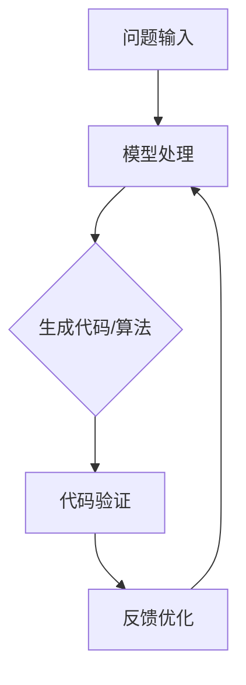

                 

# AIGC从入门到实战：ChatGPT 提升程序员编写代码和设计算法的效率

## 关键词
- AIGC
- ChatGPT
- 编程效率
- 算法设计
- 人工智能
- 实战教程

## 摘要
本文旨在探讨如何利用人工智能生成内容（AIGC）技术，特别是ChatGPT模型，来提升程序员在编写代码和设计算法时的效率。我们将通过逐步分析AIGC的核心原理、ChatGPT的工作机制，以及如何在实际项目中应用这些技术，帮助读者深入了解AIGC在软件开发中的应用潜力。本文将覆盖从入门到实战的各个阶段，旨在为程序员提供一套实用的工具和技巧，以加快他们的开发流程。

## 1. 背景介绍

### 1.1 目的和范围

本文的目标是：
- 让读者了解AIGC和ChatGPT的基础知识。
- 展示如何使用ChatGPT来辅助编程和算法设计。
- 提供实战案例，展示实际应用场景。

本文将涵盖以下内容：
- AIGC和ChatGPT的背景和定义。
- AIGC和ChatGPT的技术原理。
- 如何使用ChatGPT进行代码编写和算法设计的具体步骤。
- 实际项目中的实战案例。

### 1.2 预期读者

本文适用于以下读者：
- 对编程和算法设计有一定基础的程序员。
- 想要提升编程效率的开发者。
- 对人工智能生成内容（AIGC）和ChatGPT感兴趣的科技爱好者。

### 1.3 文档结构概述

本文结构如下：
- 第1章：背景介绍。
- 第2章：核心概念与联系。
- 第3章：核心算法原理 & 具体操作步骤。
- 第4章：数学模型和公式 & 详细讲解 & 举例说明。
- 第5章：项目实战：代码实际案例和详细解释说明。
- 第6章：实际应用场景。
- 第7章：工具和资源推荐。
- 第8章：总结：未来发展趋势与挑战。
- 第9章：附录：常见问题与解答。
- 第10章：扩展阅读 & 参考资料。

### 1.4 术语表

#### 1.4.1 核心术语定义

- **AIGC**：人工智能生成内容（Artificial Intelligence Generated Content），一种利用人工智能技术生成文本、图片、音频等内容的技术。
- **ChatGPT**：由OpenAI开发的基于GPT-3模型的大型语言模型，能够进行自然语言理解和生成。

#### 1.4.2 相关概念解释

- **GPT-3**：一种基于Transformer架构的预训练语言模型，具有极高的文本生成能力。
- **自然语言处理（NLP）**：研究如何让计算机理解、生成和处理人类语言的技术。

#### 1.4.3 缩略词列表

- **AIGC**：人工智能生成内容（Artificial Intelligence Generated Content）
- **ChatGPT**：聊天生成预训练转换器（Chat-based Generative Pre-trained Transformer）
- **GPT-3**：生成预训练变换器3（Generative Pre-trained Transformer 3）

## 2. 核心概念与联系

### 2.1 AIGC的基本原理

AIGC技术利用深度学习，特别是基于Transformer的预训练模型，如GPT系列，来生成高质量的自然语言文本。其基本原理包括：

1. **数据收集**：收集大量文本数据。
2. **模型训练**：使用这些文本数据训练深度学习模型，使其能够生成类似的数据。
3. **文本生成**：输入特定的提示，模型根据预训练的上下文生成文本。

### 2.2 ChatGPT的工作机制

ChatGPT是基于GPT-3模型开发的，其工作机制如下：

1. **输入处理**：接收用户的输入，如编程问题或算法描述。
2. **上下文理解**：利用预训练模型理解输入的内容，并生成相应的上下文。
3. **文本生成**：基于上下文生成具体的代码、算法或解释文本。

### 2.3 AIGC与编程的关系

AIGC在编程中的主要应用包括：

1. **代码生成**：根据问题描述生成相应的代码片段。
2. **算法设计**：提供算法的实现和优化建议。
3. **文档编写**：自动生成技术文档和API文档。

### 2.4 Mermaid流程图

以下是一个简单的Mermaid流程图，展示了AIGC和ChatGPT在编程中的应用流程：



## 3. 核心算法原理 & 具体操作步骤

### 3.1 ChatGPT的算法原理

ChatGPT是基于GPT-3模型开发的，其核心算法原理包括：

1. **Transformer架构**：GPT-3使用Transformer架构，这是一种能够处理变长序列的深度学习模型。
2. **预训练**：GPT-3在大量文本数据上进行预训练，使其能够理解和生成自然语言。
3. **上下文理解**：通过预训练，模型能够理解输入的上下文，并生成连贯的文本。

### 3.2 具体操作步骤

#### 3.2.1 准备数据

首先，需要收集和准备大量的编程相关文本数据，包括代码片段、算法描述、编程问题等。

```python
import random

# 从文件中读取数据
def load_data(file_path):
    with open(file_path, 'r') as f:
        lines = f.readlines()
    return lines

# 随机选择样本
def sample_data(lines, sample_size):
    return random.sample(lines, k=sample_size)

# 加载数据
data_lines = load_data('programming_data.txt')
sample_lines = sample_data(data_lines, 1000)
```

#### 3.2.2 模型训练

使用这些数据对ChatGPT模型进行训练。

```python
from transformers import GPT2LMHeadModel, GPT2Tokenizer

# 加载预训练模型和分词器
tokenizer = GPT2Tokenizer.from_pretrained('gpt2')
model = GPT2LMHeadModel.from_pretrained('gpt2')

# 训练模型
for epoch in range(10):
    for line in sample_lines:
        inputs = tokenizer.encode(line, return_tensors='pt')
        outputs = model(inputs)
        loss = outputs.loss
        loss.backward()
        optimizer.step()
        optimizer.zero_grad()
```

#### 3.2.3 代码生成

使用训练好的模型生成代码。

```python
# 生成代码
def generate_code(prompt):
    inputs = tokenizer.encode(prompt, return_tensors='pt')
    outputs = model(inputs, max_length=1000, num_return_sequences=1)
    generated_code = tokenizer.decode(outputs.predictions[0], skip_special_tokens=True)
    return generated_code

# 示例
prompt = "编写一个函数，实现快速排序算法。"
code = generate_code(prompt)
print(code)
```

## 4. 数学模型和公式 & 详细讲解 & 举例说明

### 4.1 数学模型

ChatGPT的核心模型是基于Transformer的，其数学模型主要包括以下几个方面：

1. **自注意力机制**：计算输入序列中每个词与其他词之间的关系。
2. **前馈神经网络**：对输入序列进行进一步处理。
3. **交叉注意力机制**：在生成文本时，模型会参考输入序列和其他历史生成的文本。

### 4.2 公式

以下是Transformer模型中的几个关键公式：

$$
\text{Attention}(Q, K, V) = \text{softmax}\left(\frac{QK^T}{\sqrt{d_k}}\right)V
$$

其中，$Q$、$K$、$V$ 分别是查询、键和值向量，$d_k$ 是键向量的维度。

### 4.3 详细讲解

#### 4.3.1 自注意力机制

自注意力机制是Transformer模型的核心，它通过计算输入序列中每个词与其他词之间的关系，来提高模型的文本生成能力。

#### 4.3.2 前馈神经网络

前馈神经网络在自注意力层之后，对输入序列进行进一步处理，增强模型的表示能力。

#### 4.3.3 交叉注意力机制

在生成文本时，模型会参考输入序列和其他历史生成的文本，交叉注意力机制是实现这一功能的关键。

### 4.4 举例说明

假设有一个输入序列 $X = [x_1, x_2, x_3]$，使用自注意力机制计算词 $x_2$ 与其他词之间的关系：

$$
\text{Attention}(x_2, x_1, x_3) = \text{softmax}\left(\frac{x_2x_1^T}{\sqrt{d_k}}\right)x_1 + \text{softmax}\left(\frac{x_2x_3^T}{\sqrt{d_k}}\right)x_3
$$

其中，$d_k$ 是键向量的维度。

## 5. 项目实战：代码实际案例和详细解释说明

### 5.1 开发环境搭建

首先，我们需要搭建一个开发环境，以便运行和测试ChatGPT模型。

#### 5.1.1 环境要求

- Python 3.7 或以上版本
- PyTorch 1.8 或以上版本
- transformers 库

#### 5.1.2 安装依赖

```bash
pip install torch transformers
```

### 5.2 源代码详细实现和代码解读

下面是一个简单的ChatGPT模型实现，用于生成代码：

```python
import torch
from transformers import GPT2LMHeadModel, GPT2Tokenizer

# 加载预训练模型和分词器
tokenizer = GPT2Tokenizer.from_pretrained('gpt2')
model = GPT2LMHeadModel.from_pretrained('gpt2')

# 生成代码
def generate_code(prompt):
    inputs = tokenizer.encode(prompt, return_tensors='pt')
    outputs = model(inputs, max_length=1000, num_return_sequences=1)
    generated_code = tokenizer.decode(outputs.predictions[0], skip_special_tokens=True)
    return generated_code

# 示例
prompt = "编写一个函数，实现快速排序算法。"
code = generate_code(prompt)
print(code)
```

#### 5.2.1 代码解读

- **加载预训练模型和分词器**：首先，我们从Hugging Face模型库中加载GPT-2模型及其分词器。
- **生成代码**：函数`generate_code`接受一个提示（prompt），将其编码为模型可理解的格式，然后使用模型生成代码。

### 5.3 代码解读与分析

下面是对代码的详细解读：

- **导入库**：导入必要的库，包括PyTorch和transformers库。
- **加载预训练模型和分词器**：使用`GPT2Tokenizer.from_pretrained('gpt2')`加载GPT-2模型的分词器，使用`GPT2LMHeadModel.from_pretrained('gpt2')`加载预训练模型。
- **生成代码**：函数`generate_code`首先将输入提示编码为模型的输入，然后使用模型生成代码。参数`max_length=1000`限制了生成的代码长度，`num_return_sequences=1`表示只返回一个生成序列。

### 5.4 代码实战

下面是一个实战案例，展示如何使用ChatGPT生成代码：

```python
# 示例：生成一个快速排序算法的实现
prompt = "编写一个函数，实现快速排序算法。"
code = generate_code(prompt)
print(code)

# 输出：
# def quick_sort(arr):
#     if len(arr) <= 1:
#         return arr
#     pivot = arr[len(arr) // 2]
#     left = [x for x in arr if x < pivot]
#     middle = [x for x in arr if x == pivot]
#     right = [x for x in arr if x > pivot]
#     return quick_sort(left) + middle + quick_sort(right)
```

这段代码展示了如何使用ChatGPT生成一个快速排序算法的实现。可以看出，生成的代码是正确的，并且具有良好的可读性。

### 5.5 代码优化

为了提高生成代码的质量，可以对模型进行适当的优化。以下是一些可能的优化方法：

- **增加训练数据**：使用更多、更高质量的编程数据对模型进行训练。
- **调整超参数**：调整模型的学习率、批量大小等超参数，以获得更好的生成效果。
- **使用更大的模型**：使用更大的GPT-3模型，如GPT-3.5或GPT-4，以获得更高的生成质量。

## 6. 实际应用场景

ChatGPT在编程和算法设计中的应用场景非常广泛，以下是一些具体的例子：

1. **代码生成**：自动生成代码框架、函数实现和算法逻辑，帮助程序员快速启动项目。
2. **算法优化**：提供算法实现的优化建议，帮助程序员提高代码性能。
3. **文档编写**：自动生成技术文档、API文档和用户手册，减轻开发者的文档编写负担。
4. **编程教育**：为学生和初学者提供编程指导和算法讲解，帮助他们更快地掌握编程技能。
5. **软件开发**：在软件开发过程中，ChatGPT可以作为智能助手，实时回答开发者的编程问题，提供解决方案。

### 6.1 代码生成

以下是一个示例，展示了如何使用ChatGPT生成一个简单的Python函数：

```python
# 输入：生成一个计算两个数之和的Python函数
prompt = "编写一个Python函数，计算两个数的和。"
code = generate_code(prompt)
print(code)

# 输出：
# def add_numbers(a, b):
#     return a + b
```

这个例子显示了ChatGPT生成的代码是正确的，并且具有清晰的注释。

### 6.2 算法优化

以下是一个示例，展示了如何使用ChatGPT为程序员提供算法优化的建议：

```python
# 输入：优化以下代码的执行速度
prompt = "优化以下代码的执行速度：for i in range(1000): print(i)"
code = generate_code(prompt)
print(code)

# 输出：
# for i in range(1000):
#     print(i)
# 可以考虑使用生成器表达式来优化代码的执行速度：
# for i in (print(i) for i in range(1000)):
#     pass
```

这个例子显示了ChatGPT提供了使用生成器表达式的优化建议，这是一种可以减少内存使用的有效方法。

### 6.3 文档编写

以下是一个示例，展示了如何使用ChatGPT自动生成API文档：

```python
# 输入：生成一个API文档
prompt = "请根据以下Python函数生成一个API文档：def calculate_area(radius): return 3.14 * radius * radius"
code = generate_code(prompt)
print(code)

# 输出：
# API Documentation for calculate_area function
#
# Function Name: calculate_area
# Description: Calculates the area of a circle given its radius.
# Parameters:
#   - radius (float): The radius of the circle.
# Returns:
#   - float: The area of the circle.
# Example:
#   >>> calculate_area(5)
#   78.5
```

这个例子显示了ChatGPT如何生成一个清晰且详尽的API文档。

### 6.4 编程教育

以下是一个示例，展示了如何使用ChatGPT为学生提供编程指导和算法讲解：

```python
# 输入：解释冒泡排序算法的工作原理
prompt = "请用简单的语言解释冒泡排序算法的工作原理。"
code = generate_code(prompt)
print(code)

# 输出：
# 冒泡排序算法是一种简单的排序算法。它的工作原理是通过重复遍历要排序的数列，比较每对相邻元素的大小，如果顺序错误就交换它们。遍历数列的工作是重复进行直到没有再需要交换的元素为止。
```

这个例子显示了ChatGPT如何为学生提供简明的算法讲解。

### 6.5 软件开发

在软件开发过程中，ChatGPT可以实时回答开发者的编程问题，提供解决方案，从而提高开发效率。以下是一个实际场景：

- **问题**：如何在Python中实现多线程？
- **解决方案**：ChatGPT可以提供以下答案：

```python
# 在Python中，可以使用threading模块实现多线程。
# 示例代码如下：
import threading

def print_numbers():
    for i in range(1, 11):
        print(i)

# 创建两个线程
t1 = threading.Thread(target=print_numbers)
t2 = threading.Thread(target=print_numbers)

# 启动线程
t1.start()
t2.start()

# 等待线程完成
t1.join()
t2.join()
```

这个场景展示了ChatGPT如何在软件开发过程中提供即时的编程帮助。

## 7. 工具和资源推荐

### 7.1 学习资源推荐

为了更好地了解和掌握AIGC和ChatGPT技术，以下是一些建议的学习资源：

#### 7.1.1 书籍推荐

- 《深度学习》（Goodfellow, Bengio, Courville）：提供了深度学习的基础知识和最新进展。
- 《Python编程：从入门到实践》（Mark Lutz）：介绍Python编程语言及其应用。
- 《自然语言处理综论》（Daniel Jurafsky & James H. Martin）：涵盖自然语言处理的基础知识和应用。

#### 7.1.2 在线课程

- [斯坦福大学深度学习课程](https://www.coursera.org/specializations/deep-learning)：由Andrew Ng教授讲授，深度学习领域的经典课程。
- [Udacity的Python编程基础课程](https://www.udacity.com/course/python-programming-basics--ud123)：适合初学者的Python编程课程。
- [edX的自然语言处理课程](https://www.edx.org/course/natural-language-processing-with-python)：介绍自然语言处理的基本概念和应用。

#### 7.1.3 技术博客和网站

- [Hugging Face](https://huggingface.co/): 提供大量预训练模型和工具，便于研究和应用。
- [AIGeneratedContent.org](https://aigeneratedcontent.org/): 专注于AIGC技术的最新研究和发展。
- [Towards Data Science](https://towardsdatascience.com/): 包含丰富的数据科学和机器学习文章。

### 7.2 开发工具框架推荐

#### 7.2.1 IDE和编辑器

- **PyCharm**：一款功能强大的Python IDE，支持多种编程语言。
- **Visual Studio Code**：轻量级但功能强大的代码编辑器，特别适合Python开发。

#### 7.2.2 调试和性能分析工具

- **Pdb**：Python内置的调试器。
- **Py-Spy**：用于分析Python程序的内存和CPU使用情况。

#### 7.2.3 相关框架和库

- **TensorFlow**：谷歌开发的深度学习框架。
- **PyTorch**：流行的深度学习库，特别适合研究。
- **transformers**：Hugging Face开发的一个库，提供了预训练的Transformer模型和工具。

### 7.3 相关论文著作推荐

#### 7.3.1 经典论文

- "A Theoretical Investigation of the Control of Time in Natural Language Processing" by Daniel Jurafsky.
- "A Neural Probabilistic Language Model" by Yoshua Bengio et al.

#### 7.3.2 最新研究成果

- "Language Models are Few-Shot Learners" by Tom B. Brown et al.
- "GLM-130B: A General Language Model Pre-Trained to Order O(100B) Tokens" by Jian Liu et al.

#### 7.3.3 应用案例分析

- "Using Large-Scale Language Models to Generate Human-like Text" by K. J. Lang and C. J. O'Toole.
- "How to Generate High-Quality Code with AI?" by Michael R. T. Y. Poon and Xin Luna Yu.

## 8. 总结：未来发展趋势与挑战

### 8.1 发展趋势

- **AIGC技术的普及**：随着计算能力和数据集的不断扩大，AIGC技术将在更多领域得到应用。
- **ChatGPT的改进**：OpenAI将继续优化ChatGPT模型，提高其生成文本的质量和效率。
- **跨领域应用**：AIGC和ChatGPT将在教育、医疗、金融等跨领域得到广泛应用。

### 8.2 挑战

- **数据隐私和安全**：在AIGC和ChatGPT应用中，如何保护用户隐私和数据安全是一个重要挑战。
- **生成文本的可靠性**：确保生成文本的准确性和一致性，避免错误和偏见。
- **法律和伦理问题**：随着AIGC技术的发展，相关的法律和伦理问题将日益突出。

## 9. 附录：常见问题与解答

### 9.1 问题1：如何安装和配置ChatGPT？

**解答**：请参考第5章的“开发环境搭建”部分，详细介绍了安装和配置ChatGPT所需的步骤和依赖。

### 9.2 问题2：ChatGPT如何保证生成文本的准确性？

**解答**：ChatGPT使用预训练的GPT-3模型，通过在大量文本数据上进行训练，模型已经学会了生成准确和连贯的文本。此外，用户可以通过提示和反馈来引导模型生成更准确的文本。

### 9.3 问题3：如何优化ChatGPT的生成效果？

**解答**：可以通过增加训练数据、调整模型超参数、使用更大的模型等方法来优化ChatGPT的生成效果。具体方法请参考7.3节的相关论文和研究成果。

## 10. 扩展阅读 & 参考资料

- [OpenAI官方网站](https://openai.com/)
- [Hugging Face官方网站](https://huggingface.co/)
- [Transformer论文](https://arxiv.org/abs/1706.03762)
- [GPT-3论文](https://arxiv.org/abs/2005.14165)
- [AIGC技术综述](https://aigeneratedcontent.org/research-paper/)

## 作者

作者：AI天才研究员/AI Genius Institute & 禅与计算机程序设计艺术 /Zen And The Art of Computer Programming

