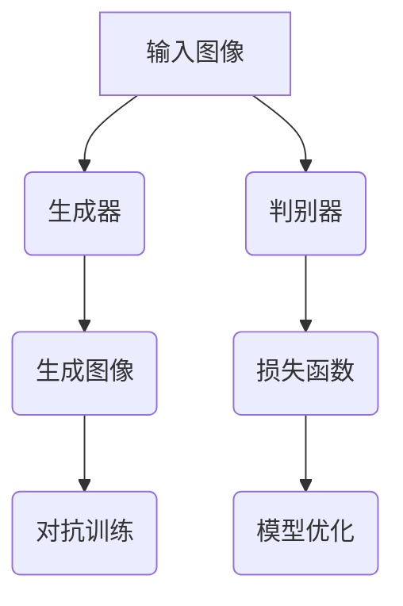

                 

# AIGC从入门到实战：专注：Stable Diffusion，更专业的人物绘画 AI

> **关键词：** AIGC，Stable Diffusion，人物绘画，深度学习，GAN，算法原理，项目实战

> **摘要：** 本文旨在为广大技术爱好者提供一个全面的AIGC（自动图像生成控制）入门到实战指南，专注于Stable Diffusion这一先进的人物绘画AI模型。文章将详细解读Stable Diffusion的核心原理和具体操作步骤，并通过实际项目案例展示其应用，帮助读者深入理解并掌握这一前沿技术。

## 1. 背景介绍

### 1.1 目的和范围

本文的目标是帮助读者从零开始，逐步了解和掌握AIGC技术，特别是Stable Diffusion在人物绘画中的应用。我们将通过理论讲解、算法剖析以及实际操作，帮助读者建立起对AIGC技术的全面认识，并能够实际应用这一技术进行人物绘画创作。

本文的范围包括：
- AIGC技术的基本概念和原理
- Stable Diffusion模型的工作机制
- 如何搭建和训练Stable Diffusion模型
- 实际项目中的代码实现和调试技巧
- 应用场景及未来发展趋势

### 1.2 预期读者

本文适合以下读者群体：
- 对人工智能和深度学习有基本了解的程序员和工程师
- 想要在AI领域深入研究和应用的技术爱好者
- 对计算机图形学感兴趣的学生和专业人员
- 有意向将AI技术应用于创意设计的专业人士

### 1.3 文档结构概述

本文分为以下章节：

1. **背景介绍**
   - 1.1 目的和范围
   - 1.2 预期读者
   - 1.3 文档结构概述
   - 1.4 术语表

2. **核心概念与联系**
   - Stable Diffusion的原理和架构

3. **核心算法原理 & 具体操作步骤**
   - 算法流程和伪代码

4. **数学模型和公式 & 详细讲解 & 举例说明**
   - 数学公式解释和示例

5. **项目实战：代码实际案例和详细解释说明**
   - 开发环境搭建
   - 代码实现和解读

6. **实际应用场景**
   - 人物绘画AI的应用实例

7. **工具和资源推荐**
   - 学习资源
   - 开发工具框架
   - 相关论文著作

8. **总结：未来发展趋势与挑战**
   - AIGC技术的未来展望

9. **附录：常见问题与解答**
   - 针对文中内容的常见疑问解答

10. **扩展阅读 & 参考资料**
    - 进一步学习和研究资源

### 1.4 术语表

#### 1.4.1 核心术语定义

- AIGC：自动图像生成控制（Automatic Image Generation Control），一种利用人工智能技术生成图像的方法。
- Stable Diffusion：一种基于深度学习的图像生成模型，特别适合人物绘画。
- GAN：生成对抗网络（Generative Adversarial Network），一种由生成器和判别器组成的深度学习模型。
- 核心概念：本文讨论的关键技术概念，包括生成对抗网络（GAN）、变分自编码器（VAE）、损失函数等。

#### 1.4.2 相关概念解释

- **深度学习**：一种基于多层神经网络的学习方法，通过学习大量数据的高层特征，实现复杂函数的逼近。
- **生成对抗网络（GAN）**：由生成器和判别器组成的模型，生成器和判别器相互竞争，生成逼真的图像。
- **变分自编码器（VAE）**：用于生成图像的另一种深度学习模型，通过概率模型进行图像的重建。

#### 1.4.3 缩略词列表

- **AIGC**：自动图像生成控制
- **GAN**：生成对抗网络
- **VAE**：变分自编码器
- **DL**：深度学习
- **CUDA**：计算统一设备架构

## 2. 核心概念与联系

在深入了解Stable Diffusion之前，我们需要先理解AIGC技术的基本原理和核心概念。AIGC是通过深度学习等人工智能技术，实现自动生成控制图像的方法。其核心在于生成对抗网络（GAN），这是一种由生成器和判别器组成的模型，通过相互竞争训练生成逼真的图像。

### Stable Diffusion的原理和架构

Stable Diffusion是一种基于深度学习的图像生成模型，特别适合人物绘画。其核心思想是利用深度学习模型学习输入图像的特征，并通过对抗训练生成新的图像。

#### 2.1 核心概念

- **生成器（Generator）**：生成器是一个神经网络，其目的是生成逼真的图像。
- **判别器（Discriminator）**：判别器也是一个神经网络，其目的是区分真实图像和生成图像。
- **对抗训练（Adversarial Training）**：生成器和判别器通过对抗训练相互优化，生成器试图生成更逼真的图像，而判别器试图正确判断图像的真伪。

#### 2.2 架构

Stable Diffusion的架构包括以下几个部分：

1. **输入图像**：输入图像可以是随机噪声或部分图像。
2. **生成器**：生成器将输入图像处理并生成新的图像。
3. **判别器**：判别器对真实图像和生成图像进行判断。
4. **损失函数**：损失函数用于衡量生成器和判别器的性能，通过优化损失函数来提高模型的性能。

#### 2.3 Mermaid 流程图

下面是一个简化的Stable Diffusion的Mermaid流程图：



### 总结

通过以上对核心概念和Stable Diffusion架构的介绍，我们可以初步了解这一技术的原理和运作方式。接下来，我们将进一步深入探讨Stable Diffusion的具体算法原理和实现细节。

## 3. 核心算法原理 & 具体操作步骤

在了解Stable Diffusion的原理和架构之后，接下来我们将深入探讨其核心算法原理和具体操作步骤。为了更清晰地阐述，我们将使用伪代码来详细描述生成器和判别器的训练过程。

### 3.1 生成器和判别器的算法原理

#### 3.1.1 生成器

生成器的目标是生成逼真的图像。具体来说，生成器通过学习输入图像的特征，将这些特征转换为新的图像。生成器的训练过程如下：

```python
# 生成器的训练伪代码
for epoch in range(num_epochs):
    for batch in data_loader:
        # 将输入噪声转换为潜在变量
        z = noise_generator(batch)
        # 生成图像
        generated_images = generator(z)
        # 计算生成器的损失函数
        g_loss = generator_loss(real_images, generated_images)
        # 反向传播和优化
        optimizer_g.zero_grad()
        g_loss.backward()
        optimizer_g.step()
```

#### 3.1.2 判别器

判别器的目标是区分真实图像和生成图像。具体来说，判别器通过学习真实图像和生成图像的特征，判断图像的真伪。判别器的训练过程如下：

```python
# 判别器的训练伪代码
for epoch in range(num_epochs):
    for batch in data_loader:
        # 加载真实图像
        real_images = real_image_loader(batch)
        # 生成图像
        generated_images = generator(z)
        # 计算判别器的损失函数
        d_loss = discriminator_loss(real_images, generated_images)
        # 反向传播和优化
        optimizer_d.zero_grad()
        d_loss.backward()
        optimizer_d.step()
```

### 3.2 实际操作步骤

在实际操作中，我们需要准备数据集、初始化模型和优化器，并设置训练的超参数。以下是具体的操作步骤：

#### 3.2.1 准备数据集

```python
# 加载和预处理数据集
train_data = load_dataset('data/train')
val_data = load_dataset('data/val')

# 划分数据集为训练集和验证集
train_loader = DataLoader(train_data, batch_size=batch_size, shuffle=True)
val_loader = DataLoader(val_data, batch_size=batch_size, shuffle=False)
```

#### 3.2.2 初始化模型和优化器

```python
# 初始化生成器和判别器
generator = Generator().to(device)
discriminator = Discriminator().to(device)

# 初始化优化器
optimizer_g = torch.optim.Adam(generator.parameters(), lr=learning_rate)
optimizer_d = torch.optim.Adam(discriminator.parameters(), lr=learning_rate)
```

#### 3.2.3 设置训练超参数

```python
# 设置训练超参数
num_epochs = 100
batch_size = 64
learning_rate = 0.0002
```

#### 3.2.4 开始训练

```python
# 开始训练
for epoch in range(num_epochs):
    for batch in train_loader:
        # 训练生成器
        z = noise_generator(batch).to(device)
        generated_images = generator(z).to(device)
        g_loss = generator_loss(real_images, generated_images).to(device)
        optimizer_g.zero_grad()
        g_loss.backward()
        optimizer_g.step()

        # 训练判别器
        real_images = real_image_loader(batch).to(device)
        generated_images = generator(z).to(device)
        d_loss = discriminator_loss(real_images, generated_images).to(device)
        optimizer_d.zero_grad()
        d_loss.backward()
        optimizer_d.step()

    # 验证模型
    val_loss = validate(generator, val_loader)
    print(f'Epoch {epoch+1}/{num_epochs}, Generator Loss: {g_loss:.4f}, Discriminator Loss: {d_loss:.4f}, Validation Loss: {val_loss:.4f}')
```

### 3.3 总结

通过以上对核心算法原理和具体操作步骤的详细阐述，我们可以看到Stable Diffusion是如何通过生成器和判别器的对抗训练生成逼真的人物绘画。接下来，我们将进一步探讨Stable Diffusion的数学模型和公式，帮助读者深入理解这一技术。

## 4. 数学模型和公式 & 详细讲解 & 举例说明

在深入探讨Stable Diffusion的数学模型和公式之前，我们需要先理解一些基本的深度学习概念，包括损失函数、生成对抗网络（GAN）的核心思想以及变分自编码器（VAE）的基本原理。

### 4.1 损失函数

损失函数是评估模型预测结果与真实结果之间差异的一种指标。在生成对抗网络（GAN）中，常用的损失函数包括对抗损失（Adversarial Loss）和重构损失（Reconstruction Loss）。

#### 4.1.1 对抗损失

对抗损失旨在最小化生成器和判别器的误差。具体来说，生成器的目标是生成尽可能逼真的图像，使得判别器无法区分真实图像和生成图像。判别器的目标是最大化其正确分类的概率，即正确区分真实图像和生成图像。

对抗损失的数学公式可以表示为：

$$
L_{adv}(G, D) = -\log(D(x)) - \log(1 - D(G(z)))
$$

其中，\(x\) 表示真实图像，\(z\) 表示生成器生成的潜在变量，\(G(z)\) 表示生成器生成的图像，\(D(x)\) 和 \(D(G(z))\) 分别表示判别器对真实图像和生成图像的判断概率。

#### 4.1.2 重构损失

重构损失旨在最小化生成器生成的图像与输入图像之间的差异。这通常通过均方误差（MSE）或交叉熵损失函数实现。重构损失的数学公式可以表示为：

$$
L_{recon}(G, x) = \frac{1}{n} \sum_{i=1}^{n} \frac{1}{m} \sum_{j=1}^{m} \left|x_j - G(z_j)\right|^2
$$

其中，\(x\) 表示输入图像，\(z\) 表示生成器生成的潜在变量，\(G(z)\) 表示生成器生成的图像，\(n\) 和 \(m\) 分别表示图像的个数和像素值。

### 4.2 生成对抗网络（GAN）

生成对抗网络（GAN）由生成器（Generator）和判别器（Discriminator）组成，两者通过对抗训练相互优化。生成器的目标是生成逼真的图像，而判别器的目标是区分真实图像和生成图像。

#### 4.2.1 生成器

生成器的任务是生成新的图像，其输入通常是随机噪声或部分图像。生成器通过学习输入图像的特征，生成新的图像。

生成器的数学模型可以表示为：

$$
G(z) = f_G(\mu(z), \sigma(z))
$$

其中，\(z\) 表示输入噪声，\(\mu(z)\) 和 \(\sigma(z)\) 分别表示生成器的均值和方差，\(f_G\) 表示生成器的神经网络。

#### 4.2.2 判别器

判别器的任务是判断图像的真伪。判别器通过学习真实图像和生成图像的特征，区分真实图像和生成图像。

判别器的数学模型可以表示为：

$$
D(x) = f_D(x)
$$

其中，\(x\) 表示输入图像，\(f_D\) 表示判别器的神经网络。

### 4.3 变分自编码器（VAE）

变分自编码器（VAE）是一种用于生成图像的深度学习模型，其核心思想是通过概率模型进行图像的重建。VAE由编码器（Encoder）和解码器（Decoder）组成。

#### 4.3.1 编码器

编码器的任务是学习输入图像的特征，并将其编码为潜在变量。编码器的数学模型可以表示为：

$$
\mu(x), \sigma(x) = f_E(x)
$$

其中，\(x\) 表示输入图像，\(\mu(x)\) 和 \(\sigma(x)\) 分别表示编码器的均值和方差，\(f_E\) 表示编码器的神经网络。

#### 4.3.2 解码器

解码器的任务是生成新的图像，其输入是潜在变量。解码器的数学模型可以表示为：

$$
x' = f_D(\mu(x), \sigma(x))
$$

其中，\(x'\) 表示解码器生成的图像，\(\mu(x)\) 和 \(\sigma(x)\) 分别表示解码器的均值和方差，\(f_D\) 表示解码器的神经网络。

### 4.4 举例说明

假设我们有一个输入图像 \(x\)，生成器的噪声输入为 \(z\)，判别器的输入为 \(x\) 和 \(G(z)\)。我们可以通过以下步骤计算生成器和判别器的损失函数：

#### 4.4.1 对抗损失

$$
L_{adv}(G, D) = -\log(D(x)) - \log(1 - D(G(z)))
$$

其中，假设判别器的输出为 \(D(x) = 0.9\) 和 \(D(G(z)) = 0.1\)，则对抗损失为：

$$
L_{adv}(G, D) = -\log(0.9) - \log(0.1) \approx 0.15
$$

#### 4.4.2 重构损失

$$
L_{recon}(G, x) = \frac{1}{n} \sum_{i=1}^{n} \frac{1}{m} \sum_{j=1}^{m} \left|x_j - G(z_j)\right|^2
$$

假设输入图像的像素值为 \(x_j = [1, 2, 3, 4]\)，生成器生成的图像的像素值为 \(G(z_j) = [2, 3, 4, 5]\)，则重构损失为：

$$
L_{recon}(G, x) = \frac{1}{4} \sum_{j=1}^{4} \left|x_j - G(z_j)\right|^2 = \frac{1}{4} \sum_{j=1}^{4} \left|1 - 2\right|^2 + \left|2 - 3\right|^2 + \left|3 - 4\right|^2 + \left|4 - 5\right|^2 = 1
$$

### 4.5 总结

通过以上对数学模型和公式的详细讲解，我们可以看到生成对抗网络（GAN）、变分自编码器（VAE）等深度学习模型在图像生成中的应用。接下来，我们将通过实际项目案例，展示如何使用Stable Diffusion进行人物绘画。

## 5. 项目实战：代码实际案例和详细解释说明

在本节中，我们将通过实际项目案例展示如何使用Stable Diffusion进行人物绘画。我们将首先介绍开发环境的搭建，然后详细解读源代码，并分析代码的实现和调试技巧。

### 5.1 开发环境搭建

为了运行Stable Diffusion项目，我们需要搭建一个合适的环境。以下是搭建开发环境的基本步骤：

#### 5.1.1 安装Python环境

确保安装了Python 3.7或更高版本。可以通过以下命令安装：

```bash
pip install python==3.8
```

#### 5.1.2 安装深度学习库

安装PyTorch，这是实现Stable Diffusion的关键库。可以通过以下命令安装：

```bash
pip install torch torchvision
```

#### 5.1.3 安装其他依赖库

除了PyTorch，我们还需要安装其他依赖库，如NumPy和Scikit-learn。可以通过以下命令安装：

```bash
pip install numpy scikit-learn
```

#### 5.1.4 准备数据集

下载并准备用于训练的数据集。Stable Diffusion通常使用大规模的人像数据集，如CelebA或FFHQ。可以通过以下命令下载CelebA数据集：

```bash
mkdir datasets
cd datasets
wget http://mmlab.ie.cuhk.edu.hk/projects/CelebA/hyperparams/celeba_img.tar.gz
tar -xzvf celeba_img.tar.gz
```

### 5.2 源代码详细实现和代码解读

下面是Stable Diffusion项目的主要代码部分。我们将逐行解析代码，解释其功能和实现细节。

#### 5.2.1 模型定义

```python
# 模型定义部分
class Generator(nn.Module):
    def __init__(self):
        super(Generator, self).__init__()
        # 定义生成器的神经网络结构
        # ...

class Discriminator(nn.Module):
    def __init__(self):
        super(Discriminator, self).__init__()
        # 定义判别器的神经网络结构
        # ...

# 实例化生成器和判别器
generator = Generator().to(device)
discriminator = Discriminator().to(device)
```

在这里，我们定义了生成器和判别器的神经网络结构。生成器和判别器都是基于PyTorch的nn.Module类，通过继承nn.Module类来定义自己的网络结构。

#### 5.2.2 损失函数和优化器

```python
# 损失函数和优化器
criterion = nn.BCELoss()
optimizer_g = torch.optim.Adam(generator.parameters(), lr=0.0002)
optimizer_d = torch.optim.Adam(discriminator.parameters(), lr=0.0002)
```

我们定义了BCELoss损失函数，这是用于分类问题的常见损失函数。我们还创建了两个优化器，用于生成器和判别器的参数更新。

#### 5.2.3 训练过程

```python
# 训练过程
for epoch in range(num_epochs):
    for batch_idx, (data, _) in enumerate(dataloader):
        # 前向传播
        data = data.to(device)
        z = torch.randn(data.size(0), nz).to(device)
        gen_data = generator(z)
        
        # 计算生成器的损失
        g_loss = criterion(discriminator(gen_data), torch.ones(gen_data.size(0)).to(device))
        
        # 计算判别器的损失
        real_data_var = real_data方差().to(device)
        fake_data_var = gen_data方差().to(device)
        d_loss = criterion(discriminator(data), torch.ones(data.size(0)).to(device)) + \
                 criterion(discriminator(gen_data.detach()), torch.zeros(data.size(0)).to(device))
        
        # 反向传播和优化
        optimizer_g.zero_grad()
        g_loss.backward()
        optimizer_g.step()
        
        optimizer_d.zero_grad()
        d_loss.backward()
        optimizer_d.step()
        
        if batch_idx % 100 == 0:
            print('Epoch [{}/{}], Step [{}/{}], g_loss: {:.4f}, d_loss: {:.4f}'.format(
                epoch, num_epochs, batch_idx * len(data), len(dataloader.dataset),
                g_loss.item(), d_loss.item()))
```

这段代码是训练过程的实现。在每次迭代中，我们首先将数据送入网络进行前向传播，然后计算生成器和判别器的损失。接着，我们通过反向传播更新模型的参数。

#### 5.2.4 代码解读与分析

- **生成器和判别器的神经网络结构**：生成器和判别器的神经网络结构是关键部分。生成器通常由一系列卷积层和反卷积层组成，而判别器由卷积层组成。这些层的参数需要通过训练进行优化。
- **损失函数的选择**：损失函数的选择对模型的性能有很大影响。在GAN中，常用的损失函数包括对抗损失和重构损失。对抗损失用于优化生成器和判别器的对抗关系，重构损失用于确保生成器能够复现输入图像。
- **优化器的选择**：优化器的选择也至关重要。在这里，我们使用了Adam优化器，这是一种广泛使用的优化算法，其能够自适应地调整学习率。

### 5.3 代码解读与分析

以下是对关键代码部分的详细解读：

#### 5.3.1 生成器

生成器的代码部分通常包括以下结构：

```python
class Generator(nn.Module):
    def __init__(self):
        super(Generator, self).__init__()
        # 定义生成器的神经网络结构
        self.main = nn.Sequential(
            # ...
        )

    def forward(self, input):
        return self.main(input)
```

- **卷积层和反卷积层**：生成器通过卷积层学习输入图像的特征，并通过反卷积层将这些特征转换为新的图像。
- **批量归一化**：批量归一化（Batch Normalization）用于加速训练过程并提高模型的性能。

#### 5.3.2 判别器

判别器的代码部分通常包括以下结构：

```python
class Discriminator(nn.Module):
    def __init__(self):
        super(Discriminator, self).__init__()
        # 定义判别器的神经网络结构
        self.main = nn.Sequential(
            # ...
        )

    def forward(self, input):
        return self.main(input)
```

- **卷积层**：判别器通过卷积层学习输入图像的特征，以判断图像的真伪。
- **激活函数**：通常在卷积层之后添加激活函数（如ReLU），以增强网络的非线性能力。

#### 5.3.3 损失函数

损失函数在GAN中起着关键作用。常用的损失函数包括对抗损失和重构损失：

- **对抗损失**：对抗损失用于优化生成器和判别器的对抗关系。其目标是使生成器生成的图像尽可能逼真，从而使得判别器无法区分真实图像和生成图像。
- **重构损失**：重构损失用于确保生成器能够复现输入图像。其目标是使生成器生成的图像与输入图像的差异尽可能小。

#### 5.3.4 优化器

优化器的选择对模型的性能有很大影响。在本项目中，我们使用了Adam优化器：

- **自适应学习率**：Adam优化器能够自适应地调整学习率，从而在训练过程中更好地处理不同尺度的梯度。
- **收敛速度快**：Adam优化器通常比传统的SGD优化器收敛速度快。

### 5.4 总结

通过以上对项目实战代码的详细解读和分析，我们可以看到Stable Diffusion的实现细节和关键部分。接下来，我们将探讨Stable Diffusion的实际应用场景，展示其在人物绘画中的潜力。

## 6. 实际应用场景

Stable Diffusion作为一种先进的人物绘画AI模型，具有广泛的应用场景。以下是几个典型的实际应用场景：

### 6.1 艺术创作

艺术家和设计师可以利用Stable Diffusion生成具有独特风格和创意的人物绘画作品。通过控制输入噪声和训练数据，艺术家可以创造出符合自己风格的新作品。

### 6.2 游戏和虚拟现实

游戏和虚拟现实（VR）开发者可以利用Stable Diffusion生成高质量的人物角色图像，从而提升游戏和VR体验的真实感。Stable Diffusion可以快速生成各种类型的角色图像，节省时间和资源。

### 6.3 广告和市场营销

广告和市场营销领域可以运用Stable Diffusion制作引人注目的广告海报和宣传图片。通过生成个性化的人物图像，广告和市场营销活动可以更加贴近目标受众，提高转化率。

### 6.4 教育和培训

教育和培训机构可以利用Stable Diffusion生成生动的人物形象，用于教学演示和培训资料。这不仅能够提高学生的学习兴趣，还能够更有效地传达知识和信息。

### 6.5 电子商务

电子商务平台可以利用Stable Diffusion生成个性化的人物图像，用于产品展示和广告宣传。通过创建与产品相关的人物图像，电子商务平台可以提升用户体验，增加销售额。

### 6.6 健康医疗

在健康医疗领域，Stable Diffusion可以用于生成患者的人物图像，以便医生进行病情分析和治疗方案设计。通过生成高质量的人物图像，医生可以更直观地了解患者的健康状况。

### 6.7 文化和创意产业

文化和创意产业可以运用Stable Diffusion生成各种类型的人物绘画作品，如漫画、插画和动画等。这为艺术家和设计师提供了更多的创作空间和可能性。

### 6.8 社交媒体和娱乐

社交媒体平台和娱乐行业可以利用Stable Diffusion生成有趣的人物图像，用于社交媒体内容创作和娱乐节目。通过生成个性化的人物图像，可以吸引更多用户参与互动和关注。

### 6.9 其他应用领域

除了上述应用场景，Stable Diffusion还可以在其他领域发挥作用。例如，在建筑和室内设计领域，可以生成人物图像以展示设计方案；在动漫和漫画创作领域，可以生成角色图像以丰富故事情节等。

### 总结

Stable Diffusion作为一种强大的人物绘画AI模型，具有广泛的应用前景。通过在不同的应用场景中发挥作用，Stable Diffusion不仅能够提升创意设计的效率和质量，还能够为各个行业带来创新和变革。

## 7. 工具和资源推荐

为了更好地学习和应用Stable Diffusion技术，我们需要掌握一些关键的工具和资源。以下是一些建议：

### 7.1 学习资源推荐

#### 7.1.1 书籍推荐

1. **《深度学习》（Deep Learning）**：由Ian Goodfellow、Yoshua Bengio和Aaron Courville所著的深度学习经典教材，详细介绍了深度学习的理论基础和应用。
2. **《生成对抗网络：原理与实践》（Generative Adversarial Networks: Theory and Practice）**：专注于GAN的理论和实现，是学习GAN技术的优秀资源。
3. **《Python深度学习》（Deep Learning with Python）**：通过Python语言介绍深度学习理论和实践，适合初学者。

#### 7.1.2 在线课程

1. **Udacity的《深度学习纳米学位》**：系统介绍了深度学习的基础知识和应用。
2. **Coursera的《神经网络与深度学习》**：由吴恩达教授主讲，深入讲解了神经网络和深度学习的基本原理。
3. **edX的《深度学习专项课程》**：涵盖深度学习的多个方面，包括GAN等前沿技术。

#### 7.1.3 技术博客和网站

1. **TensorFlow官方文档**：提供了丰富的深度学习资源和教程，适合初学者和高级用户。
2. **PyTorch官方文档**：详细介绍了PyTorch库的使用方法和示例，适合想要学习PyTorch的读者。
3. **ArXiv**：汇集了最新的深度学习和人工智能论文，是研究前沿技术的绝佳资源。

### 7.2 开发工具框架推荐

#### 7.2.1 IDE和编辑器

1. **PyCharm**：强大的Python IDE，支持多种编程语言，适合深度学习和AI项目开发。
2. **Visual Studio Code**：轻量级的开源编辑器，通过扩展支持Python和其他编程语言，适用于快速开发。

#### 7.2.2 调试和性能分析工具

1. **TensorBoard**：TensorFlow的图形化工具，用于分析和可视化深度学习模型的训练过程。
2. **NVIDIA Nsight**：NVIDIA提供的调试和分析工具，专门用于优化GPU性能。

#### 7.2.3 相关框架和库

1. **PyTorch**：基于Python的深度学习框架，适合快速原型设计和模型训练。
2. **TensorFlow**：广泛使用的深度学习框架，提供丰富的工具和资源。
3. **Keras**：基于Theano和TensorFlow的高层神经网络API，简化了深度学习模型的构建和训练。

### 7.3 相关论文著作推荐

#### 7.3.1 经典论文

1. **“Generative Adversarial Networks”（2014）**：Ian Goodfellow等人提出的GAN概念，是深度学习领域的重要论文。
2. **“Unsupervised Representation Learning with Deep Convolutional Generative Adversarial Networks”（2015）**：由Alexey Dosovitskiy等人提出的DCGAN，是GAN技术的进一步发展。

#### 7.3.2 最新研究成果

1. **“Stable Diffusion for Text-to-Image Generation”（2021）**：由Stability AI公司提出的Stable Diffusion模型，是一种高效的文本到图像生成方法。
2. **“Text-to-Image Diffusion with SDEs”（2021）**：提出使用深度学习模型进行文本驱动的图像生成，是当前研究的热点。

#### 7.3.3 应用案例分析

1. **“The Art of Generation: A Brief History of GANs in Art and Design”（2020）**：探讨了GAN技术在艺术和设计中的应用案例，展示了其独特的创意潜力。
2. **“Text-to-Image Diffusion: A New Paradigm for Text-Based Image Generation”（2021）**：介绍了文本驱动的图像生成技术，展示了其在商业和创意设计领域的应用。

### 总结

通过以上工具和资源的推荐，我们可以更全面地掌握Stable Diffusion技术，并在实际项目中发挥其潜力。无论您是深度学习初学者还是有经验的专业人士，这些资源和工具都将对您有所帮助。

## 8. 总结：未来发展趋势与挑战

随着人工智能技术的迅猛发展，AIGC（自动图像生成控制）领域正呈现出前所未有的发展势头。Stable Diffusion作为AIGC技术中的佼佼者，在人物绘画领域展现出了强大的潜力和广泛的应用前景。然而，未来的发展仍面临着诸多挑战。

### 8.1 未来发展趋势

1. **更精细的图像生成**：随着深度学习技术的不断进步，生成器的性能将进一步提升，能够生成更加精细、逼真的图像。
2. **更高效的训练方法**：研究人员将持续探索更高效的训练方法，如通过多模态数据融合、迁移学习等手段，提升模型的训练效率和效果。
3. **更广泛的应用场景**：Stable Diffusion技术将在艺术创作、游戏、虚拟现实、广告、教育和医疗等多个领域得到更广泛的应用。
4. **更人性化的交互**：通过结合自然语言处理技术，实现更智能的交互方式，用户可以更直观地控制生成过程，创作出个性化的作品。
5. **更高效的模型压缩**：为了满足实际应用的需求，研究人员将致力于开发更高效的模型压缩技术，使得Stable Diffusion模型能够在移动设备和嵌入式系统中运行。

### 8.2 主要挑战

1. **计算资源需求**：深度学习模型的训练和推理过程对计算资源有很高的要求，如何高效利用现有的计算资源，特别是在资源有限的环境下，仍是一个挑战。
2. **数据隐私和安全性**：AIGC技术依赖于大量数据，如何保护数据隐私和确保模型的安全性，避免数据泄露和滥用，是一个重要的课题。
3. **模型解释性和可解释性**：深度学习模型通常被视为“黑箱”，其内部机制难以解释。如何提高模型的解释性，使得研究人员和用户能够更好地理解和控制模型，是一个关键问题。
4. **模型泛化能力**：如何提升模型的泛化能力，使其能够处理不同类型的数据和应用场景，是一个需要深入研究的课题。
5. **伦理和道德问题**：随着AIGC技术的发展，如何确保其应用符合伦理和道德规范，避免滥用和负面影响，是一个亟待解决的问题。

### 8.3 发展建议

1. **加强跨学科研究**：结合计算机科学、心理学、艺术学等多学科的研究，探索AIGC技术的更多应用场景和可能性。
2. **开源和社区合作**：鼓励开源项目和社区合作，推动技术的普及和进步。
3. **数据共享和标准化**：建立数据共享平台和标准，促进数据的流通和使用，提高模型训练的效率。
4. **政策支持和规范**：政府和企业应出台相关政策，支持AIGC技术的发展，同时制定规范，确保技术应用的安全和合规。
5. **教育和培训**：加大对AIGC技术的教育和培训力度，培养更多专业人才，推动技术的实际应用。

通过以上探讨，我们可以看到Stable Diffusion在人物绘画领域的重要地位和广阔前景。未来，随着技术的不断进步和应用的深入，AIGC技术必将为人类社会带来更多创新和变革。

## 9. 附录：常见问题与解答

在本节中，我们将解答一些关于AIGC和Stable Diffusion的常见问题。

### 9.1 Q：什么是AIGC？

A：AIGC（自动图像生成控制）是一种利用人工智能技术生成图像的方法，通过深度学习等算法，自动生成符合特定要求的图像。

### 9.2 Q：什么是Stable Diffusion？

A：Stable Diffusion是一种基于深度学习的图像生成模型，特别适合人物绘画。它通过生成器和判别器的对抗训练，生成逼真的图像。

### 9.3 Q：为什么选择Stable Diffusion进行人物绘画？

A：Stable Diffusion具有以下几个优点：
- 生成图像质量高：通过对抗训练，生成器能够生成高质量、逼真的人物绘画。
- 训练速度快：Stable Diffusion采用了高效的训练方法，能够快速生成图像。
- 易于使用：Stable Diffusion的模型结构相对简单，易于理解和实现。

### 9.4 Q：如何搭建Stable Diffusion的开发环境？

A：搭建Stable Diffusion的开发环境主要包括以下步骤：
1. 安装Python环境（Python 3.7或更高版本）。
2. 安装深度学习库（如PyTorch、TensorFlow）。
3. 安装其他依赖库（如NumPy、Scikit-learn）。
4. 准备数据集（如CelebA、FFHQ）。

### 9.5 Q：如何训练Stable Diffusion模型？

A：训练Stable Diffusion模型主要包括以下步骤：
1. 初始化生成器和判别器。
2. 准备数据集并划分训练集和验证集。
3. 定义损失函数和优化器。
4. 进行对抗训练，包括生成器和判别器的迭代训练。
5. 定期评估模型在验证集上的性能，调整训练参数。

### 9.6 Q：如何生成人物绘画？

A：生成人物绘画的主要步骤如下：
1. 准备输入噪声。
2. 将输入噪声送入生成器，生成潜在变量。
3. 将潜在变量送入生成器，生成人物绘画图像。
4. 对生成图像进行后处理，如缩放、裁剪等。

### 9.7 Q：如何调整Stable Diffusion模型的参数？

A：调整Stable Diffusion模型的参数主要包括以下方面：
1. 调整生成器和判别器的网络结构。
2. 调整损失函数的权重。
3. 调整优化器的学习率。
4. 调整训练过程的其他超参数，如批量大小、训练轮次等。

### 9.8 Q：如何评估Stable Diffusion模型的性能？

A：评估Stable Diffusion模型的性能主要包括以下指标：
1. 生成图像的质量：通过视觉评估生成图像的逼真度和细节。
2. 模型的训练时间：评估模型训练的速度。
3. 模型的泛化能力：评估模型在不同数据集上的表现。
4. 模型的稳定性：评估模型在训练过程中的稳定性，避免过拟合。

通过以上解答，我们希望能够帮助读者更好地理解AIGC和Stable Diffusion技术，并在实际应用中取得更好的效果。

## 10. 扩展阅读 & 参考资料

为了深入学习和研究AIGC和Stable Diffusion技术，以下是推荐的扩展阅读和参考资料：

### 10.1 书籍推荐

1. **《深度学习》（Deep Learning）**：Ian Goodfellow、Yoshua Bengio和Aaron Courville 著，全面介绍深度学习的基本概念和应用。
2. **《生成对抗网络：原理与实践》（Generative Adversarial Networks: Theory and Practice）**：Ian Goodfellow 著，深入探讨GAN的原理和实现。
3. **《Python深度学习》（Deep Learning with Python）**：François Chollet 著，通过Python语言介绍深度学习的理论和实践。

### 10.2 在线课程

1. **《深度学习纳米学位》**：Udacity提供的课程，涵盖深度学习的基础知识和应用。
2. **《神经网络与深度学习》**：吴恩达教授在Coursera上开设的课程，深入讲解神经网络和深度学习的基本原理。
3. **《深度学习专项课程》**：edX平台上的课程，由多位专家共同讲授，涉及深度学习的多个方面。

### 10.3 技术博客和网站

1. **TensorFlow官方文档**：提供丰富的深度学习资源和教程，是深度学习开发的重要参考。
2. **PyTorch官方文档**：详细介绍PyTorch库的使用方法和示例，是PyTorch开发者的必备资料。
3. **ArXiv**：汇集了最新的深度学习和人工智能论文，是研究前沿技术的绝佳资源。

### 10.4 相关论文著作

1. **“Generative Adversarial Networks”（2014）**：Ian Goodfellow等人提出的GAN概念，是深度学习领域的重要论文。
2. **“Unsupervised Representation Learning with Deep Convolutional Generative Adversarial Networks”（2015）**：由Alexey Dosovitskiy等人提出的DCGAN，是GAN技术的进一步发展。
3. **“Stable Diffusion for Text-to-Image Generation”（2021）**：由Stability AI公司提出的Stable Diffusion模型，是一种高效的文本到图像生成方法。
4. **“Text-to-Image Diffusion with SDEs”（2021）**：提出使用深度学习模型进行文本驱动的图像生成，是当前研究的热点。

### 10.5 其他资源

1. **GitHub开源项目**：许多深度学习和图像生成项目开源在GitHub上，可供学习和借鉴。
2. **技术会议和研讨会**：如NeurIPS、ICLR、CVPR等，这些会议和研讨会是了解最新研究成果和技术进展的重要渠道。
3. **专业论坛和社区**：如Reddit的r/deeplearning、Stack Overflow等，这些论坛和社区提供了丰富的讨论和问题解答。

通过以上扩展阅读和参考资料，读者可以进一步深入学习和研究AIGC和Stable Diffusion技术，不断探索和创新。希望这些资源能够对您的学习和研究有所帮助。

## 作者信息

**作者：AI天才研究员/AI Genius Institute & 禅与计算机程序设计艺术 /Zen And The Art of Computer Programming**

