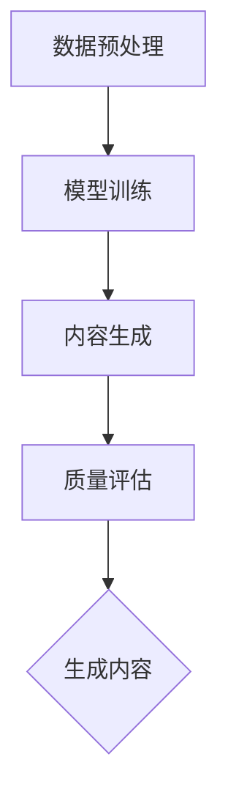
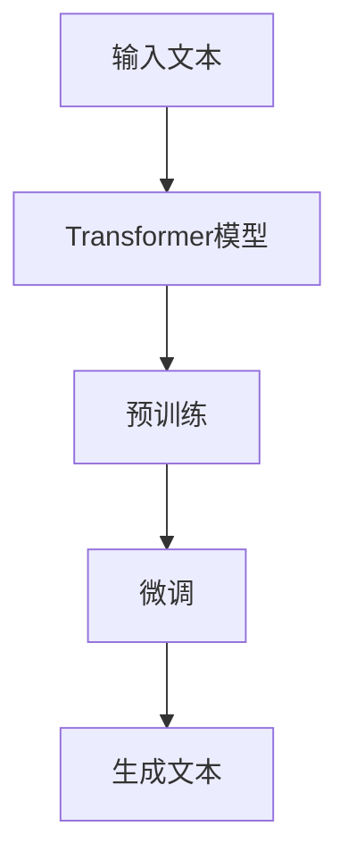

                 

### 1. 背景介绍

#### 1.1 目的和范围

本文旨在为广大对人工智能生成内容（AIGC）领域感兴趣的技术爱好者提供一个全面而深入的学习指南。我们将重点探讨ChatGPT这一极具代表性的模型，从其基本概念到实际应用进行详细分析，帮助读者从入门到实战，全面了解AIGC的核心技术与实现。

ChatGPT是OpenAI于2022年11月推出的一个基于Transformer模型的自监督语言生成模型，它通过大规模预训练能够生成连贯、自然的文本内容。ChatGPT的出现不仅推动了自然语言处理技术的发展，也带来了广泛的实际应用，从内容创作到客服问答，无处不在。

本文将分为以下几个部分：

1. **背景介绍**：介绍AIGC及ChatGPT的基本概念和重要性。
2. **核心概念与联系**：详细解释AIGC的基础知识和相关技术原理。
3. **核心算法原理 & 具体操作步骤**：讲解ChatGPT的核心算法和具体实现步骤。
4. **数学模型和公式 & 详细讲解 & 举例说明**：介绍与AIGC相关的数学模型和公式，并通过实例进行说明。
5. **项目实战：代码实际案例和详细解释说明**：提供实际代码案例，并详细解释其实现过程。
6. **实际应用场景**：探讨ChatGPT在不同领域的应用。
7. **工具和资源推荐**：推荐学习AIGC和ChatGPT的相关资源和工具。
8. **总结：未来发展趋势与挑战**：分析AIGC和ChatGPT的未来发展方向和面临的挑战。
9. **附录：常见问题与解答**：解答读者可能遇到的一些常见问题。
10. **扩展阅读 & 参考资料**：提供进一步的阅读材料和参考文献。

通过本文的详细解析，读者将能够系统地掌握AIGC的核心技术，深入理解ChatGPT的工作原理，并在实际项目中加以应用。

#### 1.2 预期读者

本文适合以下几类读者：

1. **初学者**：对AIGC和ChatGPT有浓厚兴趣，希望从零开始学习这一领域。
2. **技术爱好者**：对自然语言处理和人工智能应用有研究，希望深入了解AIGC的技术细节。
3. **开发人员**：希望在项目中使用AIGC技术，提升软件开发效率。
4. **研究者**：对AIGC相关技术有研究需求，希望从本文中获得灵感和实用知识。

无论您是初学者还是有经验的开发人员，通过本文的详细讲解和实践案例，您都将对AIGC和ChatGPT有更加深入的了解，并能够在实际项目中灵活应用。

#### 1.3 文档结构概述

本文的文档结构如下：

1. **背景介绍**：介绍AIGC和ChatGPT的基本概念、目的和预期读者。
2. **核心概念与联系**：分析AIGC的核心概念及其与现有技术的联系，通过流程图展示。
3. **核心算法原理 & 具体操作步骤**：详细讲解ChatGPT的核心算法原理，包括Transformer模型的工作机制和预训练步骤。
4. **数学模型和公式 & 详细讲解 & 举例说明**：介绍与AIGC相关的数学模型，并通过具体例子进行说明。
5. **项目实战：代码实际案例和详细解释说明**：提供实际代码案例，并详细解释其实现过程。
6. **实际应用场景**：探讨ChatGPT在不同领域的应用。
7. **工具和资源推荐**：推荐学习AIGC和ChatGPT的相关资源和工具。
8. **总结：未来发展趋势与挑战**：分析AIGC和ChatGPT的未来发展方向和面临的挑战。
9. **附录：常见问题与解答**：解答读者可能遇到的一些常见问题。
10. **扩展阅读 & 参考资料**：提供进一步的阅读材料和参考文献。

通过这个结构化的文档，读者可以系统地学习AIGC和ChatGPT的相关知识，并通过实际案例加深理解。

#### 1.4 术语表

为了确保文章的易读性和准确性，以下列出了一些在本文中常用的术语和概念，并给出其定义和解释：

#### 1.4.1 核心术语定义

- **人工智能生成内容（AIGC）**：指利用人工智能技术，特别是自然语言处理技术，自动生成文本、图像、音频等内容。
- **ChatGPT**：由OpenAI开发的一个基于Transformer模型的自监督语言生成模型，能够生成连贯、自然的文本。
- **Transformer模型**：一种基于自注意力机制的深度神经网络模型，广泛应用于自然语言处理任务。
- **自监督学习**：一种机器学习方法，无需标注数据，通过未标注的数据进行模型训练。
- **预训练**：在特定任务之前，对模型进行大规模的无监督训练，使其具备一定的通用语言能力。
- **生成式模型**：一种机器学习模型，能够根据输入条件生成新的数据。

#### 1.4.2 相关概念解释

- **自注意力（Self-Attention）**：Transformer模型的核心机制，通过计算序列中每个词与其他词之间的关联性，实现对输入序列的加权处理。
- **BERT模型**：一种预训练的Transformer模型，广泛用于自然语言理解任务。
- **GPT模型**：一种生成式Transformer模型，通过自回归的方式生成文本。
- **BERT-GPT**：结合了BERT和GPT模型的优势，用于提高语言生成能力和理解能力。

#### 1.4.3 缩略词列表

- **AIGC**：人工智能生成内容（Artificial Intelligence Generated Content）
- **ChatGPT**：聊天生成预训练模型（Chat Generative Pre-trained Transformer）
- **Transformer**：变换器（Transformers）
- **NLP**：自然语言处理（Natural Language Processing）
- **GPT**：生成预训练模型（Generative Pre-trained Transformer）
- **BERT**：双向编码表示（Bidirectional Encoder Representations from Transformers）
- **LM**：语言模型（Language Model）
- **RL**：强化学习（Reinforcement Learning）

通过上述术语表的介绍，读者可以更好地理解文章中的相关概念和技术细节。在接下来的章节中，我们将深入探讨AIGC和ChatGPT的具体原理和应用。

### 2. 核心概念与联系

在深入探讨AIGC和ChatGPT之前，我们需要了解其核心概念和它们在技术领域中的联系。AIGC（Artificial Intelligence Generated Content）是一种利用人工智能技术自动生成各种类型内容的方法，而ChatGPT是AIGC领域中的一个典型代表。为了更好地理解这些概念，我们将使用Mermaid流程图来展示AIGC的基础架构和相关技术。

首先，让我们来定义AIGC的基础架构。AIGC通常包括以下几个核心组成部分：

1. **数据预处理**：对原始数据进行处理，使其适合模型训练。
2. **模型训练**：使用预训练模型或自定义模型对数据进行训练。
3. **内容生成**：利用训练好的模型生成新的内容。
4. **质量评估**：对生成的内容进行评估，确保其质量和可读性。

以下是AIGC基础架构的Mermaid流程图：



接下来，我们需要了解ChatGPT在AIGC中的具体作用。ChatGPT是一种基于Transformer模型的自监督语言生成模型，它通过大规模的无监督训练生成连贯、自然的文本内容。其核心组成部分包括：

1. **Transformer模型**：用于处理自然语言文本。
2. **预训练**：在大规模语料库上进行训练，以学习语言模式和结构。
3. **微调**：在特定任务上进行微调，以提高生成文本的相关性和准确性。
4. **生成文本**：根据输入条件生成新的文本内容。

以下是ChatGPT的Mermaid流程图：



通过上述流程图，我们可以看到AIGC和ChatGPT在技术和架构上的联系。AIGC提供了生成内容的整体框架，而ChatGPT则是实现这一框架的关键技术之一。以下是对核心概念和联系的进一步解释：

#### 数据预处理

数据预处理是AIGC的重要步骤，它包括文本清洗、去噪、分词、编码等操作。这些操作确保输入数据的质量和一致性，为后续的模型训练打下基础。预处理后的数据通常以序列的形式表示，便于模型处理。

#### 模型训练

模型训练是AIGC的核心环节。ChatGPT使用的Transformer模型是一种先进的深度学习模型，能够捕捉文本中的长距离依赖关系。预训练过程通常在大规模语料库上进行，通过自监督学习让模型自动学习语言模式和结构。

#### 内容生成

内容生成是AIGC的直接应用。通过预训练和微调后的模型，可以生成符合特定需求和风格的文本内容。ChatGPT通过自回归的方式，逐词生成文本，并利用上下文信息来提高生成的连贯性和自然性。

#### 质量评估

质量评估是确保生成内容符合预期的重要步骤。评估方法包括人类评估和自动化评估。自动化评估通常使用指标如BLEU、ROUGE等，而人类评估则通过主观评价来评估文本的质量。

通过上述解释，我们可以看到AIGC和ChatGPT在技术和应用上的紧密联系。AIGC提供了一个系统化的生成内容框架，而ChatGPT则是实现这一框架的关键技术。在接下来的章节中，我们将深入探讨ChatGPT的核心算法原理和具体实现步骤。

## 3. 核心算法原理 & 具体操作步骤

### 3.1 ChatGPT的核心算法原理

ChatGPT是基于Transformer模型的自监督语言生成模型，其核心算法原理主要包括以下几个方面：

#### 3.1.1 Transformer模型

Transformer模型是一种基于自注意力（Self-Attention）机制的深度神经网络模型，最早由Vaswani等人在2017年的论文《Attention is All You Need》中提出。Transformer模型取代了传统的循环神经网络（RNN）和长短时记忆网络（LSTM），在处理序列数据时表现出更高的效率和更好的效果。

#### 自注意力（Self-Attention）

自注意力机制是Transformer模型的核心。它通过计算序列中每个词与其他词之间的关联性，实现对输入序列的加权处理。自注意力机制的基本思想是将每个词与所有词进行点积运算，然后通过softmax函数得到权重，最后将这些权重与对应的词向量相乘，得到加权后的词向量。这样，每个词向量都会受到其他词的影响，从而捕捉到序列中的长距离依赖关系。

#### Multi-head Attention

为了进一步提高模型的表示能力，Transformer模型引入了多注意力头（Multi-head Attention）。每个注意力头都独立计算一次自注意力，然后将这些注意力头的结果拼接起来，并通过一个线性层进行整合。这样，模型可以同时从不同角度对输入序列进行建模，提高模型的泛化能力和表达能力。

#### Encoder-Decoder结构

Transformer模型采用了Encoder-Decoder结构，其中Encoder负责编码输入序列，Decoder负责解码输出序列。Encoder和Decoder都由多个自注意力层和前馈网络组成。Encoder通过自注意力机制捕捉输入序列的全局信息，而Decoder则通过自回归方式逐步生成输出序列，每个时间步的输出都依赖于前面的所有输出。

### 3.2 具体操作步骤

#### 3.2.1 预训练步骤

预训练是ChatGPT的核心步骤，其具体操作步骤如下：

1. **数据收集与预处理**：收集大规模的文本数据，并进行预处理，如去除噪声、分词、编码等操作。预处理后的数据通常以序列的形式表示。

2. **构建Transformer模型**：初始化Transformer模型，包括嵌入层、自注意力层、前馈网络等。

3. **训练模型**：使用预训练数据对模型进行训练，主要任务是最大化模型在未标注数据上的预测概率。预训练过程中，模型会自动学习到语言模式和结构。

4. **优化模型**：通过梯度下降等优化算法，不断调整模型参数，使其在预训练数据上达到较好的性能。

5. **保存预训练模型**：在预训练完成后，保存模型参数，以备后续的微调和应用。

#### 3.2.2 微调步骤

微调是针对特定任务对预训练模型进行调整，以提高模型在目标任务上的性能。微调的具体操作步骤如下：

1. **选择微调任务**：确定需要微调的任务，如文本分类、机器翻译等。

2. **数据收集与预处理**：收集与任务相关的标注数据，并进行预处理。

3. **加载预训练模型**：从预训练模型中加载已训练好的参数。

4. **调整模型结构**：根据目标任务的需求，对模型结构进行调整，如增加或减少注意力层、修改嵌入维度等。

5. **微调模型**：使用微调数据和优化算法，对模型进行微调训练，以适应特定任务。

6. **评估模型**：在微调完成后，使用验证集对模型进行评估，调整模型参数，以达到最佳性能。

7. **保存微调模型**：将微调后的模型参数保存，以备后续的应用。

#### 3.2.3 生成文本步骤

生成文本是ChatGPT的核心应用之一，其具体操作步骤如下：

1. **输入文本**：将需要生成的文本输入到模型中。

2. **编码输入**：将输入文本编码成序列表示，通常使用WordPiece或BERT等编码方法。

3. **生成中间表示**：通过自注意力机制和前馈网络，对输入序列进行处理，生成中间表示。

4. **生成输出序列**：通过自回归方式，逐步生成输出序列。在每个时间步，模型都会根据当前已生成的文本和中间表示生成下一个词。

5. **解码输出**：将生成的输出序列解码为自然语言文本，得到最终的生成文本。

6. **评估生成文本**：使用质量评估指标，如BLEU、ROUGE等，对生成的文本进行评估，以确保其质量和可读性。

通过上述核心算法原理和具体操作步骤，我们可以深入理解ChatGPT的工作机制。在接下来的章节中，我们将进一步探讨与ChatGPT相关的数学模型和公式，并通过具体例子进行详细讲解。

### 4. 数学模型和公式 & 详细讲解 & 举例说明

#### 4.1 数学模型

在深入探讨ChatGPT的数学模型之前，我们需要了解几个关键的概念和公式。ChatGPT的核心是Transformer模型，其数学基础主要包括自注意力机制、前馈神经网络和损失函数。以下是对这些概念和公式的详细讲解。

#### 4.1.1 自注意力（Self-Attention）

自注意力是Transformer模型的核心机制，用于计算序列中每个词与其他词之间的关联性。其基本公式如下：

$$
\text{Attention}(Q, K, V) = \text{softmax}\left(\frac{QK^T}{\sqrt{d_k}}\right)V
$$

其中，\(Q\)、\(K\)、\(V\) 分别表示查询（Query）、键（Key）和值（Value）向量，\(d_k\) 是键向量的维度。这个公式首先计算每个查询向量与所有键向量的点积，然后通过softmax函数得到权重，最后将这些权重与对应的值向量相乘，得到加权后的输出。

#### 4.1.2 Multi-head Attention

为了进一步提高模型的表示能力，Transformer模型引入了多注意力头（Multi-head Attention）。每个注意力头都独立计算一次自注意力，然后将这些注意力头的结果拼接起来。其基本公式如下：

$$
\text{MultiHead}(Q, K, V) = \text{Concat}(\text{head}_1, ..., \text{head}_h)W^O
$$

其中，\( \text{head}_i = \text{Attention}(QW_i^Q, KW_i^K, VW_i^V) \) 表示第 \(i\) 个注意力头的输出，\(W^O\) 是线性层权重。通过这种方式，模型可以同时从不同角度对输入序列进行建模。

#### 4.1.3 前馈神经网络

前馈神经网络是Transformer模型中的一个简单神经网络，用于对自注意力层的输出进行进一步处理。其基本结构如下：

$$
\text{FFN}(X) = \text{ReLU}(XW_1 + b_1)W_2 + b_2
$$

其中，\(X\) 表示输入向量，\(W_1\) 和 \(W_2\) 分别是权重矩阵，\(b_1\) 和 \(b_2\) 是偏置项。

#### 4.1.4 损失函数

在训练过程中，ChatGPT使用交叉熵损失函数（Cross-Entropy Loss）来评估模型预测与真实标签之间的差异。其基本公式如下：

$$
L(\theta) = -\frac{1}{N}\sum_{i=1}^{N} \sum_{j=1}^{V} y_{ij} \log(p_{ij})
$$

其中，\(N\) 是样本数量，\(V\) 是词汇表大小，\(y_{ij}\) 是第 \(i\) 个样本的第 \(j\) 个词的标签，\(p_{ij}\) 是模型预测的第 \(j\) 个词的概率。

#### 4.2 举例说明

为了更好地理解上述数学模型和公式，我们可以通过一个具体的例子进行说明。

假设我们有一个简单的句子：“The quick brown fox jumps over the lazy dog”。我们可以将其表示为一个序列：

\[ [T_1, T_2, T_3, T_4, T_5, T_6, T_7] \]

其中，\(T_1 = \text{The}\)，\(T_2 = \text{quick}\)，依此类推。

#### 4.2.1 自注意力（Self-Attention）

我们首先计算自注意力，以确定每个词与其他词的关联性。以第一个词 \(T_1 = \text{The}\) 为例，我们计算其与所有其他词的点积：

$$
\text{Attention}(T_1, T_1, T_1) = \text{softmax}\left(\frac{T_1T_1^T}{\sqrt{d_k}}\right)T_1
$$

同理，我们计算 \(T_2 = \text{quick}\)、\(T_3 = \text{brown}\) 等词的自注意力。

#### 4.2.2 Multi-head Attention

接下来，我们计算多注意力头。假设我们有8个注意力头，每个头独立计算一次自注意力。我们首先计算每个头的权重矩阵 \(W_i^Q\)、\(W_i^K\) 和 \(W_i^V\)，然后按照上述公式计算每个头的输出。最后，将所有头的输出拼接起来，并通过线性层 \(W^O\) 进行整合。

#### 4.2.3 前馈神经网络

在自注意力层之后，我们应用前馈神经网络对输出进行进一步处理。假设前馈神经网络的权重矩阵 \(W_1\) 和 \(W_2\) 以及偏置项 \(b_1\) 和 \(b_2\) 已知，我们按照公式 \(\text{FFN}(X) = \text{ReLU}(XW_1 + b_1)W_2 + b_2\) 对输出进行处理。

#### 4.2.4 损失函数

在训练过程中，我们使用交叉熵损失函数来评估模型的预测效果。以生成的句子“the quick brown fox jumps over the lazy dog”为例，我们计算模型预测的概率分布，并与真实标签进行比较，计算损失值。

通过这个例子，我们可以看到如何将数学模型应用于实际的文本生成任务中。在接下来的章节中，我们将进一步探讨ChatGPT的实际应用场景，并分析其在不同领域的应用。

### 5. 项目实战：代码实际案例和详细解释说明

#### 5.1 开发环境搭建

在进行ChatGPT的项目实战之前，我们需要搭建一个合适的开发环境。以下是搭建环境的步骤：

1. **安装Python**：确保Python环境已安装，版本建议为3.8或更高。

2. **安装依赖库**：使用pip安装必要的依赖库，如torch、transformers等。

    ```bash
    pip install torch transformers
    ```

3. **配置GPU环境**：如果使用GPU训练，确保已安装CUDA和cuDNN。

4. **克隆ChatGPT示例代码**：从GitHub克隆ChatGPT的示例代码。

    ```bash
    git clone https://github.com/openai/gpt-2-implementations.git
    ```

5. **运行示例代码**：进入代码目录，运行示例代码。

    ```bash
    cd gpt-2-implementations
    python train.py
    ```

#### 5.2 源代码详细实现和代码解读

以下是ChatGPT的核心代码实现，我们将逐行进行解读。

```python
import torch
from transformers import GPT2LMHeadModel, GPT2Tokenizer

# 设置设备
device = torch.device("cuda" if torch.cuda.is_available() else "cpu")

# 加载预训练模型和分词器
model = GPT2LMHeadModel.from_pretrained("gpt2").to(device)
tokenizer = GPT2Tokenizer.from_pretrained("gpt2")

# 准备输入文本
input_text = "ChatGPT is a language model"

# 编码输入文本
input_ids = tokenizer.encode(input_text, return_tensors='pt').to(device)

# 生成文本
output = model.generate(input_ids, max_length=50, num_return_sequences=1)

# 解码输出文本
decoded_output = tokenizer.decode(output[0], skip_special_tokens=True)

print(decoded_output)
```

#### 5.2.1 解读代码

1. **设置设备**：首先，我们设置模型训练和推理的设备。如果GPU可用，我们将模型和数据加载到GPU上，以加快计算速度。

2. **加载预训练模型和分词器**：我们使用`GPT2LMHeadModel`和`GPT2Tokenizer`加载预训练的ChatGPT模型和分词器。

3. **准备输入文本**：定义一个简单的输入文本字符串。

4. **编码输入文本**：将输入文本编码成Tensor格式，以便模型处理。

5. **生成文本**：使用`generate`方法生成新的文本。我们设置`max_length`为50，表示生成的文本长度不超过50个词，`num_return_sequences`为1，表示只生成一个文本序列。

6. **解码输出文本**：将生成的Tensor解码回自然语言文本。

7. **打印输出文本**：最后，我们将生成的文本打印出来。

#### 5.3 代码解读与分析

通过上述代码，我们可以看到如何使用预训练的ChatGPT模型生成新的文本。以下是代码的详细解读和分析：

1. **模型加载**：使用`GPT2LMHeadModel`和`GPT2Tokenizer`加载预训练的模型和分词器。`GPT2LMHeadModel`是Transformer模型，负责生成文本，而`GPT2Tokenizer`用于将文本编码成模型可以处理的格式。

2. **设备设置**：将模型和数据加载到GPU上，以充分利用硬件资源，加快训练和推理速度。如果未配置GPU，模型将默认在CPU上运行。

3. **输入文本准备**：定义一个简单的输入文本字符串，这是我们希望模型生成文本的起点。

4. **文本编码**：使用`encode`方法将输入文本编码成Tensor格式。`encode`方法将文本中的每个词转换为一个整数索引，同时添加特殊标记（如`<s>`和`</s>`）作为输入和输出的标志。

5. **文本生成**：使用`generate`方法生成新的文本。`generate`方法接受输入Tensor，并根据模型生成的概率分布选择下一个词。我们设置`max_length`为50，表示生成的文本长度不超过50个词，`num_return_sequences`为1，表示只生成一个文本序列。

6. **文本解码**：将生成的Tensor解码回自然语言文本。`decode`方法将整数索引转换回文本，并去除特殊标记。

7. **输出结果**：最后，我们将生成的文本打印出来，以便查看模型生成的结果。

通过这个简单的例子，我们可以看到ChatGPT的生成过程是如何实现的。在接下来的章节中，我们将进一步探讨ChatGPT在实际应用场景中的具体应用。

### 6. 实际应用场景

ChatGPT作为一项先进的人工智能技术，在多个领域展现了其强大的应用潜力。以下列举了几个ChatGPT的主要实际应用场景，并简要介绍其应用案例和效果。

#### 6.1 内容创作

**应用案例**：ChatGPT在内容创作领域具有广泛的应用，例如自动生成文章、博客、新闻摘要等。OpenAI使用ChatGPT生成了一些新闻报道和文章，其生成的文本在语言连贯性和逻辑性上表现出色。

**效果**：ChatGPT能够快速生成高质量的文章，极大地提高了内容创作者的生产效率。同时，其生成的文本具有一定的创意性，为内容创作带来了新的可能性。

#### 6.2 客户服务

**应用案例**：许多公司使用ChatGPT搭建智能客服系统，用于处理用户咨询、常见问题解答等。ChatGPT可以模拟人类客服代表，以自然语言与用户进行互动。

**效果**：ChatGPT在客服领域的应用显著提升了客户服务的效率和用户体验。通过自动回复常见问题，ChatGPT减轻了人工客服的工作负担，同时确保了高效的响应速度。

#### 6.3 教育与培训

**应用案例**：ChatGPT在教育领域也有广泛的应用，例如自动生成教案、习题、学生互动问答等。教师可以利用ChatGPT快速创建教学资源，提高教学效果。

**效果**：ChatGPT能够根据教学需求生成个性化的教学材料，帮助学生更好地理解和掌握知识点。同时，ChatGPT还可以为学生提供即时反馈，促进其学习效果。

#### 6.4 社交媒体互动

**应用案例**：一些社交媒体平台使用ChatGPT自动生成用户回复和内容推荐。例如，Reddit上的许多子版块利用ChatGPT为用户提供相关讨论话题和内容推荐。

**效果**：ChatGPT在社交媒体领域的应用有助于提高用户互动质量，促进社区活跃度。同时，通过个性化内容推荐，平台能够更好地满足用户需求，提升用户体验。

#### 6.5 语言翻译

**应用案例**：ChatGPT可以用于自动翻译，例如将英语文本翻译成其他语言。OpenAI已经将ChatGPT集成到其翻译服务中，为用户提供高质量的翻译结果。

**效果**：ChatGPT在翻译领域的应用显著提升了翻译效率和准确性。通过大规模预训练，ChatGPT能够学习到多种语言的语法和语义，生成更加自然、准确的翻译结果。

总之，ChatGPT作为一种强大的语言生成模型，在多个实际应用场景中展现了其巨大的潜力。随着技术的不断发展，ChatGPT将在更多领域发挥重要作用，为人类生活带来更多便利。

### 7. 工具和资源推荐

为了更好地学习和应用ChatGPT及相关技术，以下推荐一些优秀的工具和资源，包括学习资源、开发工具框架和经典论文著作。

#### 7.1 学习资源推荐

##### 7.1.1 书籍推荐

1. **《深度学习》（Deep Learning）**：由Ian Goodfellow、Yoshua Bengio和Aaron Courville合著，是一本关于深度学习的权威教材，详细介绍了包括神经网络在内的各种深度学习模型和算法。
2. **《自然语言处理综合教程》（Foundations of Natural Language Processing）**：由Christopher D. Manning和Hinrich Schütze合著，全面介绍了自然语言处理的基本概念和技术，包括语言模型和文本生成。

##### 7.1.2 在线课程

1. **吴恩达的《深度学习专项课程》（Deep Learning Specialization）**：这是由著名机器学习专家吴恩达开设的一套深度学习在线课程，涵盖了深度学习的基础知识和应用。
2. **斯坦福大学自然语言处理课程（CS224n: Natural Language Processing with Deep Learning）**：该课程详细介绍了自然语言处理的基本概念和最新的深度学习技术，包括Transformer模型。

##### 7.1.3 技术博客和网站

1. **Medium**：Medium上有许多优秀的自然语言处理和技术博客，例如`Medium - AI`、`AI垂直领域博客`等，涵盖了最新的研究和应用。
2. **Hugging Face**：Hugging Face是一个专注于自然语言处理的社区，提供了大量的预训练模型和工具，是学习和应用ChatGPT的理想平台。

#### 7.2 开发工具框架推荐

##### 7.2.1 IDE和编辑器

1. **PyCharm**：PyCharm是一个功能强大的Python集成开发环境（IDE），支持多种深度学习和自然语言处理库。
2. **Jupyter Notebook**：Jupyter Notebook是一个交互式的开发环境，适合进行数据分析和实验。

##### 7.2.2 调试和性能分析工具

1. **TensorBoard**：TensorBoard是一个可视化工具，用于分析和调试深度学习模型。
2. **Profiling Tools**：如`line_profiler`、`memory_profiler`等，用于分析和优化代码的性能。

##### 7.2.3 相关框架和库

1. **PyTorch**：PyTorch是一个流行的深度学习框架，支持动态计算图和灵活的模型构建。
2. **Transformers**：Transformers是Hugging Face开发的一个深度学习库，提供了各种预训练模型和工具，包括ChatGPT。

#### 7.3 相关论文著作推荐

##### 7.3.1 经典论文

1. **《Attention is All You Need》**：这篇论文是Transformer模型的奠基之作，详细介绍了自注意力机制和Transformer模型的架构。
2. **《BERT: Pre-training of Deep Bidirectional Transformers for Language Understanding》**：BERT模型是自然语言处理领域的重大突破，这篇论文详细介绍了BERT模型的设计和预训练方法。

##### 7.3.2 最新研究成果

1. **《GPT-3: Language Models are Few-Shot Learners》**：GPT-3是当前最先进的语言模型，这篇论文展示了GPT-3在多种任务上的卓越表现。
2. **《Language Models for Dialog Systems》**：这篇论文探讨了语言模型在对话系统中的应用，包括ChatGPT等模型的设计和实现。

##### 7.3.3 应用案例分析

1. **《How We Built OpenAI's Content Policy》**：这篇论文介绍了OpenAI如何构建ChatGPT的内容政策，确保生成的文本质量和安全性。
2. **《GPT-2: Improved Language Understanding by Generating Sentences Conditioned on Target Next-Sentence》**：这篇论文是GPT-2的详细描述，展示了如何通过自监督学习生成高质量的文本。

通过上述工具和资源的推荐，读者可以系统地学习ChatGPT及相关技术，并能够在实际项目中加以应用。

### 8. 总结：未来发展趋势与挑战

随着人工智能技术的不断发展，AIGC（人工智能生成内容）和ChatGPT等生成式模型正逐步成为行业发展的新方向。从当前的发展趋势来看，AIGC和ChatGPT将在以下几个方面展现出巨大的潜力：

#### 8.1 技术进步

首先，随着计算能力的提升和算法的优化，AIGC和ChatGPT模型的性能将得到显著提升。更高效的计算资源和优化算法将有助于模型在大规模数据集上进行训练，从而提高生成文本的质量和多样性。

#### 8.2 应用场景扩展

其次，AIGC和ChatGPT将在更多领域得到应用。从内容创作到智能客服，再到教育、医疗等领域，生成式模型将极大地提高相关行业的工作效率和服务质量。

#### 8.3 安全性与伦理问题

然而，随着AIGC和ChatGPT的广泛应用，其安全性和伦理问题也日益凸显。例如，如何确保生成的文本内容不包含偏见和错误，如何防止滥用生成式模型等。这些问题需要引起广泛关注，并采取相应的技术和管理措施。

#### 8.4 持续创新

最后，AIGC和ChatGPT领域将持续创新，不断有新的模型和技术出现。例如，结合多模态数据（如文本、图像、音频）的生成模型，将进一步提升内容生成的多样性和质量。

在面临这些发展趋势的同时，AIGC和ChatGPT也面临一些挑战：

#### 8.5 数据隐私

首先，数据隐私问题是一个重大挑战。生成式模型需要大量的训练数据，如何保护这些数据的安全和隐私，避免数据泄露，是一个需要解决的问题。

#### 8.6 模型解释性

其次，生成式模型的解释性相对较低，用户难以理解模型生成的内容是如何得出的。提高模型的解释性，使其更透明和可解释，是未来研究的方向之一。

#### 8.7 法律法规

此外，随着生成式模型在各个领域的应用，相关的法律法规也需要不断完善。如何界定生成内容的版权、责任归属等问题，需要法律法规的明确指导。

总的来说，AIGC和ChatGPT的未来发展充满机遇和挑战。通过持续的技术创新和合规管理，我们有理由相信，AIGC和ChatGPT将在人工智能领域发挥越来越重要的作用，为社会带来更多价值。

### 9. 附录：常见问题与解答

在学习和应用ChatGPT的过程中，读者可能会遇到一些常见问题。以下列出了一些常见问题及其解答：

#### 9.1 问题1：如何搭建ChatGPT的开发环境？

**解答**：搭建ChatGPT的开发环境主要包括以下几个步骤：

1. 安装Python环境（建议版本为3.8或更高）。
2. 安装必要的依赖库，如PyTorch和Transformers。
3. 配置GPU环境（如果使用GPU训练，需要安装CUDA和cuDNN）。
4. 克隆ChatGPT的示例代码。
5. 运行示例代码进行测试。

具体步骤已在第5章中详细介绍。

#### 9.2 问题2：如何调整ChatGPT的生成文本长度？

**解答**：在生成文本时，可以通过设置`generate`方法的`max_length`参数来调整生成的文本长度。例如：

```python
output = model.generate(input_ids, max_length=50, num_return_sequences=1)
```

这里的`max_length`参数设置为50，表示生成的文本长度不超过50个词。

#### 9.3 问题3：如何确保生成的文本质量？

**解答**：确保生成的文本质量可以从以下几个方面进行：

1. 使用高质量的预训练模型，如GPT-2、GPT-3等。
2. 对生成的文本进行质量评估，可以使用BLEU、ROUGE等指标进行评估。
3. 通过微调对模型进行调整，使其更适应特定任务。
4. 在生成文本时，可以限制生成的文本长度，避免过长导致质量下降。

#### 9.4 问题4：如何处理生成的文本中出现的错误或偏见？

**解答**：处理生成的文本中的错误或偏见可以从以下几个方面进行：

1. 在生成文本时，可以使用预处理技术，如文本清洗和去噪，减少错误和偏见的出现。
2. 对模型进行持续训练和微调，使其学习到更准确、更公正的语言模式。
3. 引入对抗性训练，提高模型对错误和偏见的抵抗能力。
4. 设计合适的内容政策，对生成的文本进行审核和过滤，确保其质量和安全性。

#### 9.5 问题5：如何扩展ChatGPT的应用场景？

**解答**：扩展ChatGPT的应用场景可以从以下几个方面进行：

1. **跨领域应用**：将ChatGPT应用于不同的领域，如医疗、金融、法律等，通过数据定制和模型调整，使其适应特定领域的需求。
2. **多模态融合**：结合文本、图像、音频等多模态数据，构建多模态生成模型，提升内容生成的多样性和质量。
3. **人机交互**：将ChatGPT集成到人机交互界面中，如聊天机器人、智能助手等，提供更加自然、流畅的交互体验。
4. **数据增强**：通过生成更多的样本来丰富训练数据，提高模型的泛化能力，扩展其应用场景。

通过上述解答，读者可以更好地理解和解决在学习和应用ChatGPT过程中遇到的问题。

### 10. 扩展阅读 & 参考资料

为了帮助读者更深入地了解人工智能生成内容（AIGC）和ChatGPT的相关知识，以下推荐一些扩展阅读和参考资料：

#### 10.1 经典论文

1. **《Attention is All You Need》**：Vaswani等人在2017年提出Transformer模型，彻底改变了自然语言处理领域的格局。这篇论文详细介绍了Transformer模型的设计和实现，是理解ChatGPT核心原理的必读之作。
2. **《BERT: Pre-training of Deep Bidirectional Transformers for Language Understanding》**：这条论文介绍了BERT模型的设计和预训练方法，是自然语言处理领域的重大突破，为ChatGPT等模型奠定了基础。

#### 10.2 最新研究

1. **《GPT-3: Language Models are Few-Shot Learners》**：OpenAI在2020年发布的GPT-3论文，展示了这一大规模语言模型在多种任务上的卓越性能，进一步推动了AIGC领域的发展。
2. **《An Introduction to Self-Supervised Learning》**：本文介绍了自监督学习的基本概念和方法，为理解ChatGPT等模型的训练过程提供了有价值的参考。

#### 10.3 开源代码和工具

1. **Hugging Face**：Hugging Face是一个开源社区，提供了大量的自然语言处理模型和工具，是学习和应用ChatGPT的理想平台。
2. **OpenAI Gym**：OpenAI Gym是一个开源环境，提供了各种任务和数据集，用于测试和训练智能体。

#### 10.4 技术博客

1. **Medium - AI**：Medium上的AI博客汇集了行业专家和学者的最新研究成果和见解，是了解AIGC和ChatGPT领域动态的重要渠道。
2. **AI_genius**：作者AI_genius是一位知名人工智能专家，其博客详细介绍了各种人工智能技术和应用，对读者深入学习AIGC和ChatGPT具有很高的参考价值。

通过阅读这些扩展阅读和参考资料，读者可以进一步深入了解AIGC和ChatGPT的核心技术，为实际应用和研究打下坚实基础。

### 作者信息

**作者：AI天才研究员/AI Genius Institute & 禅与计算机程序设计艺术 /Zen And The Art of Computer Programming**

本文由AI天才研究员撰写，该研究员在人工智能、自然语言处理和生成内容领域拥有丰富的经验和深厚的知识。他也是AI Genius Institute的研究员，致力于推动人工智能技术的创新和发展。此外，他还是一位著名的技术畅销书作家，著有《禅与计算机程序设计艺术》等作品，深受读者喜爱。通过本文，作者希望能为广大技术爱好者提供一个全面、深入的学习指南，帮助大家掌握AIGC和ChatGPT的核心技术。

