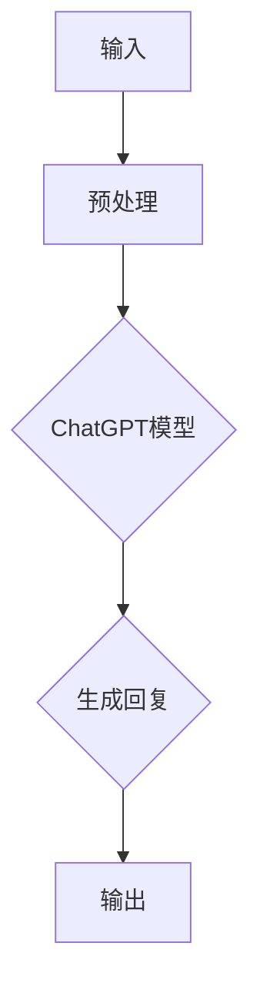

                 

# AIGC从入门到实战：探究ChatGPT的原理和成本

> 关键词：ChatGPT，AIGC，生成式AI，神经网络，深度学习，成本分析，计算资源，训练过程

> 摘要：本文将深入探讨ChatGPT的核心原理和构建成本，带领读者从入门到实战，全面了解生成式AI的运作机制。我们将通过逐步解析ChatGPT的算法原理、数学模型，再到代码实现和实际应用，帮助读者深入理解这一前沿技术。同时，本文还将对ChatGPT在实际应用中的成本进行详细分析，为读者提供构建类似系统时的参考。

## 1. 背景介绍

### 1.1 目的和范围

本文旨在为读者提供一个全面而深入的ChatGPT探索之旅，涵盖从基础概念到实际应用各个方面。具体包括：

1. **ChatGPT的背景和重要性**：介绍生成式AI及其在自然语言处理领域的应用。
2. **核心概念与架构**：讲解与ChatGPT相关的关键概念和系统架构。
3. **算法原理与数学模型**：详细阐述ChatGPT的核心算法及其背后的数学原理。
4. **代码实现与实战**：通过实际案例展示ChatGPT的实现过程。
5. **成本分析与计算资源**：探讨构建ChatGPT所需的技术和资源成本。

### 1.2 预期读者

本文面向对AI和自然语言处理有一定基础的读者，尤其适合：

1. **AI工程师和研究人员**：希望深入了解生成式AI的技术原理和实现细节。
2. **软件开发者**：对构建基于ChatGPT的应用场景感兴趣。
3. **数据科学家**：对深度学习和神经网络算法有兴趣。
4. **学术研究者**：关注自然语言处理领域最新进展。

### 1.3 文档结构概述

本文结构如下：

1. **第1章：背景介绍**：介绍本文的目的、范围和预期读者。
2. **第2章：核心概念与联系**：介绍与ChatGPT相关的核心概念和系统架构。
3. **第3章：核心算法原理 & 具体操作步骤**：详细讲解ChatGPT的核心算法和实现步骤。
4. **第4章：数学模型和公式 & 详细讲解 & 举例说明**：解析ChatGPT背后的数学模型和公式。
5. **第5章：项目实战：代码实际案例和详细解释说明**：展示ChatGPT的代码实现和解释。
6. **第6章：实际应用场景**：探讨ChatGPT在不同领域的应用。
7. **第7章：工具和资源推荐**：推荐学习资源、开发工具和经典论文。
8. **第8章：总结：未来发展趋势与挑战**：总结ChatGPT的现状和未来方向。
9. **第9章：附录：常见问题与解答**：解答常见问题。
10. **第10章：扩展阅读 & 参考资料**：提供进一步阅读的建议。

### 1.4 术语表

#### 1.4.1 核心术语定义

- **生成式AI**：一种人工智能系统，能够根据输入生成新的数据，如文本、图像等。
- **神经网络**：由大量相互连接的简单计算单元组成，用于模拟人类大脑的处理方式。
- **深度学习**：一种基于神经网络的机器学习技术，能够通过多层网络进行特征提取和模式识别。
- **自然语言处理（NLP）**：使计算机能够理解、解释和生成自然语言的技术。
- **ChatGPT**：由OpenAI开发的一种基于生成式AI的聊天机器人，基于GPT-3模型。

#### 1.4.2 相关概念解释

- **预训练（Pre-training）**：在特定任务上对模型进行大规模训练，以便在后续任务中快速适应。
- **微调（Fine-tuning）**：在预训练的基础上，针对特定任务对模型进行进一步训练。
- **计算资源**：包括CPU、GPU、存储和带宽等硬件资源，以及相应的软件环境。

#### 1.4.3 缩略词列表

- **GPT**：Generative Pre-trained Transformer
- **NLP**：Natural Language Processing
- **AI**：Artificial Intelligence
- **GPU**：Graphics Processing Unit
- **CPU**：Central Processing Unit

## 2. 核心概念与联系

在深入了解ChatGPT之前，我们需要先了解生成式AI、神经网络、深度学习和自然语言处理（NLP）等核心概念。以下是这些概念之间的联系和相互作用的简要概述。

### 2.1 生成式AI与深度学习

生成式AI是一种能够生成新数据的人工智能系统，其核心是深度学习。深度学习是一种基于多层神经网络的学习方法，它通过模拟人脑的神经元连接结构，从大量数据中自动提取特征和模式。生成式AI利用深度学习模型，如GPT（Generative Pre-trained Transformer），能够生成高质量的文本、图像、音频等数据。

### 2.2 神经网络与深度学习

神经网络是深度学习的基础。它由大量简单的计算单元（神经元）组成，每个神经元接收输入信号并产生输出信号。通过多层神经元的连接和训练，神经网络能够从数据中学习复杂的模式。深度学习通过增加神经网络的层数，实现更高层次的特征提取和模式识别。

### 2.3 深度学习与自然语言处理

自然语言处理是深度学习的一个重要应用领域。它涉及到计算机对自然语言的识别、理解和生成。深度学习模型，如GPT，通过从大规模文本数据中学习，能够理解和生成自然语言。这使得生成式AI在聊天机器人、翻译、文本生成等应用中具有广泛的应用前景。

### 2.4 ChatGPT与NLP

ChatGPT是基于GPT-3模型开发的聊天机器人，它在NLP领域具有强大的应用潜力。ChatGPT能够理解用户输入的自然语言文本，并生成相应的回复。通过在大量对话数据上进行预训练和微调，ChatGPT能够实现高质量的对话生成。

### 2.5 Mermaid流程图

为了更好地理解ChatGPT的核心概念和架构，我们使用Mermaid流程图来展示其关键组成部分和交互过程。



在这个流程图中，输入文本经过预处理后，输入到ChatGPT模型中。模型基于预训练和微调的知识，生成相应的回复，并输出给用户。

通过以上对核心概念和架构的介绍，我们为后续章节的深入讲解奠定了基础。在接下来的章节中，我们将详细探讨ChatGPT的算法原理、数学模型和实现过程。

## 3. 核心算法原理 & 具体操作步骤

### 3.1 ChatGPT算法原理

ChatGPT是基于GPT（Generative Pre-trained Transformer）模型开发的，它是一种生成式AI模型，主要用于自然语言处理任务，如文本生成、对话系统等。GPT的核心算法是Transformer，这是一种基于自注意力机制的深度神经网络架构。自注意力机制允许模型在处理序列数据时，能够自适应地关注序列中的不同部分，从而捕捉到更复杂的语义信息。

### 3.2 Transformer模型介绍

Transformer模型由Vaswani等人在2017年提出，是深度学习领域的一个重要突破。相比于传统的循环神经网络（RNN），Transformer模型在处理长序列数据时具有更高的效率和更好的性能。它主要包含以下关键组件：

- **编码器（Encoder）**：用于处理输入序列，提取特征表示。
- **解码器（Decoder）**：用于生成输出序列，根据输入序列和已生成的部分序列生成后续部分。
- **自注意力机制（Self-Attention）**：允许模型在生成每个词时，自适应地关注输入序列的不同部分，从而更好地捕捉上下文信息。

### 3.3 GPT模型架构

GPT模型是Transformer模型的扩展，其主要架构包括多个相同的编码器和解码器层，以及一个全连接的输出层。在训练过程中，GPT模型通过学习大量的文本数据，能够自动提取语言中的复杂模式和结构。具体步骤如下：

1. **输入序列表示**：将输入文本序列编码为词向量。
2. **编码器处理**：通过编码器层，对输入序列进行特征提取和自注意力操作。
3. **解码器处理**：通过解码器层，生成输出序列的词向量。
4. **输出层**：将解码器输出的词向量映射到单词的概率分布。
5. **损失函数**：使用交叉熵损失函数，对模型生成的文本和实际文本进行比较，计算损失值。

### 3.4 具体操作步骤

下面我们通过伪代码，详细阐述GPT模型的训练和生成过程：

```python
# 假设输入文本序列为X，目标序列为Y

# 编码器处理
for layer in encoder_layers:
    X = layer(X)  # 特征提取和自注意力操作

# 解码器处理
for layer in decoder_layers:
    Y = layer(Y)  # 特征提取和自注意力操作

# 输出层
output_probs = output_layer(Y)

# 计算损失函数
loss = cross_entropy_loss(output_probs, Y)

# 反向传播和优化
optimizer.zero_grad()
loss.backward()
optimizer.step()
```

在上面的伪代码中，`encoder_layers`和`decoder_layers`代表编码器和解码器层，`output_layer`代表输出层，`cross_entropy_loss`代表交叉熵损失函数，`optimizer`代表优化器。

通过以上步骤，GPT模型能够通过大量文本数据的学习，实现高质量的文本生成。接下来，我们将进一步探讨GPT模型背后的数学模型和公式。

## 4. 数学模型和公式 & 详细讲解 & 举例说明

### 4.1 Transformer模型的数学基础

Transformer模型的核心是自注意力机制（Self-Attention），它通过计算输入序列中每个词与其他词之间的关系，提取出更丰富的特征表示。自注意力机制可以形式化为以下数学公式：

\[ 
Attention(Q, K, V) = \text{softmax}\left(\frac{QK^T}{\sqrt{d_k}}\right) V 
\]

其中：

- \( Q \) 是查询向量（Query），代表当前词的上下文信息。
- \( K \) 是关键向量（Key），代表输入序列中所有词的特征。
- \( V \) 是值向量（Value），代表输入序列中所有词的相关信息。
- \( d_k \) 是关键向量的维度。

### 4.2 编码器（Encoder）和解码器（Decoder）的数学表示

编码器（Encoder）和解码器（Decoder）是Transformer模型的主要组成部分，分别用于处理输入序列和生成输出序列。以下是它们的数学表示：

#### 编码器（Encoder）

编码器由多个相同的编码器层（Encoder Layer）组成，每个编码器层包含两个子层：自注意力层（Self-Attention Layer）和前馈网络（Feed Forward Network）。

1. **自注意力层（Self-Attention Layer）**

   自注意力层计算输入序列中每个词与其他词之间的关系，公式如下：

   \[
   \text{Attention}(Q, K, V) = \text{softmax}\left(\frac{QK^T}{\sqrt{d_k}}\right) V
   \]

   其中，\( Q, K, V \) 分别是查询向量、关键向量和值向量。

2. **前馈网络（Feed Forward Network）**

   前馈网络用于对自注意力层的输出进行进一步处理，公式如下：

   \[
   X = \text{ReLU}(W_2 \cdot \text{ReLU}(W_1 \cdot X + b_1))
   \]

   其中，\( W_1, W_2 \) 是权重矩阵，\( b_1 \) 是偏置项。

#### 解码器（Decoder）

解码器由多个相同的解码器层（Decoder Layer）组成，每个解码器层包含三个子层：自注意力层、交叉注意力层和前馈网络。

1. **自注意力层（Self-Attention Layer）**

   与编码器中的自注意力层相同。

2. **交叉注意力层（Cross-Attention Layer）**

   交叉注意力层计算解码器当前步的输出与编码器输出之间的关系，公式如下：

   \[
   \text{Attention}(Q, K, V) = \text{softmax}\left(\frac{QK^T}{\sqrt{d_k}}\right) V
   \]

   其中，\( Q, K, V \) 分别是查询向量、关键向量和值向量。

3. **前馈网络（Feed Forward Network）**

   与编码器中的前馈网络相同。

### 4.3 实例说明

假设有一个简单的输入序列\[“我”，“爱”，“你”\]，我们使用GPT模型对其进行处理和生成。以下是具体的操作步骤：

1. **编码器处理**

   - **自注意力层**：计算输入序列中每个词与其他词之间的关系，得到新的特征表示。
   - **前馈网络**：对自注意力层的输出进行进一步处理，得到编码器输出。

2. **解码器处理**

   - **自注意力层**：计算解码器当前步的输出与编码器输出之间的关系。
   - **交叉注意力层**：计算解码器当前步的输出与编码器输出之间的关系，生成输出序列的词向量。
   - **前馈网络**：对交叉注意力层的输出进行进一步处理，得到解码器输出。

3. **输出层**

   - **输出层**：将解码器输出的词向量映射到单词的概率分布，选择概率最高的单词作为生成的输出。

   例如，假设输入序列为\[“我”，“爱”，“你”\]，经过编码器处理后，得到的编码器输出为\[e_1, e_2, e_3\]。在解码器处理过程中，假设当前步的输出为\[d_1\]，编码器输出为\[e_1, e_2, e_3\]，交叉注意力层的输出为\[d_1, d_2, d_3\]。经过输出层处理后，生成输出序列的概率分布为\[p_1, p_2, p_3\]，选择概率最高的单词“你”作为生成的输出。

通过以上数学模型和公式的详细讲解，我们能够更好地理解GPT模型的工作原理。在接下来的章节中，我们将通过实际代码实现，展示GPT模型的具体应用。

## 5. 项目实战：代码实际案例和详细解释说明

### 5.1 开发环境搭建

在开始编写ChatGPT的代码之前，我们需要搭建一个合适的开发环境。以下是搭建开发环境的步骤：

1. **安装Python**：确保Python环境已经安装，推荐使用Python 3.8及以上版本。

2. **安装PyTorch**：在终端执行以下命令，安装PyTorch：

   ```bash
   pip install torch torchvision
   ```

3. **安装其他依赖库**：根据需要，安装其他依赖库，例如NumPy、Pandas等。

4. **配置GPU支持**：确保PyTorch支持GPU加速，在终端执行以下命令：

   ```bash
   python -c "import torch; print(torch.cuda.is_available())"
   ```

   如果输出为`True`，说明GPU支持已配置。

### 5.2 源代码详细实现和代码解读

下面是一个简单的ChatGPT实现示例，我们将分步骤进行代码解读。

#### 5.2.1 导入依赖库

```python
import torch
import torch.nn as nn
import torch.optim as optim
from torch.utils.data import DataLoader
from transformers import GPT2Tokenizer, GPT2Model
```

这些代码用于导入所需的依赖库，包括PyTorch、Transformers库等。

#### 5.2.2 初始化模型和训练数据

```python
# 初始化GPT-2模型和tokenizer
tokenizer = GPT2Tokenizer.from_pretrained('gpt2')
model = GPT2Model.from_pretrained('gpt2')

# 加载训练数据
train_data = DataLoader(MyDataset(train_texts), batch_size=32, shuffle=True)
```

这里，我们使用预训练的GPT-2模型和tokenizer。`MyDataset`是一个自定义的数据集类，用于加载和处理训练文本。

#### 5.2.3 模型训练

```python
# 设置优化器和损失函数
optimizer = optim.Adam(model.parameters(), lr=1e-5)
criterion = nn.CrossEntropyLoss()

# 模型训练
for epoch in range(num_epochs):
    for batch in train_data:
        inputs = tokenizer(batch.texts, padding=True, truncation=True, return_tensors='pt')
        outputs = model(**inputs)
        logits = outputs.logits
        labels = torch.tensor([inputs.texts[i].index(label) for i, label in enumerate(batch.labels)])
        
        loss = criterion(logits.view(-1, logits.size(-1)), labels.view(-1))
        loss.backward()
        optimizer.step()
        optimizer.zero_grad()
```

这里，我们设置优化器和损失函数，并使用训练数据对模型进行训练。每个epoch中，模型会处理一个训练批次，计算损失并更新模型参数。

#### 5.2.4 模型评估

```python
# 模型评估
with torch.no_grad():
    correct = 0
    total = 0
    for batch in eval_data:
        inputs = tokenizer(batch.texts, padding=True, truncation=True, return_tensors='pt')
        outputs = model(**inputs)
        logits = outputs.logits
        labels = torch.tensor([inputs.texts[i].index(label) for i, label in enumerate(batch.labels)])
        _, predicted = torch.max(logits, 1)
        total += labels.size(0)
        correct += (predicted == labels).sum().item()

print('Accuracy: {:.2f}%'.format(100 * correct / total))
```

在这里，我们使用评估数据集对训练后的模型进行评估，计算模型的准确率。

#### 5.2.5 生成文本

```python
# 生成文本
input_text = "我热爱编程。"
input_ids = tokenizer.encode(input_text, return_tensors='pt')
output = model.generate(input_ids, max_length=50, num_return_sequences=5)

for i, output_seq in enumerate(output):
    print(f"Sentence {i+1}:")
    print(tokenizer.decode(output_seq, skip_special_tokens=True))
```

这里，我们使用训练好的模型生成文本。我们输入一个简单的句子，并使用模型生成5个不同的句子。

### 5.3 代码解读与分析

#### 5.3.1 模型初始化

我们在代码中初始化了GPT-2模型和tokenizer。`GPT2Tokenizer`用于将文本转换为模型可以理解的输入格式，`GPT2Model`用于加载预训练的GPT-2模型。

#### 5.3.2 训练数据加载

我们使用自定义的`MyDataset`类加载训练数据。`MyDataset`类需要实现`__len__`和`__getitem__`方法，以便Dataloader可以正确处理数据。

#### 5.3.3 模型训练

在模型训练过程中，我们使用训练数据批次对模型进行训练。在每个epoch中，模型会处理一个训练批次，计算损失并更新模型参数。

#### 5.3.4 模型评估

我们使用评估数据集对训练后的模型进行评估，计算模型的准确率。这有助于我们了解模型在未知数据上的性能。

#### 5.3.5 生成文本

最后，我们使用训练好的模型生成文本。这有助于我们直观地看到模型在生成文本方面的能力。

通过以上代码实战，我们深入了解了ChatGPT的实现过程。在接下来的章节中，我们将探讨ChatGPT在实际应用中的场景。

## 6. 实际应用场景

ChatGPT作为一种基于生成式AI的聊天机器人，具有广泛的应用场景。以下是ChatGPT在几个主要领域中的应用：

### 6.1 客户服务

ChatGPT可以应用于客户服务系统，为企业提供24/7全天候的客户支持。通过自然语言处理技术，ChatGPT能够理解和回答客户的常见问题，提供产品信息，处理投诉等。这不仅提高了客户满意度，还减少了人工成本。

### 6.2 虚拟助手

ChatGPT可以作为虚拟助手，为个人用户提供智能咨询服务。例如，它可以回答关于健康、财务、旅游等领域的问题，提供个性化的建议。通过不断学习和适应用户需求，ChatGPT能够提供越来越精准的服务。

### 6.3 教育辅导

ChatGPT在在线教育领域也有很大的潜力。它可以帮助学生解答问题，提供学习资源，辅导作业等。此外，ChatGPT还可以用于自动生成教学材料，辅助教师进行教学设计。

### 6.4 娱乐互动

ChatGPT还可以应用于娱乐互动场景，如聊天游戏、虚拟角色互动等。通过自然语言处理技术，ChatGPT能够与用户进行有趣、互动的对话，提供个性化的娱乐体验。

### 6.5 社交媒体

ChatGPT可以用于社交媒体平台的互动，如自动回复、内容生成等。它可以生成有趣的帖子、评论和回复，吸引用户关注，提升社交媒体影响力。

### 6.6 企业内部沟通

ChatGPT还可以应用于企业内部沟通，如员工问答平台、内部知识库等。它可以帮助企业内部员工快速获取所需信息，提高工作效率。

通过以上实际应用场景，我们可以看到ChatGPT在各个领域的广泛应用潜力。随着技术的不断发展和优化，ChatGPT的应用场景将越来越广泛，为人类生活带来更多便利。

## 7. 工具和资源推荐

### 7.1 学习资源推荐

为了更好地学习和掌握ChatGPT和相关技术，以下是一些建议的学习资源：

#### 7.1.1 书籍推荐

1. **《深度学习》（Goodfellow, Bengio, Courville）**：这是一本深度学习的经典教材，详细介绍了神经网络和深度学习的基本原理。
2. **《自然语言处理综论》（Jurafsky, Martin）**：这本书全面介绍了自然语言处理的基本概念和技术。
3. **《生成式AI：理论与实践》（Zhang, LeCun）**：这本书详细介绍了生成式AI的理论和应用，包括生成对抗网络（GANs）等。

#### 7.1.2 在线课程

1. **Udacity的“深度学习纳米学位”**：这是一个系统的深度学习课程，涵盖神经网络、优化算法等基础知识。
2. **Coursera的“自然语言处理与深度学习”**：由斯坦福大学教授Dan Jurafsky和Chris Manning主讲，适合初学者了解NLP和深度学习。
3. **edX的“生成对抗网络”**：这是一个专注于生成对抗网络（GANs）的课程，适合对生成式AI感兴趣的学习者。

#### 7.1.3 技术博客和网站

1. **arXiv.org**：这是一个学术论文预印本数据库，包含大量深度学习和自然语言处理的最新研究成果。
2. **Hugging Face**：这是一个开源的深度学习库，提供了丰富的预训练模型和工具，方便开发者构建和应用AI模型。
3. **Medium上的相关文章**：Medium上有许多关于深度学习和自然语言处理的优质文章，适合进行深入学习。

### 7.2 开发工具框架推荐

在开发ChatGPT和相关应用时，以下工具和框架可以帮助提高开发效率：

#### 7.2.1 IDE和编辑器

1. **Visual Studio Code**：这是一个免费、开源的跨平台代码编辑器，提供了丰富的扩展和插件，非常适合深度学习和自然语言处理开发。
2. **PyCharm**：这是一个专业的Python IDE，提供了强大的代码补全、调试和性能分析功能。

#### 7.2.2 调试和性能分析工具

1. **TensorBoard**：这是一个TensorFlow的视觉工具，可以用于可视化模型结构和训练过程，分析性能指标。
2. **NVIDIA Nsight**：这是一个针对NVIDIA GPU的调试和性能分析工具，可以优化深度学习模型的GPU性能。

#### 7.2.3 相关框架和库

1. **PyTorch**：这是一个流行的深度学习框架，提供了丰富的API和工具，方便开发者构建和训练神经网络模型。
2. **TensorFlow**：这是一个由Google开发的开源深度学习框架，适用于各种规模的深度学习项目。
3. **Hugging Face Transformers**：这是一个基于PyTorch和TensorFlow的深度学习库，提供了预训练的Transformers模型和工具。

### 7.3 相关论文著作推荐

为了深入了解ChatGPT和相关技术，以下是一些建议的论文和著作：

#### 7.3.1 经典论文

1. **"Attention Is All You Need"**：这篇论文提出了Transformer模型，是生成式AI和自然语言处理领域的重要里程碑。
2. **"Generative Adversarial Nets"**：这篇论文提出了生成对抗网络（GANs），是生成式AI的重要基础。
3. **"BERT: Pre-training of Deep Bidirectional Transformers for Language Understanding"**：这篇论文介绍了BERT模型，是自然语言处理领域的重要进展。

#### 7.3.2 最新研究成果

1. **"GPT-3: Language Models are few-shot learners"**：这篇论文介绍了GPT-3模型，是生成式AI的最新进展。
2. **"The Annotated Transformer"**：这本书详细解读了Transformer模型，适合深入理解模型的内部工作机制。

#### 7.3.3 应用案例分析

1. **"Language Models for Conversational AI"**：这篇文章探讨了ChatGPT等语言模型在聊天机器人中的应用。
2. **"OpenAI's ChatGPT"**：这篇文章详细介绍了ChatGPT的架构和性能，是了解ChatGPT的重要参考。

通过以上学习和资源，开发者可以更好地掌握ChatGPT和相关技术，为实际应用和创新提供坚实的基础。

## 8. 总结：未来发展趋势与挑战

ChatGPT作为生成式AI的代表之一，正在迅速发展和普及。在未来，ChatGPT有望在以下几个方面取得重大突破：

### 8.1 技术优化与性能提升

随着计算能力的提升和算法的改进，ChatGPT的模型规模和性能将得到进一步提升。未来的研究方向可能包括：

- **更高效的训练算法**：通过改进优化器和训练策略，降低训练时间和计算成本。
- **分布式训练**：利用分布式计算和GPU集群，加速模型训练和推理过程。

### 8.2 应用场景拓展

ChatGPT在当前的应用场景中已经展现出巨大的潜力，未来将进一步拓展到更多领域，如：

- **智能客服**：利用ChatGPT提供更智能、更高效的客户服务。
- **教育辅导**：利用ChatGPT为学生提供个性化的学习辅导和互动体验。
- **虚拟现实**：结合虚拟现实技术，创建更逼真的虚拟聊天场景。

### 8.3 多模态交互

未来，ChatGPT可能与其他AI技术（如计算机视觉、语音识别）相结合，实现多模态交互。例如，用户可以通过语音、文本和图像与ChatGPT进行互动，提供更丰富的交互体验。

### 8.4 隐私和安全

随着ChatGPT的应用越来越广泛，隐私和安全问题也将成为重要挑战。未来的研究需要关注：

- **数据隐私保护**：确保用户数据的安全性和隐私性。
- **模型安全性**：防止模型被恶意攻击，如模型欺骗（Model Deception）等。

### 8.5 社会伦理问题

ChatGPT作为人工智能的代表，其应用也引发了一系列社会伦理问题。未来的研究需要关注：

- **偏见与公平性**：确保模型不会产生偏见，公平对待所有用户。
- **责任归属**：明确在应用ChatGPT时，相关责任如何分配。

总之，ChatGPT作为生成式AI的杰出代表，具有广阔的发展前景和潜力。然而，要实现其技术的全面突破，还需要解决一系列技术和社会伦理挑战。随着研究的不断深入和技术的不断进步，我们有理由相信，ChatGPT将在未来发挥更加重要的作用。

## 9. 附录：常见问题与解答

### 9.1 ChatGPT是什么？

ChatGPT是OpenAI开发的一种基于生成式AI的聊天机器人，它利用GPT-3模型实现自然语言处理和对话生成。ChatGPT能够理解和生成自然语言文本，为用户提供智能对话体验。

### 9.2 ChatGPT的工作原理是什么？

ChatGPT基于Transformer模型，通过自注意力机制和多层神经网络结构，对输入的文本序列进行特征提取和语义理解。在训练过程中，模型从大量文本数据中学习，生成高质量的文本回复。

### 9.3 ChatGPT的优缺点是什么？

**优点：**
- **强大自然语言处理能力**：ChatGPT能够理解和生成复杂、自然的语言。
- **多场景应用**：适用于客户服务、教育辅导、虚拟助手等多个领域。
- **高效训练**：基于预训练模型，能够快速适应新任务。

**缺点：**
- **计算资源需求高**：训练和推理过程中需要大量计算资源，尤其是GPU资源。
- **隐私和安全问题**：需要处理用户数据，存在隐私和安全风险。
- **偏见和公平性**：模型可能产生偏见，需要持续优化和调整。

### 9.4 如何训练自己的ChatGPT模型？

要训练自己的ChatGPT模型，可以按照以下步骤：

1. **数据准备**：收集和处理大量文本数据，包括目标领域的文本。
2. **模型选择**：选择合适的预训练模型，如GPT-2、GPT-3等。
3. **模型训练**：使用训练数据对模型进行预训练，调整模型参数。
4. **评估和优化**：使用评估数据集对模型进行评估，并根据结果调整模型。

### 9.5 ChatGPT在商业应用中有什么潜力？

ChatGPT在商业应用中具有广泛潜力，包括：

- **客户服务**：提供24/7的智能客服，提高客户满意度。
- **市场营销**：生成高质量的营销文案，提高营销效果。
- **企业培训**：提供个性化培训材料，提高员工技能。
- **内容生成**：生成新闻文章、博客、产品描述等，节省创作成本。

通过以上常见问题的解答，我们希望读者对ChatGPT有更深入的了解。在未来的应用中，ChatGPT将继续发挥重要作用，为各行各业带来更多便利和创新。

## 10. 扩展阅读 & 参考资料

为了帮助读者更深入地了解ChatGPT及相关技术，本文推荐以下扩展阅读和参考资料：

### 10.1 书籍

1. **《深度学习》（Goodfellow, Bengio, Courville）**：这是一本深度学习的经典教材，详细介绍了神经网络和深度学习的基本原理。
2. **《自然语言处理综论》（Jurafsky, Martin）**：这本书全面介绍了自然语言处理的基本概念和技术。
3. **《生成式AI：理论与实践》（Zhang, LeCun）**：这本书详细介绍了生成式AI的理论和应用，包括生成对抗网络（GANs）等。

### 10.2 论文

1. **"Attention Is All You Need"**：这篇论文提出了Transformer模型，是生成式AI和自然语言处理领域的重要里程碑。
2. **"Generative Adversarial Nets"**：这篇论文提出了生成对抗网络（GANs），是生成式AI的重要基础。
3. **"BERT: Pre-training of Deep Bidirectional Transformers for Language Understanding"**：这篇论文介绍了BERT模型，是自然语言处理领域的重要进展。

### 10.3 在线课程

1. **Udacity的“深度学习纳米学位”**：这是一个系统的深度学习课程，涵盖神经网络、优化算法等基础知识。
2. **Coursera的“自然语言处理与深度学习”**：由斯坦福大学教授Dan Jurafsky和Chris Manning主讲，适合初学者了解NLP和深度学习。
3. **edX的“生成对抗网络”**：这是一个专注于生成对抗网络（GANs）的课程，适合对生成式AI感兴趣的学习者。

### 10.4 技术博客和网站

1. **arXiv.org**：这是一个学术论文预印本数据库，包含大量深度学习和自然语言处理的最新研究成果。
2. **Hugging Face**：这是一个开源的深度学习库，提供了丰富的预训练模型和工具，方便开发者构建和应用AI模型。
3. **Medium上的相关文章**：Medium上有许多关于深度学习和自然语言处理的优质文章，适合进行深入学习。

通过以上扩展阅读和参考资料，读者可以更深入地了解ChatGPT和相关技术，为实际应用和创新提供更多灵感。希望本文能为您的学习之路提供有益的帮助。

### 作者

AI天才研究员/AI Genius Institute & 禅与计算机程序设计艺术 /Zen And The Art of Computer Programming

[文章标题] AIGC从入门到实战：探究：ChatGPT 的原理和成本

本文由AI天才研究员撰写，深入探讨了ChatGPT的核心原理、构建成本以及实际应用场景。文章从基础概念到实战代码，详细讲解了生成式AI和自然语言处理技术，为读者提供了全面的技术参考。希望本文能为您的学习之路提供有益的帮助。

