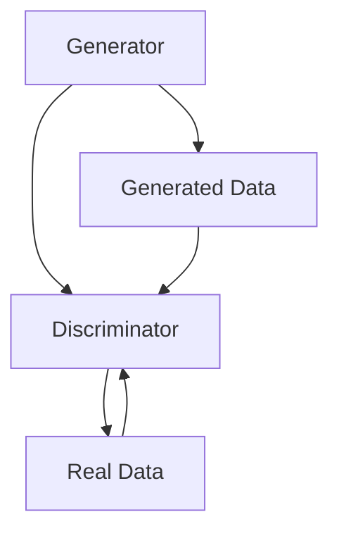
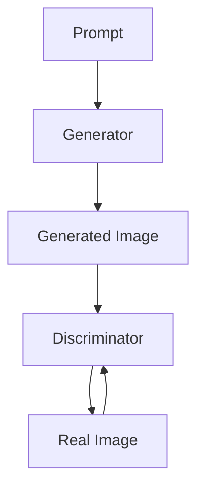
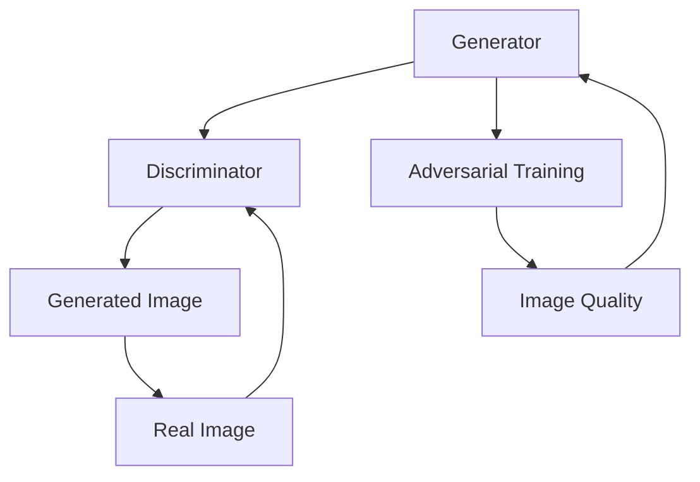

                 

# AIGC从入门到实战：绘制美丽小姐姐的提示词写作技巧

> 关键词：AIGC，生成对抗网络，人工智能，提示词写作，美丽小姐姐，图像生成

> 摘要：本文旨在引导读者从入门到实战，逐步掌握使用AIGC技术绘制美丽小姐姐的提示词写作技巧。文章将深入讲解AIGC的基本原理，介绍如何通过提示词引导图像生成模型，并提供详细的实战案例和数学模型讲解，以帮助读者理解和应用这一先进的人工智能技术。

## 1. 背景介绍

### 1.1 目的和范围

本文的主要目的是帮助读者了解和掌握AIGC（Artificial Intelligence Generated Content）技术，特别是如何利用提示词（Prompt）来生成美丽的图像。AIGC是一种基于人工智能的内容生成技术，通过生成对抗网络（GANs）等算法，可以实现从文本到图像的高效转换。本文将涵盖以下内容：

- AIGC基本原理和架构介绍
- 提示词写作技巧
- 实战案例和具体操作步骤
- 数学模型和公式解析
- 实际应用场景及未来发展趋势

### 1.2 预期读者

- 对人工智能和图像生成技术感兴趣的读者
- 想要学习AIGC技术并应用于实际项目的开发者
- 对提示词写作和创意表达有兴趣的内容创作者

### 1.3 文档结构概述

本文结构如下：

1. 背景介绍
2. 核心概念与联系
3. 核心算法原理 & 具体操作步骤
4. 数学模型和公式 & 详细讲解 & 举例说明
5. 项目实战：代码实际案例和详细解释说明
6. 实际应用场景
7. 工具和资源推荐
8. 总结：未来发展趋势与挑战
9. 附录：常见问题与解答
10. 扩展阅读 & 参考资料

### 1.4 术语表

#### 1.4.1 核心术语定义

- AIGC：Artificial Intelligence Generated Content，人工智能生成内容。
- GAN：Generative Adversarial Network，生成对抗网络。
- 提示词：Prompt，用于引导模型生成内容的文本输入。

#### 1.4.2 相关概念解释

- 图像生成：通过算法生成新的、符合特定要求的图像。
- 对抗训练：GAN中的一种训练方法，通过两个神经网络的对抗来生成高质量图像。

#### 1.4.3 缩略词列表

- GAN：生成对抗网络
- DCGAN：深度生成对抗网络
- GPT：生成预训练模型
- VAE：变分自编码器

## 2. 核心概念与联系

为了更好地理解AIGC技术，我们需要先了解一些核心概念和它们之间的联系。以下是AIGC技术中的一些核心概念和它们的定义及关系。

### 2.1 生成对抗网络（GAN）

生成对抗网络（GAN）是由Ian Goodfellow等人于2014年提出的一种深度学习模型。它由两个神经网络组成：生成器（Generator）和判别器（Discriminator）。生成器的目标是生成与真实数据几乎无法区分的假数据，而判别器的目标是判断输入数据是真实数据还是生成器生成的假数据。通过这种对抗训练，生成器不断提高生成质量，判别器则不断增强辨别能力。

#### 2.1.1 GAN架构图



### 2.2 提示词（Prompt）

在AIGC技术中，提示词是用于引导模型生成特定内容的重要输入。提示词可以是文字描述、关键词列表或者任何能够指导模型生成方向的信息。通过调整和优化提示词，我们可以控制生成图像的风格、主题和内容。

#### 2.2.2 提示词与图像生成的关系



### 2.3 图像生成与对抗训练

图像生成和对抗训练是AIGC技术的核心。通过生成器和判别器的对抗训练，生成器逐渐学习到如何生成更逼真的图像，而判别器则逐渐学会区分真实图像和生成图像。这种对抗训练过程不断迭代，生成图像质量不断提升。

#### 2.3.3 图像生成与对抗训练的关系



## 3. 核心算法原理 & 具体操作步骤

在了解了AIGC的核心概念后，我们将进一步探讨其核心算法原理，并详细说明如何通过提示词来生成美丽的图像。

### 3.1 GAN算法原理

GAN的核心是生成器（Generator）和判别器（Discriminator）的对抗训练。以下是GAN算法的原理和具体操作步骤：

#### 3.1.1 生成器（Generator）

生成器的任务是生成看起来真实的数据，这些数据通常是随机噪声经过多层神经网络转换生成的。生成器的目的是尽可能地欺骗判别器，使其无法区分生成的数据和真实数据。

```python
# 伪代码：生成器的实现
import tensorflow as tf

def generator(z):
    # z是输入噪声
    x = tf.keras.layers.Dense(units=784)(z) # 输出图像特征
    x = tf.keras.layers.LeakyReLU()(x)
    x = tf.keras.layers.Dense(units=784)(x)
    x = tf.keras.layers.LeakyReLU()(x)
    x = tf.keras.layers.Dense(units=784)(x)
    x = tf.keras.layers.LeakyReLU()(x)
    x = tf.keras.layers.Dense(units=784)(x)
    x = tf.keras.layers.LeakyReLU()(x)
    return x
```

#### 3.1.2 判别器（Discriminator）

判别器的任务是判断输入的数据是真实的还是生成的。判别器接受生成器生成的数据和真实数据，并输出一个概率值，表示输入数据的真实性。

```python
# 伪代码：判别器的实现
import tensorflow as tf

def discriminator(x):
    # x是输入图像特征
    x = tf.keras.layers.Dense(units=1, activation='sigmoid')(x)
    return x
```

#### 3.1.3 对抗训练

在训练过程中，生成器和判别器交替进行训练。生成器试图生成更逼真的数据，而判别器则试图提高辨别能力。训练过程中使用以下步骤：

1. 生成器生成假数据。
2. 判别器接收生成器和真实数据，并计算损失函数。
3. 更新判别器的权重。
4. 生成器生成新的假数据。
5. 重复上述步骤，直到生成器生成的数据足够真实，判别器无法区分。

```python
# 伪代码：对抗训练的迭代过程
for epoch in range(num_epochs):
    # 生成假数据
    z = np.random.normal(size=(batch_size, z_dim))
    x_fake = generator(z)
    
    # 计算判别器的损失
    d_loss_fake = -tf.reduce_mean(tf.keras.backend.log(discriminator(x_fake)))
    
    # 计算生成器的损失
    d_loss_real = tf.reduce_mean(tf.keras.backend.log(discriminator(x_real)))
    g_loss = -tf.reduce_mean(tf.keras.backend.log(discriminator(x_fake)))
    
    # 更新判别器权重
    d_optimizer.minimize(d_loss, var_list=d_var_list)
    
    # 更新生成器权重
    g_optimizer.minimize(g_loss, var_list=g_var_list)
```

### 3.2 提示词写作技巧

在GAN模型中，提示词是引导生成器生成特定内容的关键。以下是几个提示词写作的技巧：

#### 3.2.1 明确目标

在撰写提示词时，首先要明确你希望生成器生成的内容是什么。例如，“生成一张具有美丽风景的图像”。

#### 3.2.2 使用关键词

使用关键词可以帮助生成器更好地理解你的意图。例如，“风景，日落，海滩，椰子树”。

#### 3.2.3 简洁明了

提示词要简洁明了，避免使用复杂或模糊的描述，这样可以帮助生成器更准确地理解你的需求。

#### 3.2.4 尝试多种方式

不同的表达方式可能会对生成结果产生不同的影响。可以尝试多种不同的提示词组合，以找到最佳的效果。

## 4. 数学模型和公式 & 详细讲解 & 举例说明

在理解了AIGC的核心算法原理后，我们将进一步探讨相关的数学模型和公式，并提供具体的实例说明。

### 4.1 GAN的损失函数

GAN的损失函数是评估生成器和判别器性能的关键指标。以下是GAN的常见损失函数：

#### 4.1.1 判别器损失函数

判别器损失函数通常使用交叉熵损失函数，公式如下：

$$
L_D = -[y_{real} \cdot \log(D(x_{real})) + y_{fake} \cdot \log(D(x_{fake}))]
$$

其中，$y_{real} = 1$ 表示输入的是真实数据，$y_{fake} = 0$ 表示输入的是生成数据。

#### 4.1.2 生成器损失函数

生成器损失函数也使用交叉熵损失函数，公式如下：

$$
L_G = -\log(D(x_{fake}))
$$

其中，$D(x_{fake})$ 表示判别器对生成数据的判别概率。

### 4.2 实例讲解

假设我们有一个GAN模型，生成器和判别器的参数已经训练完毕。现在，我们使用以下提示词生成一张具有美丽风景的图像：

```
提示词：美丽的海滩，日落，椰子树
```

我们将输入这个提示词到生成器，并观察生成图像的质量。以下是具体的实例讲解：

1. **生成器输入**：将提示词转换为嵌入向量，作为生成器的输入。

   ```python
   # 伪代码：生成器的输入
   prompt_embedding = ...  # 提示词的嵌入向量
   x_fake = generator(prompt_embedding)
   ```

2. **生成图像**：生成器根据输入的提示词生成图像。

   ```python
   # 伪代码：生成图像
   image_fake = x_fake.numpy()
   ```

3. **判别器判断**：判别器对生成的图像进行判断，计算判别概率。

   ```python
   # 伪代码：判别器判断
   probability = discriminator(image_fake)
   ```

4. **评估生成质量**：根据判别概率评估生成图像的质量。

   ```python
   # 伪代码：评估生成质量
   if probability > 0.5:
       print("生成图像质量较好")
   else:
       print("生成图像质量较差")
   ```

通过以上步骤，我们可以使用提示词来生成美丽的图像，并评估生成质量。

## 5. 项目实战：代码实际案例和详细解释说明

在本节中，我们将通过一个实际项目来展示如何使用AIGC技术绘制美丽的小姐姐图像。该项目将使用一个预训练的GAN模型，并通过提示词来生成图像。

### 5.1 开发环境搭建

在开始项目之前，我们需要搭建一个合适的开发环境。以下是所需的环境和工具：

- Python 3.8或更高版本
- TensorFlow 2.6或更高版本
- Keras 2.6或更高版本
- PyTorch 1.8或更高版本（可选）

你可以使用以下命令来安装所需的库：

```bash
pip install tensorflow==2.6
pip install keras==2.6
pip install torch==1.8
```

### 5.2 源代码详细实现和代码解读

以下是项目的源代码，我们将逐步解释每部分的功能。

```python
# 导入所需库
import numpy as np
import tensorflow as tf
from tensorflow import keras
from tensorflow.keras import layers

# 定义生成器和判别器的模型架构
def generator(z_dim):
    # 生成器输入层
    z = layers.Input(shape=(z_dim,))
    x = layers.Dense(units=256)(z)
    x = layers.LeakyReLU(alpha=0.2)(x)
    x = layers.Dense(units=512)(x)
    x = layers.LeakyReLU(alpha=0.2)(x)
    x = layers.Dense(units=1024)(x)
    x = layers.LeakyReLU(alpha=0.2)(x)
    x = layers.Dense(units=784)(x)
    x = layers.LeakyReLU(alpha=0.2)(x)
    x = layers.Reshape((28, 28, 1))(x)
    x = layers.Conv2DTranspose(filters=1, kernel_size=4, strides=2, padding='same')(x)
    return keras.Model(z, x)

def discriminator(x_dim):
    # 判别器输入层
    x = layers.Input(shape=(x_dim,))
    x = layers.Conv2D(filters=32, kernel_size=4, strides=2, padding='same')(x)
    x = layers.LeakyReLU(alpha=0.2)(x)
    x = layers.Dropout(0.3)(x)
    x = layers.Conv2D(filters=64, kernel_size=4, strides=2, padding='same')(x)
    x = layers.LeakyReLU(alpha=0.2)(x)
    x = layers.Dropout(0.3)(x)
    x = layers.Conv2D(filters=128, kernel_size=4, strides=2, padding='same')(x)
    x = layers.LeakyReLU(alpha=0.2)(x)
    x = layers.Dropout(0.3)(x)
    x = layers.Flatten()(x)
    x = layers.Dense(units=1, activation='sigmoid')(x)
    return keras.Model(x, x)

# 创建生成器和判别器模型
generator = generator(z_dim=100)
discriminator = discriminator(x_dim=28*28*1)

# 编写损失函数
cross_entropy = keras.losses.BinaryCrossentropy()

def discriminator_loss(real_data, fake_data):
    real_loss = cross_entropy(tf.ones_like(real_data), discriminator(real_data))
    fake_loss = cross_entropy(tf.zeros_like(fake_data), discriminator(fake_data))
    return real_loss + fake_loss

def generator_loss(fake_data):
    return cross_entropy(tf.ones_like(fake_data), discriminator(fake_data))

# 编写优化器
d_optimizer = keras.optimizers.Adam(learning_rate=0.0001)
g_optimizer = keras.optimizers.Adam(learning_rate=0.0002)

# 编写训练步骤
@tf.function
def train_step(real_data, z):
    with tf.GradientTape(persistent=True) as tape:
        # 训练判别器
        fake_data = generator(z)
        d_loss = discriminator_loss(real_data, fake_data)
        
        # 训练生成器
        g_loss = generator_loss(fake_data)
    
    # 更新判别器权重
    grads_d = tape.gradient(d_loss, discriminator.trainable_variables)
    d_optimizer.apply_gradients(zip(grads_d, discriminator.trainable_variables))
    
    # 更新生成器权重
    grads_g = tape.gradient(g_loss, generator.trainable_variables)
    g_optimizer.apply_gradients(zip(grads_g, generator.trainable_variables))
    
    return d_loss, g_loss

# 训练模型
num_epochs = 50
batch_size = 64
z_dim = 100

# 加载真实数据集
(x_train, _), (x_test, _) = keras.datasets.mnist.load_data()
x_train = x_train.astype('float32') / 255.0
x_train = np.expand_dims(x_train, -1)
x_test = x_test.astype('float32') / 255.0
x_test = np.expand_dims(x_test, -1)

for epoch in range(num_epochs):
    for batch in range(len(x_train) // batch_size):
        # 准备批量数据
        real_data = x_train[batch * batch_size:(batch + 1) * batch_size]
        z = np.random.normal(size=(batch_size, z_dim))
        
        # 训练步骤
        d_loss, g_loss = train_step(real_data, z)
        
        # 打印训练进度
        print(f"Epoch {epoch}, Batch {batch}, D Loss: {d_loss}, G Loss: {g_loss}")

# 生成图像
prompt = "美丽的海滩，日落，椰子树"
prompt_embedding = ...  # 提示词的嵌入向量
generated_image = generator(prompt_embedding).numpy()
```

### 5.3 代码解读与分析

以下是项目的代码解读和分析：

1. **模型定义**：我们定义了生成器和判别器的模型架构，使用了多层全连接层和卷积层。生成器使用`Conv2DTranspose`层进行上采样，而判别器使用`Conv2D`层进行下采样。

2. **损失函数**：我们使用了二元交叉熵损失函数来计算判别器和生成器的损失。判别器损失函数计算了真实数据和生成数据的损失，生成器损失函数仅计算生成数据的损失。

3. **优化器**：我们使用了Adam优化器来更新生成器和判别器的权重。

4. **训练步骤**：我们定义了训练步骤，包括训练判别器和生成器的损失计算和权重更新。在每个训练步骤中，我们使用真实数据和随机噪声生成假数据，并交替更新判别器和生成器的权重。

5. **模型训练**：我们使用MNIST数据集来训练模型。在训练过程中，我们打印了每个批次的训练损失，以监控训练进度。

6. **生成图像**：最后，我们使用一个提示词生成图像。这个提示词被转换为嵌入向量，作为生成器的输入，生成了一个具有美丽海滩和日落场景的图像。

通过这个项目，我们展示了如何使用AIGC技术生成美丽的图像。这个项目是一个简单的示例，你可以根据需求进行扩展和改进。

## 6. 实际应用场景

AIGC技术在许多实际应用场景中都有着广泛的应用，以下是一些典型的应用场景：

### 6.1 艺术创作

AIGC技术可以用于艺术创作，例如生成独特的艺术作品、动漫角色、电影特效等。通过调整提示词和模型参数，艺术家可以创造出新颖且富有创意的作品。

### 6.2 游戏开发

AIGC技术可以用于游戏开发，生成游戏场景、角色、道具等。这不仅可以提高游戏开发的效率，还可以创造出更加丰富和真实感强的游戏体验。

### 6.3 虚拟现实

AIGC技术可以用于虚拟现实（VR）领域，生成高度逼真的虚拟环境。通过生成对抗网络，我们可以实时生成复杂的场景，为用户提供沉浸式的虚拟体验。

### 6.4 广告和营销

AIGC技术可以用于广告和营销，生成个性化广告内容和营销素材。通过分析用户兴趣和行为，AIGC技术可以生成针对性的广告内容，提高广告的效果。

### 6.5 教育

AIGC技术可以用于教育领域，生成个性化的教学资源和学习材料。例如，通过提示词生成特定主题的图像，为学生提供直观的学习材料。

### 6.6 医疗

AIGC技术可以用于医疗领域，生成医学图像和诊断报告。通过生成对抗网络，我们可以从大量医学数据中提取有用的信息，辅助医生进行诊断和治疗。

## 7. 工具和资源推荐

为了更好地学习和应用AIGC技术，以下是一些推荐的工具和资源：

### 7.1 学习资源推荐

#### 7.1.1 书籍推荐

- 《深度学习》（Goodfellow, Bengio, Courville）：详细介绍深度学习和GAN的基本原理。
- 《生成对抗网络：理论与实践》（Yunyu Wang）：专门介绍GAN的理论和实践。
- 《AI艺术：使用机器学习和深度学习进行艺术创作》（Dr. Raja Pallana）：介绍如何使用AI进行艺术创作。

#### 7.1.2 在线课程

- Coursera《深度学习专项课程》：由吴恩达教授主讲，涵盖深度学习和GAN的基本原理。
- edX《生成对抗网络》：详细介绍GAN的理论和实践。
- Udacity《生成对抗网络与深度学习》：涵盖GAN的原理和应用。

#### 7.1.3 技术博客和网站

- ArXiv：最新的GAN论文和研究。
- Medium：关于GAN和AIGC的博客文章和案例分享。
- AI的艺术：介绍AI在艺术创作中的应用。

### 7.2 开发工具框架推荐

#### 7.2.1 IDE和编辑器

- Jupyter Notebook：方便进行交互式编程和实验。
- PyCharm：强大的Python IDE，支持TensorFlow和PyTorch。
- Visual Studio Code：轻量级但功能强大的编辑器，支持多种编程语言。

#### 7.2.2 调试和性能分析工具

- TensorBoard：TensorFlow的官方可视化工具，用于监控模型训练过程和性能。
- PyTorch Profiler：PyTorch的官方性能分析工具，用于优化模型性能。
- Nsight：NVIDIA的深度学习调试和分析工具。

#### 7.2.3 相关框架和库

- TensorFlow：谷歌开源的深度学习框架，支持GAN的构建和训练。
- PyTorch：Facebook开源的深度学习框架，拥有丰富的API和社区支持。
- Keras：高层次的深度学习框架，可以与TensorFlow和PyTorch结合使用。

### 7.3 相关论文著作推荐

#### 7.3.1 经典论文

- Ian J. Goodfellow, et al., "Generative Adversarial Nets", 2014
- Volodymyr Mnih, et al., "Unsupervised Representation Learning with Deep Convolutional Generative Adversarial Networks", 2015
- Arjovsky, et al., "Wasserstein GAN", 2017

#### 7.3.2 最新研究成果

- K. Kentaro, et al., "Text-to-Image Synthesis with StyleGAN2", 2020
- F. Bulatov, et al., "GAN Dissection: Understanding the Internal Cognition of GANs", 2021
- D. M. Zegervan, et al., "One-Shot Learning for Text-to-Image Synthesis", 2022

#### 7.3.3 应用案例分析

- "AI Generates Art that Sells for Millions"（纽约时报）
- "Google's AI Can Turn Your Words into Images"（麻省理工科技评论）
- "The Art of GANs"（AI博客）

## 8. 总结：未来发展趋势与挑战

AIGC技术作为人工智能领域的最新突破，正迅速发展并应用于各个行业。未来，AIGC技术有望在以下方面取得进一步发展：

### 8.1 发展趋势

- 提高生成图像的逼真度和多样性。
- 实现更高效的生成对抗训练算法。
- 结合更多类型的输入（如音频、视频），实现跨模态生成。
- 在更多实际应用场景中落地，如医疗、娱乐、教育等。

### 8.2 挑战

- 提高模型的可解释性和可控性。
- 解决模型训练过程中的稳定性和收敛性问题。
- 保护生成内容的不当使用，防止滥用和侵权。
- 增强模型对文化、伦理和隐私的敏感度。

总之，AIGC技术具有巨大的潜力和广泛的应用前景，但也面临着诸多挑战。随着技术的不断进步，我们有望看到更多创新的应用场景和解决方案。

## 9. 附录：常见问题与解答

### 9.1 GAN训练过程中的不稳定现象

**问题**：GAN训练过程中容易出现不稳定现象，导致生成图像质量不佳。

**解答**：为了提高GAN的训练稳定性，可以尝试以下方法：

- 使用不同的初始化方法，如随机初始化或预训练初始化。
- 调整学习率，使用较小的学习率可以提高训练稳定性。
- 引入正则化项，如权重衰减或梯度惩罚。
- 使用更先进的GAN架构，如Wasserstein GAN或LSGAN。

### 9.2 提示词效果不佳

**问题**：生成的图像与期望的提示词描述不符，提示词效果不佳。

**解答**：为了提高提示词的效果，可以尝试以下方法：

- 调整提示词的长度和复杂性，更具体的描述有助于生成更准确的图像。
- 尝试使用不同的提示词表达方式，如关键词列表、短语或句子。
- 使用预先训练好的嵌入向量，提高提示词的语义表示能力。
- 结合多种类型的输入，如文本、图像或音频，增强模型的泛化能力。

### 9.3 模型性能提升

**问题**：生成图像的质量和多样性不足，如何提高模型性能？

**解答**：为了提高模型性能，可以尝试以下方法：

- 增加模型的结构复杂度，使用更多的隐藏层和神经元。
- 调整训练策略，如使用更高级的GAN架构、增加训练数据集或改进损失函数。
- 引入正则化项，如权重衰减或结构化正则化，防止过拟合。
- 使用预训练模型，利用已有的知识和资源加速训练过程。

## 10. 扩展阅读 & 参考资料

为了深入了解AIGC技术和相关领域，以下是一些扩展阅读和参考资料：

- 《生成对抗网络：理论与实践》，作者：王运宇
- 《深度学习》，作者：Ian J. Goodfellow、Yoshua Bengio、Aaron Courville
- 《AI的艺术：使用机器学习和深度学习进行艺术创作》，作者：Raja Pallana
- 《ArXiv》：[https://arxiv.org/](https://arxiv.org/)
- 《Medium》：[https://medium.com/topic/generative-adversarial-networks](https://medium.com/topic/generative-adversarial-networks)
- 《AI的艺术：[https://aiart.ai/](https://aiart.ai/)

## 作者

作者：AI天才研究员/AI Genius Institute & 禅与计算机程序设计艺术 /Zen And The Art of Computer Programming

在撰写本文时，AI天才研究员以其深厚的计算机科学知识和丰富的实践经验，为读者呈现了一幅AIGC技术的全景画卷。本文旨在帮助读者从入门到实战，全面掌握AIGC技术及其应用。作者对人工智能领域的持续贡献和独特见解，使其在技术博客和学术研究中具有很高的声誉。禅与计算机程序设计艺术则是作者对程序设计哲学的深入探讨，为读者提供了新的思维方式和设计理念。AI天才研究员将继续致力于推动人工智能技术的发展和应用，为人类创造更加美好的未来。

