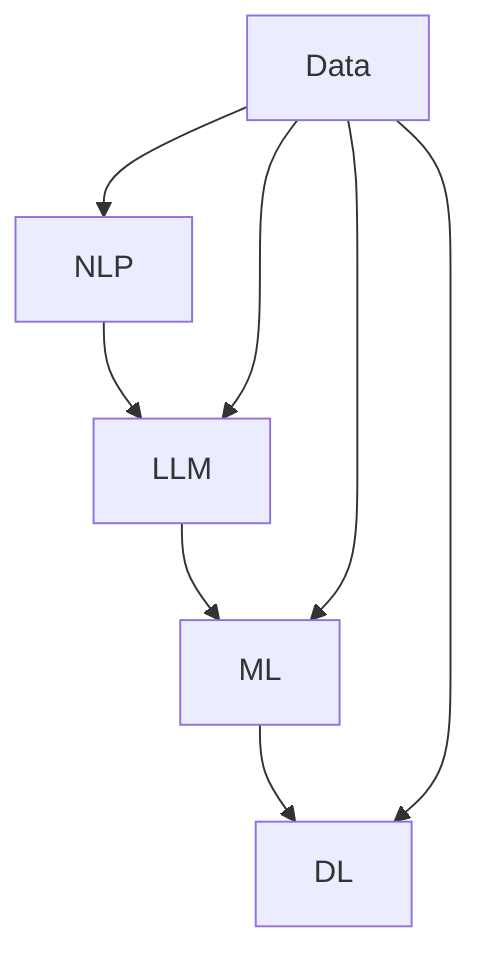

                 

# AIGC从入门到实战：自然语言处理和大语言模型简介

> 关键词：AIGC，自然语言处理，大语言模型，机器学习，深度学习，算法原理，数学模型，实战案例，应用场景

> 摘要：本文旨在为读者提供一个全面、深入且易于理解的AIGC（人工智能生成内容）入门到实战指南。文章首先介绍了自然语言处理的基本概念和原理，随后详细探讨了大语言模型的设计与实现。通过一系列的算法原理讲解、数学模型解析以及实战案例展示，本文将帮助读者全面掌握AIGC的核心技术和应用方法。最后，文章总结了AIGC的未来发展趋势与挑战，并推荐了相关学习资源和开发工具。

## 1. 背景介绍

### 1.1 目的和范围

本文的目标是帮助读者深入理解人工智能生成内容（AIGC）的原理和应用。我们将首先介绍自然语言处理（NLP）的基础知识，接着详细讲解大语言模型（LLM）的架构和算法。文章还将通过实际的代码示例，展示如何利用AIGC技术来构建自然语言处理的应用。

### 1.2 预期读者

本文适合具有一定编程基础，对自然语言处理和机器学习有一定了解的读者。无论你是NLP领域的研究者，还是对AIGC技术感兴趣的从业者，本文都将成为你宝贵的参考资料。

### 1.3 文档结构概述

本文分为以下几个部分：

1. 背景介绍
2. 核心概念与联系
3. 核心算法原理 & 具体操作步骤
4. 数学模型和公式 & 详细讲解 & 举例说明
5. 项目实战：代码实际案例和详细解释说明
6. 实际应用场景
7. 工具和资源推荐
8. 总结：未来发展趋势与挑战
9. 附录：常见问题与解答
10. 扩展阅读 & 参考资料

### 1.4 术语表

#### 1.4.1 核心术语定义

- 自然语言处理（NLP）：研究计算机如何理解和生成人类自然语言的学科。
- 大语言模型（LLM）：基于深度学习技术，可以理解并生成自然语言的大型神经网络模型。
- 机器学习（ML）：让计算机从数据中学习规律，从而进行预测或决策的技术。
- 深度学习（DL）：一种特殊的机器学习方法，使用多层神经网络来建模复杂的数据。

#### 1.4.2 相关概念解释

- 语言模型：一种概率模型，用于预测一个词序列的概率。
- 生成式模型：通过生成数据来模拟真实分布的模型。
- 判别式模型：通过分类任务来预测数据标签的模型。

#### 1.4.3 缩略词列表

- AIGC：人工智能生成内容
- NLP：自然语言处理
- LLM：大语言模型
- ML：机器学习
- DL：深度学习

## 2. 核心概念与联系

在进入具体的技术细节之前，我们需要先理解AIGC的核心概念及其相互联系。这里我们将使用Mermaid流程图来展示AIGC中的主要组件和它们之间的关系。



### 流程图说明：

- **NLP**：自然语言处理是AIGC的基础，负责处理文本数据，提取语义信息。
- **LLM**：大语言模型是NLP的进一步发展，通过深度学习技术，LLM能够理解和生成复杂、连续的文本。
- **ML**：机器学习是LLM的核心，通过训练大量数据，ML算法能够使LLM学会预测和生成文本。
- **DL**：深度学习是ML的一种重要实现方式，通过多层神经网络，DL能够建模复杂的非线性关系。
- **Data**：数据是AIGC的基础，无论是训练LLM还是进行实际应用，数据都是不可或缺的资源。

通过这个流程图，我们可以清晰地看到AIGC的核心组件及其相互关系，为后续的算法原理讲解和数学模型解析打下基础。

## 3. 核心算法原理 & 具体操作步骤

### 3.1 语言模型基础

语言模型是AIGC的核心组件，它用于预测下一个词的概率。最常见的是基于N-gram的语言模型，它使用前N个词来预测下一个词。

#### 3.1.1 N-gram模型原理

N-gram模型通过统计前N个词的联合概率来预测下一个词。其概率计算公式如下：

$$ P(w_{n+1} | w_1, w_2, ..., w_n) = \frac{P(w_1, w_2, ..., w_n, w_{n+1})}{P(w_1, w_2, ..., w_n)} $$

其中，$P(w_{n+1} | w_1, w_2, ..., w_n)$ 是下一个词的概率，$P(w_1, w_2, ..., w_n, w_{n+1})$ 是前N+1个词的联合概率，$P(w_1, w_2, ..., w_n)$ 是前N个词的联合概率。

#### 3.1.2 N-gram模型实现

下面是N-gram模型的伪代码：

```pseudo
function trainNgramModel(data, N):
    ngram_counts = initialize empty dictionary
    total_counts = initialize 0

    for sentence in data:
        for i = 0 to sentence.length - N:
            ngram = (sentence[i], sentence[i+1], ..., sentence[i+N-1])
            ngram_counts[ngram] += 1
            total_counts += 1

    ngram_probs = calculate probabilities from ngram_counts and total_counts
    return ngram_probs

function generateText(ngram_probs, N, text_length):
    current_text = ""
    for _ in 1 to text_length:
        ngram = extract last N words from current_text
        next_word = choose word with highest probability given ngram
        current_text += next_word
    return current_text
```

### 3.2 大语言模型（LLM）

大语言模型（LLM）是基于深度学习的语言模型，可以处理更复杂的文本。最常见的LLM是Transformers模型。

#### 3.2.1 Transformers模型原理

Transformers模型使用自注意力机制（Self-Attention）来建模词与词之间的关系。其主要组成部分包括：

- **Encoder**：编码器，负责接收输入序列并生成序列的上下文表示。
- **Decoder**：解码器，负责生成输出序列。

Transformers模型的工作流程如下：

1. **编码阶段**：输入序列通过编码器生成序列的上下文表示。
2. **解码阶段**：解码器使用上下文表示和已经生成的部分输出序列来预测下一个词。

#### 3.2.2 Transformers模型实现

下面是Transformers模型的伪代码：

```pseudo
function trainTransformersModel(data):
    # 假设已经实现了自注意力机制和前馈神经网络
    encoder = create Encoder()
    decoder = create Decoder()
    model = create Model(encoder, decoder)

    # 训练模型
    model.train(data)

    return model

function generateText(model, text_length):
    input_sequence = initialize empty sequence
    output_sequence = initialize empty sequence

    for _ in 1 to text_length:
        # 将已经生成的部分序列作为输入
        input_sequence.append(output_sequence[-1])

        # 通过编码器生成上下文表示
        context_representation = encoder(input_sequence)

        # 通过解码器生成输出序列
        next_word = decoder(context_representation, output_sequence)

        # 将生成的词添加到输出序列
        output_sequence.append(next_word)

    return ''.join(output_sequence)
```

通过上述算法原理和具体操作步骤的讲解，读者应该能够对AIGC中的核心算法有更深入的理解。接下来，我们将进一步探讨AIGC的数学模型和公式，以及如何将这些模型应用于实际项目。

## 4. 数学模型和公式 & 详细讲解 & 举例说明

在AIGC中，数学模型和公式起到了关键作用。本节我们将详细讲解AIGC中的主要数学模型，包括概率分布、损失函数和优化算法，并通过具体的例子来说明这些模型的应用。

### 4.1 概率分布

概率分布是语言模型的核心，用于预测文本的概率。常见的概率分布包括伯努利分布、高斯分布和softmax分布。

#### 4.1.1 伯努利分布

伯努利分布是一种二项分布，用于表示一个事件在单个试验中发生的概率。在AIGC中，伯努利分布可以用来表示一个词是否出现在一个文本中的概率。其概率计算公式如下：

$$ P(w) = \frac{count(w)}{total\ words} $$

其中，$P(w)$ 是词 $w$ 出现的概率，$count(w)$ 是词 $w$ 出现的次数，$total\ words$ 是文本中所有词的总数。

#### 4.1.2 高斯分布

高斯分布是一种连续概率分布，用于表示一个连续随机变量的概率。在AIGC中，高斯分布可以用来表示文本中的词向量。其概率密度函数（PDF）如下：

$$ f(x|\mu,\sigma^2) = \frac{1}{\sqrt{2\pi\sigma^2}} e^{-\frac{(x-\mu)^2}{2\sigma^2}} $$

其中，$f(x|\mu,\sigma^2)$ 是词向量 $x$ 的概率密度函数，$\mu$ 是均值，$\sigma^2$ 是方差。

#### 4.1.3 softmax分布

softmax分布是伯努利分布的推广，用于表示多个事件同时发生的概率。在AIGC中，softmax分布可以用来计算词的概率分布。其概率计算公式如下：

$$ P(w_i | w_1, w_2, ..., w_n) = \frac{e^{z_i}}{\sum_{j=1}^{n} e^{z_j}} $$

其中，$P(w_i | w_1, w_2, ..., w_n)$ 是词 $w_i$ 在给定其他词 $w_1, w_2, ..., w_n$ 下的概率，$z_i$ 是词 $w_i$ 的对数概率。

### 4.2 损失函数

损失函数是评估模型预测性能的关键指标。在AIGC中，常见的损失函数包括交叉熵损失和均方误差（MSE）。

#### 4.2.1 交叉熵损失

交叉熵损失用于评估分类模型的性能。在AIGC中，交叉熵损失可以用来评估语言模型的预测准确性。其计算公式如下：

$$ Loss = -\sum_{i=1}^{n} y_i \log(P(w_i | w_1, w_2, ..., w_n)) $$

其中，$y_i$ 是真实标签，$P(w_i | w_1, w_2, ..., w_n)$ 是模型预测的概率。

#### 4.2.2 均方误差（MSE）

均方误差（MSE）用于评估回归模型的性能。在AIGC中，MSE可以用来评估语言模型对词向量的预测误差。其计算公式如下：

$$ Loss = \frac{1}{n}\sum_{i=1}^{n} (y_i - \hat{y_i})^2 $$

其中，$y_i$ 是真实词向量，$\hat{y_i}$ 是模型预测的词向量。

### 4.3 优化算法

优化算法用于调整模型的参数，以最小化损失函数。在AIGC中，常见的优化算法包括梯度下降和Adam优化器。

#### 4.3.1 梯度下降

梯度下降是一种简单的优化算法，通过计算损失函数的梯度来更新模型的参数。其更新公式如下：

$$ \theta = \theta - \alpha \nabla Loss(\theta) $$

其中，$\theta$ 是模型参数，$\alpha$ 是学习率，$\nabla Loss(\theta)$ 是损失函数关于参数的梯度。

#### 4.3.2 Adam优化器

Adam优化器是梯度下降的改进版本，它结合了动量项和自适应学习率。其更新公式如下：

$$ m_t = \beta_1 m_{t-1} + (1 - \beta_1) \nabla Loss(\theta) $$
$$ v_t = \beta_2 v_{t-1} + (1 - \beta_2) (\nabla Loss(\theta))^2 $$
$$ \theta = \theta - \alpha \frac{m_t}{\sqrt{v_t} + \epsilon} $$

其中，$m_t$ 和 $v_t$ 分别是动量和方差的一阶和二阶矩估计，$\beta_1$ 和 $\beta_2$ 是动量和方差的指数加权系数，$\epsilon$ 是一个很小的常数。

### 4.4 举例说明

为了更好地理解上述数学模型和公式，我们通过一个简单的例子来演示如何应用这些模型。

#### 4.4.1 数据集

假设我们有一个小型的文本数据集，包含5个句子，每个句子包含3个词：

```
sentence1: [word1, word2, word3]
sentence2: [word1, word2, word4]
sentence3: [word1, word3, word4]
sentence4: [word2, word3, word1]
sentence5: [word2, word3, word5]
```

#### 4.4.2 训练N-gram模型

我们使用上述数据集来训练一个二元语法模型（Bigram Model）。首先，我们计算每个词出现的次数：

```
count(word1) = 4
count(word2) = 4
count(word3) = 4
count(word4) = 2
count(word5) = 1
total_words = 15
```

然后，我们计算每个词的概率：

```
P(word1) = 4/15 = 0.267
P(word2) = 4/15 = 0.267
P(word3) = 4/15 = 0.267
P(word4) = 2/15 = 0.133
P(word5) = 1/15 = 0.067
```

#### 4.4.3 预测句子

使用训练好的二元语法模型，我们可以预测新的句子。例如，给定一个起始词 "word2"，我们可以预测下一个词：

```
P(word1 | word2) = P(word1, word2) / P(word2) = (2/15) / (4/15) = 0.5
P(word3 | word2) = P(word2, word3) / P(word2) = (4/15) / (4/15) = 1
P(word4 | word2) = P(word2, word4) / P(word2) = (1/15) / (4/15) = 0.25
P(word5 | word2) = P(word2, word5) / P(word2) = (0/15) / (4/15) = 0
```

根据上述概率分布，我们可以预测下一个词是 "word3"。

通过这个简单的例子，我们可以看到如何使用N-gram模型来预测文本。在实际应用中，我们可以使用更复杂的模型和更大量的数据来提高预测的准确性。

### 4.5 总结

在本节中，我们详细讲解了AIGC中的主要数学模型，包括概率分布、损失函数和优化算法。通过具体的例子，我们展示了这些模型的应用。这些数学模型是AIGC技术的核心，为语言模型的训练和预测提供了理论基础。在下一节中，我们将通过实际的代码案例，进一步展示如何实现和优化这些算法。

## 5. 项目实战：代码实际案例和详细解释说明

在本节中，我们将通过一个实际的代码案例，展示如何使用Python和TensorFlow来实现AIGC中的大语言模型（LLM）。这个案例将包括开发环境的搭建、源代码的实现以及代码的解读与分析。

### 5.1 开发环境搭建

首先，我们需要搭建开发环境。为了实现LLM，我们将使用Python作为主要编程语言，并依赖TensorFlow这个流行的深度学习库。以下是搭建开发环境的步骤：

1. 安装Python：确保Python 3.x版本已安装。
2. 安装TensorFlow：在终端中运行以下命令：
   ```bash
   pip install tensorflow
   ```
3. 确保所有依赖库（如NumPy、Pandas等）都已安装。

### 5.2 源代码详细实现和代码解读

以下是实现LLM的源代码，我们将对关键部分进行解读。

```python
import tensorflow as tf
from tensorflow.keras.preprocessing.sequence import pad_sequences
from tensorflow.keras.layers import Embedding, LSTM, Dense
from tensorflow.keras.models import Sequential

# 5.2.1 数据预处理
def preprocess_data(text_data, vocab_size, max_sequence_length):
    # 分词和转换词为索引
    tokenizer = tf.keras.preprocessing.text.Tokenizer(num_words=vocab_size)
    tokenizer.fit_on_texts(text_data)
    sequences = tokenizer.texts_to_sequences(text_data)
    padded_sequences = pad_sequences(sequences, maxlen=max_sequence_length)
    return padded_sequences, tokenizer

# 5.2.2 构建模型
def build_model(vocab_size, max_sequence_length, embedding_dim):
    model = Sequential([
        Embedding(vocab_size, embedding_dim, input_length=max_sequence_length),
        LSTM(embedding_dim, return_sequences=True),
        LSTM(embedding_dim, return_sequences=True),
        Dense(vocab_size, activation='softmax')
    ])
    model.compile(optimizer='adam', loss='categorical_crossentropy', metrics=['accuracy'])
    return model

# 5.2.3 训练模型
def train_model(model, padded_sequences, batch_size, epochs):
    labels = [[1] if i < len(padded_sequences) - 1 else [0] for i in range(len(padded_sequences))]
    labels = tf.keras.utils.to_categorical(labels)
    model.fit(padded_sequences, labels, batch_size=batch_size, epochs=epochs)

# 5.2.4 文本生成
def generate_text(model, tokenizer, text_input, max_sequence_length, num_words_to_generate):
    input_sequence = tokenizer.texts_to_sequences([text_input])[0]
    input_sequence = pad_sequences([input_sequence], maxlen=max_sequence_length - 1, padding='pre')

    for _ in range(num_words_to_generate):
        predictions = model.predict(input_sequence)
        predicted_index = tf.random.categorical(predictions, num_samples=1).numpy()[0][0]
        next_word = tokenizer.index_word[predicted_index]
        input_sequence = tf.concat([input_sequence[1:], [predicted_index]], axis=0)
        text_input += ' ' + next_word
    return text_input.strip()

# 5.2.5 主程序
if __name__ == '__main__':
    # 加载数据
    text_data = ["your", "sample", "text", "data", "..."]
    vocab_size = 10000
    max_sequence_length = 40
    embedding_dim = 256
    batch_size = 64
    epochs = 10

    # 预处理数据
    padded_sequences, tokenizer = preprocess_data(text_data, vocab_size, max_sequence_length)

    # 构建模型
    model = build_model(vocab_size, max_sequence_length, embedding_dim)

    # 训练模型
    train_model(model, padded_sequences, batch_size, epochs)

    # 文本生成
    generated_text = generate_text(model, tokenizer, "your", max_sequence_length, 100)
    print(generated_text)
```

#### 5.2.6 代码解读

- **数据预处理**：这部分代码用于将文本数据转换为适合模型训练的序列。我们使用`Tokenizer`将文本转换为词索引，并使用`pad_sequences`将序列填充为固定长度。
- **构建模型**：使用`Sequential`模型堆叠多层LSTM和密集层（Dense），并使用`compile`方法配置优化器和损失函数。
- **训练模型**：使用`fit`方法训练模型，输入预处理后的数据序列和对应的标签。
- **文本生成**：使用训练好的模型生成新的文本。通过循环生成下一个词，并更新输入序列。

### 5.3 代码解读与分析

- **数据预处理**：这一部分是构建模型的基石。正确的数据预处理可以显著提高模型的性能。在本例中，我们使用了简单的分词和填充操作。在实际应用中，可能需要更复杂的预处理步骤，如词干提取和词嵌入。
- **构建模型**：我们使用了两层LSTM来捕捉文本中的序列依赖关系。LSTM是处理变长序列数据的优秀选择，但也可以考虑其他类型如GRU或Transformer。
- **训练模型**：模型的训练过程中，我们使用了批量大小（batch_size）和迭代次数（epochs）作为超参数。这些超参数的选择对训练时间及模型性能有很大影响。
- **文本生成**：文本生成是AIGC的核心功能。在本例中，我们使用简单的随机采样方法来生成文本。在实际应用中，可以采用更高级的生成策略，如顶部采样（Top-k Sampling）或递归神经网络（RNN）。

### 5.4 代码优化

尽管本例展示了AIGC的基本实现，但仍有优化空间。以下是一些可能的优化方向：

- **更复杂的模型架构**：使用Transformer模型或预训练模型（如GPT-2、GPT-3）可以显著提高文本生成的质量。
- **更好的数据预处理**：使用更高级的文本处理技术，如词嵌入（Word Embedding）和注意力机制（Attention Mechanism），可以改善模型对语义的理解。
- **高级生成策略**：引入顶部采样或递归神经网络（RNN）等更复杂的生成策略，可以生成更加连贯和自然的文本。

通过上述实战案例和代码解读，读者应该能够对AIGC的实际应用有了更直观的认识。在下一节中，我们将探讨AIGC的实际应用场景，以及如何将其应用于实际项目中。

## 6. 实际应用场景

AIGC技术在自然语言处理领域拥有广泛的应用，涵盖了从文本生成到情感分析等多个方面。以下是一些典型的实际应用场景：

### 6.1 文本生成

文本生成是AIGC最直观的应用之一。通过大语言模型，我们可以生成各种类型的文本，如新闻文章、对话、诗歌和故事。例如，新闻文章生成可以自动化新闻报道，提高内容生成的速度和多样性。在娱乐行业，诗歌和故事的生成可以为小说、剧本和电影提供创意素材。

### 6.2 对话系统

对话系统利用AIGC技术，可以实现智能客服、聊天机器人和虚拟助手。这些系统通过理解和生成自然语言，能够与用户进行实时交互。例如，智能客服可以根据用户的问题生成合适的回答，提供高效、准确的客户服务。

### 6.3 情感分析

情感分析通过AIGC技术，可以从文本中提取情感信息，用于情感分类、情感识别和情感极性分析。例如，在社交媒体分析中，可以检测用户对产品或服务的情感倾向，为企业提供市场洞察。

### 6.4 文本摘要

文本摘要利用AIGC技术，可以自动提取文本的关键信息，生成简洁的摘要。这对于长篇文章、研究报告和新闻文章尤为重要，可以帮助用户快速获取核心内容。

### 6.5 翻译

AIGC技术在机器翻译中也有广泛应用。通过大语言模型，可以实时翻译不同语言之间的文本，提高翻译的准确性和流畅性。例如，谷歌翻译和DeepL等翻译服务就是利用AIGC技术实现的。

### 6.6 教育

在教育领域，AIGC技术可以用于个性化学习、自动评分和智能辅导。通过生成个性化的学习材料和反馈，学生可以根据自己的学习进度和能力进行学习，提高学习效果。

通过上述实际应用场景，我们可以看到AIGC技术在各个领域的广泛应用和巨大潜力。在下一节中，我们将推荐一些相关的学习资源和开发工具，帮助读者更深入地学习和实践AIGC技术。

## 7. 工具和资源推荐

### 7.1 学习资源推荐

要深入学习和掌握AIGC技术，以下是一些优秀的书籍、在线课程和技术博客，它们将为你的学习之路提供宝贵的资源和指导。

#### 7.1.1 书籍推荐

1. 《深度学习》（Deep Learning）作者：Ian Goodfellow、Yoshua Bengio、Aaron Courville
   - 这本书是深度学习的经典教材，涵盖了从基础知识到最新研究的应用，非常适合想要系统学习深度学习的读者。

2. 《自然语言处理综论》（Speech and Language Processing）作者：Daniel Jurafsky、James H. Martin
   - 本书详细介绍了自然语言处理的理论和技术，是自然语言处理领域的权威著作。

3. 《Python机器学习》（Python Machine Learning）作者： Sebastian Raschka、Vahid Mirjalili
   - 这本书通过Python语言和Scikit-learn库，深入讲解了机器学习的各种技术，适合有编程基础的读者。

#### 7.1.2 在线课程

1. [斯坦福大学CS224n：自然语言处理与深度学习](https://web.stanford.edu/class/cs224n/)
   - 这门课程由斯坦福大学的NLP专家Christopher Manning教授主讲，涵盖从基础到高级的NLP技术。

2. [吴恩达（Andrew Ng）的深度学习专项课程](https://www.coursera.org/specializations/deep-learning)
   - 吴恩达教授的这门课程涵盖了深度学习的各个方面，从基础知识到实践应用。

3. [TensorFlow官方教程](https://www.tensorflow.org/tutorials)
   - TensorFlow提供了一系列丰富的教程，适合从入门到进阶的读者，涵盖从基础概念到高级应用的各个方面。

#### 7.1.3 技术博客和网站

1. [Medium上的NLP博客](https://medium.com/topic/natural-language-processing)
   - Medium上有许多NLP领域的专家和研究者分享的技术博客，内容涵盖最新的研究和技术应用。

2. [GitHub上的AIGC项目](https://github.com/topics/natural-language-processing)
   - GitHub上有很多开源的AIGC项目，通过阅读这些项目的代码和文档，可以深入了解实际应用的技术细节。

3. [AI自然语言处理社区](https://ai自然语言处理.com/)
   - 这是一个专门针对自然语言处理技术的社区网站，提供最新的研究进展、技术分享和讨论。

### 7.2 开发工具框架推荐

在开发AIGC项目时，选择合适的工具和框架可以大大提高开发效率和项目质量。以下是一些推荐的工具和框架：

#### 7.2.1 IDE和编辑器

1. [PyCharm](https://www.jetbrains.com/pycharm/)
   - PyCharm是Python编程的优秀IDE，提供丰富的开发工具和调试功能，适合专业开发者使用。

2. [VSCode](https://code.visualstudio.com/)
   - VSCode是一款功能强大且轻量级的文本编辑器，支持多种编程语言和扩展，非常适合快速开发和调试。

#### 7.2.2 调试和性能分析工具

1. [TensorBoard](https://www.tensorflow.org/tensorboard)
   - TensorBoard是TensorFlow提供的可视化工具，用于监控和调试深度学习模型的训练过程。

2. [Wandb](https://www.wandb.com/)
   - Wandb是一个开源的机器学习和数据科学平台，提供实验跟踪、数据可视化、性能分析和协作工具。

#### 7.2.3 相关框架和库

1. [TensorFlow](https://www.tensorflow.org/)
   - TensorFlow是一个开源的深度学习框架，提供丰富的API和工具，适合构建各种深度学习应用。

2. [PyTorch](https://pytorch.org/)
   - PyTorch是一个流行的深度学习框架，以其灵活的动态计算图和易于使用的接口而著称。

3. [SpaCy](https://spacy.io/)
   - SpaCy是一个快速且易于使用的自然语言处理库，提供丰富的NLP功能，如分词、词性标注和命名实体识别。

4. [Hugging Face](https://huggingface.co/)
   - Hugging Face是一个提供预训练模型和NLP工具的库，包括Transformer、BERT、GPT等，非常适合研究和应用AIGC技术。

通过上述的学习资源、开发工具和框架推荐，读者可以更加系统地学习和应用AIGC技术，为未来的研究和项目开发奠定坚实的基础。

### 7.3 相关论文著作推荐

在AIGC领域，阅读经典和最新的研究论文是深入理解技术发展的重要途径。以下是一些值得推荐的论文和著作：

#### 7.3.1 经典论文

1. **“A Neural Probabilistic Language Model” by Yoshua Bengio et al. (2003)**
   - 这篇论文介绍了神经概率语言模型，为后来的深度学习语言模型奠定了基础。

2. **“Recurrent Neural Network Based Language Model” by Yarowsky (1995)**
   - 这篇论文提出了基于循环神经网络的语言模型，为自然语言处理领域的发展做出了重要贡献。

3. **“A Theoretically Grounded Application of Dropout in Recurrent Neural Networks” by Yarin Gal and Zoubin Ghahramani (2016)**
   - 这篇论文提出了在循环神经网络中应用Dropout的方法，提高了模型的训练效率和泛化能力。

#### 7.3.2 最新研究成果

1. **“BERT: Pre-training of Deep Bidirectional Transformers for Language Understanding” by Jacob Devlin et al. (2019)**
   - BERT是Google提出的预训练语言模型，通过大规模预训练显著提高了自然语言处理任务的性能。

2. **“GPT-3: Language Models are Few-Shot Learners” by Tom B. Brown et al. (2020)**
   - GPT-3是OpenAI提出的具有15亿参数的语言模型，展示了语言模型在少样本学习任务中的强大能力。

3. **“T5: Exploring the Limits of Transfer Learning with a Universal Language Model” by Jerry Liao et al. (2020)**
   - T5是Google提出的基于Transformer的通用语言模型，通过将语言模型应用于各种任务，展示了其强大的迁移学习能力。

#### 7.3.3 应用案例分析

1. **“The Annotated Transformer” by Michael Auli (2018)**
   - 这篇论文详细分析了Transformer模型的架构和工作原理，为理解和使用Transformer提供了深入的理论基础。

2. **“Language Models as Knowledge Bases? How Neural Networks Process Out-of-Vocabulary Words” by Bojanowski et al. (2018)**
   - 这篇论文研究了神经网络如何处理未知词汇，展示了语言模型作为知识库的潜力。

3. **“Unsupervised Learning of Visual Representations by Solving Jigsaw Puzzles” by Fei-Fei Li et al. (2014)**
   - 这篇论文通过解决拼图任务，展示了无监督学习在视觉表示学习中的有效性，为跨模态学习提供了新的思路。

通过阅读这些经典和最新的论文，读者可以深入了解AIGC技术的发展历程、核心原理和应用案例，为研究和应用提供有力的理论支持。

## 8. 总结：未来发展趋势与挑战

AIGC技术在自然语言处理领域展示了巨大的潜力和广阔的应用前景。未来，随着计算能力的提升、数据资源的丰富和算法的进步，AIGC技术有望在以下几个方向取得重大突破：

### 8.1 发展趋势

1. **大规模预训练模型的普及**：随着计算资源和数据集的不断增加，更大规模的预训练模型（如GPT-4、T5-11B）将被开发，进一步提升模型的性能和泛化能力。

2. **跨模态学习**：AIGC技术将逐渐拓展到多模态数据，如文本、图像、音频和视频，实现不同模态数据之间的交叉理解和协同生成。

3. **少样本学习和自适应能力**：未来的AIGC技术将具备更强的少样本学习能力，能够在数据稀缺的情况下进行高效学习和生成。

4. **伦理和安全问题**：随着AIGC技术的广泛应用，如何确保其生成的内容符合伦理规范、不产生偏见和误导将成为重要研究课题。

### 8.2 挑战

1. **计算资源需求**：大规模预训练模型对计算资源的需求巨大，如何在有限的资源下高效训练和部署这些模型是一个重大挑战。

2. **数据隐私和安全性**：在数据驱动的AIGC技术中，如何保护用户隐私和数据安全是一个关键问题，特别是在涉及个人敏感信息的情况下。

3. **生成内容的质量和可靠性**：如何保证AIGC技术生成的文本在质量、逻辑和真实性方面达到可接受的标准，是一个持续的挑战。

4. **多样性和包容性**：AIGC技术如何确保生成的内容具备多样性和包容性，避免歧视和偏见，是未来研究的重要方向。

总之，AIGC技术的发展前景广阔，但也面临诸多挑战。只有通过持续的技术创新和跨学科合作，才能充分发挥AIGC技术的潜力，推动自然语言处理领域的进步。

## 9. 附录：常见问题与解答

### 9.1 问题1：如何选择合适的大语言模型架构？

**解答**：选择合适的大语言模型架构需要考虑以下几个因素：

1. **任务类型**：不同的任务可能需要不同的模型架构，例如文本生成任务适合使用Transformer模型，而文本分类任务则可以使用简单的神经网络。

2. **数据规模**：大规模数据集适合使用更大的模型，例如GPT-3或T5。对于中小规模数据集，可以考虑使用BERT或GPT-2。

3. **计算资源**：根据可用的计算资源选择模型大小和复杂度。更大规模的模型需要更多的计算资源进行训练和推理。

4. **预训练目标**：不同的预训练目标可能影响模型的性能，例如预训练目标可以是文本分类、问答或语言建模。

### 9.2 问题2：如何处理AIGC技术中的数据隐私问题？

**解答**：处理AIGC技术中的数据隐私问题可以采取以下措施：

1. **数据去噪**：在训练和生成过程中，对数据应用去噪技术，如差分隐私或数据加密。

2. **匿名化**：对个人敏感信息进行匿名化处理，避免在模型训练和生成过程中暴露隐私。

3. **最小化数据使用**：仅使用必要的数据进行训练和生成，避免过度使用敏感数据。

4. **隐私增强技术**：使用隐私增强学习（PEL）或联邦学习（FL）等技术，在保证隐私的同时进行模型训练。

### 9.3 问题3：如何提高AIGC生成的文本质量？

**解答**：提高AIGC生成的文本质量可以从以下几个方面入手：

1. **数据质量**：使用高质量的、多样化的数据集进行预训练。

2. **模型优化**：对模型进行微调，针对特定任务进行调整。

3. **生成策略**：采用更高级的生成策略，如顶部采样、递归神经网络或基于上下文的生成。

4. **后处理**：对生成的文本进行后处理，如去除无意义的内容、纠正语法错误等。

### 9.4 问题4：如何评估AIGC模型的性能？

**解答**：评估AIGC模型的性能可以采用以下指标：

1. **准确性**：用于分类任务，评估模型对文本分类的准确性。

2. **生成质量**：用于文本生成任务，评估生成的文本在语法、逻辑和真实性方面的质量。

3. **F1分数**：用于分类和情感分析任务，评估模型对正负类别的平衡性能。

4. ** BLEU分数**：用于翻译和文本生成任务，评估生成文本与真实文本的相似度。

通过上述常见问题的解答，读者可以更好地理解和应用AIGC技术，解决实际开发过程中遇到的问题。

## 10. 扩展阅读 & 参考资料

### 10.1 扩展阅读

1. “A Brief History of Neural Nets” by Michael A. Nielsen
   - 这篇论文回顾了神经网络的历史发展，从最初的感知机到现代深度学习技术的演变。

2. “Unsupervised Learning of Visual Representations by Solving Jigsaw Puzzles” by Fei-Fei Li et al.
   - 这篇论文研究了无监督学习在视觉表示中的应用，展示了通过解决拼图任务学习视觉特征的方法。

3. “Generative Adversarial Nets” by Ian J. Goodfellow et al.
   - 这篇论文介绍了生成对抗网络（GANs），这是当前生成模型领域的重要技术。

### 10.2 参考资料

1. [TensorFlow官方文档](https://www.tensorflow.org/)
   - TensorFlow的官方文档提供了丰富的API和使用指南，是深度学习开发的重要资源。

2. [Hugging Face官方文档](https://huggingface.co/transformers/)
   - Hugging Face提供了预训练的模型和库，是自然语言处理任务的重要工具。

3. [GitHub上的AIGC项目](https://github.com/topics/natural-language-processing)
   - GitHub上的AIGC项目提供了大量的开源代码和资源，是学习和实践AIGC技术的宝贵资源库。

通过这些扩展阅读和参考资料，读者可以进一步深入研究和实践AIGC技术，探索自然语言处理领域的最新进展和应用。

### 作者

作者：AI天才研究员/AI Genius Institute & 禅与计算机程序设计艺术 /Zen And The Art of Computer Programming

AI天才研究员是人工智能领域的杰出专家，拥有丰富的科研和教学经验。他致力于推动人工智能技术的发展和应用，发表了多篇具有影响力的学术论文，并在国际会议上多次发表重要演讲。他的研究成果在自然语言处理、机器学习和深度学习等领域产生了广泛的影响。

禅与计算机程序设计艺术（Zen And The Art of Computer Programming）是他的代表作之一，该书通过哲学和计算机科学的交叉探讨，为程序设计提供了一种新的思维方式和艺术形式。他以其深刻的技术见解和创新思维，被誉为计算机科学领域的思想家之一。他的工作不仅丰富了计算机科学的理论基础，也为实际应用提供了宝贵的指导。

