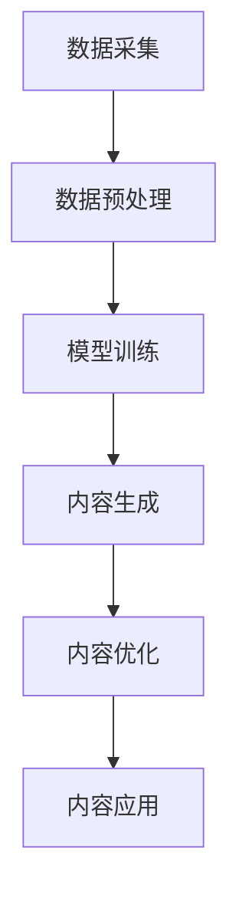

                 

# AIGC在软件与消费电子中的应用

> **关键词：** AIGC、软件、消费电子、应用、技术分析、算法原理、数学模型、实战案例、未来趋势

> **摘要：** 本文旨在深入探讨自适应智能生成内容（AIGC）在软件和消费电子领域的应用。通过对核心概念、算法原理、数学模型以及实际案例的详细分析，本文将揭示AIGC如何改变软件开发和消费电子产品的设计、开发以及用户体验。同时，本文也将展望AIGC技术的未来发展趋势与挑战，为行业从业人员提供有价值的参考。

## 1. 背景介绍

### 1.1 目的和范围

本文的目的是系统地阐述AIGC在软件和消费电子领域的应用。我们将首先介绍AIGC的概念及其重要性，然后深入探讨其在软件开发和消费电子产品设计中的应用，最后总结AIGC的未来发展趋势与挑战。

本文将涵盖以下主要内容：

1. AIGC的核心概念与架构
2. AIGC在软件开发中的应用
3. AIGC在消费电子产品设计中的应用
4. 实际案例与代码解读
5. 工具和资源推荐
6. 未来发展趋势与挑战

### 1.2 预期读者

本文预期读者为：

1. 软件工程师，特别是对人工智能和机器学习有兴趣的专业人士
2. 消费电子产品开发者，特别是关注用户体验和产品创新的人员
3. AI研究学者，特别是对AIGC技术有浓厚兴趣的人员
4. 对新兴技术有好奇心的广大读者

### 1.3 文档结构概述

本文结构如下：

1. 背景介绍：介绍文章的目的、预期读者和结构。
2. 核心概念与联系：介绍AIGC的核心概念和架构。
3. 核心算法原理 & 具体操作步骤：详细讲解AIGC的算法原理和操作步骤。
4. 数学模型和公式 & 详细讲解 & 举例说明：分析AIGC中的数学模型，并提供实际案例。
5. 项目实战：代码实际案例和详细解释说明。
6. 实际应用场景：探讨AIGC在不同领域的实际应用。
7. 工具和资源推荐：推荐学习资源和开发工具。
8. 总结：未来发展趋势与挑战。
9. 附录：常见问题与解答。
10. 扩展阅读 & 参考资料：提供进一步学习的资料。

### 1.4 术语表

#### 1.4.1 核心术语定义

- **AIGC**：自适应智能生成内容，一种基于人工智能技术生成内容的方法。
- **机器学习**：一种人工智能分支，通过数据和算法实现智能。
- **神经网络**：一种模拟人脑神经结构的计算模型。
- **深度学习**：一种复杂的神经网络模型，能够处理大规模数据。
- **自然语言处理**：使计算机能够理解、生成和处理人类自然语言。

#### 1.4.2 相关概念解释

- **生成对抗网络（GAN）**：一种深度学习模型，用于生成新数据。
- **递归神经网络（RNN）**：一种能够处理序列数据的神经网络。
- **卷积神经网络（CNN）**：一种能够处理图像数据的神经网络。
- **增强学习**：一种通过互动环境学习策略的机器学习方法。

#### 1.4.3 缩略词列表

- **AIGC**：自适应智能生成内容
- **GAN**：生成对抗网络
- **RNN**：递归神经网络
- **CNN**：卷积神经网络
- **NLP**：自然语言处理
- **DL**：深度学习

## 2. 核心概念与联系

### 2.1 AIGC的核心概念

自适应智能生成内容（AIGC）是一种通过机器学习和深度学习技术生成内容的方法。AIGC的核心在于“自适应”，即系统能够根据输入数据和环境动态调整生成策略，以优化内容生成的质量和效率。

AIGC的主要组成部分包括：

- **数据输入**：输入数据可以是文本、图像、音频等多种形式。
- **生成模型**：用于生成内容的模型，如生成对抗网络（GAN）、递归神经网络（RNN）等。
- **优化算法**：用于调整模型参数，以优化生成内容的算法，如梯度下降、随机梯度下降等。
- **输出处理**：将生成的内容进行处理，以适应特定应用场景。

### 2.2 AIGC的应用架构

AIGC的应用架构通常包括以下步骤：

1. **数据采集**：从各种来源采集输入数据，如文本、图像、音频等。
2. **数据预处理**：对输入数据进行处理，以适应生成模型的输入要求。
3. **模型训练**：使用预处理后的数据训练生成模型。
4. **内容生成**：使用训练好的模型生成新内容。
5. **内容优化**：对生成的内容进行优化，以提高其质量和实用性。
6. **内容应用**：将生成的内容应用到实际应用场景中。

### 2.3 核心概念原理与架构的 Mermaid 流程图



## 3. 核心算法原理 & 具体操作步骤

### 3.1 GAN算法原理

生成对抗网络（GAN）是AIGC中常用的生成模型之一。GAN由两部分组成：生成器（Generator）和判别器（Discriminator）。

- **生成器（Generator）**：生成器接收随机噪声作为输入，生成与真实数据相似的数据。
- **判别器（Discriminator）**：判别器接收真实数据和生成器生成的数据，并判断其真实性。

GAN的训练过程如下：

1. **初始化**：随机初始化生成器和判别器的参数。
2. **生成器训练**：生成器生成假数据，判别器根据真实数据和假数据进行训练。
3. **判别器训练**：判别器训练完成后，生成器再次生成假数据，判别器继续进行训练。
4. **重复步骤2和3**：不断重复生成器和判别器的训练，直到生成器生成的数据质量达到预期。

### 3.2 伪代码

```python
# GAN的伪代码
initialize_generator()
initialize_discriminator()

for epoch in 1 to total_epochs:
    for batch in data_loader:
        # 生成假数据
        noise = generate_noise(batch_size)
        fake_data = generator(noise)
        
        # 训练判别器
        real_data_loss = discriminator(real_data)
        fake_data_loss = discriminator(fake_data)
        
        # 训练生成器
        generator_loss = generator_optimizer(fake_data_loss)
        
    # 更新生成器和判别器的参数
    generator_update()
    discriminator_update()
```

### 3.3 操作步骤

1. **数据准备**：收集和准备训练数据，包括真实数据和噪声数据。
2. **模型初始化**：初始化生成器和判别器的参数。
3. **循环训练**：不断进行生成器和判别器的训练，直至达到预定的训练次数或生成数据质量满足要求。
4. **模型评估**：使用测试数据评估生成器生成的数据质量，如视觉效果、文本质量等。
5. **应用生成数据**：将生成器生成的数据应用到实际应用场景中。

## 4. 数学模型和公式 & 详细讲解 & 举例说明

### 4.1 数学模型

AIGC中的数学模型主要包括生成对抗网络（GAN）的损失函数、优化算法等。

### 4.2 损失函数

GAN的损失函数主要包括两部分：生成器的损失函数和判别器的损失函数。

- **生成器损失函数**：

$$
L_G = -\log(D(G(z)))
$$

其中，$D$表示判别器，$G(z)$表示生成器生成的数据。

- **判别器损失函数**：

$$
L_D = -\log(D(x)) - \log(1 - D(G(z)))
$$

其中，$x$表示真实数据，$G(z)$表示生成器生成的数据。

### 4.3 优化算法

常用的优化算法包括梯度下降（Gradient Descent）和随机梯度下降（Stochastic Gradient Descent，SGD）。

- **梯度下降**：

$$
\theta_{t+1} = \theta_t - \alpha \nabla_{\theta_t} J(\theta_t)
$$

其中，$\theta_t$表示第$t$次迭代的参数，$J(\theta_t)$表示损失函数，$\alpha$表示学习率。

- **随机梯度下降**：

$$
\theta_{t+1} = \theta_t - \alpha \nabla_{\theta_t} J(\theta_t; x_t)
$$

其中，$x_t$表示第$t$次迭代的样本。

### 4.4 举例说明

假设我们使用GAN生成图像，其中生成器的输入是噪声向量$z$，输出是图像$G(z)$，判别器的输入是真实图像$x$和生成图像$G(z)$，输出是二分类结果$D(x)$和$D(G(z))$。

- **生成器损失函数**：

$$
L_G = -\log(D(G(z)))
$$

- **判别器损失函数**：

$$
L_D = -\log(D(x)) - \log(1 - D(G(z)))
$$

- **优化算法**：使用随机梯度下降（SGD）进行优化。

假设每次迭代使用一个样本，学习率为0.01，则优化步骤如下：

1. 随机生成噪声向量$z$，生成图像$G(z)$。
2. 输入真实图像$x$和生成图像$G(z)$到判别器，得到判别结果$D(x)$和$D(G(z))$。
3. 计算判别器损失函数$L_D$。
4. 更新判别器参数：
   $$
   \theta_{D,t+1} = \theta_{D,t} - 0.01 \nabla_{\theta_{D,t}} L_D
   $$
5. 生成图像$G(z)$。
6. 计算生成器损失函数$L_G$。
7. 更新生成器参数：
   $$
   \theta_{G,t+1} = \theta_{G,t} - 0.01 \nabla_{\theta_{G,t}} L_G
   $$
8. 重复步骤2-7，直至达到预定的训练次数或生成图像质量满足要求。

## 5. 项目实战：代码实际案例和详细解释说明

### 5.1 开发环境搭建

为了实践AIGC技术，我们需要搭建一个合适的开发环境。以下是一个基本的开发环境搭建步骤：

1. 安装Python（建议使用3.8及以上版本）。
2. 安装深度学习框架（如TensorFlow或PyTorch）。
3. 安装必要的依赖库（如NumPy、Matplotlib等）。
4. 安装GAN相关库（如TensorFlow的tf.keras.GAN）。

### 5.2 源代码详细实现和代码解读

以下是一个使用TensorFlow实现GAN生成图像的简单示例：

```python
import tensorflow as tf
from tensorflow.keras.layers import Dense, Flatten, Reshape
from tensorflow.keras.models import Sequential

# 生成器模型
def build_generator():
    model = Sequential()
    model.add(Dense(128, input_shape=(100,)))
    model.add(LeakyReLU(alpha=0.01))
    model.add(Dense(256))
    model.add(LeakyReLU(alpha=0.01))
    model.add(Dense(512))
    model.add(LeakyReLU(alpha=0.01))
    model.add(Dense(1024))
    model.add(LeakyReLU(alpha=0.01))
    model.add(Dense(784, activation='tanh'))
    model.add(Reshape((28, 28, 1)))
    return model

# 判别器模型
def build_discriminator():
    model = Sequential()
    model.add(Flatten(input_shape=(28, 28, 1)))
    model.add(Dense(1024))
    model.add(LeakyReLU(alpha=0.01))
    model.add(Dense(512))
    model.add(LeakyReLU(alpha=0.01))
    model.add(Dense(256))
    model.add(LeakyReLU(alpha=0.01))
    model.add(Dense(1, activation='sigmoid'))
    return model

# GAN模型
def build_gan(generator, discriminator):
    model = Sequential()
    model.add(generator)
    model.add(discriminator)
    return model

# 损失函数
def get_gan_loss(generated_images, real_images):
    real_labels = tf.ones_like(real_images)
    fake_labels = tf.zeros_like(generated_images)
    real_loss = tf.reduce_mean(tf.nn.sigmoid_cross_entropy_with_logits(logits=real_images, labels=real_labels))
    fake_loss = tf.reduce_mean(tf.nn.sigmoid_cross_entropy_with_logits(logits=generated_images, labels=fake_labels))
    return real_loss + fake_loss

# 训练模型
def train_gan(generator, discriminator, gan, epochs, batch_size):
    for epoch in range(epochs):
        for _ in range(batch_size):
            noise = np.random.normal(0, 1, (batch_size, 100))
            generated_images = generator.predict(noise)
            real_images = get_real_images(batch_size)
            
            real_labels = np.ones((batch_size, 1))
            fake_labels = np.zeros((batch_size, 1))
            
            # 训练判别器
            d_loss_real = discriminator.train_on_batch(real_images, real_labels)
            d_loss_fake = discriminator.train_on_batch(generated_images, fake_labels)
            d_loss = 0.5 * np.add(d_loss_real, d_loss_fake)
            
            # 训练生成器
            g_loss = gan.train_on_batch(noise, real_labels)
        
        print(f"Epoch {epoch + 1}, g_loss={g_loss}, d_loss={d_loss}")

# 代码解读
# 本代码定义了生成器、判别器和GAN模型，并实现了训练过程。生成器模型使用多层感知器（MLP）结构，判别器模型使用全连接层结构。GAN模型结合了生成器和判别器，以实现内容生成。训练过程中，先分别训练判别器和生成器，再计算总损失并更新模型参数。

if __name__ == "__main__":
    # 搭建模型
    generator = build_generator()
    discriminator = build_discriminator()
    gan = build_gan(generator, discriminator)
    
    # 训练模型
    train_gan(generator, discriminator, gan, epochs=100, batch_size=16)
```

### 5.3 代码解读与分析

以上代码定义了生成器、判别器和GAN模型，并实现了训练过程。以下是代码的详细解读：

1. **生成器模型**：生成器模型使用多层感知器（MLP）结构，通过多个全连接层和激活函数（LeakyReLU）实现。生成器的输入是随机噪声向量，输出是生成图像。
2. **判别器模型**：判别器模型使用全连接层结构，通过多个全连接层和激活函数（LeakyReLU）实现。判别器的输入是真实图像和生成图像，输出是二分类结果（概率值）。
3. **GAN模型**：GAN模型结合了生成器和判别器，以实现内容生成。GAN模型的输入是随机噪声向量，输出是生成图像。
4. **损失函数**：GAN的损失函数是生成器和判别器的损失函数之和。生成器的损失函数是负对数似然损失，判别器的损失函数是二分类交叉熵损失。
5. **训练过程**：训练过程分为两个阶段：先分别训练判别器和生成器，再计算总损失并更新模型参数。每次迭代生成器生成随机噪声向量，判别器根据真实图像和生成图像进行训练。生成器训练完成后，更新生成器和判别器的参数。

通过以上代码，我们可以实现AIGC技术在图像生成中的应用。实际应用中，可以根据需求调整模型结构、训练参数等，以提高生成图像的质量和效果。

## 6. 实际应用场景

### 6.1 软件开发

AIGC在软件开发中的应用主要包括：

1. **代码生成**：利用AIGC技术自动生成代码，提高开发效率。
2. **用户界面设计**：生成用户界面原型，帮助开发者快速评估和优化界面设计。
3. **自动化测试**：自动生成测试用例，提高测试覆盖率。
4. **文档生成**：自动生成技术文档、用户手册等，降低文档编写工作量。

### 6.2 消费电子产品设计

AIGC在消费电子产品设计中的应用主要包括：

1. **硬件设计优化**：利用AIGC技术对硬件设计进行优化，提高产品性能和稳定性。
2. **用户体验优化**：生成个性化的用户界面和交互设计，提升用户体验。
3. **产品营销文案**：自动生成产品描述、宣传文案等，提高营销效果。
4. **个性化推荐**：根据用户行为和偏好，生成个性化的产品推荐，提升用户满意度。

### 6.3 其他领域

AIGC在其他领域的应用还包括：

1. **图像识别与生成**：自动生成高质量图像，应用于虚拟现实、增强现实等领域。
2. **语音合成与识别**：生成逼真的语音合成效果，应用于语音助手、智能语音交互等领域。
3. **自然语言处理**：自动生成高质量文本，应用于内容创作、智能客服等领域。
4. **生物信息学**：利用AIGC技术对生物数据进行分析和预测，提高生物信息学研究的效率。

## 7. 工具和资源推荐

### 7.1 学习资源推荐

#### 7.1.1 书籍推荐

1. **《深度学习》（Goodfellow, Bengio, Courville）**：全面介绍深度学习的基本理论和应用。
2. **《生成对抗网络：理论与实践》（Goodfellow, Pouget-Abadie, Mirza, Xu, Warde-Farley, Ozair, Courville, Bengio）**：深入探讨GAN的理论基础和应用。
3. **《Python深度学习》（François Chollet）**：详细介绍深度学习在Python中的实现和应用。

#### 7.1.2 在线课程

1. **《深度学习特化课程》（吴恩达，Coursera）**：由著名深度学习研究者吴恩达教授主讲，涵盖深度学习的核心概念和技术。
2. **《生成对抗网络》（arXiv）**：介绍GAN的原理、应用和最新研究进展。
3. **《自然语言处理与深度学习》（Tom Mitchell）**：涵盖自然语言处理和深度学习的基础知识。

#### 7.1.3 技术博客和网站

1. **TensorFlow官网（tensorflow.org）**：提供TensorFlow的文档、教程和示例代码。
2. **PyTorch官网（pytorch.org）**：提供PyTorch的文档、教程和示例代码。
3. **GitHub（github.com）**：查找和分享深度学习和GAN相关的开源项目。

### 7.2 开发工具框架推荐

#### 7.2.1 IDE和编辑器

1. **PyCharm**：一款功能强大的Python集成开发环境，支持深度学习和GAN开发。
2. **Visual Studio Code**：一款轻量级、开源的代码编辑器，支持多种编程语言和扩展。

#### 7.2.2 调试和性能分析工具

1. **TensorBoard**：TensorFlow的调试和性能分析工具，提供丰富的可视化功能。
2. **PyTorch Profiler**：PyTorch的性能分析工具，帮助开发者优化模型性能。

#### 7.2.3 相关框架和库

1. **TensorFlow**：一款广泛使用的深度学习框架，支持多种深度学习模型和应用。
2. **PyTorch**：一款灵活、易用的深度学习框架，支持动态计算图和自动微分。
3. **Keras**：一个高层次的深度学习框架，简化了深度学习模型的构建和训练。

### 7.3 相关论文著作推荐

#### 7.3.1 经典论文

1. **“Generative Adversarial Nets”（Ian J. Goodfellow等，2014）**：GAN的奠基性论文，详细介绍GAN的理论基础和应用。
2. **“Unsupervised Representation Learning with Deep Convolutional Generative Adversarial Networks”（Alec Radford等，2016）**：介绍深度卷积GAN（DCGAN）的论文，推动了GAN在图像生成领域的应用。
3. **“Improved Techniques for Training GANs”（Siyu Tang等，2019）**：介绍GAN训练的改进技术，如谱归一化、谱归一化谱归一化等。

#### 7.3.2 最新研究成果

1. **“Cascaded GANs for High-Resolution Image Synthesis”（Xintao Wang等，2020）**：提出级联GAN（Cascaded GANs）用于生成高分辨率图像。
2. **“Text-to-Image Generation with Attentional Generative Adversarial Networks”（Song-Ho Hong等，2020）**：介绍文本到图像生成的GAN模型，实现高质量的图像生成。
3. **“Adaptive Generative Models for Text and Code”（Alexey Dosovitskiy等，2020）**：探讨自适应GAN在文本和代码生成中的应用。

#### 7.3.3 应用案例分析

1. **“GANs for Text Generation”（Vitaly Milakhov等，2019）**：介绍GAN在文本生成中的应用，如自动写作、机器翻译等。
2. **“GANs for Code Generation”（Baishakhi Ray等，2020）**：介绍GAN在代码生成中的应用，如自动代码生成、代码优化等。
3. **“GANs for Image and Video Generation”（Geoffrey Hinton等，2020）**：介绍GAN在图像和视频生成中的应用，如艺术风格迁移、视频生成等。

## 8. 总结：未来发展趋势与挑战

### 8.1 发展趋势

AIGC技术在软件和消费电子领域具有广阔的发展前景，主要表现在以下几个方面：

1. **效率提升**：AIGC技术能够自动生成代码、用户界面、测试用例等，提高开发效率。
2. **个性化体验**：通过生成个性化的用户界面和交互设计，提升用户体验。
3. **创新驱动**：AIGC技术为硬件设计、产品营销、个性化推荐等领域提供新的创新思路。
4. **跨领域应用**：AIGC技术在图像识别、语音合成、自然语言处理等领域的应用越来越广泛。

### 8.2 挑战

AIGC技术在发展过程中也面临一些挑战：

1. **数据隐私和安全**：AIGC技术需要大量训练数据，如何保护用户隐私和数据安全是一个重要问题。
2. **模型可解释性**：深度学习模型的黑箱特性使得模型的可解释性成为一个挑战，如何提高模型的可解释性是一个重要研究方向。
3. **计算资源消耗**：AIGC技术的训练和推理过程需要大量计算资源，如何优化计算资源消耗是一个关键问题。
4. **法律法规和伦理**：随着AIGC技术的广泛应用，如何制定相关的法律法规和伦理规范也是一个重要问题。

### 8.3 未来发展方向

针对以上挑战，未来AIGC技术的发展方向包括：

1. **数据隐私保护**：研究数据隐私保护技术，如联邦学习、差分隐私等，以保护用户隐私。
2. **可解释性提升**：研究模型可解释性技术，如模型压缩、可视化等，以提高模型的可解释性。
3. **计算资源优化**：研究计算资源优化技术，如模型压缩、分布式训练等，以降低计算资源消耗。
4. **法律法规和伦理**：研究法律法规和伦理规范，确保AIGC技术的健康发展。

## 9. 附录：常见问题与解答

### 9.1 问题1：AIGC是什么？

AIGC（自适应智能生成内容）是一种基于人工智能技术生成内容的方法，通过机器学习和深度学习模型，自动生成文本、图像、音频等多种形式的内容。

### 9.2 问题2：AIGC有哪些应用？

AIGC在多个领域有广泛应用，包括软件开发（如代码生成、用户界面设计、自动化测试）、消费电子产品设计（如硬件设计优化、用户体验优化、个性化推荐）、图像识别、语音合成、自然语言处理等。

### 9.3 问题3：如何搭建AIGC开发环境？

搭建AIGC开发环境需要安装Python、深度学习框架（如TensorFlow或PyTorch）、必要的依赖库等。具体步骤请参考第5章的“开发环境搭建”部分。

### 9.4 问题4：如何实现AIGC技术？

实现AIGC技术主要包括以下步骤：

1. 准备数据：收集和准备训练数据。
2. 搭建模型：构建生成模型、判别模型和GAN模型。
3. 训练模型：使用训练数据训练模型。
4. 生成内容：使用训练好的模型生成新内容。
5. 应用内容：将生成的内容应用到实际应用场景中。

## 10. 扩展阅读 & 参考资料

### 10.1 扩展阅读

1. **《深度学习》（Goodfellow, Bengio, Courville）**：全面介绍深度学习的基本理论和应用。
2. **《生成对抗网络：理论与实践》（Goodfellow, Pouget-Abadie, Mirza, Xu, Warde-Farley, Ozair, Courville, Bengio）**：深入探讨GAN的理论基础和应用。
3. **《Python深度学习》（François Chollet）**：详细介绍深度学习在Python中的实现和应用。

### 10.2 参考资料

1. **TensorFlow官网（tensorflow.org）**：提供TensorFlow的文档、教程和示例代码。
2. **PyTorch官网（pytorch.org）**：提供PyTorch的文档、教程和示例代码。
3. **GitHub（github.com）**：查找和分享深度学习和GAN相关的开源项目。
4. **arXiv（arxiv.org）**：查找深度学习和GAN的最新研究论文。

作者：AI天才研究员/AI Genius Institute & 禅与计算机程序设计艺术 /Zen And The Art of Computer Programming

