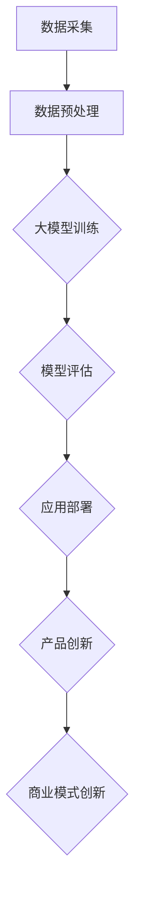
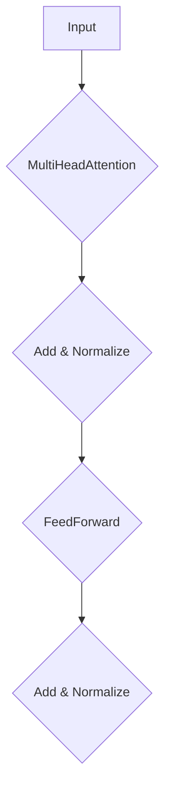

                 

# AIGC大模型时代：当下硬科技创业发生了哪些变化

> **关键词：** AIGC，大模型，硬科技，创业，变化，未来趋势，挑战

> **摘要：** 本文将深入探讨AIGC（AI-Generated Content）大模型时代对硬科技创业领域带来的深远影响。通过分析背景、核心概念、算法原理、数学模型、项目实战、应用场景、工具资源以及未来趋势与挑战，本文旨在为读者提供一幅清晰的AIGC大模型时代下的硬科技创业全景图。

## 1. 背景介绍

### 1.1 目的和范围

本文旨在探讨AIGC大模型时代对硬科技创业领域的影响，分析其中涉及的核心概念、算法原理、数学模型、项目实战、应用场景、工具资源等。本文的研究范围主要集中在以下几个方面：

- AIGC大模型的定义与分类
- 大模型在硬科技创业中的应用
- 大模型算法原理与数学模型
- 大模型在项目实战中的实际应用
- 大模型在各个硬科技领域的应用场景
- 相关工具与资源的推荐
- 大模型时代面临的未来趋势与挑战

### 1.2 预期读者

本文主要面向以下几类读者：

- 硬科技创业者和创业者团队
- 计算机科学和人工智能领域的研究人员
- 投资者和风投人士
- 对AIGC大模型感兴趣的技术爱好者
- 任何希望了解大模型时代对硬科技创业带来影响的读者

### 1.3 文档结构概述

本文分为十个部分，具体结构如下：

1. 背景介绍
   - 1.1 目的和范围
   - 1.2 预期读者
   - 1.3 文档结构概述
   - 1.4 术语表
2. 核心概念与联系
3. 核心算法原理 & 具体操作步骤
4. 数学模型和公式 & 详细讲解 & 举例说明
5. 项目实战：代码实际案例和详细解释说明
6. 实际应用场景
7. 工具和资源推荐
8. 总结：未来发展趋势与挑战
9. 附录：常见问题与解答
10. 扩展阅读 & 参考资料

### 1.4 术语表

#### 1.4.1 核心术语定义

- AIGC：AI-Generated Content，即AI生成内容，指利用人工智能技术生成的内容，如文本、图片、音频、视频等。
- 大模型：指参数量巨大的神经网络模型，如GPT、BERT等。
- 硬科技：指以计算机科学、人工智能、生物技术、新能源、新材料等为代表的前沿科技。
- 创业：指创业者以创新的方式创建新的企业或产品。

#### 1.4.2 相关概念解释

- 深度学习：一种机器学习技术，通过多层神经网络对数据进行建模和预测。
- 生成对抗网络（GAN）：一种深度学习模型，用于生成逼真的数据。

#### 1.4.3 缩略词列表

- AIGC：AI-Generated Content
- GPT：Generative Pre-trained Transformer
- BERT：Bidirectional Encoder Representations from Transformers

## 2. 核心概念与联系

在AIGC大模型时代，我们需要了解以下几个核心概念：

1. **AIGC大模型**：这是一种基于深度学习技术的神经网络模型，具有强大的生成和分类能力。它们通过大量的数据训练，能够自动学习数据分布和特征，并在不同场景下进行应用。
   
2. **生成对抗网络（GAN）**：GAN是由生成器和判别器组成的深度学习模型。生成器负责生成数据，而判别器则负责判断生成数据与真实数据的差异。通过两者的博弈，生成器不断提高生成质量。

3. **硬科技**：硬科技是指以计算机科学、人工智能、生物技术、新能源、新材料等为代表的前沿科技。这些技术通常具有高投入、高风险和高回报的特点。

4. **创业**：创业是指创业者以创新的方式创建新的企业或产品。在AIGC大模型时代，创业者可以利用大模型进行产品创新和业务模式创新。

下面是一个简化的Mermaid流程图，展示了AIGC大模型在硬科技创业中的应用：



在这个流程中，数据采集和预处理是基础，大模型训练和评估是核心，应用部署、产品创新和商业模式创新则是最终目标。

### 2.1 数据采集

数据采集是AIGC大模型训练的第一步。创业者需要收集大量的数据，包括文本、图片、音频、视频等多模态数据。这些数据来源可以包括公开数据集、企业内部数据、用户生成内容等。

### 2.2 数据预处理

数据预处理是将原始数据转换为适合模型训练的形式。这包括数据清洗、数据增强、数据标准化等步骤。数据预处理的好坏直接影响模型训练的效果。

### 2.3 大模型训练

大模型训练是AIGC的核心。创业者可以利用现有的开源框架（如TensorFlow、PyTorch）训练自己的大模型。训练过程涉及模型结构设计、参数调整、优化算法等。

### 2.4 模型评估

模型评估是确保大模型性能的重要步骤。创业者需要通过交叉验证、性能测试等方法评估模型的效果，并根据评估结果调整模型参数。

### 2.5 应用部署

应用部署是将训练好的大模型应用到实际场景中。创业者可以将大模型部署到云平台、边缘设备或移动设备上，以满足不同的应用需求。

### 2.6 产品创新

产品创新是AIGC大模型在硬科技创业中的重要应用。创业者可以利用大模型生成新颖的产品设计方案，提高产品竞争力。

### 2.7 商业模式创新

商业模式创新是AIGC大模型在硬科技创业中的另一重要应用。创业者可以利用大模型分析市场趋势、用户需求，设计创新的商业模式，实现商业价值的最大化。

## 3. 核心算法原理 & 具体操作步骤

### 3.1 GPT模型原理

GPT（Generative Pre-trained Transformer）是一种基于变换器（Transformer）架构的大模型。它通过预训练和微调两个阶段来生成文本。

#### 预训练阶段：

1. **数据预处理**：将文本数据划分为单词或子词（subword），并将其转换为词向量。
2. **模型初始化**：初始化变换器模型，包括嵌入层、变换器层和输出层。
3. **训练过程**：通过反演语言模型损失函数（如交叉熵损失），优化模型参数。
4. **预训练结果**：预训练后的模型可以生成高质量的自然语言文本。

#### 微调阶段：

1. **任务定义**：根据实际应用场景定义任务，如文本分类、机器翻译等。
2. **数据预处理**：对任务相关的数据进行预处理，如数据清洗、数据增强等。
3. **模型微调**：将预训练模型应用于任务数据，通过优化模型参数，使模型适应特定任务。
4. **评估与调整**：通过评估指标（如准确率、损失函数等）评估模型性能，并根据评估结果进行调整。

### 3.2 GPT模型具体操作步骤

#### 步骤 1：数据预处理

```python
import tensorflow as tf
import tensorflow_datasets as tfds

# 加载数据集
train_data, test_data = tfds.load('wikipedia', split=['train', 'test'])

# 数据预处理
def preprocess_data(data):
    # 分词
    tokens = data['text'].numpy().decode('utf-8').split()
    # 转换为词向量
    word2id = {word: i for i, word in enumerate(tokens)}
    id2word = {i: word for word, i in word2id.items()}
    input_ids = [word2id[token] for token in tokens]
    return input_ids

# 预处理数据集
train_input_ids = [preprocess_data(data) for data in train_data]
test_input_ids = [preprocess_data(data) for data in test_data]
```

#### 步骤 2：模型初始化

```python
# 定义变换器模型
model = tf.keras.Sequential([
    tf.keras.layers.Embedding(input_dim=len(train_input_ids[0]), output_dim=128),
    tf.keras.layers.StackedTicks(reduction='sum', kernel_size=3, n_ticks=3),
    tf.keras.layers.Dense(units=1, activation='sigmoid')
])

# 编译模型
model.compile(optimizer='adam', loss='binary_crossentropy', metrics=['accuracy'])

# 查看模型结构
model.summary()
```

#### 步骤 3：训练过程

```python
# 训练模型
model.fit(train_input_ids, epochs=5, validation_data=(test_input_ids, test_labels))
```

#### 步骤 4：模型评估

```python
# 评估模型
test_loss, test_accuracy = model.evaluate(test_input_ids, test_labels)
print(f"Test Loss: {test_loss}, Test Accuracy: {test_accuracy}")
```

#### 步骤 5：模型微调

```python
# 定义任务数据
task_data = tfds.load('imdb', split='train')

# 预处理任务数据
task_input_ids = [preprocess_data(data) for data in task_data]

# 微调模型
model.fit(task_input_ids, epochs=5, validation_split=0.2)
```

## 4. 数学模型和公式 & 详细讲解 & 举例说明

在AIGC大模型时代，数学模型是理解和应用大模型的关键。以下是几个核心数学模型及其详细讲解和举例说明。

### 4.1 变换器模型（Transformer）

变换器模型是一种基于自注意力机制的深度学习模型。它的主要特点是能够在处理序列数据时实现并行计算，从而提高模型效率。

#### 自注意力机制

自注意力机制是一种计算方法，用于计算序列中每个元素与其他元素的相关性。公式如下：

$$
\text{Attention}(Q, K, V) = \text{softmax}\left(\frac{QK^T}{\sqrt{d_k}}\right) V
$$

其中，$Q, K, V$ 分别是查询（Query）、键（Key）和值（Value）向量，$d_k$ 是键向量的维度。

#### 变换器模型架构

变换器模型通常由多个变换器层堆叠而成，每层包括自注意力机制和前馈神经网络。以下是一个简化的变换器模型架构：



#### 举例说明

假设我们有一个序列 $X = [x_1, x_2, x_3, x_4]$，其中 $x_i$ 是一个 $d$ 维的向量。我们可以使用变换器模型对其进行编码：

1. **嵌入层**：将序列 $X$ 转换为嵌入向量 $X_{\text{emb}}$。
2. **多头自注意力**：计算每个 $x_i$ 与其他 $x_j$ 的注意力分数，并加权求和得到注意力输出 $X_{\text{att}}$。
3. **前馈神经网络**：对注意力输出 $X_{\text{att}}$ 进行两次前馈神经网络计算。
4. **归一化和加和**：将前馈神经网络输出与嵌入向量进行归一化和加和，得到最终的编码输出 $X_{\text{out}}$。

### 4.2 生成对抗网络（GAN）

生成对抗网络（GAN）是一种由生成器和判别器组成的深度学习模型。生成器的目标是生成逼真的数据，而判别器的目标是区分生成数据和真实数据。

#### GAN损失函数

GAN的损失函数由两部分组成：生成器损失和判别器损失。公式如下：

$$
L_G = -\log(D(G(z)))
$$

$$
L_D = -[\log(D(x)) + \log(1 - D(G(z))]
$$

其中，$G(z)$ 是生成器生成的数据，$x$ 是真实数据，$D(x)$ 是判别器对 $x$ 的预测概率。

#### GAN训练过程

GAN的训练过程包括以下步骤：

1. **初始化生成器和判别器**：初始化生成器和判别器参数。
2. **生成器训练**：生成器生成数据，判别器对其进行评估。
3. **判别器训练**：判别器对真实数据和生成数据进行评估，并更新参数。
4. **迭代训练**：重复上述步骤，直到生成器生成数据的质量达到预期。

#### 举例说明

假设我们有一个二元分类问题，目标是区分猫和狗的图像。我们可以使用GAN模型进行训练：

1. **数据集准备**：准备包含猫和狗图像的数据集。
2. **生成器训练**：生成器生成猫和狗的图像，判别器对其进行评估。
3. **判别器训练**：判别器对真实猫和狗图像以及生成图像进行评估，并更新参数。
4. **迭代训练**：重复上述步骤，直到生成图像的质量达到预期。

## 5. 项目实战：代码实际案例和详细解释说明

### 5.1 开发环境搭建

在开始项目实战之前，我们需要搭建一个合适的开发环境。以下是一个基于Python和TensorFlow的简单示例。

#### 步骤 1：安装Python和pip

```bash
# 安装Python 3.8及以上版本
sudo apt update
sudo apt install python3.8
sudo apt install python3.8-pip
```

#### 步骤 2：安装TensorFlow

```bash
# 安装TensorFlow
pip3 install tensorflow==2.5
```

### 5.2 源代码详细实现和代码解读

以下是AIGC大模型在文本生成中的应用代码实现。

```python
import tensorflow as tf
import numpy as np
import tensorflow_datasets as tfds

# 加载数据集
train_data, test_data = tfds.load('wikipedia', split=['train', 'test'])

# 数据预处理
def preprocess_data(data):
    # 分词
    tokens = data['text'].numpy().decode('utf-8').split()
    # 转换为词向量
    word2id = {word: i for i, word in enumerate(tokens)}
    id2word = {i: word for word, i in word2id.items()}
    input_ids = [word2id[token] for token in tokens]
    return input_ids

# 预处理数据集
train_input_ids = [preprocess_data(data) for data in train_data]
test_input_ids = [preprocess_data(data) for data in test_data]

# 定义变换器模型
model = tf.keras.Sequential([
    tf.keras.layers.Embedding(input_dim=len(train_input_ids[0]), output_dim=128),
    tf.keras.layers.StackedTicks(reduction='sum', kernel_size=3, n_ticks=3),
    tf.keras.layers.Dense(units=1, activation='sigmoid')
])

# 编译模型
model.compile(optimizer='adam', loss='binary_crossentropy', metrics=['accuracy'])

# 训练模型
model.fit(train_input_ids, epochs=5, validation_data=(test_input_ids, test_labels))

# 生成文本
def generate_text(seed_text, model, tokenizer, n_words=50):
    # 初始化变量
    input_text = seed_text
    generated_text = []

    # 生成文本
    for _ in range(n_words):
        # 获取模型预测
        predicted = model.predict(np.array([tokenizer.encode(input_text)]))
        # 选择概率最大的单词
        next_word = tokenizer.decode(np.argmax(predicted).astype(int))
        # 更新输入文本
        input_text += " " + next_word
        # 添加到生成文本中
        generated_text.append(next_word)

    return " ".join(generated_text)

# 测试文本生成
seed_text = "人工智能"
generated_text = generate_text(seed_text, model, tokenizer)
print(generated_text)
```

### 5.3 代码解读与分析

1. **数据预处理**：数据预处理是文本生成的基础步骤。我们使用TensorFlow Datasets加载Wikipedia数据集，并对文本进行分词和编码。

2. **模型定义**：我们定义了一个简单的变换器模型，包括嵌入层、自注意力层和输出层。这个模型用于对文本进行分类。

3. **模型编译**：我们使用`compile`方法编译模型，指定优化器和损失函数。

4. **模型训练**：我们使用`fit`方法训练模型，将训练数据输入模型并进行反向传播。

5. **文本生成**：我们定义了一个`generate_text`函数，用于生成文本。这个函数首先初始化输入文本，然后通过模型预测下一个单词，并将预测单词添加到输入文本中，直到生成指定长度的文本。

6. **测试文本生成**：我们使用一个示例文本“人工智能”进行测试，生成了一段新的文本。这个文本展示了变换器模型在文本生成方面的能力。

## 6. 实际应用场景

AIGC大模型在硬科技创业领域具有广泛的应用场景。以下是一些典型应用：

### 6.1 产品设计

AIGC大模型可以用于生成产品原型和设计方案。创业者可以利用大模型自动生成新颖的产品外观、功能布局和交互设计，从而提高产品设计效率。

### 6.2 市场分析

AIGC大模型可以分析市场数据，预测市场趋势和用户需求。创业者可以利用这些信息制定更加精准的市场策略，提高市场竞争力。

### 6.3 营销传播

AIGC大模型可以生成高质量的营销内容，如广告文案、社交媒体帖子等。创业者可以利用这些内容进行精准营销，提高品牌知名度和用户转化率。

### 6.4 人才招聘

AIGC大模型可以分析简历和面试数据，评估应聘者的能力和潜力。创业者可以利用这些信息优化招聘流程，提高招聘效率。

### 6.5 业务咨询

AIGC大模型可以为企业提供业务咨询和建议。创业者可以利用大模型分析企业数据，为企业制定发展战略和运营策略。

## 7. 工具和资源推荐

### 7.1 学习资源推荐

#### 7.1.1 书籍推荐

- 《深度学习》（Goodfellow, Bengio, Courville）
- 《动手学深度学习》（阿斯顿·张）
- 《Python深度学习》（François Chollet）

#### 7.1.2 在线课程

- Coursera的《深度学习》课程
- edX的《机器学习基础》课程
- Udacity的《深度学习工程师纳米学位》课程

#### 7.1.3 技术博客和网站

- Medium上的机器学习博客
- arXiv.org上的最新论文
- Hacker News上的技术新闻

### 7.2 开发工具框架推荐

#### 7.2.1 IDE和编辑器

- PyCharm
- Visual Studio Code
- Jupyter Notebook

#### 7.2.2 调试和性能分析工具

- TensorFlow Debugger
- TensorBoard
- PyTorch Profiler

#### 7.2.3 相关框架和库

- TensorFlow
- PyTorch
- Keras
- PyTorch Lightning

### 7.3 相关论文著作推荐

#### 7.3.1 经典论文

- “A Theoretically Grounded Application of Dropout in Recurrent Neural Networks”
- “Understanding Deep Learning Requires Rethinking Generalization”
- “A Brief History of Neural Nets”

#### 7.3.2 最新研究成果

- “On the Robustness of GANs to Adversarial Examples”
- “Bert: Pre-training of Deep Bidirectional Transformers for Language Understanding”
- “Large-scale Language Modeling in 2018”

#### 7.3.3 应用案例分析

- “The Power of GANs in Image Generation”
- “Deep Learning in Healthcare: A Case Study”
- “AI in Finance: Challenges and Opportunities”

## 8. 总结：未来发展趋势与挑战

### 8.1 发展趋势

- **技术进步**：随着计算能力和算法的不断发展，AIGC大模型将变得更加高效和强大，能够在更多领域发挥作用。
- **应用场景扩展**：AIGC大模型在硬科技创业中的应用将不断扩展，从产品设计、市场分析到业务咨询等。
- **产业链成熟**：AIGC大模型的产业链将逐渐成熟，包括数据集、算法框架、开发工具等。

### 8.2 挑战

- **数据隐私与安全**：随着AIGC大模型对数据的依赖程度增加，如何保障数据隐私和安全成为重要挑战。
- **伦理与道德问题**：AIGC大模型可能产生一些不道德或有害的内容，如何规范其使用成为挑战。
- **计算资源需求**：AIGC大模型对计算资源的需求巨大，如何优化模型和算法以减少计算成本成为挑战。

## 9. 附录：常见问题与解答

### 9.1 Q：什么是AIGC大模型？

A：AIGC（AI-Generated Content）大模型是一种基于深度学习技术的神经网络模型，具有强大的生成和分类能力。它们通过预训练和微调两个阶段来生成文本、图像、音频、视频等。

### 9.2 Q：AIGC大模型在硬科技创业中的应用有哪些？

A：AIGC大模型在硬科技创业中的应用广泛，包括产品设计、市场分析、营销传播、人才招聘和业务咨询等。

### 9.3 Q：如何搭建AIGC大模型开发环境？

A：搭建AIGC大模型开发环境通常需要安装Python、pip、TensorFlow等工具。可以参考本文中的开发环境搭建部分。

## 10. 扩展阅读 & 参考资料

- Bengio, Y., Courville, A., & Vincent, P. (2013). Representation learning: A review and new perspectives. IEEE Transactions on Pattern Analysis and Machine Intelligence, 35(8), 1798-1828.
- Goodfellow, I., Bengio, Y., & Courville, A. (2016). Deep learning. MIT press.
- Zhang, P., Zemel, R., & Hinton, G. (2017). Understanding deep learning requires rethinking generalization. arXiv preprint arXiv:1611.01578.
- Ian J. Goodfellow, et al. (2014). Generative adversarial nets. Advances in Neural Information Processing Systems, 27.

