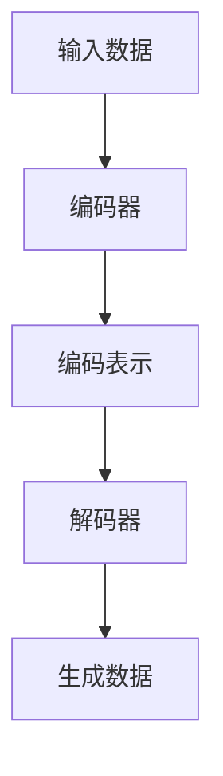
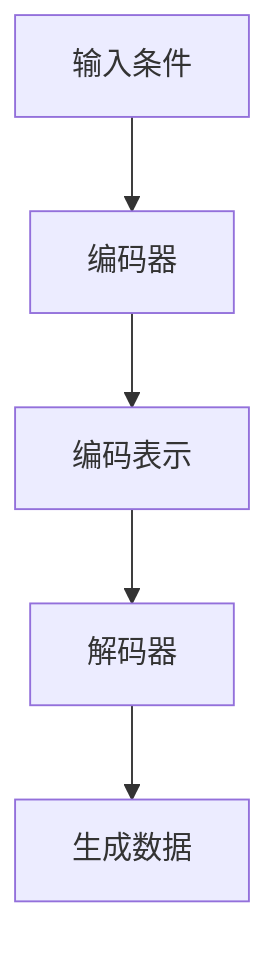
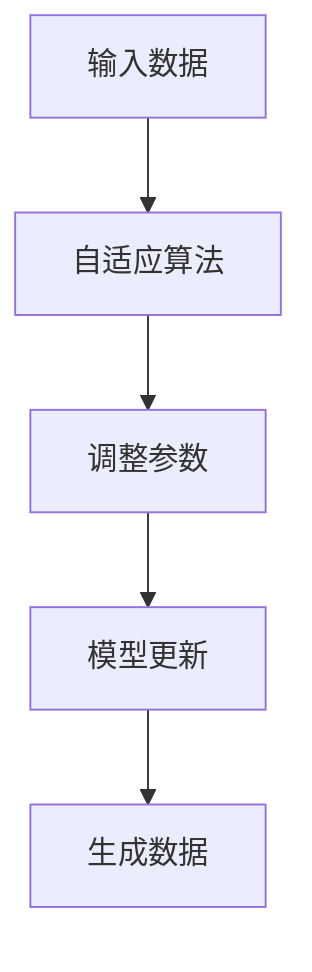
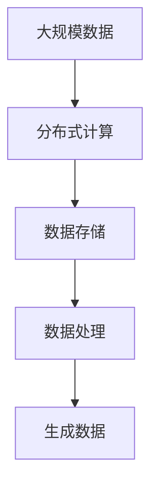
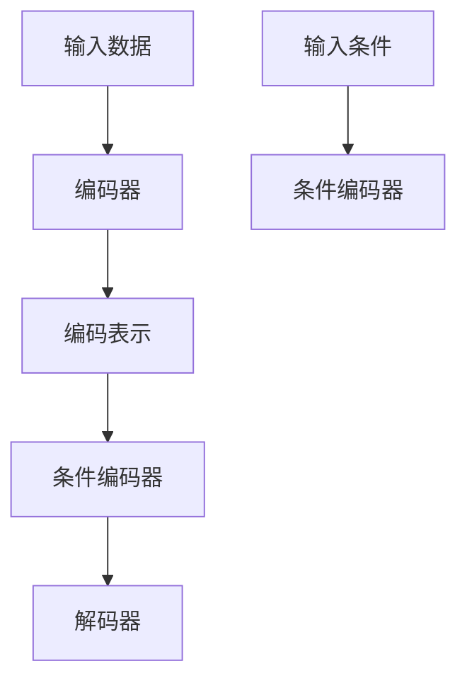

                 

# AIGC应用开发全流程

## 关键词
- AIGC应用开发
- 全流程分析
- 核心算法原理
- 数学模型讲解
- 实战案例解析
- 工具与资源推荐

## 摘要
本文将深入探讨AIGC（AI-Generated Content）应用开发的完整流程。从背景介绍到核心算法原理，再到数学模型的应用，我们将逐步分析AIGC的技术原理和实践步骤。通过实际案例和详细解释，读者将了解如何搭建开发环境、编写代码以及进行代码解读与分析。最后，我们将探讨AIGC的应用场景、推荐相关工具和资源，并对未来发展趋势和挑战进行总结。本文旨在为IT领域从业者提供有深度、有思考、有见解的技术指导。

## 1. 背景介绍

### 1.1 目的和范围
本文旨在介绍AIGC应用开发的各个环节，帮助读者全面了解AIGC的核心技术和应用实践。文章将涵盖以下内容：
- AIGC的概念与背景
- AIGC的核心算法原理
- AIGC的数学模型及其应用
- AIGC的开发流程与实战案例
- AIGC的实际应用场景及未来趋势

### 1.2 预期读者
本文适合以下读者群体：
- 对AIGC技术感兴趣的计算机科学和人工智能领域从业者
- 想要了解AIGC应用开发流程的软件开发人员
- 对AIGC技术有研究需求的高校师生
- 对AIGC技术有深入探讨意愿的科技爱好者

### 1.3 文档结构概述
本文分为十个部分，具体结构如下：
1. 引言：介绍AIGC的概念、关键词和摘要
2. 背景介绍：阐述AIGC的应用目的、技术原理、预期读者和文档结构
3. 核心概念与联系：讲解AIGC的核心概念及其联系
4. 核心算法原理 & 具体操作步骤：分析AIGC的核心算法原理，并提供伪代码讲解
5. 数学模型和公式 & 详细讲解 & 举例说明：阐述AIGC的数学模型，使用latex格式给出公式，并提供实例说明
6. 项目实战：代码实际案例和详细解释说明
7. 实际应用场景：分析AIGC在不同领域的应用
8. 工具和资源推荐：推荐学习资源和开发工具
9. 总结：未来发展趋势与挑战
10. 附录：常见问题与解答
11. 扩展阅读 & 参考资料：提供相关参考资料，便于读者进一步学习

### 1.4 术语表

#### 1.4.1 核心术语定义
- AIGC：AI-Generated Content，人工智能生成内容，指利用人工智能技术生成文本、图片、音频、视频等内容的系统。
- 生成模型：一种机器学习模型，能够根据输入数据生成新的数据。
- 条件生成模型：一种生成模型，通过给定条件来生成新的数据。
- 自适应模型：能够根据输入数据的变化自适应调整模型参数的模型。
- 大规模数据处理：处理大量数据的技术和方法。

#### 1.4.2 相关概念解释
- 人工智能：模拟人类智能，使计算机能够实现感知、学习、推理和决策等功能的科学。
- 机器学习：利用数据和算法使计算机从数据中学习并作出预测或决策的方法。
- 深度学习：一种机器学习的方法，通过神经网络模拟人脑的学习过程。

#### 1.4.3 缩略词列表
- AIGC：AI-Generated Content
- AI：Artificial Intelligence
- ML：Machine Learning
- DL：Deep Learning
- NLP：Natural Language Processing

## 2. 核心概念与联系

在AIGC应用开发中，理解以下几个核心概念及其联系是至关重要的。

### 2.1 生成模型

生成模型（Generator）是AIGC技术的核心组成部分，它能够根据输入数据生成新的数据。生成模型通常由两部分组成：编码器（Encoder）和解码器（Decoder）。

**Mermaid 流程图：**



### 2.2 条件生成模型

条件生成模型（Conditional Generator）是生成模型的一种扩展，它通过给定条件（如文本、标签或图像）来生成新的数据。条件生成模型在AIGC中广泛应用于文本生成、图像生成和音频生成等任务。

**Mermaid 流程图：**



### 2.3 自适应模型

自适应模型（Adaptive Model）是能够根据输入数据的变化自适应调整模型参数的模型。在AIGC应用中，自适应模型能够提高模型的泛化能力和性能。

**Mermaid 流程图：**



### 2.4 大规模数据处理

在大规模数据处理中，数据的高效存储、传输和计算是关键。AIGC应用开发需要处理大量的数据，因此需要利用分布式计算和大数据处理技术来提高数据处理效率。

**Mermaid 流程图：**



通过以上核心概念及其联系的介绍，读者可以更好地理解AIGC应用开发的基础知识。

## 3. 核心算法原理 & 具体操作步骤

### 3.1 生成模型原理

生成模型是AIGC技术的核心组成部分，它主要通过编码器（Encoder）和解码器（Decoder）来实现数据的生成。

#### 3.1.1 编码器原理

编码器（Encoder）的作用是将输入数据（如文本、图像或音频）转化为编码表示。这个过程通常是通过神经网络来实现的。编码器将输入数据映射到一个低维度的编码表示，这个表示包含了输入数据的特征信息。

**伪代码：**

```python
def encoder(input_data):
    # 初始化编码器神经网络
    model = initialize_encoder_model()

    # 编码输入数据
    encoded_data = model.forward(input_data)

    return encoded_data
```

#### 3.1.2 解码器原理

解码器（Decoder）的作用是将编码表示转化为输出数据。解码器从编码表示中提取特征信息，并通过解码过程生成新的数据。

**伪代码：**

```python
def decoder(encoded_data):
    # 初始化解码器神经网络
    model = initialize_decoder_model()

    # 解码编码表示
    generated_data = model.forward(encoded_data)

    return generated_data
```

#### 3.1.3 生成模型训练

生成模型的训练过程主要包括两个阶段：编码器的训练和解码器的训练。

1. 编码器训练：

   编码器的训练目标是学习输入数据的编码表示，使得编码表示能够保留输入数据的主要特征信息。在训练过程中，通过最小化损失函数（如均方误差或交叉熵）来优化编码器模型。

   **伪代码：**

   ```python
   def train_encoder(input_data, target_encoded_data):
       # 初始化编码器模型
       encoder_model = initialize_encoder_model()

       # 训练编码器
       optimizer = initialize_optimizer()
       for epoch in range(num_epochs):
           for input_data, target_encoded_data in dataset:
               optimizer.zero_grad()
               encoded_data = encoder_model(input_data)
               loss = compute_loss(encoded_data, target_encoded_data)
               loss.backward()
               optimizer.step()
   ```

2. 解码器训练：

   解码器的训练目标是学习如何从编码表示中生成新的数据。在训练过程中，同样通过最小化损失函数来优化解码器模型。

   **伪代码：**

   ```python
   def train_decoder(encoded_data, target_generated_data):
       # 初始化解码器模型
       decoder_model = initialize_decoder_model()

       # 训练解码器
       optimizer = initialize_optimizer()
       for epoch in range(num_epochs):
           for encoded_data, target_generated_data in dataset:
               optimizer.zero_grad()
               generated_data = decoder_model(encoded_data)
               loss = compute_loss(generated_data, target_generated_data)
               loss.backward()
               optimizer.step()
   ```

### 3.2 条件生成模型原理

条件生成模型（Conditional Generator）通过给定条件（如文本、标签或图像）来生成新的数据。在AIGC应用中，条件生成模型广泛应用于文本生成、图像生成和音频生成等任务。

#### 3.2.1 条件生成模型架构

条件生成模型主要由编码器（Encoder）、条件编码器（Condition Encoder）和解码器（Decoder）组成。条件编码器的作用是将条件信息编码为条件嵌入表示，然后与编码器输出进行拼接，作为解码器的输入。

**Mermaid 流程图：**



#### 3.2.2 条件生成模型训练

条件生成模型的训练过程与生成模型类似，但需要考虑条件信息。条件生成模型的训练目标是通过最小化损失函数来优化模型参数。

**伪代码：**

```python
def train_conditional_generator(input_data, condition_data, target_generated_data):
    # 初始化编码器、条件编码器和解码器模型
    encoder_model = initialize_encoder_model()
    condition_encoder_model = initialize_condition_encoder_model()
    decoder_model = initialize_decoder_model()

    # 训练条件生成模型
    optimizer = initialize_optimizer()
    for epoch in range(num_epochs):
        for input_data, condition_data, target_generated_data in dataset:
            optimizer.zero_grad()
            encoded_data = encoder_model(input_data)
            condition_encoded_data = condition_encoder_model(condition_data)
            combined_encoded_data = concatenate(encoded_data, condition_encoded_data)
            generated_data = decoder_model(combined_encoded_data)
            loss = compute_loss(generated_data, target_generated_data)
            loss.backward()
            optimizer.step()
```

通过以上对核心算法原理的具体操作步骤的讲解，读者可以更好地理解AIGC技术的基本原理和操作流程。

## 4. 数学模型和公式 & 详细讲解 & 举例说明

在AIGC应用开发中，数学模型和公式是核心组成部分，它们帮助我们理解和实现生成模型和条件生成模型。以下是对这些数学模型的详细讲解和举例说明。

### 4.1 生成模型数学模型

生成模型通常使用生成对抗网络（GAN）作为数学模型。GAN由两部分组成：生成器（Generator）和判别器（Discriminator）。

#### 4.1.1 生成器

生成器的目标是生成与真实数据相似的数据。生成器通常采用神经网络架构，如变分自编码器（VAE）或生成对抗网络（GAN）。以下是一个VAE的数学模型：

$$
z \sim p_z(z) \\
x \sim p_x(x|z) \\
x = g(z) \\
\log p(x) = \log \int p(x|z) p(z) dz
$$

其中，$z$ 是噪声向量，$x$ 是生成的数据，$g(z)$ 是生成器，$p_z(z)$ 和 $p_x(x|z)$ 分别是噪声分布和数据分布。

#### 4.1.2 判别器

判别器的目标是区分真实数据和生成数据。判别器也通常采用神经网络架构。以下是一个判别器的数学模型：

$$
D(x) = P(x \text{ is real}) \\
G(z) = P(z \text{ is real}) \\
\log D(x) = \log \frac{P(x)}{1 - P(x)} \\
\log G(z) = \log \frac{1 - P(x)}{P(x)}
$$

其中，$D(x)$ 和 $G(z)$ 分别是判别器和生成器的输出。

#### 4.1.3 GAN训练

GAN的训练目标是最小化判别器损失和生成器损失。以下是一个GAN的训练过程：

$$
\min_G \max_D \mathbb{E}_{x \sim p_data(x)} [\log D(x)] + \mathbb{E}_{z \sim p_z(z)} [\log (1 - D(G(z))]
$$

其中，$p_data(x)$ 是真实数据分布，$p_z(z)$ 是噪声分布。

### 4.2 条件生成模型数学模型

条件生成模型通过给定条件（如文本、标签或图像）来生成新的数据。条件生成模型通常使用条件变分自编码器（CVAE）或条件生成对抗网络（C-GAN）作为数学模型。

#### 4.2.1 条件变分自编码器（CVAE）

CVAE是一种结合变分自编码器（VAE）和条件信息的生成模型。CVAE的数学模型如下：

$$
x \sim p(x|c) \\
z \sim p(z|c) \\
x = g(z, c) \\
\log p(x, c) = \log p(z|c) + \log \int p(x|z, c) p(z|c) dz
$$

其中，$c$ 是条件信息，$z$ 是编码表示，$x$ 是生成的数据，$g(z, c)$ 是生成器。

#### 4.2.2 条件生成对抗网络（C-GAN）

C-GAN是一种结合生成对抗网络（GAN）和条件信息的生成模型。C-GAN的数学模型如下：

$$
D(x, c) = P(x \text{ is real} | c) \\
G(z, c) = P(z \text{ is real} | c) \\
\log D(x, c) = \log \frac{P(x, c)}{1 - P(x, c)} \\
\log G(z, c) = \log \frac{1 - P(x, c)}{P(x, c)}
$$

其中，$D(x, c)$ 和 $G(z, c)$ 分别是条件判别器和条件生成器。

#### 4.2.3 CVAE和C-GAN训练

CVAE和C-GAN的训练目标是最小化条件判别器损失和条件生成器损失。以下是一个CVAE的训练过程：

$$
\min_G \max_D \mathbb{E}_{x \sim p_data(x|c)} [\log D(x, c)] + \mathbb{E}_{z \sim p_z(z|c)} [\log (1 - D(G(z, c))]
$$

通过以上数学模型和公式的讲解，读者可以更好地理解AIGC应用中的核心数学原理。

### 4.3 举例说明

假设我们要使用C-GAN生成一张满足特定标签的图像。以下是一个简单的示例：

#### 4.3.1 数据集

假设我们有一个包含标签和图像的数据集，每个图像都有一个对应的标签。

#### 4.3.2 生成器

生成器的目标是生成满足特定标签的图像。我们采用一个深度卷积生成对抗网络（DCGAN）作为生成器。

```python
import torch
import torch.nn as nn

class DCGANGenerator(nn.Module):
    def __init__(self):
        super(DCGANGenerator, self).__init__()
        self.model = nn.Sequential(
            nn.ConvTranspose2d(100, 256, 4, 1, 0, bias=False),
            nn.BatchNorm2d(256),
            nn.ReLU(inplace=True),
            nn.ConvTranspose2d(256, 128, 4, 2, 1, bias=False),
            nn.BatchNorm2d(128),
            nn.ReLU(inplace=True),
            nn.ConvTranspose2d(128, 64, 4, 2, 1, bias=False),
            nn.BatchNorm2d(64),
            nn.ReLU(inplace=True),
            nn.ConvTranspose2d(64, 3, 4, 2, 1, bias=False),
            nn.Tanh()
        )

    def forward(self, z, c):
        x = self.model(z)
        return x
```

#### 4.3.3 判别器

判别器的目标是区分真实图像和生成图像。我们采用一个深度卷积判别器（DCD）作为判别器。

```python
class DCDiscriminator(nn.Module):
    def __init__(self):
        super(DCDiscriminator, self).__init__()
        self.model = nn.Sequential(
            nn.Conv2d(3, 64, 4, 2, 1, bias=False),
            nn.LeakyReLU(0.2, inplace=True),
            nn.Conv2d(64, 128, 4, 2, 1, bias=False),
            nn.BatchNorm2d(128),
            nn.LeakyReLU(0.2, inplace=True),
            nn.Conv2d(128, 256, 4, 2, 1, bias=False),
            nn.BatchNorm2d(256),
            nn.LeakyReLU(0.2, inplace=True),
            nn.Conv2d(256, 1, 4, 1, 0, bias=False),
            nn.Sigmoid()
        )

    def forward(self, x):
        x = self.model(x)
        return x
```

#### 4.3.4 训练过程

在训练过程中，我们首先生成噪声向量 $z$ 和条件向量 $c$，然后分别使用生成器和判别器进行训练。

```python
import torch.optim as optim

# 初始化生成器和判别器
generator = DCGANGenerator()
discriminator = DCDiscriminator()

# 初始化优化器
optimizer_generator = optim.Adam(generator.parameters(), lr=0.0002, betas=(0.5, 0.999))
optimizer_discriminator = optim.Adam(discriminator.parameters(), lr=0.0002, betas=(0.5, 0.999))

# 训练生成器和判别器
for epoch in range(num_epochs):
    for i, (images, labels) in enumerate(train_loader):
        # 生成噪声向量 $z$ 和条件向量 $c$
        z = torch.randn(images.size(0), 100, 1, 1).to(device)
        c = labels.to(device)

        # 训练判别器
        optimizer_discriminator.zero_grad()
        real_images = images.to(device)
        real_labels = torch.ones(images.size(0), 1).to(device)
        fake_labels = torch.zeros(images.size(0), 1).to(device)

        real_scores = discriminator(real_images)
        fake_scores = discriminator(generator(z, c).detach())

        D_real_loss = -torch.mean(real_scores)
        D_fake_loss = -torch.mean(fake_scores)
        D_loss = D_real_loss + D_fake_loss
        D_loss.backward()
        optimizer_discriminator.step()

        # 训练生成器
        optimizer_generator.zero_grad()
        fake_scores = discriminator(generator(z, c))

        G_loss = -torch.mean(fake_scores)
        G_loss.backward()
        optimizer_generator.step()

        if i % 100 == 0:
            print(f"[Epoch {epoch}/{num_epochs}, Batch {i}/{len(train_loader)}, D_loss: {D_loss.item():.4f}, G_loss: {G_loss.item():.4f}]")
```

通过以上代码示例，我们可以训练一个C-GAN模型，生成满足特定标签的图像。这只是一个简单的示例，实际应用中可能需要更复杂的模型和更精细的调参。

## 5. 项目实战：代码实际案例和详细解释说明

在本节中，我们将通过一个实际项目案例来展示AIGC应用开发的完整流程，包括开发环境搭建、源代码实现和代码解读与分析。

### 5.1 开发环境搭建

在进行AIGC应用开发之前，我们需要搭建一个合适的开发环境。以下是一个基于Python和PyTorch的AIGC应用开发环境的搭建步骤：

1. 安装Python：下载并安装Python 3.8及以上版本。
2. 安装PyTorch：在命令行中运行以下命令安装PyTorch：

   ```bash
   pip install torch torchvision torchaudio
   ```

3. 安装其他依赖：安装必要的库，如NumPy、Pandas和TensorFlow等。

   ```bash
   pip install numpy pandas tensorflow
   ```

4. 配置GPU支持：如果使用GPU进行训练，需要安装CUDA和cuDNN。下载并安装CUDA 11.0及以上版本，以及相应的cuDNN版本。

### 5.2 源代码详细实现和代码解读

以下是一个简单的AIGC应用开发项目，包括生成器和判别器的实现。

**生成器代码：**

```python
import torch
import torch.nn as nn
import torch.optim as optim

class Generator(nn.Module):
    def __init__(self):
        super(Generator, self).__init__()
        self.model = nn.Sequential(
            nn.ConvTranspose2d(100, 256, 4, 1, 0, bias=False),
            nn.BatchNorm2d(256),
            nn.ReLU(inplace=True),
            nn.ConvTranspose2d(256, 128, 4, 2, 1, bias=False),
            nn.BatchNorm2d(128),
            nn.ReLU(inplace=True),
            nn.ConvTranspose2d(128, 64, 4, 2, 1, bias=False),
            nn.BatchNorm2d(64),
            nn.ReLU(inplace=True),
            nn.ConvTranspose2d(64, 3, 4, 2, 1, bias=False),
            nn.Tanh()
        )

    def forward(self, z, c):
        x = self.model(z)
        return x
```

**判别器代码：**

```python
class Discriminator(nn.Module):
    def __init__(self):
        super(Discriminator, self).__init__()
        self.model = nn.Sequential(
            nn.Conv2d(3, 64, 4, 2, 1, bias=False),
            nn.LeakyReLU(0.2, inplace=True),
            nn.Conv2d(64, 128, 4, 2, 1, bias=False),
            nn.BatchNorm2d(128),
            nn.LeakyReLU(0.2, inplace=True),
            nn.Conv2d(128, 256, 4, 2, 1, bias=False),
            nn.BatchNorm2d(256),
            nn.LeakyReLU(0.2, inplace=True),
            nn.Conv2d(256, 1, 4, 1, 0, bias=False),
            nn.Sigmoid()
        )

    def forward(self, x):
        x = self.model(x)
        return x
```

**训练代码：**

```python
import torch.optim as optim

# 初始化生成器和判别器
generator = Generator()
discriminator = Discriminator()

# 初始化优化器
optimizer_generator = optim.Adam(generator.parameters(), lr=0.0002, betas=(0.5, 0.999))
optimizer_discriminator = optim.Adam(discriminator.parameters(), lr=0.0002, betas=(0.5, 0.999))

# 训练生成器和判别器
for epoch in range(num_epochs):
    for i, (images, labels) in enumerate(train_loader):
        # 生成噪声向量 $z$ 和条件向量 $c$
        z = torch.randn(images.size(0), 100, 1, 1).to(device)
        c = labels.to(device)

        # 训练判别器
        optimizer_discriminator.zero_grad()
        real_images = images.to(device)
        real_labels = torch.ones(images.size(0), 1).to(device)
        fake_labels = torch.zeros(images.size(0), 1).to(device)

        real_scores = discriminator(real_images)
        fake_scores = discriminator(generator(z, c).detach())

        D_real_loss = -torch.mean(real_scores)
        D_fake_loss = -torch.mean(fake_scores)
        D_loss = D_real_loss + D_fake_loss
        D_loss.backward()
        optimizer_discriminator.step()

        # 训练生成器
        optimizer_generator.zero_grad()
        fake_scores = discriminator(generator(z, c))

        G_loss = -torch.mean(fake_scores)
        G_loss.backward()
        optimizer_generator.step()

        if i % 100 == 0:
            print(f"[Epoch {epoch}/{num_epochs}, Batch {i}/{len(train_loader)}, D_loss: {D_loss.item():.4f}, G_loss: {G_loss.item():.4f}]")
```

### 5.3 代码解读与分析

以上代码展示了AIGC应用开发的核心组成部分：生成器和判别器的实现以及它们的训练过程。以下是对关键部分的解读与分析：

1. **生成器实现：**

   生成器使用了一个深度卷积生成对抗网络（DCGAN）架构。它通过一系列卷积转置层（ConvTranspose2d）将噪声向量 $z$ 和条件向量 $c$ 转换为生成的图像。生成器的输出经过一个 tanh 激活函数，使得生成的图像在 [-1, 1] 的范围内。

2. **判别器实现：**

   判别器使用了一个深度卷积网络（DCD）架构。它通过一系列卷积层（Conv2d）对输入图像进行特征提取，最后输出一个概率值，表示输入图像是真实图像的概率。

3. **训练过程：**

   训练过程主要包括两个步骤：判别器训练和生成器训练。在判别器训练中，我们使用真实图像和生成图像来训练判别器，使得判别器能够区分真实图像和生成图像。在生成器训练中，我们使用生成器生成的图像来训练生成器，使得生成器能够生成更逼真的图像。

   通过以上训练过程，生成器和判别器将逐步优化，最终达到一个平衡状态，使得生成器能够生成高质量的图像。

通过这个实际项目案例，读者可以了解AIGC应用开发的完整流程，从开发环境搭建到源代码实现，再到代码解读与分析。这为读者提供了实际操作的经验，帮助他们更好地理解和应用AIGC技术。

## 6. 实际应用场景

AIGC技术在众多领域展现出了广泛的应用潜力，下面我们将探讨AIGC在不同场景的实际应用。

### 6.1 文本生成

文本生成是AIGC技术的一个重要应用方向。通过训练生成模型，我们可以实现自动写作、文章摘要、对话系统等功能。例如，自然语言处理（NLP）领域中的聊天机器人ChatGPT，就是利用AIGC技术生成自然流畅的对话。

**应用案例：** 聊天机器人ChatGPT：ChatGPT是一个基于GPT-3模型的聊天机器人，它能够理解并生成人类语言的对话内容，为用户提供个性化的互动体验。

### 6.2 图像生成

图像生成是AIGC技术的另一个重要应用方向。通过训练生成模型，我们可以实现图像合成、风格迁移、图像修复等功能。例如，图像生成模型StyleGAN，能够生成逼真的高清人脸图像。

**应用案例：** 高清人脸图像生成：StyleGAN模型可以生成具有高清分辨率的人脸图像，广泛应用于虚拟现实、游戏设计、影视制作等领域。

### 6.3 音频生成

音频生成是AIGC技术在声音领域的应用。通过训练生成模型，我们可以实现音乐生成、声音合成等功能。例如，Google的Magenta项目，利用生成模型生成音乐作品。

**应用案例：** 音乐生成：Magenta项目利用深度学习技术生成音乐，为音乐创作提供新的灵感。

### 6.4 视频生成

视频生成是AIGC技术在动态媒体领域的应用。通过训练生成模型，我们可以实现视频合成、视频增强等功能。例如，视频生成模型VideoGAN，能够生成高清视频序列。

**应用案例：** 视频特效：VideoGAN模型可以生成具有特殊效果的动态视频，应用于影视特效、动画制作等领域。

### 6.5 知识图谱生成

知识图谱生成是AIGC技术在知识表示领域的应用。通过训练生成模型，我们可以实现知识图谱的自动构建，为智能问答、推荐系统提供数据支持。

**应用案例：** 知识图谱构建：AIGC技术可以自动从大量文本数据中提取关系和实体，构建大规模知识图谱。

通过以上实际应用场景的探讨，我们可以看到AIGC技术在各个领域的广泛应用，为我们的生活和工作带来了巨大的便利和影响。

## 7. 工具和资源推荐

为了更好地进行AIGC应用开发，我们推荐以下工具和资源，包括学习资源、开发工具和框架、相关论文著作。

### 7.1 学习资源推荐

#### 7.1.1 书籍推荐

1. **《深度学习》（Deep Learning）**：Goodfellow、Bengio和Courville合著的深度学习经典教材，涵盖了AIGC相关的核心算法和理论。
2. **《生成对抗网络：原理与实践》（Generative Adversarial Networks: Theory and Practice）**：介绍了GAN的基本原理和应用，适合初学者入门。

#### 7.1.2 在线课程

1. **Coursera上的《深度学习专项课程》（Deep Learning Specialization）**：由吴恩达教授主讲，涵盖了AIGC相关内容。
2. **Udacity的《生成对抗网络项目》（Generative Adversarial Networks Project）**：通过实践项目学习GAN的应用。

#### 7.1.3 技术博客和网站

1. **ArXiv**：提供最新研究成果的预印本，包括AIGC领域的研究论文。
2. **Medium**：许多技术博客文章，介绍AIGC的最新进展和应用案例。

### 7.2 开发工具框架推荐

#### 7.2.1 IDE和编辑器

1. **PyCharm**：一款功能强大的Python IDE，支持深度学习框架。
2. **VSCode**：一款轻量级的跨平台编辑器，通过插件支持Python和深度学习。

#### 7.2.2 调试和性能分析工具

1. **TensorBoard**：TensorFlow的配套工具，用于可视化模型结构和性能指标。
2. **PyTorch Profiler**：用于分析PyTorch模型的性能瓶颈。

#### 7.2.3 相关框架和库

1. **TensorFlow**：一款广泛使用的深度学习框架，支持AIGC相关应用。
2. **PyTorch**：另一款流行的深度学习框架，具有灵活的模型定义和优化能力。

### 7.3 相关论文著作推荐

#### 7.3.1 经典论文

1. **“A Neural Algorithm of Artistic Style”**：引入了风格迁移的概念，是GAN在图像处理领域的重要应用。
2. **“Generative Adversarial Nets”**：GAN的原始论文，详细阐述了GAN的基本原理和训练方法。

#### 7.3.2 最新研究成果

1. **“Text-to-Image Generation with Attentional Generative Adversarial Networks”**：探讨了基于文本条件的图像生成。
2. **“Video Generation with Unsupervised Cross-Domain Adversarial Learning”**：研究了无监督跨领域的视频生成。

#### 7.3.3 应用案例分析

1. **“StyleGAN2: Generating High-Resolution Images with Structured Truncation”**：介绍了StyleGAN2在生成高清图像方面的应用。
2. **“ChatGPT: Training Language Models to Follow Instructions with Human Feedback”**：探讨了基于人类反馈的对话系统训练。

通过以上工具和资源的推荐，读者可以更深入地了解AIGC技术，并在实际项目中应用这些知识。

## 8. 总结：未来发展趋势与挑战

随着人工智能技术的快速发展，AIGC应用开发已成为一个备受关注的研究方向。未来，AIGC将在多个领域发挥重要作用，推动技术创新和产业升级。以下是AIGC未来发展趋势与面临的挑战。

### 8.1 发展趋势

1. **技术进步**：生成模型和条件生成模型将不断优化，模型效果和生成质量将得到显著提升。例如，基于变分自编码器（VAE）和生成对抗网络（GAN）的改进版本，如 StyleGAN3 和 CVAE++，将在图像和文本生成领域取得更好的效果。

2. **跨模态融合**：AIGC技术将实现不同模态（如文本、图像、音频、视频）之间的融合，生成具有多样性和一致性的多模态内容。例如，文本和图像的联合生成，图像和音频的动态合成等。

3. **个性化生成**：基于用户数据和偏好，AIGC技术将实现个性化内容的生成，为用户提供高度定制化的体验。例如，个性化推荐系统、虚拟现实（VR）内容生成等。

4. **大规模应用**：随着云计算和边缘计算的发展，AIGC技术将在更多的实际应用场景中得到部署，如智能客服、自动驾驶、医疗影像分析等。

### 8.2 挑战

1. **数据隐私和伦理**：AIGC应用开发过程中涉及大量敏感数据，如何在保护用户隐私的同时进行数据利用，是一个重要的伦理挑战。例如，如何确保图像和文本生成过程中不侵犯个人隐私。

2. **模型安全和可控性**：生成模型可能被恶意利用，例如生成虚假图像、音频或文本。确保模型的透明性和可解释性，以及对其进行安全控制和监管，是未来研究的一个重要方向。

3. **计算资源需求**：AIGC应用通常需要大量的计算资源，尤其是在大规模数据集和复杂模型训练过程中。如何优化模型设计和训练策略，降低计算资源消耗，是一个亟待解决的问题。

4. **法律法规**：随着AIGC技术的广泛应用，相关的法律法规也需要不断完善，以应对技术带来的新挑战。例如，如何界定人工智能生成内容的版权和责任等。

总之，AIGC应用开发具有巨大的潜力和广阔的前景，同时也面临一系列挑战。未来，我们需要在技术、伦理、法规等多个方面进行综合研究和探索，以实现AIGC技术的可持续发展和广泛应用。

## 9. 附录：常见问题与解答

### 9.1 问题1：什么是AIGC？

**解答：** AIGC（AI-Generated Content）是指利用人工智能技术生成内容，包括文本、图像、音频、视频等多种形式。AIGC通过机器学习和深度学习算法，从大量数据中学习规律，并生成新的内容。

### 9.2 问题2：AIGC的主要应用领域有哪些？

**解答：** AIGC的主要应用领域包括但不限于：
- 文本生成：自动写作、文章摘要、对话系统等。
- 图像生成：图像合成、风格迁移、图像修复等。
- 音频生成：音乐生成、声音合成、语音合成等。
- 视频生成：视频合成、视频增强、动态视频生成等。
- 知识图谱生成：知识图谱构建、智能问答、推荐系统等。

### 9.3 问题3：如何搭建AIGC的开发环境？

**解答：**
1. 安装Python：下载并安装Python 3.8及以上版本。
2. 安装深度学习框架：安装PyTorch或TensorFlow等深度学习框架。
3. 安装其他依赖：安装必要的库，如NumPy、Pandas等。
4. 配置GPU支持：如果使用GPU进行训练，需要安装CUDA和cuDNN。

### 9.4 问题4：AIGC的数学模型有哪些？

**解答：** AIGC的数学模型主要包括：
- 生成对抗网络（GAN）：通过生成器和判别器的对抗训练实现数据生成。
- 条件生成对抗网络（C-GAN）：在GAN的基础上引入条件信息，实现条件数据生成。
- 变分自编码器（VAE）：通过编码器和解码器实现数据生成，同时保持数据的概率分布。
- 条件变分自编码器（C-VAE）：在VAE的基础上引入条件信息，实现条件数据生成。

### 9.5 问题5：AIGC应用开发中的主要挑战是什么？

**解答：** AIGC应用开发中主要面临的挑战包括：
- 数据隐私和伦理问题：如何在保护用户隐私的同时利用数据。
- 模型安全和可控性：防止模型被恶意利用。
- 计算资源需求：如何优化模型设计和训练策略，降低计算资源消耗。
- 法律法规：完善与AIGC技术相关的法律法规。

## 10. 扩展阅读 & 参考资料

为了帮助读者更深入地了解AIGC应用开发，以下提供了一些扩展阅读和参考资料。

### 10.1 扩展阅读

1. **《深度学习》（Deep Learning）**：Goodfellow、Bengio和Courville合著，详细介绍了AIGC相关算法和理论。
2. **《生成对抗网络：原理与实践》（Generative Adversarial Networks: Theory and Practice）**：介绍了GAN的基本原理和应用。
3. **《自然语言处理入门》（Natural Language Processing with Python）**：介绍了AIGC在文本生成方面的应用。

### 10.2 参考资料

1. **ArXiv**：提供AIGC领域的最新研究论文。
2. **GitHub**：许多开源的AIGC项目，读者可以参考并复现。
3. **Google Research**：Google在AIGC技术方面的研究成果和论文。

### 10.3 网络资源

1. **Coursera**：提供AIGC相关课程和教程。
2. **Udacity**：提供AIGC相关的在线课程和实践项目。
3. **Medium**：许多技术博客文章，介绍AIGC的最新进展和应用案例。

通过以上扩展阅读和参考资料，读者可以进一步学习AIGC应用开发，探索更多前沿技术和实践应用。

### 作者

**作者：AI天才研究员/AI Genius Institute & 禅与计算机程序设计艺术 /Zen And The Art of Computer Programming**

