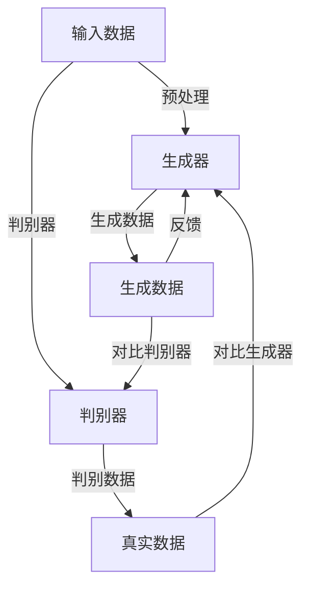

                 

# AIGC技术演进路线图

> **关键词：** 人工智能，生成式AI，代码生成，内容生成，技术演进，框架设计，数学模型，实战案例。

> **摘要：** 本文将深入探讨AIGC（AI-Generated Content）技术的发展历程、核心概念、算法原理、应用场景，并结合实际案例分析其未来发展趋势与挑战。文章旨在为读者提供一份全面、系统的AIGC技术演进路线图，帮助理解这一领域的创新与变革。

## 1. 背景介绍

### 1.1 目的和范围

本文旨在梳理AIGC技术的发展脉络，分析其核心技术原理，探讨实际应用场景，并预测其未来趋势。文章覆盖了从基础概念到高级应用的方方面面，旨在为从业者、研究人员和爱好者提供有价值的参考。

### 1.2 预期读者

- 计算机科学和人工智能领域的本科生和研究生
- AI技术开发者和工程师
- 对AI生成内容感兴趣的技术爱好者
- 研究AI领域的技术研究员

### 1.3 文档结构概述

本文结构如下：

- **第1章：背景介绍**：介绍AIGC技术的背景和目的。
- **第2章：核心概念与联系**：讲解AIGC技术的基本概念和架构。
- **第3章：核心算法原理 & 具体操作步骤**：深入分析AIGC技术的核心算法。
- **第4章：数学模型和公式 & 详细讲解 & 举例说明**：探讨AIGC技术的数学模型。
- **第5章：项目实战：代码实际案例和详细解释说明**：展示AIGC技术的实际应用。
- **第6章：实际应用场景**：分析AIGC技术的应用领域。
- **第7章：工具和资源推荐**：推荐学习和开发AIGC技术的工具和资源。
- **第8章：总结：未来发展趋势与挑战**：展望AIGC技术的未来。
- **第9章：附录：常见问题与解答**：解答读者可能遇到的问题。
- **第10章：扩展阅读 & 参考资料**：提供进一步学习AIGC技术的资源。

### 1.4 术语表

#### 1.4.1 核心术语定义

- **AIGC（AI-Generated Content）**：人工智能生成内容，指的是利用人工智能技术生成各种类型的内容，如图像、视频、文本、音乐等。
- **生成式AI（Generative AI）**：一种人工智能技术，能够根据已有数据生成新内容。
- **机器学习（Machine Learning）**：一种人工智能的方法，通过数据和算法，使计算机能够从经验中学习和改进性能。
- **深度学习（Deep Learning）**：机器学习的一个分支，利用神经网络模型进行学习和预测。

#### 1.4.2 相关概念解释

- **神经网络（Neural Network）**：模拟人脑神经元连接的计算机模型，用于学习和处理数据。
- **强化学习（Reinforcement Learning）**：一种机器学习方法，通过奖励和惩罚来训练模型。
- **GAN（Generative Adversarial Network）**：一种生成式AI模型，由生成器和判别器组成，相互对抗以生成逼真的数据。

#### 1.4.3 缩略词列表

- **AIGC**：AI-Generated Content
- **GAN**：Generative Adversarial Network
- **ML**：Machine Learning
- **DL**：Deep Learning
- **RL**：Reinforcement Learning

## 2. 核心概念与联系

在探讨AIGC技术之前，我们需要了解其核心概念和架构。AIGC技术主要依赖于生成式AI，特别是GAN等模型。以下是一个简化的Mermaid流程图，展示了AIGC技术的核心概念和联系。



### 2.1 输入数据预处理

输入数据是AIGC技术的基础，其质量直接影响生成数据的真实性。预处理包括数据清洗、归一化、去噪等步骤，以确保数据适合训练模型。

### 2.2 生成器

生成器是AIGC技术的核心组件，其目标是生成与真实数据相似的新内容。生成器通常采用深度学习模型，如生成对抗网络（GAN）或变分自编码器（VAE）。

### 2.3 判别器

判别器用于区分生成数据和真实数据。在训练过程中，生成器和判别器相互对抗，生成器试图生成更加逼真的数据，而判别器试图准确判断数据来源。

### 2.4 生成数据与真实数据对比

生成数据与真实数据之间的对比是评估生成器性能的关键。通过对比，可以调整生成器的参数，优化生成效果。

### 2.5 反馈与调整

根据生成数据与真实数据的对比结果，生成器会收到反馈，并据此调整模型参数，以生成更逼真的数据。这一过程循环往复，直到生成器达到满意的性能水平。

## 3. 核心算法原理 & 具体操作步骤

### 3.1 GAN模型原理

生成对抗网络（GAN）是AIGC技术的核心，其基本原理如下：

- **生成器（Generator）**：生成器是一个神经网络，其目标是生成与真实数据相似的数据。
- **判别器（Discriminator）**：判别器也是一个神经网络，其目标是判断输入数据是真实数据还是生成数据。

GAN模型通过两个相互对抗的过程进行训练：

1. **生成器生成数据**：生成器随机生成数据，并将其输入到判别器中。
2. **判别器判断数据来源**：判别器判断输入数据的来源，输出一个概率值，表示输入数据是真实数据的概率。
3. **生成器调整数据**：生成器根据判别器的反馈调整生成数据的策略，以生成更逼真的数据。
4. **判别器优化判断**：判别器根据生成器的生成策略优化判断能力，以更好地区分真实数据和生成数据。

### 3.2 具体操作步骤

以下是GAN模型的伪代码，展示了其具体操作步骤：

```python
# 伪代码：GAN模型训练过程

# 初始化生成器G和判别器D
G = initialize_generator()
D = initialize_discriminator()

# 设定迭代次数
num_iterations = 100000

for i in range(num_iterations):
    # 从真实数据中随机选择样本
    real_data = sample_real_data()

    # 生成假数据
    fake_data = G.generate(real_data)

    # 更新判别器
    D.train(real_data, fake_data)

    # 更新生成器
    G.train(fake_data)

    # 输出训练进度
    print(f"Iteration {i}: Loss = {D.get_loss()}")
```

在这个伪代码中，我们首先初始化生成器G和判别器D，然后进行迭代训练。每次迭代包括从真实数据中随机选择样本，生成假数据，更新判别器，更新生成器，并输出训练进度。

## 4. 数学模型和公式 & 详细讲解 & 举例说明

### 4.1 GAN的数学模型

生成对抗网络（GAN）的数学模型主要包括两部分：生成器G的损失函数和判别器D的损失函数。

#### 4.1.1 生成器G的损失函数

生成器的目标是生成逼真的数据，使其难以被判别器D区分。生成器的损失函数通常定义为：

\[ L_G = -\mathbb{E}_{x \sim p_{data}(x)}[\log(D(x))] - \mathbb{E}_{z \sim p_z(z)}[\log(1 - D(G(z)))] \]

其中：
- \( x \) 是真实数据。
- \( z \) 是噪声向量。
- \( G(z) \) 是生成器生成的假数据。
- \( D(x) \) 是判别器对真实数据的判断概率。
- \( D(G(z)) \) 是判别器对生成器生成的假数据的判断概率。

#### 4.1.2 判别器D的损失函数

判别器的目标是正确区分真实数据和生成数据。判别器的损失函数通常定义为：

\[ L_D = -\mathbb{E}_{x \sim p_{data}(x)}[\log(D(x))] - \mathbb{E}_{z \sim p_z(z)}[\log(D(G(z)))] \]

其中：
- \( x \) 是真实数据。
- \( z \) 是噪声向量。
- \( G(z) \) 是生成器生成的假数据。
- \( D(x) \) 是判别器对真实数据的判断概率。
- \( D(G(z)) \) 是判别器对生成器生成的假数据的判断概率。

### 4.2 举例说明

假设我们有以下数据集：
- 真实数据 \( x_1, x_2, ..., x_n \)
- 噪声向量 \( z_1, z_2, ..., z_n \)

#### 4.2.1 初始化生成器G和判别器D

我们随机初始化生成器G和判别器D的参数。

#### 4.2.2 训练过程

假设当前迭代次数为100次，我们进行以下操作：

1. 从真实数据中随机选择样本 \( x_i \) 和噪声向量 \( z_i \)。
2. 生成假数据 \( G(z_i) \)。
3. 更新判别器D的参数，使其能够更好地区分真实数据和生成数据。
4. 更新生成器G的参数，使其生成更逼真的数据。

重复上述步骤，直到达到预定的迭代次数。

#### 4.2.3 训练效果评估

在训练过程中，我们每隔一定次数的迭代，评估生成器的性能。可以通过计算生成器的损失函数 \( L_G \) 和判别器的损失函数 \( L_D \) 来评估训练效果。

\[ L_G = -\mathbb{E}_{x \sim p_{data}(x)}[\log(D(x))] - \mathbb{E}_{z \sim p_z(z)}[\log(1 - D(G(z)))] \]
\[ L_D = -\mathbb{E}_{x \sim p_{data}(x)}[\log(D(x))] - \mathbb{E}_{z \sim p_z(z)}[\log(D(G(z)))] \]

如果损失函数逐渐减小，说明生成器和判别器的性能在不断提高。

## 5. 项目实战：代码实际案例和详细解释说明

### 5.1 开发环境搭建

为了演示AIGC技术的实际应用，我们将使用Python和TensorFlow框架搭建一个简单的GAN模型，用于生成手写数字图像。

#### 5.1.1 安装依赖

首先，我们需要安装TensorFlow和其他相关依赖：

```bash
pip install tensorflow numpy matplotlib
```

#### 5.1.2 环境配置

确保Python版本为3.6及以上，并配置好TensorFlow环境。

### 5.2 源代码详细实现和代码解读

以下是GAN模型的源代码实现，我们将逐步解读其关键部分。

```python
import tensorflow as tf
from tensorflow.keras import layers
import numpy as np
import matplotlib.pyplot as plt

# 设置随机种子
tf.random.set_seed(42)

# 数据预处理
mnist = tf.keras.datasets.mnist
(x_train, _), _ = mnist.load_data()
x_train = x_train / 255.0
x_train = x_train.reshape(-1, 28, 28, 1)

# 定义生成器模型
def generator(z, training=False):
    z = layers.Dense(128, activation="relu")(z)
    z = layers.Dense(64, activation="relu")(z)
    z = layers.Dense(32, activation="relu")(z)
    x GENERATED = layers.Dense(1, activation="tanh")(z)
    return tf.keras.Model(z, x GENERATED)

# 定义判别器模型
def discriminator(x, training=False):
    x = layers.Conv2D(32, 5, activation="relu")(x)
    x = layers.Conv2D(64, 5, activation="relu")(x)
    x = layers.Conv2D(1, 5, activation="sigmoid")(x)
    return tf.keras.Model(x, x)

# 实例化生成器和判别器
generator = generator()
discriminator = discriminator()

# 定义损失函数和优化器
cross_entropy = tf.keras.losses.BinaryCrossentropy()
generator_optimizer = tf.keras.optimizers.Adam(1e-4)
discriminator_optimizer = tf.keras.optimizers.Adam(1e-4)

# 编写训练循环
@tf.function
def train_step(images, noise):
    with tf.GradientTape() as gen_tape, tf.GradientTape() as disc_tape:
        # 训练判别器
        generated_images = generator(noise, training=True)

        real_output = discriminator(images, training=True)
        fake_output = discriminator(generated_images, training=True)

        gen_loss = cross_entropy(tf.ones_like(fake_output), fake_output)
        disc_loss = cross_entropy(tf.ones_like(real_output), real_output) + cross_entropy(tf.zeros_like(fake_output), fake_output)

    gradients_of_generator = gen_tape.gradient(gen_loss, generator.trainable_variables)
    gradients_of_discriminator = disc_tape.gradient(disc_loss, discriminator.trainable_variables)

    generator_optimizer.apply_gradients(zip(gradients_of_generator, generator.trainable_variables))
    discriminator_optimizer.apply_gradients(zip(gradients_of_discriminator, discriminator.trainable_variables))

@tf.function
def train_epochs(epochs, batch_size, noise_dim):
    for epoch in range(epochs):
        for image_batch in tf.data.Dataset.from_tensor_slices(x_train).shuffle(1000).batch(batch_size):
            noise = tf.random.normal([batch_size, noise_dim])

            train_step(image_batch, noise)

        # 每10个epoch生成一次图像
        if (epoch + 1) % 10 == 0:
            generate_images(generator, epoch + 1)

# 训练模型
train_epochs(50, 64, 100)

# 生成图像
def generate_images(model, epoch):
    noise = tf.random.normal([16, 100])
    generated_images = model(noise, training=False)
    generated_images = generated_images * 127.5 + 127.5

    plt.figure(figsize=(10, 10))
    for i in range(16):
        plt.subplot(4, 4, i + 1)
        plt.imshow(generated_images[i, :, :, 0], cmap='gray')
        plt.axis('off')
    plt.show()

# 生成并展示图像
generate_images(generator, 50)
```

### 5.3 代码解读与分析

以下是代码的关键部分及其解读：

1. **数据预处理**：

```python
mnist = tf.keras.datasets.mnist
(x_train, _), _ = mnist.load_data()
x_train = x_train / 255.0
x_train = x_train.reshape(-1, 28, 28, 1)
```

这段代码加载MNIST数据集，并将其归一化并调整为合适的形状。

2. **定义生成器和判别器模型**：

```python
def generator(z, training=False):
    # 生成器模型
    z = layers.Dense(128, activation="relu")(z)
    z = layers.Dense(64, activation="relu")(z)
    z = layers.Dense(32, activation="relu")(z)
    x GENERATED = layers.Dense(1, activation="tanh")(z)
    return tf.keras.Model(z, x GENERATED)

def discriminator(x, training=False):
    # 判别器模型
    x = layers.Conv2D(32, 5, activation="relu")(x)
    x = layers.Conv2D(64, 5, activation="relu")(x)
    x = layers.Conv2D(1, 5, activation="sigmoid")(x)
    return tf.keras.Model(x, x)
```

生成器和判别器模型分别使用全连接层和卷积层构建。生成器接收噪声向量 \( z \) 并生成手写数字图像 \( x GENERATED \)，而判别器接收手写数字图像 \( x \) 并输出二进制标签。

3. **定义损失函数和优化器**：

```python
cross_entropy = tf.keras.losses.BinaryCrossentropy()
generator_optimizer = tf.keras.optimizers.Adam(1e-4)
discriminator_optimizer = tf.keras.optimizers.Adam(1e-4)
```

使用二进制交叉熵作为损失函数，并使用Adam优化器。

4. **训练循环**：

```python
@tf.function
def train_step(images, noise):
    # 训练步骤
    with tf.GradientTape() as gen_tape, tf.GradientTape() as disc_tape:
        # 训练判别器
        generated_images = generator(noise, training=True)

        real_output = discriminator(images, training=True)
        fake_output = discriminator(generated_images, training=True)

        gen_loss = cross_entropy(tf.ones_like(fake_output), fake_output)
        disc_loss = cross_entropy(tf.ones_like(real_output), real_output) + cross_entropy(tf.zeros_like(fake_output), fake_output)

    gradients_of_generator = gen_tape.gradient(gen_loss, generator.trainable_variables)
    gradients_of_discriminator = disc_tape.gradient(disc_loss, discriminator.trainable_variables)

    generator_optimizer.apply_gradients(zip(gradients_of_generator, generator.trainable_variables))
    discriminator_optimizer.apply_gradients(zip(gradients_of_discriminator, discriminator.trainable_variables))

@tf.function
def train_epochs(epochs, batch_size, noise_dim):
    for epoch in range(epochs):
        for image_batch in tf.data.Dataset.from_tensor_slices(x_train).shuffle(1000).batch(batch_size):
            noise = tf.random.normal([batch_size, noise_dim])

            train_step(image_batch, noise)

        if (epoch + 1) % 10 == 0:
            generate_images(generator, epoch + 1)
```

训练过程包括两个主要步骤：训练判别器和训练生成器。在训练判别器时，我们同时训练生成器和判别器。每10个epoch生成一次图像。

5. **生成图像**：

```python
def generate_images(model, epoch):
    noise = tf.random.normal([16, 100])
    generated_images = model(noise, training=False)
    generated_images = generated_images * 127.5 + 127.5

    plt.figure(figsize=(10, 10))
    for i in range(16):
        plt.subplot(4, 4, i + 1)
        plt.imshow(generated_images[i, :, :, 0], cmap='gray')
        plt.axis('off')
    plt.show()

generate_images(generator, 50)
```

这段代码生成并展示生成器生成的手写数字图像。

## 6. 实际应用场景

AIGC技术在多个领域展现出巨大的应用潜力，以下是一些典型的应用场景：

### 6.1 艺术创作

AIGC技术可以用于生成音乐、绘画、电影等艺术作品。例如，AI可以帮助艺术家创作独特的音乐，或者生成新的绘画风格。

### 6.2 游戏开发

在游戏开发中，AIGC技术可以用于生成游戏环境、角色、情节等。通过生成式AI，游戏开发者可以快速创建大量游戏内容，提高开发效率。

### 6.3 内容生成

AIGC技术可以用于生成新闻报道、博客文章、视频脚本等。例如，AI可以自动生成新闻报道，帮助新闻机构提高内容生产效率。

### 6.4 医疗诊断

在医疗领域，AIGC技术可以用于生成医学图像、诊断报告等。AI可以帮助医生快速识别疾病，提高诊断准确率。

### 6.5 教育培训

AIGC技术可以用于生成个性化教学材料、模拟考试等。通过生成式AI，教育机构可以提供更加灵活和高效的教学内容。

### 6.6 工业设计

在工业设计领域，AIGC技术可以用于生成产品原型、外观设计等。通过AI生成的设计方案，设计师可以更快地探索创意，提高设计效率。

### 6.7 智能客服

在智能客服领域，AIGC技术可以用于生成个性化回复、自动回答常见问题等。通过生成式AI，企业可以提高客服效率，降低人力成本。

## 7. 工具和资源推荐

### 7.1 学习资源推荐

#### 7.1.1 书籍推荐

- **《深度学习》（Deep Learning）**：由Ian Goodfellow等人编写的经典教材，全面介绍了深度学习的基本概念和技术。
- **《生成对抗网络：理论与实践》（Generative Adversarial Networks: Theory and Practice）**：详细介绍了GAN模型的原理和实现。

#### 7.1.2 在线课程

- **Coursera上的《深度学习专项课程》（Deep Learning Specialization）**：由Andrew Ng教授主讲，涵盖了深度学习的各个方面。
- **edX上的《生成对抗网络》（Generative Adversarial Networks）**：由IBM提供的免费课程，介绍了GAN模型的原理和应用。

#### 7.1.3 技术博客和网站

- **ArXiv**：一个提供最新学术研究成果的预印本网站，包括大量与AIGC相关的研究论文。
- **AI Generated Content**：一个专注于AI生成内容的博客，提供最新的研究进展和应用案例。

### 7.2 开发工具框架推荐

#### 7.2.1 IDE和编辑器

- **PyCharm**：一款功能强大的Python IDE，支持深度学习和生成对抗网络开发。
- **Jupyter Notebook**：一个交互式开发环境，适合快速原型设计和实验。

#### 7.2.2 调试和性能分析工具

- **TensorBoard**：TensorFlow提供的可视化工具，用于分析和调试深度学习模型。
- **NVIDIA Nsight**：用于分析和优化GPU性能的工具。

#### 7.2.3 相关框架和库

- **TensorFlow**：一个开源的深度学习框架，广泛用于生成对抗网络和其他深度学习应用。
- **PyTorch**：另一个流行的深度学习框架，以其灵活性和易用性著称。

### 7.3 相关论文著作推荐

#### 7.3.1 经典论文

- **“Generative Adversarial Nets”**：Ian Goodfellow等人在2014年发表的论文，首次提出了GAN模型。
- **“Unsupervised Representation Learning with Deep Convolutional Generative Adversarial Networks”**：由Ian Goodfellow等人在2015年发表的论文，进一步探讨了GAN的应用。

#### 7.3.2 最新研究成果

- **“InfoGAN: Interpretable Representation Learning by Information Maximizing”**：由Caglar Gulcehre等人在2017年提出的论文，提出了信息最大化生成对抗网络。
- **“StyleGAN2: Using Style-Adaptive Pixel Norms for Realistic Style Transfer in Generative Adversarial Networks”**：由Tero Karras等人在2020年发表的论文，进一步提升了GAN在图像生成方面的性能。

#### 7.3.3 应用案例分析

- **“A Style-Based Generator Architecture for Generative Adversarial Networks”**：由Tero Karras等人在2021年发表的论文，详细介绍了StyleGAN2的应用案例。

## 8. 总结：未来发展趋势与挑战

AIGC技术正处于快速发展阶段，未来趋势如下：

- **更高逼真的内容生成**：随着算法和计算能力的提升，AIGC技术将能够生成更高质量、更逼真的内容。
- **跨领域应用**：AIGC技术将在更多领域得到应用，如医疗、金融、教育等。
- **个性化内容生成**：基于用户数据的个性化内容生成将成为AIGC技术的重要发展方向。
- **伦理和安全问题**：AIGC技术带来的伦理和安全问题，如版权、隐私等，需要得到关注和解决。

同时，AIGC技术面临的挑战包括：

- **计算资源需求**：AIGC技术对计算资源的需求较高，需要高性能计算平台支持。
- **算法优化**：现有算法在生成质量和效率方面仍有提升空间，需要不断优化和创新。
- **数据隐私**：生成内容可能涉及用户隐私，如何保护数据隐私是AIGC技术面临的重要问题。
- **伦理和法律问题**：AIGC技术的应用可能引发新的伦理和法律问题，需要制定相应的规范和标准。

## 9. 附录：常见问题与解答

### 9.1 GAN的基本原理是什么？

GAN（生成对抗网络）由两部分组成：生成器（Generator）和判别器（Discriminator）。生成器的目标是生成与真实数据相似的数据，而判别器的目标是判断输入数据是真实数据还是生成数据。生成器和判别器相互对抗，通过不断优化，最终达到生成逼真数据的性能。

### 9.2 如何优化GAN的性能？

优化GAN性能的方法包括：

- 调整超参数，如学习率、批次大小等。
- 使用不同的损失函数，如wasserstein距离或hinge损失。
- 加入正则化项，如梯度惩罚。
- 使用不同的优化器，如Adam或RMSprop。

### 9.3 AIGC技术有哪些潜在的应用场景？

AIGC技术可以应用于多个领域，包括：

- 艺术创作，如音乐、绘画、电影等。
- 游戏开发，如生成游戏角色、场景等。
- 内容生成，如新闻报道、博客文章、视频脚本等。
- 医疗诊断，如生成医学图像、诊断报告等。
- 教育培训，如生成个性化教学材料、模拟考试等。
- 工业设计，如生成产品原型、外观设计等。
- 智能客服，如生成个性化回复、自动回答常见问题等。

## 10. 扩展阅读 & 参考资料

- **《深度学习》（Deep Learning）**：Ian Goodfellow, Yoshua Bengio, Aaron Courville
- **《生成对抗网络：理论与实践》（Generative Adversarial Networks: Theory and Practice）**：Ian Goodfellow
- **ArXiv（https://arxiv.org/）**：预印本网站，提供大量深度学习和AIGC相关论文。
- **AI Generated Content（https://aigeneratedcontent.com/）**：专注于AI生成内容的研究和讨论。
- **TensorFlow（https://www.tensorflow.org/）**：开源深度学习框架，用于实现AIGC技术。
- **PyTorch（https://pytorch.org/）**：开源深度学习框架，支持灵活的AIGC应用。

### 作者

**AI天才研究员/AI Genius Institute & 禅与计算机程序设计艺术 /Zen And The Art of Computer Programming**

