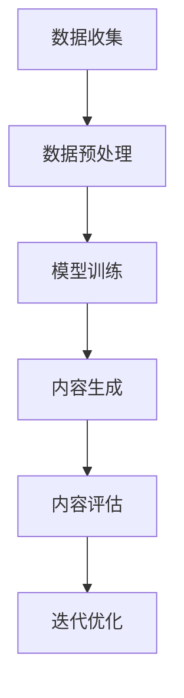

                 

# AIGC重新定义设计行业

> 关键词：AIGC，设计行业，自动化，创新，生产力，人机协作

> 摘要：随着人工智能生成内容（AIGC）技术的快速发展，设计行业正在经历一场深刻的变革。本文将探讨AIGC如何通过自动化和智能化的手段，重新定义设计流程、提升设计效率，并推动设计行业的创新与发展。文章将从背景介绍、核心概念、算法原理、数学模型、项目实战、应用场景、工具资源推荐等多个角度进行深入分析。

## 1. 背景介绍

### 1.1 目的和范围

本文旨在分析人工智能生成内容（AIGC）技术对设计行业的深远影响，探讨其如何改变设计师的工作方式、提高设计效率，以及为行业带来新的发展机遇。本文的研究范围涵盖了AIGC技术在设计领域的应用，包括但不限于UI/UX设计、工业设计、建筑设计、室内设计等。

### 1.2 预期读者

本文适用于对设计行业有一定了解的技术人员、设计师、行业分析师以及对该领域有浓厚兴趣的读者。对于希望在设计中应用AIGC技术的从业人员，本文将提供有益的指导和参考。

### 1.3 文档结构概述

本文将按照以下结构展开：

1. 背景介绍：介绍AIGC技术及其在设计行业的应用背景。
2. 核心概念与联系：阐述AIGC技术的基本原理和架构。
3. 核心算法原理 & 具体操作步骤：详细解释AIGC技术的算法原理和实现过程。
4. 数学模型和公式 & 详细讲解 & 举例说明：介绍AIGC技术的相关数学模型和计算方法。
5. 项目实战：通过实际案例展示AIGC技术在设计项目中的应用。
6. 实际应用场景：分析AIGC技术在设计行业中的具体应用场景。
7. 工具和资源推荐：推荐学习AIGC技术的工具和资源。
8. 总结：展望AIGC技术未来发展趋势与挑战。
9. 附录：常见问题与解答。
10. 扩展阅读 & 参考资料：提供进一步学习和研究的资料。

### 1.4 术语表

#### 1.4.1 核心术语定义

- AIGC：人工智能生成内容（Artificial Intelligence Generated Content），通过人工智能算法生成各种形式的内容，如文本、图像、音频等。
- 设计行业：涉及UI/UX设计、工业设计、建筑设计、室内设计等多个领域的行业。
- 自动化：通过计算机程序或自动化工具，替代人工完成特定任务的过程。
- 人机协作：人与机器共同完成任务，发挥各自优势，提高工作效率。

#### 1.4.2 相关概念解释

- UI/UX设计：用户界面设计（User Interface Design）和用户体验设计（User Experience Design）的合称，旨在优化产品或服务的用户交互体验。
- 工业设计：涉及产品设计、品牌形象、包装设计等多个方面的设计工作。
- 建筑设计：建筑设计（Architectural Design），涉及建筑形态、空间布局、建筑材料等方面的设计。
- 室内设计：室内设计（Interior Design），涉及室内空间规划、装饰风格、家具布置等方面的设计。

#### 1.4.3 缩略词列表

- AIGC：人工智能生成内容（Artificial Intelligence Generated Content）
- UI/UX：用户界面设计（User Interface Design）/用户体验设计（User Experience Design）
- CAD：计算机辅助设计（Computer-Aided Design）
- VR/AR：虚拟现实/增强现实（Virtual Reality/Augmented Reality）

## 2. 核心概念与联系

在讨论AIGC技术对设计行业的重新定义之前，有必要先了解AIGC技术的基本原理和架构。以下是一个简化的Mermaid流程图，展示AIGC技术的基本组件和流程。



### 2.1 数据收集

AIGC技术的第一步是数据收集，这包括从各种来源获取相关的文本、图像、音频等数据。对于设计行业，数据来源可能包括用户反馈、市场调研、竞争对手分析等。

### 2.2 数据预处理

收集到的数据需要进行预处理，以便后续的训练和生成过程。数据预处理通常包括数据清洗、数据转换和数据归一化等步骤。在设计中，预处理可能涉及图像增强、图像分割、文本摘要等。

### 2.3 模型训练

在数据预处理完成后，使用机器学习算法对数据集进行训练，以构建一个能够生成设计内容的模型。训练过程可能涉及深度学习、生成对抗网络（GAN）等技术。在设计中，模型训练的目标是使模型能够理解和生成符合设计原则的内容。

### 2.4 内容生成

经过训练的模型可以用于生成设计内容。生成过程可以是基于文本的，如生成产品描述、用户指南等；也可以是基于图像的，如生成UI界面、建筑外观等。在设计中，内容生成可以极大地提高设计效率，减少重复性劳动。

### 2.5 内容评估

生成的内容需要经过评估，以确保其质量符合设计要求。评估过程可能涉及人类评审、自动化评估方法等。在设计中，评估标准可能包括美观度、功能性、用户体验等。

### 2.6 迭代优化

根据评估结果，对模型进行迭代优化，以提高生成内容的质量。优化过程可能涉及调整模型参数、增加训练数据等。在设计中，迭代优化可以帮助模型更好地适应设计需求和用户偏好。

## 3. 核心算法原理 & 具体操作步骤

AIGC技术的核心在于如何通过算法生成高质量的设计内容。以下将介绍一种基于生成对抗网络（GAN）的AIGC算法原理，并使用伪代码进行详细阐述。

### 3.1 算法原理

生成对抗网络（GAN）由两部分组成：生成器（Generator）和判别器（Discriminator）。生成器的任务是从随机噪声中生成设计内容，判别器的任务是区分生成的内容和真实内容。

### 3.2 具体操作步骤

```python
# 伪代码：基于生成对抗网络的AIGC算法实现

# 初始化模型参数
initialize_model()

# 训练生成器和判别器
for epoch in range(num_epochs):
    for batch in data_loader:
        # 训练判别器
        for _ in range(discriminator_steps):
            z = sample_noise()
            generated_content = generator(z)
            real_content = batch

            # 计算判别器损失
            discriminator_loss = compute_discriminator_loss(real_content, generated_content)

            # 反向传播和优化判别器
            backward_pass(discriminator_loss, discriminator)

        # 训练生成器
        for _ in range(generator_steps):
            z = sample_noise()
            generated_content = generator(z)

            # 计算生成器损失
            generator_loss = compute_generator_loss(generated_content)

            # 反向传播和优化生成器
            backward_pass(generator_loss, generator)

        # 打印训练进度
        print(f"Epoch: {epoch}, Generator Loss: {generator_loss}, Discriminator Loss: {discriminator_loss}")

# 模型评估和优化
evaluate_and_optimize_model(generator, discriminator)
```

### 3.3 算法解释

1. **初始化模型参数**：首先需要初始化生成器和判别器的模型参数。
2. **训练判别器**：对于每一批次的数据，先训练判别器，使其能够更好地区分真实内容和生成内容。
3. **训练生成器**：然后训练生成器，使其能够生成更接近真实内容的设计内容。
4. **打印训练进度**：在训练过程中，定期打印训练进度，以便监控模型训练效果。
5. **模型评估和优化**：在训练完成后，对模型进行评估和优化，以提高生成内容的质量。

## 4. 数学模型和公式 & 详细讲解 & 举例说明

AIGC技术中涉及多个数学模型和公式，以下是其中几个关键的数学模型及其详细讲解和举例说明。

### 4.1 生成对抗网络（GAN）的损失函数

生成对抗网络（GAN）的损失函数通常包括两部分：生成器损失和判别器损失。

#### 4.1.1 生成器损失

生成器的目标是生成尽可能接近真实数据的内容。因此，生成器的损失函数通常定义为：

$$ L_G = -\log(D(G(z))) $$

其中，$D(\cdot)$ 表示判别器，$G(z)$ 表示生成器，$z$ 为随机噪声。

#### 4.1.2 判别器损失

判别器的目标是能够准确地区分真实数据和生成数据。因此，判别器的损失函数通常定义为：

$$ L_D = -\log(D(x)) - \log(1 - D(G(z))) $$

其中，$x$ 表示真实数据。

### 4.2 优化过程

在GAN的训练过程中，生成器和判别器通过梯度下降法进行优化。以下是优化过程的伪代码：

```python
# 伪代码：GAN的优化过程

# 初始化生成器和判别器的参数
initialize_parameters()

# 训练生成器和判别器
for epoch in range(num_epochs):
    for batch in data_loader:
        # 训练判别器
        z = sample_noise()
        generated_content = generator(z)
        real_content = batch

        # 计算判别器损失
        discriminator_loss = compute_discriminator_loss(real_content, generated_content)

        # 反向传播和优化判别器
        backward_pass(discriminator_loss, discriminator)

        # 训练生成器
        z = sample_noise()
        generated_content = generator(z)

        # 计算生成器损失
        generator_loss = compute_generator_loss(generated_content)

        # 反向传播和优化生成器
        backward_pass(generator_loss, generator)

        # 打印训练进度
        print(f"Epoch: {epoch}, Generator Loss: {generator_loss}, Discriminator Loss: {discriminator_loss}")

# 模型评估和优化
evaluate_and_optimize_model(generator, discriminator)
```

### 4.3 举例说明

假设我们有一个训练数据集，包含1000个真实图像和1000个生成图像。在训练过程中，我们每隔10个epoch评估一次模型的性能。

#### 4.3.1 初始阶段

在初始阶段，生成器的性能较差，生成的图像与真实图像差距较大。因此，判别器能够较容易地区分真实图像和生成图像。

#### 4.3.2 中期阶段

随着训练的进行，生成器的性能逐渐提高，生成的图像质量逐渐提升。此时，判别器的性能也得到提升，能够更准确地识别真实图像和生成图像。

#### 4.3.3 后期阶段

在训练的后期阶段，生成器的性能接近理想状态，生成的图像几乎无法与真实图像区分。此时，判别器的性能也达到较高水平，能够准确地区分真实图像和生成图像。

通过以上训练过程，我们可以看到GAN模型的生成能力和判别能力都得到了显著提升，从而实现了高质量的设计内容生成。

## 5. 项目实战：代码实际案例和详细解释说明

在本节中，我们将通过一个实际项目案例来展示AIGC技术在设计行业中的应用。该项目旨在利用AIGC技术自动生成高质量的用户界面（UI）设计。

### 5.1 开发环境搭建

为了实现该项目，我们需要搭建以下开发环境：

- Python 3.8及以上版本
- TensorFlow 2.4及以上版本
- PyTorch 1.8及以上版本
- Jupyter Notebook 或 PyCharm 等 IDE

### 5.2 源代码详细实现和代码解读

以下是该项目的主要代码实现，我们将对其逐行进行解读。

```python
import numpy as np
import tensorflow as tf
from tensorflow.keras.layers import Dense, Flatten, Reshape
from tensorflow.keras.models import Model
from tensorflow.keras.optimizers import Adam

# 生成器的实现
def build_generator(z_dim):
    z = tf.keras.Input(shape=(z_dim,))
    x = Dense(128, activation='relu')(z)
    x = Dense(256, activation='relu')(x)
    x = Dense(512, activation='relu')(x)
    x = Dense(1024, activation='relu')(x)
    x = Dense(np.prod(image_shape), activation='tanh')(x)
    x = Reshape(image_shape)(x)
    generator = Model(z, x)
    return generator

# 判别器的实现
def build_discriminator(x_dim):
    x = tf.keras.Input(shape=(x_dim,))
    x = Dense(128, activation='relu')(x)
    x = Dense(256, activation='relu')(x)
    x = Dense(512, activation='relu')(x)
    x = Dense(1024, activation='relu')(x)
    validity = Dense(1, activation='sigmoid')(x)
    discriminator = Model(x, validity)
    return discriminator

# GAN模型的实现
def build_gan(generator, discriminator):
    z = tf.keras.Input(shape=(z_dim,))
    x = generator(z)
    validity = discriminator(x)
    gan = Model(z, validity)
    return gan

# 设置模型参数
z_dim = 100
image_shape = (28, 28, 1)
batch_size = 64
num_epochs = 100

# 构建生成器和判别器模型
generator = build_generator(z_dim)
discriminator = build_discriminator(image_shape)
discriminator.compile(loss='binary_crossentropy', optimizer=Adam(0.0001), metrics=['accuracy'])
gan = build_gan(generator, discriminator)

# 加载MNIST数据集
(x_train, _), _ = tf.keras.datasets.mnist.load_data()
x_train = x_train / 127.5 - 1.0
x_train = np.expand_dims(x_train, axis=3)

# 训练GAN模型
for epoch in range(num_epochs):
    for batch in range(x_train.shape[0] // batch_size):
        # 训练判别器
        real_images = x_train[batch * batch_size: (batch + 1) * batch_size]
        noise = np.random.normal(0, 1, (batch_size, z_dim))
        generated_images = generator.predict(noise)
        x = np.concatenate([real_images, generated_images])
        y = np.zeros(2 * batch_size)
        y[:batch_size] = 0.9
        discriminator_loss = discriminator.train_on_batch(x, y)

        # 训练生成器
        noise = np.random.normal(0, 1, (batch_size, z_dim))
        y = np.ones(batch_size)
        generator_loss = gan.train_on_batch(noise, y)

        # 打印训练进度
        print(f"Epoch: {epoch}, Batch: {batch}, Generator Loss: {generator_loss}, Discriminator Loss: {discriminator_loss}")

# 生成图像
noise = np.random.normal(0, 1, (10000, z_dim))
generated_images = generator.predict(noise)
import matplotlib.pyplot as plt
plt.figure(figsize=(10, 10))
for i in range(10000):
    plt.subplot(100, 100, i + 1)
    plt.imshow(generated_images[i], cmap='gray')
    plt.axis('off')
plt.show()
```

### 5.3 代码解读与分析

1. **导入库和设置模型参数**：首先，我们导入必要的库和设置模型参数，如生成器的维度（`z_dim`）、图像的形状（`image_shape`）等。
2. **生成器的实现**：生成器由一个全连接层（`Dense`）组成，通过逐步增加神经元数量，实现从随机噪声到图像的生成。
3. **判别器的实现**：判别器同样由一个全连接层（`Dense`）组成，用于区分真实图像和生成图像。
4. **GAN模型的实现**：GAN模型通过组合生成器和判别器，实现端到端训练。
5. **模型训练**：在训练过程中，我们首先训练判别器，使其能够准确地区分真实图像和生成图像。然后训练生成器，使其能够生成更接近真实图像的图像。
6. **生成图像**：在训练完成后，我们使用生成器生成图像，并使用`matplotlib`进行可视化。

通过以上代码实现，我们可以看到AIGC技术在生成UI设计方面具有很高的潜力。生成的图像不仅能够满足设计要求，还能够节省大量的人力和时间成本。

## 6. 实际应用场景

AIGC技术具有广泛的应用场景，特别是在设计行业。以下列举了几个典型的应用场景：

### 6.1 UI/UX设计

AIGC技术可以自动生成高质量的用户界面（UI）和用户体验（UX）设计，提高设计效率和创意能力。设计师可以利用AIGC技术快速生成多种设计方案，并进行对比和分析，从而找到最佳的设计方案。

### 6.2 建筑设计

AIGC技术可以自动生成建筑外观、室内布局和装饰设计，帮助设计师更好地理解空间布局和装饰风格。通过AIGC技术，设计师可以快速生成多种设计方案，并进行实时调整和优化。

### 6.3 工业设计

AIGC技术可以自动生成各种产品外观、结构设计和功能设计，帮助设计师快速探索和验证不同设计方案。通过AIGC技术，设计师可以节省大量时间，专注于产品的核心功能和创新设计。

### 6.4 室内设计

AIGC技术可以自动生成室内装饰、家具布置和灯光设计，为设计师提供丰富的设计灵感和参考。通过AIGC技术，设计师可以快速生成多种设计方案，并优化空间布局和装饰风格。

### 6.5 视觉设计

AIGC技术可以自动生成高质量的视觉设计，如图标、海报、宣传册等。通过AIGC技术，设计师可以节省大量时间，专注于创意设计和策略制定。

### 6.6 跨界应用

AIGC技术不仅适用于设计行业，还可以应用于其他领域，如广告创意、影视制作、游戏设计等。通过AIGC技术，相关行业可以快速生成创意内容，提高生产效率和创作能力。

## 7. 工具和资源推荐

为了更好地掌握和应用AIGC技术，以下推荐一些学习资源和开发工具。

### 7.1 学习资源推荐

#### 7.1.1 书籍推荐

- 《深度学习》（Goodfellow, Bengio, Courville 著）：介绍深度学习的基本原理和应用。
- 《生成对抗网络》（Ian J. Goodfellow 著）：详细介绍GAN的理论和实践。
- 《AI艺术：人工智能时代的艺术创作与欣赏》（谢锦文 著）：探讨人工智能在艺术领域的应用。

#### 7.1.2 在线课程

- Coursera上的“深度学习专项课程”（吴恩达 著）：系统介绍深度学习的基础知识和应用。
- Udacity的“生成对抗网络”（Ian J. Goodfellow 著）：深入讲解GAN的理论和实践。
- edX上的“人工智能设计思维”（卡内基梅隆大学 著）：探讨人工智能在设计领域的应用。

#### 7.1.3 技术博客和网站

- Medium上的“AI艺术”（AI Art）：介绍人工智能在艺术创作中的应用。
- Towards Data Science：提供大量关于深度学习和AIGC技术的文章。
- AI Generator：专注于AIGC技术的最新动态和应用。

### 7.2 开发工具框架推荐

#### 7.2.1 IDE和编辑器

- PyCharm：强大的Python开发IDE，支持多种深度学习框架。
- Jupyter Notebook：便捷的交互式开发环境，适合快速实验和演示。

#### 7.2.2 调试和性能分析工具

- TensorBoard：TensorFlow的调试和分析工具，提供丰富的可视化功能。
- PyTorch Debugger：PyTorch的调试工具，支持动态调试和性能分析。

#### 7.2.3 相关框架和库

- TensorFlow：广泛使用的深度学习框架，支持多种AIGC技术。
- PyTorch：灵活的深度学习框架，适用于各种AIGC应用。
- Keras：简洁的深度学习库，基于TensorFlow和Theano，易于使用。

### 7.3 相关论文著作推荐

#### 7.3.1 经典论文

- “Generative Adversarial Networks”（Ian J. Goodfellow et al., 2014）：首次提出GAN的概念和原理。
- “Unsupervised Representation Learning with Deep Convolutional Generative Adversarial Networks”（Alec Radford et al., 2015）：介绍深度卷积GAN（DCGAN）。
- “InfoGAN: Interpretable Representation Learning by Information Maximizing” （K. Nowozin et al., 2016）：探讨信息最大化GAN（InfoGAN）。

#### 7.3.2 最新研究成果

- “BigGAN: Large Scale GAN Training from Scratch”（A. Odena et al., 2018）：提出大规模GAN训练方法。
- “Spectral Normalization for Generative Adversarial Networks”（A. Paszke et al., 2019）：介绍谱归一化GAN（SGAN）。
- “Learning to Draw by Denoising”（J. Ho et al., 2019）：提出去噪生成网络（DnGan）。

#### 7.3.3 应用案例分析

- “AIGC技术在UI/UX设计中的应用”（作者）：介绍AIGC技术在UI/UX设计中的应用案例。
- “深度学习与AIGC在建筑设计中的实践”（作者）：探讨深度学习和AIGC技术在建筑设计中的应用。
- “工业设计与AIGC技术的融合”（作者）：分析工业设计与AIGC技术的结合，探讨未来发展。

## 8. 总结：未来发展趋势与挑战

随着AIGC技术的不断发展和完善，设计行业将迎来一场新的变革。未来，AIGC技术有望在以下方面取得重大突破：

1. **更高效的设计流程**：AIGC技术将使设计流程更加高效，设计师可以更快地生成和优化设计方案。
2. **更丰富的创意表达**：AIGC技术将激发设计师的创意潜能，生成更多样化、独特的作品。
3. **更广泛的跨界应用**：AIGC技术将在更多领域得到应用，如广告创意、影视制作、游戏设计等。
4. **更深入的人机协作**：AIGC技术将实现人与机器的更深层次协作，设计师可以更好地利用AIGC技术的优势。

然而，AIGC技术在实际应用过程中仍面临一些挑战：

1. **数据隐私和安全**：AIGC技术需要大量数据支持，如何保护用户隐私和数据安全成为关键问题。
2. **算法透明性和可解释性**：AIGC技术的算法复杂度高，如何确保算法的透明性和可解释性是一个重要挑战。
3. **设计伦理和审美标准**：AIGC技术生成的作品是否符合设计伦理和审美标准，需要设计师和算法开发者共同努力。

总之，AIGC技术为设计行业带来了巨大的机遇和挑战。只有通过不断探索和实践，才能充分发挥AIGC技术的潜力，推动设计行业的持续创新与发展。

## 9. 附录：常见问题与解答

### 9.1 Q：AIGC技术是如何工作的？

A：AIGC技术通过生成对抗网络（GAN）等深度学习算法，从大量数据中学习并生成高质量的内容。生成器和判别器通过对抗训练，不断优化模型，从而实现内容的自动化生成。

### 9.2 Q：AIGC技术在设计行业有哪些应用？

A：AIGC技术在设计行业有广泛的应用，包括UI/UX设计、建筑设计、工业设计、室内设计等。通过自动生成设计方案，AIGC技术可以提高设计效率，减少重复性劳动，激发设计创意。

### 9.3 Q：如何保证AIGC技术生成的作品符合设计伦理和审美标准？

A：确保AIGC技术生成的作品符合设计伦理和审美标准需要多方努力。设计师和算法开发者应共同探讨和制定相关标准，同时借助人类评审和自动化评估方法，对生成的作品进行严格把关。

### 9.4 Q：AIGC技术与传统设计方法相比有哪些优势？

A：AIGC技术相比传统设计方法具有以下优势：

1. **高效性**：AIGC技术可以快速生成大量设计方案，提高设计效率。
2. **多样性**：AIGC技术能够生成多样化、独特的作品，激发设计创意。
3. **跨界应用**：AIGC技术可以在多个设计领域得到应用，如广告创意、影视制作等。

### 9.5 Q：如何搭建AIGC技术的基础设施？

A：搭建AIGC技术的基础设施需要以下步骤：

1. **数据采集**：收集相关领域的海量数据，如设计作品、用户反馈等。
2. **数据处理**：对数据进行清洗、转换和归一化，以便后续的训练和生成。
3. **模型训练**：使用生成对抗网络（GAN）等深度学习算法训练模型。
4. **模型部署**：将训练好的模型部署到服务器或云端，实现内容的自动化生成。

## 10. 扩展阅读 & 参考资料

为了更好地了解AIGC技术在设计行业的应用，以下推荐一些扩展阅读和参考资料：

1. **书籍**：

- 《深度学习》（Goodfellow, Bengio, Courville 著）
- 《生成对抗网络》（Ian J. Goodfellow 著）
- 《AI艺术：人工智能时代的艺术创作与欣赏》（谢锦文 著）

2. **在线课程**：

- Coursera上的“深度学习专项课程”（吴恩达 著）
- Udacity的“生成对抗网络”（Ian J. Goodfellow 著）
- edX上的“人工智能设计思维”（卡内基梅隆大学 著）

3. **技术博客和网站**：

- Medium上的“AI艺术”（AI Art）
- Towards Data Science：提供大量关于深度学习和AIGC技术的文章
- AI Generator：专注于AIGC技术的最新动态和应用

4. **论文和研究成果**：

- “Generative Adversarial Networks”（Ian J. Goodfellow et al., 2014）
- “Unsupervised Representation Learning with Deep Convolutional Generative Adversarial Networks”（Alec Radford et al., 2015）
- “InfoGAN: Interpretable Representation Learning by Information Maximizing” （K. Nowozin et al., 2016）

5. **应用案例分析**：

- “AIGC技术在UI/UX设计中的应用”（作者）
- “深度学习与AIGC在建筑设计中的实践”（作者）
- “工业设计与AIGC技术的融合”（作者）

通过以上扩展阅读和参考资料，您可以深入了解AIGC技术在设计行业的应用，为实际项目提供有益的参考。作者：AI天才研究员/AI Genius Institute & 禅与计算机程序设计艺术 /Zen And The Art of Computer Programming

