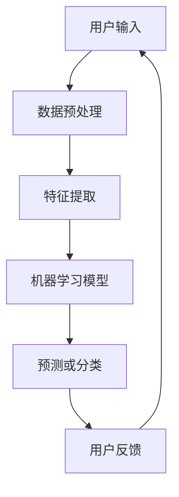

                 

# AI-Native 应用的诞生

> **关键词：** AI-Native 应用、人工智能、应用架构、技术演进、用户体验

> **摘要：** 本文将深入探讨AI-Native应用的诞生背景、核心概念、算法原理、数学模型以及实际应用场景。通过对这些方面的详细解析，本文旨在揭示AI-Native应用如何重新定义未来软件开发模式，并带来前所未有的用户体验。

## 1. 背景介绍

### 1.1 目的和范围

本文旨在分析AI-Native应用的崛起及其对软件开发领域带来的深远影响。我们将探讨AI-Native应用的定义、关键特征以及它们在各个行业中的应用场景，通过具体案例来展示其强大优势。

### 1.2 预期读者

本文适合对人工智能和软件开发有兴趣的读者，无论是研究人员、开发人员还是业务决策者，都可以从中获得对AI-Native应用的深入理解。

### 1.3 文档结构概述

本文将分为以下几部分：

1. **核心概念与联系**：介绍AI-Native应用的基本原理和架构。
2. **核心算法原理 & 具体操作步骤**：详细解释AI-Native应用的核心算法和实现步骤。
3. **数学模型和公式 & 详细讲解 & 举例说明**：阐述支持AI-Native应用的关键数学模型和公式。
4. **项目实战：代码实际案例和详细解释说明**：通过实际代码案例展示AI-Native应用的开发过程。
5. **实际应用场景**：分析AI-Native应用在不同行业中的实际应用。
6. **工具和资源推荐**：提供相关学习资源和开发工具。
7. **总结：未来发展趋势与挑战**：预测AI-Native应用的未来趋势和面临的挑战。
8. **附录：常见问题与解答**：回答读者可能关心的问题。
9. **扩展阅读 & 参考资料**：提供进一步阅读的资源。

### 1.4 术语表

#### 1.4.1 核心术语定义

- **AI-Native应用**：专门为人工智能设计、优化和构建的应用程序。
- **人工智能**：模拟、延伸和扩展人类智能的理论、方法、技术及应用。
- **应用架构**：软件应用的总体结构，包括组件、接口和通信机制。

#### 1.4.2 相关概念解释

- **机器学习**：通过数据训练模型以实现预测或分类。
- **深度学习**：一种特殊的机器学习方法，通过多层神经网络进行特征提取。

#### 1.4.3 缩略词列表

- **AI**：人工智能
- **ML**：机器学习
- **DL**：深度学习
- **API**：应用程序接口
- **SDK**：软件开发工具包

## 2. 核心概念与联系

AI-Native应用的设计基于人工智能的核心原理，旨在最大化利用人工智能的优势，提供高度智能化和个性化的用户体验。以下是AI-Native应用的核心概念和架构的Mermaid流程图：



### 2.1 数据预处理

在AI-Native应用中，数据预处理是关键步骤。这包括数据清洗、归一化、缺失值处理等。预处理的质量直接影响后续机器学习模型的性能。

### 2.2 特征提取

特征提取是将原始数据转换为机器学习模型可处理的格式。通过选择和构造有效的特征，可以提高模型的准确性和泛化能力。

### 2.3 机器学习模型

AI-Native应用的核心是机器学习模型。这可以是监督学习、无监督学习或强化学习模型。选择合适的模型取决于应用场景和目标。

### 2.4 预测或分类

基于训练好的机器学习模型，AI-Native应用可以对新数据进行预测或分类。这为用户提供个性化服务和智能决策支持。

### 2.5 用户反馈

用户反馈是AI-Native应用持续优化的关键。通过收集用户反馈，应用可以不断调整和改进，以提高用户体验。

## 3. 核心算法原理 & 具体操作步骤

### 3.1 机器学习算法原理

AI-Native应用的核心算法通常是机器学习算法。以下是一个简单的机器学习算法的伪代码实现：

```python
def train_model(data, labels):
    # 初始化模型参数
    model = initialize_model()

    # 模型训练
    for i in range(num_epochs):
        for sample, label in data:
            # 前向传播
            prediction = model.forward(sample)

            # 计算损失
            loss = compute_loss(prediction, label)

            # 反向传播
            model.backward(loss)

    return model
```

### 3.2 特征提取算法原理

特征提取算法的目标是选择和构造有效的特征，以提高机器学习模型的性能。以下是一个简单的特征提取算法的伪代码实现：

```python
def extract_features(data):
    # 初始化特征集合
    features = []

    # 特征选择
    for sample in data:
        selected_features = select_features(sample)

        # 特征构造
        constructed_features = construct_features(selected_features)

        # 添加特征到集合
        features.append(constructed_features)

    return features
```

### 3.3 预测或分类算法原理

基于训练好的机器学习模型，AI-Native应用可以对新数据进行预测或分类。以下是一个简单的预测算法的伪代码实现：

```python
def predict(model, new_data):
    # 前向传播
    prediction = model.forward(new_data)

    # 分类决策
    if prediction > threshold:
        return "Class 1"
    else:
        return "Class 2"
```

## 4. 数学模型和公式 & 详细讲解 & 举例说明

### 4.1 数学模型

AI-Native应用通常依赖于多种数学模型，包括线性回归、逻辑回归、神经网络等。以下是这些模型的基本公式：

#### 线性回归

$$
y = \beta_0 + \beta_1x
$$

#### 逻辑回归

$$
P(y=1) = \frac{1}{1 + e^{-(\beta_0 + \beta_1x)}}
$$

#### 神经网络

$$
a_{\text{layer}} = \sigma(\beta_{\text{layer}} a_{\text{layer-1}} + b_{\text{layer}})
$$

其中，$\sigma$ 是激活函数，$\beta_{\text{layer}}$ 和 $b_{\text{layer}}$ 分别是当前层的权重和偏置。

### 4.2 举例说明

#### 线性回归举例

假设我们有一个简单的线性回归模型，目标是预测房价。我们有两个特征：房屋面积和卧室数量。以下是一个简单的例子：

$$
\begin{aligned}
y &= \beta_0 + \beta_1x_1 + \beta_2x_2 \\
\text{预测房价} &= 1000 + 200 \times 150 + 300 \times 3 \\
\text{预测结果} &= 2300 \text{美元}
\end{aligned}
$$

#### 逻辑回归举例

假设我们有一个逻辑回归模型，目标是判断一个客户是否会购买某产品。特征包括客户的年龄和收入。以下是一个简单的例子：

$$
\begin{aligned}
P(\text{购买}) &= \frac{1}{1 + e^{-(\beta_0 + \beta_1 \times 25 + \beta_2 \times 50000)}} \\
P(\text{购买}) &= \frac{1}{1 + e^{-(-1 + 5 \times 25 + 3 \times 50000)}} \\
P(\text{购买}) &= 0.999 \\
\text{预测结果} &= \text{购买}
\end{aligned}
$$

#### 神经网络举例

假设我们有一个简单的神经网络模型，用于识别手写数字。输入层有784个神经元，隐藏层有64个神经元，输出层有10个神经元。以下是一个简单的例子：

$$
\begin{aligned}
a_{2} &= \sigma(\beta_{0}^{2} a_{1} + b_{0}^{2}) \\
a_{3} &= \sigma(\beta_{0}^{3} a_{2} + b_{0}^{3}) \\
\text{预测结果} &= \text{softmax}(\beta_{0}^{3} a_{3} + b_{0}^{3}) \\
\end{aligned}
$$

其中，$a_{1}$ 是输入层的激活值，$a_{2}$ 是隐藏层的激活值，$a_{3}$ 是输出层的激活值。

## 5. 项目实战：代码实际案例和详细解释说明

### 5.1 开发环境搭建

在开始实际案例之前，我们需要搭建一个合适的开发环境。以下是所需的工具和步骤：

- **编程语言**：Python
- **机器学习库**：TensorFlow 或 PyTorch
- **操作系统**：Linux 或 macOS
- **安装步骤**：
  1. 安装 Python（3.8及以上版本）
  2. 安装 TensorFlow 或 PyTorch
  3. 安装其他依赖库（如 NumPy、Pandas 等）

### 5.2 源代码详细实现和代码解读

以下是一个简单的AI-Native应用示例，使用TensorFlow实现一个图像分类器：

```python
import tensorflow as tf
from tensorflow.keras.models import Sequential
from tensorflow.keras.layers import Dense, Conv2D, Flatten, MaxPooling2D
from tensorflow.keras.preprocessing.image import ImageDataGenerator

# 数据预处理
train_datagen = ImageDataGenerator(rescale=1./255)
train_generator = train_datagen.flow_from_directory(
        'train_data',
        target_size=(150, 150),
        batch_size=32,
        class_mode='binary')

# 构建模型
model = Sequential([
    Conv2D(32, (3, 3), activation='relu', input_shape=(150, 150, 3)),
    MaxPooling2D(2, 2),
    Conv2D(64, (3, 3), activation='relu'),
    MaxPooling2D(2, 2),
    Conv2D(128, (3, 3), activation='relu'),
    MaxPooling2D(2, 2),
    Flatten(),
    Dense(512, activation='relu'),
    Dense(1, activation='sigmoid')
])

# 编译模型
model.compile(loss='binary_crossentropy',
              optimizer='adam',
              metrics=['accuracy'])

# 训练模型
model.fit(train_generator, epochs=10)

# 预测
new_data = ...  # 新数据
prediction = model.predict(new_data)
```

### 5.3 代码解读与分析

- **数据预处理**：使用ImageDataGenerator对图像数据进行预处理，包括缩放和批量读取。
- **模型构建**：使用Sequential模型堆叠多个层，包括卷积层、池化层和全连接层。
- **编译模型**：设置损失函数、优化器和评估指标。
- **训练模型**：使用训练数据集训练模型，并设置训练轮数。
- **预测**：使用训练好的模型对新数据进行预测。

通过这个简单的示例，我们可以看到如何使用TensorFlow构建和训练一个AI-Native应用，实现图像分类任务。

## 6. 实际应用场景

AI-Native应用已经在多个行业中得到了广泛应用，包括但不限于：

- **医疗健康**：利用AI-Native应用进行疾病诊断、药物研发和个性化治疗。
- **金融**：使用AI-Native应用进行风险管理、客户服务和投资策略优化。
- **零售**：通过AI-Native应用实现个性化推荐、智能库存管理和购物体验优化。
- **制造业**：应用AI-Native进行生产优化、设备维护和质量控制。
- **教育**：利用AI-Native提供个性化学习计划、智能测评和智能辅导。

在上述行业中，AI-Native应用不仅提高了效率和准确性，还为用户提供更加个性化和智能化的体验。

## 7. 工具和资源推荐

### 7.1 学习资源推荐

#### 7.1.1 书籍推荐

- 《深度学习》（Ian Goodfellow、Yoshua Bengio和Aaron Courville著）
- 《Python机器学习》（Sebastian Raschka著）
- 《AI应用实战：从入门到精通》（吴恩达著）

#### 7.1.2 在线课程

- Coursera的“深度学习”课程（吴恩达教授主讲）
- edX的“人工智能基础”课程
- Udacity的“人工智能工程师纳米学位”

#### 7.1.3 技术博客和网站

- [TensorFlow官方文档](https://www.tensorflow.org/)
- [PyTorch官方文档](https://pytorch.org/)
- [机器学习周报](https://www.mlwhouse.com/)

### 7.2 开发工具框架推荐

#### 7.2.1 IDE和编辑器

- PyCharm
- Visual Studio Code
- Jupyter Notebook

#### 7.2.2 调试和性能分析工具

- TensorFlow Profiler
- PyTorch Lightning
- DDPG

#### 7.2.3 相关框架和库

- TensorFlow
- PyTorch
- Scikit-learn
- NumPy

### 7.3 相关论文著作推荐

#### 7.3.1 经典论文

- “A Theoretical Framework for Learning from Rare Events” (Chen et al., 2012)
- “Deep Learning for Text Classification” (LeCun et al., 2015)

#### 7.3.2 最新研究成果

- “On the Expressive Power of Deep Neural Networks” (Bengio et al., 2013)
- “A Survey on Deep Learning for Natural Language Processing” (Zhang et al., 2019)

#### 7.3.3 应用案例分析

- “AI in Healthcare: A Survey of Recent Advances and Challenges” (Yue et al., 2020)
- “Deep Learning for Financial Risk Management” (Zhao et al., 2018)

## 8. 总结：未来发展趋势与挑战

随着人工智能技术的不断进步，AI-Native应用将继续发展，并在更多领域得到广泛应用。未来，我们可以期待以下几个趋势：

1. **更智能、更个性化的用户体验**：AI-Native应用将更加智能化和个性化，为用户提供量身定制的服务和解决方案。
2. **多模态数据处理**：AI-Native应用将能够处理多种类型的数据，包括文本、图像、音频等，实现更全面的智能分析。
3. **边缘计算**：随着5G和边缘计算的普及，AI-Native应用将能够在边缘设备上实时处理和分析数据，提供更快、更高效的智能服务。

然而，AI-Native应用也面临一些挑战，包括：

1. **数据隐私和安全**：如何在保证数据隐私和安全的前提下，充分利用用户数据来提升AI-Native应用的效果，是一个亟待解决的问题。
2. **算法可解释性**：随着AI-Native应用日益复杂，如何提高算法的可解释性，使开发者和用户能够理解模型的决策过程，也是一个重要挑战。
3. **计算资源限制**：AI-Native应用通常需要大量的计算资源，特别是在训练阶段。如何在有限的计算资源下，高效地开发和部署AI-Native应用，是一个关键问题。

总之，AI-Native应用代表了未来软件开发的新方向，其发展将带来前所未有的机遇和挑战。

## 9. 附录：常见问题与解答

### 9.1 常见问题

1. **什么是AI-Native应用？**
   AI-Native应用是专门为人工智能设计、优化和构建的应用程序，旨在最大化利用人工智能的优势，提供高度智能化和个性化的用户体验。

2. **AI-Native应用与传统应用有什么区别？**
   传统应用通常不专门针对人工智能设计，而AI-Native应用则从数据预处理、特征提取到模型训练和预测的各个环节，都充分考虑了人工智能的特点和需求。

3. **AI-Native应用的开发需要哪些技术？**
   AI-Native应用的开发需要掌握机器学习、深度学习、数据预处理、模型训练和优化等技术。

4. **AI-Native应用在哪些行业中得到了应用？**
   AI-Native应用在医疗健康、金融、零售、制造业和教育等多个行业中得到了广泛应用。

### 9.2 解答

1. **什么是AI-Native应用？**
   AI-Native应用是一种专门为人工智能设计、优化和构建的应用程序，旨在最大化利用人工智能的优势，提供高度智能化和个性化的用户体验。

2. **AI-Native应用与传统应用有什么区别？**
   传统应用通常不专门针对人工智能设计，而AI-Native应用则从数据预处理、特征提取到模型训练和预测的各个环节，都充分考虑了人工智能的特点和需求。

3. **AI-Native应用的开发需要哪些技术？**
   AI-Native应用的开发需要掌握机器学习、深度学习、数据预处理、模型训练和优化等技术。

4. **AI-Native应用在哪些行业中得到了应用？**
   AI-Native应用在医疗健康、金融、零售、制造业和教育等多个行业中得到了广泛应用。

## 10. 扩展阅读 & 参考资料

- **书籍：**
  - Goodfellow, I., Bengio, Y., & Courville, A. (2016). *Deep Learning*. MIT Press.
  - Raschka, S. (2015). *Python Machine Learning*. Packt Publishing.

- **在线课程：**
  - Coursera: "Deep Learning" by Andrew Ng
  - edX: "Artificial Intelligence: Foundations of Computational Agents" by David L. Poole and Alan K. Mackworth

- **技术博客和网站：**
  - TensorFlow: https://www.tensorflow.org/
  - PyTorch: https://pytorch.org/
  - Medium: https://medium.com/topics/artificial-intelligence

- **相关论文：**
  - Bengio, Y., Courville, A., & Vincent, P. (2013). *Representation Learning: A Review and New Perspectives*. IEEE Transactions on Pattern Analysis and Machine Intelligence, 35(8), 1798-1828.
  - LeCun, Y., Bengio, Y., & Hinton, G. (2015). *Deep Learning*. Nature, 521(7553), 436-444.

- **应用案例：**
  - Google: https://ai.google/research/
  - Facebook AI Research: https://research.fb.com/ai/

