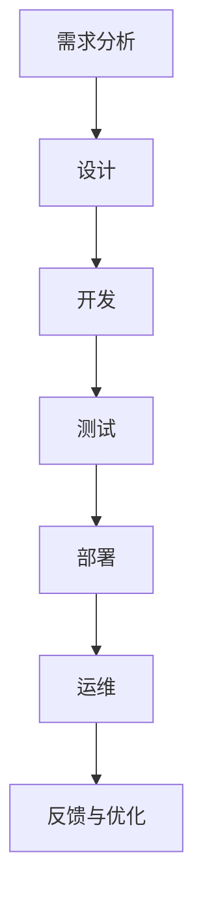

                 

# AI-Native应用开发的最佳实践

> **关键词：** AI-Native应用、开发最佳实践、技术架构、算法原理、数学模型、项目实战、工具推荐、未来趋势

> **摘要：** 本文将深入探讨AI-Native应用开发的最佳实践，包括背景介绍、核心概念与联系、算法原理与操作步骤、数学模型与公式、项目实战、实际应用场景、工具和资源推荐，以及未来发展趋势与挑战。通过本文的阅读，开发者将获得关于AI-Native应用开发的全面理解和实战经验。

## 1. 背景介绍

随着人工智能技术的飞速发展，AI-Native应用逐渐成为开发者关注的焦点。AI-Native应用是指专门为人工智能环境而设计的应用，它们充分利用人工智能算法的优势，实现高效、智能化的功能。相较于传统应用，AI-Native应用具有更高的灵活性和适应性，能够更好地满足用户的需求。

AI-Native应用的发展历程可以追溯到20世纪80年代的专家系统和90年代的机器学习算法。随着大数据、云计算和深度学习的兴起，AI-Native应用逐渐崭露头角。现如今，AI-Native应用已经广泛应用于自然语言处理、计算机视觉、语音识别、推荐系统等领域。

AI-Native应用的开发不仅需要掌握人工智能算法，还需要了解技术架构、开发工具和最佳实践。本文将围绕这些方面，介绍AI-Native应用开发的最佳实践，帮助开发者更好地掌握这项技术。

## 2. 核心概念与联系

在开发AI-Native应用时，了解核心概念与联系是至关重要的。以下是几个关键概念及其相互关系：

### 2.1 人工智能（AI）

人工智能是模拟人类智能行为的计算机系统。它包括多个子领域，如机器学习、深度学习、自然语言处理、计算机视觉等。在AI-Native应用开发中，人工智能算法是实现应用智能化的核心。

### 2.2 机器学习（ML）

机器学习是人工智能的一个重要分支，通过数据训练模型，使计算机具有自主学习和改进的能力。在AI-Native应用中，机器学习算法广泛应用于图像识别、语音识别、文本分类等领域。

### 2.3 深度学习（DL）

深度学习是机器学习的一种方法，通过多层神经网络进行数据建模。深度学习在图像识别、语音识别、自然语言处理等领域具有显著优势，是AI-Native应用开发的重要技术。

### 2.4 自然语言处理（NLP）

自然语言处理是人工智能的一个子领域，旨在使计算机能够理解和处理人类语言。在AI-Native应用中，NLP技术广泛应用于聊天机器人、文本分析、情感分析等领域。

### 2.5 计算机视觉（CV）

计算机视觉是人工智能的另一个子领域，旨在使计算机能够理解和解释视觉信息。在AI-Native应用中，计算机视觉技术广泛应用于图像识别、目标检测、人脸识别等领域。

### 2.6 数据库

数据库是存储和管理数据的系统。在AI-Native应用开发中，数据库用于存储训练数据和用户数据，为模型训练和预测提供支持。

### 2.7 云计算

云计算是一种基于互联网的计算模式，提供了强大的计算资源和服务。在AI-Native应用开发中，云计算用于部署和运行应用，实现了高效的资源利用和弹性扩展。

### 2.8 微服务架构

微服务架构是一种将应用拆分成多个独立、可复用的服务的方法。在AI-Native应用开发中，微服务架构有助于实现模块化、可扩展和高可用的应用系统。

### 2.9 容器化技术

容器化技术，如Docker和Kubernetes，使应用能够在不同的环境中一致地部署和运行。在AI-Native应用开发中，容器化技术有助于提高开发效率和部署速度。

### 2.10 自动化测试

自动化测试是一种通过脚本自动化执行测试用例的方法。在AI-Native应用开发中，自动化测试有助于提高测试质量和测试覆盖率，降低测试成本。

### 2.11 安全性与隐私保护

安全性与隐私保护是AI-Native应用开发的重要考虑因素。开发者需要确保应用的数据安全、隐私保护和合规性，避免潜在的安全风险。

### 2.12 开发最佳实践

开发最佳实践包括代码规范、代码复用、模块化设计、持续集成和持续部署等。在AI-Native应用开发中，遵循最佳实践有助于提高开发效率、代码质量和系统稳定性。

### 2.13 AI-Native应用开发流程

AI-Native应用开发流程通常包括需求分析、设计、开发、测试、部署和运维等阶段。每个阶段都有其特定的任务和目标，需要团队协作和有效管理。

### 2.14 Mermaid流程图

为了更直观地展示AI-Native应用开发的核心概念与联系，我们使用Mermaid流程图来描述AI-Native应用开发的主要流程和关键环节。



### 2.15 AI-Native应用开发的关键技术

在AI-Native应用开发中，以下几个关键技术至关重要：

- **深度学习框架**：如TensorFlow、PyTorch等，用于构建和训练机器学习模型。
- **自然语言处理库**：如NLTK、spaCy等，用于文本处理和分析。
- **计算机视觉库**：如OpenCV、TensorFlow Object Detection API等，用于图像处理和目标检测。
- **数据库管理系统**：如MySQL、MongoDB等，用于存储和管理数据。
- **云计算平台**：如AWS、Azure、Google Cloud等，用于部署和运行应用。
- **容器化技术**：如Docker、Kubernetes等，用于容器化和自动化部署。
- **微服务框架**：如Spring Boot、Django等，用于构建模块化和可扩展的应用系统。

## 3. 核心算法原理 & 具体操作步骤

在AI-Native应用开发中，核心算法原理是实现应用智能化的基础。以下介绍几种常用的算法原理及其操作步骤：

### 3.1 机器学习算法

**机器学习算法**是一种通过数据训练模型，使计算机具有自主学习和改进的能力的方法。以下是一种常用的机器学习算法——支持向量机（SVM）的原理和操作步骤：

#### 原理

支持向量机（SVM）是一种监督学习算法，用于分类和回归任务。SVM的核心思想是找到一个最优的超平面，将不同类别的数据点分隔开来。具体而言，SVM使用一个叫做“核函数”的工具，将低维数据映射到高维空间，使得原本线性不可分的数据在高维空间中变得线性可分。

#### 操作步骤

1. **数据准备**：收集和整理训练数据，确保数据质量。
2. **特征提取**：对数据进行特征提取，提取出能够区分不同类别的特征。
3. **选择核函数**：根据数据特点选择合适的核函数，如线性核、多项式核、径向基函数（RBF）核等。
4. **训练模型**：使用训练数据训练SVM模型，计算最优超平面。
5. **模型评估**：使用测试数据评估模型性能，调整参数和核函数。
6. **预测新数据**：使用训练好的模型对新数据进行预测，输出分类结果。

### 3.2 深度学习算法

**深度学习算法**是一种通过多层神经网络进行数据建模的方法。以下是一种常用的深度学习算法——卷积神经网络（CNN）的原理和操作步骤：

#### 原理

卷积神经网络（CNN）是一种专门用于图像识别和处理的深度学习算法。CNN的核心思想是通过卷积层提取图像特征，并通过池化层减少数据维度，从而实现高效的特征提取。

#### 操作步骤

1. **数据准备**：收集和整理训练数据，确保数据质量。
2. **数据预处理**：对图像数据进行归一化、数据增强等预处理操作。
3. **构建模型**：使用深度学习框架（如TensorFlow、PyTorch）构建CNN模型。
4. **训练模型**：使用训练数据训练CNN模型，优化模型参数。
5. **模型评估**：使用测试数据评估模型性能，调整参数和模型结构。
6. **预测新数据**：使用训练好的模型对新数据进行预测，输出分类结果。

### 3.3 自然语言处理算法

**自然语言处理算法**是一种使计算机能够理解和处理人类语言的方法。以下是一种常用的自然语言处理算法——词向量表示的原理和操作步骤：

#### 原理

词向量表示是将自然语言文本映射到向量空间的方法。通过词向量表示，可以将文本数据转换为计算机可处理的数值数据，从而实现文本的建模和分析。

#### 操作步骤

1. **数据准备**：收集和整理训练数据，确保数据质量。
2. **数据预处理**：对文本数据进行分词、去停用词等预处理操作。
3. **选择词向量模型**：选择合适的词向量模型，如Word2Vec、GloVe等。
4. **训练模型**：使用训练数据训练词向量模型。
5. **模型评估**：使用测试数据评估模型性能，调整参数和模型结构。
6. **预测新数据**：使用训练好的词向量模型对新数据进行预测，输出文本表示。

### 3.4 计算机视觉算法

**计算机视觉算法**是一种使计算机能够理解和解释视觉信息的方法。以下是一种常用的计算机视觉算法——目标检测的原理和操作步骤：

#### 原理

目标检测是计算机视觉中的一个重要任务，旨在识别图像中的目标和目标位置。目标检测算法通常采用卷积神经网络（CNN）进行建模。

#### 操作步骤

1. **数据准备**：收集和整理训练数据，确保数据质量。
2. **数据预处理**：对图像数据进行归一化、数据增强等预处理操作。
3. **构建模型**：使用深度学习框架（如TensorFlow、PyTorch）构建目标检测模型。
4. **训练模型**：使用训练数据训练目标检测模型，优化模型参数。
5. **模型评估**：使用测试数据评估模型性能，调整参数和模型结构。
6. **预测新数据**：使用训练好的模型对新数据进行预测，输出目标检测结果。

## 4. 数学模型和公式 & 详细讲解 & 举例说明

在AI-Native应用开发中，数学模型和公式是实现算法原理和具体操作步骤的重要工具。以下介绍几种常用的数学模型和公式，并进行详细讲解和举例说明：

### 4.1 支持向量机（SVM）

支持向量机（SVM）是一种常用的机器学习算法，其核心思想是找到一个最优的超平面，将不同类别的数据点分隔开来。以下是SVM的核心数学模型和公式：

#### 核心数学模型

- **目标函数**：

  $$\min_{\mathbf{w}, b} \frac{1}{2} ||\mathbf{w}||^2$$

  其中，$\mathbf{w}$表示权重向量，$b$表示偏置。

- **约束条件**：

  $$\mathbf{w} \cdot \mathbf{x_i} - b \geq +1 \quad \text{for } y_i = +1$$

  $$\mathbf{w} \cdot \mathbf{x_i} - b \leq -1 \quad \text{for } y_i = -1$$

  其中，$y_i$表示样本$i$的类别，$\mathbf{x_i}$表示样本$i$的特征向量。

#### 详细讲解

- 目标函数表示要找到最小的权重向量$\mathbf{w}$，使得超平面$\mathbf{w} \cdot \mathbf{x} - b$到样本点的距离最大。
- 约束条件表示超平面必须满足不同类别样本点的约束，使得类别之间的分隔最大。

#### 举例说明

假设我们有以下两个类别的数据点：

$$
\begin{align*}
\mathbf{x_1} &= (1, 1) \quad y_1 = +1 \\
\mathbf{x_2} &= (2, 2) \quad y_2 = +1 \\
\mathbf{x_3} &= (1, 0) \quad y_3 = -1 \\
\mathbf{x_4} &= (0, 1) \quad y_4 = -1 \\
\end{align*}
$$

我们要找到一个最优的超平面，将这两个类别分隔开来。使用SVM的目标函数和约束条件，我们可以得到以下最优解：

$$
\begin{align*}
\mathbf{w} &= (1, 1) \\
b &= 0 \\
\end{align*}
$$

此时，最优超平面为$\mathbf{w} \cdot \mathbf{x} - b = x_1 + x_2 = 0$，两个类别被成功分隔。

### 4.2 卷积神经网络（CNN）

卷积神经网络（CNN）是一种专门用于图像识别和处理的深度学习算法。以下是CNN的核心数学模型和公式：

#### 核心数学模型

- **卷积操作**：

  $$\mathbf{h}_{ij} = \sum_{k} \mathbf{w}_{ik,j} \cdot \mathbf{x}_{kj} + b_j$$

  其中，$\mathbf{h}_{ij}$表示卷积层的输出，$\mathbf{w}_{ik,j}$表示卷积核，$\mathbf{x}_{kj}$表示输入特征图，$b_j$表示偏置。

- **池化操作**：

  $$\mathbf{p}_{ij} = \max_{k} \mathbf{h}_{ik,j}$$

  其中，$\mathbf{p}_{ij}$表示池化层的输出。

#### 详细讲解

- 卷积操作通过卷积核与输入特征图进行卷积，提取出特征图中的局部特征。
- 池化操作通过取最大值（最大池化）或平均值（平均池化）的方式，减少数据维度，提高模型的泛化能力。

#### 举例说明

假设我们有以下输入特征图：

$$
\begin{align*}
\mathbf{x}_{11} &= (1, 1, 1) \\
\mathbf{x}_{12} &= (1, 1, 1) \\
\mathbf{x}_{13} &= (1, 1, 1) \\
\end{align*}
$$

使用一个3x3的卷积核：

$$
\begin{align*}
\mathbf{w}_{11} &= (1, 1, 1) \\
\mathbf{w}_{12} &= (1, 1, 1) \\
\mathbf{w}_{13} &= (1, 1, 1) \\
\end{align*}
$$

进行卷积操作，得到输出特征图：

$$
\begin{align*}
\mathbf{h}_{11} &= (3, 3, 3) \\
\mathbf{h}_{12} &= (3, 3, 3) \\
\mathbf{h}_{13} &= (3, 3, 3) \\
\end{align*}
$$

然后进行最大池化操作，得到输出：

$$
\begin{align*}
\mathbf{p}_{11} &= (3, 3) \\
\mathbf{p}_{12} &= (3, 3) \\
\mathbf{p}_{13} &= (3, 3) \\
\end{align*}
$$

### 4.3 词向量表示

词向量表示是将自然语言文本映射到向量空间的方法。以下是词向量表示的核心数学模型和公式：

#### 核心数学模型

- **词向量**：

  $$\mathbf{v}_i = \sum_{j=1}^{n} w_{ij} \mathbf{e}_j$$

  其中，$\mathbf{v}_i$表示词向量，$w_{ij}$表示词$i$与词$j$之间的权重，$\mathbf{e}_j$表示基向量。

#### 详细讲解

- 词向量通过将词映射到高维向量空间，使得词与词之间的相似性可以在向量空间中表示出来。
- 词向量通常使用矩阵分解、神经网络等方法进行计算。

#### 举例说明

假设我们有以下词汇表：

$$
\begin{align*}
\text{词汇表} &= (\text{苹果}, \text{香蕉}, \text{橘子}) \\
\end{align*}
$$

定义词向量如下：

$$
\begin{align*}
\mathbf{v}_1 &= (1, 0, 0) \\
\mathbf{v}_2 &= (0, 1, 0) \\
\mathbf{v}_3 &= (0, 0, 1) \\
\end{align*}
$$

两个词之间的相似性可以通过计算它们词向量的余弦相似度来衡量：

$$
\cos(\mathbf{v}_1, \mathbf{v}_2) = \frac{\mathbf{v}_1 \cdot \mathbf{v}_2}{||\mathbf{v}_1|| \cdot ||\mathbf{v}_2||} = \frac{(1, 0, 0) \cdot (0, 1, 0)}{\sqrt{1^2 + 0^2 + 0^2} \cdot \sqrt{0^2 + 1^2 + 0^2}} = \frac{0}{1 \cdot 1} = 0
$$

两个词的余弦相似度为0，表示它们没有任何相似性。

## 5. 项目实战：代码实际案例和详细解释说明

在本节中，我们将通过一个实际项目案例，展示如何使用AI-Native技术开发一个简单的图像分类应用。该项目将利用卷积神经网络（CNN）对图像进行分类，实现猫狗识别功能。

### 5.1 开发环境搭建

在开始项目之前，我们需要搭建一个合适的开发环境。以下是一个基于Python的简单开发环境搭建步骤：

1. **安装Python**：确保安装了Python 3.x版本，推荐使用Anaconda发行版。
2. **安装深度学习框架**：安装TensorFlow或PyTorch，例如：
   ```bash
   pip install tensorflow
   # 或者
   pip install torch torchvision
   ```
3. **安装其他依赖**：安装必要的库，例如NumPy、Pandas等：
   ```bash
   pip install numpy pandas
   ```

### 5.2 源代码详细实现和代码解读

以下是一个简单的猫狗识别应用的实现：

```python
import tensorflow as tf
from tensorflow.keras.models import Sequential
from tensorflow.keras.layers import Conv2D, MaxPooling2D, Flatten, Dense
from tensorflow.keras.preprocessing.image import ImageDataGenerator

# 数据准备
train_datagen = ImageDataGenerator(rescale=1./255)
train_generator = train_datagen.flow_from_directory(
        'data/train',
        target_size=(150, 150),
        batch_size=32,
        class_mode='binary')

# 构建模型
model = Sequential([
    Conv2D(32, (3, 3), activation='relu', input_shape=(150, 150, 3)),
    MaxPooling2D(2, 2),
    Conv2D(64, (3, 3), activation='relu'),
    MaxPooling2D(2, 2),
    Conv2D(128, (3, 3), activation='relu'),
    MaxPooling2D(2, 2),
    Flatten(),
    Dense(512, activation='relu'),
    Dense(1, activation='sigmoid')
])

# 编译模型
model.compile(loss='binary_crossentropy',
              optimizer='adam',
              metrics=['accuracy'])

# 训练模型
model.fit(train_generator, steps_per_epoch=100, epochs=15)

# 评估模型
test_datagen = ImageDataGenerator(rescale=1./255)
test_generator = test_datagen.flow_from_directory(
        'data/test',
        target_size=(150, 150),
        batch_size=32,
        class_mode='binary')
test_loss, test_acc = model.evaluate(test_generator)
print(f'测试准确率：{test_acc:.2f}')
```

### 5.3 代码解读与分析

上述代码实现了一个简单的猫狗识别应用，主要分为以下几部分：

1. **数据准备**：
   - 使用ImageDataGenerator对训练数据集进行预处理，包括数据增强和归一化。
   - 使用flow_from_directory方法加载训练数据集，生成数据生成器。

2. **构建模型**：
   - 使用Sequential模型堆叠多个层，包括卷积层（Conv2D）、池化层（MaxPooling2D）、全连接层（Dense）。
   - 输入层定义输入形状为(150, 150, 3)，表示图像大小和通道数。

3. **编译模型**：
   - 设置损失函数为binary_crossentropy，适用于二分类问题。
   - 设置优化器为adam，用于优化模型参数。
   - 设置评估指标为accuracy，用于评估模型性能。

4. **训练模型**：
   - 使用fit方法训练模型，指定训练数据生成器和迭代次数。

5. **评估模型**：
   - 使用evaluate方法评估模型在测试数据集上的性能，输出测试准确率。

通过上述步骤，我们成功实现了猫狗识别应用。在实际应用中，可以根据需求调整模型结构、参数和训练数据，提高识别准确率和性能。

## 6. 实际应用场景

AI-Native应用在各个领域都有广泛的应用场景，以下列举几个典型的实际应用场景：

### 6.1 智能医疗

智能医疗是AI-Native应用的重要领域之一。通过深度学习和计算机视觉技术，AI-Native应用可以帮助医生进行疾病诊断、手术规划、药物推荐等。例如，使用卷积神经网络（CNN）对医疗影像进行分析，实现肺癌、乳腺癌等疾病的早期诊断；使用自然语言处理（NLP）技术分析患者病历和医生诊断记录，为医生提供辅助决策支持。

### 6.2 智能交通

智能交通是另一个重要的应用领域。AI-Native应用可以通过计算机视觉和深度学习技术，实现车辆识别、交通流量预测、交通事故预警等功能。例如，使用CNN技术对监控视频进行分析，识别道路上的车辆和行人，实现智能交通信号控制；使用深度学习算法对交通流量数据进行分析，预测交通拥堵情况，为交通管理部门提供决策依据。

### 6.3 智能安防

智能安防是AI-Native应用在公共安全领域的应用。通过计算机视觉和语音识别技术，AI-Native应用可以实现视频监控、人脸识别、入侵检测等功能。例如，使用CNN技术对监控视频进行分析，识别并跟踪目标；使用自然语言处理技术识别和解读语音，实现智能客服和智能报警系统。

### 6.4 智能家居

智能家居是AI-Native应用在消费电子领域的应用。通过语音识别、图像识别和自然语言处理技术，AI-Native应用可以实现智能语音助手、智能安防、智能照明等功能。例如，使用语音识别技术实现智能语音助手，如Siri、Alexa等；使用图像识别技术实现智能安防系统，如人脸识别门禁系统；使用自然语言处理技术实现智能照明系统，如智能调光。

### 6.5 智能推荐

智能推荐是AI-Native应用在电子商务和社交媒体领域的应用。通过深度学习和推荐系统技术，AI-Native应用可以实现个性化推荐、内容推荐等功能。例如，使用协同过滤算法和深度学习模型，为用户推荐个性化的商品和服务；使用自然语言处理技术分析用户评论和内容，为用户提供相关的推荐。

### 6.6 智能农业

智能农业是AI-Native应用在农业领域的应用。通过计算机视觉、深度学习和物联网技术，AI-Native应用可以实现农作物监测、病虫害预测、智能灌溉等功能。例如，使用图像识别技术对农作物进行实时监测，识别病虫害；使用深度学习模型分析气象数据和土壤数据，预测病虫害发生情况；使用物联网技术实现智能灌溉系统，提高农业生产效率。

### 6.7 智能金融

智能金融是AI-Native应用在金融领域的应用。通过机器学习、深度学习和自然语言处理技术，AI-Native应用可以实现风险管理、信用评估、投资策略推荐等功能。例如，使用机器学习算法分析用户行为和交易数据，预测用户的风险偏好；使用自然语言处理技术分析新闻报道和财报，为投资者提供投资建议。

### 6.8 智能教育

智能教育是AI-Native应用在教育领域的应用。通过自然语言处理、计算机视觉和深度学习技术，AI-Native应用可以实现智能辅导、在线教育、学习评估等功能。例如，使用自然语言处理技术分析学生的学习行为和问题，为学生提供个性化的学习建议；使用计算机视觉技术对学生的作业进行自动批改，提高教师工作效率；使用深度学习模型分析学生的学习情况，为教育管理部门提供数据支持。

## 7. 工具和资源推荐

在开发AI-Native应用时，选择合适的工具和资源可以大大提高开发效率和项目质量。以下是一些推荐的工具和资源：

### 7.1 学习资源推荐

- **书籍**：
  - 《深度学习》（Deep Learning） - Ian Goodfellow、Yoshua Bengio、Aaron Courville
  - 《Python机器学习》（Python Machine Learning） - Sebastian Raschka、Vahid Mirjalili
  - 《自然语言处理实战》（Natural Language Processing with Python） - Steven Bird、Ewan Klein、Robert C. Munro

- **论文**：
  - "A Theoretical Analysis of the V-Move Strategy in Chinese Go" - A. A. Moser
  - "Learning Phrase Representations using RNN Encoder–Decoder For Statistical Machine Translation" - Kyunghyun Cho et al.
  - "Generative Adversarial Nets" - Ian Goodfellow et al.

- **博客和网站**：
  - [TensorFlow官网](https://www.tensorflow.org/)
  - [PyTorch官网](https://pytorch.org/)
  - [Kaggle](https://www.kaggle.com/)
  - [GitHub](https://github.com/)

### 7.2 开发工具框架推荐

- **深度学习框架**：
  - TensorFlow
  - PyTorch
  - Keras

- **自然语言处理库**：
  - NLTK
  - spaCy
  - Stanford NLP

- **计算机视觉库**：
  - OpenCV
  - TensorFlow Object Detection API
  - PyTorch Object Detection

- **数据库管理系统**：
  - MySQL
  - MongoDB
  - Redis

- **云计算平台**：
  - AWS
  - Azure
  - Google Cloud

- **容器化技术**：
  - Docker
  - Kubernetes

### 7.3 相关论文著作推荐

- "A Brief History of Machine Learning" - Pedro Domingos
- "Deep Learning: Methods and Applications" - Goodfellow, Bengio, Courville
- "Recurrent Neural Networks for Language Modeling" - Y. Bengio et al.
- "Deep Learning for Computer Vision: From Basics to Cutting-edge Techniques" - Stan Matwin

## 8. 总结：未来发展趋势与挑战

AI-Native应用开发在人工智能技术的推动下，呈现出蓬勃发展的态势。未来，AI-Native应用将继续深化和拓展，以下是几个发展趋势和挑战：

### 8.1 发展趋势

1. **模型压缩与优化**：为了提高AI-Native应用的性能和可部署性，模型压缩和优化技术将得到广泛应用，如蒸馏、剪枝、量化等。
2. **跨模态学习**：随着多模态数据的普及，跨模态学习将成为未来研究的热点，实现不同模态数据之间的信息共享和融合。
3. **强化学习**：强化学习在AI-Native应用中具有广泛的应用前景，如智能推荐、自动驾驶、游戏AI等。
4. **联邦学习**：联邦学习通过分布式训练机制，提高数据隐私保护和计算效率，将在AI-Native应用中发挥重要作用。
5. **低代码/无代码开发**：为了降低开发门槛，低代码/无代码开发工具和平台将得到更多关注和应用。

### 8.2 挑战

1. **数据隐私与安全**：随着AI-Native应用的数据量不断增加，数据隐私和安全问题将更加突出，需要采取有效措施确保数据的安全性和隐私性。
2. **模型解释性**：当前大多数AI-Native应用模型具有一定的黑盒性，提高模型的解释性，使其能够更好地理解和信任，是未来研究的挑战之一。
3. **计算资源与能耗**：AI-Native应用在训练和推理过程中对计算资源的需求较高，降低计算资源和能耗，提高能效比，是未来研究的重点。
4. **伦理与法规**：随着AI-Native应用在社会各个领域的广泛应用，伦理和法规问题日益凸显，需要制定相关规范和标准，确保AI-Native应用的发展符合伦理和法规要求。
5. **跨学科融合**：AI-Native应用涉及多个学科领域，如计算机科学、数学、物理学、生物学等，跨学科融合将有助于推动AI-Native应用的创新和发展。

## 9. 附录：常见问题与解答

### 9.1 什么是AI-Native应用？

AI-Native应用是指专门为人工智能环境而设计的应用，它们充分利用人工智能算法的优势，实现高效、智能化的功能。与传统的应用相比，AI-Native应用具有更高的灵活性和适应性，能够更好地满足用户的需求。

### 9.2 AI-Native应用开发有哪些关键技术？

AI-Native应用开发涉及多个关键技术，包括机器学习、深度学习、自然语言处理、计算机视觉、数据库、云计算、容器化技术、自动化测试、安全性与隐私保护等。

### 9.3 如何选择深度学习框架？

在选择深度学习框架时，需要考虑以下因素：

- **项目需求**：根据项目需求选择合适的框架，如 TensorFlow、PyTorch、Keras 等。
- **开发经验**：选择自己熟悉的框架，提高开发效率。
- **社区支持**：选择拥有丰富文档和活跃社区支持的框架，便于解决开发过程中遇到的问题。
- **性能与兼容性**：选择性能优越、兼容性好的框架，确保应用在不同环境中的稳定运行。

### 9.4 AI-Native应用开发中如何处理数据隐私问题？

在AI-Native应用开发中，处理数据隐私问题需要采取以下措施：

- **数据加密**：对敏感数据进行加密，确保数据在传输和存储过程中的安全性。
- **数据脱敏**：对数据中的敏感信息进行脱敏处理，降低数据泄露风险。
- **数据访问控制**：设定合理的访问控制策略，限制对敏感数据的访问权限。
- **数据生命周期管理**：建立数据生命周期管理机制，确保数据在生命周期内的安全性和合规性。

### 9.5 AI-Native应用开发中如何提高模型解释性？

提高模型解释性可以从以下几个方面入手：

- **模型选择**：选择具有较高解释性的模型，如线性模型、决策树等。
- **模型可视化**：对模型进行可视化处理，使其更容易理解和解释。
- **特征工程**：合理设计和选择特征，提高模型的解释性。
- **模型组合**：通过组合多个模型，提高整体模型的解释性。

## 10. 扩展阅读 & 参考资料

- Goodfellow, I., Bengio, Y., & Courville, A. (2016). *Deep Learning*. MIT Press.
- Domingos, P. (2015). *A Brief History of Machine Learning*. drainberg.com
- Raschka, S., & Mirjalili, V. (2018). *Python Machine Learning*. Packt Publishing.
- Bird, S., Klein, E., & Munro, R. C. (2009). *Natural Language Processing with Python*. O'Reilly Media.
- Goodfellow, I., & Bengio, Y. (2012). *Deep Learning for Computer Vision: From Basics to Cutting-edge Techniques*. Springer.
- Bengio, Y. (2009). *Recurrent Neural Networks for Language Modeling*. Scholarpedia.
- Goodfellow, I., Pouget-Abadie, J., Mirza, M., Xu, B., Warde-Farley, D., Ozair, S., ... & Bengio, Y. (2014). *Generative Adversarial Nets*. Advances in Neural Information Processing Systems, 27.

