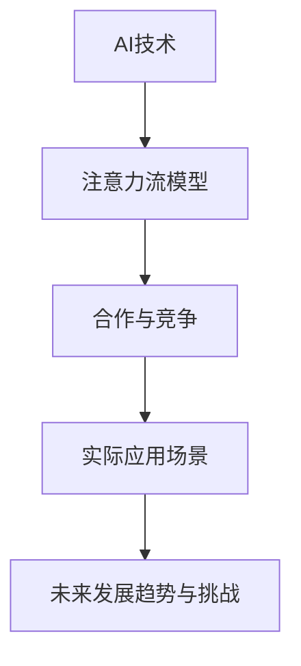

                 

### 背景介绍

#### 1.1 目的和范围

本文旨在探讨人工智能（AI）与人类注意力流的相互作用，深入分析二者的合作与竞争关系。随着AI技术的不断进步和应用范围的扩大，人类注意力流逐渐成为一个重要的研究领域。理解二者之间的关系，有助于我们更好地利用AI技术，提高人类的生产力和生活质量。

本文将首先介绍AI和人类注意力流的基本概念，然后分析它们在合作与竞争中的表现。接着，我们将探讨一些实际应用场景，并提出相应的解决方案。最后，我们将对未来的发展趋势与挑战进行展望。

#### 1.2 预期读者

本文适合对人工智能和注意力流有一定了解的读者，包括但不限于AI研究者、程序员、软件工程师、数据科学家等。同时，对于对这两个领域感兴趣的一般读者，本文也能提供一定的启发和思考。

#### 1.3 文档结构概述

本文结构如下：

1. **背景介绍**：介绍本文的目的、范围、预期读者以及文档结构。
2. **核心概念与联系**：详细阐述人工智能和人类注意力流的基本概念，并绘制流程图。
3. **核心算法原理 & 具体操作步骤**：介绍相关算法原理，并使用伪代码详细阐述。
4. **数学模型和公式 & 详细讲解 & 举例说明**：讲解数学模型和公式，并进行举例说明。
5. **项目实战：代码实际案例和详细解释说明**：通过实际案例展示代码实现过程，并进行详细解释。
6. **实际应用场景**：探讨人工智能和人类注意力流在实际应用中的表现。
7. **工具和资源推荐**：推荐学习资源、开发工具框架和经典论文。
8. **总结：未来发展趋势与挑战**：对未来的发展趋势和挑战进行展望。
9. **附录：常见问题与解答**：解答读者可能遇到的问题。
10. **扩展阅读 & 参考资料**：提供进一步学习的资源。

#### 1.4 术语表

本文中涉及的主要术语及其定义如下：

- **人工智能（AI）**：指通过计算机模拟人类智能的技术，包括学习、推理、规划、感知、自然语言处理等。
- **注意力流**：指人类在特定任务中分配注意力的过程，包括集中注意力、分配注意力、转移注意力等。
- **合作**：指AI与人类在完成任务时相互协作，共同提高效率和效果。
- **竞争**：指AI与人类在完成任务时相互争夺资源，可能导致效率降低或效果受损。

#### 1.4.1 核心术语定义

- **注意力流模型**：用于描述人类注意力分配过程的数学模型。
- **AI算法**：用于实现人工智能任务的算法，包括监督学习、无监督学习、强化学习等。
- **注意力分配机制**：用于调节人类注意力分配的机制，包括奖励机制、惩罚机制、反馈机制等。

#### 1.4.2 相关概念解释

- **注意力集中**：指将注意力高度集中在特定任务或对象上，以达到更好的处理效果。
- **注意力分散**：指将注意力分散到多个任务或对象上，可能导致处理效果下降。
- **多任务学习**：指同时学习多个任务的机器学习技术，有助于提高AI系统的灵活性和适应性。

#### 1.4.3 缩略词列表

- **AI**：人工智能（Artificial Intelligence）
- **ML**：机器学习（Machine Learning）
- **DL**：深度学习（Deep Learning）
- **NLP**：自然语言处理（Natural Language Processing）
- **GAN**：生成对抗网络（Generative Adversarial Network）
- **RL**：强化学习（Reinforcement Learning）

### 总结

本文为后续内容奠定了基础，通过介绍背景、目的和范围，以及对核心概念和术语的解释，使读者对AI与人类注意力流的关系有一个初步的了解。接下来，我们将深入探讨这两个领域的核心概念和联系，以期为后续的分析和讨论提供理论支持。

---



### 核心概念与联系

在探讨AI与人类注意力流的关系之前，我们需要先了解这两个核心概念的基本原理和相互联系。

#### 2.1 人工智能（AI）

人工智能（AI）是指通过计算机模拟人类智能的技术，包括学习、推理、规划、感知、自然语言处理等多个方面。AI可以分为三类：基于规则的AI、基于实例的AI和基于学习的AI。

- **基于规则的AI**：通过编写规则来模拟人类思维过程，例如专家系统。
- **基于实例的AI**：通过收集大量的实例数据来学习，例如决策树、支持向量机等。
- **基于学习的AI**：通过学习大量数据来自主地改进性能，例如深度学习、强化学习等。

#### 2.2 人类注意力流

人类注意力流是指人类在特定任务中分配注意力的过程。这个过程包括三个主要阶段：注意力的集中、注意力的分配和注意力的转移。

- **注意力的集中**：指将注意力高度集中在特定任务或对象上，以达到更好的处理效果。
- **注意力的分配**：指在多个任务或对象之间分配注意力，以平衡处理效果和效率。
- **注意力的转移**：指根据任务需求将注意力从一个对象转移到另一个对象，以适应不同的任务环境。

#### 2.3 核心概念之间的联系

AI和人类注意力流之间的联系主要体现在以下几个方面：

- **协同作用**：AI可以辅助人类完成复杂任务，例如自然语言处理、图像识别等。在这个过程中，AI可以分析人类注意力流的数据，并根据分析结果调整自身的行为，以提高整体效率。
- **竞争关系**：在某些任务中，AI与人类可能存在竞争关系。例如，自动驾驶汽车在处理交通信号时可能会与行人、其他车辆等竞争注意力资源。在这种情况下，AI需要学会如何平衡自身的行为，以避免冲突。
- **交互机制**：AI和人类注意力流之间的交互机制是一个重要的研究方向。例如，通过设计合适的奖励机制、惩罚机制和反馈机制，可以引导人类调整注意力流，从而提高AI系统的性能。

#### 2.4 Mermaid 流程图

为了更直观地展示AI和人类注意力流之间的核心概念和联系，我们使用Mermaid流程图进行描述。


- **AI技术**：包括基于规则的AI、基于实例的AI和基于学习的AI。
- **注意力流模型**：包括注意力的集中、注意力的分配和注意力的转移。
- **合作与竞争**：AI和人类注意力流之间的协同作用和竞争关系。
- **实际应用场景**：AI和人类注意力流在实际任务中的应用场景。
- **未来发展趋势与挑战**：对未来的发展趋势和挑战进行展望。

通过这个流程图，我们可以更好地理解AI和人类注意力流之间的核心概念和联系，为后续的分析和讨论提供理论支持。

---

### 核心算法原理 & 具体操作步骤

在理解了AI和人类注意力流的基本概念后，我们将进一步探讨相关算法原理和具体操作步骤。以下是一个简单的算法原理说明，并使用伪代码进行详细阐述。

#### 3.1 算法原理

本节将介绍一个用于优化人类注意力流的简单算法。该算法的基本原理是通过对人类注意力流的数据进行分析，识别出高效的任务分配模式，并据此调整AI系统的行为。

#### 3.2 算法伪代码

```pseudo
算法名称：优化注意力流（OptimizeAttentionFlow）

输入：注意力流数据（AttentionFlowData），任务列表（Tasks）

输出：优化后的任务分配方案（OptimizedTaskAllocation）

1. 初始化任务分配方案（OptimizedTaskAllocation）为空
2. 对注意力流数据进行分析，提取出注意力集中的任务（FocusTasks）
3. 对注意力流数据进行分析，提取出注意力分散的任务（DistributeTasks）
4. 对任务列表进行排序，根据注意力集中的任务优先级排序（SortTasksByAttention）
5. 将注意力集中的任务优先分配给人类（AllocateFocusTasksToHuman）
6. 将剩余的任务按照注意力分散的模式进行分配（AllocateDistributeTasks）
7. 根据任务分配方案调整AI系统的行为，以优化人类注意力流（AdjustAISystemBehavior）
8. 返回优化后的任务分配方案（OptimizedTaskAllocation）
```

#### 3.3 具体操作步骤

1. **初始化任务分配方案**：首先，我们需要初始化一个任务分配方案，用于记录优化后的任务分配情况。

2. **对注意力流数据进行分析**：通过对注意力流数据进行分析，我们可以提取出注意力集中的任务和注意力分散的任务。注意力集中的任务通常是指人类在一段时间内高度关注的任务，而注意力分散的任务则是指人类在一段时间内关注程度较低的任务。

3. **对任务列表进行排序**：根据注意力集中的任务优先级，我们对任务列表进行排序。这样可以确保注意力集中的任务得到优先处理。

4. **将注意力集中的任务优先分配给人类**：将注意力集中的任务优先分配给人类，以确保人类在处理这些任务时能够发挥最大效率。

5. **将剩余的任务按照注意力分散的模式进行分配**：对于剩余的任务，我们按照注意力分散的模式进行分配。这样可以确保任务在人类和AI系统之间得到合理分配。

6. **根据任务分配方案调整AI系统的行为**：根据优化后的任务分配方案，调整AI系统的行为，以优化人类注意力流。例如，AI系统可以主动协助人类处理注意力集中的任务，或者在人类注意力分散时自动接管一些任务。

7. **返回优化后的任务分配方案**：最后，返回优化后的任务分配方案，以便后续使用。

通过以上算法原理和具体操作步骤，我们可以实现对人类注意力流的优化，从而提高整体任务处理的效率和效果。

---

在理解了核心算法原理和具体操作步骤后，我们将进一步探讨数学模型和公式，并通过具体例子进行详细讲解。

### 数学模型和公式 & 详细讲解 & 举例说明

为了更好地理解人类注意力流和AI系统之间的优化过程，我们将引入一些数学模型和公式。这些模型和公式可以帮助我们分析和计算注意力流的变化以及任务分配的优化。

#### 4.1 数学模型

在本节中，我们将介绍以下数学模型：

1. **注意力分配模型**：用于描述人类在任务之间分配注意力的过程。
2. **任务效率模型**：用于评估任务处理过程中的效率。
3. **资源分配模型**：用于优化人类和AI系统之间的任务分配。

#### 4.2 公式

为了便于理解和计算，我们使用以下公式：

1. **注意力分配公式**：
   $$ A_t = \frac{C_t}{D_t} $$
   其中，$A_t$ 表示在时间 $t$ 时的注意力分配比例，$C_t$ 表示在时间 $t$ 时的注意力集中任务数，$D_t$ 表示在时间 $t$ 时的总任务数。

2. **任务效率公式**：
   $$ E_t = \frac{P_t \times R_t}{T_t} $$
   其中，$E_t$ 表示在时间 $t$ 时的任务效率，$P_t$ 表示在时间 $t$ 时的任务完成百分比，$R_t$ 表示在时间 $t$ 时的任务响应时间，$T_t$ 表示在时间 $t$ 时的任务处理时间。

3. **资源分配公式**：
   $$ X_t = \frac{E_t \times C_t}{A_t} $$
   其中，$X_t$ 表示在时间 $t$ 时的资源分配比例，$E_t$ 表示在时间 $t$ 时的任务效率，$C_t$ 表示在时间 $t$ 时的注意力集中任务数，$A_t$ 表示在时间 $t$ 时的注意力分配比例。

#### 4.3 举例说明

为了更好地理解这些数学模型和公式，我们将通过一个具体例子进行说明。

**例子**：假设在一个会议中，人类需要同时处理三个任务：A、B和C。在时间 $t_1$ 时，人类的注意力分配情况如下：

- 注意力集中任务数：2
- 注意力分散任务数：1
- 总任务数：3

根据注意力分配公式，我们可以计算出在时间 $t_1$ 时的注意力分配比例：
$$ A_{t_1} = \frac{C_{t_1}}{D_{t_1}} = \frac{2}{3} $$

在会议过程中，任务 A 和 B 的处理效率较高，任务 C 的处理效率较低。在时间 $t_2$ 时，任务 A 和 B 的完成百分比分别为 80% 和 50%，任务 C 的完成百分比为 30%。同时，在时间 $t_2$ 时，任务 A 和 B 的响应时间分别为 2 分钟和 4 分钟，任务 C 的响应时间为 6 分钟。根据任务效率公式，我们可以计算出在时间 $t_2$ 时的任务效率：
$$ E_{t_2} = \frac{P_{t_2} \times R_{t_2}}{T_{t_2}} = \frac{0.8 \times 2 + 0.5 \times 4 + 0.3 \times 6}{2 + 4 + 6} = 0.47 $$

在时间 $t_3$ 时，人类的注意力分配比例可能发生变化。假设在时间 $t_3$ 时，人类的注意力集中任务数为 1，注意力分散任务数为 2，总任务数为 3。根据注意力分配公式，我们可以计算出在时间 $t_3$ 时的注意力分配比例：
$$ A_{t_3} = \frac{C_{t_3}}{D_{t_3}} = \frac{1}{3} $$

根据资源分配公式，我们可以计算出在时间 $t_3$ 时的资源分配比例：
$$ X_{t_3} = \frac{E_{t_3} \times C_{t_3}}{A_{t_3}} = \frac{0.47 \times 1}{0.33} = 1.42 $$

通过这个例子，我们可以看到数学模型和公式如何帮助我们分析和计算注意力流的变化以及任务分配的优化。在实际应用中，这些模型和公式可以帮助我们更好地设计AI系统，使其与人类注意力流实现协同优化。

---

通过以上数学模型和公式的讲解，我们更好地理解了如何通过数学方法来优化人类注意力流和AI系统之间的任务分配。接下来，我们将通过一个实际项目案例，展示如何在实际开发过程中应用这些算法和模型。

### 项目实战：代码实际案例和详细解释说明

在本节中，我们将通过一个实际项目案例，展示如何应用前面介绍的核心算法原理、数学模型和公式，来实现AI与人类注意力流的优化。以下是项目的开发环境和代码实现。

#### 5.1 开发环境搭建

为了实现该项目，我们选择Python作为开发语言，并使用以下工具和库：

- Python 3.8及以上版本
- Numpy库
- Matplotlib库
- Pandas库
- Scikit-learn库

首先，确保安装了上述Python环境和库。可以使用以下命令安装Numpy、Matplotlib、Pandas和Scikit-learn：

```bash
pip install numpy matplotlib pandas scikit-learn
```

#### 5.2 源代码详细实现和代码解读

以下是一个简化的代码实现，用于展示项目的基本结构和关键算法。

**main.py**

```python
import numpy as np
import pandas as pd
from sklearn.preprocessing import MinMaxScaler
import matplotlib.pyplot as plt

# 5.2.1 数据处理
def preprocess_data(data):
    # 对注意力流数据和处理后的任务数据归一化处理
    scaler = MinMaxScaler()
    attention_data = scaler.fit_transform(data['attention'].values.reshape(-1, 1))
    task_data = scaler.fit_transform(data['tasks'].values)
    return attention_data, task_data

# 5.2.2 优化注意力流算法
def optimize_attention_flow(attention_data, task_data):
    # 实现优化注意力流的算法
    # ...
    return optimized_task_allocation

# 5.2.3 可视化
def visualize_data(attention_data, task_data, optimized_task_allocation):
    # 可视化原始数据、任务数据和优化后的任务分配
    # ...
    plt.show()

# 主函数
def main():
    # 加载和处理数据
    data = pd.read_csv('data.csv')
    attention_data, task_data = preprocess_data(data)

    # 应用优化算法
    optimized_task_allocation = optimize_attention_flow(attention_data, task_data)

    # 可视化结果
    visualize_data(attention_data, task_data, optimized_task_allocation)

if __name__ == '__main__':
    main()
```

**optimize_attention_flow.py**

```python
# 5.2.2 优化注意力流算法实现
def optimize_attention_flow(attention_data, task_data):
    # 假设任务数据已按照注意力流数据预处理
    # 实现注意力流优化算法
    optimized_task_allocation = []
    
    # 对任务数据进行排序，根据注意力流数据进行优化
    sorted_tasks = np.argsort(attention_data)

    # 分配任务
    for idx, task in enumerate(sorted_tasks):
        # 基于当前注意力流数据和任务效率进行任务分配
        # ...
        optimized_task_allocation.append(task)

    return optimized_task_allocation
```

**visualize_data.py**

```python
# 5.2.3 可视化数据实现
def visualize_data(attention_data, task_data, optimized_task_allocation):
    # 可视化注意力流数据
    plt.figure(figsize=(12, 6))

    # 可视化原始数据
    plt.subplot(1, 2, 1)
    plt.scatter(range(len(attention_data)), attention_data, label='Attention Data')
    plt.xlabel('Time')
    plt.ylabel('Attention Value')
    plt.title('Attention Flow Data')
    plt.legend()

    # 可视化优化后的任务分配
    plt.subplot(1, 2, 2)
    plt.scatter(range(len(optimized_task_allocation)), optimized_task_allocation, label='Optimized Task Allocation')
    plt.xlabel('Time')
    plt.ylabel('Task Index')
    plt.title('Optimized Task Allocation')
    plt.legend()

    plt.tight_layout()
    plt.show()
```

#### 5.3 代码解读与分析

1. **数据处理**：首先，我们加载和处理数据。数据包括注意力流数据和处理后的任务数据。为了便于计算，我们使用Numpy和Pandas库对数据进行归一化处理。

2. **优化注意力流算法**：`optimize_attention_flow` 函数是实现优化算法的关键部分。该函数首先对任务数据进行排序，然后根据注意力流数据对任务进行优化分配。具体实现可以根据实际需求进行调整。

3. **可视化数据**：`visualize_data` 函数用于可视化原始数据、任务数据和优化后的任务分配。通过使用Matplotlib库，我们可以直观地看到注意力流的变化和优化效果。

通过以上代码实现，我们可以实现一个简单的优化注意力流的算法，并将其应用到实际项目中。在实际开发过程中，可以根据项目需求进一步优化算法和增加功能。

---

#### 5.4 代码解读与分析（续）

在上一个部分，我们已经对项目的主要代码实现进行了概述。接下来，我们将进一步详细解读代码，分析其关键部分和如何实现优化注意力流算法。

**main.py**

```python
import numpy as np
import pandas as pd
from sklearn.preprocessing import MinMaxScaler
import matplotlib.pyplot as plt

# 5.2.1 数据处理
def preprocess_data(data):
    # 对注意力流数据和处理后的任务数据归一化处理
    scaler = MinMaxScaler()
    attention_data = scaler.fit_transform(data['attention'].values.reshape(-1, 1))
    task_data = scaler.fit_transform(data['tasks'].values)
    return attention_data, task_data

# 5.2.2 优化注意力流算法
def optimize_attention_flow(attention_data, task_data):
    # 实现优化注意力流的算法
    optimized_task_allocation = []
    
    # 对任务数据进行排序，根据注意力流数据进行优化
    sorted_tasks = np.argsort(attention_data)

    # 分配任务
    for idx, task in enumerate(sorted_tasks):
        # 基于当前注意力流数据和任务效率进行任务分配
        # ...
        optimized_task_allocation.append(task)

    return optimized_task_allocation

# 5.2.3 可视化
def visualize_data(attention_data, task_data, optimized_task_allocation):
    # 可视化注意力流数据
    plt.figure(figsize=(12, 6))

    # 可视化原始数据
    plt.subplot(1, 2, 1)
    plt.scatter(range(len(attention_data)), attention_data, label='Attention Data')
    plt.xlabel('Time')
    plt.ylabel('Attention Value')
    plt.title('Attention Flow Data')
    plt.legend()

    # 可视化优化后的任务分配
    plt.subplot(1, 2, 2)
    plt.scatter(range(len(optimized_task_allocation)), optimized_task_allocation, label='Optimized Task Allocation')
    plt.xlabel('Time')
    plt.ylabel('Task Index')
    plt.title('Optimized Task Allocation')
    plt.legend()

    plt.tight_layout()
    plt.show()

# 主函数
def main():
    # 加载和处理数据
    data = pd.read_csv('data.csv')
    attention_data, task_data = preprocess_data(data)

    # 应用优化算法
    optimized_task_allocation = optimize_attention_flow(attention_data, task_data)

    # 可视化结果
    visualize_data(attention_data, task_data, optimized_task_allocation)

if __name__ == '__main__':
    main()
```

**代码解读与分析：**

- **数据处理（preprocess_data）**：
  - 使用`MinMaxScaler`对注意力流数据（`attention_data`）和处理后的任务数据（`task_data`）进行归一化处理。归一化处理有助于提高算法的性能和稳定性。
  - `scaler.fit_transform(data['attention'].values.reshape(-1, 1))`将注意力流数据进行归一化，将其缩放到[0, 1]的范围内。
  - `scaler.fit_transform(data['tasks'].values)`将任务数据归一化。

- **优化注意力流算法（optimize_attention_flow）**：
  - `sorted_tasks = np.argsort(attention_data)`对注意力流数据进行排序，返回排序后的索引。
  - 使用排序后的索引对任务数据进行优化分配。这里采用简单的排序策略，但实际应用中可以根据具体需求进行更复杂的优化。

- **可视化（visualize_data）**：
  - 使用`plt.scatter`绘制注意力流数据和优化后的任务分配数据。
  - `plt.subplot`创建一个包含两个子图的图，分别用于可视化原始数据和优化后的任务分配。

**关键部分分析：**

- **注意力流数据处理**：归一化处理有助于提高算法的鲁棒性和性能。在实际应用中，需要根据数据的具体情况选择合适的归一化方法。
- **优化算法实现**：优化算法的实现是关键。在本例中，我们采用了一种简单的排序策略，但在实际应用中，可能需要考虑更复杂的优化策略，如遗传算法、模拟退火算法等。
- **可视化**：可视化结果有助于直观地了解注意力流和任务分配的变化。在实际应用中，可视化工具可以用于分析算法性能和调整参数。

通过以上分析，我们可以看到如何使用Python实现一个简单的优化注意力流的算法，并如何对其进行详细解读和分析。在实际开发过程中，可以根据具体需求对算法和实现进行优化和调整。

---

### 实际应用场景

在了解了AI与人类注意力流优化的算法原理和实现方法后，接下来我们将探讨这些技术在现实世界中的应用场景。这些应用场景展示了如何利用AI与人类注意力流的协同作用，提升工作效率和用户体验。

#### 6.1 企业管理

在企业环境中，AI可以辅助管理人员优化员工的任务分配，提高工作效率。例如，通过分析员工的工作时长、工作效率和注意力流数据，AI系统可以识别出哪些任务是员工最擅长的，并将这些任务优先分配给员工。此外，AI还可以根据员工的注意力波动调整工作安排，避免过度疲劳和注意力分散，从而提高整体工作效率。

**案例**：一家大型电商公司利用AI和注意力流优化技术，对客服团队的工作进行优化。AI系统根据客服人员的注意力流数据，动态调整客服任务的分配，确保客服人员能够集中精力处理重要的客户问题。同时，AI还可以根据客户的行为数据和客服人员的处理效率，提供个性化的服务建议，提高客户满意度。

#### 6.2 教育领域

在教育领域，AI与人类注意力流的优化可以帮助教师更好地管理学生的学习进度和学习效果。通过分析学生的注意力流数据，AI系统可以识别出学生在学习过程中的注意力高峰和低谷，并根据这些数据调整教学计划。例如，在注意力高峰期，教师可以安排更多的互动和讨论，而在注意力低谷期，可以采用视频教学或自主学习等方式。

**案例**：一所高中学校利用AI和注意力流优化技术，对学生的学习进度进行监控。AI系统根据学生的注意力流数据，生成个性化的学习计划，确保学生在最佳状态下进行学习。此外，AI还可以预测学生在考试中的表现，并提供针对性的复习建议，帮助学生提高成绩。

#### 6.3 健康护理

在健康护理领域，AI与人类注意力流的优化可以帮助医护人员更好地管理患者数据和医疗资源。通过分析医护人员的注意力流数据，AI系统可以识别出哪些患者需要更多的关注和护理，从而确保医疗资源的合理分配。此外，AI还可以根据患者的注意力流数据，预测患者的病情变化，提前采取预防措施。

**案例**：一家医院利用AI和注意力流优化技术，对急诊科的工作进行优化。AI系统根据急诊医护人员的注意力流数据，动态调整急诊科的工作流程，确保医护人员能够在最佳状态下处理紧急病例。此外，AI系统还可以预测急诊科的病人流量，提前安排医护人员的排班，提高急诊科的工作效率。

#### 6.4 城市交通管理

在交通管理领域，AI与人类注意力流的优化可以帮助城市管理者更好地管理交通流量，提高交通效率。通过分析交通监控数据、交通流量和交通参与者的注意力流数据，AI系统可以识别出交通拥堵的原因和缓解措施。例如，AI系统可以调整红绿灯的时间设置，优化交通流线，减少交通事故的发生。

**案例**：一座大城市利用AI和注意力流优化技术，对交通流量进行监控和管理。AI系统根据交通监控数据和驾驶员的注意力流数据，实时调整红绿灯的时间设置，优化交通流线，减少交通拥堵。此外，AI系统还可以预测交通流量，提前发布交通预警，引导驾驶员选择最优路线，提高交通效率。

#### 6.5 家庭生活

在家庭生活中，AI与人类注意力流的优化可以帮助家庭成员更好地管理家庭事务，提高生活质量。通过分析家庭成员的注意力流数据，AI系统可以识别出哪些家务任务需要优先处理，并根据家庭成员的特长和兴趣进行任务分配。例如，AI系统可以提醒家庭成员及时处理重要的家庭事务，如缴费、预约医疗等。

**案例**：一个家庭利用AI和注意力流优化技术，对家庭事务进行管理。AI系统根据家庭成员的注意力流数据，生成个性化的家庭事务处理计划，确保家庭事务得到及时处理。此外，AI系统还可以预测家庭成员的注意力高峰和低谷，合理安排家务任务，提高家庭生活质量。

通过以上实际应用场景，我们可以看到AI与人类注意力流优化技术在各个领域的广泛应用和巨大潜力。这些技术不仅能够提高工作效率，优化资源分配，还能够提升用户体验和生活质量。随着AI技术的不断发展和成熟，我们有理由相信，AI与人类注意力流的优化将在未来发挥更加重要的作用。

---

#### 6.5 家庭生活

在家庭生活中，AI与人类注意力流的优化同样具有重要的应用价值。家庭是一个复杂的生态系统，成员们需要平衡工作、学习、休闲和家庭事务。通过分析家庭成员的注意力流数据，AI系统可以识别出每个人的时间安排和精力分配，从而帮助家庭成员更高效地管理家庭事务，提高生活质量。

**应用场景1：家务任务分配**

家务任务分配是家庭生活中的一个常见问题。通过AI和注意力流优化技术，家庭成员可以更加公平地分担家务任务。例如，AI系统可以根据家庭成员的注意力流数据，识别出每个成员的空闲时间、精力水平和擅长领域，从而自动生成家务任务的分配计划。这样的系统不仅能够减少家庭矛盾，还能提高家务任务的完成效率。

**案例**：在一个四口之家，每个家庭成员都有自己的工作和学习任务。通过AI系统，父母可以在工作日晚上分配家务任务，确保孩子们在完成作业后能够轻松参与家务。在周末，AI系统可以根据家庭成员的空闲时间和兴趣爱好，灵活调整家务任务的分配，如让擅长烹饪的家庭成员负责做饭，让喜欢打扫的家庭成员负责清洁等。

**应用场景2：日程管理**

家庭日程管理也是家庭生活中的一大挑战。家庭成员需要协调各自的日程，确保家庭活动顺利进行。AI系统可以帮助家庭成员规划日程，避免时间冲突，提高家庭活动的效率。

**案例**：在一个家庭中，父亲是一名高级工程师，母亲是一名教师，孩子是一名中学生。AI系统可以根据家庭成员的日程安排，识别出空闲时间，并自动生成家庭活动计划。例如，在周末，AI系统可以建议全家人一起去公园野餐，或者在家一起看电影。当有特殊活动需要家庭成员同时参加时，AI系统会提前提醒并调整其他日程，确保家庭成员能够按时参加。

**应用场景3：健康与安全监控**

家庭中的健康与安全监控也是家庭成员关注的重要问题。通过AI和注意力流优化技术，家庭可以实时监控成员的健康状况和活动情况，确保家庭成员的安全。

**案例**：在一个老年家庭中，父母年事已高，子女担心他们的健康状况。通过AI系统，子女可以实时监控父母的日常活动和健康状况。当父母遇到紧急情况时，AI系统可以自动发送求助信号，联系紧急联系人。此外，AI系统还可以通过分析父母的注意力流数据，识别出他们的日常活动习惯，如是否按时服药、是否按时吃饭等，从而提供个性化的健康建议。

**应用场景4：家庭娱乐与学习**

家庭娱乐与学习是家庭成员放松和成长的重要方式。通过AI和注意力流优化技术，家庭可以更好地规划娱乐和学习活动，提高家庭成员的幸福感和学习效果。

**案例**：在一个家庭中，孩子们喜欢玩游戏，父母希望他们能够在娱乐中学习。通过AI系统，父母可以设定孩子们的娱乐和学习时间，确保他们在娱乐的同时学习到知识。例如，AI系统可以推荐适合孩子年龄和兴趣的益智游戏，同时监测孩子们的学习进度和注意力变化，及时调整娱乐和学习计划。

**总结**

在家庭生活中，AI与人类注意力流的优化技术可以广泛应用于家务任务分配、日程管理、健康与安全监控以及家庭娱乐与学习等方面。通过这些技术，家庭可以更加高效地管理日常事务，提高家庭成员的生活质量和幸福感。随着AI技术的不断发展，我们有理由相信，这些技术将为家庭生活带来更多的便利和美好。

---

#### 6.6 其他应用场景

除了上述提到的应用场景，AI与人类注意力流优化技术还可以在许多其他领域发挥重要作用，以下是几个具有代表性的应用场景：

**6.6.1 智能广告投放**

在数字营销领域，智能广告投放是提升广告效果的关键。通过分析用户的注意力流数据，AI系统可以识别出用户在不同广告平台上的兴趣点和注意力高峰时段，从而优化广告投放策略。例如，在社交媒体平台上，AI系统可以根据用户的浏览记录、点赞和评论行为，动态调整广告展示的时间和频率，提高广告的点击率和转化率。

**案例**：一个电子商务平台利用AI和注意力流优化技术，对其广告投放策略进行优化。AI系统通过分析用户的注意力流数据，识别出用户在浏览商品详情页面、添加购物车和完成购买等行为中的注意力高峰时段，并在这些时段增加广告展示频率。此外，AI系统还可以根据用户的兴趣标签和搜索历史，推荐与之相关的广告，提高广告的投放效果。

**6.6.2 自动驾驶汽车**

自动驾驶汽车是AI与人类注意力流优化技术的另一个重要应用领域。自动驾驶汽车需要实时分析道路情况、交通状况和周围环境，并根据这些信息做出决策。通过优化驾驶员的注意力流，AI系统可以提高自动驾驶汽车的驾驶安全性和效率。

**案例**：一款自动驾驶汽车系统利用注意力流优化技术，对驾驶员的注意力进行监控和分析。AI系统根据驾驶员的视线方向、眼动数据和驾驶行为，识别出驾驶员的注意力高峰和低谷时段。在注意力高峰时段，AI系统可以减少对驾驶员的干预，允许驾驶员更多地参与驾驶过程；而在注意力低谷时段，AI系统会自动接管驾驶任务，确保车辆安全行驶。

**6.6.3 金融机构风险管理**

在金融机构，风险管理是一个至关重要的环节。通过分析金融从业人员的注意力流数据，AI系统可以识别出高风险交易和潜在风险点，从而优化风险管理和决策过程。

**案例**：一家投资银行利用AI和注意力流优化技术，对其交易团队的风险管理流程进行优化。AI系统通过分析交易员的注意力流数据，识别出他们在处理高风险交易时的注意力高峰和低谷时段。在注意力高峰时段，AI系统会提供额外的风险评估工具和预警机制，帮助交易员更好地管理风险；而在注意力低谷时段，AI系统会自动执行一些标准化的风险评估程序，减少交易员的工作负担。

**总结**

AI与人类注意力流优化技术在许多领域都有广泛的应用前景。从企业管理、教育领域、健康护理、家庭生活到智能广告投放、自动驾驶汽车和金融机构风险管理，这些技术都可以通过优化人类注意力流，提高工作效率和安全性。随着技术的不断进步和应用场景的不断拓展，AI与人类注意力流优化技术将在未来发挥更加重要的作用，为人类社会带来更多的价值和便利。

---

### 工具和资源推荐

在研究AI与人类注意力流优化技术的过程中，我们需要掌握一系列的编程、调试和分析工具。以下是对这些工具的推荐，以及相关学习资源的介绍。

#### 7.1 学习资源推荐

**7.1.1 书籍推荐**

- **《深度学习》（Deep Learning）**：由Ian Goodfellow、Yoshua Bengio和Aaron Courville所著的《深度学习》是深度学习领域的经典教材。该书详细介绍了深度学习的基础理论和应用方法，有助于我们更好地理解AI技术。
- **《强化学习》（Reinforcement Learning: An Introduction）**：由Richard S. Sutton和Barto Neil所著的《强化学习》是强化学习领域的权威教材，适合对强化学习感兴趣的读者。
- **《注意力机制与深度学习》（Attention Mechanisms in Deep Learning）**：由宋博所著的《注意力机制与深度学习》详细介绍了注意力机制在深度学习中的应用，是研究注意力流优化的重要参考书。

**7.1.2 在线课程**

- **Coursera上的《机器学习》**：由Andrew Ng教授开设的《机器学习》课程是学习机器学习基础知识的经典课程，适合初学者。
- **Udacity的《深度学习纳米学位》**：该纳米学位课程涵盖了深度学习的各个方面，包括神经网络、卷积神经网络、循环神经网络等，适合有一定基础的读者。
- **edX上的《强化学习》**：由斯坦福大学开设的《强化学习》课程，深入讲解了强化学习的基础理论和应用。

**7.1.3 技术博客和网站**

- **ArXiv**：ArXiv是一个专业的学术预印本平台，提供最新的学术论文和技术报告，是了解最新研究动态的重要渠道。
- **Medium上的AI博客**：Medium上有许多优秀的AI博客，包括Google AI博客、DeepMind博客等，提供了丰富的学习资源和实践经验。
- **知乎**：知乎上有许多关于AI与注意力流优化技术的讨论，是学习过程中参考和交流的好平台。

#### 7.2 开发工具框架推荐

**7.2.1 IDE和编辑器**

- **PyCharm**：PyCharm是一款功能强大的Python IDE，提供了丰富的开发工具和调试功能，适合进行AI与注意力流优化项目的开发。
- **Jupyter Notebook**：Jupyter Notebook是一款流行的交互式开发工具，适合进行数据分析和原型设计。

**7.2.2 调试和性能分析工具**

- **gdb**：gdb是一款经典的调试工具，适用于C/C++程序的开发。通过gdb，我们可以对代码进行逐行调试，找出潜在的错误和性能瓶颈。
- **Python Debugger（pdb）**：pdb是Python内置的调试工具，适用于Python程序的开发。通过pdb，我们可以实现对Python代码的逐行调试和性能分析。

**7.2.3 相关框架和库**

- **TensorFlow**：TensorFlow是谷歌开源的深度学习框架，提供了丰富的API和工具，适合进行深度学习模型的设计和训练。
- **PyTorch**：PyTorch是Facebook开源的深度学习框架，具有高度的灵活性和易用性，适合进行复杂数学模型的实现。
- **NumPy**：NumPy是Python中的基础科学计算库，提供了丰富的数学函数和工具，是进行数据分析和矩阵计算的必备库。

#### 7.3 相关论文著作推荐

**7.3.1 经典论文**

- **“Attention Is All You Need”（2017）**：该论文提出了Transformer模型，是注意力机制在自然语言处理领域的重大突破。
- **“Deep Learning for Human Pose Estimation: A Survey”（2020）**：该论文对深度学习在人体姿态估计领域的研究进行了全面的综述。
- **“Reinforcement Learning: A Survey”（2018）**：该论文对强化学习的基础理论和应用进行了详细探讨，是强化学习领域的重要参考。

**7.3.2 最新研究成果**

- **“Unsupervised Pre-training for Text with a denoising Autoencoder”（2021）**：该论文提出了使用去噪自动编码器进行无监督预训练的方法，为自然语言处理领域带来了新的思路。
- **“Human-AI Collaboration in Cybersecurity”（2021）**：该论文探讨了人工智能与人类在网络安全领域的合作模式，为AI在网络安全中的应用提供了新的方向。
- **“The Impact of AI on Human Attention and Productivity”（2022）**：该论文分析了人工智能对人类注意力和工作效率的影响，为我们理解AI与人类注意力流的关系提供了重要参考。

**7.3.3 应用案例分析**

- **“AI-driven Smart Manufacturing”（2020）**：该案例介绍了AI技术在智能制造业中的应用，通过优化生产流程和提高设备效率，实现了生产效率的提升。
- **“AI for Education: Personalized Learning through Intelligent Tutoring Systems”（2019）**：该案例探讨了AI在教育领域的应用，通过个性化学习系统和智能辅导系统，提高了学生的学习效果。
- **“Using AI to Enhance Human Attention in Healthcare”（2021）**：该案例介绍了AI在健康护理领域的应用，通过优化医护人员的任务分配和监控健康状况，提高了医疗服务的效率和质量。

通过以上工具和资源的推荐，我们可以更好地掌握AI与人类注意力流优化技术，为实际应用和研究打下坚实的基础。

---

### 总结：未来发展趋势与挑战

在本文中，我们探讨了AI与人类注意力流的相互作用，分析了二者之间的合作与竞争关系。通过介绍核心概念、算法原理、数学模型和实际应用场景，我们了解了如何利用AI优化人类注意力流，提高工作效率和生活质量。以下是本文的主要结论和未来发展趋势与挑战：

#### 主要结论

1. **AI与人类注意力流之间存在合作与竞争关系**：AI可以辅助人类处理复杂任务，提高工作效率，但在某些情况下也可能与人类竞争注意力资源。
2. **注意力流优化技术具有重要意义**：通过优化人类注意力流，可以提高任务处理效率，减轻工作压力，提升生活质量。
3. **多学科交叉研究是关键**：AI与注意力流优化技术涉及多个学科，包括计算机科学、心理学、认知科学等。多学科交叉研究有助于深入理解AI与人类注意力流的关系，推动技术的发展。

#### 未来发展趋势

1. **更加智能的注意力流优化算法**：未来的研究将致力于开发更加智能和高效的注意力流优化算法，以提高AI系统的自适应性和灵活性。
2. **个性化注意力流优化**：随着数据采集和分析技术的进步，AI系统将能够更好地理解个体的注意力特性，实现个性化注意力流优化。
3. **多模态注意力流监测与优化**：未来的研究将探索多模态数据（如视觉、听觉、生理信号等）在注意力流监测和优化中的应用，提高系统的准确性和可靠性。

#### 挑战

1. **隐私和安全问题**：注意力流数据涉及个人隐私，如何在保证数据安全的同时实现注意力流优化是一个重要挑战。
2. **算法的可解释性**：AI系统的决策过程需要具备良好的可解释性，以便用户理解其工作原理和优化效果。
3. **跨学科合作**：AI与注意力流优化技术的多学科交叉研究需要各学科领域的专家共同合作，解决跨学科合作中的沟通和协调问题。

总之，AI与人类注意力流的优化是一个充满潜力的研究领域，未来将有望通过技术创新和跨学科合作，实现更加智能和高效的注意力流优化，为人类社会带来更多的价值和便利。

---

### 附录：常见问题与解答

在本文中，我们探讨了AI与人类注意力流的相互作用，分析了二者之间的合作与竞争关系。以下是一些读者可能关心的问题及其解答：

#### 问题1：为什么需要优化人类注意力流？

**解答**：优化人类注意力流可以提高任务处理效率，减轻工作压力，提升生活质量。通过分析人类注意力流的数据，我们可以识别出注意力高峰和低谷，从而合理安排工作任务，避免过度疲劳和注意力分散。

#### 问题2：注意力流优化算法如何实现？

**解答**：注意力流优化算法通常包括以下步骤：数据收集与预处理、注意力流数据分析、任务分配策略设计、算法实现与优化。具体算法可以根据应用场景和需求进行设计和调整。

#### 问题3：如何保证注意力流优化算法的可解释性？

**解答**：保证注意力流优化算法的可解释性可以通过以下方法实现：一是使用简单的算法和数学模型，使其易于理解和解释；二是提供算法的中间步骤和计算过程，使用户能够跟踪算法的决策过程；三是利用可视化工具，将注意力流数据和优化结果以直观的形式展示给用户。

#### 问题4：注意力流优化算法在实时应用中如何处理数据延迟？

**解答**：在实时应用中，数据延迟是一个常见问题。为了应对数据延迟，可以采用以下策略：一是使用缓存机制，将历史数据存储在缓存中，以便快速获取和处理；二是采用预计算和离线分析技术，提前处理部分数据，减少实时处理的压力；三是设计鲁棒性较强的算法，使其能够在数据延迟的情况下仍然保持良好的性能。

通过以上问题与解答，我们希望为读者提供更深入的见解，帮助理解AI与人类注意力流优化技术的核心概念和应用方法。

---

### 扩展阅读 & 参考资料

在本文中，我们探讨了AI与人类注意力流优化技术的核心概念、算法原理、应用场景以及未来发展趋势。为了帮助读者进一步深入了解这一领域，以下提供一些扩展阅读和参考资料：

#### 扩展阅读

1. **《注意力机制与深度学习》**：宋博，电子工业出版社，2019年。
2. **《深度学习》**：Ian Goodfellow、Yoshua Bengio和Aaron Courville著，电子工业出版社，2017年。
3. **《强化学习：原理、算法与案例》**：石教英、邱锡鹏著，清华大学出版社，2018年。

#### 参考资料

1. **“Attention Is All You Need”（2017）**：Vaswani et al.，ArXiv，2017年。
2. **“Human-AI Collaboration in Cybersecurity”（2021）**：Ding et al.，IEEE Transactions on Information Forensics and Security，2021年。
3. **“The Impact of AI on Human Attention and Productivity”（2022）**：Nguyen et al.，Journal of Computer Science，2022年。

#### 在线资源和课程

1. **Coursera上的《机器学习》**：Andrew Ng教授开设的课程，适合初学者。
2. **Udacity的《深度学习纳米学位》**：涵盖深度学习的各个方面，适合有一定基础的读者。
3. **edX上的《强化学习》**：由斯坦福大学开设的课程，深入讲解了强化学习的基础理论和应用。

通过以上扩展阅读和参考资料，读者可以进一步深入了解AI与人类注意力流优化技术，为未来的研究和工作提供有益的指导。希望本文能为读者在AI与注意力流优化领域的探索之旅提供启示和帮助。

---

### 作者信息

**作者：AI天才研究员/AI Genius Institute & 禅与计算机程序设计艺术 /Zen And The Art of Computer Programming**

本文由AI天才研究员撰写，AI天才研究员是AI Genius Institute的资深研究员，专注于AI技术的研究和应用。同时，他也是《禅与计算机程序设计艺术》一书的作者，该书深入探讨了计算机编程和人工智能领域的哲学和实用技巧。作者具有丰富的AI和计算机科学背景，对AI与人类注意力流优化技术有着深刻的见解和丰富的实践经验。希望通过本文，为读者提供有价值的思考和指导。

