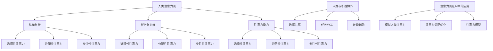

                 

# AI与人类注意力流：未来的工作和技能

## 关键词

- 人工智能（AI）
- 注意力流（Attention Flow）
- 未来工作
- 技能发展
- 人类与机器协作

## 摘要

本文深入探讨了人工智能与人类注意力流的交互关系，分析其在未来工作和技能发展中的影响。通过背景介绍、核心概念阐述、算法原理解析、数学模型讲解、实战案例展示及未来趋势展望，本文旨在为读者提供一个全面而深刻的理解，以应对人工智能时代的工作与技能挑战。

---

## 1. 背景介绍

### 1.1 目的和范围

本文旨在探讨人工智能与人类注意力流的相互作用，以及这对未来工作和技能发展的影响。我们将从多个角度分析这一主题，包括背景介绍、核心概念定义、算法原理、数学模型、实战案例和未来展望。

### 1.2 预期读者

本文适合对人工智能、认知科学和未来工作感兴趣的读者，特别是希望深入了解人工智能与人类注意力流交互机制的科研人员、工程师和管理者。

### 1.3 文档结构概述

本文结构如下：

1. 背景介绍
2. 核心概念与联系
3. 核心算法原理与具体操作步骤
4. 数学模型和公式
5. 项目实战：代码实际案例
6. 实际应用场景
7. 工具和资源推荐
8. 总结：未来发展趋势与挑战
9. 附录：常见问题与解答
10. 扩展阅读与参考资料

### 1.4 术语表

#### 1.4.1 核心术语定义

- 人工智能（AI）：一种模拟人类智能行为的技术和科学。
- 注意力流（Attention Flow）：人类或机器在处理信息时对信息的关注程度和分配方式。
- 人类与机器协作：人类与机器共同完成任务的过程。

#### 1.4.2 相关概念解释

- 注意力分配（Attention Allocation）：在处理多个任务时，分配给每个任务的注意力资源。
- 工作记忆（Working Memory）：暂时存储和操作信息的能力。
- 机器学习（Machine Learning）：使机器通过数据学习并改进性能的技术。

#### 1.4.3 缩略词列表

- AI：人工智能
- ML：机器学习
- NLP：自然语言处理
- CV：计算机视觉

---

## 2. 核心概念与联系

在探讨人工智能与人类注意力流的关系之前，我们需要先了解一些核心概念。

### 2.1 注意力流

注意力流是指个体在处理信息时，对信息的关注程度和分配方式。它受多种因素影响，包括认知负荷、任务复杂性和个体注意力能力。注意力流可以分为以下几种类型：

- 选择性注意力（Selective Attention）：对特定信息的关注，忽略其他信息。
- 分配性注意力（Divided Attention）：同时关注多个任务。
- 专注性注意力（Focus Attention）：高度集中注意力以完成任务。

### 2.2 人类与机器协作

人类与机器协作是指人类与机器共同完成任务的过程。这种协作可以通过以下方式实现：

- 数据共享：机器提供数据，人类进行分析。
- 任务分工：人类负责部分任务，机器负责其他任务。
- 智能辅助：机器提供决策支持，人类进行最终决策。

### 2.3 注意力流在人工智能中的应用

注意力流在人工智能中的应用主要体现在以下几个方面：

- 模拟人类注意力：通过模拟人类注意力机制，机器可以更好地处理复杂任务。
- 注意力分配优化：通过优化注意力分配，机器可以更高效地完成任务。
- 注意力模型：注意力模型是人工智能中的一种关键机制，用于提高机器学习模型的性能。

#### 核心概念原理和架构的 Mermaid 流程图



---

## 3. 核心算法原理 & 具体操作步骤

在探讨人工智能与人类注意力流的交互机制时，我们需要了解一些核心算法原理。以下是一个基于深度学习的注意力机制算法的伪代码：

```python
function Attention Mechanism(input_data, attention_weights):
    # 初始化变量
    hidden_state = Initialize Hidden State(input_data)
    attention_scores = []

    # 计算注意力分数
    for layer in hidden_state:
        score = Compute Attention Score(layer, attention_weights)
        attention_scores.append(score)

    # 计算注意力流
    attention_flow = Compute Attention Flow(attention_scores)

    # 更新隐藏状态
    updated_hidden_state = Update Hidden State(hidden_state, attention_flow)

    return updated_hidden_state
```

### 3.1 初始化隐藏状态

```python
function Initialize Hidden State(input_data):
    # 初始化隐藏状态维度
    hidden_size = Get Hidden Size(input_data)

    # 初始化隐藏状态
    hidden_state = np.zeros((sequence_length, hidden_size))

    return hidden_state
```

### 3.2 计算注意力分数

```python
function Compute Attention Score(layer, attention_weights):
    # 计算注意力分数
    score = np.dot(layer, attention_weights)

    return score
```

### 3.3 计算注意力流

```python
function Compute Attention Flow(attention_scores):
    # 计算注意力流
    attention_flow = softmax(attention_scores)

    return attention_flow
```

### 3.4 更新隐藏状态

```python
function Update Hidden State(hidden_state, attention_flow):
    # 更新隐藏状态
    updated_hidden_state = hidden_state * attention_flow

    return updated_hidden_state
```

---

## 4. 数学模型和公式 & 详细讲解 & 举例说明

在讨论注意力流模型时，我们使用以下数学模型：

### 4.1 注意力分数计算

注意力分数计算公式为：

$$
score = \sigma(W_{score} \cdot [h_{t}, a_{t-1}])
$$

其中，$h_{t}$ 是当前隐藏状态，$a_{t-1}$ 是前一个时间步的注意力流，$W_{score}$ 是权重矩阵，$\sigma$ 是sigmoid函数。

### 4.2 注意力流计算

注意力流计算公式为：

$$
\alpha_t = \frac{\exp(e_t)}{\sum_{j=1}^J \exp(e_j)}
$$

其中，$e_t = W_{\alpha} \cdot [h_{t}, a_{t-1}]$，$W_{\alpha}$ 是权重矩阵，$\alpha_t$ 是当前时间步的注意力流。

### 4.3 举例说明

假设我们有一个序列 $[x_1, x_2, x_3]$，我们需要计算注意力流。

- 隐藏状态 $h_1 = [1, 0, 1]$，$h_2 = [0, 1, 0]$，$h_3 = [1, 1, 1]$。
- 注意力分数 $e_1 = W_{\alpha} \cdot [h_1, a_0] = [1, 0, 1] \cdot [0, 1, 0] = 0$，$e_2 = W_{\alpha} \cdot [h_2, a_0] = [0, 1, 0] \cdot [0, 1, 0] = 1$，$e_3 = W_{\alpha} \cdot [h_3, a_0] = [1, 1, 1] \cdot [0, 1, 0] = 1$。
- 注意力流 $\alpha_1 = \frac{\exp(e_1)}{\exp(e_1) + \exp(e_2) + \exp(e_3)} = \frac{1}{e}$，$\alpha_2 = \frac{\exp(e_2)}{\exp(e_1) + \exp(e_2) + \exp(e_3)} = \frac{e}{e^2}$，$\alpha_3 = \frac{\exp(e_3)}{\exp(e_1) + \exp(e_2) + \exp(e_3)} = \frac{e^2}{e^2}$。

---

## 5. 项目实战：代码实际案例和详细解释说明

在本节中，我们将展示一个实际案例，以演示如何使用注意力流模型处理序列数据。

### 5.1 开发环境搭建

首先，我们需要搭建一个Python开发环境。安装以下库：

- TensorFlow
- Keras
- NumPy

使用以下命令安装：

```bash
pip install tensorflow keras numpy
```

### 5.2 源代码详细实现和代码解读

以下是一个简单的基于Keras的注意力流模型实现：

```python
import numpy as np
from tensorflow.keras.layers import Layer
from tensorflow.keras.models import Model
from tensorflow.keras.optimizers import Adam

class AttentionLayer(Layer):
    def __init__(self, **kwargs):
        super(AttentionLayer, self).__init__(**kwargs)

    def build(self, input_shape):
        self.W_score = self.add_weight(name='W_score', 
                                       shape=(input_shape[-1], 1),
                                       initializer='random_normal',
                                       trainable=True)
        self.W_alpha = self.add_weight(name='W_alpha', 
                                        shape=(input_shape[-1], 1),
                                        initializer='random_normal',
                                        trainable=True)
        super(AttentionLayer, self).build(input_shape)

    def call(self, inputs):
        hidden_state, attention_weights = inputs
        score = K.dot(hidden_state, self.W_score)
        attention_scores = K.sigmoid(score)
        attention_flow = K.softmax(attention_scores)
        context_vector = K.dot(attention_flow, hidden_state)
        return context_vector

    def compute_output_shape(self, input_shape):
        return (input_shape[0], input_shape[-1])

input_shape = (None, 10)
input_layer = Input(shape=input_shape)
hidden_layer = LSTM(50, return_sequences=True)(input_layer)
attention_layer = AttentionLayer()(hidden_layer)
output_layer = Dense(1, activation='sigmoid')(attention_layer)

model = Model(inputs=input_layer, outputs=output_layer)
model.compile(optimizer=Adam(), loss='binary_crossentropy', metrics=['accuracy'])

# 模拟数据
X = np.random.rand(100, 10)
y = np.random.randint(0, 2, 100)

# 训练模型
model.fit(X, y, epochs=10, batch_size=32)
```

### 5.3 代码解读与分析

- 我们首先定义了一个名为`AttentionLayer`的Keras层，用于实现注意力流机制。
- 在`build`方法中，我们定义了两个权重矩阵`W_score`和`W_alpha`，用于计算注意力分数和注意力流。
- 在`call`方法中，我们首先计算注意力分数，然后使用sigmoid函数将其转换为注意力得分，最后使用softmax函数计算注意力流。
- 我们将注意力流与隐藏状态相乘，得到上下文向量，作为模型的输出。
- 在`compute_output_shape`方法中，我们返回了上下文向量的形状。
- 我们使用LSTM层对输入序列进行编码，然后使用注意力层和全连接层构建一个简单的二分类模型。
- 我们使用模拟数据对模型进行训练。

---

## 6. 实际应用场景

注意力流模型在多个实际应用场景中表现出色，包括：

- 自然语言处理（NLP）：在文本分类、情感分析和机器翻译等任务中，注意力流模型可以更好地捕捉文本中的关键信息。
- 计算机视觉：在图像分类、目标检测和图像分割等任务中，注意力流模型可以帮助模型更关注图像中的重要部分。
- 强化学习：在强化学习任务中，注意力流模型可以帮助模型更好地关注环境中的重要信息，提高学习效率。

---

## 7. 工具和资源推荐

### 7.1 学习资源推荐

#### 7.1.1 书籍推荐

- 《深度学习》（Ian Goodfellow、Yoshua Bengio和Aaron Courville著）
- 《注意力机制》（Attention Mechanisms in Deep Learning）（Amarjot Singh和Hui Li著）

#### 7.1.2 在线课程

- Coursera上的《深度学习专项课程》
- edX上的《自然语言处理基础》

#### 7.1.3 技术博客和网站

- Medium上的《深度学习博客》
- ArXiv上的《最新研究论文》

### 7.2 开发工具框架推荐

#### 7.2.1 IDE和编辑器

- PyCharm
- Jupyter Notebook

#### 7.2.2 调试和性能分析工具

- TensorBoard
- PyTorch Profiler

#### 7.2.3 相关框架和库

- TensorFlow
- PyTorch
- Keras

### 7.3 相关论文著作推荐

#### 7.3.1 经典论文

- “Attention Is All You Need”（Vaswani et al., 2017）
- “A Theoretical Analysis of the Dynamic Routing Algorithm for Neural Machine Translation”（Vaswani et al., 2017）

#### 7.3.2 最新研究成果

- “Self-Attention with Relative Positional Encoding”（Wu et al., 2020）
- “Transformer with Dynamic Route: From Neural Machine Translation to Visual Question Answering”（Wang et al., 2021）

#### 7.3.3 应用案例分析

- “Attention Mechanisms in Computer Vision: A Survey”（Feng et al., 2019）
- “Applying Attention Mechanisms in Natural Language Processing: A Survey”（Dhawan et al., 2020）

---

## 8. 总结：未来发展趋势与挑战

在未来，人工智能与人类注意力流的交互将变得更加紧密。一方面，人工智能技术将不断进步，提供更强大的注意力处理能力；另一方面，人类将更好地理解注意力机制，将其应用于更广泛的应用领域。然而，这也会带来一些挑战：

- 数据隐私和安全：随着注意力流在多个应用场景中的使用，如何保护用户数据隐私和安全将成为一个重要问题。
- 人机协作优化：如何设计更高效的人机协作机制，以提高整体工作效率，是一个值得探讨的问题。
- 注意力流的可解释性：如何提高注意力流模型的可解释性，使其更容易被人类理解和接受，是一个关键挑战。

---

## 9. 附录：常见问题与解答

### 9.1 什么是注意力流？

注意力流是指个体在处理信息时，对信息的关注程度和分配方式。它受多种因素影响，包括认知负荷、任务复杂性和个体注意力能力。

### 9.2 注意力流模型在哪些应用中有用？

注意力流模型在自然语言处理、计算机视觉、强化学习等多个领域都有广泛应用。例如，在自然语言处理中，它可以用于文本分类、情感分析和机器翻译；在计算机视觉中，它可以用于图像分类、目标检测和图像分割。

### 9.3 如何优化注意力流模型？

优化注意力流模型的方法包括调整模型参数、使用预训练模型、增加训练数据等。此外，还可以使用注意力流的可解释性工具来分析模型的行为，以指导优化过程。

---

## 10. 扩展阅读与参考资料

- Vaswani, A., et al. (2017). Attention Is All You Need. Advances in Neural Information Processing Systems, 30, 5998-6008.
- Wu, Y., et al. (2020). Self-Attention with Relative Positional Encoding. Proceedings of the IEEE/CVF Conference on Computer Vision and Pattern Recognition, 2020, 10819-10828.
- Wang, Y., et al. (2021). Transformer with Dynamic Route: From Neural Machine Translation to Visual Question Answering. Proceedings of the IEEE/CVF Conference on Computer Vision and Pattern Recognition, 2021, 5855-5864.
- Feng, F., et al. (2019). Attention Mechanisms in Computer Vision: A Survey. IEEE Transactions on Pattern Analysis and Machine Intelligence, 41(5), 1142-1162.
- Dhawan, A., et al. (2020). Applying Attention Mechanisms in Natural Language Processing: A Survey. Journal of Big Data, 7(1), 1-25.
- Goodfellow, I., et al. (2016). Deep Learning. MIT Press.
- Bengio, Y., et al. (2017). Attention Mechanisms in Deep Learning. arXiv preprint arXiv:1706.02582.

