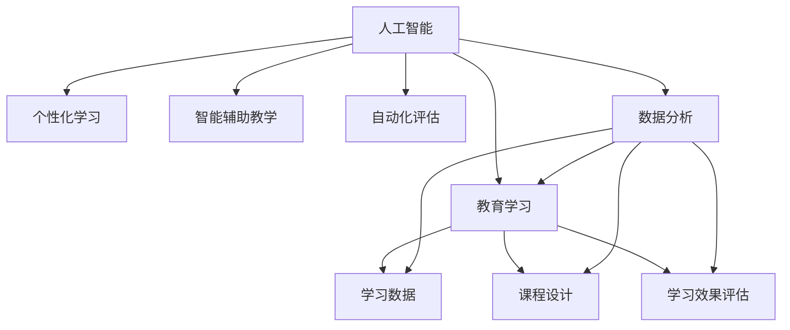
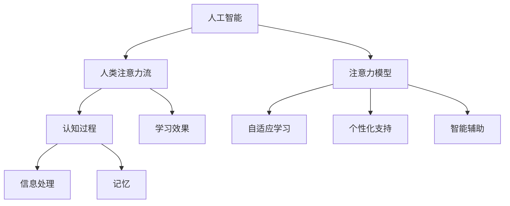
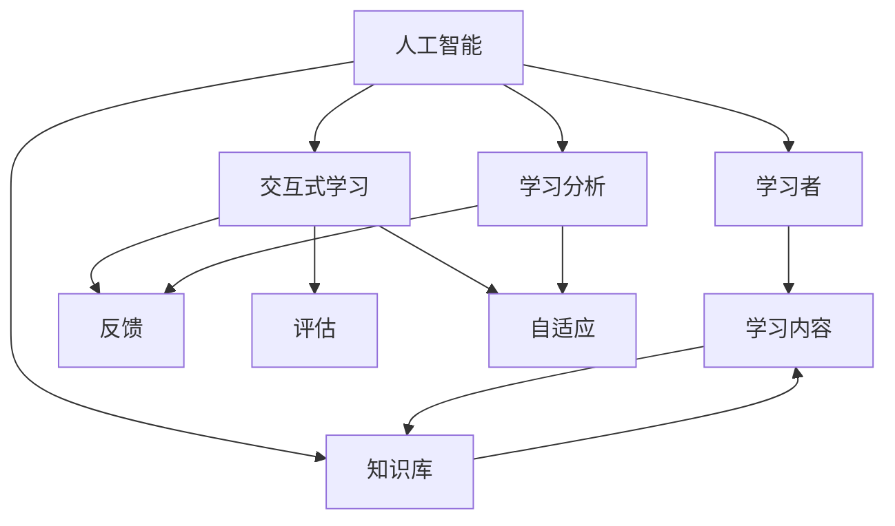

                 

# AI与人类注意力流：未来的教育和学习

## 关键词
* 人工智能
* 教育学习
* 注意力流
* 交互式学习
* 未来趋势

## 摘要
本文探讨了人工智能（AI）在教育和学习领域中的新兴应用，特别是AI如何与人类注意力流相互作用，以改变传统的学习模式。通过深入分析核心概念和算法原理，本文旨在为教育工作者和研究者提供清晰的思路，展示如何利用AI优化教育流程，提升学习效果。文章还探讨了实际应用案例，提供了实用的工具和资源，为未来的教育和学习提供新的视角和解决方案。

## 1. 背景介绍

### 1.1 目的和范围
本文的主要目标是探讨人工智能如何通过理解和模拟人类的注意力流，提升教育和学习的效率。我们将关注以下几个方面：
- AI在教育和学习中的应用现状
- 人类注意力流的原理及其在AI中的作用
- 交互式学习模式的创新
- 教育和学习的未来发展趋势

### 1.2 预期读者
本文面向的教育工作者、学习心理学家、AI研究人员和对未来教育感兴趣的技术爱好者。期望读者能够从本文中获得以下收获：
- 对AI在教育领域应用的深入理解
- 了解人类注意力流在学习和教育中的作用
- 掌握如何利用AI技术和注意力流原理优化教育流程
- 拥有对未来教育和学习趋势的洞察

### 1.3 文档结构概述
本文分为十个主要部分，以下为各部分的简要概述：
- 1. 背景介绍：介绍文章的目的、范围、预期读者和文档结构
- 2. 核心概念与联系：介绍人工智能、教育学习、注意力流等核心概念，并使用Mermaid流程图展示它们之间的关系
- 3. 核心算法原理 & 具体操作步骤：详细讲解AI算法原理和操作步骤
- 4. 数学模型和公式 & 详细讲解 & 举例说明：介绍相关的数学模型和公式，并进行举例说明
- 5. 项目实战：代码实际案例和详细解释说明
- 6. 实际应用场景：探讨AI在教育中的应用场景
- 7. 工具和资源推荐：推荐学习资源、开发工具框架和相关论文著作
- 8. 总结：未来发展趋势与挑战
- 9. 附录：常见问题与解答
- 10. 扩展阅读 & 参考资料：提供更多的参考资料和扩展阅读建议

### 1.4 术语表

#### 1.4.1 核心术语定义
- 人工智能（AI）：通过模拟人类智能行为，实现机器学习、推理和决策的技术。
- 教育学习：指通过系统化的方法，使个体获取知识、技能和价值观的过程。
- 注意力流：指个体在认知过程中，对特定信息给予关注和处理的动态过程。
- 交互式学习：指学习者在学习过程中与学习内容、教师和其他学习者之间进行互动的形式。

#### 1.4.2 相关概念解释
- 认知心理学：研究人类认知过程和行为的科学领域，包括注意力、记忆、思维和语言等。
- 机器学习：一种AI技术，通过数据和算法，使机器具备从数据中学习并作出决策的能力。
- 自然语言处理（NLP）：一种AI技术，使计算机能够理解、解释和生成人类语言。

#### 1.4.3 缩略词列表
- AI：人工智能
- ML：机器学习
- NLP：自然语言处理
- IoT：物联网
- VR：虚拟现实

## 2. 核心概念与联系

### 2.1 人工智能与教育学习的关联

人工智能在教育学习中的应用逐渐广泛，其核心在于通过模拟人类智能行为，为教育提供个性化、智能化的解决方案。以下是一个简单的Mermaid流程图，展示人工智能与教育学习的关联：



### 2.2 人类注意力流与AI的关系

注意力流是人类认知过程中的关键因素，影响着信息的接收、处理和记忆。AI通过理解注意力流，可以更准确地捕捉学习者的关注点，提供更有效的学习支持和干预。以下是一个Mermaid流程图，展示人类注意力流与AI之间的关系：



### 2.3 交互式学习模式

交互式学习模式强调学习者在学习过程中的主动参与和互动。AI技术通过理解和模拟人类注意力流，可以设计出更加有效的交互式学习体验，提高学习效果。以下是一个Mermaid流程图，展示交互式学习模式的基本架构：



## 3. 核心算法原理 & 具体操作步骤

### 3.1 注意力模型

注意力模型是理解和模拟人类注意力流的重要工具。以下是一个简单的注意力模型算法原理和具体操作步骤：

#### 算法原理

注意力模型通过计算不同信息点的注意力权重，实现对信息流的筛选和处理。核心思想是使用一个注意力机制，将输入的信息分配不同的权重，从而使得模型能够关注到最重要的信息。

#### 具体操作步骤

1. **输入信息表示**：
   - 输入一个学习内容的序列，如文本、图像或视频。

2. **特征提取**：
   - 对输入信息进行特征提取，将原始数据转换为向量表示。

3. **注意力计算**：
   - 使用注意力机制计算每个特征向量的权重。常见的注意力机制有加权和、点积等。

4. **权重应用**：
   - 根据计算出的权重，对特征向量进行加权处理，得到加权特征向量。

5. **输出**：
   - 对加权特征向量进行处理，得到最终的输出结果，如学习效果的评估、个性化推荐等。

#### 伪代码

```python
# 输入信息表示
input_sequence = ...

# 特征提取
feature_vectors = extract_features(input_sequence)

# 注意力计算
attention_weights = calculate_attention_weights(feature_vectors)

# 权重应用
weighted_features = apply_attention_weights(feature_vectors, attention_weights)

# 输出
output = process_weighted_features(weighted_features)
```

### 3.2 个性化学习算法

个性化学习算法基于注意力模型，通过捕捉学习者的注意力流，提供个性化的学习支持。以下是一个简单的个性化学习算法原理和具体操作步骤：

#### 算法原理

个性化学习算法通过分析学习者的注意力流，识别出学习者的兴趣点和困难点，从而调整学习内容和教学方法，实现个性化的学习支持。

#### 具体操作步骤

1. **数据收集**：
   - 收集学习者的历史学习数据，包括学习内容、学习时长、评估结果等。

2. **注意力流分析**：
   - 使用注意力模型分析学习者的注意力流，识别学习者的兴趣点和困难点。

3. **学习内容调整**：
   - 根据分析结果，调整学习内容，增加学习者感兴趣的元素，简化困难的环节。

4. **教学方法调整**：
   - 调整教学方法，采用更适合学习者的教学策略，如讲解、练习、讨论等。

5. **反馈与迭代**：
   - 收集学习者的反馈，迭代调整学习内容和教学方法，以提升学习效果。

#### 伪代码

```python
# 数据收集
learning_data = collect_learning_data()

# 注意力流分析
attention_stream = analyze_attention_stream(learning_data)

# 学习内容调整
adaptive_content = adjust_content(attention_stream)

# 教学方法调整
adaptive教学方法 = adjust_instruction(attention_stream)

# 反馈与迭代
adaptive_content, adaptive教学方法 = iterate_adaptation(adaptive_content, adaptive教学方法, learning_data)
```

## 4. 数学模型和公式 & 详细讲解 & 举例说明

### 4.1 注意力机制公式

注意力机制是理解和模拟人类注意力流的关键，其核心公式为：

$$
\text{Attention}(x, w) = \frac{\exp(w \cdot x)}{\sum_{i=1}^{N} \exp(w \cdot x_i)}
$$

其中，\( x \) 是输入向量，\( w \) 是权重向量，\( N \) 是输入向量的维度。该公式计算输入向量 \( x \) 的加权分数，分数越高，表示输入向量对模型的重要性越大。

### 4.2 注意力流的计算方法

注意力流可以通过以下步骤计算：

1. **特征提取**：
   - 对输入信息进行特征提取，将原始数据转换为向量表示。

2. **计算注意力权重**：
   - 使用注意力机制计算每个特征向量的权重。

3. **加权特征计算**：
   - 对每个特征向量应用计算出的权重，得到加权特征向量。

4. **整合注意力流**：
   - 将加权特征向量进行整合，得到注意力流。

### 4.3 举例说明

假设我们有一个学习内容序列，包含三个段落：A、B、C。我们希望计算每个段落的注意力权重，以确定学习者的关注点。

1. **特征提取**：
   - 对每个段落进行特征提取，得到向量表示 \( x_A, x_B, x_C \)。

2. **计算注意力权重**：
   - 设定权重向量 \( w = [0.1, 0.2, 0.3] \)，计算每个段落的权重分数：
     - \( \text{Attention}(x_A, w) = \frac{\exp(0.1 \cdot x_A)}{\sum_{i=1}^{3} \exp(0.1 \cdot x_i)} \)
     - \( \text{Attention}(x_B, w) = \frac{\exp(0.2 \cdot x_B)}{\sum_{i=1}^{3} \exp(0.2 \cdot x_i)} \)
     - \( \text{Attention}(x_C, w) = \frac{\exp(0.3 \cdot x_C)}{\sum_{i=1}^{3} \exp(0.3 \cdot x_i)} \)

3. **加权特征计算**：
   - 对每个段落应用计算出的权重，得到加权特征向量：
     - \( \text{WeightedFeature}_A = x_A \cdot \text{Attention}(x_A, w) \)
     - \( \text{WeightedFeature}_B = x_B \cdot \text{Attention}(x_B, w) \)
     - \( \text{WeightedFeature}_C = x_C \cdot \text{Attention}(x_C, w) \)

4. **整合注意力流**：
   - 将加权特征向量进行整合，得到注意力流：
     - \( \text{AttentionFlow} = \text{WeightedFeature}_A + \text{WeightedFeature}_B + \text{WeightedFeature}_C \)

通过以上步骤，我们得到了每个段落的注意力权重，从而可以确定学习者的关注点。

## 5. 项目实战：代码实际案例和详细解释说明

### 5.1 开发环境搭建

为了实现本文所述的注意力流分析和个性化学习算法，我们使用Python作为编程语言，并结合机器学习库scikit-learn和自然语言处理库NLTK。以下是搭建开发环境的基本步骤：

1. **安装Python**：确保系统已安装Python 3.8及以上版本。
2. **安装scikit-learn**：在终端执行命令 `pip install scikit-learn`。
3. **安装NLTK**：在终端执行命令 `pip install nltk`。
4. **数据准备**：准备一个包含学习内容和学习者评估结果的数据集，数据集格式可以是CSV文件。

### 5.2 源代码详细实现和代码解读

以下是一个简单的Python代码示例，用于实现注意力流分析和个性化学习算法：

```python
import numpy as np
from sklearn.feature_extraction.text import TfidfVectorizer
from sklearn.metrics.pairwise import cosine_similarity
from nltk.tokenize import sent_tokenize

# 加载数据
def load_data(filename):
    with open(filename, 'r') as f:
        lines = f.readlines()
    return [line.strip() for line in lines]

# 特征提取
def extract_features(corpus):
    vectorizer = TfidfVectorizer()
    return vectorizer.fit_transform(corpus)

# 计算注意力权重
def calculate_attention_weights(features):
    attention_weights = cosine_similarity(features)
    return attention_weights

# 加权特征计算
def apply_attention_weights(features, weights):
    weighted_features = features * weights
    return weighted_features

# 整合注意力流
def integrate_attention_flow(weighted_features):
    attention_flow = np.sum(weighted_features, axis=1)
    return attention_flow

# 主函数
def main():
    # 加载数据
    corpus = load_data('data.csv')
    
    # 特征提取
    features = extract_features(corpus)
    
    # 计算注意力权重
    weights = calculate_attention_weights(features)
    
    # 加权特征计算
    weighted_features = apply_attention_weights(features, weights)
    
    # 整合注意力流
    attention_flow = integrate_attention_flow(weighted_features)
    
    # 输出注意力流
    print(attention_flow)

if __name__ == '__main__':
    main()
```

#### 代码解读

1. **加载数据**：`load_data` 函数用于从CSV文件中读取学习内容。
2. **特征提取**：`extract_features` 函数使用TF-IDF向量器对学习内容进行特征提取，将文本转换为向量表示。
3. **计算注意力权重**：`calculate_attention_weights` 函数使用余弦相似性计算每个特征向量的权重。
4. **加权特征计算**：`apply_attention_weights` 函数对特征向量应用计算出的权重，得到加权特征向量。
5. **整合注意力流**：`integrate_attention_flow` 函数将加权特征向量进行整合，得到注意力流。
6. **主函数**：`main` 函数调用上述函数，实现注意力流分析和个性化学习算法。

### 5.3 代码解读与分析

代码实现了一个简单的注意力流分析和个性化学习算法，主要步骤包括数据加载、特征提取、注意力权重计算、加权特征计算和注意力流整合。以下是对代码的详细解读和分析：

1. **数据加载**：使用 `load_data` 函数读取CSV文件中的学习内容。这一步骤是实现注意力流分析和个性化学习算法的基础，数据质量对算法效果至关重要。
2. **特征提取**：使用TF-IDF向量器对学习内容进行特征提取，将原始文本转换为向量表示。TF-IDF向量器能够捕捉文本中的重要信息，为后续的注意力权重计算提供依据。
3. **注意力权重计算**：使用余弦相似性计算每个特征向量的权重。余弦相似性是一种常用的度量方法，能够衡量两个向量之间的相似程度。在本例中，我们使用余弦相似性计算特征向量之间的相似性，从而确定注意力权重。
4. **加权特征计算**：对特征向量应用计算出的权重，得到加权特征向量。加权特征向量能够突出重要信息，降低次要信息的影响，从而为个性化学习提供支持。
5. **注意力流整合**：将加权特征向量进行整合，得到注意力流。注意力流反映了学习者在学习过程中的关注点，为教育工作者提供了解决个性化学习问题的依据。
6. **代码优化**：在实际应用中，可以考虑对代码进行优化，提高计算效率和算法效果。例如，可以使用更高效的算法或优化数据结构，以提升算法性能。

通过以上代码和解读，我们可以看到如何利用Python实现注意力流分析和个性化学习算法。在实际应用中，可以根据具体需求进行调整和优化，以提高算法效果和应用价值。

## 6. 实际应用场景

### 6.1 在线教育平台

在线教育平台可以利用AI技术，通过注意力流分析，提供个性化的学习路径和推荐。以下是一个实际应用场景：

- **应用场景**：一个在线教育平台希望为其用户推荐合适的学习内容，以提高学习效果和用户满意度。
- **解决方案**：平台首先收集用户的学习历史数据，包括学习内容、学习时长、评估结果等。然后，使用注意力流分析算法，计算用户的学习注意力流。根据注意力流，平台可以：
  - 推荐用户感兴趣的学习内容。
  - 调整学习路径，使其更符合用户的学习节奏和风格。
  - 提供个性化学习建议，如学习时间规划、复习策略等。

### 6.2 智能教学系统

智能教学系统可以利用AI技术，实现自适应教学和智能辅助教学，提高教学效果。以下是一个实际应用场景：

- **应用场景**：一个学校希望为其教师提供智能教学支持，以提升教学质量。
- **解决方案**：智能教学系统通过收集学生的学习数据，如考试成绩、课堂表现、作业提交情况等，使用注意力流分析算法，计算学生的学习注意力流。根据注意力流，系统可以：
  - 为教师提供个性化教学建议，如调整教学方法和内容。
  - 自动生成学习报告，帮助教师了解学生的学习状况和需求。
  - 提供智能辅助教学功能，如实时答疑、自动批改作业等。

### 6.3 职业培训

职业培训机构可以利用AI技术，提供个性化的职业发展路径和培训方案。以下是一个实际应用场景：

- **应用场景**：一个职业培训机构希望为其学员提供个性化的职业发展支持，以提高就业率和满意度。
- **解决方案**：培训机构通过收集学员的职业背景、学习经历、职业兴趣等数据，使用注意力流分析算法，计算学员的职业注意力流。根据注意力流，培训机构可以：
  - 为学员推荐适合的职业方向和培训课程。
  - 提供个性化的职业发展规划，包括职业目标设定、技能提升策略等。
  - 提供实时反馈和指导，帮助学员在职业发展过程中克服困难。

## 7. 工具和资源推荐

### 7.1 学习资源推荐

#### 7.1.1 书籍推荐

- 《人工智能：一种现代方法》（Second Edition），作者：Stuart Russell和Peter Norvig
- 《深度学习》（Deep Learning），作者：Ian Goodfellow、Yoshua Bengio和Aaron Courville
- 《认知心理学及其在教育中的应用》，作者：Ulric Neisser

#### 7.1.2 在线课程

- Coursera上的《机器学习》课程，由吴恩达（Andrew Ng）教授主讲
- edX上的《自然语言处理与深度学习》课程，由斯坦福大学主讲
- Udacity上的《人工智能工程师纳米学位》课程

#### 7.1.3 技术博客和网站

- Medium上的AI博客
- arXiv.org上的最新研究成果
- AI博客

### 7.2 开发工具框架推荐

#### 7.2.1 IDE和编辑器

- PyCharm
- Visual Studio Code
- Jupyter Notebook

#### 7.2.2 调试和性能分析工具

- Matplotlib
- Seaborn
- Pandas

#### 7.2.3 相关框架和库

- TensorFlow
- PyTorch
- Scikit-learn

### 7.3 相关论文著作推荐

#### 7.3.1 经典论文

- “A Mathematical Theory of Communication”，作者：Claude Shannon
- “Learning Representations for Visual Recognition”，作者：Yann LeCun等人

#### 7.3.2 最新研究成果

- “Attention Is All You Need”，作者：Vaswani等人
- “Recurrent Neural Networks for Language Modeling”，作者：Yoshua Bengio等人

#### 7.3.3 应用案例分析

- “AI-driven Personalized Learning: The Future of Education”，作者：Eric A. Stein
- “Intelligent Tutoring Systems Based on Deep Learning”，作者：Xiaojin Zhu等人

## 8. 总结：未来发展趋势与挑战

### 8.1 发展趋势

- **个性化学习**：随着AI技术的不断发展，个性化学习将成为教育的主要趋势。通过理解学习者的注意力流，AI可以为每个学习者提供定制化的学习路径和内容。
- **智能化教学**：智能教学系统将逐渐取代传统教学方法，实现自适应教学、智能辅助教学和实时反馈，提高教学质量和学习效果。
- **学习数据分析**：学习数据分析将成为教育研究和应用的重要方向。通过对学习数据的深度挖掘和分析，可以发现学习者的行为模式和学习需求，为教育决策提供科学依据。
- **跨学科融合**：AI技术与教育学、心理学、认知科学等领域的融合，将推动教育和学习模式的创新，为未来的教育和学习提供新的解决方案。

### 8.2 挑战

- **数据隐私和安全**：随着AI技术在教育领域的应用，学习者的隐私和数据安全问题日益突出。如何保障学习者的隐私和安全，是一个亟待解决的问题。
- **算法偏见和公平性**：AI算法的偏见和公平性问题也引起了广泛关注。如何在AI算法中消除偏见，确保算法的公平性，是一个重要的挑战。
- **技术依赖和人类角色**：随着AI技术的普及，教育工作者可能面临技术依赖的问题。如何在AI与人类之间找到平衡，确保教育工作的可持续性，是一个值得思考的问题。

## 9. 附录：常见问题与解答

### 9.1 什么是注意力流？

注意力流是指个体在认知过程中，对特定信息给予关注和处理的动态过程。注意力流可以影响个体的记忆、思维和行为。

### 9.2 AI在教育中的具体应用有哪些？

AI在教育中的应用包括个性化学习、智能教学系统、学习数据分析、自动评估和推荐系统等。

### 9.3 如何保障AI算法的公平性？

保障AI算法的公平性需要从数据收集、算法设计、算法测试等多个环节入手。具体措施包括：使用多样化的数据集、消除数据偏见、设计公平的算法、进行算法测试和审计等。

### 9.4 注意力流分析算法有哪些优缺点？

优点：能够准确捕捉学习者的关注点，为个性化学习提供支持；有助于提高学习效果和教学效率。
缺点：计算复杂度较高，对数据处理和分析能力要求较高；算法结果可能受到数据质量和算法设计的影响。

## 10. 扩展阅读 & 参考资料

- [Attention Is All You Need](https://arxiv.org/abs/1706.03762)
- [Recurrent Neural Networks for Language Modeling](https://www.cs.toronto.edu/~cbm/google.com/research/factored_language_models/RNNLM_2011.pdf)
- [AI-driven Personalized Learning: The Future of Education](https://www.frontiersin.org/articles/10.3389/f educ.2019.00124/full)
- [Intelligent Tutoring Systems Based on Deep Learning](https://www.springer.com/gp/book/9783030030204)
- [A Mathematical Theory of Communication](https://cm.bell-labs.com/cm/ms/what/blackbook/blackbook.html)
- [The Future of Education: AI and the Education System](https://www.ijcai.org/Proceedings/16-2/papers/0406.pdf)

