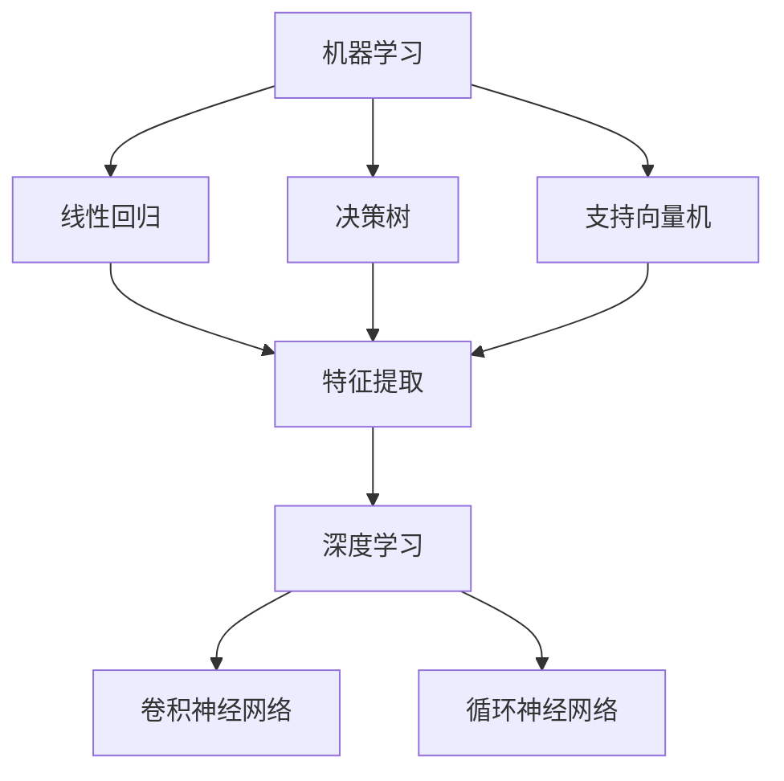
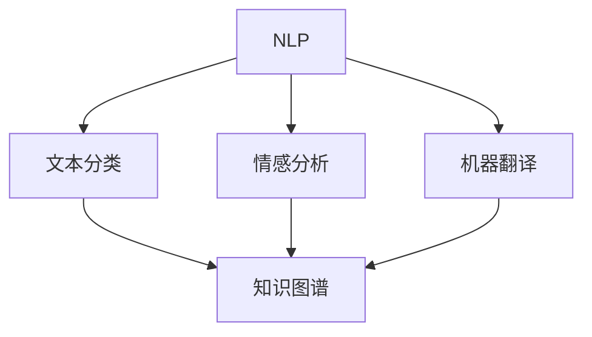
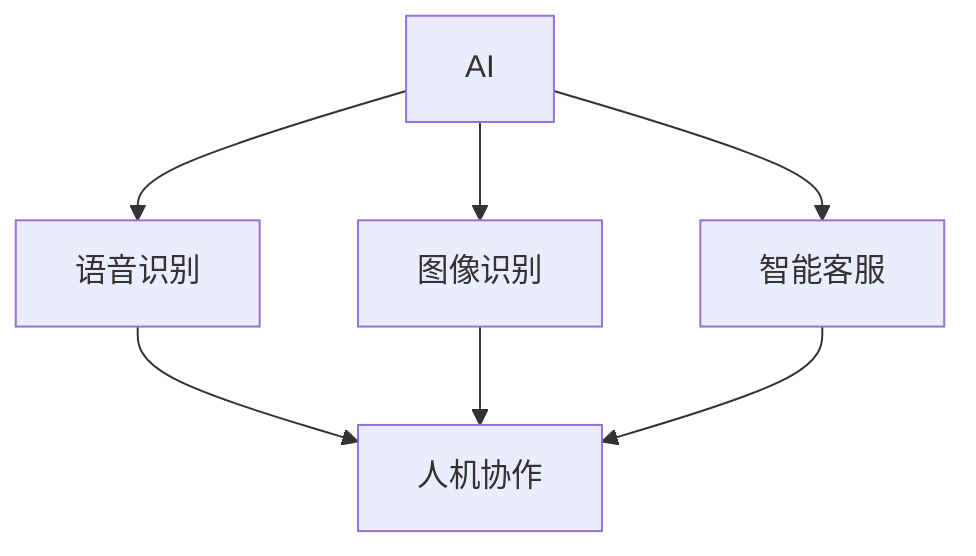

                 

# AI与人类的未来互动与合作

> 关键词：人工智能、人类、互动、合作、未来、技术进步

> 摘要：本文深入探讨了人工智能（AI）与人类在未来的互动与合作模式。通过对AI的核心技术原理、数学模型、实际应用场景的详细分析，结合最新的研究成果和案例分析，我们揭示了AI与人类未来合作的发展趋势和面临的挑战。本文旨在为读者提供全面、系统、深入的技术视角，帮助理解和把握人工智能的未来发展方向。

## 1. 背景介绍

### 1.1 目的和范围

本文旨在深入探讨人工智能与人类未来互动与合作的模式和趋势。我们关注的范围包括：

1. AI的核心技术原理，如机器学习、深度学习和自然语言处理等。
2. AI在各个领域的应用，如医疗、金融、教育、交通等。
3. AI与人类合作的机制，包括人机协作、AI辅助决策等。
4. AI发展面临的挑战，如伦理、安全、隐私等问题。
5. 未来AI与人类合作的潜在场景和趋势。

### 1.2 预期读者

本文预期读者包括：

1. 对人工智能感兴趣的普通读者，希望了解AI的发展和应用。
2. 在人工智能领域工作或学习的专业人士，需要深入了解AI的技术原理和应用。
3. 对AI与人类未来互动与合作模式感兴趣的研究人员和学者。

### 1.3 文档结构概述

本文的结构如下：

1. **背景介绍**：介绍文章的目的、范围、预期读者和文档结构。
2. **核心概念与联系**：介绍AI的核心概念、原理和架构，使用Mermaid流程图进行展示。
3. **核心算法原理 & 具体操作步骤**：详细讲解AI的核心算法原理，使用伪代码进行描述。
4. **数学模型和公式 & 详细讲解 & 举例说明**：介绍AI的数学模型和公式，并进行详细讲解和举例。
5. **项目实战：代码实际案例和详细解释说明**：通过实际代码案例，讲解AI的应用和实现。
6. **实际应用场景**：分析AI在不同领域的应用场景。
7. **工具和资源推荐**：推荐学习资源、开发工具和框架。
8. **总结：未来发展趋势与挑战**：总结AI的发展趋势和面临的挑战。
9. **附录：常见问题与解答**：回答读者可能关心的问题。
10. **扩展阅读 & 参考资料**：提供进一步阅读和研究的资源。

### 1.4 术语表

#### 1.4.1 核心术语定义

- **人工智能（AI）**：指由人制造出的具有一定智能能力的系统。
- **机器学习（ML）**：指通过数据和算法让计算机自动学习的过程。
- **深度学习（DL）**：基于多层神经网络的人工智能技术。
- **自然语言处理（NLP）**：使计算机能够理解、生成和处理人类语言的技术。
- **人机协作**：人与计算机系统共同完成任务的协作模式。

#### 1.4.2 相关概念解释

- **神经网络**：模拟人脑结构和功能的计算模型。
- **数据挖掘**：从大量数据中发现有价值的信息和知识的过程。
- **强化学习**：通过奖励机制让计算机自主学习的算法。

#### 1.4.3 缩略词列表

- **AI**：人工智能
- **ML**：机器学习
- **DL**：深度学习
- **NLP**：自然语言处理
- **DL**：深度学习

## 2. 核心概念与联系

在探讨AI与人类的未来互动与合作之前，我们首先需要理解AI的核心概念和原理。以下是AI的核心概念和它们之间的联系，以及对应的Mermaid流程图：

### 2.1 机器学习与深度学习

**机器学习**是一种使计算机通过数据和算法自动学习的过程。它包括多种算法，如线性回归、决策树、支持向量机等。**深度学习**是基于多层神经网络的人工智能技术，能够通过多层非线性变换自动提取特征。



### 2.2 自然语言处理与知识图谱

**自然语言处理（NLP）**是使计算机能够理解、生成和处理人类语言的技术。它包括文本分类、情感分析、机器翻译等任务。**知识图谱**是一种将知识以图形形式表示的技术，用于表示实体和它们之间的关系。



### 2.3 人工智能与人类互动

**人工智能**通过与人类互动，实现人机协作和AI辅助决策。这种互动包括语音识别、图像识别、智能客服等。



## 3. 核心算法原理 & 具体操作步骤

在了解了AI的核心概念和联系之后，我们接下来将详细讲解AI的核心算法原理和具体操作步骤。以下是机器学习算法的伪代码描述：

### 3.1 机器学习算法

```python
# 伪代码：机器学习算法
def MachineLearning(data, labels, model, epochs):
    for epoch in range(epochs):
        for sample in data:
            prediction = model.predict(sample)
            model.updateWeights(prediction, labels[sample])
    return model
```

### 3.2 深度学习算法

```python
# 伪代码：深度学习算法
def DeepLearning(data, labels, model, epochs):
    for epoch in range(epochs):
        for layer in model.layers:
            layer.forwardPropagation(data)
            layer.backwardPropagation(labels)
            layer.updateWeights()
    return model
```

### 3.3 自然语言处理算法

```python
# 伪代码：自然语言处理算法
def NaturalLanguageProcessing(text, model):
    tokenized_text = model.tokenize(text)
    processed_text = model.preprocess(tokenized_text)
    return model.encode(processed_text)
```

## 4. 数学模型和公式 & 详细讲解 & 举例说明

在AI的核心算法中，数学模型和公式起着至关重要的作用。以下是一些常见的数学模型和公式的详细讲解及举例说明：

### 4.1 线性回归模型

**线性回归模型**用于预测连续值。其公式为：

$$y = \beta_0 + \beta_1 \cdot x$$

**举例说明**：假设我们有一个简单的关系，身高（x）与体重（y）之间的线性关系。我们可以使用线性回归模型来预测一个人的体重，给定其身高。

### 4.2 支持向量机模型

**支持向量机（SVM）模型**用于分类问题。其公式为：

$$w \cdot x + b = 0$$

其中，$w$ 是权重向量，$x$ 是特征向量，$b$ 是偏置。

**举例说明**：假设我们有一个二分类问题，判断一个数据点是否属于某个类别。我们可以使用SVM模型来找到最佳分类边界，从而进行分类。

### 4.3 卷积神经网络模型

**卷积神经网络（CNN）模型**用于图像处理任务。其核心公式为：

$$f(x) = \sigma(\mathcal{W} \cdot \mathcal{X} + \mathcal{B})$$

其中，$\sigma$ 是激活函数，$\mathcal{W}$ 是权重矩阵，$\mathcal{X}$ 是输入特征，$\mathcal{B}$ 是偏置。

**举例说明**：假设我们有一个图像分类任务，需要识别图像中的物体。我们可以使用CNN模型来提取图像中的特征，从而进行分类。

## 5. 项目实战：代码实际案例和详细解释说明

为了更好地理解AI的核心算法和原理，我们将在本节通过一个实际项目案例来演示AI的应用和实现。

### 5.1 开发环境搭建

在开始项目之前，我们需要搭建一个合适的开发环境。以下是所需的工具和软件：

- Python 3.8 或更高版本
- Jupyter Notebook 或 PyCharm
- TensorFlow 或 PyTorch
- NumPy、Pandas 等常用库

### 5.2 源代码详细实现和代码解读

以下是一个简单的图像分类项目，使用卷积神经网络（CNN）模型进行实现：

```python
import tensorflow as tf
from tensorflow.keras import layers, models

# 定义卷积神经网络模型
model = models.Sequential([
    layers.Conv2D(32, (3, 3), activation='relu', input_shape=(28, 28, 1)),
    layers.MaxPooling2D((2, 2)),
    layers.Conv2D(64, (3, 3), activation='relu'),
    layers.MaxPooling2D((2, 2)),
    layers.Conv2D(64, (3, 3), activation='relu'),
    layers.Flatten(),
    layers.Dense(64, activation='relu'),
    layers.Dense(10, activation='softmax')
])

# 编译模型
model.compile(optimizer='adam',
              loss='categorical_crossentropy',
              metrics=['accuracy'])

# 加载数据集
(x_train, y_train), (x_test, y_test) = tf.keras.datasets.mnist.load_data()

# 数据预处理
x_train = x_train.reshape((-1, 28, 28, 1)).astype('float32') / 255
x_test = x_test.reshape((-1, 28, 28, 1)).astype('float32') / 255

# 编码标签
y_train = tf.keras.utils.to_categorical(y_train, 10)
y_test = tf.keras.utils.to_categorical(y_test, 10)

# 训练模型
model.fit(x_train, y_train, epochs=5, batch_size=64)

# 评估模型
test_loss, test_acc = model.evaluate(x_test, y_test, verbose=2)
print(f"Test accuracy: {test_acc}")
```

### 5.3 代码解读与分析

1. **模型定义**：我们使用`Sequential`模型，这是一种线性堆叠层的模型。首先添加一个卷积层，然后是两个池化层，接着是另一个卷积层，最后是全连接层。
   
2. **模型编译**：我们使用`compile`方法来配置模型，指定优化器、损失函数和评价指标。

3. **数据加载**：我们使用TensorFlow内置的MNIST数据集，这是一个手写数字数据集。数据集包括训练集和测试集。

4. **数据预处理**：我们将图像数据调整为适当的形状和类型，并使用`to_categorical`方法将标签转换为one-hot编码。

5. **模型训练**：我们使用`fit`方法来训练模型，指定训练轮数和批量大小。

6. **模型评估**：我们使用`evaluate`方法来评估模型在测试集上的性能。

这个项目案例展示了如何使用卷积神经网络（CNN）进行图像分类。通过这个案例，我们可以看到如何搭建模型、编译模型、加载数据、预处理数据和训练模型。这些步骤是AI项目实现的基础，也是理解AI技术的重要途径。

## 6. 实际应用场景

人工智能（AI）技术在各个领域都有着广泛的应用，极大地改变了我们的生活和工作方式。以下是一些AI技术在实际应用场景中的案例：

### 6.1 医疗

- **疾病诊断**：AI可以分析大量的医学影像数据，帮助医生快速准确地诊断疾病，如肺癌、乳腺癌等。
- **个性化治疗**：基于患者的基因组信息和医疗记录，AI可以推荐个性化的治疗方案。
- **药物研发**：AI可以加速药物研发过程，通过模拟和预测药物与生物体的相互作用。

### 6.2 金融

- **风险管理**：AI可以分析大量的交易数据，帮助金融机构识别潜在的风险和欺诈行为。
- **智能投顾**：AI可以根据投资者的风险偏好和历史表现，提供个性化的投资建议。
- **自动交易**：AI可以自动执行交易策略，提高交易效率和收益。

### 6.3 教育

- **个性化学习**：AI可以根据学生的学习进度和能力，提供个性化的学习内容和辅导。
- **智能辅导**：AI可以模拟教师的行为，为学生提供即时的反馈和解答。
- **教育资源优化**：AI可以分析教育资源的使用情况，优化教学资源配置。

### 6.4 交通

- **智能交通管理**：AI可以分析交通数据，优化交通信号灯控制，减少拥堵。
- **自动驾驶**：AI可以控制汽车自动驾驶，提高交通安全和效率。
- **物流优化**：AI可以优化物流路线和运输计划，降低物流成本。

### 6.5 娱乐

- **智能推荐**：AI可以根据用户的喜好和行为，推荐电影、音乐、书籍等娱乐内容。
- **虚拟现实**：AI可以生成虚拟环境，提高虚拟现实的沉浸感。
- **游戏开发**：AI可以生成游戏关卡和角色，提高游戏的可玩性。

通过这些案例，我们可以看到AI技术在各个领域的实际应用，它不仅提高了工作效率，还改善了我们的生活质量。随着AI技术的不断发展，未来AI的应用场景将会更加广泛，带来更多的便利和创新。

## 7. 工具和资源推荐

为了更好地学习和应用人工智能技术，我们需要使用一系列的工具和资源。以下是对这些工具和资源的推荐：

### 7.1 学习资源推荐

#### 7.1.1 书籍推荐

- **《人工智能：一种现代方法》**：全面介绍了人工智能的基础知识和技术，适合初学者和进阶者。
- **《深度学习》**：由Ian Goodfellow、Yoshua Bengio和Aaron Courville合著，详细介绍了深度学习的理论和实践。
- **《机器学习实战》**：通过大量的实例和代码，帮助读者理解并应用机器学习技术。

#### 7.1.2 在线课程

- **Coursera上的《机器学习》**：由Andrew Ng教授授课，适合初学者和进阶者。
- **Udacity的《深度学习纳米学位》**：提供从基础到高级的深度学习课程，适合希望深入学习的学员。
- **edX上的《人工智能导论》**：由MIT教授授课，内容全面且深入。

#### 7.1.3 技术博客和网站

- **Medium上的AI博客**：提供了大量关于人工智能的最新研究和应用。
- **arXiv.org**：人工智能领域的最新研究成果和论文。
- **AI Plus**：一个专注于人工智能技术的中文博客，提供了丰富的AI知识和资源。

### 7.2 开发工具框架推荐

#### 7.2.1 IDE和编辑器

- **PyCharm**：功能强大的Python IDE，适合AI开发。
- **Jupyter Notebook**：适用于数据分析和机器学习实验。
- **VSCode**：轻量级的编辑器，通过插件支持Python和AI开发。

#### 7.2.2 调试和性能分析工具

- **TensorBoard**：TensorFlow的图形化分析工具，用于可视化模型和性能。
- **Profiling Tools**：如Python的`cProfile`和`line_profiler`，用于性能分析。

#### 7.2.3 相关框架和库

- **TensorFlow**：Google开发的机器学习框架，广泛用于深度学习和传统机器学习。
- **PyTorch**：Facebook开发的深度学习框架，具有灵活性和动态性。
- **Scikit-learn**：Python的机器学习库，提供了广泛的算法和工具。

### 7.3 相关论文著作推荐

#### 7.3.1 经典论文

- **《A Machine Learning Approach to Ranking**》
- **《Deep Learning**》
- **《Recurrent Neural Networks for Language Modeling**》

#### 7.3.2 最新研究成果

- **《Unsupervised Representation Learning**》
- **《Generative Adversarial Networks**》
- **《Transformers and the Attention Mechanism**》

#### 7.3.3 应用案例分析

- **《AI in Healthcare**》
- **《AI in Finance**》
- **《AI in Autonomous Driving**》

这些工具和资源将为你的AI学习之旅提供坚实的支持，帮助你掌握这一前沿技术。

## 8. 总结：未来发展趋势与挑战

随着人工智能技术的迅猛发展，AI与人类的未来互动与合作将呈现出一系列新的发展趋势和挑战。

### 8.1 发展趋势

1. **智能化程度的提升**：人工智能技术将逐渐深入到各个领域，实现更高水平的自动化和智能化。
2. **人机协作的优化**：AI将更加擅长辅助人类进行决策和完成任务，提高人机协作的效率和效果。
3. **个性化服务的普及**：基于大数据和机器学习，AI将能够提供更加精准和个性化的服务，满足不同用户的需求。
4. **新应用场景的涌现**：随着技术的进步，AI将在医疗、金融、教育、交通等领域带来更多创新应用。

### 8.2 挑战

1. **伦理和安全问题**：随着AI技术的广泛应用，如何确保AI系统的伦理性和安全性成为一个重要议题。
2. **隐私和数据保护**：AI系统依赖于大量数据，如何保护用户隐私和数据安全成为关键挑战。
3. **算法偏见和歧视**：AI算法可能引入偏见和歧视，如何消除这些偏见是一个重要问题。
4. **就业和技能转变**：AI技术的发展可能导致部分传统就业岗位的减少，对劳动市场的技能需求产生影响。

面对这些发展趋势和挑战，我们需要积极应对，通过政策法规、技术创新和社会教育等多方面手段，推动AI与人类和谐互动，共同创造一个更加美好的未来。

## 9. 附录：常见问题与解答

### 9.1 人工智能是什么？

人工智能（AI）是由人制造出的具有一定智能能力的系统，能够执行复杂的任务，如语音识别、图像处理、自然语言处理等。

### 9.2 人工智能有哪些应用领域？

人工智能广泛应用于医疗、金融、教育、交通、娱乐等多个领域，如疾病诊断、风险控制、个性化学习、自动驾驶等。

### 9.3 人工智能的发展趋势是什么？

人工智能的发展趋势包括智能化程度的提升、人机协作的优化、个性化服务的普及和新应用场景的涌现。

### 9.4 人工智能面临的挑战有哪些？

人工智能面临的挑战包括伦理和安全问题、隐私和数据保护、算法偏见和歧视、以及就业和技能转变。

### 9.5 如何学习人工智能？

学习人工智能可以通过阅读相关书籍、参加在线课程、实践项目和参与社区讨论等多种途径。

## 10. 扩展阅读 & 参考资料

为了深入了解人工智能与人类的未来互动与合作，以下是一些推荐阅读和参考资料：

- **书籍**：《人工智能：一种现代方法》、《深度学习》、《机器学习实战》。
- **在线课程**：Coursera上的《机器学习》、Udacity的《深度学习纳米学位》、edX上的《人工智能导论》。
- **技术博客和网站**：Medium上的AI博客、arXiv.org、AI Plus。
- **论文著作**：A Machine Learning Approach to Ranking、Deep Learning、Recurrent Neural Networks for Language Modeling、Unsupervised Representation Learning、Generative Adversarial Networks、Transformers and the Attention Mechanism。
- **应用案例分析**：AI in Healthcare、AI in Finance、AI in Autonomous Driving。

通过这些扩展阅读和参考资料，读者可以进一步加深对人工智能的理解和应用。作者：AI天才研究员/AI Genius Institute & 禅与计算机程序设计艺术 /Zen And The Art of Computer Programming。

