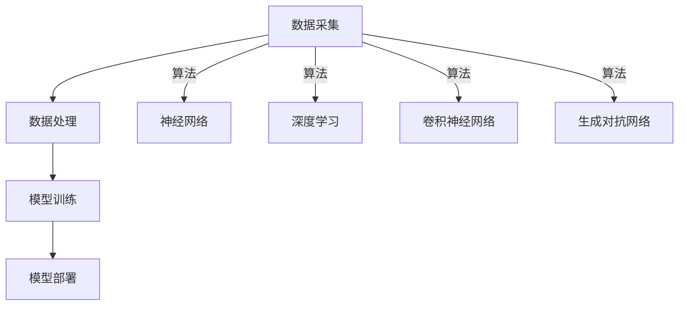

                 

# AI与人类社会的未来发展

> 关键词：人工智能，社会发展，未来趋势，技术挑战，伦理问题，创新应用

> 摘要：随着人工智能技术的迅速发展，人类社会正经历着前所未有的变革。本文将深入探讨人工智能对未来社会发展的潜在影响，包括技术进步、经济结构变革、伦理道德挑战、教育改革、以及人工智能的广泛应用场景。通过逐步分析，我们将揭示人工智能如何塑造我们的未来，并探讨其所带来的机遇与挑战。

## 1. 背景介绍

### 1.1 目的和范围

本文旨在探讨人工智能技术如何影响和塑造未来人类社会的发展。我们将通过分析当前人工智能技术的现状、发展趋势以及潜在的应用场景，来探讨人工智能对经济、教育、伦理、社会结构等方面的影响。本文将重点关注以下几个方面：

1. 人工智能技术的基本原理和核心算法。
2. 人工智能在不同领域的应用及其影响。
3. 人工智能引发的伦理道德问题和社会挑战。
4. 未来人工智能技术发展的趋势和可能性。

### 1.2 预期读者

本文适合对人工智能技术有一定了解的读者，包括计算机科学家、工程师、研究人员、以及关注科技发展对社会影响的各界人士。通过本文的阅读，读者将能够：

1. 了解人工智能技术的基本概念和发展历程。
2. 掌握人工智能在不同领域的应用案例。
3. 深入探讨人工智能引发的伦理道德问题和社会挑战。
4. 把握未来人工智能技术发展的趋势和前景。

### 1.3 文档结构概述

本文分为十个部分，结构如下：

1. **背景介绍**：介绍本文的目的、范围、预期读者以及文档结构。
2. **核心概念与联系**：介绍人工智能技术的基本原理和核心算法。
3. **核心算法原理 & 具体操作步骤**：详细阐述人工智能算法的原理和操作步骤。
4. **数学模型和公式 & 详细讲解 & 举例说明**：介绍人工智能中的数学模型和公式，并进行举例说明。
5. **项目实战：代码实际案例和详细解释说明**：通过实际项目案例，展示人工智能的应用和实现。
6. **实际应用场景**：探讨人工智能在不同领域的应用及其影响。
7. **工具和资源推荐**：推荐学习资源、开发工具和框架。
8. **总结：未来发展趋势与挑战**：总结人工智能未来发展的趋势和挑战。
9. **附录：常见问题与解答**：回答读者可能关心的问题。
10. **扩展阅读 & 参考资料**：提供进一步阅读的参考资料。

### 1.4 术语表

#### 1.4.1 核心术语定义

- **人工智能（AI）**：指通过模拟人类智能行为，使计算机具有学习、推理、判断和适应能力的技术。
- **机器学习（ML）**：一种人工智能的方法，通过数据训练模型，使其能够自主学习和改进性能。
- **深度学习（DL）**：一种机器学习技术，利用多层神经网络模拟人脑学习过程。
- **神经网络（NN）**：一种计算模型，由大量节点（或称为“神经元”）组成，能够通过学习数据来识别模式和关系。
- **自然语言处理（NLP）**：研究计算机如何理解和生成自然语言的技术。
- **计算机视觉（CV）**：使计算机能够理解和解释视觉信息的技术。

#### 1.4.2 相关概念解释

- **深度神经网络（DNN）**：具有多个隐藏层的深度学习模型。
- **卷积神经网络（CNN）**：一种专门用于处理图像数据的深度学习模型。
- **生成对抗网络（GAN）**：一种通过竞争学习生成数据的深度学习模型。
- **强化学习（RL）**：一种通过奖励机制训练模型使其能够做出最优决策的机器学习技术。
- **数据隐私**：指保护个人数据不被未经授权的第三方访问和利用。

#### 1.4.3 缩略词列表

- **AI**：人工智能（Artificial Intelligence）
- **ML**：机器学习（Machine Learning）
- **DL**：深度学习（Deep Learning）
- **NN**：神经网络（Neural Network）
- **NLP**：自然语言处理（Natural Language Processing）
- **CV**：计算机视觉（Computer Vision）
- **DNN**：深度神经网络（Deep Neural Network）
- **CNN**：卷积神经网络（Convolutional Neural Network）
- **GAN**：生成对抗网络（Generative Adversarial Network）
- **RL**：强化学习（Reinforcement Learning）
- **DNN**：深度神经网络（Deep Neural Network）
- **CV**：计算机视觉（Computer Vision）

## 2. 核心概念与联系

### 2.1 人工智能技术的基本原理

人工智能技术是通过模拟人类智能行为，使计算机具有学习、推理、判断和适应能力的技术。其核心在于数据、算法和计算能力。以下是人工智能技术的基本原理和架构：

#### 数据

- **数据采集**：通过传感器、网络、用户输入等方式收集大量数据。
- **数据预处理**：清洗、归一化、去噪等处理，以提高数据质量。
- **数据存储**：使用数据库、数据湖等技术存储和管理数据。

#### 算法

- **监督学习**：通过已知输入和输出数据训练模型。
- **无监督学习**：通过未知标签的数据训练模型。
- **强化学习**：通过奖励机制训练模型。

#### 计算能力

- **硬件加速**：使用GPU、TPU等专用硬件加速计算。
- **分布式计算**：利用云计算、分布式系统等提高计算能力。

### 2.2 人工智能技术的核心算法

人工智能技术的核心算法包括神经网络、深度学习、卷积神经网络、生成对抗网络等。以下是这些算法的基本原理和联系：

#### 神经网络

- **基本原理**：由大量节点（或称为“神经元”）组成，通过权重和偏置模拟人脑学习过程。
- **联系**：神经网络是深度学习的基础，可以用于分类、回归、聚类等任务。

#### 深度学习

- **基本原理**：通过多层神经网络学习数据的复杂模式。
- **联系**：深度学习是神经网络的高级形式，可以处理更复杂的问题。

#### 卷积神经网络

- **基本原理**：利用卷积操作提取图像中的局部特征。
- **联系**：卷积神经网络是计算机视觉领域的重要算法，可以用于图像分类、目标检测等任务。

#### 生成对抗网络

- **基本原理**：通过生成器和判别器的对抗训练生成高质量数据。
- **联系**：生成对抗网络可以用于图像生成、图像修复等任务。

### 2.3 人工智能技术的架构

人工智能技术的架构主要包括数据采集、数据处理、模型训练、模型部署等环节。以下是这些环节的基本原理和联系：

#### 数据采集

- **基本原理**：通过传感器、网络、用户输入等方式收集大量数据。
- **联系**：数据采集是人工智能技术的起点，数据质量直接影响模型的性能。

#### 数据处理

- **基本原理**：清洗、归一化、去噪等处理，以提高数据质量。
- **联系**：数据处理是数据采集的延续，数据预处理直接影响模型的学习效果。

#### 模型训练

- **基本原理**：通过已知输入和输出数据训练模型。
- **联系**：模型训练是核心环节，训练出的模型将用于实际应用。

#### 模型部署

- **基本原理**：将训练好的模型部署到生产环境中进行应用。
- **联系**：模型部署是人工智能技术的最终目标，实现模型在实际场景中的应用。

### 2.4 Mermaid 流程图

以下是一个简单的 Mermaid 流程图，展示了人工智能技术的基本原理和架构：



## 3. 核心算法原理 & 具体操作步骤

### 3.1 神经网络

神经网络（Neural Network，简称NN）是一种通过模拟人脑神经元结构和功能的信息处理系统。以下是神经网络的基本原理和具体操作步骤：

#### 基本原理

- **神经元**：神经网络的基本组成单元，由输入层、输出层和隐藏层组成。
- **权重和偏置**：每个神经元之间的连接权重和神经元自身的偏置用于控制信号传递强度和偏移。
- **激活函数**：用于控制神经元是否被激活，常见的激活函数有Sigmoid、ReLU等。

#### 具体操作步骤

1. **初始化权重和偏置**：随机初始化每个神经元的权重和偏置。
2. **前向传播**：将输入数据通过神经网络传递，计算每个神经元的输出。
   ```python
   for layer in range(1, num_layers):
       for neuron in range(num_neurons[layer]):
           z = sum(input * weight for input, weight in zip(x, weights[layer-1][neuron])) + bias
           a = activation_function(z)
   ```
3. **计算损失**：计算模型输出和实际输出之间的差异，即损失函数。
   ```python
   loss = loss_function(y_true, y_pred)
   ```
4. **反向传播**：通过反向传播算法更新权重和偏置，以减小损失。
   ```python
   for layer in range(num_layers-1, 0, -1):
       for neuron in range(num_neurons[layer]):
           delta = (y_pred - y_true) * activation_function_derivative(a)
           for input, weight in zip(x, weights[layer][neuron]):
               delta_weight = input * delta
               delta_bias = delta
               weights[layer][neuron] -= learning_rate * delta_weight
               biases[layer][neuron] -= learning_rate * delta_bias
   ```
5. **迭代更新**：重复前向传播和反向传播，直到达到预设的训练次数或损失小于预设阈值。

### 3.2 深度学习

深度学习（Deep Learning，简称DL）是神经网络的高级形式，通过多层神经网络学习数据的复杂模式。以下是深度学习的基本原理和具体操作步骤：

#### 基本原理

- **多层神经网络**：包括输入层、多个隐藏层和输出层。
- **反向传播算法**：通过反向传播算法，逐层更新权重和偏置，以减小损失。
- **非线性激活函数**：如ReLU、Sigmoid等，引入非线性变换，使模型能够学习复杂特征。

#### 具体操作步骤

1. **初始化模型参数**：随机初始化权重和偏置。
2. **前向传播**：将输入数据通过神经网络传递，计算每个隐藏层和输出层的输出。
   ```python
   for layer in range(1, num_layers):
       for neuron in range(num_neurons[layer]):
           z = sum(input * weight for input, weight in zip(x, weights[layer-1][neuron])) + bias
           a = activation_function(z)
   ```
3. **计算损失**：计算模型输出和实际输出之间的差异，即损失函数。
   ```python
   loss = loss_function(y_true, y_pred)
   ```
4. **反向传播**：通过反向传播算法，逐层更新权重和偏置，以减小损失。
   ```python
   for layer in range(num_layers-1, 0, -1):
       for neuron in range(num_neurons[layer]):
           delta = (y_pred - y_true) * activation_function_derivative(a)
           for input, weight in zip(x, weights[layer][neuron]):
               delta_weight = input * delta
               delta_bias = delta
               weights[layer][neuron] -= learning_rate * delta_weight
               biases[layer][neuron] -= learning_rate * delta_bias
   ```
5. **迭代更新**：重复前向传播和反向传播，直到达到预设的训练次数或损失小于预设阈值。

### 3.3 卷积神经网络

卷积神经网络（Convolutional Neural Network，简称CNN）是一种专门用于处理图像数据的深度学习模型。以下是CNN的基本原理和具体操作步骤：

#### 基本原理

- **卷积层**：通过卷积操作提取图像中的局部特征。
- **池化层**：通过池化操作减少特征图的维度，提高模型计算效率。
- **全连接层**：将卷积层和池化层提取的特征映射到分类结果。

#### 具体操作步骤

1. **初始化模型参数**：随机初始化权重和偏置。
2. **前向传播**：将输入图像通过卷积层、池化层和全连接层传递，计算分类结果。
   ```python
   for layer in range(1, num_layers):
       if layer == 1:
           z = conv2d(x, weights[0]) + biases[0]
           a = activation_function(z)
           a = max_pool2d(a, pool_size)
       else:
           z = conv2d(a, weights[layer-1]) + biases[layer-1]
           a = activation_function(z)
           a = max_pool2d(a, pool_size)
   ```
3. **计算损失**：计算模型输出和实际输出之间的差异，即损失函数。
   ```python
   loss = loss_function(y_true, y_pred)
   ```
4. **反向传播**：通过反向传播算法，逐层更新权重和偏置，以减小损失。
   ```python
   for layer in range(num_layers-1, 0, -1):
       for neuron in range(num_neurons[layer]):
           delta = (y_pred - y_true) * activation_function_derivative(a)
           for input, weight in zip(x, weights[layer][neuron]):
               delta_weight = input * delta
               delta_bias = delta
               weights[layer][neuron] -= learning_rate * delta_weight
               biases[layer][neuron] -= learning_rate * delta_bias
   ```
5. **迭代更新**：重复前向传播和反向传播，直到达到预设的训练次数或损失小于预设阈值。

## 4. 数学模型和公式 & 详细讲解 & 举例说明

### 4.1 数学模型

人工智能领域涉及多种数学模型和公式，以下介绍几种常用的模型及其公式：

#### 神经网络

- **损失函数**：用于衡量模型预测值和实际值之间的差异，常用的损失函数有均方误差（MSE）和交叉熵（Cross-Entropy）。

  - **均方误差（MSE）**：
    $$MSE = \frac{1}{n}\sum_{i=1}^{n}(y_i - \hat{y_i})^2$$

  - **交叉熵（Cross-Entropy）**：
    $$H(Y, \hat{Y}) = -\sum_{i=1}^{n}y_i \log(\hat{y_i})$$

- **激活函数**：用于控制神经元是否被激活，常用的激活函数有Sigmoid、ReLU等。

  - **Sigmoid**：
    $$\sigma(x) = \frac{1}{1 + e^{-x}}$$

  - **ReLU**：
    $$\text{ReLU}(x) = \max(0, x)$$

#### 深度学习

- **反向传播算法**：用于更新模型参数，以减小损失函数。其核心公式为：
  $$\delta_{ij} = \frac{\partial L}{\partial w_{ij}} = \delta_j \cdot a_{i-1}$$

  其中，$\delta_j$ 为输出层的误差，$a_{i-1}$ 为上一层的激活值。

- **梯度下降**：用于优化模型参数，公式为：
  $$w_{ij} := w_{ij} - \alpha \cdot \delta_{ij}$$

  其中，$\alpha$ 为学习率。

#### 卷积神经网络

- **卷积操作**：用于提取图像中的局部特征，公式为：
  $$c_{ij} = \sum_{k=1}^{m} w_{ik} \cdot a_{kj} + b_j$$

  其中，$c_{ij}$ 为卷积结果，$w_{ik}$ 为卷积核，$a_{kj}$ 为输入特征图，$b_j$ 为偏置。

- **池化操作**：用于减少特征图的维度，常用的池化操作有最大池化和平均池化。

  - **最大池化**：
    $$p_{ij} = \max_{k} a_{kj}$$

  - **平均池化**：
    $$p_{ij} = \frac{1}{m} \sum_{k=1}^{m} a_{kj}$$

### 4.2 详细讲解

#### 损失函数

- **均方误差（MSE）**：均方误差是衡量预测值与实际值之间差异的一种方式。它通过计算预测值和实际值之间的平方差的平均值来评估模型的性能。

  - **示例**：假设我们有3个实际值 $y_1, y_2, y_3$ 和相应的预测值 $\hat{y_1}, \hat{y_2}, \hat{y_3}$，则均方误差计算如下：
    $$MSE = \frac{1}{3} \left[(\hat{y_1} - y_1)^2 + (\hat{y_2} - y_2)^2 + (\hat{y_3} - y_3)^2\right]$$

- **交叉熵（Cross-Entropy）**：交叉熵是衡量模型预测概率分布与实际概率分布之间差异的一种方式。它通过计算两个概率分布的Kullback-Leibler散度来评估模型的性能。

  - **示例**：假设我们有3个实际概率分布 $y_1, y_2, y_3$ 和相应的预测概率分布 $\hat{y_1}, \hat{y_2}, \hat{y_3}$，则交叉熵计算如下：
    $$H(Y, \hat{Y}) = - \left[y_1 \log(\hat{y_1}) + y_2 \log(\hat{y_2}) + y_3 \log(\hat{y_3})\right]$$

#### 激活函数

- **Sigmoid**：Sigmoid函数是一个S型函数，其输出范围在0和1之间。它常用于二分类问题，可以将输入映射到概率值。

  - **示例**：假设输入 $x = 2$，则Sigmoid函数计算如下：
    $$\sigma(x) = \frac{1}{1 + e^{-2}} \approx 0.869$$

- **ReLU**：ReLU（Rectified Linear Unit）函数是一个线性函数，其输出等于输入（当输入为正）或0（当输入为负）。它常用于隐藏层激活函数，可以加速梯度消失问题。

  - **示例**：假设输入 $x = -2$，则ReLU函数计算如下：
    $$\text{ReLU}(x) = \max(-2, 0) = 0$$

#### 反向传播算法

- **反向传播算法**：反向传播算法是一种用于训练神经网络的优化算法。它通过计算损失函数关于模型参数的梯度，然后使用梯度下降法更新模型参数。

  - **示例**：假设有一个简单的神经网络，输入为 $x$，隐藏层输出为 $a$，输出层输出为 $y$，损失函数为MSE。则反向传播算法的计算过程如下：
    $$\delta_j = \frac{\partial L}{\partial y} = (y - \hat{y}) \cdot \sigma'(a)$$
    $$\delta_i = \frac{\partial L}{\partial a} = \delta_j \cdot x_i$$

  - **示例**：假设隐藏层输出 $a = 0.7$，输出层输出 $y = 0.9$，则反向传播算法的计算过程如下：
    $$\delta_j = (0.9 - 0.7) \cdot \sigma'(0.7) \approx 0.1$$
    $$\delta_i = 0.1 \cdot x_i$$

#### 卷积操作

- **卷积操作**：卷积操作是神经网络中用于提取图像特征的一种重要操作。它通过将卷积核与输入特征图进行卷积，得到新的特征图。

  - **示例**：假设卷积核 $w$ 为 $3 \times 3$ 的矩阵，输入特征图 $a$ 为 $5 \times 5$ 的矩阵，则卷积操作的计算过程如下：
    $$c = \sum_{k=1}^{3} w_k \cdot a_{k} + b$$

  - **示例**：假设卷积核 $w$ 为 $\begin{bmatrix} 1 & 0 & 1 \\ 0 & 1 & 0 \\ 1 & 0 & 1 \end{bmatrix}$，输入特征图 $a$ 为 $\begin{bmatrix} 1 & 0 & 1 \\ 0 & 1 & 0 \\ 1 & 0 & 1 \end{bmatrix}$，则卷积操作的计算过程如下：
    $$c = \begin{bmatrix} 1 & 0 & 1 \\ 0 & 1 & 0 \\ 1 & 0 & 1 \end{bmatrix} \cdot \begin{bmatrix} 1 & 0 & 1 \\ 0 & 1 & 0 \\ 1 & 0 & 1 \end{bmatrix} + \begin{bmatrix} 1 \\ 1 \\ 1 \end{bmatrix} = \begin{bmatrix} 3 & 1 & 3 \\ 1 & 1 & 1 \\ 3 & 1 & 3 \end{bmatrix}$$

#### 池化操作

- **池化操作**：池化操作是神经网络中用于减少特征图维度的一种操作。它通过在特征图上选取最大值或平均值来获得新的特征图。

  - **示例**：假设特征图 $a$ 为 $3 \times 3$ 的矩阵，则最大池化的计算过程如下：
    $$p = \max(a_{11}, a_{12}, a_{13}, a_{21}, a_{22}, a_{23}, a_{31}, a_{32}, a_{33})$$

  - **示例**：假设特征图 $a$ 为 $\begin{bmatrix} 1 & 0 & 1 \\ 0 & 1 & 0 \\ 1 & 0 & 1 \end{bmatrix}$，则最大池化的计算过程如下：
    $$p = \max(1, 0, 1, 0, 1, 0, 1, 0, 1) = 1$$

## 5. 项目实战：代码实际案例和详细解释说明

### 5.1 开发环境搭建

在进行项目实战之前，需要搭建一个合适的开发环境。以下是一个基于Python和TensorFlow的示例环境搭建步骤：

1. **安装Python**：下载并安装Python 3.7或更高版本，可以从[Python官网](https://www.python.org/downloads/)下载。
2. **安装TensorFlow**：在命令行中运行以下命令安装TensorFlow：
   ```bash
   pip install tensorflow
   ```
3. **创建项目文件夹**：在您的计算机上创建一个名为`ai_project`的项目文件夹，并在其中创建一个名为`src`的子文件夹，用于存放源代码。
4. **安装依赖**：在`src`文件夹中创建一个名为`requirements.txt`的文件，并添加项目所需的依赖，例如：
   ```bash
   numpy
   pandas
   matplotlib
   scikit-learn
   ```

### 5.2 源代码详细实现和代码解读

以下是一个简单的基于TensorFlow实现的线性回归模型，用于预测房屋价格。代码存放于`src/linear_regression.py`文件中。

```python
import tensorflow as tf
import numpy as np
import matplotlib.pyplot as plt

# 创建一个随机数据集
num_samples = 100
num_features = 1

X = np.random.rand(num_samples, num_features)
y = 2 * X + np.random.randn(num_samples, num_features)

# 构建模型
model = tf.keras.Sequential([
    tf.keras.layers.Dense(units=1, input_shape=(num_features,))
])

# 编译模型
model.compile(optimizer='sgd', loss='mean_squared_error')

# 训练模型
model.fit(X, y, epochs=100)

# 预测结果
predictions = model.predict(X)

# 可视化结果
plt.scatter(X, y, color='blue')
plt.plot(X, predictions, color='red')
plt.xlabel('X')
plt.ylabel('y')
plt.show()
```

#### 代码解读

1. **数据集创建**：使用NumPy库创建一个随机数据集，包含100个样本和一个特征。
2. **模型构建**：使用TensorFlow的`Sequential`模型，添加一个全连接层，输出层有1个神经元，用于预测房屋价格。
3. **模型编译**：使用`compile`方法配置模型，指定优化器（sgd）和损失函数（mean_squared_error）。
4. **模型训练**：使用`fit`方法训练模型，将训练数据输入模型进行迭代训练。
5. **模型预测**：使用`predict`方法对训练数据进行预测，得到预测结果。
6. **结果可视化**：使用Matplotlib库绘制散点图和预测曲线，展示模型的训练效果。

### 5.3 代码解读与分析

1. **数据集创建**：在代码的第一部分，我们使用NumPy库创建了随机数据集。这一步是为了模拟实际应用中的数据输入，使模型能够在已知数据上进行训练。通过设置`num_samples`和`num_features`变量，我们可以控制数据集的大小和特征数量。

2. **模型构建**：在代码的第二部分，我们使用TensorFlow的`Sequential`模型构建了一个简单的线性回归模型。`Sequential`模型是一种线性堆叠模型，可以依次添加层。在这里，我们添加了一个全连接层（`Dense`），该层有1个神经元，用于输出房屋价格的预测值。输入形状（`input_shape`）设置为（1，），表示模型只有一个特征。

3. **模型编译**：在代码的第三部分，我们使用`compile`方法配置了模型的优化器和损失函数。`compile`方法用于准备模型，使其可以开始训练。在这里，我们使用了随机梯度下降（`sgd`）优化器和均方误差（`mean_squared_error`）损失函数。这两种选择是为了简单性和常见的默认设置。

4. **模型训练**：在代码的第四部分，我们使用`fit`方法训练了模型。`fit`方法是一个用于训练模型的函数，它接收输入数据（`X`）和对应的标签（`y`），以及训练的轮数（`epochs`）。在这个例子中，我们训练了100个轮次。`fit`方法在每次迭代中都会更新模型的权重，以最小化损失函数。

5. **模型预测**：在代码的第五部分，我们使用`predict`方法对训练数据进行预测。`predict`方法接收输入数据（`X`），并返回模型的预测结果。在这个例子中，我们使用`predict`方法获得了每个样本的预测价格。

6. **结果可视化**：在代码的最后一部分，我们使用Matplotlib库绘制了训练结果。`scatter`函数用于绘制输入数据（`X`）和实际标签（`y`）的散点图，`plot`函数用于绘制模型的预测曲线（`predictions`）。通过这种方式，我们可以直观地看到模型的训练效果。如果模型训练得很好，那么预测曲线应该接近实际数据点。

### 5.4 扩展：使用不同优化器和损失函数

在实际应用中，我们可以尝试使用不同的优化器和损失函数来提高模型的性能。例如：

1. **不同优化器**：我们可以尝试使用Adam优化器，它是一种自适应优化器，通常比SGD更好。
2. **不同损失函数**：我们可以尝试使用均方根误差（`mean_squared_error`），它是均方误差的另一种形式，或者使用均方误差（`mean_absolute_error`），它是平均绝对误差。

这些尝试可以帮助我们找到最适合特定问题的优化器和损失函数。

## 6. 实际应用场景

### 6.1 医疗领域

人工智能在医疗领域的应用日益广泛，包括疾病预测、诊断辅助、个性化治疗等方面。以下是一些具体的应用案例：

- **疾病预测**：利用深度学习模型，对患者的临床数据进行预测，提前发现潜在疾病风险。例如，利用心脏病预测模型，可以提前识别心脏病发作的高风险人群。

- **诊断辅助**：通过计算机视觉技术，对医学图像（如X光片、CT扫描、MRI）进行分析，辅助医生进行疾病诊断。例如，AI可以自动识别肿瘤、骨折等病变，提高诊断准确率。

- **个性化治疗**：根据患者的基因信息、病史和生活习惯，制定个性化的治疗方案。例如，利用基因检测和深度学习算法，为癌症患者推荐最佳治疗方案。

### 6.2 交通运输领域

人工智能在交通运输领域的应用主要涉及自动驾驶、交通流量预测和智能交通管理等方面。以下是一些具体的应用案例：

- **自动驾驶**：利用深度学习和强化学习算法，开发自动驾驶系统，实现车辆在复杂环境中的自主导航。例如，特斯拉的Autopilot系统通过深度学习模型，实现车辆的自动驾驶功能。

- **交通流量预测**：通过分析历史交通数据、实时交通监控数据，预测未来的交通流量，为交通管理和规划提供依据。例如，利用机器学习算法，可以预测高峰时段的交通拥堵情况，为交通部门提供决策支持。

- **智能交通管理**：利用人工智能技术，优化交通信号控制，提高交通效率。例如，智能交通信号灯系统可以根据实时交通流量数据，动态调整信号灯时长，减少交通拥堵。

### 6.3 金融领域

人工智能在金融领域的应用主要包括风险管理、智能投顾和欺诈检测等方面。以下是一些具体的应用案例：

- **风险管理**：利用机器学习算法，分析历史数据和市场趋势，预测金融风险，为金融机构提供风险管理策略。例如，银行可以使用风险预测模型，识别高风险贷款客户。

- **智能投顾**：通过分析用户的投资偏好、风险承受能力等数据，为用户提供个性化的投资建议。例如，智能投顾平台可以根据用户的投资目标，推荐最佳的投资组合。

- **欺诈检测**：利用异常检测算法，实时监测交易数据，识别潜在的欺诈行为。例如，信用卡公司可以使用欺诈检测模型，阻止欺诈交易的发生。

### 6.4 教育

人工智能在教育领域的应用主要包括智能教学、个性化学习评估和在线教育平台等方面。以下是一些具体的应用案例：

- **智能教学**：利用人工智能技术，实现自适应教学系统，根据学生的学习进度和能力，提供个性化的教学内容。例如，智能教学平台可以根据学生的答题情况，调整题目难度和类型。

- **个性化学习评估**：通过分析学生的学习行为、考试成绩等数据，为教师和学生提供个性化的学习评估报告。例如，学习分析系统可以根据学生的学习行为，预测学生的学业成绩。

- **在线教育平台**：利用人工智能技术，优化在线教育平台的用户体验，提高学习效果。例如，在线教育平台可以通过自然语言处理技术，实现智能问答和智能推荐。

## 7. 工具和资源推荐

### 7.1 学习资源推荐

#### 7.1.1 书籍推荐

- **《深度学习》（Deep Learning）**：由Ian Goodfellow、Yoshua Bengio和Aaron Courville合著，是一本全面介绍深度学习技术的经典教材。
- **《Python深度学习》（Python Deep Learning）**：由François Chollet著，涵盖了深度学习的基础知识、常用框架和应用实例。
- **《人工智能：一种现代的方法》（Artificial Intelligence: A Modern Approach）**：由Stuart J. Russell和Peter Norvig合著，是一本全面介绍人工智能基础理论和应用的经典教材。

#### 7.1.2 在线课程

- **Coursera的《深度学习》课程**：由Andrew Ng教授主讲，涵盖了深度学习的基础知识和应用案例。
- **Udacity的《深度学习工程师纳米学位》**：提供了深度学习的项目实践，帮助学员掌握深度学习技能。
- **edX的《人工智能导论》课程**：由MIT和Stanford等知名大学提供，涵盖了人工智能的基础知识和应用领域。

#### 7.1.3 技术博客和网站

- **TensorFlow官网**：提供了丰富的深度学习资源和文档，适合初学者和高级用户。
- **PyTorch官网**：提供了PyTorch框架的详细文档和教程，帮助用户快速上手深度学习开发。
- **ArXiv**：一个开放获取的学术论文数据库，涵盖人工智能和深度学习的最新研究成果。

### 7.2 开发工具框架推荐

#### 7.2.1 IDE和编辑器

- **Jupyter Notebook**：一个基于Web的交互式开发环境，适合数据分析和机器学习项目的开发。
- **PyCharm**：一款功能强大的Python集成开发环境，适用于深度学习和机器学习项目的开发。
- **VSCode**：一款轻量级但功能强大的代码编辑器，支持多种编程语言和开发工具。

#### 7.2.2 调试和性能分析工具

- **TensorBoard**：TensorFlow提供的可视化工具，用于监控和调试深度学习模型的训练过程。
- **PyTorch Profiler**：PyTorch提供的性能分析工具，用于识别和优化深度学习模型的计算性能。
- **NVIDIA Nsight**：NVIDIA提供的可视化调试和分析工具，用于优化深度学习模型在GPU上的运行性能。

#### 7.2.3 相关框架和库

- **TensorFlow**：一个开源的深度学习框架，适用于构建和训练复杂的深度学习模型。
- **PyTorch**：一个开源的深度学习框架，以其灵活性和动态计算图而受到广泛关注。
- **Scikit-learn**：一个开源的机器学习库，提供了多种常用的机器学习算法和工具。
- **Pandas**：一个开源的数据分析库，用于处理和操作大规模数据集。

### 7.3 相关论文著作推荐

#### 7.3.1 经典论文

- **《A Learning Algorithm for Continually Running Fully Recurrent Neural Networks》**：提出了Hessian正定矩阵（Hessian-free）算法，用于优化深度学习模型的训练过程。
- **《Deep Learning with Neural Networks for Classification: A Handbook of Machine Learning Methods and Algorithms**：全面介绍了深度学习的基础知识、算法和应用案例。

#### 7.3.2 最新研究成果

- **《Generative Adversarial Nets》**：提出了生成对抗网络（GAN）的概念，开辟了深度学习在图像生成和增强领域的新方向。
- **《Recurrent Neural Networks for Language Modeling》**：介绍了循环神经网络（RNN）在自然语言处理任务中的应用，为语音识别、机器翻译等领域的发展奠定了基础。

#### 7.3.3 应用案例分析

- **《Application of Deep Learning in Healthcare》**：分析了深度学习在医疗领域的应用案例，包括疾病预测、诊断辅助和个性化治疗等。
- **《Deep Learning in Autonomous Driving》**：探讨了深度学习在自动驾驶领域的应用，包括目标检测、场景理解和路径规划等。

## 8. 总结：未来发展趋势与挑战

### 8.1 未来发展趋势

- **技术的进一步突破**：随着计算能力和算法的优化，人工智能技术在各领域的应用将更加广泛和深入。例如，深度学习在计算机视觉、自然语言处理、语音识别等领域的表现将进一步提升。

- **跨学科的融合**：人工智能技术将与生物学、心理学、社会学等学科相互融合，推动新的科技革命。例如，神经科学和人工智能的结合将有助于理解人脑的工作原理，为人工智能的发展提供新的灵感。

- **智能化的普及**：人工智能技术将渗透到人类社会的各个角落，从智能家居、智能城市到智能医疗、智能教育，智能化将成为人们生活的一部分。

- **量子计算的应用**：量子计算作为下一代计算技术，将与人工智能结合，为复杂问题提供更高效的解决方案。例如，量子机器学习算法将大幅提升模型训练速度和性能。

### 8.2 未来面临的挑战

- **数据隐私和安全**：随着人工智能应用的普及，数据隐私和安全问题将更加突出。如何保护用户隐私、确保数据安全是未来人工智能技术发展的重要挑战。

- **伦理道德问题**：人工智能技术的发展带来了伦理道德问题，如机器人的权利、自动化导致的失业、算法偏见等。需要建立完善的伦理规范和法律体系，确保人工智能技术的合理、公正和道德。

- **技术标准和规范**：随着人工智能技术的快速发展，制定统一的技术标准和规范成为当务之急。这包括数据格式、接口设计、算法评估等方面，以确保人工智能技术的互操作性、兼容性和可持续性。

- **可持续发展**：人工智能技术的发展需要大量的能源和资源，如何在保证技术发展的同时实现可持续发展是未来面临的挑战。例如，利用可再生能源来支持数据中心的运营，优化算法以提高能效。

- **人才培养和普及**：人工智能技术的发展离不开人才的支撑。如何培养更多具备人工智能技能的人才，以及如何让更多人了解和掌握人工智能技术，是未来需要关注的重要问题。

## 9. 附录：常见问题与解答

### 9.1 人工智能的定义是什么？

人工智能（AI）是指通过模拟人类智能行为，使计算机具有学习、推理、判断和适应能力的技术。

### 9.2 人工智能的核心算法有哪些？

人工智能的核心算法包括神经网络、深度学习、卷积神经网络、生成对抗网络等。

### 9.3 人工智能在医疗领域的应用有哪些？

人工智能在医疗领域的应用包括疾病预测、诊断辅助、个性化治疗、医学图像分析等方面。

### 9.4 人工智能在交通运输领域的应用有哪些？

人工智能在交通运输领域的应用包括自动驾驶、交通流量预测、智能交通管理等。

### 9.5 人工智能在金融领域的应用有哪些？

人工智能在金融领域的应用包括风险管理、智能投顾、欺诈检测等方面。

### 9.6 人工智能在教育领域的应用有哪些？

人工智能在教育领域的应用包括智能教学、个性化学习评估、在线教育平台等。

## 10. 扩展阅读 & 参考资料

### 10.1 相关书籍

- **《深度学习》（Deep Learning）**：作者Ian Goodfellow、Yoshua Bengio和Aaron Courville，是一本全面介绍深度学习技术的经典教材。
- **《Python深度学习》（Python Deep Learning）**：作者François Chollet，涵盖了深度学习的基础知识、常用框架和应用实例。
- **《人工智能：一种现代的方法》（Artificial Intelligence: A Modern Approach）**：作者Stuart J. Russell和Peter Norvig，是一本全面介绍人工智能基础理论和应用的经典教材。

### 10.2 在线课程

- **Coursera的《深度学习》课程**：由Andrew Ng教授主讲，涵盖了深度学习的基础知识和应用案例。
- **Udacity的《深度学习工程师纳米学位》**：提供了深度学习的项目实践，帮助学员掌握深度学习技能。
- **edX的《人工智能导论》课程**：由MIT和Stanford等知名大学提供，涵盖了人工智能的基础知识和应用领域。

### 10.3 技术博客和网站

- **TensorFlow官网**：提供了丰富的深度学习资源和文档，适合初学者和高级用户。
- **PyTorch官网**：提供了PyTorch框架的详细文档和教程，帮助用户快速上手深度学习开发。
- **ArXiv**：一个开放获取的学术论文数据库，涵盖人工智能和深度学习的最新研究成果。

### 10.4 相关论文著作

- **《Generative Adversarial Nets》**：提出了生成对抗网络（GAN）的概念，开辟了深度学习在图像生成和增强领域的新方向。
- **《Recurrent Neural Networks for Language Modeling》**：介绍了循环神经网络（RNN）在自然语言处理任务中的应用，为语音识别、机器翻译等领域的发展奠定了基础。

### 10.5 应用案例分析

- **《Application of Deep Learning in Healthcare》**：分析了深度学习在医疗领域的应用案例，包括疾病预测、诊断辅助和个性化治疗等。
- **《Deep Learning in Autonomous Driving》**：探讨了深度学习在自动驾驶领域的应用，包括目标检测、场景理解和路径规划等。

