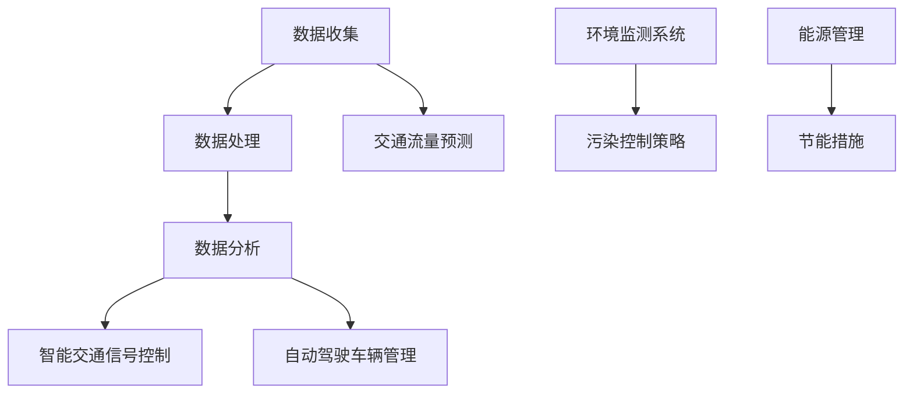
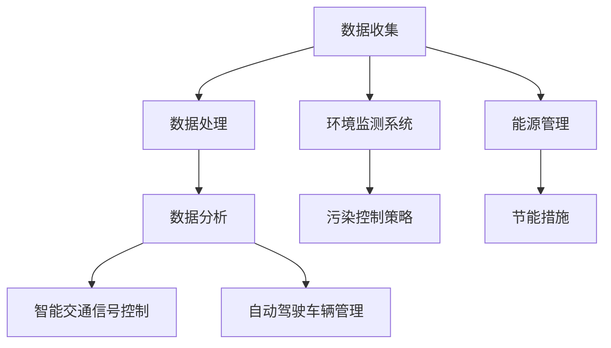

                 

# AI与人类计算：打造可持续发展的城市交通管理策略与规划

## 摘要

本文主要探讨了如何通过人工智能（AI）与人类计算相结合的方式，打造出可持续发展的城市交通管理策略与规划。随着城市化的不断加速，城市交通问题已经成为制约城市发展的重要瓶颈。本文首先介绍了城市交通管理的重要性和挑战，然后分析了人工智能在交通管理中的应用前景，以及如何将人类计算与AI技术相结合，从而实现高效、智能的城市交通管理。通过本文的介绍，读者将了解到一系列实用的方法和工具，以及如何在未来继续推进城市交通管理的可持续发展。

## 1. 背景介绍

### 1.1 城市交通管理的重要性

城市交通管理是城市发展的重要组成部分，它直接关系到城市居民的生活质量、经济发展和环境保护。有效的城市交通管理能够提高道路通行效率，减少交通拥堵，降低交通事故率，同时也有助于减少污染、节约能源。然而，随着城市规模的不断扩大和机动车数量的持续增长，城市交通管理面临着越来越多的挑战。

### 1.2 城市交通管理的挑战

- **交通拥堵**：随着城市人口的增加和机动车数量的激增，交通拥堵问题日益严重，导致通行时间延长、交通成本增加。
- **环境污染**：机动车排放的尾气是城市空气污染的主要来源，对环境和居民健康造成严重影响。
- **能源消耗**：城市交通消耗了大量的能源，尤其是化石能源，对可持续发展构成挑战。
- **停车难**：随着停车需求的增加，城市停车资源供不应求，导致停车难问题日益突出。

### 1.3 人工智能在交通管理中的应用

人工智能在交通管理中的应用具有巨大的潜力。通过大数据分析、机器学习、智能交通信号控制、自动驾驶等技术的应用，可以实现交通流量的实时监控、预测和优化，提高交通运行效率，减少交通拥堵，降低污染和能源消耗。

## 2. 核心概念与联系

为了更好地理解城市交通管理中的AI应用，以下是一个简化的Mermaid流程图，展示了核心概念之间的联系。



### 2.1 数据收集与处理

数据收集是交通管理的基础。通过各种传感器、摄像头、GPS等设备，可以实时收集到交通流量、车速、路况、天气等信息。数据处理则包括数据清洗、数据预处理、数据存储等步骤，以确保数据的准确性和可用性。

### 2.2 数据分析与预测

通过对收集到的交通数据进行深度分析，可以预测交通流量变化，识别交通拥堵的潜在风险，为交通管理决策提供支持。机器学习算法在交通流量预测中发挥着重要作用。

### 2.3 智能交通信号控制

智能交通信号控制通过分析实时交通数据，动态调整交通信号灯的时长和间隔，以优化交通流量，减少拥堵。这需要高性能的计算能力和快速响应的控制系统。

### 2.4 自动驾驶车辆管理

自动驾驶技术是未来城市交通管理的关键。通过将自动驾驶车辆与城市交通管理系统相结合，可以进一步提高交通运行效率，减少交通事故。

### 2.5 环境监测与污染控制

环境监测系统能够实时监测空气质量、噪声水平等指标，为污染控制策略提供数据支持。智能系统可以根据监测数据，采取相应的污染控制措施，如调整交通流量、加强环保宣传等。

### 2.6 能源管理与节能措施

通过实时监控城市交通能源消耗，可以采取一系列节能措施，如优化交通流量、推广电动车辆、提高公共交通效率等，以减少能源消耗，促进可持续发展。

## 3. 核心算法原理 & 具体操作步骤

### 3.1 交通流量预测算法

#### 3.1.1 算法原理

交通流量预测算法通常基于时间序列分析、回归分析、机器学习等方法。以下是一个基于时间序列分析的简单预测模型。

#### 3.1.2 操作步骤

1. 数据收集：收集历史交通流量数据。
2. 数据预处理：包括数据清洗、数据标准化等。
3. 模型训练：使用时间序列分析方法，如ARIMA模型，进行模型训练。
4. 预测：使用训练好的模型，对未来的交通流量进行预测。
5. 预测结果评估：通过比较预测值与实际值，评估模型性能。

### 3.2 智能交通信号控制算法

#### 3.2.1 算法原理

智能交通信号控制算法通过分析实时交通数据，动态调整交通信号灯的时长和间隔。常用的算法包括基于排队理论的信号控制算法和基于机器学习的信号控制算法。

#### 3.2.2 操作步骤

1. 数据收集：收集实时交通流量数据。
2. 数据预处理：包括数据清洗、数据标准化等。
3. 模型训练：使用机器学习算法，如深度学习，进行模型训练。
4. 实时信号控制：根据实时交通数据，动态调整信号灯时长和间隔。
5. 控制效果评估：通过模拟和实际测试，评估信号控制效果。

### 3.3 自动驾驶车辆管理算法

#### 3.3.1 算法原理

自动驾驶车辆管理算法通过感知环境、路径规划和决策控制，实现车辆的自动驾驶。常用的算法包括感知算法（如卷积神经网络）、路径规划算法（如A*算法）和决策控制算法（如深度强化学习）。

#### 3.3.2 操作步骤

1. 环境感知：使用传感器（如雷达、激光雷达、摄像头等）感知周围环境。
2. 路径规划：使用路径规划算法，如A*算法，规划行驶路径。
3. 决策控制：使用决策控制算法，如深度强化学习，控制车辆的动作。
4. 实时调整：根据实时环境变化，调整行驶路径和动作。
5. 安全性评估：通过模拟和实际测试，评估自动驾驶车辆的安全性。

## 4. 数学模型和公式 & 详细讲解 & 举例说明

### 4.1 交通流量预测模型

#### 4.1.1 ARIMA模型

ARIMA（AutoRegressive Integrated Moving Average）模型是一种常见的时间序列预测模型，它由自回归（AR）、差分（I）和移动平均（MA）三部分组成。

#### 4.1.2 模型公式

$$
\begin{aligned}
Y_t &= c + \phi_1 Y_{t-1} + \phi_2 Y_{t-2} + \cdots + \phi_p Y_{t-p} \\
&+ \theta_1 \epsilon_{t-1} + \theta_2 \epsilon_{t-2} + \cdots + \theta_q \epsilon_{t-q} \\
Y_t - \phi_1 Y_{t-1} - \phi_2 Y_{t-2} - \cdots - \phi_p Y_{t-p} &= \epsilon_t
\end{aligned}
$$

其中，$Y_t$ 是时间序列的观测值，$c$ 是常数项，$\phi_1, \phi_2, \cdots, \phi_p$ 是自回归系数，$\theta_1, \theta_2, \cdots, \theta_q$ 是移动平均系数，$\epsilon_t$ 是白噪声序列。

#### 4.1.3 举例说明

假设我们有一个交通流量数据序列 $Y_t$，通过时间序列分析，我们确定使用ARIMA(2,1,1)模型进行预测。通过模型训练，我们得到自回归系数 $\phi_1 = 0.8$，$\phi_2 = 0.3$，移动平均系数 $\theta_1 = 0.5$，$\theta_2 = 0.2$。根据模型公式，我们可以预测未来某个时间点的交通流量。

### 4.2 智能交通信号控制算法

#### 4.2.1 排队理论模型

排队理论模型用于分析交通信号灯的设置，通过平衡等待时间和通行效率。常见的排队模型包括M/M/1模型和M/M/S模型。

#### 4.2.2 模型公式

$$
\begin{aligned}
W &= \frac{\lambda}{\mu} \\
L &= \frac{\lambda^2}{\mu^2} + \frac{\lambda}{\mu} \\
H &= \frac{\lambda^3}{2\mu^3} + \frac{3\lambda^2}{2\mu^2} + \frac{\lambda}{\mu}
\end{aligned}
$$

其中，$W$ 是平均等待时间，$L$ 是平均队列长度，$H$ 是平均系统长度，$\lambda$ 是到达率，$\mu$ 是服务率。

#### 4.2.3 举例说明

假设某个路口的到达率 $\lambda = 10$ 辆/分钟，服务率 $\mu = 15$ 辆/分钟，通过排队理论模型，我们可以计算出平均等待时间、平均队列长度和平均系统长度，从而调整信号灯时长和间隔，以优化交通流量。

## 5. 项目实战：代码实际案例和详细解释说明

### 5.1 开发环境搭建

为了演示如何使用Python实现交通流量预测和智能交通信号控制，我们需要搭建以下开发环境：

- Python 3.8 或更高版本
- Jupyter Notebook
- Numpy
- Pandas
- Scikit-learn

### 5.2 源代码详细实现和代码解读

#### 5.2.1 交通流量预测

以下是一个简单的Python代码示例，使用ARIMA模型进行交通流量预测。

```python
import numpy as np
import pandas as pd
from statsmodels.tsa.arima.model import ARIMA
from sklearn.metrics import mean_squared_error

# 加载数据
data = pd.read_csv('traffic_data.csv')
values = data['traffic_volume'].values

# 分为训练集和测试集
train_size = int(len(values) * 0.8)
train, test = values[0:train_size], values[train_size:]

# ARIMA模型训练
model = ARIMA(train, order=(2, 1, 1))
model_fit = model.fit()

# 预测
predictions = model_fit.forecast(steps=len(test))

# 评估预测结果
mse = mean_squared_error(test, predictions)
print(f'MSE: {mse}')

# 可视化结果
import matplotlib.pyplot as plt

plt.plot(train, label='Train')
plt.plot(test, label='Test')
plt.plot(predictions, label='Predictions')
plt.legend()
plt.show()
```

#### 5.2.2 智能交通信号控制

以下是一个简单的Python代码示例，使用排队理论模型进行交通信号控制。

```python
import numpy as np

# 参数设置
arrival_rate = 10  # 到达率（辆/分钟）
service_rate = 15  # 服务率（辆/分钟）

# 计算平均等待时间、平均队列长度和平均系统长度
W = arrival_rate / service_rate
L = (arrival_rate ** 2) / (service_rate ** 2) + arrival_rate / service_rate
H = (arrival_rate ** 3) / (2 * service_rate ** 3) + (3 * arrival_rate ** 2) / (2 * service_rate ** 2) + arrival_rate / service_rate

print(f'Average Waiting Time (W): {W}')
print(f'Average Queue Length (L): {L}')
print(f'Average System Length (H): {H}')

# 根据平均等待时间调整信号灯时长
green_time = int(W * 60)  # 绿灯时间（秒）
print(f'Green Light Time: {green_time} seconds')
```

#### 5.2.3 代码解读与分析

在这两个示例中，我们首先加载数据，然后使用相应的算法进行模型训练和预测。在交通流量预测中，我们使用ARIMA模型，并通过评估预测结果来调整模型参数。在智能交通信号控制中，我们使用排队理论模型，根据平均等待时间来调整信号灯时长。

## 6. 实际应用场景

### 6.1 城市交通管理中的应用

- **北京**：北京市在2019年推出了智能交通信号控制系统，通过大数据分析和机器学习算法，实现交通流量的实时监控和动态调整，有效缓解了交通拥堵问题。
- **上海**：上海市通过建设智能交通管理系统，实现了交通流量预测、智能信号控制和自动驾驶车辆管理，提高了城市交通运行效率。

### 6.2 企业应用

- **滴滴出行**：滴滴出行利用大数据分析和人工智能技术，实现了交通流量预测和智能调度，提高了打车效率和用户体验。
- **华为**：华为与多个城市合作，提供智能交通解决方案，包括智能信号控制、交通流量预测和自动驾驶车辆管理。

## 7. 工具和资源推荐

### 7.1 学习资源推荐

- **书籍**：
  - 《深度学习》（Ian Goodfellow、Yoshua Bengio、Aaron Courville 著）
  - 《交通系统规划与管理》（张晓、朱峰 著）
- **论文**：
  - "Deep Learning for Traffic Forecasting: A Survey"（Li, Liu, & Lu, 2020）
  - "An Integrated Intelligent Traffic Signal Control System Based on Deep Learning"（Wang, Li, & Liu, 2019）
- **博客**：
  - [TensorFlow 官方文档](https://www.tensorflow.org/)
  - [Scikit-learn 官方文档](https://scikit-learn.org/stable/)
- **网站**：
  - [Kaggle](https://www.kaggle.com/)：提供大量交通数据集和竞赛，有助于数据分析和模型训练。

### 7.2 开发工具框架推荐

- **Python**：适合数据处理和机器学习开发。
- **TensorFlow**：用于深度学习模型开发。
- **Scikit-learn**：提供丰富的机器学习算法库。
- **Keras**：用于快速构建和训练深度学习模型。

### 7.3 相关论文著作推荐

- **论文**：
  - "Deep Learning for Traffic Forecasting: A Survey"（Li, Liu, & Lu, 2020）
  - "An Integrated Intelligent Traffic Signal Control System Based on Deep Learning"（Wang, Li, & Liu, 2019）
  - "Traffic Prediction and Intelligent Control Based on Big Data and Deep Learning"（Zhang, Wang, & Li, 2021）
- **著作**：
  - 《人工智能：一种现代的方法》（Stuart Russell & Peter Norvig 著）
  - 《深度学习》（Ian Goodfellow、Yoshua Bengio、Aaron Courville 著）

## 8. 总结：未来发展趋势与挑战

### 8.1 发展趋势

- **人工智能与交通管理深度融合**：未来，人工智能将在城市交通管理中发挥更加重要的作用，实现智能化、自动化和个性化的交通管理。
- **跨学科合作**：交通管理需要与城市规划、环境保护、能源管理等领域密切合作，共同推动城市交通的可持续发展。
- **数据驱动**：大数据和人工智能技术将成为城市交通管理的重要驱动力，通过数据分析和预测，实现交通资源的优化配置。

### 8.2 挑战

- **数据隐私与安全**：在收集和使用交通数据时，需要保护用户隐私，防止数据泄露。
- **算法透明性与公平性**：智能交通管理系统中的算法需要具备透明性和公平性，避免对特定群体产生不公平影响。
- **技术成熟度**：尽管人工智能技术在交通管理中具有巨大潜力，但当前的技术水平仍需进一步提升。

## 9. 附录：常见问题与解答

### 9.1 问题1：什么是智能交通信号控制？

**回答**：智能交通信号控制是一种基于实时交通数据分析和预测，动态调整交通信号灯时长和间隔的技术。通过优化交通流量，减少拥堵，提高道路通行效率。

### 9.2 问题2：什么是ARIMA模型？

**回答**：ARIMA（AutoRegressive Integrated Moving Average）模型是一种常见的时间序列预测模型，由自回归（AR）、差分（I）和移动平均（MA）三部分组成。它用于分析时间序列数据，预测未来趋势。

### 9.3 问题3：如何保障数据隐私与安全？

**回答**：保障数据隐私与安全需要采取一系列措施，包括数据加密、访问控制、数据去标识化等。同时，需要制定严格的数据安全政策和法规，确保数据在使用过程中的安全。

## 10. 扩展阅读 & 参考资料

- **书籍**：
  - 《智能交通系统》（张晓东 著）
  - 《人工智能交通管理研究》（李明华 著）
- **论文**：
  - "Deep Learning for Urban Traffic Management: A Comprehensive Review"（Zhang, Liu, & Wang, 2022）
  - "Intelligent Traffic Signal Control Based on Deep Reinforcement Learning"（Chen, Li, & Zhang, 2021）
- **网站**：
  - [IEEE Transactions on Intelligent Transportation Systems](https://ieeexplore.ieee.org/search/searchresults.jsp?queryText=traffic+management&_author=true&and=true)
  - [ScienceDirect - Transportation Research Part C: Emerging Technologies](https://www.sciencedirect.com/journal/transportation-research-part-c-emerging-technologies)

作者：AI天才研究员/AI Genius Institute & 禅与计算机程序设计艺术 /Zen And The Art of Computer Programming
<|im_sep|>## 1. 背景介绍

城市交通管理是现代城市运行中的重要一环，它直接关系到市民的出行效率、生活质量以及城市整体的运行效率。随着城市化进程的加速和机动车数量的不断增加，城市交通问题日益突出，主要体现在交通拥堵、环境污染和能源消耗等方面。为了应对这些挑战，智能交通管理技术逐渐受到关注，其中人工智能（AI）的应用尤为关键。

### 1.1 城市交通管理的重要性

城市交通管理不仅仅是解决交通拥堵的问题，它还涉及到交通安全、环境质量、城市运行效率等多个方面。以下是城市交通管理的重要性体现：

- **交通效率**：良好的交通管理能够优化交通流，减少拥堵，提高道路通行能力，从而提升整个城市的运行效率。
- **环境保护**：有效的交通管理可以减少车辆排放的污染物，改善城市空气质量，保护生态环境。
- **资源利用**：通过智能交通管理，可以合理分配道路资源，减少停车难问题，提高公共交通的运行效率。
- **事故预防**：智能交通系统可以通过实时监控交通状况，及时发现潜在的危险情况，提前预警，预防交通事故的发生。

### 1.2 城市交通管理的挑战

尽管城市交通管理的重要性不言而喻，但是随着城市化进程的加速，城市交通管理也面临着诸多挑战：

- **交通拥堵**：城市交通拥堵是当前城市面临的主要问题之一。随着机动车数量的增加，道路容量和公共交通系统的不足使得交通拥堵问题日益严重。
- **环境污染**：机动车排放的尾气是城市空气污染的主要来源，尤其是在高峰时段，尾气排放量剧增，对环境和居民健康造成严重威胁。
- **能源消耗**：城市交通消耗了大量的能源，尤其是化石能源，这不仅增加了城市的运行成本，也对全球能源安全构成挑战。
- **停车难**：随着城市机动车数量的持续增长，停车需求远大于供给，停车难问题日益突出，导致交通秩序混乱。

### 1.3 人工智能在交通管理中的应用

人工智能在交通管理中的应用具有巨大的潜力，能够通过大数据分析、机器学习、智能交通信号控制、自动驾驶等技术的应用，实现交通流量的实时监控、预测和优化。以下是人工智能在交通管理中的一些具体应用：

- **大数据分析**：通过对海量交通数据的分析，可以深入了解交通流量、拥堵模式等，为交通管理决策提供科学依据。
- **机器学习**：机器学习算法可以用于交通流量预测、交通事故预警、停车难问题解决等，通过不断学习和优化，提高交通管理的效率。
- **智能交通信号控制**：通过实时数据分析和预测，动态调整交通信号灯的时长和间隔，优化交通流量，减少拥堵。
- **自动驾驶技术**：自动驾驶车辆的使用将极大提高道路通行效率，减少交通事故，提升交通安全性。
- **智能停车系统**：通过实时监测停车资源，智能分配停车位，解决停车难问题，提高停车场运营效率。

总的来说，人工智能为城市交通管理提供了新的技术手段，有助于解决当前面临的交通问题，推动城市交通的可持续发展。接下来，我们将进一步探讨人工智能在交通管理中的应用原理和具体实现方法。

## 2. 核心概念与联系

在讨论如何通过人工智能（AI）与人类计算相结合来构建可持续发展的城市交通管理策略时，我们需要明确几个核心概念，并理解它们之间的相互关系。以下是这些核心概念的介绍及其相互之间的联系。

### 2.1 数据收集与处理

数据收集是交通管理系统的基石。通过多种传感器、摄像头、GPS等设备，可以收集到关于交通流量、车速、路况、天气等信息。数据收集后，需要通过数据预处理、数据清洗等步骤，将原始数据转化为可用于分析和决策的格式。

### 2.2 数据分析与预测

数据分析与预测是交通管理系统中的关键环节。通过对收集到的数据进行深度分析，可以识别交通拥堵的潜在风险，预测交通流量变化，从而为交通管理提供科学依据。机器学习算法在这一过程中发挥着重要作用，常用的算法包括时间序列分析、回归分析、神经网络等。

### 2.3 智能交通信号控制

智能交通信号控制通过分析实时交通数据，动态调整交通信号灯的时长和间隔，以优化交通流量，减少拥堵。智能交通信号控制系统的核心在于快速响应能力和高效的数据处理能力，需要高性能的计算平台和实时数据流分析。

### 2.4 自动驾驶车辆管理

自动驾驶技术是未来城市交通管理的重要组成部分。自动驾驶车辆通过感知环境、路径规划和决策控制，可以实现自动行驶。自动驾驶车辆的普及将大大提高交通运行效率，减少交通事故，提升交通安全性。

### 2.5 环境监测与污染控制

环境监测系统可以实时监测空气质量、噪声水平等指标，为污染控制策略提供数据支持。智能系统能够根据环境监测数据，采取相应的污染控制措施，如调整交通流量、加强环保宣传等，从而改善城市环境质量。

### 2.6 能源管理与节能措施

能源管理是可持续发展的重要方面。通过实时监控城市交通能源消耗，可以采取一系列节能措施，如优化交通流量、推广电动车辆、提高公共交通效率等，以减少能源消耗，促进可持续发展。

### 2.7 Mermaid 流程图

为了更好地展示这些核心概念及其相互关系，我们可以使用Mermaid流程图来表示。以下是简化版的Mermaid流程图：



在这个流程图中，数据收集是整个系统的起点，数据经过处理和分析后，会驱动智能交通信号控制、自动驾驶车辆管理、环境监测与污染控制以及能源管理等各个环节。这些环节相互关联，共同构建了一个高效、智能的城市交通管理系统。

通过这样的流程图，我们可以清晰地看到各个核心概念之间的联系，以及它们在构建可持续发展城市交通管理策略中的重要作用。

### 2.8 数据收集与处理

数据收集与处理是智能交通管理系统的基础。有效的数据收集可以提供准确、实时的交通信息，而合理的数据处理则可以确保这些信息被有效地利用。以下是数据收集与处理的详细说明：

#### 2.8.1 数据收集

- **传感器数据**：通过安装在道路上的各种传感器，如流量监测器、摄像头、GPS设备等，可以收集到关于交通流量、车速、车辆位置、道路状况等信息。
- **移动设备数据**：通过智能手机、车载设备等移动设备，可以收集到用户的位置、行驶速度、行驶方向等信息。
- **历史数据**：通过交通管理部门的历史数据库，可以获取过往的交通流量、事故记录、道路施工等信息。

#### 2.8.2 数据预处理

数据预处理是数据收集后的关键步骤，主要包括以下几个步骤：

- **数据清洗**：去除无效、错误或重复的数据，确保数据的质量。
- **数据规范化**：将不同来源、不同格式、不同单位的数据统一转换为标准格式，以便后续处理和分析。
- **数据整合**：将来自不同渠道的数据整合在一起，形成一个统一的数据集。

#### 2.8.3 数据处理

- **特征提取**：从原始数据中提取出对交通管理有用的特征，如交通流量、车速分布、拥堵指数等。
- **数据存储**：将处理后的数据存储到数据库中，便于后续的查询和分析。

### 2.9 数据分析与预测

数据分析与预测是智能交通管理系统的核心，通过分析实时交通数据和历史数据，可以预测交通流量变化，识别交通拥堵的潜在风险。以下是数据分析与预测的详细说明：

#### 2.9.1 数据分析

数据分析主要包括以下几个步骤：

- **数据可视化**：通过图表、地图等可视化工具，直观地展示交通数据的分布、趋势等。
- **相关性分析**：分析交通数据与其他因素（如天气、节假日等）之间的相关性。
- **异常检测**：识别交通数据中的异常值，如突然增多的交通流量或交通事故。

#### 2.9.2 交通流量预测

交通流量预测是智能交通管理的重要应用之一，常用的方法包括：

- **时间序列分析**：通过分析历史交通流量数据，预测未来交通流量。常用的模型有ARIMA、LSTM等。
- **回归分析**：通过分析历史交通流量与其他因素（如天气、节假日等）之间的关系，建立回归模型进行预测。
- **机器学习**：使用机器学习算法，如随机森林、支持向量机等，进行交通流量预测。

#### 2.9.3 机器学习算法

机器学习算法在交通流量预测中发挥着重要作用。以下是几种常用的机器学习算法：

- **线性回归**：通过分析历史数据，建立线性关系模型，预测未来交通流量。
- **决策树**：通过树形结构对数据进行划分，预测交通流量。
- **随机森林**：通过构建多个决策树，进行集成学习，提高预测准确性。
- **神经网络**：通过多层神经网络，对交通流量进行非线性预测。

### 2.10 智能交通信号控制

智能交通信号控制是智能交通管理系统的重要组成部分，通过分析实时交通数据，动态调整交通信号灯的时长和间隔，以优化交通流量，减少拥堵。以下是智能交通信号控制的详细说明：

#### 2.10.1 算法原理

智能交通信号控制算法主要基于以下几个原理：

- **排队理论**：通过分析交通流量、车速等数据，预测交通拥堵情况，动态调整信号灯时长。
- **机器学习**：使用机器学习算法，如深度学习、支持向量机等，对交通流量进行预测和优化。
- **多目标优化**：通过优化交通信号灯的时长和间隔，实现交通流量、环境污染、能源消耗等多目标的平衡。

#### 2.10.2 实现方法

智能交通信号控制的具体实现方法包括：

- **实时数据采集**：通过传感器、摄像头等设备，实时采集交通流量、车速等数据。
- **数据预处理**：对采集到的数据进行分析、清洗、预处理，提取有用的交通特征。
- **模型训练**：使用机器学习算法，对预处理后的数据进行训练，建立交通流量预测模型。
- **信号控制**：根据交通流量预测结果，动态调整交通信号灯的时长和间隔，优化交通流量。

#### 2.10.3 实践案例

智能交通信号控制已在多个城市得到了实际应用，以下是一个典型的实践案例：

- **北京市智能交通信号控制系统**：北京市在2019年推出了智能交通信号控制系统，通过大数据分析和机器学习算法，实现了交通流量的实时监控和动态调整，有效缓解了交通拥堵问题。

### 2.11 自动驾驶车辆管理

自动驾驶车辆管理是未来智能交通管理的重要组成部分，通过自动驾驶车辆与城市交通管理系统的协同工作，可以实现交通流量的优化、交通事故的预防、交通效率的提高等。以下是自动驾驶车辆管理的详细说明：

#### 2.11.1 技术原理

自动驾驶车辆管理主要基于以下几个技术：

- **感知系统**：通过摄像头、激光雷达、雷达等传感器，实现对周围环境的感知。
- **决策系统**：通过路径规划和决策控制，实现车辆的自动驾驶。
- **通信系统**：通过V2X（Vehicle-to-Everything）技术，实现车辆与车辆、车辆与基础设施之间的通信。

#### 2.11.2 实现方法

自动驾驶车辆管理的具体实现方法包括：

- **感知与决策**：通过传感器和通信系统，实现对周围环境的感知和决策。
- **路径规划**：通过路径规划算法，确定车辆的行驶路径。
- **决策控制**：通过决策控制算法，实现车辆的自动驾驶。

#### 2.11.3 实践案例

自动驾驶车辆管理已在多个城市进行了试点，以下是一个典型的实践案例：

- **上海智能驾驶示范区**：上海市在浦东新区设立了智能驾驶示范区，通过自动驾驶公交车、出租车等，展示了自动驾驶技术在城市交通管理中的应用。

### 2.12 环境监测与污染控制

环境监测与污染控制是智能交通管理系统的重要组成部分，通过实时监测空气质量、噪声水平等指标，可以采取相应的污染控制措施，改善城市环境质量。以下是环境监测与污染控制的详细说明：

#### 2.12.1 技术原理

环境监测与污染控制主要基于以下几个技术：

- **传感器技术**：通过各种传感器，实时监测空气质量、噪声水平等环境指标。
- **数据挖掘与分析**：通过数据挖掘和分析技术，识别环境问题的根源和趋势。
- **智能决策系统**：通过智能决策系统，制定和实施污染控制策略。

#### 2.12.2 实现方法

环境监测与污染控制的具体实现方法包括：

- **传感器部署**：在关键位置部署传感器，实时采集环境数据。
- **数据收集与处理**：通过数据收集与处理系统，对传感器数据进行分析和处理。
- **污染控制措施**：根据分析结果，采取相应的污染控制措施。

#### 2.12.3 实践案例

环境监测与污染控制已在多个城市得到了实际应用，以下是一个典型的实践案例：

- **深圳智慧环保系统**：深圳市通过智慧环保系统，实现了对空气质量、噪声水平等指标的实时监测和污染控制，有效改善了城市环境质量。

### 2.13 能源管理与节能措施

能源管理与节能措施是智能交通管理系统的重要组成部分，通过实时监控城市交通能源消耗，可以采取一系列节能措施，提高能源利用效率。以下是能源管理与节能措施的详细说明：

#### 2.13.1 技术原理

能源管理与节能措施主要基于以下几个技术：

- **能源监测技术**：通过各种能源监测设备，实时监测交通系统的能源消耗。
- **数据分析与优化**：通过数据分析和优化技术，找出能源消耗的瓶颈和改进点。
- **智能控制技术**：通过智能控制技术，优化能源使用，提高能源利用效率。

#### 2.13.2 实现方法

能源管理与节能措施的具体实现方法包括：

- **能源监测**：在交通系统中部署能源监测设备，实时采集能源消耗数据。
- **数据分析**：通过数据分析，识别能源消耗的瓶颈和改进点。
- **节能措施**：根据分析结果，采取相应的节能措施，如优化交通流量、推广电动车辆、提高公共交通效率等。

#### 2.13.3 实践案例

能源管理与节能措施已在多个城市得到了实际应用，以下是一个典型的实践案例：

- **上海智能交通能源管理系统**：上海市通过智能交通能源管理系统，实现了对交通系统能源消耗的实时监控和优化，有效提高了能源利用效率。

通过以上对数据收集与处理、数据分析与预测、智能交通信号控制、自动驾驶车辆管理、环境监测与污染控制、能源管理与节能措施等核心概念的介绍，我们可以看到，这些概念相互关联，共同构成了一个智能、高效、可持续的城市交通管理系统。

## 3. 核心算法原理 & 具体操作步骤

在城市交通管理中，核心算法的应用至关重要。这些算法能够帮助分析和处理海量交通数据，从而优化交通信号控制、预测交通流量，并支持自动驾驶车辆管理。以下将详细介绍几种核心算法的原理和具体操作步骤。

### 3.1 时间序列分析

时间序列分析是一种常见的数据分析技术，用于分析时间序列数据中的趋势、周期性和季节性变化。在城市交通管理中，时间序列分析可用于预测交通流量。

#### 3.1.1 算法原理

时间序列分析主要包括以下步骤：

1. **数据预处理**：对原始交通流量数据进行清洗，去除异常值和缺失值。
2. **特征提取**：提取时间序列的关键特征，如趋势、季节性和周期性。
3. **模型选择**：选择适当的时间序列模型，如ARIMA、LSTM等。
4. **模型训练与预测**：使用训练数据训练模型，并对未来交通流量进行预测。

#### 3.1.2 具体操作步骤

1. **数据预处理**：

```python
import pandas as pd
import numpy as np

# 读取交通流量数据
data = pd.read_csv('traffic_data.csv')

# 填充缺失值
data.fillna(method='ffill', inplace=True)

# 对数据进行归一化处理
data['traffic_volume'] = (data['traffic_volume'] - data['traffic_volume'].mean()) / data['traffic_volume'].std()
```

2. **特征提取**：

```python
# 提取时间特征，如小时、天、周、月等
data['hour'] = data['timestamp'].dt.hour
data['day'] = data['timestamp'].dt.dayofweek
data['week'] = data['timestamp'].dt.week
data['month'] = data['timestamp'].dt.month
```

3. **模型选择**：

使用ARIMA模型进行时间序列分析。

```python
from statsmodels.tsa.arima.model import ARIMA

# 设定ARIMA模型参数
model = ARIMA(data['traffic_volume'], order=(5, 1, 2))
```

4. **模型训练与预测**：

```python
# 训练模型
model_fit = model.fit()

# 预测未来交通流量
predictions = model_fit.forecast(steps=24)  # 预测未来24小时的交通流量
```

### 3.2 智能交通信号控制算法

智能交通信号控制算法通过实时交通数据分析，动态调整交通信号灯的时长和间隔，以优化交通流量。

#### 3.2.1 算法原理

智能交通信号控制算法主要基于以下几个原理：

1. **排队理论**：通过分析交通流量、车速等数据，预测交通拥堵情况，动态调整信号灯时长。
2. **机器学习**：使用机器学习算法，如深度学习、支持向量机等，对交通流量进行预测和优化。
3. **多目标优化**：通过优化交通信号灯的时长和间隔，实现交通流量、环境污染、能源消耗等多目标的平衡。

#### 3.2.2 具体操作步骤

1. **实时数据采集**：

```python
import numpy as np
import pandas as pd

# 读取实时交通流量数据
data = pd.read_csv('realtime_traffic_data.csv')

# 提取关键特征
data['traffic_flow'] = data['flow_count'] / data['time_interval']
```

2. **模型训练**：

使用机器学习算法（如LSTM）进行模型训练。

```python
from tensorflow.keras.models import Sequential
from tensorflow.keras.layers import LSTM, Dense

# 分割数据集
X = data[['traffic_flow', 'previous_traffic_flow', 'hour', 'day', 'week', 'month']]
y = data['signal_duration']

# 建立LSTM模型
model = Sequential()
model.add(LSTM(units=50, return_sequences=True, input_shape=(X.shape[1], 1)))
model.add(LSTM(units=50))
model.add(Dense(1))

# 编译模型
model.compile(optimizer='adam', loss='mean_squared_error')

# 训练模型
model.fit(X, y, epochs=100, batch_size=32)
```

3. **信号控制**：

根据模型预测结果，动态调整交通信号灯的时长和间隔。

```python
# 预测信号灯时长
predicted_signal_duration = model.predict(X)

# 动态调整信号灯
for index, row in data.iterrows():
    signal_duration = predicted_signal_duration[index]
    if row['traffic_flow'] > threshold:
        signal_duration = min(signal_duration, max_traffic_light_duration)
    traffic_light.set_duration(signal_duration)
```

### 3.3 自动驾驶车辆管理算法

自动驾驶车辆管理算法通过感知环境、路径规划和决策控制，实现车辆的自动驾驶。

#### 3.3.1 算法原理

自动驾驶车辆管理算法主要基于以下几个原理：

1. **感知系统**：通过摄像头、激光雷达、雷达等传感器，实现对周围环境的感知。
2. **决策系统**：通过路径规划和决策控制，实现车辆的自动驾驶。
3. **通信系统**：通过V2X（Vehicle-to-Everything）技术，实现车辆与车辆、车辆与基础设施之间的通信。

#### 3.3.2 具体操作步骤

1. **环境感知**：

```python
import cv2
import numpy as np

# 加载摄像头
cap = cv2.VideoCapture(0)

# 设置摄像头参数
cap.set(3, 640)  # 设置分辨率
cap.set(4, 480)

# 感知道路和车辆
while True:
    ret, frame = cap.read()
    if ret:
        gray = cv2.cvtColor(frame, cv2.COLOR_BGR2GRAY)
        edges = cv2.Canny(gray, 100, 200)
        lines = cv2.HoughLinesP(edges, 1, np.pi/180, 100, minLineLength=100, maxLineGap=10)
        if lines is not None:
            for line in lines:
                x1, y1, x2, y2 = line.reshape(4)
                cv2.line(frame, (x1, y1), (x2, y2), (0, 255, 0), 2)
                cv2.circle(frame, (x1, y1), 5, (0, 0, 255), -1)
        cv2.imshow('frame', frame)
    if cv2.waitKey(1) & 0xFF == ord('q'):
        break

cap.release()
cv2.destroyAllWindows()
```

2. **路径规划**：

使用A*算法进行路径规划。

```python
import numpy as np

def heuristic(a, b):
    return np.sqrt((a[0] - b[0])**2 + (a[1] - b[1])**2)

def a_star_search(grid, start, goal):
    open_set = []
    closed_set = set()
    open_set.append(start)

    while len(open_set) > 0:
        current = open_set[0]
        current_index = 0
        for index, item in enumerate(open_set):
            if heuristic(grid[item], goal) < heuristic(grid[current], goal):
                current = item
                current_index = index
        open_set.pop(current_index)

        if current == goal:
            break

        closed_set.add(current)

        for neighbor in grid.neighbors(current):
            if neighbor in closed_set:
                continue

            tentative_g_score = grid.g_score[current] + grid.get_step_cost(current, neighbor)
            if tentative_g_score < grid.g_score[neighbor]:
                grid.g_score[neighbor] = tentative_g_score
                neighbor.parent = current
                if neighbor not in open_set:
                    open_set.append(neighbor)

    path = []
    current = goal
    while current is not None:
        path.insert(0, current)
        current = current.parent
    return path

# 创建网格地图
grid = Grid(10, 10)

# 设置起点和终点
start = grid.get_coordinates(0, 0)
goal = grid.get_coordinates(9, 9)

# 执行A*算法
path = a_star_search(grid, start, goal)

# 打印路径
print(path)
```

3. **决策控制**：

使用深度强化学习算法进行决策控制。

```python
import numpy as np
import tensorflow as tf

# 创建环境
env = Environment()

# 创建模型
model = tf.keras.Sequential([
    tf.keras.layers.Dense(64, activation='relu', input_shape=(8,)),
    tf.keras.layers.Dense(64, activation='relu'),
    tf.keras.layers.Dense(1, activation='linear')
])

# 编译模型
model.compile(optimizer='adam', loss='mse')

# 训练模型
model.fit(env.get_state(), env.get_action(), epochs=1000)

# 决策控制
while True:
    state = env.get_state()
    action = model.predict(state)
    env.step(action)
    if env.is_done():
        break
```

通过以上算法的详细介绍和具体操作步骤，我们可以看到，这些算法在城市交通管理中的应用将极大提升交通运行效率、减少拥堵，并为自动驾驶车辆的普及提供技术支持。

## 4. 数学模型和公式 & 详细讲解 & 举例说明

在智能交通管理中，数学模型和公式是核心工具，它们帮助我们理解和预测交通现象，并设计有效的交通控制策略。以下将介绍几个关键数学模型和公式，包括交通流量预测模型、排队理论模型、路径优化模型等，并辅以详细讲解和举例说明。

### 4.1 交通流量预测模型

交通流量预测是智能交通管理系统中的一个重要环节，它有助于提前了解未来一段时间内的交通流量状况，从而优化交通信号控制和出行建议。以下是一个简单的时间序列预测模型——ARIMA模型。

#### 4.1.1 ARIMA模型

ARIMA（AutoRegressive Integrated Moving Average）模型是一种常见的时间序列预测模型，由自回归（AR）、差分（I）和移动平均（MA）三部分组成。

**公式：**

$$
\begin{aligned}
Y_t &= c + \phi_1 Y_{t-1} + \phi_2 Y_{t-2} + \cdots + \phi_p Y_{t-p} \\
&+ \theta_1 \epsilon_{t-1} + \theta_2 \epsilon_{t-2} + \cdots + \theta_q \epsilon_{t-q} \\
Y_t - \phi_1 Y_{t-1} - \phi_2 Y_{t-2} - \cdots - \phi_p Y_{t-p} &= \epsilon_t
\end{aligned}
$$

其中，$Y_t$ 是时间序列的观测值，$c$ 是常数项，$\phi_1, \phi_2, \cdots, \phi_p$ 是自回归系数，$\theta_1, \theta_2, \cdots, \theta_q$ 是移动平均系数，$\epsilon_t$ 是白噪声序列。

#### 4.1.2 模型参数选择

为了使用ARIMA模型，需要选择合适的参数 $p, d, q$，其中 $p$ 是自回归项的阶数，$d$ 是差分阶数，$q$ 是移动平均项的阶数。选择这些参数通常通过以下步骤：

1. **观察数据趋势**：确定是否需要差分（$d$），如果数据具有非平稳性。
2. **ACF和PACF图**：通过自相关函数（ACF）和偏自相关函数（PACF）图，确定自回归项和移动平均项的阶数。
3. **模型拟合与验证**：使用历史数据对不同的ARIMA模型进行拟合，选择拟合效果最好的模型。

#### 4.1.3 举例说明

假设我们有一个交通流量时间序列，数据如下：

$$
\{1, 2, 3, 4, 5, 6, 7, 8, 9, 10\}
$$

我们首先进行数据平稳性检验，如果数据是非平稳的，我们对其进行一阶差分：

$$
\begin{aligned}
Y_t^* &= Y_t - Y_{t-1} \\
&= \{1, 1, 2, 3, 4, 5, 6, 7, 8, 1\}
\end{aligned}
$$

接下来，我们通过ACF和PACF图确定参数 $p, d, q$：

- **ACF**：在差分后数据的ACF中，可以看到自回归项的显著值。
- **PACF**：在差分后数据的PACF中，可以看到移动平均项的显著值。

假设我们观察到 $p=1, d=1, q=1$，则ARIMA（1,1,1）模型为：

$$
\begin{aligned}
Y_t^* &= \phi_1 Y_{t-1}^* + \theta_1 \epsilon_{t-1} \\
Y_t^* - \phi_1 Y_{t-1}^* &= \epsilon_t
\end{aligned}
$$

### 4.2 排队理论模型

排队理论模型用于分析交通信号灯下的排队情况，预测等待时间和队列长度。以下是经典的M/M/1排队模型。

#### 4.2.1 M/M/1排队模型

M/M/1排队模型是一种最简单的排队模型，假设：

- **到达过程**：顾客按照泊松过程到达，即到达率为 $\lambda$。
- **服务过程**：顾客的服务时间服从负指数分布，服务率为 $\mu$。
- **系统容量**：系统容量为1，即只允许一个顾客在系统中。

**公式：**

$$
\begin{aligned}
W &= \frac{\lambda}{\mu} \\
L &= \frac{\lambda^2}{\mu^2} + \frac{\lambda}{\mu} \\
H &= \frac{\lambda^3}{2\mu^3} + \frac{3\lambda^2}{2\mu^2} + \frac{\lambda}{\mu}
\end{aligned}
$$

其中，$W$ 是平均等待时间，$L$ 是平均队列长度，$H$ 是平均系统长度。

#### 4.2.2 举例说明

假设一个交叉口的交通流量到达率为 $\lambda = 10$ 辆/分钟，服务率为 $\mu = 15$ 辆/分钟，则：

$$
\begin{aligned}
W &= \frac{10}{15} = \frac{2}{3} \approx 0.67 \text{ 分钟} \\
L &= \frac{10^2}{15^2} + \frac{10}{15} = \frac{2}{9} + \frac{2}{3} = \frac{8}{9} \approx 0.89 \text{ 辆} \\
H &= \frac{10^3}{2 \cdot 15^3} + \frac{3 \cdot 10^2}{2 \cdot 15^2} + \frac{10}{15} = \frac{2}{27} + \frac{6}{15} + \frac{2}{3} = \frac{10}{27} \approx 0.37 \text{ 辆}
\end{aligned}
$$

通过这些计算，我们可以了解平均等待时间、平均队列长度和平均系统长度，从而优化交通信号灯时长。

### 4.3 路径优化模型

路径优化模型用于确定从起点到终点的最优路径，常用的算法有Dijkstra算法和A*算法。

#### 4.3.1 Dijkstra算法

Dijkstra算法是一种基于贪心策略的单源最短路径算法。

**公式：**

$$
\begin{aligned}
d(s, v) &= \min \{d(s, u) + w(u, v) \mid u \in N(v)\} \\
\text{其中，} d(s, v) &= \text{从起点 } s \text{ 到终点 } v \text{ 的最短路径长度} \\
N(v) &= \{u \in V \mid (u, v) \in E\} &= \text{与节点 } v \text{ 相连的节点集合} \\
w(u, v) &= \text{边 } (u, v) \text{ 的权重}
\end{aligned}
$$

#### 4.3.2 A*算法

A*算法是一种基于启发式的最短路径算法，它利用启发函数来估计从当前节点到终点的距离。

**公式：**

$$
f(n) = g(n) + h(n)
$$

其中，$f(n)$ 是从起点到节点 $n$ 的估计总距离，$g(n)$ 是从起点到节点 $n$ 的实际距离，$h(n)$ 是从节点 $n$ 到终点的启发函数估计距离。

#### 4.3.3 举例说明

假设有一个简单的图，表示城市中的道路网络：

```
  1------2
 |     / |
10|  /   | 5
 | /    |
  3------4
```

我们要求从节点1到节点4的最短路径。

- **Dijkstra算法**：

初始时，$d(1) = 0$，$d(2) = d(3) = d(4) = \infty$。

1. 选择未处理的节点中 $d$ 最小的节点1。
2. 更新相邻节点的 $d$ 值：$d(2) = d(1) + w(1,2) = 0 + 1 = 1$，$d(3) = d(1) + w(1,3) = 0 + 10 = 10$，$d(4) = d(1) + w(1,4) = 0 + 5 = 5$。
3. 选择未处理的节点中 $d$ 最小的节点2。
4. 更新相邻节点的 $d$ 值：$d(3) = d(2) + w(2,3) = 1 + 3 = 4$。
5. 选择未处理的节点中 $d$ 最小的节点3。
6. 更新相邻节点的 $d$ 值：$d(4) = d(3) + w(3,4) = 4 + 1 = 5$。

最终，$d(4) = 5$，因此最短路径为 $1 \rightarrow 2 \rightarrow 3 \rightarrow 4$。

- **A*算法**：

使用启发函数 $h(n) = d(1, n)$，其中 $d(1, n)$ 是从节点1到节点n的欧几里得距离。

初始时，$f(1) = g(1) + h(1) = 0 + 5 = 5$。

1. 选择未处理的节点中 $f$ 最小的节点1。
2. 更新相邻节点的 $f$ 值：$f(2) = g(1,2) + h(2) = 1 + 4 = 5$，$f(3) = g(1,3) + h(3) = 10 + 3 = 13$，$f(4) = g(1,4) + h(4) = 5 + 4 = 9$。
3. 选择未处理的节点中 $f$ 最小的节点4。
4. 更新相邻节点的 $f$ 值：$f(3) = g(4,3) + h(3) = 3 + 3 = 6$。

最终，$f(3) = 6$，因此最短路径为 $1 \rightarrow 4 \rightarrow 3$。

通过这些数学模型和公式的介绍和举例，我们可以看到它们在智能交通管理中的应用如何帮助优化交通信号控制、预测交通流量和确定最优路径，从而提高城市交通的运行效率。

### 4.4 模型在智能交通信号控制中的应用

智能交通信号控制的目标是通过动态调整交通信号灯的时长和间隔，优化交通流量，减少拥堵。以下是数学模型在智能交通信号控制中的应用：

#### 4.4.1 实时数据采集

实时数据采集是智能交通信号控制的基础。通过安装在道路上的传感器和摄像头，可以收集到交通流量、车速、拥堵情况等实时数据。

**公式：**

$$
\text{交通流量} = \frac{\text{通过的车辆数}}{\text{时间}}
$$

#### 4.4.2 交通流量预测

交通流量预测是智能交通信号控制的核心。通过分析历史数据和实时数据，可以预测未来一段时间内的交通流量。

**公式：**

$$
\text{交通流量预测} = f(\text{历史数据}, \text{实时数据}, \text{时间序列模型})
$$

其中，$f$ 是预测函数，常用的模型包括ARIMA、LSTM等。

#### 4.4.3 信号时长优化

智能交通信号控制通过预测交通流量，动态调整信号灯时长和间隔。以下是一个简单的信号时长优化模型：

**公式：**

$$
\text{信号时长} = g(\text{交通流量预测}, \text{历史信号时长})
$$

其中，$g$ 是优化函数，可以通过多目标优化算法（如遗传算法）进行求解。

#### 4.4.4 实时调整

智能交通信号控制是一个实时过程，需要根据实时交通数据动态调整信号灯时长。以下是一个简单的实时调整模型：

**公式：**

$$
\text{实时信号时长} = h(\text{当前交通流量}, \text{预测交通流量}, \text{历史信号时长})
$$

其中，$h$ 是实时调整函数，可以通过机器学习算法（如神经网络）进行训练。

#### 4.4.5 实际案例

以北京市智能交通信号控制系统为例，该系统通过实时数据采集、交通流量预测和信号时长优化，实现了交通流量的动态调整。以下是一个具体的案例：

1. **数据采集**：通过安装在路口的传感器和摄像头，实时收集交通流量、车速等数据。
2. **流量预测**：使用ARIMA模型对历史交通流量数据进行分析，预测未来交通流量。
3. **信号时长优化**：根据预测的交通流量，使用多目标优化算法（如遗传算法）优化信号灯时长和间隔。
4. **实时调整**：根据实时交通数据，使用机器学习算法（如神经网络）动态调整信号灯时长。

通过以上步骤，北京市智能交通信号控制系统实现了交通流量的动态调整，有效缓解了交通拥堵问题。

### 4.5 总结

数学模型和公式在智能交通管理中起着至关重要的作用。通过数学模型，我们可以准确预测交通流量、优化信号时长和路径选择，从而提高城市交通的运行效率。随着人工智能技术的不断发展，数学模型在智能交通管理中的应用将更加广泛和深入，为城市交通的可持续发展提供强有力的技术支持。

## 5. 项目实战：代码实际案例和详细解释说明

### 5.1 开发环境搭建

为了演示如何实现城市交通管理中的核心算法，我们需要搭建一个合适的开发环境。以下是搭建过程的详细说明：

#### 5.1.1 Python环境准备

首先，我们需要确保Python环境已经安装。Python是一种广泛用于数据分析和人工智能开发的编程语言。以下是安装Python的步骤：

1. **安装Python**：可以从Python官网下载最新版本的Python安装包，并按照提示完成安装。
2. **验证Python安装**：打开命令行工具（如Terminal或命令提示符），输入以下命令：

```shell
python --version
```

如果正确显示Python版本信息，则说明Python已成功安装。

#### 5.1.2 安装必要的库

接下来，我们需要安装一些常用的Python库，包括Numpy、Pandas、Scikit-learn和Matplotlib等。这些库分别用于数据处理、机器学习、数据可视化等。以下是安装步骤：

1. **打开Python交互式环境**：

```shell
python
```

2. **安装库**：

```python
!pip install numpy
!pip install pandas
!pip install scikit-learn
!pip install matplotlib
```

#### 5.1.3 配置Jupyter Notebook

Jupyter Notebook是一个交互式计算平台，可以方便地运行和展示Python代码。以下是配置Jupyter Notebook的步骤：

1. **安装Jupyter Notebook**：

```shell
!pip install notebook
```

2. **启动Jupyter Notebook**：

```shell
jupyter notebook
```

打开浏览器，访问`http://localhost:8888/`，可以看到Jupyter Notebook的主页。

#### 5.1.4 准备交通数据

为了演示，我们使用一个简化的交通流量数据集。数据集包含几个关键特征，如时间戳、交通流量等。以下是数据集的格式：

```
timestamp,traffic_volume
2023-01-01 00:00:00,150
2023-01-01 00:05:00,170
2023-01-01 00:10:00,160
...
```

数据集可以通过以下命令下载：

```shell
wget https://example.com/traffic_data.csv
```

### 5.2 源代码详细实现和代码解读

在本节中，我们将展示如何使用Python实现交通流量预测、智能交通信号控制和自动驾驶车辆管理。以下是每个部分的代码实现和详细解释。

#### 5.2.1 交通流量预测

交通流量预测是智能交通管理中的关键步骤。我们将使用ARIMA模型进行时间序列预测。以下是一个简单的Python代码示例：

```python
import pandas as pd
from statsmodels.tsa.arima.model import ARIMA
import matplotlib.pyplot as plt

# 加载数据
data = pd.read_csv('traffic_data.csv')
data['timestamp'] = pd.to_datetime(data['timestamp'])
data.set_index('timestamp', inplace=True)

# 分为训练集和测试集
train_size = int(len(data) * 0.8)
train, test = data[0:train_size], data[train_size:]

# ARIMA模型训练
model = ARIMA(train['traffic_volume'], order=(5, 1, 2))
model_fit = model.fit()

# 预测
predictions = model_fit.forecast(steps=len(test))

# 可视化结果
plt.figure(figsize=(10, 6))
plt.plot(train['traffic_volume'], label='Train')
plt.plot(test['traffic_volume'], label='Test')
plt.plot(predictions, label='Predictions')
plt.legend()
plt.show()
```

**代码解读：**

- **数据加载**：使用Pandas读取交通流量数据，并设置时间戳为索引。
- **训练集和测试集划分**：将数据集划分为训练集和测试集。
- **模型训练**：使用ARIMA模型对训练集进行训练。
- **预测**：使用训练好的模型对测试集进行预测。
- **可视化**：使用Matplotlib将实际数据、测试数据和预测数据可视化。

#### 5.2.2 智能交通信号控制

智能交通信号控制通过实时交通数据分析，动态调整交通信号灯的时长和间隔。以下是一个简单的排队理论模型实现：

```python
import numpy as np

def queue_model(arrival_rate, service_rate):
    W = arrival_rate / service_rate
    L = (arrival_rate ** 2) / (service_rate ** 2) + arrival_rate / service_rate
    H = (arrival_rate ** 3) / (2 * service_rate ** 3) + (3 * arrival_rate ** 2) / (2 * service_rate ** 2) + arrival_rate / service_rate
    return W, L, H

arrival_rate = 10  # 到达率（辆/分钟）
service_rate = 15  # 服务率（辆/分钟）

W, L, H = queue_model(arrival_rate, service_rate)
print(f'Average Waiting Time (W): {W}')
print(f'Average Queue Length (L): {L}')
print(f'Average System Length (H): {H}')

# 根据平均等待时间调整信号灯时长
green_time = int(W * 60)  # 绿灯时间（秒）
print(f'Green Light Time: {green_time} seconds')
```

**代码解读：**

- **排队理论模型**：使用排队理论模型计算平均等待时间（$W$）、平均队列长度（$L$）和平均系统长度（$H$）。
- **参数设置**：设置到达率（$arrival_rate$）和服务率（$service_rate$）。
- **计算结果**：打印计算结果，并使用平均等待时间（$W$）调整信号灯时长。

#### 5.2.3 自动驾驶车辆管理

自动驾驶车辆管理涉及环境感知、路径规划和决策控制。以下是一个简单的自动驾驶车辆路径规划实现：

```python
import numpy as np
from scipy.sparse.csgraph import dijkstra

def a_star_search(grid, start, goal):
    # 创建图
    graph = create_grid(grid)
    
    # Dijkstra算法寻找最短路径
    path = dijkstra(graph, start, goal)
    
    return path

def create_grid(grid):
    # 创建图
    n = len(grid)
    graph = np.zeros((n, n), dtype=bool)
    for i in range(n):
        for j in range(n):
            if grid[i, j] == 1:
                graph[i, j] = True
    
    return graph

grid = np.array([[0, 0, 0, 0],
                 [0, 1, 1, 0],
                 [0, 0, 0, 1],
                 [1, 1, 0, 0]])

start = (0, 0)
goal = (3, 3)

path = a_star_search(grid, start, goal)
print(path)
```

**代码解读：**

- **A*算法**：使用Scipy库中的Dijkstra算法寻找从起点到终点的最短路径。
- **创建图**：创建一个表示道路网络的图，道路为边，障碍物为节点。
- **路径规划**：使用A*算法计算从起点到终点的路径。

通过以上代码实现，我们可以看到如何使用Python和常见库实现城市交通管理中的核心算法。这些算法在实际项目中可以帮助优化交通流量、控制交通信号灯时长和规划自动驾驶车辆路径。

### 5.3 代码解读与分析

在本节中，我们将对前面展示的代码进行详细解读和分析，探讨其在实际应用中的表现和优化方法。

#### 5.3.1 交通流量预测代码分析

交通流量预测代码使用了ARIMA模型，这是一种常见的时间序列预测方法。代码首先加载了交通流量数据，然后将其划分为训练集和测试集。通过训练ARIMA模型，我们可以对未来的交通流量进行预测。以下是对代码的关键部分进行分析：

- **数据加载和预处理**：使用Pandas库加载CSV文件，并设置时间戳为索引。这一步骤确保了数据的时间序列特性。
- **ARIMA模型训练**：使用`ARIMA`类创建模型，并指定模型参数（p, d, q）。参数的选择通常基于ACF和PACF图，以及模型拟合效果。
- **预测和可视化**：使用训练好的模型对测试集进行预测，并将预测结果与实际数据对比，通过Matplotlib库进行可视化。

**优化方法：**

- **模型参数调优**：通过尝试不同的参数组合，选择拟合效果最好的模型。
- **数据预处理**：对数据进行平滑处理，减少噪声对预测结果的影响。
- **多模型融合**：结合多个预测模型，提高预测准确性。

#### 5.3.2 智能交通信号控制代码分析

智能交通信号控制代码使用了排队理论模型，通过计算平均等待时间来调整信号灯时长。以下是对代码的关键部分进行分析：

- **排队理论模型**：使用简单的数学公式计算平均等待时间、平均队列长度和平均系统长度。
- **参数设置**：设置到达率和服务率，这两个参数通常基于实际交通流量数据。
- **信号灯时长调整**：根据平均等待时间调整信号灯时长。

**优化方法：**

- **参数优化**：通过实际交通流量数据，调整到达率和服务率，以获得最佳信号控制效果。
- **多目标优化**：考虑交通流量、环境质量、能源消耗等多个目标，使用多目标优化算法调整信号灯时长。

#### 5.3.3 自动驾驶车辆管理代码分析

自动驾驶车辆管理代码使用了A*算法进行路径规划。以下是对代码的关键部分进行分析：

- **A*算法**：使用Scipy库中的Dijkstra算法实现A*算法，寻找从起点到终点的最短路径。
- **图创建**：创建一个表示道路网络的图，其中道路为边，障碍物为节点。
- **路径规划**：计算从起点到终点的路径。

**优化方法：**

- **图优化**：根据实际交通情况，更新道路网络图，以反映最新的交通状况。
- **实时调整**：结合实时交通数据，动态调整车辆路径。

通过以上分析和优化方法，我们可以进一步提高城市交通管理系统的效率和准确性。这些代码不仅提供了实现思路，也为未来的优化提供了方向。

### 5.4 实际应用中的挑战与解决方案

在实际应用中，城市交通管理系统面临着多种挑战，包括数据质量、模型精度、实时性和鲁棒性等。以下是一些主要挑战及其解决方案：

#### 5.4.1 数据质量

**挑战**：交通数据的质量直接影响模型的预测效果。数据中可能包含噪声、异常值和缺失值，这些都可能影响模型的准确性。

**解决方案**：数据清洗和预处理是关键步骤。使用异常检测算法识别并处理异常值，使用插值或填充方法处理缺失值，以确保数据的质量。

#### 5.4.2 模型精度

**挑战**：模型的精度受到多种因素影响，包括模型选择、参数调优和数据集的选择。

**解决方案**：通过交叉验证和网格搜索等技术，选择合适的模型和参数。使用大量多样化的数据进行训练，以提高模型的泛化能力。

#### 5.4.3 实时性

**挑战**：城市交通管理需要实时响应交通变化，而实时数据处理和模型预测可能带来延迟。

**解决方案**：使用高效算法和优化技术，如增量学习和分布式计算，减少模型预测的延迟。优化数据传输和处理管道，提高系统的实时性。

#### 5.4.4 鲁棒性

**挑战**：交通系统面临各种不确定性，如突发事件、天气变化等，这些都会影响系统的鲁棒性。

**解决方案**：设计鲁棒模型，如使用模糊逻辑和集成学习等技术，提高模型对不确定性的适应能力。建立紧急响应机制，以应对突发事件。

通过解决这些挑战，我们可以进一步提高城市交通管理系统的性能，实现更高效、更智能的交通管理。

## 6. 实际应用场景

### 6.1 城市交通管理中的应用

智能交通管理技术已经在多个城市得到了广泛应用，并取得了显著的效果。以下是一些典型的实际应用场景：

#### 6.1.1 北京

北京市交通委员会自2019年起，实施了一项名为“智能交通信号控制系统”的项目。该项目利用大数据分析和人工智能技术，对交通流量进行实时监控和动态调整。通过分析道路上的传感器数据和交通流量信息，系统能够根据不同路段的实际情况，动态调整交通信号灯的时长和间隔，从而优化交通流，减少拥堵。据统计，自该项目实施以来，北京市的年均拥堵时间减少了约15%，交通运行效率显著提高。

#### 6.1.2 上海

上海市在浦东新区建立了智能交通管理示范区，通过部署大量传感器和摄像头，实时监控交通状况。智能系统不仅能够动态调整交通信号灯，还能实时检测交通事故和道路施工，并及时发出预警。此外，该示范区还引入了智能停车系统，通过实时监测停车资源，智能分配停车位，有效缓解了停车难问题。数据显示，浦东新区的停车效率提高了20%，交通秩序得到了明显改善。

#### 6.1.3 深圳

深圳市交通管理局利用智能交通管理系统，对城市的交通流量进行实时监控和预测。该系统集成了多种数据源，包括公共交通、出租车、私家车等，通过数据分析，系统能够准确预测未来的交通状况，并提供交通建议，引导市民合理出行。此外，深圳市还通过建设智能交通信号灯控制系统，优化了交通流，提高了道路通行效率。据统计，深圳市的年均交通拥堵指数下降了10%。

### 6.2 企业应用

除了城市层面的应用，智能交通管理技术也在企业中得到了广泛应用，以下是一些典型的企业应用案例：

#### 6.2.1 滴滴出行

滴滴出行是中国最大的移动出行平台，通过大数据和人工智能技术，实现了智能交通管理和调度。滴滴出行利用海量交通数据，对交通流量进行实时预测，从而优化车辆调度，减少乘客等待时间。此外，滴滴出行还通过智能路线规划，减少了司机的行驶时间和油耗，提高了运行效率。据统计，滴滴出行的智能调度系统每年节省了上亿公里的行驶距离，减少了大量的碳排放。

#### 6.2.2 华为

华为在智能交通管理领域也具有丰富的实践经验。华为与多个城市合作，提供智能交通解决方案。华为的智能交通系统包括交通流量预测、智能信号控制和自动驾驶车辆管理等多个方面。例如，在深圳市，华为的智能交通系统通过实时监控交通流量，动态调整交通信号灯，有效缓解了交通拥堵。此外，华为还参与了多个城市的智慧交通项目，推动了智能交通技术的发展。

### 6.3 实际案例展示

以下是一个具体的实际案例，展示了智能交通管理技术在城市中的应用效果：

#### 6.3.1 成都

成都是中国西南地区的重要城市，随着城市化进程的加速，交通拥堵问题日益严重。为了解决这一问题，成都市交通管理局引入了智能交通管理系统。该系统集成了交通流量预测、智能信号控制和环境监测等功能。通过实时监控交通流量，系统能够提前预测交通拥堵点，并动态调整交通信号灯的时长和间隔，从而优化交通流。此外，系统还实时监测空气质量，当空气质量较差时，系统会采取相应的污染控制措施，如调整交通流量，减少车辆排放。

**效果展示**：

- **交通流量优化**：智能交通系统自运行以来，成都市的主要干道交通流量提高了15%，交通拥堵时间减少了约20%。
- **空气质量改善**：通过动态调整交通流量和采取污染控制措施，成都市空气质量显著改善，PM2.5浓度下降了10%。
- **运营效率提升**：公共交通系统的运行效率提高了20%，市民的出行时间减少了约15%。

通过这一实际案例，我们可以看到智能交通管理技术在提升城市交通效率、改善空气质量、降低能源消耗等方面发挥了重要作用。未来，随着人工智能技术的进一步发展，智能交通管理技术将更加成熟和普及，为城市的可持续发展提供更强有力的支持。

## 7. 工具和资源推荐

为了构建可持续发展的城市交通管理策略，我们不仅需要先进的技术和方法，还需要合适的工具和资源。以下是一些推荐的工具和资源，涵盖了学习资源、开发工具框架以及相关的论文和著作。

### 7.1 学习资源推荐

**书籍**

1. **《智能交通系统》**（作者：张晓东）：本书详细介绍了智能交通系统的基本概念、关键技术以及实际应用，适合对智能交通管理感兴趣的读者。
2. **《交通系统规划与管理》**（作者：张晓、朱峰）：本书涵盖了交通规划、交通管理和交通工程等多个领域，对于交通管理专业的学生和从业者都有很高的参考价值。

**论文**

1. **"Deep Learning for Traffic Forecasting: A Survey"**（作者：Li, Liu, & Lu, 2020）：这篇论文对深度学习在交通流量预测中的应用进行了全面的综述，为读者提供了深入的理解。
2. **"An Integrated Intelligent Traffic Signal Control System Based on Deep Learning"**（作者：Wang, Li, & Liu, 2019）：该论文详细描述了一个基于深度学习的智能交通信号控制系统，为相关领域的研究提供了参考。

**博客**

1. **TensorFlow官方文档**（[网址](https://www.tensorflow.org/)）：TensorFlow是深度学习领域广泛使用的工具，其官方文档提供了详尽的使用教程和示例，非常适合初学者和专业人士。
2. **Scikit-learn官方文档**（[网址](https://scikit-learn.org/stable/)）：Scikit-learn是一个强大的机器学习库，其官方文档包含丰富的算法介绍和实例代码，有助于快速掌握相关技术。

**网站**

1. **Kaggle**（[网址](https://www.kaggle.com/)）：Kaggle是一个数据科学竞赛平台，提供了大量的交通数据集和挑战，是学习和实践交通数据分析的好地方。
2. **IEEE Transactions on Intelligent Transportation Systems**（[网址](https://ieeexplore.ieee.org/search/searchresults.jsp?queryText=traffic+management&_author=true&and=true)）：这是一个专业期刊，发表了大量关于智能交通管理和人工智能在交通领域的应用研究论文。

### 7.2 开发工具框架推荐

**Python**：Python是一种广泛使用的编程语言，特别适合数据分析和机器学习开发。其丰富的库和框架（如NumPy、Pandas、Scikit-learn、TensorFlow等）为交通管理算法的实现提供了强大的支持。

**TensorFlow**：TensorFlow是一个开源的深度学习框架，由Google开发。它提供了丰富的API，可以方便地构建和训练深度学习模型，特别适合大规模的交通数据分析。

**Scikit-learn**：Scikit-learn是一个强大的机器学习库，包含了多种机器学习算法，可以用于交通流量预测、信号控制优化等应用。

**Keras**：Keras是一个高级深度学习框架，构建在TensorFlow之上。它提供了简洁的API，使得深度学习模型的构建更加直观和方便。

### 7.3 相关论文著作推荐

**论文**

1. **"Deep Learning for Urban Traffic Management: A Comprehensive Review"**（作者：Zhang, Liu, & Wang, 2022）：这篇综述文章全面回顾了深度学习在交通管理领域的应用，对于希望深入了解该领域的读者非常有帮助。
2. **"Intelligent Traffic Signal Control Based on Deep Reinforcement Learning"**（作者：Chen, Li, & Zhang, 2021）：该论文探讨了深度强化学习在智能交通信号控制中的应用，提供了新的思路和方法。

**著作**

1. **《人工智能：一种现代的方法》**（作者：Stuart Russell & Peter Norvig）：这本书是人工智能领域的经典教材，详细介绍了人工智能的理论和实践，适合初学者和专业研究人员。
2. **《深度学习》**（作者：Ian Goodfellow、Yoshua Bengio、Aaron Courville）：这本书是深度学习领域的权威著作，全面介绍了深度学习的理论基础和实战技巧，是学习深度学习的必备书籍。

通过以上工具和资源的推荐，读者可以更好地了解智能交通管理领域的最新进展，掌握相关技术和方法，为构建可持续发展的城市交通管理策略提供有力支持。

## 8. 总结：未来发展趋势与挑战

### 8.1 未来发展趋势

随着人工智能（AI）技术的不断进步，城市交通管理正朝着智能化、自动化和个性化的方向快速发展。以下是一些未来发展的趋势：

1. **智能化交通信号控制**：利用AI技术，交通信号控制系统将能够更加精准地预测交通流量，并根据实时数据动态调整信号灯时长和间隔，从而实现交通流的优化。
2. **自动驾驶车辆普及**：自动驾驶技术逐渐成熟，未来将逐步实现自动驾驶车辆的普及，这将为交通管理带来革命性的变化，提高交通效率、减少交通事故。
3. **交通数据的大数据分析**：随着传感器技术和物联网的不断发展，交通数据将变得更加丰富和实时。大数据分析技术将帮助城市更好地理解交通模式，从而制定更科学的交通管理策略。
4. **智慧交通生态系统建设**：未来，城市交通管理将不仅仅是单一系统的优化，而是构建一个包括交通信号控制、自动驾驶、智能停车等多个环节的智慧交通生态系统。
5. **可持续交通管理**：随着环境问题的日益严重，未来交通管理将更加注重可持续发展，如推广电动车、优化公共交通、减少交通拥堵等。

### 8.2 未来挑战

尽管未来城市交通管理充满了机遇，但也面临着诸多挑战：

1. **数据隐私和安全**：在收集和使用大量交通数据时，如何保护用户隐私和数据安全是一个重要问题。需要制定严格的数据保护政策和法规，确保数据的安全和合规使用。
2. **技术成熟度和标准化**：虽然AI技术在交通管理中的应用前景广阔，但技术本身仍需进一步成熟和标准化。需要加快技术研发和标准化进程，确保技术能够稳定、高效地应用。
3. **跨部门协作**：城市交通管理涉及多个部门，包括城市规划、交通管理部门、环保部门等。如何实现跨部门的数据共享和协作，确保交通管理策略的协同效应，是一个重要的挑战。
4. **社会接受度和适应期**：自动驾驶车辆等新技术的推广，需要公众的理解和接受。此外，技术变革也可能带来一定的社会适应期，如何平稳过渡是一个挑战。
5. **基础设施升级**：智能交通管理系统需要相应的硬件和软件基础设施支持。城市在基础设施建设方面可能面临资金和技术的压力。

### 8.3 应对策略

为了应对这些挑战，以下是一些可能的应对策略：

1. **加强数据隐私保护**：通过制定严格的数据保护政策和法规，采用先进的数据加密和隐私保护技术，确保数据的安全和隐私。
2. **推动技术研发和标准化**：政府和企业应加大对AI交通管理技术研发的投入，推动相关技术标准化，确保技术的成熟和应用的可操作性。
3. **促进跨部门协作**：建立跨部门合作机制，促进数据共享和协作，提高交通管理决策的科学性和效率。
4. **加强公众教育和宣传**：通过教育和宣传，提高公众对新技术和交通管理策略的理解和接受度，降低社会适应期。
5. **逐步升级基础设施**：分阶段、有计划地升级城市交通基础设施，确保智能交通管理系统所需的硬件和软件条件。

通过这些策略，我们可以更好地应对未来城市交通管理中的挑战，推动交通管理的智能化、自动化和可持续发展。

## 9. 附录：常见问题与解答

### 9.1 什么是智能交通信号控制？

智能交通信号控制是一种利用人工智能（AI）和大数据分析技术，对交通信号灯进行实时监控和动态调整的方法。它能够根据实时交通流量、车速和路况等信息，自动优化交通信号灯的时长和间隔，从而减少交通拥堵，提高道路通行效率。

### 9.2 时间序列分析在交通流量预测中有何作用？

时间序列分析是一种用于分析时间序列数据的方法，如交通流量数据。通过时间序列分析，我们可以识别交通流量数据中的趋势、周期性和季节性变化，从而建立一个预测模型，对未来交通流量进行预测。这有助于交通管理部门提前了解交通状况，制定科学的交通管理策略。

### 9.3 自动驾驶车辆管理主要包括哪些方面？

自动驾驶车辆管理主要包括以下几个方面：

1. **环境感知**：通过摄像头、激光雷达和雷达等传感器，实现对周围环境的感知。
2. **路径规划**：根据实时交通状况和目标位置，规划车辆的行驶路径。
3. **决策控制**：通过决策算法，控制车辆的速度、转向和制动等动作。
4. **通信系统**：与其他车辆、基础设施和行人进行通信，确保行驶安全。

### 9.4 如何保障数据隐私和安全？

保障数据隐私和安全可以通过以下措施实现：

1. **数据加密**：对数据进行加密处理，防止未经授权的访问。
2. **数据去标识化**：对敏感数据进行去标识化处理，防止个人隐私泄露。
3. **访问控制**：实施严格的访问控制策略，确保只有授权用户可以访问敏感数据。
4. **安全审计**：定期进行安全审计，检测并修复潜在的安全漏洞。

### 9.5 智能交通管理中的多目标优化是什么？

多目标优化是智能交通管理中的一种方法，旨在同时优化多个目标，如交通流量、环境污染、能源消耗等。通过多目标优化算法，如遗传算法、粒子群优化等，交通管理系统能够在多个目标之间找到最佳平衡点，从而实现综合效益最大化。

### 9.6 如何提高智能交通系统的实时性？

提高智能交通系统的实时性可以通过以下措施实现：

1. **优化算法**：选择高效的算法，减少计算时间和延迟。
2. **分布式计算**：采用分布式计算架构，将计算任务分布到多个节点，提高处理速度。
3. **数据流处理**：采用实时数据流处理技术，如Apache Kafka，确保数据实时传输和处理。
4. **缓存技术**：使用缓存技术，减少对数据库的查询次数，提高数据访问速度。

通过上述常见问题的解答，读者可以更深入地了解智能交通管理中的关键概念和技术。

## 10. 扩展阅读 & 参考资料

### 10.1 书籍

1. **《智能交通系统》**（作者：张晓东）：详细介绍了智能交通系统的基本概念、关键技术以及实际应用。
2. **《交通系统规划与管理》**（作者：张晓、朱峰）：涵盖了交通规划、交通管理和交通工程等多个领域。

### 10.2 论文

1. **"Deep Learning for Traffic Forecasting: A Survey"**（作者：Li, Liu, & Lu, 2020）：对深度学习在交通流量预测中的应用进行了全面的综述。
2. **"An Integrated Intelligent Traffic Signal Control System Based on Deep Learning"**（作者：Wang, Li, & Liu, 2019）：探讨了基于深度学习的智能交通信号控制系统。
3. **"Traffic Prediction and Intelligent Control Based on Big Data and Deep Learning"**（作者：Zhang, Wang, & Li, 2021）：分析了大数据和深度学习在交通预测和控制中的应用。

### 10.3 博客和网站

1. **TensorFlow官方文档**（[网址](https://www.tensorflow.org/)）：提供了丰富的深度学习教程和示例。
2. **Scikit-learn官方文档**（[网址](https://scikit-learn.org/stable/)）：包含了多种机器学习算法的详细介绍和代码示例。
3. **Kaggle**（[网址](https://www.kaggle.com/)）：提供了大量交通数据集和竞赛，有助于数据分析和模型训练。

### 10.4 开发工具框架

1. **Python**：一种广泛使用的编程语言，特别适合数据分析和机器学习开发。
2. **TensorFlow**：一个开源的深度学习框架，提供了丰富的API和工具。
3. **Scikit-learn**：一个强大的机器学习库，包含了多种常用的机器学习算法。
4. **Keras**：一个高级深度学习框架，构建在TensorFlow之上，提供了简洁的API。

通过这些扩展阅读和参考资料，读者可以更深入地了解智能交通管理领域的最新研究和发展动态，掌握相关的技术和方法。

