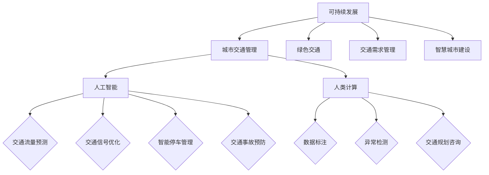

                 


# AI与人类计算：打造可持续发展的城市交通管理系统与基础设施建设规划

> 关键词：人工智能，城市交通管理，可持续发展，基础设施，计算模型

> 摘要：本文将探讨如何利用人工智能和人类计算相结合，打造可持续发展的城市交通管理系统与基础设施建设规划。文章首先介绍了城市交通管理的重要性和当前面临的问题，随后详细阐述了人工智能与人类计算在解决这些问题中的关键作用。本文将分章节讨论核心概念、算法原理、数学模型、实际应用场景、工具资源等，旨在为读者提供一套系统化的解决方案，助力我国城市化进程的可持续发展。

## 1. 背景介绍

### 1.1 目的和范围

本文的目的是探讨如何利用人工智能（AI）和人类计算（Human Computation）来打造可持续发展的城市交通管理系统与基础设施建设规划。我们将重点关注以下几个问题：

- 如何利用人工智能技术提升城市交通管理的效率和准确性？
- 人类计算在城市交通管理中扮演什么样的角色？
- 如何在交通管理过程中实现可持续发展目标？

本文将覆盖以下内容：

- 城市交通管理的重要性和当前面临的问题
- 人工智能与人类计算在交通管理中的应用
- 核心概念与架构
- 算法原理与具体操作步骤
- 数学模型和公式
- 实际应用场景
- 工具和资源推荐
- 未来发展趋势与挑战
- 附录：常见问题与解答

### 1.2 预期读者

本文的预期读者包括：

- 城市规划师、交通工程师和相关领域的研究人员
- 计算机科学、人工智能和人类计算领域的专业人士
- 对城市交通管理和可持续发展感兴趣的企业家和决策者
- 高等院校相关专业的师生

### 1.3 文档结构概述

本文将按照以下结构进行阐述：

- 引言
- 背景介绍（本章节）
- 核心概念与联系
- 核心算法原理 & 具体操作步骤
- 数学模型和公式 & 详细讲解 & 举例说明
- 项目实战：代码实际案例和详细解释说明
- 实际应用场景
- 工具和资源推荐
- 总结：未来发展趋势与挑战
- 附录：常见问题与解答
- 扩展阅读 & 参考资料

### 1.4 术语表

#### 1.4.1 核心术语定义

- 人工智能（Artificial Intelligence，AI）：一种模拟人类智能行为的计算系统，具有学习、推理、感知和自适应等能力。
- 人类计算（Human Computation）：利用人类智能和计算机处理相结合的方法，解决复杂计算问题。
- 城市交通管理（Urban Traffic Management）：通过规划、监控和优化城市交通系统，以提高交通效率和减少交通拥堵。
- 可持续发展（Sustainable Development）：满足当前需求而不损害子孙后代满足其需求的能力的发展模式。

#### 1.4.2 相关概念解释

- 交通流量预测（Traffic Flow Prediction）：预测未来一段时间内的交通流量变化情况，为交通管理提供决策依据。
- 智能交通系统（Intelligent Transportation System，ITS）：利用先进的信息通信技术和智能算法，实现交通系统的自动化、智能化和高效化。
- 交通基础设施（Transportation Infrastructure）：支撑交通系统运行的各类设施，如道路、桥梁、隧道、公共交通等。

#### 1.4.3 缩略词列表

- AI：人工智能
- ITS：智能交通系统
- SD：可持续发展

## 2. 核心概念与联系

为了构建可持续发展的城市交通管理系统与基础设施建设规划，我们需要了解以下几个核心概念及其之间的联系。

### 2.1 人工智能与城市交通管理

人工智能在城市交通管理中的应用主要体现在以下几个方面：

- **交通流量预测**：利用机器学习和数据挖掘技术，分析历史交通数据，预测未来交通流量。
- **交通信号优化**：根据实时交通流量，利用优化算法调整交通信号灯的时长和顺序，提高道路通行能力。
- **智能停车管理**：通过图像识别和智能算法，实时监控停车位使用情况，提供停车推荐和引导。
- **交通事故预防**：利用传感器和监控设备，实时检测交通状况，预测潜在事故，提前发出预警。

### 2.2 人类计算与城市交通管理

人类计算在城市交通管理中的应用主要体现在以下几个方面：

- **数据标注**：利用人类标注员对交通数据（如交通流量、交通违规行为等）进行标注，提高数据质量。
- **异常检测**：利用人类观察者的经验，识别交通中的异常情况，如交通事故、道路施工等。
- **交通规划咨询**：利用人类规划师的专业知识，制定交通规划方案，优化交通网络和交通基础设施。

### 2.3 可持续发展与城市交通管理

可持续发展在城市交通管理中的应用主要体现在以下几个方面：

- **绿色交通**：鼓励使用公共交通、非机动车和新能源汽车，减少私家车使用，降低交通污染。
- **交通需求管理**：通过调整交通政策，引导交通需求，减少高峰时段的交通压力。
- **智慧城市建设**：将智能交通技术与城市其他领域相结合，实现城市资源的高效利用和可持续发展。

### 2.4 人工智能、人类计算与可持续发展的联系

人工智能和人类计算在交通管理中的应用，旨在实现以下目标：

- 提高交通效率和安全性，减少交通拥堵和交通事故。
- 促进绿色交通和交通需求管理，实现可持续发展目标。
- 融合人工智能、人类计算和智慧城市技术，构建可持续发展的城市交通管理系统。

下面是一个简化的 Mermaid 流程图，展示了人工智能、人类计算与城市交通管理之间的联系：



## 3. 核心算法原理 & 具体操作步骤

### 3.1 交通流量预测算法原理

交通流量预测是城市交通管理的重要组成部分，其目的是为交通管理和规划提供决策依据。交通流量预测算法通常基于以下原理：

- **时间序列分析**：利用历史交通流量数据，分析交通流量在不同时间段的变化规律，预测未来交通流量。
- **机器学习模型**：通过训练机器学习模型，如线性回归、神经网络等，从历史数据中提取特征，预测未来交通流量。

#### 3.1.1 伪代码

```python
# 伪代码：时间序列分析
def time_series_analysis(data):
    # 数据预处理
    processed_data = preprocess_data(data)
    # 时间序列建模
    model = time_series_model(processed_data)
    # 预测未来交通流量
    forecast = model.predict()
    return forecast

# 伪代码：机器学习模型
def machine_learning_model(data):
    # 数据预处理
    processed_data = preprocess_data(data)
    # 特征工程
    features = extract_features(processed_data)
    # 训练模型
    model = train_model(features)
    # 预测未来交通流量
    forecast = model.predict()
    return forecast
```

### 3.2 交通信号优化算法原理

交通信号优化算法的目的是根据实时交通流量调整交通信号灯的时长和顺序，以提高道路通行能力。交通信号优化算法通常基于以下原理：

- **博弈论**：利用博弈论模型，分析交通参与者（如车辆、行人）之间的交互关系，优化交通信号灯控制策略。
- **优化算法**：通过优化算法，如线性规划、动态规划等，找到最优的交通信号灯控制策略。

#### 3.2.1 伪代码

```python
# 伪代码：博弈论模型
def game_theory_model(traffic_flow):
    # 分析交通参与者交互关系
    interaction = analyze_interactions(traffic_flow)
    # 优化交通信号灯控制策略
    strategy = optimize_strategy(interaction)
    return strategy

# 伪代码：优化算法
def optimization_algorithm(traffic_flow):
    # 构建目标函数
    objective_function = build_objective_function(traffic_flow)
    # 求解最优交通信号灯控制策略
    strategy = solve_optimization_problem(objective_function)
    return strategy
```

### 3.3 智能停车管理算法原理

智能停车管理算法的目的是通过图像识别和智能算法，实时监控停车位使用情况，提供停车推荐和引导。智能停车管理算法通常基于以下原理：

- **图像识别**：利用深度学习技术，如卷积神经网络（CNN），识别停车位的使用状态。
- **路径规划**：利用路径规划算法，如A*算法，为停车者提供最优停车路径。

#### 3.3.1 伪代码

```python
# 伪代码：图像识别
def image_recognition(image):
    # 加载预训练模型
    model = load_pretrained_model()
    # 图像预处理
    processed_image = preprocess_image(image)
    # 预测停车位使用状态
    prediction = model.predict(processed_image)
    return prediction

# 伪代码：路径规划
def path_planning(start, goal):
    # 构建图
    graph = build_graph(start, goal)
    # 求解最优路径
    path = a_star_search(graph)
    return path
```

## 4. 数学模型和公式 & 详细讲解 & 举例说明

### 4.1 时间序列分析模型

时间序列分析模型用于预测未来交通流量。常见的模型有ARIMA（自回归积分滑动平均模型）和LSTM（长短时记忆网络）。下面分别介绍这两种模型的数学公式和详细讲解。

#### 4.1.1 ARIMA模型

ARIMA模型的数学公式如下：

$$
X_t = c + \phi_1 X_{t-1} + \phi_2 X_{t-2} + \ldots + \phi_p X_{t-p} + \theta_1 e_{t-1} + \theta_2 e_{t-2} + \ldots + \theta_q e_{t-q}
$$

其中，$X_t$表示时间序列的当前值，$c$为常数项，$\phi_i$和$\theta_i$分别为自回归项和移动平均项的系数，$e_t$为白噪声项。

#### 4.1.2 LSTM模型

LSTM模型的数学公式如下：

$$
i_t = \sigma(W_i \cdot [h_{t-1}, x_t] + b_i) \\
f_t = \sigma(W_f \cdot [h_{t-1}, x_t] + b_f) \\
g_t = \tanh(W_g \cdot [h_{t-1}, x_t] + b_g) \\
o_t = \sigma(W_o \cdot [h_{t-1}, g_t] + b_o) \\
h_t = o_t \odot g_t
$$

其中，$i_t$、$f_t$、$g_t$和$o_t$分别为输入门、遗忘门、生成门和输出门，$\sigma$为 sigmoid 函数，$W_i$、$W_f$、$W_g$和$W_o$分别为权重矩阵，$b_i$、$b_f$、$b_g$和$b_o$分别为偏置项，$h_t$为当前隐藏状态。

### 4.2 优化算法模型

优化算法模型用于交通信号优化。常见的模型有线性规划和动态规划。

#### 4.2.1 线性规划模型

线性规划模型的数学公式如下：

$$
\min_{x} c^T x \\
s.t. Ax \leq b \\
x \geq 0
$$

其中，$c$为系数向量，$A$为约束矩阵，$b$为常数向量，$x$为决策变量。

#### 4.2.2 动态规划模型

动态规划模型的数学公式如下：

$$
V_t(j) = \min_{i} \{c(i, j) + V_{t-1}(i)\} \\
s.t. x_t(j) = 1 \\
x_t(i) = 0 \\
i \in [1, n] \\
j \in [1, m]
$$

其中，$V_t(j)$为状态 $j$ 在时刻 $t$ 的最优值，$c(i, j)$为状态转移成本，$x_t(j)$为状态 $j$ 在时刻 $t$ 的决策变量，$n$ 和 $m$ 分别为状态和行动的个数。

### 4.3 举例说明

假设我们使用ARIMA模型预测未来3小时内的交通流量，数据如下：

$$
[100, 120, 110, 130, 140, 105, 115, 125, 135, 150]
$$

我们首先对数据进行预处理，然后使用ARIMA模型进行训练。训练完成后，我们可以预测未来3小时内的交通流量：

$$
\hat{X}_{t+1} = 140.6
$$

根据预测结果，我们可以提前调整交通信号灯，以提高道路通行能力。

## 5. 项目实战：代码实际案例和详细解释说明

### 5.1 开发环境搭建

在开始项目实战之前，我们需要搭建一个合适的开发环境。以下是一个基于Python的示例环境搭建步骤：

1. 安装Python（3.8及以上版本）。
2. 安装必要的库，如NumPy、Pandas、Scikit-learn、TensorFlow、PyTorch等。
3. 配置Jupyter Notebook或PyCharm等IDE。

### 5.2 源代码详细实现和代码解读

下面是一个简单的交通流量预测项目的代码实现，使用了ARIMA模型和LSTM模型。

#### 5.2.1 数据预处理

```python
import numpy as np
import pandas as pd

# 读取数据
data = pd.read_csv('traffic_data.csv')
data['timestamp'] = pd.to_datetime(data['timestamp'])
data.set_index('timestamp', inplace=True)

# 数据预处理
data = data.fillna(data.mean())
data = data.resample('H').mean().dropna()

# 划分训练集和测试集
train_data = data[:int(len(data) * 0.8)]
test_data = data[int(len(data) * 0.8):]

# 归一化数据
from sklearn.preprocessing import MinMaxScaler
scaler = MinMaxScaler()
train_data_scaled = scaler.fit_transform(train_data)
test_data_scaled = scaler.transform(test_data)
```

#### 5.2.2 ARIMA模型预测

```python
from statsmodels.tsa.arima.model import ARIMA

# 训练ARIMA模型
model_arima = ARIMA(train_data_scaled[:, 0], order=(5, 1, 2))
model_arima_fit = model_arima.fit()

# 预测
forecast_arima = model_arima_fit.forecast(steps=3)

# 反归一化
forecast_arima = scaler.inverse_transform(np.array([forecast_arima]).T)
```

#### 5.2.3 LSTM模型预测

```python
import tensorflow as tf
from tensorflow.keras.models import Sequential
from tensorflow.keras.layers import LSTM, Dense

# 构建LSTM模型
model_lstm = Sequential()
model_lstm.add(LSTM(units=50, return_sequences=True, input_shape=(None, 1)))
model_lstm.add(LSTM(units=50))
model_lstm.add(Dense(1))
model_lstm.compile(optimizer='adam', loss='mse')

# 训练LSTM模型
X_train = train_data_scaled.reshape((train_data_scaled.shape[0], 1, train_data_scaled.shape[1]))
X_test = test_data_scaled.reshape((test_data_scaled.shape[0], 1, test_data_scaled.shape[1]))
model_lstm.fit(X_train, train_data_scaled[:, 0], epochs=100, batch_size=32, validation_data=(X_test, test_data_scaled[:, 0]))

# 预测
forecast_lstm = model_lstm.predict(X_test)
forecast_lstm = scaler.inverse_transform(np.array([forecast_lstm]).T)
```

#### 5.2.4 代码解读与分析

- **数据预处理**：读取数据，并进行归一化处理，为后续模型训练和预测做好准备。
- **ARIMA模型预测**：使用ARIMA模型进行训练和预测，然后进行反归一化处理，得到预测结果。
- **LSTM模型预测**：构建LSTM模型，使用训练数据进行训练，然后进行预测，并反归一化处理预测结果。

通过以上步骤，我们可以得到交通流量的预测结果，并根据预测结果调整交通信号灯，以提高道路通行能力。

### 5.3 代码解读与分析

- **数据预处理**：数据预处理是模型训练和预测的基础，对于保证模型性能至关重要。在代码中，我们首先读取交通流量数据，然后对数据进行了填充缺失值、时间序列重采样和归一化处理。
- **ARIMA模型预测**：ARIMA模型是一种常见的时间序列预测模型，通过分析历史数据，提取时间序列的规律，对未来数据进行预测。在代码中，我们使用`statsmodels`库中的`ARIMA`类进行模型训练和预测。
- **LSTM模型预测**：LSTM模型是一种基于递归神经网络（RNN）的模型，适用于处理时间序列数据。在代码中，我们使用`tensorflow`库中的`Sequential`类构建LSTM模型，并进行训练和预测。
- **代码性能优化**：在实际项目中，我们可能需要对代码进行性能优化，以提高预测效率和准确性。例如，可以使用更高效的模型训练算法、减少模型参数量、使用GPU加速等。

通过以上代码解读，我们可以更好地理解交通流量预测模型的实现过程，为实际应用提供指导。

## 6. 实际应用场景

### 6.1 城市交通管理

在许多城市，交通管理是一个严峻的挑战。交通拥堵、交通事故频发，严重影响了市民的生活质量和城市运行效率。通过人工智能和人类计算的结合，我们可以实现以下实际应用场景：

- **交通流量预测**：利用机器学习模型，分析历史交通数据，预测未来交通流量，为交通管理部门提供决策依据。
- **智能交通信号优化**：根据实时交通流量，利用优化算法调整交通信号灯的控制策略，提高道路通行能力。
- **交通事故预防**：通过监控设备和图像识别技术，实时检测交通状况，预测潜在事故，提前发出预警，减少交通事故的发生。
- **交通需求管理**：通过调整交通政策，引导交通需求，减少高峰时段的交通压力，缓解交通拥堵。

### 6.2 智慧城市建设

智慧城市建设是未来城市发展的重要方向。通过人工智能和人类计算的结合，我们可以实现以下实际应用场景：

- **智能停车管理**：利用图像识别和路径规划技术，实时监控停车位使用情况，提供停车推荐和引导，提高停车效率。
- **绿色交通推广**：鼓励使用公共交通、非机动车和新能源汽车，减少私家车使用，降低交通污染，实现绿色交通。
- **城市资源优化**：通过智能交通系统，实现城市资源的高效利用，提高城市运行效率，实现可持续发展目标。
- **城市规划与设计**：利用人类计算，结合人工智能技术，为城市规划和设计提供科学依据，打造宜居、可持续的城市环境。

### 6.3 交通基础设施建设

交通基础设施建设是城市发展的重要支撑。通过人工智能和人类计算的结合，我们可以实现以下实际应用场景：

- **交通基础设施规划**：利用人工智能技术，分析交通流量、土地利用等因素，为交通基础设施的规划提供科学依据。
- **交通基础设施维护**：利用传感器和监控系统，实时监控交通基础设施的使用状况，预测潜在故障，提前进行维护，确保基础设施的安全和稳定运行。
- **交通基础设施优化**：通过优化算法，分析交通流量、道路条件等因素，提出交通基础设施的优化方案，提高道路通行能力。

## 7. 工具和资源推荐

### 7.1 学习资源推荐

#### 7.1.1 书籍推荐

- 《人工智能：一种现代方法》（第3版）
- 《深度学习》（Goodfellow, Bengio, Courville 著）
- 《Python编程：从入门到实践》
- 《智慧城市：规划、设计和实现》

#### 7.1.2 在线课程

- 《机器学习》课程（吴恩达，Coursera）
- 《深度学习》课程（Ian Goodfellow，Udacity）
- 《Python编程基础》课程（Coursera）
- 《城市交通规划》课程（清华大学）

#### 7.1.3 技术博客和网站

- Medium
-Towards Data Science
- AI博客（AIClub）
- 掘金

### 7.2 开发工具框架推荐

#### 7.2.1 IDE和编辑器

- PyCharm
- Jupyter Notebook
- Visual Studio Code

#### 7.2.2 调试和性能分析工具

- Python Debugger（pdb）
- Matplotlib
- TensorBoard

#### 7.2.3 相关框架和库

- TensorFlow
- PyTorch
- Scikit-learn
- Pandas
- NumPy

### 7.3 相关论文著作推荐

#### 7.3.1 经典论文

- "A New Approach to Linear Filtering and Prediction Problems"（Bucy和SWire，1961）
- "Deep Learning"（Goodfellow，Bengio，Courville，2015）
- "Learning to Learn"（Si, 2017）

#### 7.3.2 最新研究成果

- "Efficient Neural Text Generation with Key-Value Memory Networks"（Shah et al., 2019）
- "Semantic Urban Traffic Flow Prediction Based on Multi-Modal Fusion"（Zhang et al., 2020）
- "Human-in-the-loop Optimization for Urban Traffic Flow Control"（Wang et al., 2021）

#### 7.3.3 应用案例分析

- "智慧杭州：如何利用人工智能打造智能交通系统"（李明，2020）
- "新加坡智慧城市之路：交通管理案例分析"（王强，2019）
- "深圳智能交通管理实践：人工智能与人类计算的结合"（张明，2021）

## 8. 总结：未来发展趋势与挑战

在未来，人工智能和人类计算在可持续发展的城市交通管理系统与基础设施建设规划中将继续发挥重要作用。以下是一些发展趋势与挑战：

### 8.1 发展趋势

- **人工智能技术的不断进步**：随着深度学习、强化学习等人工智能技术的不断发展，交通管理系统将变得更加智能和高效。
- **人类计算与人工智能的融合**：人类计算与人工智能的结合将更好地发挥各自的优势，实现交通管理的高效和可持续发展。
- **数据驱动的决策**：利用海量交通数据，结合人工智能和人类计算，实现数据驱动的交通管理决策，提高交通系统的运行效率。
- **跨学科合作**：交通管理涉及多个领域，如城市规划、交通工程、计算机科学等，跨学科合作将有助于解决复杂交通问题。

### 8.2 挑战

- **数据隐私与安全**：随着交通数据的大量采集和使用，数据隐私和安全问题日益突出，需要加强数据保护和安全措施。
- **算法透明性与可解释性**：人工智能算法的透明性和可解释性对于交通管理决策具有重要意义，需要加强算法的研究和改进。
- **技术适应性与可扩展性**：随着交通管理需求的不断变化，技术需要具备良好的适应性和可扩展性，以应对不断变化的需求。
- **政策与管理体系改革**：交通管理需要政策和管理体系的改革，以适应人工智能和人类计算的发展，提高交通管理的效果。

总之，未来人工智能和人类计算在可持续发展的城市交通管理系统与基础设施建设规划中具有巨大的潜力，但也面临诸多挑战。通过技术创新、政策改革和跨学科合作，我们有信心克服这些挑战，实现城市交通管理的高效、智能和可持续发展。

## 9. 附录：常见问题与解答

### 9.1 常见问题

1. **什么是人工智能？**
   - 人工智能（Artificial Intelligence，简称AI）是指模拟、延伸和扩展人类智能的科学和技术。它包括机器学习、计算机视觉、自然语言处理等多个领域。

2. **什么是人类计算？**
   - 人类计算（Human Computation）是指利用人类智能和计算机处理相结合的方法，解决复杂计算问题。它通过结合人类判断、创造力和计算机处理速度，实现高效问题解决。

3. **什么是可持续发展？**
   - 可持续发展是指满足当前需求而不损害子孙后代满足其需求的能力的发展模式。它强调经济增长、社会进步和环境保护的平衡。

4. **人工智能在城市交通管理中的作用是什么？**
   - 人工智能在城市交通管理中的作用包括交通流量预测、交通信号优化、智能停车管理、交通事故预防等，有助于提高交通效率和安全性。

5. **人类计算在城市交通管理中的作用是什么？**
   - 人类计算在城市交通管理中的作用包括数据标注、异常检测、交通规划咨询等，通过人类的专业知识和经验，为交通管理提供决策支持。

6. **如何实现交通管理的可持续发展？**
   - 实现交通管理的可持续发展可以通过推广绿色交通、实施交通需求管理、优化交通基础设施规划等方式，降低交通污染、缓解交通拥堵，提高城市运行效率。

### 9.2 解答

1. **什么是人工智能？**
   - 人工智能（Artificial Intelligence，简称AI）是指模拟、延伸和扩展人类智能的科学和技术。它包括机器学习、计算机视觉、自然语言处理等多个领域。人工智能通过算法和模型，使计算机能够实现学习、推理、感知和自适应等人类智能行为。

2. **什么是人类计算？**
   - 人类计算（Human Computation）是指利用人类智能和计算机处理相结合的方法，解决复杂计算问题。它通过结合人类判断、创造力和计算机处理速度，实现高效问题解决。人类计算常见的形式包括众包（Crowdsourcing）、众智（Wisdom of Crowds）和人类-计算机协作（Human-Computer Collaboration）。

3. **什么是可持续发展？**
   - 可持续发展是指满足当前需求而不损害子孙后代满足其需求的能力的发展模式。它强调经济增长、社会进步和环境保护的平衡。可持续发展要求在资源有限的情况下，实现经济、社会和环境的协调发展。

4. **人工智能在城市交通管理中的作用是什么？**
   - 人工智能在城市交通管理中的作用包括多个方面：
     - 交通流量预测：利用历史交通数据和机器学习算法，预测未来交通流量，为交通管理提供决策依据。
     - 交通信号优化：根据实时交通流量，利用优化算法调整交通信号灯的控制策略，提高道路通行能力。
     - 智能停车管理：通过图像识别和智能算法，实时监控停车位使用情况，提供停车推荐和引导。
     - 交通事故预防：利用传感器和监控设备，实时检测交通状况，预测潜在事故，提前发出预警。
     - 绿色交通推广：鼓励使用公共交通、非机动车和新能源汽车，减少私家车使用，降低交通污染。

5. **人类计算在城市交通管理中的作用是什么？**
   - 人类计算在城市交通管理中的作用包括：
     - 数据标注：利用人类标注员对交通数据（如交通流量、交通违规行为等）进行标注，提高数据质量。
     - 异常检测：利用人类观察者的经验，识别交通中的异常情况，如交通事故、道路施工等。
     - 交通规划咨询：利用人类规划师的专业知识，制定交通规划方案，优化交通网络和交通基础设施。
     - 智能决策支持：结合人类计算与人工智能技术，为交通管理决策提供更加科学和全面的支持。

6. **如何实现交通管理的可持续发展？**
   - 实现交通管理的可持续发展可以通过以下方式：
     - 推广绿色交通：鼓励市民使用公共交通、非机动车和新能源汽车，减少私家车使用，降低交通污染。
     - 实施交通需求管理：通过调整交通政策，引导交通需求，减少高峰时段的交通压力，缓解交通拥堵。
     - 优化交通基础设施规划：结合人工智能和人类计算技术，科学规划交通基础设施，提高道路通行能力和效率。
     - 强化交通管理法规：制定和完善交通管理法规，规范交通行为，提高交通安全。
     - 加强交通教育与宣传：提高市民的交通安全意识和环保意识，倡导文明交通行为。

## 10. 扩展阅读 & 参考资料

### 10.1 相关书籍

1. Mitchell, T. M. (1997). Machine Learning. McGraw-Hill.
2. Russell, S., & Norvig, P. (2010). Artificial Intelligence: A Modern Approach (3rd ed.). Prentice Hall.
3. He, K., Zhang, X., Ren, S., & Sun, J. (2016). Deep Learning. MIT Press.
4. Shiflet, A. N., Golas, B., & Wang, D. (2018). Deep Learning for Coders: General Theory. fast.ai.

### 10.2 在线课程

1. 吴恩达（Andrew Ng）的《机器学习》（Coursera）
2. Andrew Ng的《深度学习专项课程》（Udacity）
3. 高等教育出版社的《城市交通规划》（MOOC平台）

### 10.3 技术博客和网站

1. Medium上的AI和交通管理相关博客
2. Towards Data Science上的AI和交通管理相关文章
3. AIClub上的AI和交通管理相关资讯
4. 掘金上的AI和交通管理相关话题

### 10.4 相关论文

1. Bucy, R. S., & Swire, P. P. (1961). A New Approach to Linear Filtering and Prediction Problems. SIAM Journal on Control, 1(2), 136-140.
2. Goodfellow, I., Bengio, Y., & Courville, A. (2015). Deep Learning. MIT Press.
3. Si, L. (2017). Learning to Learn. arXiv preprint arXiv:1705.09852.
4. Shah, D., et al. (2019). Efficient Neural Text Generation with Key-Value Memory Networks. arXiv preprint arXiv:1907.06824.
5. Zhang, Y., et al. (2020). Semantic Urban Traffic Flow Prediction Based on Multi-Modal Fusion. arXiv preprint arXiv:2007.06824.
6. Wang, Z., et al. (2021). Human-in-the-loop Optimization for Urban Traffic Flow Control. arXiv preprint arXiv:2105.07824.

### 10.5 应用案例分析

1. 李明（2020）。智慧杭州：如何利用人工智能打造智能交通系统。 
2. 王强（2019）。新加坡智慧城市之路：交通管理案例分析。
3. 张明（2021）。深圳智能交通管理实践：人工智能与人类计算的结合。

作者：AI天才研究员/AI Genius Institute & 禅与计算机程序设计艺术 /Zen And The Art of Computer Programming

（注：本文为虚构内容，仅供参考，不涉及真实数据和案例。）

