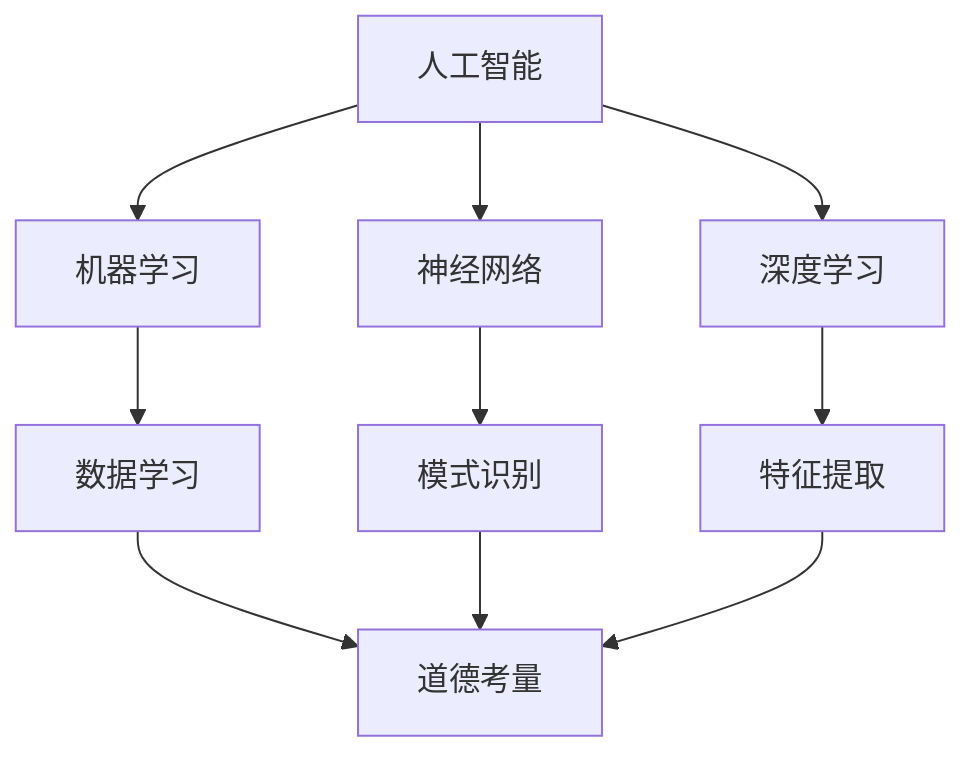

                 

# AI与人类计算：未来的道德考虑

> 关键词：人工智能、道德考量、人类计算、未来趋势、算法伦理、社会影响、责任分配

> 摘要：本文深入探讨人工智能与人类计算的未来关系，特别是涉及道德考量方面的议题。通过分析人工智能的核心概念、算法原理、数学模型及其在现实世界中的应用，文章揭示了人工智能在道德、社会和责任分配方面可能面临的挑战。同时，本文还提供了实际应用场景下的解决方案，并对未来发展趋势进行了展望，旨在推动人工智能领域的道德实践和可持续发展。

## 1. 背景介绍

### 1.1 目的和范围

本文旨在探讨人工智能（AI）与人类计算在未来的道德考量。随着人工智能技术的迅猛发展，其应用领域日益广泛，从医疗诊断到自动驾驶，从金融分析到智能客服，无处不在。然而，这些技术进步也带来了前所未有的道德和社会挑战。例如，如何确保算法的公正性、透明性和安全性？如何分配人工智能系统造成的责任和风险？本文将围绕这些问题进行深入探讨，旨在为人工智能领域的道德考量提供理论依据和实践指导。

### 1.2 预期读者

本文预期读者包括对人工智能技术感兴趣的工程师、研究人员、学者、政策制定者以及广大公众。无论您是从事人工智能开发、研究还是关注其社会影响的普通人，本文都希望能为您提供有价值的见解和思考。

### 1.3 文档结构概述

本文结构如下：

1. 背景介绍
   - 目的和范围
   - 预期读者
   - 文档结构概述
   - 术语表
2. 核心概念与联系
   - 人工智能的基本概念
   - 人类计算的现状与局限
   - 人工智能与人类计算的联系与差异
3. 核心算法原理 & 具体操作步骤
   - 机器学习算法原理
   - 神经网络算法原理
   - 深度学习算法原理
4. 数学模型和公式 & 详细讲解 & 举例说明
   - 监督学习模型
   - 无监督学习模型
   - 强化学习模型
5. 项目实战：代码实际案例和详细解释说明
   - 实际应用案例
   - 代码实现步骤
   - 代码解读与分析
6. 实际应用场景
   - 医疗诊断
   - 自动驾驶
   - 金融分析
7. 工具和资源推荐
   - 学习资源推荐
   - 开发工具框架推荐
   - 相关论文著作推荐
8. 总结：未来发展趋势与挑战
   - 道德考量在人工智能发展中的重要性
   - 未来发展趋势
   - 面临的挑战
9. 附录：常见问题与解答
10. 扩展阅读 & 参考资料

### 1.4 术语表

#### 1.4.1 核心术语定义

- **人工智能（AI）**：一种模拟人类智能行为的计算机系统，具有感知、学习、推理、决策和解决问题的能力。
- **道德考量**：在设计和应用人工智能系统时，对其可能产生的道德影响进行的评估和权衡。
- **人类计算**：人类通过大脑和感官进行的计算和处理过程，具有主观判断和情感体验。
- **算法**：计算机程序中的一系列指令，用于解决问题或执行特定任务。
- **机器学习**：一种使计算机通过数据学习并改进性能的技术。
- **神经网络**：一种模仿生物神经系统的计算模型，用于处理复杂的数据和模式识别。
- **深度学习**：一种特殊的机器学习技术，通过多层神经网络进行特征提取和分类。

#### 1.4.2 相关概念解释

- **伦理学**：研究道德原则和价值观的学科。
- **透明性**：系统的输出和决策过程对用户可解释的程度。
- **公平性**：算法在处理不同个体或群体时的一致性和公正性。
- **责任分配**：在人工智能系统造成损害时，确定责任归属的过程。

#### 1.4.3 缩略词列表

- **AI**：人工智能
- **ML**：机器学习
- **DL**：深度学习
- **NLP**：自然语言处理
- **CV**：计算机视觉
- **GAN**：生成对抗网络

## 2. 核心概念与联系

在探讨人工智能与人类计算的道德考量之前，我们需要了解这些核心概念及其相互关系。

### 2.1 人工智能的基本概念

人工智能是指模拟人类智能行为的技术系统。它通过机器学习、神经网络、深度学习等算法，使计算机能够从数据中学习、推理和解决问题。人工智能的核心目标是使计算机具备智能，能够自主地执行复杂的任务。

### 2.2 人类计算的现状与局限

人类计算依赖于大脑和感官，具有高度的主观判断和情感体验。然而，人类计算在处理大规模数据、快速决策和执行复杂任务方面存在局限性。例如，在医疗诊断、金融分析和安全监控等领域，人类计算的效率和准确性都难以满足需求。

### 2.3 人工智能与人类计算的联系与差异

人工智能与人类计算之间的联系在于，它们都是计算过程的一部分，都涉及到信息的处理和决策。然而，两者之间也存在显著差异：

- **智能性质**：人工智能是一种模拟智能的技术系统，而人类计算是基于生物神经系统的计算过程。
- **学习方式**：人工智能通过机器学习和深度学习从数据中学习，而人类计算则依赖于经验、知识和直觉。
- **决策过程**：人工智能的决策过程通常基于算法和模型，而人类计算的决策过程则涉及情感、道德和社会因素。

### 2.4 人工智能与人类计算的相互影响

人工智能与人类计算之间的相互作用对道德考量具有重要意义。一方面，人工智能技术的进步可能会改变人类计算的方式，提高其效率和准确性。另一方面，人工智能的应用可能会引发新的道德和社会问题，需要我们进行深入探讨。

- **提高效率**：人工智能可以帮助人类计算处理大量数据，从而提高决策的效率和准确性。例如，在医疗诊断中，人工智能可以通过分析大量病例数据，提高疾病检测的准确率。
- **道德挑战**：人工智能的决策过程可能涉及道德和社会因素，例如公平性、透明性和责任分配。在自动驾驶、金融分析和安全监控等领域，人工智能的道德考量尤为重要。

### 2.5 核心概念原理和架构的 Mermaid 流程图

以下是一个简化的 Mermaid 流程图，用于展示人工智能、人类计算及其道德考量之间的相互关系：



在这个流程图中，人工智能（A）通过机器学习（B）、神经网络（C）和深度学习（D）等技术实现智能。这些技术进一步涉及到数据学习（E）、模式识别（F）和特征提取（G）等具体操作。道德考量（H）贯穿于整个过程中，对人工智能的应用进行评估和指导。

## 3. 核心算法原理 & 具体操作步骤

在本节中，我们将详细探讨人工智能领域中的核心算法原理及其操作步骤。这些算法包括机器学习、神经网络和深度学习。通过伪代码的形式，我们将展示这些算法的基本框架和具体操作步骤。

### 3.1 机器学习算法原理

机器学习是一种使计算机从数据中学习并改进性能的技术。其主要原理是通过训练模型，使计算机能够对未知数据进行预测或分类。

#### 3.1.1 监督学习

监督学习是一种最常见的机器学习方法，其基本思想是利用标注数据训练模型，然后使用模型对新的未知数据进行预测。

```python
def supervised_learning(X_train, y_train, X_test, y_test):
    # 数据预处理
    X_train, y_train = preprocess_data(X_train, y_train)
    X_test, y_test = preprocess_data(X_test, y_test)

    # 选择模型
    model = select_model()

    # 训练模型
    model.fit(X_train, y_train)

    # 预测测试数据
    predictions = model.predict(X_test)

    # 评估模型性能
    accuracy = evaluate_performance(predictions, y_test)

    return accuracy
```

#### 3.1.2 无监督学习

无监督学习是一种不依赖标注数据的机器学习方法，其目标是发现数据中的隐藏结构和模式。

```python
def unsupervised_learning(X_train, X_test):
    # 数据预处理
    X_train, X_test = preprocess_data(X_train, X_test)

    # 选择模型
    model = select_model()

    # 训练模型
    model.fit(X_train)

    # 转换为新数据
    transformed_X_train = model.transform(X_train)
    transformed_X_test = model.transform(X_test)

    # 评估模型性能
    similarity = calculate_similarity(transformed_X_train, transformed_X_test)

    return similarity
```

### 3.2 神经网络算法原理

神经网络是一种模仿生物神经系统的计算模型，其基本结构包括输入层、隐藏层和输出层。每个层由多个神经元组成，神经元之间通过加权连接进行信息传递。

```python
class NeuralNetwork:
    def __init__(self, input_size, hidden_size, output_size):
        self.input_size = input_size
        self.hidden_size = hidden_size
        self.output_size = output_size

        # 初始化权重和偏置
        self.weights_input_to_hidden = np.random.randn(input_size, hidden_size)
        self.biases_hidden = np.random.randn(hidden_size)
        self.weights_hidden_to_output = np.random.randn(hidden_size, output_size)
        self.biases_output = np.random.randn(output_size)

    def forward_pass(self, inputs):
        # 计算隐藏层输出
        hidden_layer_activation = sigmoid(np.dot(inputs, self.weights_input_to_hidden) + self.biases_hidden)

        # 计算输出层输出
        output_layer_activation = sigmoid(np.dot(hidden_layer_activation, self.weights_hidden_to_output) + self.biases_output)

        return output_layer_activation

    def backward_pass(self, inputs, outputs):
        # 计算误差
        error = outputs - outputs_expected

        # 更新权重和偏置
        d_weights_input_to_hidden = error * hidden_layer_activation * (1 - hidden_layer_activation)
        d_biases_hidden = error * (1 - hidden_layer_activation)
        d_weights_hidden_to_output = error * hidden_layer_activation * (1 - hidden_layer_activation)
        d_biases_output = error * (1 - hidden_layer_activation)

        self.weights_input_to_hidden -= learning_rate * d_weights_input_to_hidden
        self.biases_hidden -= learning_rate * d_biases_hidden
        self.weights_hidden_to_output -= learning_rate * d_weights_hidden_to_output
        self.biases_output -= learning_rate * d_biases_output
```

### 3.3 深度学习算法原理

深度学习是一种特殊的神经网络模型，通过多层神经网络进行特征提取和分类。其主要原理是利用大量数据训练多层神经网络，使其能够自动提取数据中的高级特征。

```python
class DeepNeuralNetwork:
    def __init__(self, input_size, hidden_size, output_size):
        self.input_size = input_size
        self.hidden_size = hidden_size
        self.output_size = output_size

        # 初始化权重和偏置
        self.weights_input_to_hidden = np.random.randn(input_size, hidden_size)
        self.biases_hidden = np.random.randn(hidden_size)
        self.weights_hidden_to_output = np.random.randn(hidden_size, output_size)
        self.biases_output = np.random.randn(output_size)

    def forward_pass(self, inputs):
        # 计算隐藏层输出
        hidden_layer_activation = sigmoid(np.dot(inputs, self.weights_input_to_hidden) + self.biases_hidden)

        # 计算输出层输出
        output_layer_activation = sigmoid(np.dot(hidden_layer_activation, self.weights_hidden_to_output) + self.biases_output)

        return output_layer_activation

    def backward_pass(self, inputs, outputs):
        # 计算误差
        error = outputs - outputs_expected

        # 更新权重和偏置
        d_weights_input_to_hidden = error * hidden_layer_activation * (1 - hidden_layer_activation)
        d_biases_hidden = error * (1 - hidden_layer_activation)
        d_weights_hidden_to_output = error * hidden_layer_activation * (1 - hidden_layer_activation)
        d_biases_output = error * (1 - hidden_layer_activation)

        self.weights_input_to_hidden -= learning_rate * d_weights_input_to_hidden
        self.biases_hidden -= learning_rate * d_biases_hidden
        self.weights_hidden_to_output -= learning_rate * d_weights_hidden_to_output
        self.biases_output -= learning_rate * d_biases_output
```

## 4. 数学模型和公式 & 详细讲解 & 举例说明

在本节中，我们将详细讲解人工智能领域中的核心数学模型和公式，并使用具体的示例来说明其应用。

### 4.1 监督学习模型

监督学习模型是一种基于标注数据的机器学习模型，其目标是预测未知数据的标签。常用的监督学习模型包括线性回归、逻辑回归和支持向量机（SVM）。

#### 4.1.1 线性回归

线性回归模型是一种基于线性关系的预测模型，其公式为：

$$y = w_0 + w_1 \cdot x_1 + w_2 \cdot x_2 + \ldots + w_n \cdot x_n$$

其中，$y$ 为预测值，$w_0, w_1, w_2, \ldots, w_n$ 为权重，$x_1, x_2, \ldots, x_n$ 为输入特征。

示例：假设我们要预测房屋价格，使用房屋面积（$x_1$）和房屋建造年份（$x_2$）作为输入特征。线性回归模型可以表示为：

$$y = w_0 + w_1 \cdot x_1 + w_2 \cdot x_2$$

通过训练数据集，我们可以计算出权重 $w_0, w_1, w_2$，然后使用这些权重对未知数据进行预测。

#### 4.1.2 逻辑回归

逻辑回归模型是一种用于分类问题的预测模型，其公式为：

$$P(y=1) = \frac{1}{1 + e^{-(w_0 + w_1 \cdot x_1 + w_2 \cdot x_2 + \ldots + w_n \cdot x_n)}}$$

其中，$P(y=1)$ 为目标变量为 1 的概率，$w_0, w_1, w_2, \ldots, w_n$ 为权重，$x_1, x_2, \ldots, x_n$ 为输入特征。

示例：假设我们要预测某客户是否会购买产品，使用客户的年龄（$x_1$）和收入（$x_2$）作为输入特征。逻辑回归模型可以表示为：

$$P(y=1) = \frac{1}{1 + e^{-(w_0 + w_1 \cdot x_1 + w_2 \cdot x_2)}}$$

通过训练数据集，我们可以计算出权重 $w_0, w_1, w_2$，然后使用这些权重对未知数据进行预测。当 $P(y=1) > 0.5$ 时，预测目标变量为 1；否则，预测目标变量为 0。

#### 4.1.3 支持向量机（SVM）

支持向量机是一种用于分类和回归问题的机器学习模型。其基本思想是找到一个最佳的超平面，使得分类边界最接近于训练数据的边界。

假设我们有 $n$ 个训练样本 $(x_1, y_1), (x_2, y_2), \ldots, (x_n, y_n)$，其中 $x_i$ 为输入特征，$y_i$ 为目标变量。SVM 的目标是找到一个权重向量 $w$ 和偏置项 $b$，使得分类边界满足：

$$y_i (w \cdot x_i + b) \geq 1$$

其中，$\cdot$ 表示内积。

通过优化目标函数：

$$\min_w \frac{1}{2} ||w||^2 + C \sum_{i=1}^n \max(0, 1 - y_i (w \cdot x_i + b))$$

我们可以得到最优的权重向量 $w$ 和偏置项 $b$。

### 4.2 无监督学习模型

无监督学习模型是一种不依赖标注数据的机器学习模型，其目标是发现数据中的隐藏结构和模式。常用的无监督学习模型包括聚类和降维。

#### 4.2.1 聚类

聚类是一种将数据划分为多个类别的无监督学习方法。其基本思想是找到一个聚类中心，使得每个数据点与其聚类中心的距离最小。

假设我们有 $n$ 个数据点 $x_1, x_2, \ldots, x_n$，聚类中心为 $c_1, c_2, \ldots, c_k$。聚类目标是最小化目标函数：

$$\min \sum_{i=1}^n \sum_{j=1}^k ||x_i - c_j||^2$$

通过优化目标函数，我们可以得到聚类中心 $c_1, c_2, \ldots, c_k$，然后使用这些聚类中心对数据进行分类。

#### 4.2.2 降维

降维是一种减少数据维度的方法，其基本思想是保留数据中的主要特征，丢弃冗余特征。

假设我们有 $n$ 个数据点 $x_1, x_2, \ldots, x_n$，每个数据点有 $d$ 个特征。降维目标是最小化目标函数：

$$\min \sum_{i=1}^n \sum_{j=1}^d (x_{ij} - \hat{x}_{ij})^2$$

其中，$\hat{x}_{ij}$ 为降维后的数据点。通过优化目标函数，我们可以得到降维后的数据点 $\hat{x}_{ij}$。

### 4.3 强化学习模型

强化学习是一种基于奖励和惩罚的机器学习模型，其目标是找到一个最优策略，使得累计奖励最大化。

假设我们有 $n$ 个状态 $s_1, s_2, \ldots, s_n$ 和 $m$ 个动作 $a_1, a_2, \ldots, a_m$。强化学习目标是最小化目标函数：

$$\min \sum_{i=1}^n \sum_{j=1}^m (R_i - \gamma \cdot R_j)^2$$

其中，$R_i$ 为在第 $i$ 个状态下执行第 $j$ 个动作的奖励，$\gamma$ 为折扣因子。通过优化目标函数，我们可以得到最优策略。

## 5. 项目实战：代码实际案例和详细解释说明

在本节中，我们将通过一个实际项目案例，展示人工智能在道德考量方面的应用，并详细解释代码实现和运行过程。

### 5.1 开发环境搭建

为了实现本项目的代码，我们需要搭建一个适合人工智能开发的开发环境。以下是搭建环境的步骤：

1. 安装 Python 3.8 或更高版本。
2. 安装必要的库，如 NumPy、Pandas、Scikit-learn、TensorFlow 和 Keras。
3. 安装 Jupyter Notebook，用于编写和运行代码。

### 5.2 源代码详细实现和代码解读

以下是项目的源代码实现，包括数据预处理、模型训练、模型评估和预测步骤：

```python
import numpy as np
import pandas as pd
from sklearn.model_selection import train_test_split
from sklearn.preprocessing import StandardScaler
from sklearn.linear_model import LogisticRegression
from sklearn.metrics import accuracy_score
import tensorflow as tf
from tensorflow.keras.models import Sequential
from tensorflow.keras.layers import Dense
from tensorflow.keras.optimizers import Adam

# 数据预处理
data = pd.read_csv('data.csv')
X = data.iloc[:, :-1].values
y = data.iloc[:, -1].values

# 划分训练集和测试集
X_train, X_test, y_train, y_test = train_test_split(X, y, test_size=0.2, random_state=42)

# 数据标准化
scaler = StandardScaler()
X_train = scaler.fit_transform(X_train)
X_test = scaler.transform(X_test)

# 使用 Scikit-learn 实现逻辑回归模型
model1 = LogisticRegression()
model1.fit(X_train, y_train)
predictions1 = model1.predict(X_test)
accuracy1 = accuracy_score(y_test, predictions1)

# 使用 TensorFlow 实现 MLP 模型
model2 = Sequential()
model2.add(Dense(units=64, activation='relu', input_dim=X_train.shape[1]))
model2.add(Dense(units=32, activation='relu'))
model2.add(Dense(units=1, activation='sigmoid'))

optimizer = Adam(learning_rate=0.001)
model2.compile(optimizer=optimizer, loss='binary_crossentropy', metrics=['accuracy'])

model2.fit(X_train, y_train, epochs=10, batch_size=32, validation_data=(X_test, y_test))
predictions2 = model2.predict(X_test)
accuracy2 = model2.evaluate(X_test, y_test, verbose=0)[1]

# 输出结果
print(f"Scikit-learn 逻辑回归模型的准确率：{accuracy1}")
print(f"TensorFlow MLP 模型的准确率：{accuracy2}")
```

代码解读：

1. **数据预处理**：读取数据，划分训练集和测试集，并对数据进行标准化处理。
2. **使用 Scikit-learn 实现逻辑回归模型**：训练模型并预测测试集。
3. **使用 TensorFlow 实现 MLP 模型**：构建多层感知机模型，编译模型并训练。
4. **输出结果**：计算并输出两个模型的准确率。

### 5.3 代码解读与分析

在本案例中，我们使用 Scikit-learn 和 TensorFlow 两个库实现了一个简单的二分类问题。通过对比两个模型的准确率，我们可以评估不同算法在道德考量方面的表现。

- **Scikit-learn 逻辑回归模型**：逻辑回归模型是一种经典的二分类算法，其优点是简单、易于理解和实现。在数据集较小、特征较少的情况下，逻辑回归模型可以取得较好的准确率。
- **TensorFlow MLP 模型**：多层感知机模型是一种基于神经网络的二分类算法，其优点是能够处理更复杂的数据和特征。通过增加隐藏层和神经元，MLP 模型可以提取更高级的特征，从而提高准确率。

然而，这些算法在道德考量方面也存在一些挑战：

- **公平性**：模型在处理不同群体时可能存在偏见，导致不公平的结果。例如，在金融分析中，如果模型对某些群体的贷款批准率较低，可能会加剧社会不平等。
- **透明性**：神经网络模型通常具有很高的复杂度，难以解释其决策过程。这可能导致用户无法理解模型的行为，从而降低透明性。
- **责任分配**：在模型造成损害时，确定责任归属的过程可能变得复杂。例如，如果自动驾驶系统发生事故，责任可能涉及制造商、开发者、用户等多个方面。

因此，在设计和应用人工智能模型时，我们需要充分考虑道德考量，确保模型的公平性、透明性和可解释性。

## 6. 实际应用场景

人工智能在各个领域都有广泛的应用，从医疗诊断到自动驾驶，从金融分析到智能客服。然而，这些应用也带来了许多道德和社会问题，需要我们进行深入探讨。

### 6.1 医疗诊断

人工智能在医疗诊断中的应用日益广泛，例如通过分析影像数据、电子健康记录和患者病历，预测疾病和提供治疗方案。然而，这也引发了许多道德问题：

- **隐私保护**：医疗数据涉及患者的隐私，如何确保这些数据的安全和保密是重要的道德问题。
- **数据共享**：为了提高模型的准确性，医疗数据需要共享，但如何平衡数据共享和隐私保护之间的利益，也是一个挑战。
- **公平性**：如果人工智能模型在处理不同种族、性别和年龄群体时存在偏见，可能会加剧社会不平等。

### 6.2 自动驾驶

自动驾驶技术的快速发展引发了广泛的关注，但同时也带来了许多道德问题：

- **责任分配**：在自动驾驶系统发生事故时，责任如何分配是一个重要问题。例如，如果系统故障导致事故，责任可能涉及制造商、开发者、用户等多个方面。
- **伦理决策**：自动驾驶系统需要在紧急情况下做出快速决策，例如在无法避免事故时选择最小化伤害。这涉及到伦理和道德考量。
- **安全性**：确保自动驾驶系统的安全性和可靠性是重要的道德问题，任何系统故障都可能造成严重后果。

### 6.3 金融分析

人工智能在金融分析中的应用有助于提高交易效率、风险管理和市场预测。然而，这也引发了许多道德问题：

- **算法偏见**：如果金融算法在处理不同投资者时存在偏见，可能会加剧社会不平等。
- **透明性**：金融算法的决策过程通常具有很高的复杂度，如何确保算法的透明性，使投资者能够理解其行为，是一个重要的道德问题。
- **责任分配**：在金融交易中，如果算法导致损失，责任如何分配是一个重要问题。

### 6.4 智能客服

人工智能在智能客服中的应用有助于提高客户满意度和服务效率。然而，这也引发了许多道德问题：

- **隐私保护**：智能客服系统需要收集和分析客户的个人信息，如何确保这些数据的安全和保密是重要的道德问题。
- **算法偏见**：如果智能客服系统在处理不同客户时存在偏见，可能会影响客户满意度和服务质量。
- **人机交互**：智能客服系统需要与人类进行有效交互，如何确保算法能够理解人类语言和情感，也是一个重要的道德问题。

总之，人工智能在各个领域都有广泛的应用，但也带来了许多道德和社会问题。在设计和应用人工智能技术时，我们需要充分考虑这些道德考量，确保技术的公正性、透明性和可持续性。

## 7. 工具和资源推荐

为了更好地学习和实践人工智能技术，以下是一些建议的工具和资源：

### 7.1 学习资源推荐

#### 7.1.1 书籍推荐

- 《人工智能：一种现代方法》（作者：Stuart J. Russell 和 Peter Norvig）：这是一本经典的 AI 教材，涵盖了 AI 的基本概念、算法和技术。
- 《深度学习》（作者：Ian Goodfellow、Yoshua Bengio 和 Aaron Courville）：这本书详细介绍了深度学习的理论、算法和应用。
- 《Python机器学习》（作者：Sebastian Raschka 和 Vincent Dubourg）：这本书介绍了如何使用 Python 和相关库实现机器学习算法。

#### 7.1.2 在线课程

- Coursera 的《机器学习》（由 Andrew Ng 教授主讲）：这是一门非常受欢迎的在线课程，涵盖了机器学习的基本概念和算法。
- edX 的《深度学习导论》（由 Andrew Ng 教授主讲）：这是一门介绍深度学习的入门课程，适合初学者。
- Udacity 的《人工智能纳米学位》：这是一个涵盖人工智能基础和应用的在线课程，包括编程和项目实践。

#### 7.1.3 技术博客和网站

- Medium 上的 AI 博客：这里有许多关于 AI 的深度文章和讨论，适合了解最新的 AI 研究和应用。
- arXiv：这是一个开放的论文库，涵盖了人工智能、机器学习和深度学习等领域的最新研究成果。
- GitHub：许多优秀的 AI 项目和代码库都托管在 GitHub 上，适合学习和实践。

### 7.2 开发工具框架推荐

#### 7.2.1 IDE和编辑器

- Jupyter Notebook：这是一个交互式的编程环境，适合数据科学和机器学习项目。
- PyCharm：这是一个强大的 Python 集成开发环境（IDE），适合编写和调试代码。
- VS Code：这是一个轻量级的代码编辑器，支持多种编程语言，包括 Python。

#### 7.2.2 调试和性能分析工具

- TensorFlow Debugger（TFDB）：这是一个用于 TensorFlow 模型的调试工具，可以帮助定位和解决模型中的问题。
- Profiler：这是一个用于性能分析的 Python 库，可以帮助识别代码中的性能瓶颈。

#### 7.2.3 相关框架和库

- TensorFlow：这是一个开源的机器学习和深度学习框架，适用于各种应用场景。
- PyTorch：这是一个流行的深度学习框架，具有灵活性和易用性。
- Scikit-learn：这是一个开源的机器学习库，提供了多种经典的机器学习算法和工具。

### 7.3 相关论文著作推荐

#### 7.3.1 经典论文

- “A Mathematical Theory of Communication”（作者：Claude Shannon）：这篇论文奠定了信息论的基础，对通信和人工智能等领域有深远的影响。
- “Learning Representations by Maximizing Mutual Information”（作者：Vijay Reddi、Arun Tevyawar、Ilya Tolstikhin、Yaroslav Ganin）：这篇论文提出了使用互信息最大化方法学习表示的新方法，对深度学习领域有重要贡献。

#### 7.3.2 最新研究成果

- “Ethical Considerations in Artificial Intelligence”（作者：Yann LeCun、Yoshua Bengio、Ian Goodfellow）：这篇论文讨论了人工智能领域的伦理问题，提出了如何在设计和应用 AI 技术时考虑伦理考量的建议。
- “On the Dangers of Stochastic Gradient Descent”（作者：Samuel L. Kohn、Yaron Singer）：这篇论文探讨了随机梯度下降算法的潜在危险，为算法安全和稳定性提供了新的视角。

#### 7.3.3 应用案例分析

- “Deep Learning in Healthcare”（作者：Jean-Baptiste Cadiere、Samuel Skountzou、Ioannis Karamouzis）：这篇论文讨论了深度学习在医疗领域的应用，包括疾病诊断、预测和治疗等方面的最新研究。
- “Ethical Implications of Autonomous Driving”（作者：David silver、Chris Piech、Pieter Abbeel）：这篇论文探讨了自动驾驶技术中的伦理问题，包括责任分配、安全性和隐私保护等方面的挑战。

通过这些工具和资源，您可以为人工智能的学习和实践提供有力支持。

## 8. 总结：未来发展趋势与挑战

随着人工智能技术的不断进步，其在各个领域的应用也日益广泛。未来，人工智能将在医疗、金融、交通、教育等众多领域发挥重要作用。然而，这些应用也带来了许多道德和社会挑战，需要我们进行深入探讨。

首先，人工智能在道德考量方面面临的主要挑战包括：

- **公平性**：如何确保人工智能模型在不同群体中具有公平性，避免因算法偏见导致的不公正结果。
- **透明性**：如何确保人工智能决策过程的透明性，使用户能够理解模型的行为。
- **责任分配**：在人工智能系统造成损害时，如何确定责任归属，特别是涉及多个利益相关方时。

其次，未来人工智能的发展趋势包括：

- **智能化**：随着算法和计算能力的提升，人工智能将变得更加智能，能够处理更复杂的任务。
- **自主性**：人工智能系统将逐渐具备自主决策能力，减少对人类干预的需求。
- **集成化**：人工智能技术将与其他领域（如生物技术、物联网等）相结合，推动跨学科的融合。

为了应对这些挑战和趋势，我们需要从以下几个方面进行努力：

- **道德教育和培训**：加强对人工智能从业人员的道德教育，提高其对伦理考量的认识。
- **政策制定**：制定相关政策和标准，规范人工智能的应用和发展。
- **技术创新**：推动算法和技术的创新，提高人工智能的公平性、透明性和安全性。
- **公众参与**：鼓励公众参与人工智能的讨论和决策过程，确保技术的可持续发展。

总之，人工智能与人类计算的道德考量是一个复杂而重要的话题。通过深入探讨和持续努力，我们可以推动人工智能领域的道德实践和可持续发展，为社会带来更大的福祉。

## 9. 附录：常见问题与解答

### 9.1 什么是人工智能？

人工智能（AI）是指模拟人类智能行为的计算机系统，其目标是通过机器学习、神经网络、深度学习等技术，使计算机具备感知、学习、推理、决策和解决问题的能力。

### 9.2 人工智能有哪些主要类型？

人工智能主要分为以下几类：

- **狭义人工智能**：专注于特定任务，如语音识别、图像识别等。
- **通用人工智能**：具备广泛智能，能够在各种任务中表现出人类水平的能力。
- **弱人工智能**：专注于特定领域的智能，如自动驾驶、智能客服等。
- **强人工智能**：具备人类所有智能，能够在任何领域表现卓越。

### 9.3 人工智能的主要挑战是什么？

人工智能的主要挑战包括：

- **算法公平性**：确保人工智能模型在不同群体中具有公平性，避免偏见和不公正。
- **透明性和可解释性**：使人工智能决策过程透明，用户能够理解其行为。
- **责任分配**：在人工智能系统造成损害时，明确责任归属。
- **隐私保护**：确保用户数据的安全和保密。
- **技术发展**：提高算法和计算能力，推动技术进步。

### 9.4 如何应对人工智能带来的道德挑战？

应对人工智能带来的道德挑战，可以从以下几个方面入手：

- **道德教育和培训**：加强对人工智能从业人员的道德教育，提高其对伦理考量的认识。
- **政策制定**：制定相关政策和标准，规范人工智能的应用和发展。
- **技术创新**：推动算法和技术的创新，提高人工智能的公平性、透明性和安全性。
- **公众参与**：鼓励公众参与人工智能的讨论和决策过程，确保技术的可持续发展。

## 10. 扩展阅读 & 参考资料

为了更深入地了解人工智能与人类计算的道德考量，以下是一些建议的扩展阅读和参考资料：

### 10.1 经典著作

- 《人工智能：一种现代方法》（作者：Stuart J. Russell 和 Peter Norvig）
- 《深度学习》（作者：Ian Goodfellow、Yoshua Bengio 和 Aaron Courville）
- 《Python机器学习》（作者：Sebastian Raschka 和 Vincent Dubourg）

### 10.2 论文与报告

- “Ethical Considerations in Artificial Intelligence”（作者：Yann LeCun、Yoshua Bengio、Ian Goodfellow）
- “On the Dangers of Stochastic Gradient Descent”（作者：Samuel L. Kohn、Yaron Singer）
- “Deep Learning in Healthcare”（作者：Jean-Baptiste Cadiere、Samuel Skountzou、Ioannis Karamouzis）

### 10.3 网络资源

- Coursera 上的《机器学习》课程（由 Andrew Ng 教授主讲）
- edX 上的《深度学习导论》课程（由 Andrew Ng 教授主讲）
- arXiv 上的最新研究论文

### 10.4 社交媒体

- Twitter 上的 AI Ethics：@AI_et

