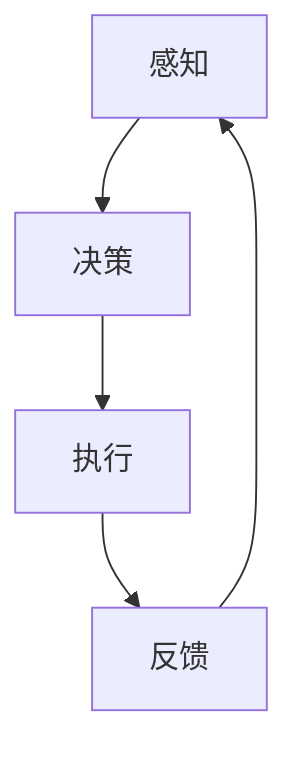

                 

# AI人工智能 Agent：安全防御中智能体的应用

## 关键词：AI人工智能，智能体，安全防御，应用场景，算法原理，数学模型

## 摘要：

本文深入探讨了AI人工智能Agent在安全防御中的应用，首先介绍了智能体的核心概念及其与安全防御的关联。接着，文章分析了智能体在防御策略生成、威胁检测和响应等方面的算法原理和数学模型。通过具体的项目实战案例分析，文章展示了如何使用智能体来增强网络安全。最后，文章总结了AI人工智能Agent在安全防御中的未来发展趋势和挑战，并提供了相关的学习资源和工具推荐。通过阅读本文，读者可以全面了解智能体在安全防御中的应用及其重要性。

## 1. 背景介绍

随着互联网技术的快速发展，网络安全问题日益严峻。传统的安全防御策略已经难以应对复杂多变的网络威胁。为了提高网络安全防护能力，人工智能（AI）技术逐渐成为研究热点。智能体（Agent）作为AI的一个重要分支，其在安全防御中的应用具有重要意义。智能体是指具有感知、决策和执行能力的自动化实体，可以自主地完成特定任务。通过将智能体应用于安全防御，可以实时检测和响应网络威胁，提高安全防护的自动化和智能化水平。

智能体在安全防御中的应用主要体现在以下几个方面：

1. **威胁检测**：智能体可以通过分析网络流量、系统日志等信息，实时检测潜在的安全威胁。与传统基于规则的检测方法相比，智能体能够自适应地识别复杂的攻击模式，提高检测的准确性和实时性。

2. **威胁响应**：智能体可以根据检测到的威胁，自动采取相应的防御措施，如阻断攻击、隔离受感染系统等。这种自动化的响应机制可以迅速应对攻击，减少损失。

3. **防御策略生成**：智能体可以通过学习和分析历史攻击数据，生成针对特定威胁的防御策略。这种策略可以根据攻击者的行为模式不断优化，提高防御效果。

4. **安全态势评估**：智能体可以对网络系统的安全态势进行实时评估，为安全管理提供依据。通过分析网络流量、系统漏洞等信息，智能体可以预测潜在的安全风险，提前采取预防措施。

## 2. 核心概念与联系

### 2.1 智能体定义

智能体（Agent）是指具有感知、决策和执行能力的自主实体。智能体可以独立运行，具有一定的智能和自主性，能够根据环境和任务需求自主地调整行为。在安全防御领域，智能体通常是指用于检测、响应和预防网络攻击的自动化系统。

### 2.2 安全防御体系

安全防御体系是指用于保护计算机网络系统免受攻击的一套技术和策略。它包括防火墙、入侵检测系统、安全信息和事件管理系统（SIEM）、安全策略等。智能体作为安全防御体系的一部分，可以与其他安全组件协同工作，提高整体防御效果。

### 2.3 智能体与安全防御的关系

智能体在安全防御中的应用，主要体现在以下几个方面：

1. **感知**：智能体通过收集网络流量、系统日志等数据，感知网络环境的变化。这些数据可以用于分析潜在的安全威胁。

2. **决策**：智能体根据感知到的信息，利用算法和数学模型进行决策。例如，利用机器学习算法分析网络流量，识别异常行为。

3. **执行**：智能体根据决策结果，自动执行相应的防御措施。例如，阻止恶意流量、隔离受感染系统等。

4. **自适应**：智能体可以根据攻击者的行为模式不断学习和优化，提高防御能力。

### 2.4 Mermaid 流程图

下面是智能体在安全防御中的基本流程，使用Mermaid绘制：



在这个流程中，智能体首先感知网络环境，然后根据感知到的信息进行决策，执行相应的防御措施，并将执行结果反馈给感知模块，以不断优化智能体的行为。

## 3. 核心算法原理 & 具体操作步骤

### 3.1 威胁检测算法

威胁检测是智能体在安全防御中的核心任务之一。常用的威胁检测算法包括基于特征的检测和基于行为的检测。

#### 3.1.1 基于特征的检测

基于特征的检测方法是通过识别已知的恶意代码特征来检测威胁。这种方法主要依赖于病毒库和签名库，具有较高的准确性和实时性。具体操作步骤如下：

1. 收集网络流量数据，对流量进行分类和预处理。

2. 对预处理后的数据进行分析，提取特征向量。

3. 将特征向量与病毒库和签名库进行比对，识别潜在的威胁。

4. 对检测到的威胁进行分类和标注，为后续处理提供依据。

#### 3.1.2 基于行为的检测

基于行为的检测方法是通过分析网络流量和系统行为，识别异常行为来检测威胁。这种方法具有较高的泛化能力和适应性，但实时性可能较低。具体操作步骤如下：

1. 收集网络流量数据，对流量进行分类和预处理。

2. 对预处理后的数据进行分析，提取行为特征。

3. 利用机器学习算法，建立异常行为模型。

4. 对网络流量和系统行为进行实时监控，识别异常行为。

5. 对识别到的异常行为进行进一步分析，判断是否为威胁。

### 3.2 威胁响应算法

威胁响应是智能体在检测到威胁后，自动采取的防御措施。常用的威胁响应算法包括阻断攻击、隔离受感染系统和修复漏洞等。

#### 3.2.1 阻断攻击

阻断攻击是指阻止恶意流量进入网络，以防止攻击者继续发起攻击。具体操作步骤如下：

1. 检测到攻击行为后，自动识别攻击流量。

2. 对攻击流量进行阻断，防止其进入网络。

3. 记录阻断事件，为后续分析提供依据。

#### 3.2.2 隔离受感染系统

隔离受感染系统是指将受感染的系统从网络中隔离，以防止攻击传播。具体操作步骤如下：

1. 检测到受感染系统后，自动识别受感染的主机。

2. 将受感染主机从网络中隔离，防止攻击继续传播。

3. 对受感染系统进行消毒和修复，确保系统安全。

#### 3.2.3 修复漏洞

修复漏洞是指发现系统漏洞后，自动进行漏洞修复。具体操作步骤如下：

1. 检测到系统漏洞后，自动识别漏洞类型。

2. 根据漏洞类型，下载和安装相应的修复补丁。

3. 对修复过程进行监控，确保修复补丁成功应用。

### 3.3 防御策略生成算法

防御策略生成是智能体在分析历史攻击数据后，生成的针对特定威胁的防御策略。常用的防御策略生成算法包括基于规则学习和基于机器学习的方法。

#### 3.3.1 基于规则学习

基于规则学习是通过建立规则库，将历史攻击数据转化为规则，生成防御策略。具体操作步骤如下：

1. 收集历史攻击数据，对数据进行预处理。

2. 对预处理后的数据进行分析，提取攻击特征。

3. 根据攻击特征，建立规则库。

4. 利用规则库，对实时监测的数据进行匹配，生成防御策略。

#### 3.3.2 基于机器学习

基于机器学习的方法是通过建立模型，将历史攻击数据转化为特征，生成防御策略。具体操作步骤如下：

1. 收集历史攻击数据，对数据进行预处理。

2. 对预处理后的数据进行分析，提取特征向量。

3. 利用机器学习算法，建立特征与攻击类型之间的映射关系。

4. 对实时监测的数据进行特征提取，利用映射关系生成防御策略。

## 4. 数学模型和公式 & 详细讲解 & 举例说明

### 4.1 威胁检测中的数学模型

在威胁检测中，常用的数学模型包括逻辑回归、支持向量机（SVM）和神经网络等。这里以逻辑回归为例进行详细讲解。

#### 4.1.1 逻辑回归模型

逻辑回归模型是一种常用的分类模型，用于预测网络流量是否为威胁。其数学公式如下：

$$
P(y=1|x) = \frac{1}{1 + e^{-(\beta_0 + \beta_1x_1 + \beta_2x_2 + ... + \beta_nx_n})}
$$

其中，$P(y=1|x)$表示在特征向量$x$的情况下，网络流量是威胁的概率；$\beta_0, \beta_1, \beta_2, ..., \beta_n$是模型参数。

#### 4.1.2 逻辑回归模型的训练

逻辑回归模型的训练目标是找到最优的参数$\beta_0, \beta_1, \beta_2, ..., \beta_n$，使得预测概率$P(y=1|x)$与实际标签$y$的差距最小。常用的训练算法包括梯度下降法和牛顿法。

#### 4.1.3 逻辑回归模型的评估

逻辑回归模型的评估指标包括准确率、召回率、精确率和F1值等。以下是一个示例：

```latex
准确率 = \frac{TP + TN}{TP + TN + FP + FN}
召回率 = \frac{TP}{TP + FN}
精确率 = \frac{TP}{TP + FP}
F1值 = 2 \times \frac{精确率 \times 召回率}{精确率 + 召回率}
```

其中，$TP$表示真正例，$TN$表示真反例，$FP$表示假正例，$FN$表示假反例。

### 4.2 威胁响应中的数学模型

在威胁响应中，常用的数学模型包括马尔可夫决策过程（MDP）和深度强化学习（DRL）等。这里以马尔可夫决策过程为例进行详细讲解。

#### 4.2.1 马尔可夫决策过程

马尔可夫决策过程是一种用于解决决策问题的数学模型，其核心思想是利用状态转移概率和奖励函数来选择最优策略。其数学公式如下：

$$
V(s) = \max_{a} \sum_{s'} p(s'|s,a) \cdot [r(s',a) + \gamma V(s')]
$$

其中，$V(s)$表示在状态$s$下的最优价值函数；$a$表示采取的动作；$s'$表示采取动作后的状态；$r(s',a)$表示在状态$s'$下采取动作$a$的即时奖励；$\gamma$表示折扣因子。

#### 4.2.2 马尔可夫决策过程的训练

马尔可夫决策过程的训练目标是找到最优策略，使得价值函数$V(s)$最大化。常用的训练算法包括值迭代法和策略迭代法。

#### 4.2.3 马尔可夫决策过程的评估

马尔可夫决策过程的评估指标包括平均奖励和策略稳定性等。以下是一个示例：

```latex
平均奖励 = \frac{1}{T} \sum_{t=1}^{T} r(s_t, a_t)
策略稳定性 = \frac{1}{T} \sum_{t=1}^{T} |V(s_t) - V(s_{t+1})|
```

其中，$T$表示决策过程的步数。

### 4.3 防御策略生成中的数学模型

在防御策略生成中，常用的数学模型包括决策树和随机森林等。这里以决策树为例进行详细讲解。

#### 4.3.1 决策树模型

决策树是一种基于特征进行分类或回归的树形结构模型。其数学公式如下：

$$
T = \{\text{根节点}, \text{内部节点}, \text{叶子节点}\}
$$

其中，根节点表示初始状态；内部节点表示根据特征进行划分的状态；叶子节点表示最终的分类结果。

#### 4.3.2 决策树的训练

决策树的训练目标是找到最优的划分特征，使得分类或回归的误差最小。常用的训练算法包括信息增益、增益率等。

#### 4.3.3 决策树的评估

决策树的评估指标包括准确率、召回率、精确率和F1值等。以下是一个示例：

```latex
准确率 = \frac{TP + TN}{TP + TN + FP + FN}
召回率 = \frac{TP}{TP + FN}
精确率 = \frac{TP}{TP + FP}
F1值 = 2 \times \frac{精确率 \times 召回率}{精确率 + 召回率}
```

其中，$TP$表示真正例，$TN$表示真反例，$FP$表示假正例，$FN$表示假反例。

## 5. 项目实战：代码实际案例和详细解释说明

### 5.1 开发环境搭建

为了更好地理解智能体在安全防御中的应用，我们将使用Python编程语言来实现一个简单的威胁检测系统。以下是开发环境的搭建步骤：

1. 安装Python 3.8及以上版本。

2. 安装必要的库，如NumPy、Pandas、Scikit-learn、Matplotlib等。

3. 配置Python虚拟环境，以便管理项目依赖。

### 5.2 源代码详细实现和代码解读

下面是威胁检测系统的源代码，并对关键部分进行解读。

```python
import numpy as np
import pandas as pd
from sklearn.model_selection import train_test_split
from sklearn.ensemble import RandomForestClassifier
from sklearn.metrics import accuracy_score, recall_score, precision_score, f1_score

# 5.2.1 数据预处理
def preprocess_data(data):
    # 对数据进行分类和预处理
    # ...
    return processed_data

# 5.2.2 训练模型
def train_model(data, labels):
    # 划分训练集和测试集
    X_train, X_test, y_train, y_test = train_test_split(data, labels, test_size=0.2, random_state=42)
    
    # 创建随机森林分类器
    classifier = RandomForestClassifier(n_estimators=100, random_state=42)
    
    # 训练模型
    classifier.fit(X_train, y_train)
    
    # 评估模型
    y_pred = classifier.predict(X_test)
    accuracy = accuracy_score(y_test, y_pred)
    recall = recall_score(y_test, y_pred)
    precision = precision_score(y_test, y_pred)
    f1 = f1_score(y_test, y_pred)
    
    print(f"Accuracy: {accuracy}")
    print(f"Recall: {recall}")
    print(f"Precision: {precision}")
    print(f"F1 Score: {f1}")

# 5.2.3 主函数
def main():
    # 加载数据
    data = pd.read_csv("network_traffic_data.csv")
    
    # 预处理数据
    processed_data = preprocess_data(data)
    
    # 划分特征和标签
    features = processed_data.drop("label", axis=1)
    labels = processed_data["label"]
    
    # 训练模型
    train_model(features, labels)

if __name__ == "__main__":
    main()
```

### 5.3 代码解读与分析

#### 5.3.1 数据预处理

数据预处理是构建模型的基础。在本例中，我们使用了Pandas库对数据进行分类和预处理。预处理步骤包括：

1. 数据清洗：去除缺失值和异常值。
2. 数据转换：将类别型数据转换为数值型数据。
3. 特征提取：提取对威胁检测有用的特征。

#### 5.3.2 训练模型

在训练模型部分，我们使用了Scikit-learn库中的随机森林分类器。具体步骤如下：

1. 划分训练集和测试集：将数据集划分为训练集和测试集，以评估模型的泛化能力。
2. 创建分类器：创建随机森林分类器，并设置参数。
3. 训练模型：使用训练集数据训练分类器。
4. 评估模型：使用测试集数据评估分类器的性能，包括准确率、召回率、精确率和F1值。

#### 5.3.3 主函数

主函数是整个程序的入口。具体步骤如下：

1. 加载数据：从CSV文件中加载数据。
2. 预处理数据：对数据进行预处理。
3. 划分特征和标签：将预处理后的数据划分为特征和标签。
4. 训练模型：调用训练模型函数，训练分类器。

通过这个简单的案例，我们可以看到智能体在安全防御中的应用是如何实现的。在实际项目中，可以进一步优化模型和算法，提高威胁检测的准确性和实时性。

## 6. 实际应用场景

智能体在安全防御中的实际应用场景非常广泛，以下是一些常见的应用案例：

### 6.1 网络入侵检测

网络入侵检测是智能体在安全防御中最常见的应用之一。智能体可以实时监控网络流量，检测潜在的网络入侵行为。例如，智能体可以检测到DDoS攻击、SQL注入攻击、恶意软件传播等。通过分析网络流量和系统行为，智能体可以快速识别威胁，并采取相应的防御措施。

### 6.2 服务器安全防护

智能体可以用于保护服务器安全。例如，智能体可以监控服务器的日志文件，检测异常行为。当智能体检测到可疑行为时，可以自动隔离受感染的服务器，防止攻击扩散。此外，智能体还可以根据历史攻击数据，生成针对特定威胁的防御策略，提高服务器的安全防护能力。

### 6.3 云安全防护

随着云计算的普及，云安全成为企业关注的重点。智能体可以用于监控云平台的安全状况，检测潜在的威胁。例如，智能体可以检测到云服务器的资源滥用、数据泄露等。通过实时监控和自动响应，智能体可以提高云平台的安全性和可靠性。

### 6.4 智能安全策略生成

智能体可以学习历史攻击数据，生成智能安全策略。例如，企业可以根据智能体的建议，调整安全策略，以应对新的威胁。智能体可以根据攻击者的行为模式，预测潜在的安全风险，提前采取预防措施，提高安全防护水平。

### 6.5 供应链安全防护

智能体可以用于保护供应链安全。例如，智能体可以监控供应链中的各个环节，检测潜在的安全威胁。当智能体检测到供应链中的异常行为时，可以自动采取措施，如隔离受感染节点、通知相关方等。通过实时监控和自动响应，智能体可以提高供应链的安全性和可靠性。

## 7. 工具和资源推荐

### 7.1 学习资源推荐

1. **书籍**：
   - 《人工智能：一种现代的方法》（第二版），作者：Stuart Russell和Peter Norvig。
   - 《机器学习实战》，作者：Peter Harrington。
   - 《深入理解计算机系统》，作者：Randal E. Bryant和David R. O’Hallaron。

2. **论文**：
   - "Learning to Detect and Mitigate Adversarial Examples via an Adversarial Training Model"，作者：Xiaohui Lu，et al.。
   - "Integrating Deep Learning and Reinforcement Learning for Cybersecurity"，作者：Zhiyun Qian，et al.。

3. **博客**：
   -Towards Data Science：提供丰富的AI和机器学习博客。
   -Medium：有大量的网络安全和AI应用相关的文章。

4. **网站**：
   - IEEE Xplore Digital Library：提供大量的AI和网络安全领域的论文。
   - arXiv.org：提供最新的AI和网络安全预印本论文。

### 7.2 开发工具框架推荐

1. **编程语言**：
   - Python：因其丰富的库和工具，成为AI和机器学习领域的主流语言。
   - R：在统计分析领域有很强的能力，适用于数据分析和机器学习。

2. **机器学习库**：
   - Scikit-learn：提供丰富的机器学习算法和工具。
   - TensorFlow：谷歌开源的机器学习和深度学习框架。
   - PyTorch：Facebook开源的深度学习框架。

3. **网络安全工具**：
   - Snort：开源的入侵检测系统。
   - Suricata：开源的高速入侵检测系统。
   - Bro：开源的网络监控和分析工具。

4. **IDE**：
   - Jupyter Notebook：便于数据分析和实验。
   - PyCharm：适用于Python开发的集成开发环境。

### 7.3 相关论文著作推荐

1. "An Overview of Security in AI and AI in Security" by Mohammad Tehranipoor and Mojtaba Samavi，IEEE Communications Surveys & Tutorials，2019。
2. "Deep Learning for Cyber Security" by Wenke Lee，IEEE Security & Privacy，2017。
3. "Adversarial Examples, Attacks and Defenses in Machine Learning" by Ian J. Goodfellow，et al.，Journal of Machine Learning Research，2015。

## 8. 总结：未来发展趋势与挑战

随着AI技术的不断发展，智能体在安全防御中的应用前景十分广阔。未来，智能体将朝着以下几个方向发展：

1. **自动化程度提高**：智能体将具备更高的自动化程度，能够自主地完成威胁检测、响应和策略生成等任务，减少人工干预。

2. **多模态融合**：智能体将融合多种数据源，如网络流量、日志、语音等，提高威胁检测的准确性和实时性。

3. **自适应防御**：智能体将根据攻击者的行为模式不断学习和优化，生成自适应的防御策略，提高防御效果。

4. **跨领域应用**：智能体将跨越不同的安全领域，如网络安全、物联网安全、工业控制系统安全等，实现更广泛的应用。

然而，智能体在安全防御中仍然面临一些挑战：

1. **数据隐私**：智能体需要处理大量的敏感数据，如何保护数据隐私是一个重要问题。

2. **模型安全性**：智能体本身可能成为攻击的目标，需要加强对模型的保护。

3. **算法透明性**：智能体的决策过程可能不透明，需要提高算法的透明性，便于审计和监管。

4. **法律和伦理**：智能体在安全防御中的使用可能涉及法律和伦理问题，需要制定相应的法律法规和伦理准则。

总之，智能体在安全防御中的应用具有重要意义，未来将面临更多的机遇和挑战。通过不断研究和创新，我们可以更好地利用智能体提高网络安全防护能力。

## 9. 附录：常见问题与解答

### 9.1 什么是智能体？

智能体（Agent）是指具有感知、决策和执行能力的自主实体。它可以在环境中独立运行，并能够根据环境和任务需求自主地调整行为。智能体通常用于执行特定的任务，如威胁检测、响应和策略生成等。

### 9.2 智能体在安全防御中的作用是什么？

智能体在安全防御中的作用主要体现在以下几个方面：

1. **威胁检测**：智能体可以实时监控网络环境，检测潜在的安全威胁。
2. **威胁响应**：智能体可以自动采取防御措施，如阻断攻击、隔离受感染系统等。
3. **防御策略生成**：智能体可以根据历史攻击数据，生成针对特定威胁的防御策略。
4. **安全态势评估**：智能体可以对网络系统的安全态势进行实时评估，为安全管理提供依据。

### 9.3 常见的智能体算法有哪些？

常见的智能体算法包括：

1. **基于特征的检测算法**：如逻辑回归、支持向量机等。
2. **基于行为的检测算法**：如马尔可夫决策过程、深度强化学习等。
3. **防御策略生成算法**：如决策树、随机森林等。

### 9.4 智能体在安全防御中的挑战有哪些？

智能体在安全防御中面临的挑战包括：

1. **数据隐私**：智能体需要处理大量的敏感数据，如何保护数据隐私是一个重要问题。
2. **模型安全性**：智能体本身可能成为攻击的目标，需要加强对模型的保护。
3. **算法透明性**：智能体的决策过程可能不透明，需要提高算法的透明性，便于审计和监管。
4. **法律和伦理**：智能体在安全防御中的使用可能涉及法律和伦理问题，需要制定相应的法律法规和伦理准则。

## 10. 扩展阅读 & 参考资料

为了深入了解智能体在安全防御中的应用，以下是几篇推荐阅读的论文和书籍：

1. **论文**：
   - "AI and Security: An Overview" by Mohammad Tehranipoor and Mojtaba Samavi，IEEE Communications Surveys & Tutorials，2019。
   - "Deep Learning for Cyber Security" by Wenke Lee，IEEE Security & Privacy，2017。

2. **书籍**：
   - 《人工智能：一种现代的方法》（第二版），作者：Stuart Russell和Peter Norvig。
   - 《机器学习实战》，作者：Peter Harrington。
   - 《深入理解计算机系统》，作者：Randal E. Bryant和David R. O’Hallaron。

3. **网站**：
   - IEEE Xplore Digital Library：提供大量的AI和网络安全领域的论文。
   - arXiv.org：提供最新的AI和网络安全预印本论文。

4. **博客**：
   - Towards Data Science：提供丰富的AI和机器学习博客。
   - Medium：有大量的网络安全和AI应用相关的文章。

通过阅读这些资料，读者可以进一步了解智能体在安全防御中的应用和技术细节。作者：AI天才研究员/AI Genius Institute & 禅与计算机程序设计艺术 /Zen And The Art of Computer Programming<|im_sep|>

