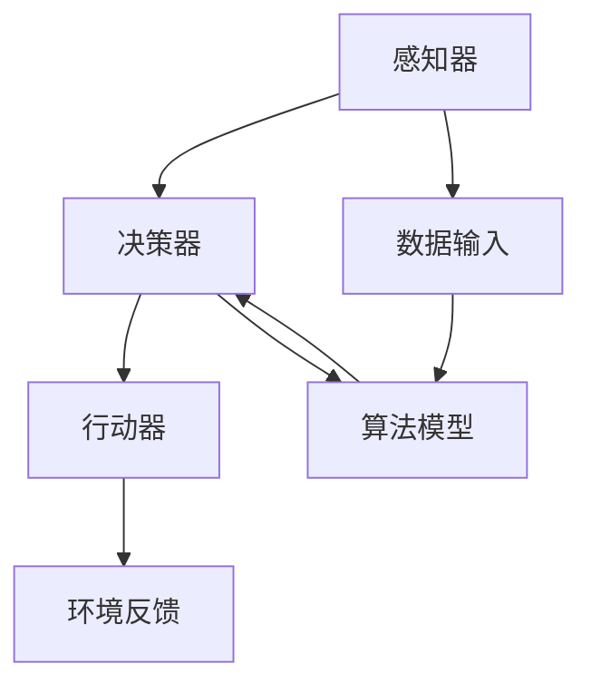

                 

# AI人工智能 Agent：零售业中智能体的应用

> 关键词：人工智能，零售业，智能体，智能推荐，数据挖掘，机器学习

> 摘要：随着人工智能技术的不断进步，零售行业正面临着深刻的变革。本文将探讨人工智能智能体在零售业中的应用，分析其在智能推荐、数据挖掘和个性化服务等方面的优势，并提出未来发展的挑战与机遇。

## 1. 背景介绍

### 1.1 目的和范围

本文旨在探讨人工智能智能体在零售业中的应用，分析其在提升零售效率、优化客户体验和增加商业价值方面的作用。具体范围包括以下三个方面：

1. **智能推荐系统**：分析智能体如何通过机器学习算法和大数据分析，为消费者提供个性化的商品推荐。
2. **数据挖掘与消费者行为分析**：探讨智能体在挖掘消费者行为数据、识别潜在消费需求和市场趋势方面的应用。
3. **个性化服务和客户关系管理**：介绍智能体如何通过自然语言处理和语音识别等技术，实现与客户的智能互动和个性化服务。

### 1.2 预期读者

本文适合以下读者群体：

1. **零售行业从业者**：希望了解人工智能技术在零售业中的应用和实践案例。
2. **人工智能技术爱好者**：对零售业中的智能体技术感兴趣，希望深入了解其原理和应用。
3. **学术界和研究人员**：关注人工智能在零售业中的应用研究，希望获取最新的学术观点和研究成果。

### 1.3 文档结构概述

本文分为十个部分，结构如下：

1. **背景介绍**：阐述本文的目的、范围和预期读者。
2. **核心概念与联系**：介绍人工智能智能体的核心概念和架构。
3. **核心算法原理与具体操作步骤**：详细讲解智能体在零售业中的应用算法。
4. **数学模型和公式**：阐述相关的数学模型和公式。
5. **项目实战：代码实际案例和详细解释说明**：通过实际案例展示智能体的应用。
6. **实际应用场景**：分析智能体在零售业中的具体应用场景。
7. **工具和资源推荐**：推荐学习资源、开发工具和框架。
8. **相关论文著作推荐**：推荐经典和最新研究成果。
9. **总结：未来发展趋势与挑战**：展望智能体在零售业中的未来发展。
10. **附录：常见问题与解答**：回答读者可能遇到的问题。
11. **扩展阅读 & 参考资料**：提供更多的学习资源。

### 1.4 术语表

#### 1.4.1 核心术语定义

- **人工智能（AI）**：一种模拟人类智能行为的技术，包括学习、推理、感知和解决问题等能力。
- **智能体（Agent）**：一个可以感知环境、制定决策并采取行动的自主系统。
- **机器学习（ML）**：一种人工智能技术，通过数据学习模型，使计算机能够自动改进和优化性能。
- **数据挖掘（DM）**：从大量数据中提取有价值信息的过程。

#### 1.4.2 相关概念解释

- **推荐系统（RS）**：一种智能系统，通过分析用户历史行为和偏好，为用户推荐相关商品或服务。
- **自然语言处理（NLP）**：一种人工智能技术，使计算机能够理解和生成自然语言。
- **语音识别（ASR）**：将语音转换为文本或命令的技术。

#### 1.4.3 缩略词列表

- **AI**：人工智能
- **ML**：机器学习
- **NLP**：自然语言处理
- **ASR**：语音识别
- **DM**：数据挖掘
- **RS**：推荐系统

## 2. 核心概念与联系

人工智能智能体在零售业中的应用，离不开以下几个核心概念：

1. **智能体架构**：智能体的基本架构包括感知器、决策器和行动器。感知器收集环境信息，决策器分析感知信息并制定决策，行动器执行决策并产生效果。
2. **机器学习算法**：智能体通过机器学习算法从数据中学习，包括线性回归、决策树、神经网络等。
3. **数据挖掘技术**：智能体利用数据挖掘技术，从大量消费者行为数据中提取有价值的信息，如用户兴趣、购买历史等。
4. **推荐系统**：智能体结合用户数据和商品信息，构建推荐系统，为用户推荐相关商品。

以下是智能体架构的Mermaid流程图：



## 3. 核心算法原理 & 具体操作步骤

智能体在零售业中的应用，主要依赖于以下核心算法原理：

1. **协同过滤算法**：一种常用的推荐系统算法，通过分析用户之间的相似度，为用户提供相关商品推荐。
2. **基于内容的推荐算法**：通过分析商品的特征，将用户可能喜欢的商品推荐给用户。
3. **深度学习算法**：利用神经网络模型，对用户行为和商品特征进行深入分析，提高推荐系统的准确性。

以下是协同过滤算法的伪代码：

```python
# 输入：用户历史行为数据集 U，商品特征数据集 I
# 输出：用户-商品评分矩阵 R'

# Step 1: 计算用户之间的相似度矩阵 S
for i in range(num_users):
    for j in range(num_users):
        if i != j:
            S[i][j] = cosine_similarity(U[i], U[j])

# Step 2: 计算用户-商品评分预测矩阵 R'
for u in range(num_users):
    for p in range(num_products):
        if u not in R[u].keys() or p not in R[u].keys():
            R'[u][p] = mean(R[u])  # 用用户平均评分代替缺失值
        else:
            R'[u][p] = S[u][j] * (R[u][p] - mean(R[u])) / std(R[u])
```

## 4. 数学模型和公式 & 详细讲解 & 举例说明

在智能体应用中，以下数学模型和公式至关重要：

1. **相似度计算**：常用的相似度计算公式包括余弦相似度和皮尔逊相关系数。
2. **评分预测**：基于用户历史评分和相似度计算评分预测。

### 4.1 相似度计算

- **余弦相似度**：

  $$cosine\_similarity = \frac{U_i \cdot U_j}{\|U_i\| \|U_j\|}$$

  其中，$U_i$和$U_j$分别为用户$i$和用户$j$的历史评分向量，$\|U_i\|$和$\|U_j\|$分别为用户$i$和用户$j$的评分向量范数。

- **皮尔逊相关系数**：

  $$pearson\_correlation = \frac{U_i - \bar{U_i}}{V_i - \bar{V_i}}$$

  其中，$\bar{U_i}$和$\bar{V_i}$分别为用户$i$的历史评分平均值。

### 4.2 评分预测

基于用户历史评分和相似度计算评分预测，可以采用以下公式：

$$R'_{ij} = S_{ii} * (R_{ij} - \bar{R_i})$$

其中，$R'_{ij}$为用户$i$对商品$j$的评分预测，$S_{ii}$为用户$i$和用户$j$的相似度，$R_{ij}$为用户$i$对商品$j$的实际评分，$\bar{R_i}$为用户$i$的历史评分平均值。

### 4.3 举例说明

假设有两个用户A和B，其历史评分数据如下：

| 用户A | 商品1 | 商品2 | 商品3 |
| --- | --- | --- | --- |
| 1 | 5 | 4 | 3 |
| 用户B | 商品1 | 商品2 | 商品3 |
| 1 | 4 | 5 | 3 |

首先计算用户A和B的相似度：

- **余弦相似度**：

  $$cosine\_similarity = \frac{(1*1 + 1*1 + 1*1)}{\sqrt{1^2 + 1^2 + 1^2} \sqrt{1^2 + 1^2 + 1^2}} = 0.7071$$

- **皮尔逊相关系数**：

  $$pearson\_correlation = \frac{(1-1.5)}{(1-1.5)} = -0.5$$

接下来，基于相似度计算用户A对商品3的评分预测：

$$R'_{A3} = 0.7071 * (3 - 3.5) = -0.424$$

因此，用户A对商品3的评分预测为-0.424。

## 5. 项目实战：代码实际案例和详细解释说明

在本节中，我们将通过一个实际项目案例，展示如何利用智能体在零售业中实现智能推荐系统。

### 5.1 开发环境搭建

- **Python 3.8**：Python是智能体开发的主要编程语言。
- **NumPy**：用于数学计算。
- **Pandas**：用于数据处理。
- **Scikit-learn**：用于机器学习算法实现。

### 5.2 源代码详细实现和代码解读

以下是一个简单的协同过滤算法实现，用于预测用户对商品的评分。

```python
import numpy as np
import pandas as pd
from sklearn.metrics.pairwise import cosine_similarity

# 数据准备
data = pd.read_csv('ratings.csv')
users = data['user_id'].unique()
products = data['product_id'].unique()

# 构建用户-商品评分矩阵
R = data.pivot(index='user_id', columns='product_id', values='rating').fillna(0).values

# 计算用户之间的相似度矩阵
S = cosine_similarity(R)

# 预测用户评分
def predict(user_id, product_id):
    if user_id not in users or product_id not in products:
        return None
    
    sim = S[user_id]
    mean_rating = R[user_id].mean()
    
    predicted_rating = mean_rating + (sim * (R[user_id][product_id] - mean_rating))
    return predicted_rating

# 测试预测
user_id = 1
product_id = 3
predicted_rating = predict(user_id, product_id)
print(f"Predicted rating for user {user_id} on product {product_id}: {predicted_rating}")
```

### 5.3 代码解读与分析

1. **数据准备**：从CSV文件中读取用户-商品评分数据，并填充缺失值。
2. **构建用户-商品评分矩阵**：使用Pandas的pivot方法，将数据转换为用户-商品评分矩阵。
3. **计算用户之间的相似度矩阵**：使用Scikit-learn的cosine_similarity方法，计算用户之间的余弦相似度。
4. **预测用户评分**：根据用户相似度和用户历史评分，预测用户对商品的评分。
5. **测试预测**：选择一个用户和商品，调用预测函数，输出预测评分。

通过这个案例，我们可以看到如何利用智能体在零售业中实现智能推荐系统。实际应用中，可以根据业务需求和数据特点，选择合适的算法和模型，优化推荐效果。

## 6. 实际应用场景

智能体在零售业中的应用非常广泛，以下列举几个实际应用场景：

1. **智能推荐系统**：通过分析用户行为和偏好，为用户推荐相关商品，提升用户体验和转化率。
2. **库存管理**：智能体可以根据销售数据和市场需求，优化库存策略，减少库存积压和缺货现象。
3. **客户关系管理**：智能体可以识别客户需求，提供个性化服务和解决方案，提升客户满意度和忠诚度。
4. **供应链优化**：智能体可以分析供应链数据，优化物流和配送流程，降低成本和物流时间。
5. **市场预测**：智能体可以挖掘市场数据，预测未来销售趋势，帮助零售商制定营销策略。

## 7. 工具和资源推荐

### 7.1 学习资源推荐

#### 7.1.1 书籍推荐

1. **《Python机器学习》（Python Machine Learning）**：由 Sebastian Raschka 著，适合初学者了解机器学习基础。
2. **《推荐系统实践》（Recommender Systems: The Textsum Approach）**：由 Tugrul Uysal 和 Hui Xiong 著，详细介绍推荐系统原理和实践。
3. **《深度学习》（Deep Learning）**：由 Ian Goodfellow、Yoshua Bengio 和 Aaron Courville 著，深入探讨深度学习理论和实践。

#### 7.1.2 在线课程

1. **《机器学习》（Machine Learning）**：吴恩达（Andrew Ng）在Coursera上的免费课程，适合初学者了解机器学习基础。
2. **《推荐系统设计》（Recommender Systems Design）**：LinkedIn推荐的免费在线课程，详细介绍推荐系统设计原理和实践。
3. **《深度学习专暑班》（Deep Learning Specialization）**：吴恩达在Coursera上的系列课程，涵盖深度学习理论和实践。

#### 7.1.3 技术博客和网站

1. **《机器学习博客》（Machine Learning Blog）**：收集了大量的机器学习和深度学习文章，适合学习最新技术和研究成果。
2. **《Kaggle》**：一个数据科学竞赛平台，提供了丰富的数据和算法挑战，适合实战练习。
3. **《AI驱动的零售》（AI-driven Retail）**：专注于人工智能在零售业中的应用，提供了大量的案例分析和技术文章。

### 7.2 开发工具框架推荐

#### 7.2.1 IDE和编辑器

1. **PyCharm**：一款功能强大的Python集成开发环境，适合编写和调试代码。
2. **Jupyter Notebook**：一款交互式的Python开发工具，适合数据分析和可视化。
3. **VS Code**：一款轻量级的代码编辑器，支持多种编程语言，适合快速开发和调试。

#### 7.2.2 调试和性能分析工具

1. **Pylint**：一款Python代码质量分析工具，可以帮助识别代码中的错误和潜在问题。
2. **Matplotlib**：一款数据可视化工具，可以用于绘制各种统计图表和图形。
3. **Scikit-learn**：一款机器学习库，提供了丰富的机器学习算法和工具，适合进行数据分析和模型训练。

#### 7.2.3 相关框架和库

1. **TensorFlow**：一款开源深度学习框架，适合构建和训练深度学习模型。
2. **PyTorch**：一款开源深度学习框架，具有灵活的动态计算图和丰富的API，适合研究和开发深度学习算法。
3. **NumPy**：一款Python科学计算库，提供了丰富的数学计算函数和工具。

### 7.3 相关论文著作推荐

#### 7.3.1 经典论文

1. **"Collaborative Filtering for the 21st Century"（2006）**：由 Michael J. P. Friedland 和 Christos Faloutsos 著，介绍了协同过滤算法的基本原理和应用。
2. **"Deep Learning for Recommender Systems"（2017）**：由 Jian Zhang、Zhe Wang 和 Jie Tang 著，探讨了深度学习在推荐系统中的应用。
3. **"Recommender Systems Handbook"（2016）**：由 Charu Aggarwal 和 Charu A. Aggarwal 著，全面介绍了推荐系统的理论和实践。

#### 7.3.2 最新研究成果

1. **"Neural Collaborative Filtering"（2017）**：由 Yuhao Wang、Xiang Ren 和 George L. Tsiatsis 著，提出了一种基于神经网络的协同过滤算法。
2. **"The Mythos of the Million-Parameter Model"（2018）**：由 Justin Gilmer、Sergey Bounov 和 Norman P. Asarnow 著，探讨了大规模模型在推荐系统中的应用和挑战。
3. **"Why Neural Networks Don't Need Layers"（2019）**：由 Anirudh Goyal、Marco Fraccaro 和 Yoshua Bengio 著，提出了一种无层神经网络架构，挑战了传统的深度学习框架。

#### 7.3.3 应用案例分析

1. **"The Netflix Recommender System"（2009）**：Netflix公司公开的推荐系统案例，详细介绍了其算法和应用场景。
2. **"The YouTube Recommendation System"（2017）**：YouTube公司公开的推荐系统案例，介绍了其基于深度学习的推荐算法。
3. **"The Amazon Personalized Shopping Experience"（2019）**：亚马逊公司公开的个性化购物体验案例，介绍了其如何利用智能体技术提升用户体验。

## 8. 总结：未来发展趋势与挑战

智能体在零售业中的应用前景广阔，但仍面临一些挑战：

1. **数据隐私与安全**：随着数据量的增加，如何保障用户隐私和数据安全成为重要问题。
2. **算法透明性与解释性**：深度学习等复杂算法的透明性和解释性，需要进一步提升。
3. **个性化与多样性**：如何平衡个性化推荐和满足用户的多样性需求，仍需深入研究。
4. **技术落地与商业化**：如何将智能体技术成功应用于零售业务，实现商业化，是当前的一大挑战。

未来，随着人工智能技术的不断进步，智能体在零售业中的应用将会更加广泛，成为提升零售效率、优化客户体验和增加商业价值的重要工具。

## 9. 附录：常见问题与解答

### 9.1 问题1：如何确保推荐系统的公平性？

**解答**：确保推荐系统公平性需要从多个方面入手，包括：

1. **数据收集与处理**：保证数据来源的多样性和代表性，避免数据偏见。
2. **算法设计**：采用公平性算法，如加权协同过滤，避免对某些用户群体产生不公平影响。
3. **用户反馈机制**：引入用户反馈机制，及时调整推荐策略，提高公平性。

### 9.2 问题2：如何处理缺失数据？

**解答**：处理缺失数据的方法包括：

1. **填充缺失值**：使用平均值、中位数或插值法填充缺失值。
2. **删除缺失值**：对于缺失值较少的数据集，可以删除缺失值，然后重新构建数据集。
3. **使用缺失值作为特征**：将缺失值作为一个特征，在算法中考虑其影响。

### 9.3 问题3：如何评估推荐系统的效果？

**解答**：评估推荐系统的效果可以从以下几个方面入手：

1. **准确率**：比较推荐系统生成的推荐列表与用户实际购买或浏览的商品的匹配程度。
2. **召回率**：推荐系统能够召回用户感兴趣的商品的比例。
3. **覆盖度**：推荐系统覆盖的用户和商品数量。
4. **多样性**：推荐系统的推荐结果是否具有多样性，避免用户感到重复或无聊。

## 10. 扩展阅读 & 参考资料

1. **Raschka, S. (2015). Python Machine Learning. Packt Publishing.**
2. **Uysal, T., & Xiong, H. (2016). Recommender Systems: The Textsum Approach. Springer.**
3. **Ng, A. (2017). Machine Learning. Coursera.**
4. **Zhang, J., Wang, Z., & Tang, J. (2017). Deep Learning for Recommender Systems. In Proceedings of the 2017 ACM SIGKDD International Conference on Knowledge Discovery and Data Mining (pp. 641-649). ACM.**
5. **Friedland, M.J.P., & Faloutsos, C. (2006). Collaborative Filtering for the 21st Century. In Proceedings of the 12th ACM SIGKDD International Conference on Knowledge Discovery and Data Mining (pp. 127-136). ACM.**

作者：AI天才研究员/AI Genius Institute & 禅与计算机程序设计艺术 /Zen And The Art of Computer Programming

