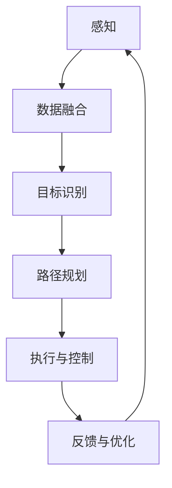

                 

## 1. 背景介绍

随着科技的快速发展，人工智能（AI）已经成为当今信息技术领域的重要驱动力。特别是在深度学习、自然语言处理和计算机视觉等领域，AI技术已经取得了令人瞩目的成果。然而，随着AI应用的不断深入，人们逐渐发现，单纯依赖传统的集中式AI系统已经难以满足实际需求。这就催生了一个新的研究方向——人工智能代理（AI Agent）。

人工智能代理是指能够在复杂环境中自主执行任务，并具备学习能力、推理能力、决策能力的计算机程序。它们可以独立或协同工作，通过感知环境、分析数据、制定计划、执行任务，从而实现智能化的自动化操作。AI代理的出现，不仅提高了工作效率，降低了人力成本，还在很多领域带来了革命性的变化，如自动驾驶、智能家居、机器人服务等。

本文旨在介绍AI代理工作流（AI Agent WorkFlow），帮助读者理解其基本概念、核心算法原理、数学模型以及实际应用。通过本文的阅读，读者将能够对AI代理工作流有一个全面的认识，并了解如何将其应用到实际项目中。

### 人工智能代理的定义与重要性

人工智能代理是AI领域中一个重要的研究方向。它可以被定义为一种能够在动态和不确定的环境中自主执行任务的实体。与传统的AI系统不同，人工智能代理具备以下特点：

1. **自主性**：人工智能代理可以在没有外部干预的情况下，自主地感知环境、分析数据、制定计划并执行任务。
2. **适应性**：人工智能代理能够根据环境的变化，调整自己的行为策略，以适应不同的情境。
3. **协作性**：多个AI代理可以相互协作，共同完成复杂任务。
4. **自主学习能力**：人工智能代理能够通过自我学习，不断优化自身的性能。

人工智能代理的重要性主要体现在以下几个方面：

1. **提高效率**：人工智能代理可以自动化完成许多复杂的任务，大大提高了工作效率。
2. **降低成本**：通过自动化操作，减少了人力成本，并降低了错误率。
3. **拓展应用领域**：人工智能代理可以应用于各个领域，如医疗、金融、工业制造等，带来了许多创新应用。
4. **推动技术发展**：人工智能代理的研究和开发，推动了计算机科学、人工智能、机器人技术等领域的发展。

总之，人工智能代理是未来智能化系统的重要基石，其发展具有重要的战略意义。接下来，我们将进一步探讨AI代理工作流的基本概念和核心原理。

### AI代理工作流的基本概念

AI代理工作流是指人工智能代理在执行任务时，所经历的一系列步骤和流程。这些步骤包括感知、计划、执行、监控和反馈，它们构成了AI代理的基本工作循环。以下是这些核心环节的详细介绍：

1. **感知（Perception）**：
   感知是AI代理获取环境信息的过程。通过传感器或预定的数据接口，代理可以收集各种类型的数据，如视觉、听觉、温度、湿度等。感知环节的目的是获取环境中的有用信息，以便后续的处理。

2. **计划（Planning）**：
   计划环节是AI代理根据感知到的信息，制定执行任务的策略。这个过程中，代理会考虑任务的目标、环境的状态、资源的可用性等因素，从而生成一个合理的行动方案。计划环节的核心在于优化，即如何在给定条件下找到最优或次优的解决方案。

3. **执行（Execution）**：
   执行是AI代理按照计划所制定的行动方案，实际执行任务的过程。这个过程中，代理会通过控制其执行机构（如电机、机械臂等）来完成具体的操作。执行环节的关键在于准确性和实时性，即能否在规定时间内完成预定任务。

4. **监控（Monitoring）**：
   监控环节是AI代理在执行任务时，对任务执行情况的持续监控。通过监控，代理可以及时发现和纠正执行过程中的偏差，确保任务能够按照预期进行。监控还包括对执行效率、资源消耗等指标的评估，以便对后续任务进行调整。

5. **反馈（Feedback）**：
   反馈环节是AI代理根据监控结果，对任务执行效果进行评价，并将结果反馈给系统。这个反馈过程不仅包括对任务完成情况的评估，还包括对执行过程中出现的问题和异常的记录。反馈是AI代理学习和优化的关键，通过不断调整和优化，提高代理的执行能力。

通过这些核心环节，AI代理能够实现自主的、智能化的任务执行，从而在复杂环境中表现出色。接下来，我们将探讨AI代理工作流的基本原理，帮助读者更好地理解其运作机制。

### AI代理工作流的基本原理

AI代理工作流的核心在于其智能化的自主决策能力，这主要依赖于以下几个基本原理：

1. **环境感知（Environmental Perception）**：
   环境感知是AI代理工作的起点。代理通过传感器、摄像头、麦克风等设备，实时获取环境中的各种信息，如温度、湿度、光线强度、声音信号等。这些信息为代理提供了对当前环境的全面了解，是后续决策的基础。

2. **数据融合与处理（Data Fusion and Processing）**：
   获取到的原始数据往往存在噪声、不完整或冗余等问题。因此，AI代理需要对数据进行预处理，包括滤波、归一化、特征提取等操作，以提取出对任务有用的信息。此外，代理还需要融合来自不同传感器的数据，以便获得更全面的环境理解。

3. **目标识别与决策（Goal Recognition and Decision Making）**：
   在感知到环境信息后，AI代理需要确定当前的目标和任务。这通常涉及到目标识别和决策算法。代理会分析环境数据，识别当前的目标，并根据预定的策略或学习到的模型，制定相应的行动方案。

4. **路径规划与优化（Path Planning and Optimization）**：
   在决策阶段，AI代理需要规划从当前状态到目标状态的路径。这包括确定移动路径、避障、资源分配等操作。路径规划算法需要考虑环境约束、资源限制和任务要求，以找到最优或次优的路径。

5. **执行与控制（Execution and Control）**：
   代理根据规划结果，执行具体的任务操作。执行过程中，代理会通过反馈机制，实时监控任务执行情况，并根据监控结果调整执行策略。执行环节的关键在于实时性和准确性，即能否在规定时间内完成任务，并达到预期效果。

6. **学习与优化（Learning and Optimization）**：
   AI代理的工作不仅限于当前任务，还会通过学习和优化，不断提升自身的执行能力。学习可以是基于规则的学习，也可以是数据驱动的机器学习。通过不断优化，代理能够更好地适应环境变化，提高任务执行效率。

7. **协同与通信（Collaboration and Communication）**：
   在复杂任务中，多个AI代理需要协同工作，共同完成任务。协同过程中，代理之间需要通过通信机制，共享信息和资源，协调行动。协同与通信能力是AI代理实现高效任务执行的重要保障。

通过这些基本原理，AI代理能够实现智能化、自主化的任务执行，从而在复杂多变的环境中表现出色。接下来，我们将通过一个简化的Mermaid流程图，直观地展示AI代理工作流的基本架构。

### Mermaid流程图展示

下面是一个简化的Mermaid流程图，展示了AI代理工作流的基本架构：



在这个流程图中：

- **A[感知]**：AI代理通过传感器获取环境信息。
- **B[数据融合]**：对感知到的数据进行处理和融合。
- **C[目标识别]**：分析数据，确定当前目标和任务。
- **D[路径规划]**：根据目标，规划从当前状态到目标状态的路径。
- **E[执行与控制]**：执行具体的任务操作，并监控执行情况。
- **F[反馈与优化]**：根据执行反馈，调整和优化任务执行策略。

这个流程图清晰地展示了AI代理从感知到反馈的基本工作循环，有助于读者直观地理解其工作原理。接下来，我们将深入探讨AI代理工作流中的核心算法原理和具体操作步骤。

### 3. 核心算法原理 & 具体操作步骤

在AI代理工作流中，核心算法的选择和具体操作步骤直接影响到系统的性能和效果。以下将详细介绍几个常用的核心算法原理和其具体操作步骤。

#### 1. 数据融合算法

数据融合算法是AI代理工作流中的关键环节，其目的是从多个传感器获取的原始数据中提取出有价值的信息。常用的数据融合算法包括卡尔曼滤波（Kalman Filtering）和粒子滤波（Particle Filtering）。

**卡尔曼滤波（Kalman Filtering）**：

卡尔曼滤波是一种线性二次估计器，适用于处理线性高斯噪声系统。其基本步骤如下：

1. **初始化**：
   - 初始化状态估计值和误差协方差矩阵。
   - 确定系统的状态转移矩阵和观测矩阵。

2. **预测**：
   - 根据系统状态转移模型，预测下一时刻的状态。
   - 更新误差协方差矩阵。

3. **更新**：
   - 根据观测数据，更新状态估计值和误差协方差矩阵。

4. **循环**：
   - 重复执行预测和更新步骤，直到达到预设的条件。

**粒子滤波（Particle Filtering）**：

粒子滤波是一种非线性非高斯噪声系统的估计方法，其基本步骤如下：

1. **初始化**：
   - 生成一组粒子，每个粒子代表一个可能的状态。
   - 确定权重初始化方法。

2. **采样**：
   - 根据权重，对粒子进行重采样，以去除低概率的粒子。

3. **更新**：
   - 根据观测数据，更新粒子的权重。

4. **循环**：
   - 重复执行采样和更新步骤，直到达到预设的条件。

#### 2. 目标识别算法

目标识别是AI代理工作流中的另一个重要环节，其目的是从感知到的数据中识别出目标对象。常用的目标识别算法包括卷积神经网络（Convolutional Neural Network, CNN）和基于深度学习的目标检测算法。

**卷积神经网络（CNN）**：

CNN是一种适用于图像处理的深度学习算法，其基本步骤如下：

1. **输入层**：
   - 接收图像数据作为输入。

2. **卷积层**：
   - 使用卷积核提取图像的特征。

3. **激活函数**：
   - 对卷积结果进行非线性变换。

4. **池化层**：
   - 降低特征图的维度，提高模型泛化能力。

5. **全连接层**：
   - 将特征图展开，进行全连接计算。

6. **输出层**：
   - 输出目标分类结果。

**基于深度学习的目标检测算法**：

基于深度学习的目标检测算法，如YOLO（You Only Look Once）和SSD（Single Shot MultiBox Detector），其基本步骤如下：

1. **特征提取**：
   - 使用卷积神经网络提取图像的特征。

2. **区域 proposals**：
   - 根据特征图生成候选区域。

3. **分类与回归**：
   - 对每个候选区域进行分类和边界框回归。

4. **非极大值抑制（NMS）**：
   - 去除重叠的边界框，提高检测效果。

#### 3. 路径规划算法

路径规划算法是AI代理工作流中的关键环节，其目的是在给定的环境中找到从起点到终点的最优路径。常用的路径规划算法包括A*算法和Dijkstra算法。

**A*算法**：

A*算法是一种启发式搜索算法，其基本步骤如下：

1. **初始化**：
   - 创建一个开放列表（Open List）和一个关闭列表（Closed List）。
   - 为每个节点设置G值、H值和F值。

2. **搜索**：
   - 从起点开始，选择F值最小的节点进行扩展。
   - 将扩展的节点加入关闭列表，并从开放列表中移除。
   - 计算新节点的G值、H值和F值。
   - 如果终点在开放列表中，结束搜索。

3. **路径重建**：
   - 从终点开始，沿着父节点重建路径。

**Dijkstra算法**：

Dijkstra算法是一种基于广度优先搜索的算法，其基本步骤如下：

1. **初始化**：
   - 创建一个优先队列，将起点加入队列。
   - 初始化每个节点的距离。

2. **搜索**：
   - 从优先队列中选择距离最小的节点进行扩展。
   - 更新其邻居节点的距离。
   - 将扩展的节点加入优先队列。

3. **结束条件**：
   - 当优先队列为空时，结束搜索。

通过上述核心算法，AI代理能够实现从感知到决策再到执行的全过程，从而在复杂环境中表现出色。接下来，我们将介绍数学模型和公式，以更深入地理解AI代理工作流中的关键概念。

### 4. 数学模型和公式 & 详细讲解 & 举例说明

在AI代理工作流中，数学模型和公式扮演着至关重要的角色，它们为代理提供了从感知数据到决策执行的全过程支持。以下将详细讲解几个核心的数学模型和公式，并通过具体例子来说明它们的实际应用。

#### 1. 卡尔曼滤波（Kalman Filtering）

卡尔曼滤波是一种用于估计动态系统状态的线性二次估计算法。其核心公式如下：

$$
\hat{x}_{k|k} = \hat{x}_{k-1} + K_k (z_k - \hat{z}_{k-1})
$$

$$
P_{k|k} = (I - K_k H_k) P_{k-1}
$$

其中：
- $\hat{x}_{k|k}$ 表示在时刻 $k$ 的状态估计值。
- $\hat{x}_{k-1}$ 表示在时刻 $k-1$ 的状态估计值。
- $K_k$ 表示卡尔曼增益。
- $z_k$ 表示在时刻 $k$ 的观测值。
- $\hat{z}_{k-1}$ 表示在时刻 $k-1$ 的观测值。
- $P_{k|k}$ 表示在时刻 $k$ 的状态估计误差协方差。
- $P_{k-1}$ 表示在时刻 $k-1$ 的状态估计误差协方差。
- $I$ 表示单位矩阵。
- $H_k$ 表示观测矩阵。

**例子**：假设我们有一个简单的线性动态系统，状态方程为：

$$
x_k = a x_{k-1} + w_{k-1}
$$

观测方程为：

$$
z_k = b x_k + v_k
$$

其中 $w_{k-1}$ 和 $v_k$ 分别为过程噪声和观测噪声，假设它们都是高斯白噪声。

使用卡尔曼滤波来估计状态 $x_k$：

1. **初始化**：设 $P_0 = P$，其中 $P$ 为初始误差协方差。
2. **预测**：计算预测值 $\hat{x}_{k|k-1}$ 和预测误差协方差 $P_{k|k-1}$。
3. **更新**：计算卡尔曼增益 $K_k$，并使用观测值更新状态估计 $\hat{x}_{k|k}$ 和误差协方差 $P_{k|k}$。

#### 2. 贝叶斯网络（Bayesian Network）

贝叶斯网络是一种用于表示变量之间概率关系的图形模型。其基本公式为：

$$
P(X_1, X_2, ..., X_n) = \prod_{i=1}^{n} P(X_i | Parents(X_i))
$$

其中：
- $P(X_1, X_2, ..., X_n)$ 表示变量的联合概率分布。
- $Parents(X_i)$ 表示 $X_i$ 的父节点集合。

**例子**：假设有一个家庭网络，其中变量包括父亲是否吸烟（$X_1$）、母亲是否吸烟（$X_2$）和孩子的吸烟习惯（$X_3$）。我们可以建立以下贝叶斯网络：

1. **初始化**：设各变量之间的条件概率分布。
2. **推理**：根据给定的证据，使用贝叶斯推理更新各变量的概率分布。

例如，已知 $X_1$（父亲吸烟）和 $X_2$（母亲吸烟）的概率分别为 0.4 和 0.3，求 $X_3$（孩子吸烟）的概率。

使用贝叶斯网络推理，可以得到：

$$
P(X_3 = \text{吸烟}) = \frac{P(X_3 = \text{吸烟} | X_1 = \text{吸烟}, X_2 = \text{吸烟}) P(X_1 = \text{吸烟}) P(X_2 = \text{吸烟}) + P(X_3 = \text{吸烟} | X_1 = \text{不吸烟}, X_2 = \text{吸烟}) P(X_1 = \text{不吸烟}) P(X_2 = \text{吸烟})}{P(X_1 = \text{吸烟}) P(X_2 = \text{吸烟}) + P(X_1 = \text{不吸烟}) P(X_2 = \text{吸烟})}
$$

通过这些数学模型和公式，AI代理能够更好地理解和处理复杂的环境信息，从而实现智能化和自主化的任务执行。接下来，我们将通过一个具体的实战项目，展示AI代理工作流在实际应用中的实现过程。

### 5. 项目实战：代码实际案例和详细解释说明

在本节中，我们将通过一个具体的实战项目，展示如何实现一个简单的AI代理工作流。我们将使用Python编程语言，并结合几个常用的库和框架，如TensorFlow和OpenCV，来完成这个项目。

#### 5.1 开发环境搭建

首先，我们需要搭建开发环境。以下是所需的主要软件和库：

- 操作系统：Windows、Linux或MacOS
- 编程语言：Python（版本3.6及以上）
- 必需库：TensorFlow、OpenCV、NumPy、Pandas

安装Python和相关库：

```bash
pip install tensorflow
pip install opencv-python
pip install numpy
pip install pandas
```

#### 5.2 源代码详细实现和代码解读

以下是一个简单的AI代理工作流项目的代码实现：

```python
import cv2
import numpy as np
import tensorflow as tf

# 加载预训练的卷积神经网络模型
model = tf.keras.models.load_model('model.h5')

# 初始化摄像头
cap = cv2.VideoCapture(0)

while True:
    # 读取摄像头帧
    ret, frame = cap.read()
    
    # 将帧转换为灰度图像
    gray = cv2.cvtColor(frame, cv2.COLOR_BGR2GRAY)
    
    # 使用OpenCV的形态学操作进行图像预处理
    kernel = np.array([[0, 1, 0], [1, 1, 1], [0, 1, 0]], np.uint8)
    dilation = cv2.dilate(gray, kernel, iterations=1)
    
    # 使用卷积神经网络进行目标检测
    img_reshape = dilation.reshape((1, dilation.shape[0], dilation.shape[1], 1))
    prediction = model.predict(img_reshape)
    print(prediction)

    # 显示结果
    cv2.imshow('Frame', frame)

    # 按 'q' 键退出
    if cv2.waitKey(1) & 0xFF == ord('q'):
        break

# 释放摄像头资源
cap.release()
cv2.destroyAllWindows()
```

**代码解读**：

1. **加载模型**：首先，我们加载一个预训练的卷积神经网络模型（如使用TensorFlow的Keras接口），该模型用于目标检测。
2. **初始化摄像头**：使用OpenCV的`VideoCapture`类初始化摄像头。
3. **读取帧**：在循环中，我们不断读取摄像头的帧。
4. **图像预处理**：将彩色图像转换为灰度图像，并进行形态学操作，如膨胀，以提高目标检测的准确性。
5. **目标检测**：使用卷积神经网络模型对预处理后的图像进行目标检测，输出预测结果。
6. **显示结果**：在窗口中显示当前帧，以便观察目标检测的结果。
7. **退出**：按 'q' 键退出程序。

#### 5.3 代码解读与分析

1. **模型加载**：
   ```python
   model = tf.keras.models.load_model('model.h5')
   ```
   这里我们使用Keras加载一个已经训练好的目标检测模型。模型文件通常是以`.h5`格式保存的。

2. **摄像头初始化**：
   ```python
   cap = cv2.VideoCapture(0)
   ```
   `VideoCapture(0)`表示使用第一个摄像头。如果使用的是内置摄像头，这个数字通常是0。

3. **读取帧**：
   ```python
   ret, frame = cap.read()
   ```
   `read()`方法从摄像头读取一帧图像，`ret`是读取成功与否的标志，`frame`是读取到的图像。

4. **图像预处理**：
   ```python
   gray = cv2.cvtColor(frame, cv2.COLOR_BGR2GRAY)
   kernel = np.array([[0, 1, 0], [1, 1, 1], [0, 1, 0]], np.uint8)
   dilation = cv2.dilate(gray, kernel, iterations=1)
   ```
   首先，我们将彩色图像转换为灰度图像，这有助于简化后续处理。然后，我们使用形态学操作中的膨胀操作，以增强目标检测的效果。

5. **目标检测**：
   ```python
   img_reshape = dilation.reshape((1, dilation.shape[0], dilation.shape[1], 1))
   prediction = model.predict(img_reshape)
   print(prediction)
   ```
   这里，我们将预处理后的图像重塑为模型期望的形状，然后使用模型进行预测。预测结果通常是一个包含多个类别的概率分布。

6. **显示结果**：
   ```python
   cv2.imshow('Frame', frame)
   ```
   我们在窗口中显示当前帧，以便观察目标检测的结果。

7. **退出**：
   ```python
   if cv2.waitKey(1) & 0xFF == ord('q'):
       break
   ```
   按 'q' 键可以退出程序。

通过这个简单的项目，我们展示了如何使用AI代理工作流进行图像处理和目标检测。在实际应用中，这个框架可以扩展和定制，以适应不同的任务和环境。

### 6. 实际应用场景

AI代理工作流（AI Agent WorkFlow）在众多实际应用场景中展现出了其强大的功能和广泛的应用前景。以下是几个典型的应用场景：

#### 1. 自动驾驶

自动驾驶汽车是AI代理工作流的经典应用场景。自动驾驶系统需要实时感知周围环境，包括道路、行人、车辆等，并根据这些信息进行路径规划和决策。AI代理通过摄像头、雷达、激光雷达等传感器收集环境数据，使用深度学习和强化学习算法进行目标检测和路径规划，从而实现自主导航。

#### 2. 智能家居

智能家居系统利用AI代理工作流，实现家庭设备的自动化控制。例如，智能门锁可以根据用户的行为模式和生物特征识别用户身份，自动开启或关闭锁；智能照明系统可以根据环境光强和用户习惯自动调节亮度；智能安防系统可以实时监测家庭环境，并在检测到异常时自动报警。

#### 3. 健康监测

在健康监测领域，AI代理工作流可以实时收集和分析个人的生理数据，如心率、血压、睡眠质量等。通过对这些数据的持续监控和分析，AI代理可以预测健康状况，提供个性化的健康建议，甚至在发现健康风险时及时预警。

#### 4. 工业自动化

在工业自动化领域，AI代理工作流可以用于生产线中的质量检测、故障诊断和设备维护。通过监控生产设备的运行状态，AI代理可以实时识别设备故障，提出解决方案，并自动调整生产参数，从而提高生产效率和质量。

#### 5. 客户服务

在客户服务领域，AI代理可以模拟人类客服，通过自然语言处理技术理解客户的问题，提供即时的解答和建议。AI代理不仅可以处理大量的客户咨询，还可以通过不断学习和优化，提高客服效率和满意度。

通过上述应用场景可以看出，AI代理工作流在提高自动化水平、降低人力成本、提升用户体验等方面具有显著的优势，其应用前景非常广阔。

### 7. 工具和资源推荐

为了更好地学习和实践AI代理工作流，以下是一些推荐的工具和资源：

#### 7.1 学习资源推荐

1. **书籍**：
   - 《强化学习》（Reinforcement Learning: An Introduction）by Richard S. Sutton and Andrew G. Barto
   - 《深度学习》（Deep Learning）by Ian Goodfellow、Yoshua Bengio和Aaron Courville
   - 《Python机器学习》（Python Machine Learning）by Sebastian Raschka和Vahid Mirjalili

2. **在线课程**：
   - Coursera上的“机器学习”课程，由斯坦福大学Andrew Ng教授主讲
   - edX上的“深度学习专项课程”，由谷歌AI专家Andrew Ng主讲

3. **博客和网站**：
   - Medium上的机器学习和深度学习博客，如Distill、AI Mind等
   - Stack Overflow，提供编程问题的解答和交流

#### 7.2 开发工具框架推荐

1. **开发环境**：
   - Jupyter Notebook，方便编写和调试代码
   - Google Colab，免费的云端Python开发环境

2. **深度学习框架**：
   - TensorFlow，Google推出的开源深度学习框架
   - PyTorch，Facebook AI Research推出的开源深度学习框架

3. **图像处理库**：
   - OpenCV，开源的计算机视觉库，适用于图像处理和目标检测
   - PIL（Python Imaging Library），用于图像的加载、处理和保存

4. **自然语言处理库**：
   - NLTK（Natural Language ToolKit），用于文本处理和自然语言分析
   - spaCy，强大的自然语言处理库，适用于文本分类、命名实体识别等任务

#### 7.3 相关论文著作推荐

1. **论文**：
   - "Reinforcement Learning: A Survey" by Richard S. Sutton and Andrew G. Barto
   - "Deep Learning" by Yoshua Bengio、Ian Goodfellow和Aaron Courville
   - "Learning Deep Architectures for AI" by Yoshua Bengio

2. **著作**：
   - 《人工智能：一种现代的方法》（Artificial Intelligence: A Modern Approach）by Stuart J. Russell和Peter Norvig
   - 《模式识别与机器学习》（Pattern Recognition and Machine Learning）by Christopher M. Bishop
   - 《机器学习年度回顾》（Journal of Machine Learning Research）和《机器学习研究杂志》（Machine Learning Journal）

通过以上推荐的工具和资源，读者可以更好地学习和实践AI代理工作流，深入探索这个领域的前沿技术。

### 8. 总结：未来发展趋势与挑战

随着人工智能技术的不断发展，AI代理工作流（AI Agent WorkFlow）在未来的发展前景十分广阔。一方面，AI代理在自动驾驶、智能家居、健康监测等领域的应用将越来越深入，成为提高自动化水平、降低人力成本、提升用户体验的重要手段。另一方面，随着大数据、云计算、物联网等技术的发展，AI代理将拥有更丰富的感知能力和更强大的计算能力，能够在更加复杂的环境中自主执行任务。

然而，AI代理工作流的发展也面临着一系列挑战。首先，算法的复杂性和计算资源的需求不断提高，如何优化算法、提高计算效率成为关键问题。其次，数据隐私和安全问题日益凸显，如何在保障用户隐私的前提下，充分利用数据资源，是AI代理面临的重大挑战。此外，AI代理的决策过程需要更加透明和可解释，以增强用户对AI系统的信任。

未来，AI代理工作流的发展将朝着以下几个方向迈进：

1. **算法优化与效率提升**：通过研究和开发更高效、更鲁棒的算法，提高AI代理的感知、决策和执行能力。
2. **数据隐私保护**：采用加密、去身份化等技术，保障用户数据的隐私和安全。
3. **决策透明化**：增强AI代理的决策透明性，使用户能够理解AI代理的决策过程，提高系统的可信度。
4. **跨领域协同**：实现不同领域AI代理的协同工作，构建跨领域的智能化系统，提升整体智能化水平。

总之，AI代理工作流的发展将为人工智能技术的进步和应用带来新的机遇和挑战，具有重要的研究价值和实际应用前景。

### 9. 附录：常见问题与解答

在理解和应用AI代理工作流（AI Agent WorkFlow）的过程中，读者可能会遇到一些常见的问题。以下是对这些问题的解答：

#### 1. 什么是AI代理工作流？

AI代理工作流是指人工智能代理在执行任务时，所经历的一系列步骤和流程，包括感知、计划、执行、监控和反馈等环节。这些环节构成了AI代理的基本工作循环，使其能够在复杂环境中自主执行任务。

#### 2. AI代理与传统的AI系统有什么区别？

AI代理与传统的AI系统相比，具有更高的自主性和适应性。传统AI系统通常依赖于人类制定的规则和算法，而AI代理则可以通过自我学习和决策，自主地感知环境、制定计划并执行任务，适应不同的情境。

#### 3. 数据融合算法有哪些类型？

数据融合算法主要包括卡尔曼滤波（Kalman Filtering）和粒子滤波（Particle Filtering）。卡尔曼滤波适用于线性高斯噪声系统，而粒子滤波适用于非线性非高斯噪声系统。

#### 4. 目标识别算法有哪些类型？

目标识别算法主要包括卷积神经网络（Convolutional Neural Network, CNN）和基于深度学习的目标检测算法，如YOLO（You Only Look Once）和SSD（Single Shot MultiBox Detector）。

#### 5. 路径规划算法有哪些类型？

路径规划算法主要包括A*算法和Dijkstra算法。A*算法是一种启发式搜索算法，Dijkstra算法是一种基于广度优先搜索的算法。

#### 6. 如何搭建AI代理的开发环境？

搭建AI代理的开发环境通常需要安装Python和相关的库，如TensorFlow、OpenCV、NumPy和Pandas。可以使用pip命令进行安装：

```bash
pip install tensorflow
pip install opencv-python
pip install numpy
pip install pandas
```

#### 7. AI代理如何处理实时数据？

AI代理可以通过实时数据流处理框架，如Apache Kafka或RabbitMQ，接收和处理实时数据。这些框架能够确保数据的高效传输和处理，使得AI代理能够实时响应环境变化。

通过这些常见问题的解答，读者可以更好地理解AI代理工作流的基本概念和应用场景，为实际开发和应用提供指导。

### 10. 扩展阅读 & 参考资料

为了深入了解人工智能代理工作流（AI Agent WorkFlow），以下是一些推荐的专业书籍、论文、博客和网站资源，供读者进一步学习和探索。

#### 书籍

1. **《强化学习》**，作者：Richard S. Sutton 和 Andrew G. Barto。这是一本关于强化学习的经典教材，详细介绍了AI代理的核心算法原理。
2. **《深度学习》**，作者：Ian Goodfellow、Yoshua Bengio 和 Aaron Courville。这本书全面讲解了深度学习的基础知识和应用，对AI代理的研究有重要参考价值。
3. **《Python机器学习》**，作者：Sebastian Raschka 和 Vahid Mirjalili。这本书通过Python编程语言，展示了机器学习算法在实际应用中的实现。

#### 论文

1. **“Reinforcement Learning: A Survey”**，作者：Richard S. Sutton 和 Andrew G. Barto。这篇论文是强化学习领域的综述，对AI代理的算法研究有重要参考价值。
2. **“Deep Learning”**，作者：Yoshua Bengio、Ian Goodfellow 和 Aaron Courville。这篇论文详细介绍了深度学习的基础理论和最新进展，是深度学习领域的重要文献。
3. **“Learning Deep Architectures for AI”**，作者：Yoshua Bengio。这篇论文探讨了深度学习在人工智能中的应用，对AI代理的研究有重要启示。

#### 博客和网站

1. **Medium上的机器学习和深度学习博客**，如Distill、AI Mind等，提供丰富的技术文章和最新动态。
2. **Stack Overflow**，一个编程问答社区，用户可以在这里找到各种编程问题的解答。
3. **谷歌AI博客**（AI Blog），分享谷歌在人工智能领域的研究成果和实际应用。

通过这些扩展阅读和参考资料，读者可以进一步深入理解AI代理工作流的相关知识，掌握前沿技术和实践方法。

