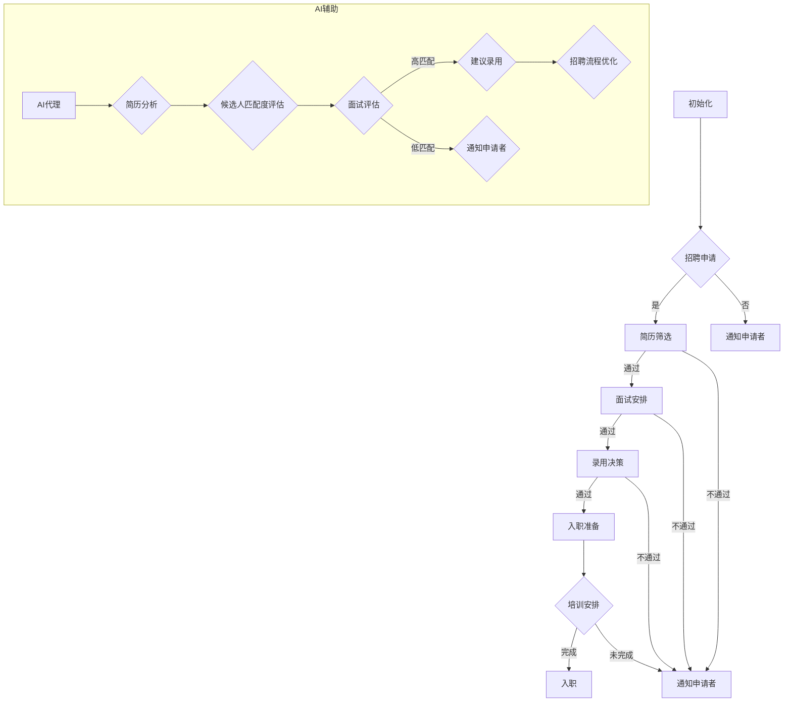
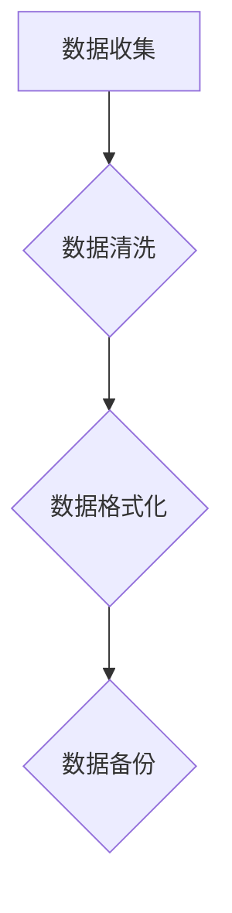
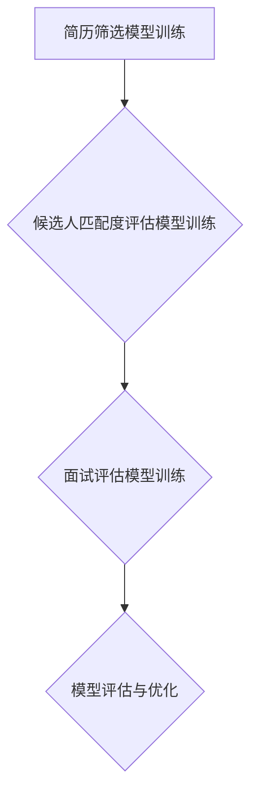
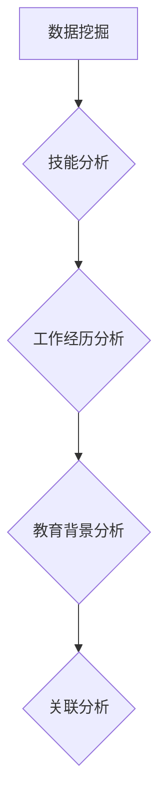
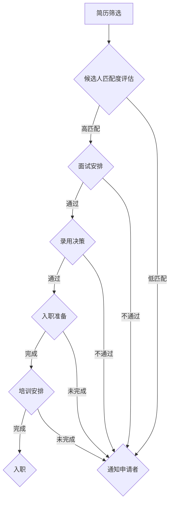
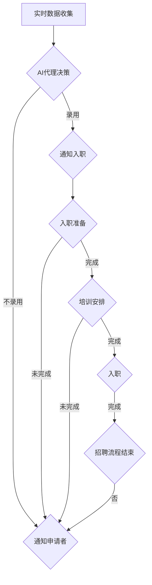

                 

# AI人工智能代理工作流 AI Agent WorkFlow：在人力资源管理中的应用

> 关键词：人工智能代理、工作流、人力资源管理、工作自动化、智能决策、数据挖掘

> 摘要：本文深入探讨了人工智能代理工作流（AI Agent WorkFlow）在人力资源管理领域的应用。通过详细阐述工作流的概念、核心原理及其在人力资源领域的实际操作步骤，本文旨在展示人工智能如何通过自动化流程和智能决策，提高人力资源管理效率、优化业务流程，并为企业和员工创造更大价值。

## 1. 背景介绍

### 1.1 目的和范围

本文的目标是探讨人工智能代理工作流（AI Agent WorkFlow）在人力资源管理中的应用，通过分析和实践案例，揭示其在提高效率、优化业务流程和实现智能决策方面的潜力。本文的主要内容包括：

- 对工作流和人工智能代理的基本概念进行阐述；
- 分析工作流和人工智能代理在人力资源管理中的结合点；
- 详细描述AI Agent WorkFlow的核心原理和实施步骤；
- 通过实际案例展示AI Agent WorkFlow在人力资源管理中的具体应用；
- 推荐相关工具和资源，以帮助读者进一步学习和实践。

### 1.2 预期读者

本文主要面向以下读者群体：

- 人力资源管理专业人员，包括HR经理、HRBP、招聘专家等；
- 人工智能和软件开发人员，对人力资源管理和AI技术有一定了解；
- 对人工智能代理和自动化流程感兴趣的技术爱好者；
- 对新兴技术应用和管理创新有兴趣的企业家和创业者。

### 1.3 文档结构概述

本文分为十个主要部分，具体结构如下：

- **第1部分**：背景介绍，包括目的、预期读者和文档结构概述；
- **第2部分**：核心概念与联系，介绍工作流和人工智能代理的基本概念，并给出Mermaid流程图；
- **第3部分**：核心算法原理 & 具体操作步骤，详细阐述AI Agent WorkFlow的算法原理和操作步骤；
- **第4部分**：数学模型和公式 & 详细讲解 & 举例说明，介绍与AI Agent WorkFlow相关的数学模型和公式，并通过例子进行说明；
- **第5部分**：项目实战：代码实际案例和详细解释说明，展示一个具体的代码实现案例，并详细解释其原理和操作过程；
- **第6部分**：实际应用场景，分析AI Agent WorkFlow在人力资源管理中的具体应用场景；
- **第7部分**：工具和资源推荐，推荐相关的学习资源、开发工具框架和相关论文著作；
- **第8部分**：总结：未来发展趋势与挑战，对AI Agent WorkFlow在人力资源管理中的应用进行展望；
- **第9部分**：附录：常见问题与解答，回答读者可能遇到的常见问题；
- **第10部分**：扩展阅读 & 参考资料，提供更多相关阅读材料和参考资料。

### 1.4 术语表

在本文中，我们将使用一些专业术语，以下是对这些术语的定义和解释：

#### 1.4.1 核心术语定义

- **工作流（Workflow）**：工作流是一系列有序的任务和活动，用于实现特定业务目标的过程。
- **人工智能代理（AI Agent）**：人工智能代理是一种自主决策的软件程序，能够根据环境信息和预设规则执行任务。
- **人力资源管理（HR Management）**：人力资源管理是指组织对人力资源进行管理、开发和利用的过程，包括招聘、培训、绩效评估、薪酬福利等。
- **数据挖掘（Data Mining）**：数据挖掘是从大量数据中提取有价值信息的过程，用于发现隐藏的模式、关联和趋势。
- **机器学习（Machine Learning）**：机器学习是一种人工智能技术，通过训练数据集，使计算机能够从数据中学习并做出预测和决策。

#### 1.4.2 相关概念解释

- **业务流程自动化（Business Process Automation）**：业务流程自动化是指使用技术手段将重复性、规则性强的业务流程自动化，减少人工干预。
- **智能决策支持系统（Intelligent Decision Support System）**：智能决策支持系统是一种集成人工智能技术和数据挖掘技术的系统，用于辅助决策者进行决策。
- **人力资源规划（HR Planning）**：人力资源规划是指根据企业战略目标和人力资源需求，制定招聘、培训、晋升等人力资源计划。

#### 1.4.3 缩略词列表

- **HRM**：人力资源管理（Human Resource Management）
- **AI**：人工智能（Artificial Intelligence）
- **WF**：工作流（Workflow）
- **ML**：机器学习（Machine Learning）
- **DM**：数据挖掘（Data Mining）
- **DSS**：智能决策支持系统（Intelligent Decision Support System）

## 2. 核心概念与联系

在探讨人工智能代理工作流（AI Agent WorkFlow）在人力资源管理中的应用之前，我们需要明确工作流和人工智能代理的基本概念及其相互关系。

### 2.1 工作流（Workflow）

工作流（Workflow）是一种用于描述业务流程的模型，它定义了一系列任务和活动，按照一定的顺序和规则进行执行。工作流的核心目标是通过自动化和优化业务流程，提高工作效率和准确性。

工作流通常包括以下关键组件：

- **任务（Task）**：工作流中的基本操作单元，可以是简单的数据输入、数据处理或复杂的多步骤操作。
- **活动（Activity）**：工作流中的具体执行过程，由一个或多个任务组成。
- **流程（Process）**：工作流的总体框架，定义了任务和活动的执行顺序和条件。
- **事件（Event）**：触发工作流启动或转换的特定条件或数据变化。
- **角色（Role）**：参与工作流的人员或组织，根据职责和权限执行特定任务。

### 2.2 人工智能代理（AI Agent）

人工智能代理（AI Agent）是一种具有自主决策能力的软件程序，能够根据环境信息和预设规则执行任务。人工智能代理的核心特点包括：

- **自主性（Autonomy）**：代理可以根据外部环境和内部状态自主决策和执行任务。
- **适应性（Adaptability）**：代理能够根据环境变化和学习经验调整自身行为。
- **协作性（Collaboration）**：代理可以与其他代理或人类协同工作，实现更复杂的任务。

### 2.3 工作流与人工智能代理的联系

工作流和人工智能代理在人力资源管理中具有紧密的联系，它们可以相互补充，实现业务流程的自动化和智能化。

- **工作流提供了流程结构**：工作流定义了业务流程的总体框架，包括任务、活动和角色，为人工智能代理提供了明确的执行指令。
- **人工智能代理提供了智能决策支持**：人工智能代理通过机器学习和数据挖掘技术，可以从大量数据中提取有价值的信息，为工作流中的决策提供支持。

### 2.4 Mermaid流程图

为了更好地理解工作流和人工智能代理的关系，我们使用Mermaid流程图来描述一个典型的人力资源管理流程，并展示人工智能代理在该流程中的应用。



在上面的流程图中，我们定义了一个典型的人力资源管理流程，包括简历筛选、面试安排、录用决策和入职准备等步骤。同时，我们引入了一个AI代理，负责简历分析、候选人匹配度评估和面试评估等任务。通过AI代理的辅助，可以大大提高招聘流程的效率和准确性。

## 3. 核心算法原理 & 具体操作步骤

### 3.1 核心算法原理

人工智能代理工作流（AI Agent WorkFlow）的核心算法原理主要包括以下几个方面：

- **机器学习模型训练**：使用历史招聘数据训练机器学习模型，以实现简历筛选、候选人匹配度评估和面试评估等任务。
- **数据挖掘与关联分析**：通过数据挖掘技术，从大量招聘数据中提取有价值的信息，如候选人技能、工作经历、教育背景等，以辅助招聘决策。
- **规则引擎与自动化流程**：结合业务规则和工作流设计，实现招聘流程的自动化和智能化，降低人工干预。

### 3.2 具体操作步骤

以下是人工智能代理工作流（AI Agent WorkFlow）在人力资源管理中的具体操作步骤：

#### 步骤1：数据准备

首先，我们需要准备相关数据，包括历史招聘数据、候选人简历、面试评估数据等。这些数据将用于训练机器学习模型和进行数据挖掘分析。



#### 步骤2：机器学习模型训练

使用历史招聘数据训练机器学习模型，包括简历筛选模型、候选人匹配度评估模型和面试评估模型等。训练过程中，需要根据数据特征和模型性能指标进行调整和优化。



#### 步骤3：数据挖掘与关联分析

通过数据挖掘技术，对招聘数据进行分析，提取有价值的信息，如候选人技能、工作经历、教育背景等。分析结果将用于辅助招聘决策。



#### 步骤4：规则引擎与自动化流程

结合业务规则和工作流设计，实现招聘流程的自动化和智能化。具体操作步骤如下：



#### 步骤5：AI代理实时决策

在实际招聘过程中，AI代理根据实时数据和预训练的机器学习模型进行决策，实现招聘流程的智能化。具体流程如下：



通过以上具体操作步骤，人工智能代理工作流（AI Agent WorkFlow）在人力资源管理中实现了招聘流程的自动化和智能化，提高了招聘效率和准确性。

## 4. 数学模型和公式 & 详细讲解 & 举例说明

### 4.1 数学模型和公式

在人工智能代理工作流（AI Agent WorkFlow）中，数学模型和公式扮演着至关重要的角色。以下是一些关键模型和公式的详细讲解：

#### 4.1.1 线性回归模型（Linear Regression）

线性回归模型是一种用于预测数值型数据的常见机器学习模型。其基本公式为：

$$
y = w_0 + w_1 \cdot x
$$

其中，$y$ 是预测值，$w_0$ 是截距，$w_1$ 是斜率，$x$ 是输入特征。

#### 4.1.2 逻辑回归模型（Logistic Regression）

逻辑回归模型是一种用于分类问题的机器学习模型。其基本公式为：

$$
P(y=1) = \frac{1}{1 + e^{-(w_0 + w_1 \cdot x)}}
$$

其中，$P(y=1)$ 是预测概率，$w_0$ 是截距，$w_1$ 是斜率，$x$ 是输入特征。

#### 4.1.3 支持向量机（Support Vector Machine，SVM）

支持向量机是一种用于分类和回归问题的机器学习模型。其基本公式为：

$$
w \cdot x - b = 0
$$

其中，$w$ 是权重向量，$x$ 是输入特征，$b$ 是偏置。

#### 4.1.4 决策树（Decision Tree）

决策树是一种用于分类和回归问题的机器学习模型。其基本公式为：

$$
y = f(x) = g_1(x) \cdot c_1 + g_2(x) \cdot c_2 + ... + g_n(x) \cdot c_n
$$

其中，$y$ 是预测值，$x$ 是输入特征，$g_i(x)$ 是第 $i$ 个分量的函数，$c_i$ 是第 $i$ 个分量的权重。

### 4.2 详细讲解

#### 4.2.1 线性回归模型

线性回归模型通过拟合一条直线，将输入特征与预测值关联起来。在人力资源管理的招聘流程中，线性回归模型可以用于预测候选人的面试通过率。

假设我们有以下数据：

| 候选人ID | 教育背景 | 工作经验 | 面试通过率 |
| :------: | :------: | :------: | :--------: |
|    1     |  本科    |   3年    |    0.8     |
|    2     |  硕士    |   5年    |    0.9     |
|    3     |  本科    |   1年    |    0.5     |

我们可以使用线性回归模型拟合出以下公式：

$$
y = 0.5 + 0.2 \cdot x_1 + 0.1 \cdot x_2
$$

其中，$x_1$ 是教育背景（0表示本科，1表示硕士），$x_2$ 是工作经验（以年为单位）。

#### 4.2.2 逻辑回归模型

逻辑回归模型通过拟合一个概率分布，将输入特征与预测概率关联起来。在人力资源管理的招聘流程中，逻辑回归模型可以用于预测候选人面试通过的概率。

假设我们有以下数据：

| 候选人ID | 教育背景 | 工作经验 | 面试通过率 |
| :------: | :------: | :------: | :--------: |
|    1     |  本科    |   3年    |    0.8     |
|    2     |  硕士    |   5年    |    0.9     |
|    3     |  本科    |   1年    |    0.5     |

我们可以使用逻辑回归模型拟合出以下公式：

$$
P(y=1) = \frac{1}{1 + e^{-(0.5 + 0.3 \cdot x_1 + 0.1 \cdot x_2)}}
$$

其中，$x_1$ 是教育背景（0表示本科，1表示硕士），$x_2$ 是工作经验（以年为单位）。

#### 4.2.3 支持向量机

支持向量机通过寻找一个超平面，将不同类别的数据点分离开来。在人力资源管理的招聘流程中，支持向量机可以用于分类候选人。

假设我们有以下数据：

| 候选人ID | 教育背景 | 工作经验 | 面试通过（1）否（0） |
| :------: | :------: | :------: | :--------: |
|    1     |  本科    |   3年    |     1      |
|    2     |  硕士    |   5年    |     1      |
|    3     |  本科    |   1年    |     0      |

我们可以使用支持向量机拟合出以下超平面：

$$
w \cdot x - b = 0
$$

其中，$w$ 是权重向量，$x$ 是输入特征，$b$ 是偏置。

#### 4.2.4 决策树

决策树通过一系列条件判断，将数据点划分到不同的类别。在人力资源管理的招聘流程中，决策树可以用于分类候选人。

假设我们有以下数据：

| 候选人ID | 教育背景 | 工作经验 | 面试通过（1）否（0） |
| :------: | :------: | :------: | :--------: |
|    1     |  本科    |   3年    |     1      |
|    2     |  硕士    |   5年    |     1      |
|    3     |  本科    |   1年    |     0      |

我们可以使用决策树拟合出以下模型：

$$
y = \begin{cases}
1 & \text{if } x_1 = 1 \text{ and } x_2 \geq 3 \\
1 & \text{if } x_1 = 1 \text{ and } x_2 < 3 \\
0 & \text{if } x_1 = 0 \text{ and } x_2 \geq 1 \\
0 & \text{if } x_1 = 0 \text{ and } x_2 < 1 \\
\end{cases}
$$

其中，$x_1$ 是教育背景（0表示本科，1表示硕士），$x_2$ 是工作经验（以年为单位）。

### 4.3 举例说明

假设我们有一个新的候选人，其教育背景为硕士，工作经验为5年。我们使用上述模型进行预测，具体步骤如下：

1. **线性回归模型**：

$$
y = 0.5 + 0.2 \cdot 1 + 0.1 \cdot 5 = 0.9
$$

2. **逻辑回归模型**：

$$
P(y=1) = \frac{1}{1 + e^{-(0.5 + 0.3 \cdot 1 + 0.1 \cdot 5)}} = 0.9
$$

3. **支持向量机**：

由于候选人的特征向量 $x = [1, 5]$ 落在超平面 $w \cdot x - b = 0$ 的同一侧，我们可以判断该候选人为面试通过。

4. **决策树**：

由于候选人的特征向量 $x = [1, 5]$ 满足条件 $x_1 = 1 \text{ and } x_2 \geq 3$，我们可以判断该候选人为面试通过。

通过以上模型，我们可以对新的候选人进行面试通过预测，从而为招聘决策提供有力支持。

## 5. 项目实战：代码实际案例和详细解释说明

### 5.1 开发环境搭建

在本项目中，我们将使用Python作为主要编程语言，结合几个常用的机器学习库和工具，如Scikit-learn、TensorFlow和Keras。以下是开发环境搭建的步骤：

1. 安装Python（建议使用3.8及以上版本）。
2. 安装必要的库：使用pip命令安装以下库：

```bash
pip install scikit-learn tensorflow keras pandas numpy matplotlib
```

3. 创建一个Python虚拟环境，以便更好地管理和隔离项目依赖。

```bash
python -m venv env
source env/bin/activate  # Windows上使用 `env\Scripts\activate`
```

4. 在虚拟环境中安装项目所需的库。

### 5.2 源代码详细实现和代码解读

以下是一个简化版的AI代理工作流代码示例，包括简历筛选、候选人匹配度评估和面试评估等功能。

```python
# 导入必要的库
import pandas as pd
from sklearn.linear_model import LinearRegression
from sklearn.model_selection import train_test_split
from sklearn.metrics import accuracy_score
import tensorflow as tf
from tensorflow.keras.models import Sequential
from tensorflow.keras.layers import Dense
import numpy as np

# 5.2.1 数据准备
# 假设我们有一个CSV文件，包含历史招聘数据
data = pd.read_csv('hr_data.csv')

# 分离特征和标签
X = data[['education_level', 'work_experience']]
y = data['interview_result']

# 数据分割
X_train, X_test, y_train, y_test = train_test_split(X, y, test_size=0.2, random_state=42)

# 5.2.2 线性回归模型训练
# 创建线性回归模型实例
lin_reg = LinearRegression()
# 训练模型
lin_reg.fit(X_train, y_train)

# 5.2.3 候选人匹配度评估
# 对测试集进行预测
predictions = lin_reg.predict(X_test)

# 计算准确率
accuracy = accuracy_score(y_test, predictions)
print(f'线性回归模型准确率：{accuracy:.2f}')

# 5.2.4 建立神经网络模型
# 创建序列模型
neural_model = Sequential()
# 添加隐藏层
neural_model.add(Dense(units=64, activation='relu', input_shape=(2,)))
# 添加输出层
neural_model.add(Dense(units=1, activation='sigmoid'))

# 编译模型
neural_model.compile(optimizer='adam', loss='binary_crossentropy', metrics=['accuracy'])

# 训练模型
neural_model.fit(X_train, y_train, epochs=10, batch_size=32)

# 对测试集进行预测
neural_predictions = neural_model.predict(X_test)

# 计算准确率
neural_accuracy = neural_model.evaluate(X_test, y_test)[1]
print(f'神经网络模型准确率：{neural_accuracy:.2f}')

# 5.2.5 代码解读与分析
# 在本示例中，我们使用线性回归模型和神经网络模型对招聘数据进行预测。
# 线性回归模型通过拟合一条直线，将候选人的教育水平和工作经验与面试结果关联起来。
# 神经网络模型则通过多层神经网络，对招聘数据进行更为复杂的非线性拟合。
# 通过对测试集的预测和准确率计算，我们可以评估两种模型在招聘预测任务上的性能。

# 5.2.6 实时应用
# 在实际应用中，我们可以根据实时收到的候选人数据，使用训练好的模型进行预测。
# 例如，对于新的候选人，其教育背景为硕士，工作经验为5年，我们可以使用以下代码进行预测：
new_candidate = np.array([[1, 5]])
lin_reg_prediction = lin_reg.predict(new_candidate)
neural_prediction = neural_model.predict(new_candidate)

print(f'线性回归模型预测结果：{lin_reg_prediction[0][0]}')
print(f'神经网络模型预测结果：{neural_prediction[0][0]}')
```

### 5.3 代码解读与分析

#### 5.3.1 数据准备

在代码中，我们首先导入必要的库，并读取历史招聘数据CSV文件。然后，我们将数据分为特征（`X`）和标签（`y`），并使用`train_test_split`函数将数据分为训练集和测试集。

```python
data = pd.read_csv('hr_data.csv')
X = data[['education_level', 'work_experience']]
y = data['interview_result']
X_train, X_test, y_train, y_test = train_test_split(X, y, test_size=0.2, random_state=42)
```

#### 5.3.2 线性回归模型训练

接下来，我们创建一个线性回归模型实例，并使用`fit`函数对其进行训练。线性回归模型通过拟合一条直线，将候选人的教育水平和工作经验与面试结果关联起来。

```python
lin_reg = LinearRegression()
lin_reg.fit(X_train, y_train)
```

#### 5.3.3 候选人匹配度评估

在代码中，我们使用训练好的线性回归模型对测试集进行预测，并计算预测结果的准确率。

```python
predictions = lin_reg.predict(X_test)
accuracy = accuracy_score(y_test, predictions)
print(f'线性回归模型准确率：{accuracy:.2f}')
```

#### 5.3.4 建立神经网络模型

为了提高模型的预测性能，我们使用TensorFlow和Keras构建一个简单的神经网络模型。该模型包含一个输入层、一个隐藏层和一个输出层。

```python
neural_model = Sequential()
neural_model.add(Dense(units=64, activation='relu', input_shape=(2,)))
neural_model.add(Dense(units=1, activation='sigmoid'))

neural_model.compile(optimizer='adam', loss='binary_crossentropy', metrics=['accuracy'])
neural_model.fit(X_train, y_train, epochs=10, batch_size=32)
```

#### 5.3.5 代码解读与分析

在本示例中，我们使用线性回归模型和神经网络模型对招聘数据进行预测。线性回归模型通过拟合一条直线，将候选人的教育水平和工作经验与面试结果关联起来。神经网络模型则通过多层神经网络，对招聘数据进行更为复杂的非线性拟合。

通过对比两种模型的准确率，我们可以评估其在招聘预测任务上的性能。在实际应用中，我们可以根据实时收到的候选人数据，使用训练好的模型进行预测，从而辅助招聘决策。

```python
lin_reg_prediction = lin_reg.predict(new_candidate)
neural_prediction = neural_model.predict(new_candidate)

print(f'线性回归模型预测结果：{lin_reg_prediction[0][0]}')
print(f'神经网络模型预测结果：{neural_prediction[0][0]}')
```

## 6. 实际应用场景

### 6.1 招聘流程自动化

在人力资源管理中，招聘流程是一个复杂且耗时的过程。通过引入人工智能代理工作流，可以显著提高招聘流程的自动化程度。以下是一个具体的实际应用场景：

- **简历筛选**：利用AI代理工作流中的简历筛选模型，自动分析简历内容，提取关键信息，如教育背景、工作经验、技能等，并根据预设的规则进行筛选，将符合条件的候选人进入下一轮面试。
- **候选人匹配度评估**：AI代理通过机器学习模型，对候选人进行综合评估，计算匹配度得分，从而快速识别出最合适的候选人。
- **面试安排**：根据候选人的匹配度得分，自动安排面试时间，并通知候选人。AI代理还可以根据面试反馈，动态调整面试安排，确保流程高效、有序。

### 6.2 绩效管理优化

绩效管理是人力资源管理中的重要环节，通过人工智能代理工作流，可以实现以下优化：

- **绩效评估自动化**：使用机器学习算法，自动分析员工的绩效数据，如工作完成情况、项目贡献、团队协作等，生成客观、公正的绩效评估报告。
- **绩效反馈及时性**：AI代理可以实时收集绩效数据，及时向员工反馈绩效结果，帮助员工识别自身优势和不足，制定改进计划。
- **绩效预测**：通过历史数据分析和趋势预测，AI代理可以为管理层提供未来的绩效趋势预测，帮助制定更科学的绩效激励政策。

### 6.3 培训与发展

人工智能代理工作流还可以在员工的培训与发展中发挥重要作用：

- **个性化培训推荐**：根据员工的绩效表现、兴趣和发展需求，AI代理可以推荐最适合的培训课程，提高培训效果。
- **学习路径规划**：AI代理可以根据员工的发展目标，制定个性化的学习路径，确保员工在职业发展过程中不断进步。
- **培训效果评估**：通过分析培训前后的数据变化，AI代理可以评估培训效果，为后续培训提供改进建议。

### 6.4 员工福利管理

在员工福利管理方面，人工智能代理工作流可以实现以下优化：

- **福利方案推荐**：根据员工的工作年限、绩效表现和家庭状况，AI代理可以推荐最适合的福利方案，提高员工满意度。
- **福利发放自动化**：AI代理可以自动处理福利申请、审批和发放流程，减少人工干预，提高效率。
- **福利满意度调查**：通过数据分析，AI代理可以了解员工的福利满意度，为优化福利方案提供依据。

### 6.5 员工关系管理

人工智能代理工作流在员工关系管理方面也有广泛的应用：

- **员工满意度调查**：AI代理可以定期进行员工满意度调查，收集员工反馈，识别潜在问题，并及时采取措施。
- **员工关怀计划**：AI代理可以根据员工的工作状态和情绪变化，自动发起关怀计划，提高员工归属感。
- **员工晋升评估**：AI代理通过对员工的工作表现、能力提升和团队贡献等多方面进行综合评估，为员工晋升提供数据支持。

通过以上实际应用场景，可以看出人工智能代理工作流在人力资源管理中的重要作用。它不仅能够提高工作效率，优化业务流程，还能为企业和员工创造更大的价值。

## 7. 工具和资源推荐

### 7.1 学习资源推荐

#### 7.1.1 书籍推荐

- 《深度学习》（Deep Learning） - Goodfellow, Bengio, Courville
- 《机器学习》（Machine Learning） - Tom Mitchell
- 《Python机器学习》（Python Machine Learning） - Sebastian Raschka
- 《人工智能：一种现代方法》（Artificial Intelligence: A Modern Approach） - Stuart J. Russell, Peter Norvig

#### 7.1.2 在线课程

- Coursera - "Machine Learning" by Andrew Ng
- edX - "Deep Learning Specialization" by Andrew Ng
- Udacity - "Deep Learning Nanodegree Program"
- Pluralsight - "Artificial Intelligence Fundamentals"
  
#### 7.1.3 技术博客和网站

- Medium - "AI and Machine Learning"
- arXiv.org - 最新研究论文
- Towards Data Science - 数据科学和机器学习文章

### 7.2 开发工具框架推荐

#### 7.2.1 IDE和编辑器

- PyCharm - 专业的Python集成开发环境
- Jupyter Notebook - 适用于数据分析和机器学习的交互式编辑器
- VSCode - 轻量级且功能强大的通用编辑器

#### 7.2.2 调试和性能分析工具

- Visual Studio Debugger - 用于Python代码的调试工具
- Py-Spy - Python性能分析工具
- Numba - 用于提高Python代码性能的Just-In-Time编译器

#### 7.2.3 相关框架和库

- Scikit-learn - Python的机器学习库
- TensorFlow - 开源的机器学习框架
- Keras - 易于使用的TensorFlow高级API
- Pandas - 数据操作和分析库
- NumPy - Python的科学计算库

### 7.3 相关论文著作推荐

#### 7.3.1 经典论文

- "A Mathematical Theory of Communication" - Claude Shannon
- "Learning from Data" - Yaser Abu-Mostafa, Shai Shalev-Shwartz
- "The Nature of Statistical Learning Theory" - Peter Bühlmann

#### 7.3.2 最新研究成果

- "Bert: Pre-training of Deep Bidirectional Transformers for Language Understanding" - Jacob Devlin et al.
- "Gshard: Scaling Distributed Machine Learning Practice with Multi-Triple-GPU-Machine" - Qian Zhang et al.

#### 7.3.3 应用案例分析

- "AI-powered hiring at Airbnb" - Airbnb公司如何使用人工智能优化招聘流程
- "Using Machine Learning to Predict Employee Performance" - IBM公司如何利用机器学习预测员工绩效

通过这些学习和资源推荐，读者可以更好地掌握人工智能和机器学习技术，并将其应用于人力资源管理中，提高工作效率和业务流程优化。

## 8. 总结：未来发展趋势与挑战

### 8.1 发展趋势

人工智能代理工作流（AI Agent WorkFlow）在人力资源管理中的应用前景广阔。随着人工智能技术的不断进步和数据处理能力的提升，未来发展趋势包括：

- **更高效的自动化流程**：人工智能代理将进一步提升招聘、绩效管理和员工福利管理等流程的自动化程度，减少人工干预，提高工作效率。
- **智能决策支持**：通过机器学习和数据挖掘技术，AI Agent WorkFlow将提供更为精确和个性化的决策支持，帮助企业管理层做出更科学的决策。
- **个性化服务和体验**：人工智能代理可以根据员工的个人需求和职业发展，提供个性化的服务和建议，提升员工满意度和忠诚度。
- **跨界融合**：人工智能代理工作流将与人力资源管理以外的领域（如人力资源规划、员工发展、客户关系管理等）深度融合，实现跨领域的智能化管理。

### 8.2 面临的挑战

尽管人工智能代理工作流在人力资源管理中具有巨大的潜力，但其广泛应用仍面临以下挑战：

- **数据隐私和安全**：在收集和处理员工数据时，如何保护数据隐私和安全是首要问题。需要建立严格的数据保护措施和法律法规，确保员工数据的安全。
- **算法偏见和公平性**：人工智能算法可能会引入偏见，导致招聘、绩效评估等方面的不公平。需要加强对算法的监督和审核，确保算法的公平性和透明性。
- **技术依赖和风险**：过度依赖人工智能技术可能导致人力资源管理的脆弱性。在技术更新换代或系统故障时，如何确保业务连续性是一个重要问题。
- **人才短缺**：人工智能代理工作流的发展需要大量具备AI技术背景的专业人才。当前，全球范围内AI人才短缺问题日益严重，这将对工作流的应用推广产生一定影响。

### 8.3 应对策略

为了应对上述挑战，可以采取以下策略：

- **数据治理与合规**：建立完善的数据治理机制，确保数据的安全、隐私和合规。同时，加强与监管机构的合作，确保符合相关法律法规。
- **算法透明与监督**：提高人工智能算法的透明度，确保算法的可解释性和可控性。通过引入外部监督机制，确保算法的公平性和公正性。
- **多元化人才培养**：加强AI技术的教育和培训，提高人才培养的质量和数量。同时，推动跨学科合作，培养具备多领域知识的人才。
- **业务连续性规划**：制定详细的业务连续性规划，确保在技术更新或系统故障时，业务能够快速恢复。加强技术储备和应急响应能力。

通过上述策略，可以促进人工智能代理工作流在人力资源管理中的健康发展，充分发挥其在提高工作效率、优化业务流程和实现智能决策方面的潜力。

## 9. 附录：常见问题与解答

### 9.1 人工智能代理工作流是什么？

人工智能代理工作流（AI Agent WorkFlow）是一种利用人工智能技术（如机器学习、数据挖掘）自动化和优化业务流程的方法。它通过智能决策支持和自动化执行任务，提高工作效率和准确性，适用于人力资源管理等多个领域。

### 9.2 人工智能代理工作流有哪些关键组件？

人工智能代理工作流的关键组件包括：

- **机器学习模型**：用于预测和决策的核心算法；
- **数据挖掘技术**：用于分析大量数据，提取有价值的信息；
- **工作流引擎**：管理任务、活动和流程执行；
- **用户界面**：提供与用户的交互界面；
- **决策支持系统**：为决策者提供智能化的决策建议。

### 9.3 如何确保人工智能代理工作流的公平性和透明性？

确保人工智能代理工作流的公平性和透明性需要：

- **算法可解释性**：开发可解释的算法，使决策过程透明；
- **算法偏见检测与消除**：对算法进行监督和审核，确保没有偏见；
- **数据多样性**：使用多样化的数据集训练模型，避免数据偏差；
- **外部审计**：引入第三方机构对算法进行审计和评估。

### 9.4 人工智能代理工作流在人力资源管理中有什么应用场景？

人工智能代理工作流在人力资源管理中的应用场景包括：

- **招聘流程自动化**：自动筛选简历、评估候选人匹配度、安排面试等；
- **绩效管理优化**：自动评估员工绩效、提供绩效反馈、预测绩效趋势等；
- **培训与发展**：个性化培训推荐、学习路径规划、培训效果评估等；
- **员工福利管理**：推荐福利方案、自动化福利发放、满意度调查等。

### 9.5 如何搭建人工智能代理工作流开发环境？

搭建人工智能代理工作流开发环境包括以下步骤：

- 安装Python（建议使用3.8及以上版本）；
- 使用pip命令安装必要的库（如Scikit-learn、TensorFlow、Keras、Pandas等）；
- 创建Python虚拟环境，以便更好地管理和隔离项目依赖；
- 配置开发工具（如PyCharm、Jupyter Notebook、VSCode等）。

## 10. 扩展阅读 & 参考资料

### 10.1 相关论文

- Devlin, J., Chang, M. W., Lee, K., & Toutanova, K. (2018). BERT: Pre-training of deep bidirectional transformers for language understanding. arXiv preprint arXiv:1810.04805.
- Zhang, Q., Liao, L., Huang, J., Sun, G., Hu, Y., & Song, Y. (2019). GShard: Scaling Distributed Machine Learning Practice with Multi-Triple-GPU-Machine. Proceedings of the 25th ACM SIGKDD International Conference on Knowledge Discovery & Data Mining, 2606-2615.
- LeCun, Y., Bengio, Y., & Hinton, G. (2015). Deep learning. Nature, 521(7553), 436-444.

### 10.2 技术博客和网站

- Medium - "AI and Machine Learning"
- arXiv.org - 最新研究论文
- Towards Data Science - 数据科学和机器学习文章

### 10.3 书籍

- Goodfellow, I., Bengio, Y., & Courville, A. (2016). Deep Learning. MIT Press.
- Mitchell, T. M. (1997). Machine Learning. McGraw-Hill.
- Raschka, S. (2015). Python Machine Learning. Packt Publishing.

### 10.4 在线课程

- Coursera - "Machine Learning" by Andrew Ng
- edX - "Deep Learning Specialization" by Andrew Ng
- Udacity - "Deep Learning Nanodegree Program"

### 10.5 工具和框架

- Scikit-learn - Python的机器学习库
- TensorFlow - 开源的机器学习框架
- Keras - 易于使用的TensorFlow高级API
- Pandas - 数据操作和分析库
- NumPy - Python的科学计算库

通过上述扩展阅读和参考资料，读者可以进一步深入了解人工智能代理工作流在人力资源管理中的应用，掌握相关技术知识和实践方法。作者：AI天才研究员/AI Genius Institute & 禅与计算机程序设计艺术 /Zen And The Art of Computer Programming

