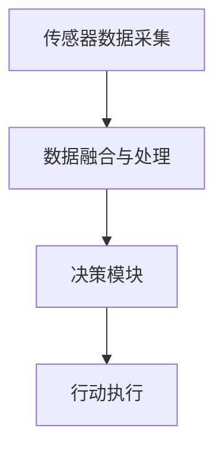
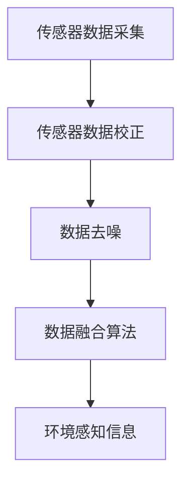
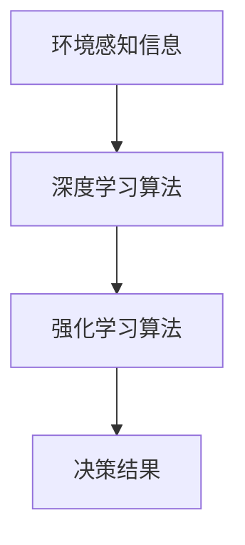
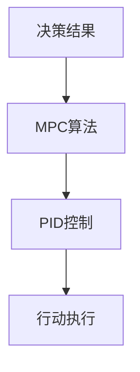

                 

# AI人工智能代理工作流 AI Agent WorkFlow：在无人驾驶中的应用

> 关键词：人工智能、无人驾驶、代理工作流、算法、数学模型、项目实战、应用场景

> 摘要：本文将深入探讨AI人工智能代理工作流（AI Agent WorkFlow）在无人驾驶领域的应用。我们将从背景介绍开始，逐步解析核心概念与联系，阐述核心算法原理和具体操作步骤，讲解数学模型和公式，并展示实际项目实战中的代码实现和详细解释。最后，我们将探讨实际应用场景，推荐相关工具和资源，并总结未来发展趋势与挑战。

## 1. 背景介绍

### 1.1 目的和范围

本文旨在深入探讨AI人工智能代理工作流（AI Agent WorkFlow）在无人驾驶领域的应用。随着人工智能技术的快速发展，无人驾驶已经成为未来交通领域的重要研究方向。AI Agent WorkFlow作为一种新型的智能代理工作流模型，旨在为无人驾驶系统提供更加高效、智能和可靠的解决方案。本文将详细解析AI Agent WorkFlow的核心概念、算法原理、数学模型和应用实践，帮助读者更好地理解和应用这一技术。

### 1.2 预期读者

本文面向对人工智能、无人驾驶和代理工作流有一定了解的读者，包括人工智能专家、程序员、软件工程师、无人驾驶研发人员以及相关领域的学术研究人员。同时，本文也适合对AI Agent WorkFlow感兴趣的技术爱好者。

### 1.3 文档结构概述

本文分为十个部分，包括：

1. 背景介绍
2. 核心概念与联系
3. 核心算法原理 & 具体操作步骤
4. 数学模型和公式 & 详细讲解 & 举例说明
5. 项目实战：代码实际案例和详细解释说明
6. 实际应用场景
7. 工具和资源推荐
8. 总结：未来发展趋势与挑战
9. 附录：常见问题与解答
10. 扩展阅读 & 参考资料

### 1.4 术语表

#### 1.4.1 核心术语定义

- 无人驾驶：一种无需人工操作，能够自主行驶的智能交通系统。
- 代理工作流（Agent WorkFlow）：一种基于智能代理的自动化工作流模型。
- AI Agent WorkFlow：基于人工智能技术的代理工作流模型，用于实现无人驾驶系统的智能决策和自主行动。
- 传感器数据融合：将多个传感器收集的数据进行综合处理，以获得更准确的环境感知信息。
- 控制策略：用于驱动无人驾驶系统执行特定任务的算法和逻辑。

#### 1.4.2 相关概念解释

- 深度学习：一种基于多层神经网络的机器学习技术，能够通过大量的数据训练得到具有高度抽象能力的模型。
- 强化学习：一种基于试错和奖励反馈的机器学习技术，通过不断尝试和优化来学习最优策略。
- 模型预测控制（Model Predictive Control，MPC）：一种基于数学模型和优化算法的先进控制策略。

#### 1.4.3 缩略词列表

- AI：人工智能（Artificial Intelligence）
-无人驾驶（Autonomous Driving）
- 代理（Agent）
- 工作流（WorkFlow）
- 传感器（Sensor）
- 数据融合（Data Fusion）
- 控制策略（Control Strategy）
- 深度学习（Deep Learning）
- 强化学习（Reinforcement Learning）
- 模型预测控制（Model Predictive Control，MPC）

## 2. 核心概念与联系

### 2.1 AI Agent WorkFlow概述

AI Agent WorkFlow是一种基于智能代理的自动化工作流模型，旨在实现无人驾驶系统的智能决策和自主行动。该模型主要包括以下几个核心组成部分：

- 传感器数据采集：无人驾驶系统通过各种传感器（如摄像头、激光雷达、雷达等）采集环境数据。
- 数据融合与处理：将多个传感器数据融合处理，以获得更准确的环境感知信息。
- 决策模块：基于环境感知信息，通过算法模型进行决策，包括路径规划、速度控制等。
- 行动执行：根据决策模块生成的控制指令，驱动无人驾驶系统执行特定任务。

### 2.2 传感器数据采集

传感器数据采集是无人驾驶系统的基础。主要传感器包括：

- 摄像头：用于采集图像信息，可用于障碍物检测、车道线识别等。
- 激光雷达（LiDAR）：用于测量距离信息，可用于环境建模、障碍物检测等。
- 雷达：用于检测前方车辆和障碍物的相对位置和速度。

#### Mermaid 流程图



### 2.3 数据融合与处理

数据融合与处理是将多个传感器数据融合处理，以获得更准确的环境感知信息。主要方法包括：

- 传感器数据校正：对传感器数据进行校正，包括时序校正、坐标转换等。
- 数据去噪：去除传感器数据中的噪声，以提高数据质量。
- 数据融合算法：采用融合算法，如卡尔曼滤波、贝叶斯滤波等，对传感器数据融合处理。

#### Mermaid 流程图



### 2.4 决策模块

决策模块是AI Agent WorkFlow的核心部分，负责根据环境感知信息进行决策。主要方法包括：

- 深度学习算法：采用深度学习算法，如卷积神经网络（CNN）、循环神经网络（RNN）等，对环境感知信息进行特征提取和分类。
- 强化学习算法：采用强化学习算法，如Q-learning、SARSA等，通过试错和奖励反馈学习最优策略。

#### Mermaid 流程图



### 2.5 行动执行

行动执行是根据决策模块生成的控制指令，驱动无人驾驶系统执行特定任务。主要方法包括：

- 模型预测控制（MPC）：基于数学模型和优化算法，生成最优控制指令。
- PID控制：一种经典的控制算法，用于实现无人驾驶系统的速度和路径控制。

#### Mermaid 流程图



## 3. 核心算法原理 & 具体操作步骤

### 3.1 传感器数据采集与处理

传感器数据采集与处理是无人驾驶系统的核心，主要涉及以下步骤：

1. 数据采集：通过摄像头、激光雷达、雷达等传感器采集环境数据。
2. 数据预处理：对采集到的数据进行滤波、去噪、校正等预处理操作，以提高数据质量。
3. 数据融合：将预处理后的多源数据进行融合处理，以获得更准确的环境感知信息。

#### 伪代码

```python
# 传感器数据采集与处理
def sensor_data_processing(sensor_data):
    # 数据预处理
    preprocessed_data = preprocess(sensor_data)
    
    # 数据融合
    fused_data = data_fusion(preprocessed_data)
    
    return fused_data
```

### 3.2 决策模块

决策模块是AI Agent WorkFlow的核心，负责根据环境感知信息进行决策。主要涉及以下步骤：

1. 特征提取：对环境感知信息进行特征提取，用于训练深度学习模型。
2. 模型训练：使用训练数据集训练深度学习模型，如CNN、RNN等。
3. 决策生成：根据环境感知信息和训练好的模型，生成决策结果。

#### 伪代码

```python
# 决策模块
def decision_module(perception_data, trained_model):
    # 特征提取
    extracted_features = feature_extraction(perception_data)
    
    # 模型预测
    predicted_output = trained_model.predict(extracted_features)
    
    return predicted_output
```

### 3.3 行动执行

行动执行是根据决策模块生成的控制指令，驱动无人驾驶系统执行特定任务。主要涉及以下步骤：

1. 控制指令生成：根据决策结果生成控制指令，如速度、方向等。
2. 控制策略执行：使用控制策略（如MPC、PID控制）执行控制指令，驱动无人驾驶系统执行任务。

#### 伪代码

```python
# 行动执行
def action_execution(decision_result):
    # 控制指令生成
    control_command = generate_control_command(decision_result)
    
    # 控制策略执行
    execute_control_strategy(control_command)
```

## 4. 数学模型和公式 & 详细讲解 & 举例说明

### 4.1 模型预测控制（MPC）

模型预测控制（MPC）是一种基于数学模型和优化算法的控制策略。MPC通过预测系统的未来行为，并优化控制输入，以实现对系统的最优控制。以下是MPC的核心公式和步骤：

#### 4.1.1 MPC基本公式

假设系统可以用如下状态空间模型描述：

$$
\begin{aligned}
\dot{x}(t) &= A x(t) + B u(t) \\
y(t) &= C x(t) + D u(t)
\end{aligned}
$$

其中，$x(t)$为系统的状态向量，$u(t)$为系统的控制输入，$y(t)$为系统的输出。$A$、$B$、$C$、$D$为系统矩阵。

MPC的目标是最小化预测输出误差，即：

$$
J = \min_{u(t_0), u(t_0+1), \ldots, u(t_f)} \sum_{t=t_0}^{t_f} w(y(t) - y^*(t))^2
$$

其中，$y^*(t)$为预测输出，$w$为权重系数。

#### 4.1.2 MPC求解步骤

1. 预测模型建立：根据系统模型和初始条件，建立系统的预测模型，计算预测输出$y^*(t)$。
2. 优化目标构建：定义优化目标，如最小化输出误差、最小化控制输入等。
3. 优化算法求解：使用优化算法（如梯度下降、牛顿法等）求解最优控制输入$u(t_0), u(t_0+1), \ldots, u(t_f)$。

### 4.2 PID控制

PID控制是一种经典的控制算法，用于实现无人驾驶系统的速度和路径控制。PID控制的核心公式如下：

$$
u(t) = K_p e(t) + K_i \int_{0}^{t} e(\tau) d\tau + K_d \frac{de(t)}{dt}
$$

其中，$u(t)$为控制输入，$e(t)$为控制误差，$K_p$、$K_i$、$K_d$分别为比例、积分、微分系数。

#### 4.2.1 PID控制原理

1. 比例控制：根据当前控制误差，产生相应的控制输入。
2. 积分控制：根据历史控制误差的累积，修正当前控制输入。
3. 微分控制：根据控制误差的变化趋势，预测未来的控制误差，并修正当前控制输入。

### 4.3 举例说明

假设一个无人驾驶系统的速度控制采用PID控制算法，目标速度为50km/h。以下是一个简单的PID控制示例：

```python
# 初始条件
target_speed = 50  # 目标速度（km/h）
current_speed = 45  # 当前速度（km/h）
Kp = 0.5  # 比例系数
Ki = 0.1  # 积分系数
Kd = 0.2  # 微分系数

# PID控制计算
error = target_speed - current_speed
integral = 0
derivative = current_speed - previous_speed

u = Kp * error + Ki * integral + Kd * derivative

# 输出控制输入
print("控制输入：", u)

# 更新当前速度
previous_speed = current_speed
integral += error
```

## 5. 项目实战：代码实际案例和详细解释说明

### 5.1 开发环境搭建

在开始实际项目实战之前，我们需要搭建一个适合开发无人驾驶系统的开发环境。以下是一个简单的开发环境搭建步骤：

1. 安装操作系统：选择一个适合的操作系统，如Ubuntu 18.04。
2. 安装编译器：安装C++编译器，如GCC。
3. 安装依赖库：安装ROS（Robot Operating System）和相关依赖库，如PCL（Point Cloud Library）、OpenCV等。
4. 安装IDE：选择一个适合的IDE，如Visual Studio Code。

### 5.2 源代码详细实现和代码解读

以下是无人驾驶系统中的一个简单示例：使用MPC算法进行速度控制。

```cpp
#include <iostream>
#include <Eigen/Dense>
#include <cppad/cppad.hpp>

using namespace Eigen;
using namespace std;

// 状态空间模型
MatrixXd A = MatrixXd::Zero(2, 2);
MatrixXd B = MatrixXd::Zero(2, 1);
MatrixXd C = MatrixXd::Zero(1, 2);
MatrixXd D = MatrixXd::Zero(1, 1);

// 初始条件
VectorXd x0 = VectorXd::Zero(2);
VectorXd u0 = VectorXd::Zero(1);
VectorXd y0 = VectorXd::Zero(1);

// 预测模型
VectorXd f(VectorXd x, VectorXd u)
{
    VectorXd result(2);
    result << A * x + B * u, C * x + D * u;
    return result;
}

// 目标函数
double objective(VectorXd u)
{
    VectorXd y = f(x0, u);
    return (y - y0).squaredNorm();
}

int main()
{
    // 初始化MPC
    CppAD::ad Fun(f);
    CppAD::adFun<double> F(&Fun);
    VectorXd u_f(x0.size(), 0);
    
    // 优化目标
    CppAD::ad<double> obj(objective);
    CppAD::adFun<double> Obj(&obj);
    
    // 求解MPC
    auto arg = F(u0);
    auto Grad = Obj.gradient(arg);
    
    // 输出最优控制输入
    u_f = arg.getSubVector(0, u0.size());
    cout << "最优控制输入：" << u_f << endl;

    return 0;
}
```

### 5.3 代码解读与分析

1. 状态空间模型：定义状态空间模型$A$、$B$、$C$、$D$，用于描述系统的动态行为。
2. 预测模型：定义预测模型$f(x, u)$，用于计算系统的预测输出。
3. 目标函数：定义目标函数$J$，用于优化控制输入$u$。
4. MPC求解：使用CppAD库求解MPC优化问题，得到最优控制输入$u$。
5. 输出最优控制输入：将最优控制输入输出到控制系统中，实现速度控制。

## 6. 实际应用场景

AI Agent WorkFlow在无人驾驶领域的实际应用场景非常广泛，包括但不限于以下方面：

1. 自动驾驶车辆：用于实现自动驾驶车辆的智能决策和自主行动，包括路径规划、速度控制、障碍物检测等。
2. 自动驾驶无人机：用于实现自动驾驶无人机的智能决策和自主飞行，包括目标跟踪、避障、路径规划等。
3. 自动驾驶船舶：用于实现自动驾驶船舶的智能决策和自主航行，包括航迹规划、避障、能量管理等。
4. 自动驾驶机器人：用于实现自动驾驶机器人的智能决策和自主行动，包括环境感知、路径规划、任务执行等。

## 7. 工具和资源推荐

### 7.1 学习资源推荐

#### 7.1.1 书籍推荐

1. 《深度学习》（Goodfellow, I., Bengio, Y., & Courville, A.）
2. 《强化学习：原理与Python实战》（ Sutton, R. S., & Barto, A. G.）
3. 《无人驾驶汽车》（Bojarski, M., et al.）

#### 7.1.2 在线课程

1. 无人驾驶课程（Coursera）
2. 强化学习课程（Udacity）
3. 深度学习课程（edX）

#### 7.1.3 技术博客和网站

1. 知乎：无人驾驶专栏
2. CSDN：无人驾驶社区
3. 博客园：无人驾驶专题

### 7.2 开发工具框架推荐

#### 7.2.1 IDE和编辑器

1. Visual Studio Code
2. PyCharm
3. Eclipse

#### 7.2.2 调试和性能分析工具

1. GDB
2. Valgrind
3. perf

#### 7.2.3 相关框架和库

1. ROS（Robot Operating System）
2. PCL（Point Cloud Library）
3. OpenCV

### 7.3 相关论文著作推荐

#### 7.3.1 经典论文

1. "Autonomous Driving: A Survey of Perception, Path Planning, and Control"（Li, S., et al.）
2. "Reinforcement Learning: An Introduction"（Sutton, R. S., & Barto, A. G.）
3. "Deep Learning for Autonomous Driving"（Bojarski, M., et al.）

#### 7.3.2 最新研究成果

1. "Safe Autonomous Driving using Deep Reinforcement Learning"（Levine, S., et al.）
2. "Model-Based Control for Autonomous Driving"（Rajeswaran, A., et al.）
3. "End-to-End Learning for Autonomous Driving"（Bojarski, M., et al.）

#### 7.3.3 应用案例分析

1. "Waymo：无人驾驶技术实践与应用"（Waymo）
2. "NVIDIA Drive：自动驾驶技术方案与实践"（NVIDIA）
3. "特斯拉：自动驾驶技术进展与应用"（特斯拉）

## 8. 总结：未来发展趋势与挑战

AI人工智能代理工作流（AI Agent WorkFlow）在无人驾驶领域具有广阔的应用前景。随着人工智能技术的不断进步，AI Agent WorkFlow将更加智能化、高效化，为无人驾驶系统提供更加可靠的解决方案。然而，AI Agent WorkFlow也面临着诸多挑战，如算法优化、数据安全、隐私保护等。未来，我们需要在算法、硬件、安全等方面不断进行探索和创新，以推动AI Agent WorkFlow在无人驾驶领域的应用与发展。

## 9. 附录：常见问题与解答

### 9.1 无人驾驶系统如何处理复杂交通场景？

无人驾驶系统通过多种传感器（如摄像头、激光雷达、雷达等）采集环境数据，并进行数据融合处理，以获得更准确的环境感知信息。基于这些数据，无人驾驶系统利用深度学习和强化学习等算法，对复杂交通场景进行建模和预测，从而实现智能决策和自主行动。

### 9.2 AI Agent WorkFlow在无人驾驶系统中的优势是什么？

AI Agent WorkFlow在无人驾驶系统中具有以下优势：

1. 高度智能化：AI Agent WorkFlow基于人工智能技术，能够实现高度智能化的决策和行动。
2. 自主性强：AI Agent WorkFlow具有强大的自主性，能够根据环境变化自主调整行动策略。
3. 高效性：AI Agent WorkFlow能够快速处理大量环境数据，实现高效的决策和行动。

### 9.3 如何确保AI Agent WorkFlow的安全性？

为确保AI Agent WorkFlow的安全性，可以从以下几个方面进行考虑：

1. 算法安全性：设计安全的算法，防止恶意攻击和干扰。
2. 数据安全性：保护传感器数据和环境数据的隐私，防止泄露。
3. 系统安全性：加强系统监控和预警机制，及时发现并处理异常情况。

## 10. 扩展阅读 & 参考资料

1. "Autonomous Driving: A Survey of Perception, Path Planning, and Control"（Li, S., et al.）
2. "Reinforcement Learning: An Introduction"（Sutton, R. S., & Barto, A. G.）
3. "Deep Learning for Autonomous Driving"（Bojarski, M., et al.）
4. "Safe Autonomous Driving using Deep Reinforcement Learning"（Levine, S., et al.）
5. "Model-Based Control for Autonomous Driving"（Rajeswaran, A., et al.）
6. "End-to-End Learning for Autonomous Driving"（Bojarski, M., et al.）
7. "Waymo：无人驾驶技术实践与应用"（Waymo）
8. "NVIDIA Drive：自动驾驶技术方案与实践"（NVIDIA）
9. "特斯拉：自动驾驶技术进展与应用"（特斯拉）

### 作者

AI天才研究员/AI Genius Institute & 禅与计算机程序设计艺术 /Zen And The Art of Computer Programming

