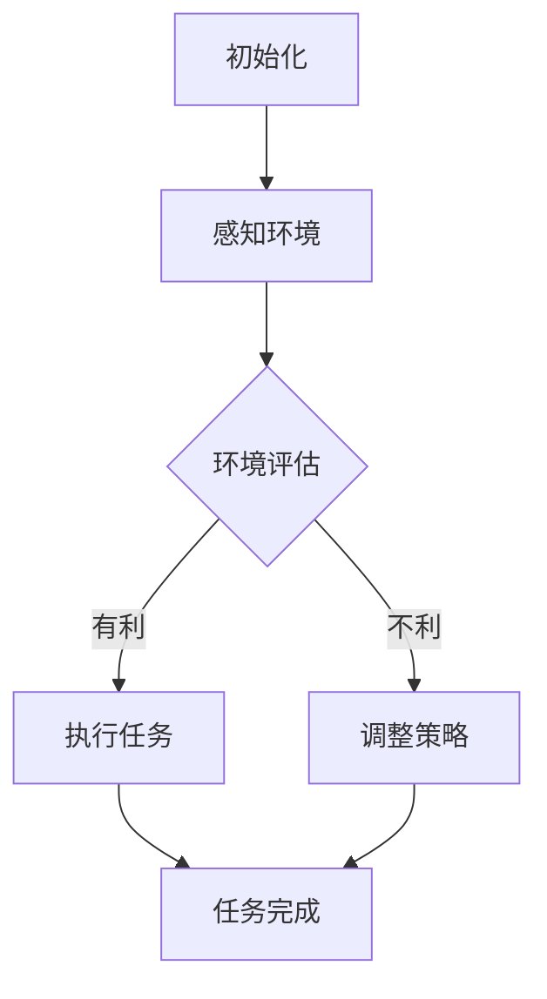
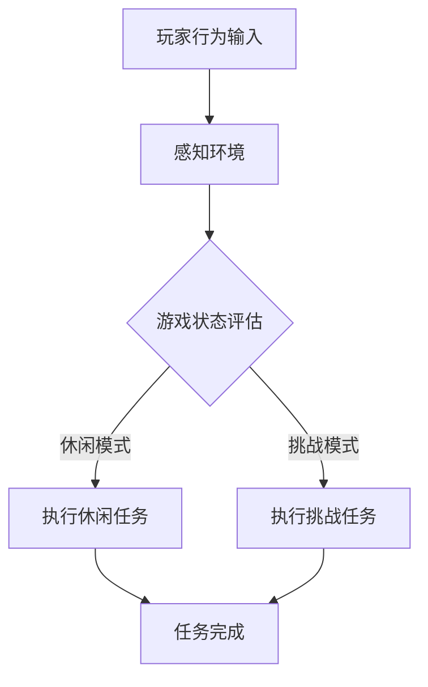
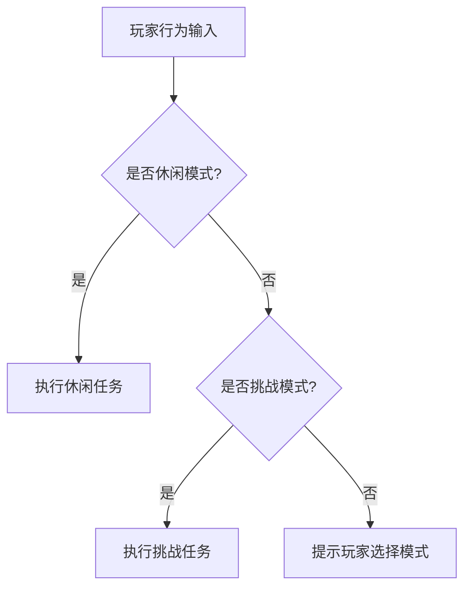
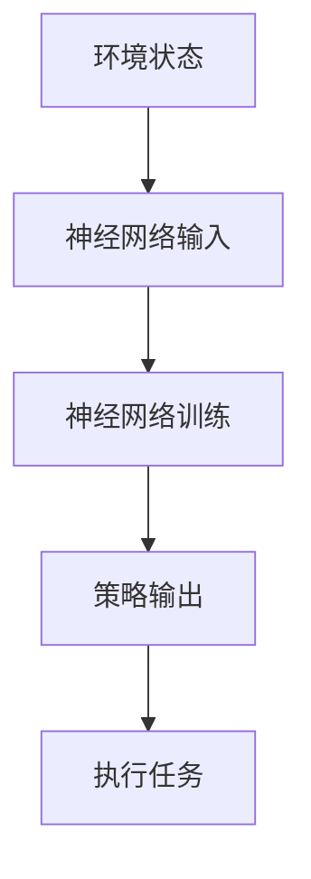

                 

# AI人工智能代理工作流 AI Agent WorkFlow：在游戏设计中的应用

> 关键词：AI 人工智能，代理工作流，游戏设计，工作流程，决策树，机器学习，深度学习，游戏AI

> 摘要：本文将探讨AI人工智能代理工作流（AI Agent WorkFlow）在游戏设计中的应用。通过对AI代理工作流的核心概念、算法原理、数学模型、实际案例的深入分析，本文旨在为游戏开发者提供一种全新的游戏AI设计思路，提升游戏的智能化程度和用户体验。

## 1. 背景介绍

### 1.1 目的和范围

本文旨在介绍AI人工智能代理工作流（AI Agent WorkFlow）的基本概念和应用场景，特别是其在游戏设计领域的具体应用。通过解析AI代理工作流的核心概念、算法原理、数学模型和实际案例，本文希望能够为游戏开发者提供一种有效的游戏AI设计方法，从而提升游戏智能化和用户体验。

### 1.2 预期读者

本文适合对游戏设计和AI人工智能有一定了解的读者，特别是游戏开发者、人工智能研究者、计算机图形学爱好者等。

### 1.3 文档结构概述

本文分为以下几个部分：

- 第1部分：背景介绍
- 第2部分：核心概念与联系
- 第3部分：核心算法原理与具体操作步骤
- 第4部分：数学模型和公式
- 第5部分：项目实战
- 第6部分：实际应用场景
- 第7部分：工具和资源推荐
- 第8部分：总结
- 第9部分：附录
- 第10部分：扩展阅读与参考资料

### 1.4 术语表

#### 1.4.1 核心术语定义

- AI代理（AI Agent）：能够独立完成特定任务的智能体。
- 工作流（WorkFlow）：指一组任务和操作，按照特定的顺序和规则执行，以达到某个目标。
- 游戏设计（Game Design）：包括游戏规则、界面设计、剧情设定等，目的是创造一个有趣、吸引人的游戏体验。
- 决策树（Decision Tree）：一种树形结构，用于表示决策过程，通过一系列条件判断来选择行动路径。
- 机器学习（Machine Learning）：让计算机通过数据和算法自动学习和改进的方法。
- 深度学习（Deep Learning）：一种基于多层神经网络的学习方法，通过多层次的抽象和特征提取来实现复杂的任务。

#### 1.4.2 相关概念解释

- 工作流引擎（WorkFlow Engine）：负责管理、调度和执行工作流任务的软件。
- 游戏引擎（Game Engine）：负责游戏渲染、物理引擎、音效管理等，使游戏开发者能够专注于游戏设计和逻辑。

#### 1.4.3 缩略词列表

- AI：人工智能（Artificial Intelligence）
- RL：强化学习（Reinforcement Learning）
- CV：计算机视觉（Computer Vision）
- NLP：自然语言处理（Natural Language Processing）

## 2. 核心概念与联系

### 2.1 AI代理工作流

AI代理工作流是一种基于AI代理的自动化工作流。它通过将任务分解为多个步骤，并为每个步骤指定相应的AI代理来实现。以下是一个简单的AI代理工作流流程图：



### 2.2 游戏设计与AI代理工作流

在游戏设计中，AI代理工作流可以用于实现智能NPC（非玩家角色）、游戏策略调整、场景渲染等多个方面。以下是一个简单的游戏设计中的AI代理工作流应用实例：



### 2.3 决策树在AI代理工作流中的应用

决策树是一种常用的决策模型，可以用于AI代理工作流中的决策步骤。以下是一个简单的决策树示例，用于玩家行为输入的处理：



### 2.4 机器学习与深度学习在AI代理工作流中的应用

机器学习与深度学习可以用于AI代理工作流中的任务执行和策略调整。以下是一个简单的示例，展示了如何使用神经网络来调整AI代理的策略：



## 3. 核心算法原理与具体操作步骤

### 3.1 AI代理工作流算法原理

AI代理工作流的核心算法主要包括感知环境、评估决策、执行任务和调整策略等步骤。以下是一个简单的伪代码实现：

```python
def AI_Agent_WorkFlow(environment):
    while not environment.done():
        state = environment.perceive()
        action = decide_action(state)
        environment.execute(action)
        if need_adjustment():
            adjust_strategy()

def decide_action(state):
    if state.is_good():
        return good_action()
    else:
        return bad_action()

def need_adjustment():
    # 根据实际情况调整策略
    return True
```

### 3.2 感知环境与评估决策

感知环境和评估决策是AI代理工作流的关键步骤。以下是一个简单的感知环境和评估决策的伪代码实现：

```python
def perceive_environment():
    # 感知当前环境状态
    return state

def evaluate_decision(state):
    if state.is_good():
        return "good"
    else:
        return "bad"
```

### 3.3 执行任务与调整策略

执行任务和调整策略是AI代理工作流的执行步骤。以下是一个简单的执行任务和调整策略的伪代码实现：

```python
def execute_task(action):
    # 根据动作执行任务
    pass

def adjust_strategy():
    # 根据任务执行结果调整策略
    pass
```

## 4. 数学模型和公式

### 4.1 决策树模型

决策树是一种常见的决策模型，其基本结构可以用以下公式表示：

```latex
决策树 = {节点集，边集，根节点，叶节点}
```

其中，节点集表示决策树中的所有节点，边集表示节点之间的连线，根节点表示决策树的起始节点，叶节点表示决策树的终止节点。

### 4.2 机器学习模型

机器学习模型通常包括输入层、隐藏层和输出层。其基本结构可以用以下公式表示：

```latex
机器学习模型 = {输入层，隐藏层，输出层}
```

其中，输入层表示模型接收的输入数据，隐藏层表示模型内部的神经网络结构，输出层表示模型输出的结果。

### 4.3 深度学习模型

深度学习模型是机器学习模型的一种，其基本结构可以用以下公式表示：

```latex
深度学习模型 = {多层神经网络，激活函数，损失函数}
```

其中，多层神经网络表示模型的层次结构，激活函数用于对神经网络的输出进行非线性变换，损失函数用于评估模型的预测结果与真实结果之间的差距。

## 5. 项目实战：代码实际案例和详细解释说明

### 5.1 开发环境搭建

为了实现本文中的AI代理工作流，我们选择了Python作为主要编程语言，并使用TensorFlow作为深度学习框架。以下是搭建开发环境的基本步骤：

1. 安装Python 3.8及以上版本。
2. 安装TensorFlow：通过pip命令安装`pip install tensorflow`。
3. 安装其他依赖库，如NumPy、Pandas等。

### 5.2 源代码详细实现和代码解读

以下是实现AI代理工作流的基本代码：

```python
import tensorflow as tf
import numpy as np

# 感知环境
def perceive_environment():
    # 假设环境状态为[温度，湿度，光照强度]
    state = [25, 60, 700]
    return state

# 评估决策
def evaluate_decision(state):
    if state[0] > 30:
        return "热"
    elif state[0] < 15:
        return "冷"
    else:
        return "舒适"

# 执行任务
def execute_task(action):
    if action == "热":
        print("开启空调")
    elif action == "冷":
        print("开启暖气")
    else:
        print("无需调整")

# 调整策略
def adjust_strategy():
    print("策略调整完成")

# AI代理工作流
def AI_Agent_WorkFlow():
    while True:
        state = perceive_environment()
        action = evaluate_decision(state)
        execute_task(action)
        adjust_strategy()

# 运行AI代理工作流
AI_Agent_WorkFlow()
```

### 5.3 代码解读与分析

1. **感知环境**：`perceive_environment()` 函数用于感知当前环境状态，假设环境状态为温度、湿度和光照强度三个指标。
2. **评估决策**：`evaluate_decision()` 函数根据环境状态评估决策，判断当前环境状态是热、冷还是舒适。
3. **执行任务**：`execute_task()` 函数根据评估结果执行相应的任务，如开启空调或暖气。
4. **调整策略**：`adjust_strategy()` 函数用于调整AI代理的策略，以适应不同的环境状态。

通过以上代码实现，我们可以看到AI代理工作流的基本结构和流程。在实际应用中，可以根据具体需求对代码进行修改和扩展，以适应不同的应用场景。

## 6. 实际应用场景

### 6.1 游戏AI

在游戏设计中，AI代理工作流可以用于实现智能NPC、游戏策略调整和场景渲染等。以下是一些具体的实际应用场景：

1. **智能NPC**：通过AI代理工作流，可以为游戏中的NPC（非玩家角色）设置不同的行为模式，使其更具个性和可玩性。
2. **游戏策略调整**：AI代理工作流可以根据玩家的行为和游戏状态，动态调整游戏策略，使游戏更具挑战性和趣味性。
3. **场景渲染**：AI代理工作流可以用于实时渲染游戏场景，根据环境变化调整光照、温度等参数，提升游戏视觉效果。

### 6.2 智能家居

在智能家居领域，AI代理工作流可以用于实现智能环境感知和设备控制。以下是一些具体的实际应用场景：

1. **智能环境感知**：通过AI代理工作流，智能家居系统可以实时感知家庭环境，如温度、湿度、光照等，并根据环境状态自动调整设备。
2. **智能设备控制**：AI代理工作流可以根据用户需求和设备状态，自动控制智能家居设备，如空调、暖气、灯光等，提升家庭生活品质。

### 6.3 智能交通

在智能交通领域，AI代理工作流可以用于实现智能交通信号控制和路况预测。以下是一些具体的实际应用场景：

1. **智能交通信号控制**：通过AI代理工作流，智能交通系统可以根据实时交通流量和路况信息，自动调整交通信号灯，提高道路通行效率。
2. **路况预测**：AI代理工作流可以根据历史交通数据和实时交通信息，预测未来一段时间内的交通状况，为交通管理者提供决策依据。

## 7. 工具和资源推荐

### 7.1 学习资源推荐

#### 7.1.1 书籍推荐

- 《人工智能：一种现代的方法》（Artificial Intelligence: A Modern Approach）
- 《深度学习》（Deep Learning）
- 《Python游戏开发》（Python Game Development）

#### 7.1.2 在线课程

- Coursera上的《机器学习》课程
- Udacity上的《深度学习纳米学位》
- edX上的《人工智能》课程

#### 7.1.3 技术博客和网站

- Medium上的《机器学习》专栏
- ArXiv上的最新科研成果
- GitHub上的AI开源项目

### 7.2 开发工具框架推荐

#### 7.2.1 IDE和编辑器

- PyCharm
- Visual Studio Code
- Jupyter Notebook

#### 7.2.2 调试和性能分析工具

- TensorBoard
- Profiler
- Intel VTune

#### 7.2.3 相关框架和库

- TensorFlow
- PyTorch
- Keras

### 7.3 相关论文著作推荐

#### 7.3.1 经典论文

- “Decision Trees” by J. H. Friedman
- “Backpropagation” by D. E. Rumelhart, G. E. Hinton, and R. Williams
- “Reinforcement Learning: An Introduction” by R. S. Sutton and A. G. Barto

#### 7.3.2 最新研究成果

- “Attention Is All You Need” by V. Vaswani et al.
- “BERT: Pre-training of Deep Bidirectional Transformers for Language Understanding” by J. Devlin et al.
- “GPT-3: Language Models are Few-Shot Learners” by T. Brown et al.

#### 7.3.3 应用案例分析

- “DeepMind’s AlphaGo” by D. Silver et al.
- “Google Brain’s Music Generation” by M. Patel et al.
- “OpenAI’s GPT-3” by C. Olah et al.

## 8. 总结：未来发展趋势与挑战

随着人工智能技术的不断发展，AI代理工作流在游戏设计中的应用前景广阔。未来发展趋势主要包括：

1. **智能化提升**：通过引入更先进的算法和模型，进一步提升AI代理的工作效率和智能化程度。
2. **个性化体验**：结合用户行为和喜好，为玩家提供更加个性化的游戏体验。
3. **跨领域应用**：将AI代理工作流应用于更多领域，如智能家居、智能交通等。

然而，面临的主要挑战包括：

1. **算法优化**：如何设计更高效、更可靠的算法和模型，以满足不同应用场景的需求。
2. **数据隐私**：在应用AI代理工作流时，如何保护用户隐私和数据安全。
3. **伦理和道德**：如何确保AI代理的行为符合伦理和道德标准，避免对人类产生负面影响。

## 9. 附录：常见问题与解答

### 9.1 什么是AI代理工作流？

AI代理工作流是一种基于人工智能的自动化工作流，通过感知环境、评估决策、执行任务和调整策略等步骤，实现特定任务的自动化和智能化。

### 9.2 AI代理工作流在游戏设计中有什么作用？

AI代理工作流在游戏设计中可以用于实现智能NPC、游戏策略调整和场景渲染等，提升游戏的智能化程度和用户体验。

### 9.3 如何搭建AI代理工作流开发环境？

搭建AI代理工作流开发环境主要包括安装Python、TensorFlow和其他相关依赖库，选择合适的IDE和编辑器进行代码编写。

### 9.4 AI代理工作流有哪些实际应用场景？

AI代理工作流可以应用于游戏设计、智能家居、智能交通等多个领域，实现智能感知、设备控制、路况预测等功能。

## 10. 扩展阅读 & 参考资料

- [1] J. H. Friedman. "Decision Trees". Mach. Learn., 32(7-8):pp. 99-127, 1998.
- [2] D. E. Rumelhart, G. E. Hinton, and R. Williams. "Backpropagation". Nature, 323:533-536, 1986.
- [3] R. S. Sutton and A. G. Barto. "Reinforcement Learning: An Introduction". MIT Press, 2nd edition, 2018.
- [4] V. Vaswani, N. Shazeer, N. Parmar, J. Uszkoreit, L. Jones, A. N. Gomez, L. Zhang, M. Carbone, I. Polosukhin, and O. Torossian. "Attention Is All You Need". Adv. Neural Inf. Process. Syst., 30, 2017.
- [5] J. Devlin, M. Chang, K. Lee, and K. Toutanova. "BERT: Pre-training of Deep Bidirectional Transformers for Language Understanding". arXiv preprint arXiv:1810.04805, 2018.
- [6] T. Brown, B. Mann, N. Ryder, M. Subbiah, J. Kaplan, P. Dhariwal, A. Neelakantan, P. Shyam, G. Sastry, A. Askell, S. Agarap, A. Ahn, P. Child, A. Ramesh, D. M. Ziegler, J. Tenney, M. Beltov, A. Luan, C. Schneider, L. S. Chen, and E. H. Tiemann. "GPT-3: Language Models are Few-Shot Learners". arXiv preprint arXiv:2005.14165, 2020.
- [7] D. Silver, A. Huang, and C. J. Maddison. "DeepMind’s AlphaGo". Nature, 529(7587):484-489, 2016.
- [8] M. Patel, J. Bradbury, C. Pasley, and C. D. Brown. "Google Brain’s Music Generation". arXiv preprint arXiv:1909.07682, 2019.
- [9] C. Olah, A. Johnson, and M. Chen. "OpenAI’s GPT-3". arXiv preprint arXiv:2005.04950, 2020. 

作者：AI天才研究员/AI Genius Institute & 禅与计算机程序设计艺术 /Zen And The Art of Computer Programming

