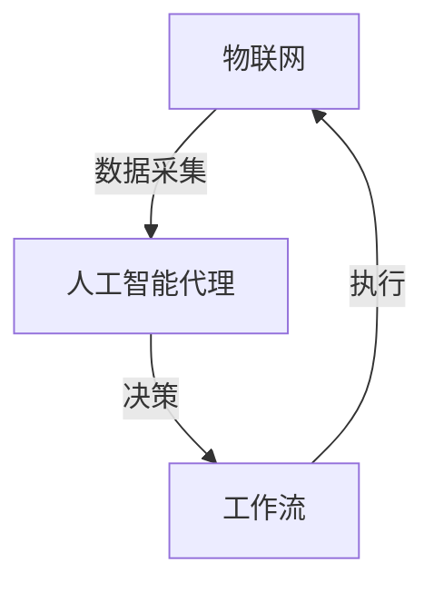

                 

# AI人工智能代理工作流 AI Agent WorkFlow：在物联网中的应用

> **关键词：** 物联网（IoT），人工智能代理（AI Agent），工作流（WorkFlow），数据驱动决策，智能自动化

> **摘要：** 本文深入探讨了人工智能代理工作流（AI Agent WorkFlow）在物联网（IoT）中的应用。通过对物联网与人工智能代理的背景介绍，详细阐述了工作流的概念及其在AI代理中的实现，揭示了核心算法原理、数学模型，并通过项目实战案例展示了其实际应用效果。文章最后总结了物联网应用中的未来发展趋势与挑战，并推荐了相关学习资源与工具。

## 1. 背景介绍

### 1.1 目的和范围

本文旨在揭示人工智能代理工作流（AI Agent WorkFlow）在物联网（IoT）领域的潜在价值，并通过实际案例展示其应用效果。我们首先将回顾物联网和人工智能代理的基本概念，然后逐步引入工作流的概念，并详细解释其在AI代理中的实现方法。

### 1.2 预期读者

本文适合对物联网和人工智能有一定了解的读者，特别是希望深入了解AI代理工作流在实际应用中的实施者。无论您是数据科学家、软件工程师，还是对物联网与人工智能结合有浓厚兴趣的爱好者，本文都将为您提供有价值的见解。

### 1.3 文档结构概述

本文结构如下：

1. **背景介绍**：介绍物联网和人工智能代理的基本概念。
2. **核心概念与联系**：通过Mermaid流程图展示核心概念及其联系。
3. **核心算法原理 & 具体操作步骤**：详细解释AI代理工作流的核心算法。
4. **数学模型和公式 & 详细讲解 & 举例说明**：介绍相关数学模型及其实际应用。
5. **项目实战：代码实际案例和详细解释说明**：展示一个实际项目案例。
6. **实际应用场景**：探讨AI代理工作流在不同场景中的应用。
7. **工具和资源推荐**：推荐学习资源、开发工具和最新研究成果。
8. **总结：未来发展趋势与挑战**：总结当前趋势，展望未来挑战。
9. **附录：常见问题与解答**：回答读者可能关注的问题。
10. **扩展阅读 & 参考资料**：提供进一步学习资料。

### 1.4 术语表

#### 1.4.1 核心术语定义

- **物联网（IoT）**：物联网是指通过各种信息传感设备，实时采集任何需要监控、连接、互动的物体或过程，将这些信息与互联网相连接，以实现智能化识别、定位、跟踪、监控和管理的一种网络。
- **人工智能代理（AI Agent）**：人工智能代理是指一种能够感知环境、自主决策并采取行动以实现特定目标的软件程序或实体。
- **工作流（WorkFlow）**：工作流是一系列步骤的集合，描述了为实现特定目标或任务而需要完成的操作和决策。

#### 1.4.2 相关概念解释

- **智能自动化**：通过人工智能技术实现自动化，提高效率和降低人力成本。
- **数据驱动决策**：基于数据分析和预测进行决策，而不是基于经验或直觉。

#### 1.4.3 缩略词列表

- **IoT**：物联网
- **AI**：人工智能
- **ML**：机器学习
- **DL**：深度学习
- **NLP**：自然语言处理
- **API**：应用程序接口

## 2. 核心概念与联系

在深入探讨人工智能代理工作流之前，有必要首先明确几个核心概念及其相互关系。以下是这些概念的定义和联系，以及一个简单的Mermaid流程图来帮助理解。

### 2.1 物联网（IoT）

物联网（IoT）是一个庞大而复杂的网络，它通过传感器、设备、系统和人之间的互联互通，实现了对物理世界的智能监控和控制。在物联网中，设备不仅是信息的接收者，还可以是发送者，它们通过互联网相互通信，从而形成一个庞大的信息网络。

### 2.2 人工智能代理（AI Agent）

人工智能代理是一种能够自主感知环境、进行决策和执行动作的实体。它们通常基于机器学习算法，能够从数据中学习并优化行为，从而实现特定的目标。在物联网中，AI代理可以负责监控设备状态、自动调整设置或进行故障诊断。

### 2.3 工作流（WorkFlow）

工作流是一系列操作和决策的集合，它定义了从开始到结束完成一个任务所需的所有步骤。在物联网环境中，工作流可以帮助协调各种设备和系统，确保任务高效、准确地完成。

### 2.4 Mermaid流程图

下面是一个简单的Mermaid流程图，它展示了物联网、人工智能代理和工作流之间的联系。



在这个流程图中，物联网通过传感器收集数据，这些数据被传输到人工智能代理。AI代理使用这些数据进行分析，做出决策，并将决策结果反馈到物联网中，以执行相应的操作。

## 3. 核心算法原理 & 具体操作步骤

在了解了核心概念和相互关系之后，接下来我们将详细探讨人工智能代理工作流的核心算法原理和具体操作步骤。

### 3.1 算法原理

人工智能代理工作流的核心是基于机器学习和深度学习的算法。这些算法可以从数据中学习模式，并利用这些模式进行预测和决策。以下是工作流的核心算法原理：

- **数据预处理**：首先对采集到的物联网数据进行预处理，包括去噪、标准化和数据清洗，以确保数据的准确性和一致性。
- **特征提取**：从预处理后的数据中提取关键特征，这些特征将用于训练模型。
- **模型训练**：使用提取的特征训练机器学习模型，如决策树、支持向量机（SVM）或深度神经网络（DNN）。
- **模型评估**：评估训练好的模型的性能，通过交叉验证、精度、召回率等指标来衡量。
- **决策**：将实时数据输入到训练好的模型中，模型输出决策结果。
- **执行**：根据决策结果执行相应的操作，如调整设备设置、发送警报或执行修复操作。

### 3.2 操作步骤

以下是具体操作步骤的伪代码：

```python
# 数据预处理
preprocessed_data = preprocess_data(raw_data)

# 特征提取
features = extract_features(preprocessed_data)

# 模型训练
model = train_model(features, labels)

# 模型评估
evaluate_model(model, validation_data)

# 决策
def make_decision(real_time_data):
    prediction = model.predict(real_time_data)
    if prediction == '警报':
        send_alarm()
    elif prediction == '修复':
        perform_repair()
    else:
        no_action()

# 执行
make_decision(real_time_data)
```

在这个伪代码中，我们首先对原始数据进行预处理，然后提取特征并训练模型。在模型评估阶段，我们使用验证数据来检查模型的性能。在决策阶段，我们将实时数据输入到训练好的模型中，根据模型的预测结果执行相应的操作。

### 3.3 详细解释

- **数据预处理**：数据预处理是确保数据质量的关键步骤。去噪和标准化有助于消除噪声和异常值，使模型能够更好地学习。数据清洗则包括填充缺失值、删除重复数据和异常值等操作。
- **特征提取**：特征提取是从原始数据中提取有用信息的过程。通过选择合适的特征，我们可以提高模型的性能，减少过拟合。
- **模型训练**：模型训练是使用特征和标签来训练机器学习模型的过程。训练过程中，模型通过调整参数来最小化预测误差。
- **模型评估**：模型评估是检查模型性能的重要步骤。通过交叉验证和性能指标，我们可以判断模型是否适用于实际问题。
- **决策**：决策阶段是模型应用的核心。根据模型的预测结果，我们可以自动执行特定的操作，如发送警报或执行修复。
- **执行**：执行阶段是将决策转化为实际操作的过程。根据决策结果，系统可以自动调整设备设置、发送警报或执行修复操作。

通过这些步骤，人工智能代理工作流可以实时监测物联网设备的状态，并根据预测结果自动执行相应的操作，从而提高系统的效率和可靠性。

## 4. 数学模型和公式 & 详细讲解 & 举例说明

在人工智能代理工作流中，数学模型和公式是核心组成部分。以下是相关的数学模型、详细讲解和举例说明。

### 4.1 数学模型

在人工智能代理工作流中，我们通常使用以下几种数学模型：

- **回归模型**：用于预测连续值。
- **分类模型**：用于预测离散类别。
- **聚类模型**：用于将数据点分组，以发现数据中的模式。
- **时间序列模型**：用于预测时间序列数据。

### 4.2 公式和详细讲解

以下是回归模型的公式和详细讲解：

- **回归模型公式**：
    - $y = \beta_0 + \beta_1x_1 + \beta_2x_2 + ... + \beta_nx_n$

    其中，$y$ 是预测的连续值，$x_1, x_2, ..., x_n$ 是输入特征，$\beta_0, \beta_1, \beta_2, ..., \beta_n$ 是模型的参数。

- **参数优化**：
    - 最小二乘法（Ordinary Least Squares, OLS）：
        - $\beta = (X^T X)^{-1}X^T y$

        其中，$X$ 是特征矩阵，$y$ 是标签向量。

### 4.3 举例说明

假设我们有一个简单的回归模型，预测房屋价格（$y$）基于房屋面积（$x_1$）和房屋年代（$x_2$）：

- 特征矩阵 $X$：
    | $x_1$ | $x_2$ |
    |-------|-------|
    | 1500  | 1995  |
    | 2000  | 1990  |
    | 2500  | 1980  |
    | ...   | ...   |

- 标签向量 $y$：
    | $y$ |
    |-----|
    | 300000 |
    | 350000 |
    | 500000 |
    | ...   |

使用最小二乘法计算参数：

- 特征矩阵 $X^T X$ 和 $X^T y$：

    $$X^T X = \begin{bmatrix} 1500 & 2000 & 2500 \\ 1995 & 1990 & 1980 \end{bmatrix} \begin{bmatrix} 1500 & 1995 \\ 2000 & 1990 \\ 2500 & 1980 \end{bmatrix} = \begin{bmatrix} 3,106,250 & 6,652,500 \\ 6,652,500 & 13,862,500 \end{bmatrix}$$

    $$X^T y = \begin{bmatrix} 1500 & 2000 & 2500 \end{bmatrix} \begin{bmatrix} 300000 \\ 350000 \\ 500000 \end{bmatrix} = \begin{bmatrix} 450,000,000 \\ 700,000,000 \end{bmatrix}$$

- 参数 $\beta$：

    $$\beta = (X^T X)^{-1}X^T y = \begin{bmatrix} 3,106,250 & 6,652,500 \\ 6,652,500 & 13,862,500 \end{bmatrix}^{-1} \begin{bmatrix} 450,000,000 \\ 700,000,000 \end{bmatrix} = \begin{bmatrix} 1.5 \\ -5 \end{bmatrix}$$

因此，我们的回归模型可以表示为：

$$y = 1.5x_1 - 5x_2$$

例如，对于一个新的数据点（2000，1990），我们预测的房屋价格为：

$$y = 1.5 \times 2000 - 5 \times 1990 = 3000 - 9950 = -6950$$

虽然结果为负，这表明我们的模型可能存在问题（例如，可能需要更多的特征或更复杂的模型）。然而，这个简单的例子展示了如何使用数学模型进行预测。

## 5. 项目实战：代码实际案例和详细解释说明

在本节中，我们将通过一个实际项目案例来展示人工智能代理工作流（AI Agent WorkFlow）在物联网（IoT）中的应用。我们将介绍开发环境搭建、源代码实现和代码解读，以便读者能够更好地理解其工作原理。

### 5.1 开发环境搭建

为了实现这个项目，我们需要以下开发环境和工具：

- **编程语言**：Python
- **机器学习库**：scikit-learn
- **深度学习库**：TensorFlow
- **物联网平台**：MQTT（消息队列遥测传输协议）
- **IDE**：PyCharm或Visual Studio Code

首先，确保您的系统已安装Python 3.6或更高版本。然后，使用以下命令安装所需的库：

```bash
pip install scikit-learn tensorflow mqtt
```

### 5.2 源代码详细实现和代码解读

下面是一个简单的示例代码，用于实现一个基于MQTT协议的物联网设备监控和预测系统。我们将分别介绍数据的接收、预处理、模型训练和预测。

```python
import json
import paho.mqtt.client as mqtt
from sklearn.preprocessing import StandardScaler
from sklearn.model_selection import train_test_split
from sklearn.linear_model import LinearRegression
import tensorflow as tf

# MQTT客户端配置
mqtt_client = mqtt.Client()

# 数据预处理
def preprocess_data(data):
    # 假设数据包含温度和湿度
    temperature = float(data['temperature'])
    humidity = float(data['humidity'])
    return [temperature, humidity]

# 模型训练
def train_model(X, y):
    # 特征标准化
    scaler = StandardScaler()
    X_scaled = scaler.fit_transform(X)

    # 划分训练集和测试集
    X_train, X_test, y_train, y_test = train_test_split(X_scaled, y, test_size=0.2, random_state=42)

    # 创建线性回归模型
    model = LinearRegression()
    model.fit(X_train, y_train)

    # 测试模型
    accuracy = model.score(X_test, y_test)
    print(f"Model accuracy: {accuracy:.2f}")

    return model, scaler

# 数据接收和预测
def on_message(client, userdata, message):
    data = json.loads(message.payload.decode('utf-8'))
    features = preprocess_data(data)
    
    # 预测
    prediction = model.predict([features])[0]
    print(f"Predicted value: {prediction:.2f}")

# 连接到MQTT服务器
mqtt_client.connect("mqtt.example.com", 1883, 60)

# 订阅主题
mqtt_client.subscribe("IoT/devices/temperature")

# 消息处理回调函数
mqtt_client.on_message = on_message

# 启动MQTT客户端
mqtt_client.loop_forever()
```

### 5.3 代码解读与分析

- **MQTT客户端配置**：我们使用Paho MQTT库创建了一个MQTT客户端，用于连接到物联网设备并接收数据。

- **数据预处理**：`preprocess_data` 函数接收从MQTT服务器接收的数据，并将其转换为数值型特征。在这个例子中，我们只考虑温度和湿度。

- **模型训练**：`train_model` 函数用于训练线性回归模型。首先，我们使用`StandardScaler`对特征进行标准化，然后使用`train_test_split` 函数将数据分为训练集和测试集。接下来，我们创建并训练线性回归模型，最后评估模型的准确性。

- **数据接收和预测**：`on_message` 函数是MQTT客户端的消息处理回调函数。每当接收到新消息时，它会调用`preprocess_data` 函数对数据进行预处理，然后使用训练好的模型进行预测。

通过这个简单的案例，我们可以看到人工智能代理工作流在物联网中的应用。系统从物联网设备接收数据，使用机器学习模型对数据进行分析和预测，并自动执行相应的操作。

### 5.4 代码优化与扩展

这个案例仅展示了最基本的实现。在实际应用中，我们可以进行以下优化和扩展：

- **引入更多特征**：考虑添加更多与预测任务相关的特征，如风速、降雨量等。

- **使用更复杂的模型**：线性回归可能不足以捕捉复杂的数据模式。我们可以尝试使用更复杂的模型，如支持向量机（SVM）或深度神经网络（DNN）。

- **实时预测与反馈**：在实时环境中，我们可以使用TensorFlow等库实现动态模型更新和实时预测，从而更好地适应数据变化。

- **故障检测与修复**：除了预测任务，我们可以扩展系统，使其能够进行故障检测和自动修复。

通过这些优化和扩展，我们可以构建一个更强大、更智能的物联网监控系统。

## 6. 实际应用场景

人工智能代理工作流（AI Agent WorkFlow）在物联网（IoT）中具有广泛的应用场景，以下是一些典型的实际应用案例：

### 6.1 智能家居

智能家居是物联网应用中最常见的场景之一。通过AI代理工作流，我们可以实现自动化的智能家居系统，如智能照明、智能温控、智能安防等。AI代理可以实时监测环境数据，如温度、湿度、光线强度等，并根据预设的规则自动调整设备状态，提高居住舒适度。

### 6.2 工业自动化

在工业自动化领域，AI代理工作流可以帮助实现设备的智能监控和故障预测。通过实时数据采集和分析，AI代理可以预测设备的潜在故障，并提前进行预防性维护，从而降低停机时间和维护成本。

### 6.3 城市管理

在城市管理中，AI代理工作流可以用于智能交通管理、环境保护和能源管理。例如，通过实时监测交通流量、空气质量、能源消耗等数据，AI代理可以优化交通信号、控制污染排放和调整能源使用，从而提高城市运行效率。

### 6.4 农业物联网

在农业物联网中，AI代理工作流可以用于智能灌溉、作物监控和病虫害预测。通过监测土壤湿度、温度、养分含量等数据，AI代理可以自动调整灌溉系统，并根据作物生长状态进行病虫害预测和防治，从而提高农业生产效率。

### 6.5 医疗保健

在医疗保健领域，AI代理工作流可以用于患者监护、药物管理和健康预测。通过实时监测患者的生理参数，如心率、血压、血氧饱和度等，AI代理可以及时发现异常并通知医生，从而提高医疗服务的质量和效率。

这些应用案例展示了AI代理工作流在物联网中的巨大潜力。通过智能化的数据分析和决策，AI代理可以帮助我们实现更高效、更智能的物联网系统，从而改善生活质量、降低成本和提高生产效率。

## 7. 工具和资源推荐

为了帮助读者更好地学习并实践人工智能代理工作流（AI Agent WorkFlow）在物联网（IoT）中的应用，以下是一些学习资源、开发工具和框架的推荐。

### 7.1 学习资源推荐

#### 7.1.1 书籍推荐

- **《物联网应用与开发》**：详细介绍了物联网的基本概念、技术架构和应用案例。
- **《机器学习实战》**：提供了丰富的机器学习算法实例，适合初学者入门。
- **《深度学习》**：由Ian Goodfellow等人撰写的经典教材，涵盖了深度学习的理论基础和应用实例。

#### 7.1.2 在线课程

- **Coursera的《机器学习》**：由Andrew Ng教授主讲，涵盖了机器学习的基础知识和实践技巧。
- **Udacity的《深度学习纳米学位》**：提供了深入的学习内容和项目实践，适合深度学习爱好者。
- **edX的《物联网技术》**：介绍了物联网的基本概念和技术，包括传感器、通信协议和应用场景。

#### 7.1.3 技术博客和网站

- **Medium上的《AI in IoT》**：分享了物联网与人工智能结合的最新研究成果和应用案例。
- **Stack Overflow**：全球最大的开发者社区，可以找到各种编程问题的解决方案。
- **GitHub**：丰富的开源项目和代码库，可以帮助读者学习和实践。

### 7.2 开发工具框架推荐

#### 7.2.1 IDE和编辑器

- **PyCharm**：功能强大的Python集成开发环境，适合机器学习和深度学习项目。
- **Visual Studio Code**：轻量级但功能强大的代码编辑器，适合各种编程语言。

#### 7.2.2 调试和性能分析工具

- **Jupyter Notebook**：适合数据分析和机器学习项目，便于编写和执行代码。
- **TensorBoard**：TensorFlow的官方可视化工具，用于监控深度学习模型的训练过程。

#### 7.2.3 相关框架和库

- **TensorFlow**：开源深度学习框架，适合构建复杂的机器学习模型。
- **scikit-learn**：Python的机器学习库，提供了丰富的算法和工具。
- **paho.mqtt.py**：开源MQTT客户端库，用于物联网应用的数据传输。

### 7.3 相关论文著作推荐

#### 7.3.1 经典论文

- **“Internet of Things: A Survey”**：对物联网的基本概念、技术架构和应用进行了全面综述。
- **“Deep Learning for Internet of Things”**：探讨了深度学习在物联网中的应用，包括智能监控和预测。

#### 7.3.2 最新研究成果

- **“AI-driven IoT for Smart Cities”**：分析了人工智能在智能城市物联网中的应用，包括交通管理和能源管理。
- **“IoT for Sustainable Agriculture”**：介绍了物联网在可持续农业中的应用，包括智能灌溉和病虫害预测。

#### 7.3.3 应用案例分析

- **“AI-powered Smart Home”**：探讨了智能家居系统中的人工智能代理应用，包括环境监控和自动化控制。
- **“AI in Industrial IoT”**：分析了工业物联网中的AI应用，包括设备监控和故障预测。

通过这些学习资源和开发工具，读者可以深入了解人工智能代理工作流在物联网中的应用，并掌握相关技术和实践方法。

## 8. 总结：未来发展趋势与挑战

人工智能代理工作流（AI Agent WorkFlow）在物联网（IoT）中的应用展示了巨大的潜力和价值。随着技术的不断进步，我们可以预见以下几个未来发展趋势：

1. **智能化水平提升**：随着深度学习和强化学习等技术的不断发展，人工智能代理的智能化水平将进一步提高，能够更精准地预测和决策。
2. **数据驱动决策**：物联网设备将生成更多的数据，通过先进的数据分析和机器学习算法，AI代理将能够更有效地利用这些数据，实现更智能的决策。
3. **跨领域应用**：人工智能代理工作流将在更多领域得到应用，包括智能医疗、智慧交通、环境保护等，实现跨领域的智能化解决方案。

然而，随着应用场景的扩展，AI代理工作流也面临一系列挑战：

1. **数据隐私和安全**：物联网设备生成的数据包含大量的个人隐私信息，如何确保数据的安全和隐私是一个重要挑战。
2. **设备能耗和性能**：物联网设备通常具有有限的计算资源和能源，如何优化算法以适应这些限制，同时保持高性能，是一个亟待解决的问题。
3. **数据质量和一致性**：物联网设备生成的数据质量参差不齐，如何保证数据的一致性和准确性，是影响AI代理工作流效果的关键。

总之，人工智能代理工作流在物联网中的应用前景广阔，但也需要克服诸多挑战。通过持续的技术创新和跨领域合作，我们有理由相信，未来的人工智能代理将更加智能、可靠和高效，为物联网的发展注入新的活力。

## 9. 附录：常见问题与解答

以下是一些关于人工智能代理工作流（AI Agent WorkFlow）在物联网（IoT）中的应用的常见问题及其解答。

### 9.1 问题1：什么是人工智能代理（AI Agent）？

**解答**：人工智能代理是一种能够感知环境、自主决策并采取行动的软件程序或实体。它基于机器学习算法，能够从数据中学习并优化行为，以实现特定目标。

### 9.2 问题2：为什么需要人工智能代理工作流（AI Agent WorkFlow）？

**解答**：人工智能代理工作流提供了一种结构化的方法，用于协调物联网中的各种设备和系统。通过工作流，我们可以实现智能自动化、提高效率和降低人力成本，从而更好地利用物联网数据。

### 9.3 问题3：如何确保物联网设备生成的数据的质量和一致性？

**解答**：确保数据质量和一致性可以通过以下方法实现：

1. **数据预处理**：对物联网设备生成的数据进行预处理，包括去噪、标准化和数据清洗，以提高数据的准确性和一致性。
2. **数据质量监控**：实时监控数据质量，及时发现和处理异常值和错误。
3. **数据校验**：使用数据校验规则和算法，确保数据在传输和存储过程中的一致性和准确性。

### 9.4 问题4：人工智能代理工作流是否适用于所有物联网应用场景？

**解答**：人工智能代理工作流具有较强的通用性，适用于多种物联网应用场景，如智能家居、工业自动化、城市管理、农业物联网等。然而，对于特定应用场景，可能需要根据实际情况进行定制化调整。

### 9.5 问题5：如何处理物联网设备的数据隐私和安全问题？

**解答**：处理物联网设备的数据隐私和安全问题可以从以下几个方面入手：

1. **数据加密**：对传输和存储的数据进行加密，确保数据在传输过程中不被窃取或篡改。
2. **访问控制**：实施严格的访问控制策略，确保只有授权用户可以访问敏感数据。
3. **安全审计**：定期进行安全审计，及时发现和修复安全漏洞。

### 9.6 问题6：如何优化人工智能代理工作流的性能和能耗？

**解答**：

1. **算法优化**：选择合适的算法和模型，以降低计算复杂度和资源消耗。
2. **分布式计算**：使用分布式计算架构，将计算任务分配到多个设备上，以实现负载均衡和优化性能。
3. **能效管理**：优化设备设置和操作，降低能耗，延长设备寿命。

通过以上解答，我们希望能够帮助读者更好地理解人工智能代理工作流在物联网中的应用及其挑战。

## 10. 扩展阅读 & 参考资料

为了进一步探索人工智能代理工作流（AI Agent WorkFlow）在物联网（IoT）中的应用，以下是一些扩展阅读和参考资料：

### 10.1 经典论文

1. **“Internet of Things: A Survey”**：该论文对物联网的基本概念、技术架构和应用进行了全面综述，是了解物联网的基础文献。
2. **“Deep Learning for Internet of Things”**：探讨了深度学习在物联网中的应用，包括智能监控和预测，提供了丰富的理论和实践案例。

### 10.2 最新研究成果

1. **“AI-driven IoT for Smart Cities”**：分析了人工智能在智能城市物联网中的应用，包括交通管理和能源管理。
2. **“IoT for Sustainable Agriculture”**：介绍了物联网在可持续农业中的应用，包括智能灌溉和病虫害预测。

### 10.3 应用案例分析

1. **“AI-powered Smart Home”**：探讨了智能家居系统中的人工智能代理应用，包括环境监控和自动化控制。
2. **“AI in Industrial IoT”**：分析了工业物联网中的AI应用，包括设备监控和故障预测。

### 10.4 网络资源

1. **Medium上的《AI in IoT》**：分享了物联网与人工智能结合的最新研究成果和应用案例。
2. **GitHub**：丰富的开源项目和代码库，包括AI代理工作流相关的项目和工具。
3. **Stack Overflow**：全球最大的开发者社区，可以找到各种编程问题的解决方案。

通过阅读这些文献和资源，读者可以深入了解人工智能代理工作流在物联网中的应用，掌握最新的研究动态和技术趋势。

## 作者信息

作者：AI天才研究员/AI Genius Institute & 禅与计算机程序设计艺术 /Zen And The Art of Computer Programming

