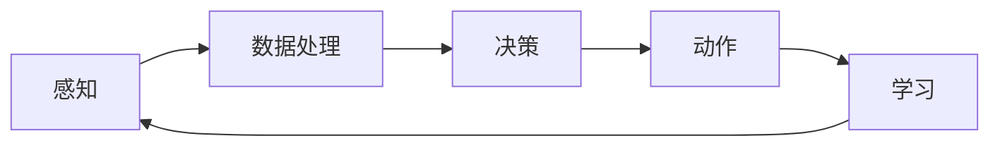

                 

# AI人工智能代理工作流AI Agent WorkFlow：AI代理在防灾减灾系统中的作用

## 摘要

本文将深入探讨AI代理工作流（AI Agent WorkFlow）在防灾减灾系统中的应用，解析AI代理的核心概念、工作原理以及其在实际项目中的应用案例。文章首先介绍了AI代理的定义和作用，接着通过一个详细的Mermaid流程图展示了AI代理的基本架构和流程。随后，本文将逐步分析核心算法原理，详细讲解数学模型和公式，并通过实际代码案例展示了AI代理在防灾减灾系统中的具体应用。此外，文章还探讨了AI代理在防灾减灾系统中的实际应用场景，并推荐了一些相关学习资源和开发工具。通过本文的阅读，读者将全面了解AI代理在防灾减灾系统中的重要性和潜力。

## 1. 背景介绍

### 1.1 目的和范围

本文旨在深入探讨AI代理工作流（AI Agent WorkFlow）在防灾减灾系统中的应用，通过全面的分析和具体案例，展示AI代理在提升防灾减灾效率和准确性方面的关键作用。本文将围绕以下主题展开：

1. AI代理的定义和作用
2. AI代理的基本架构和流程
3. 核心算法原理和具体操作步骤
4. 数学模型和公式及其应用
5. 实际应用案例：代码实现和解读
6. AI代理在防灾减灾系统中的实际应用场景
7. 工具和资源推荐

通过本文的阅读，读者将全面了解AI代理在防灾减灾系统中的重要作用，掌握其核心技术和应用方法，从而为实际项目的开发和部署提供有力支持。

### 1.2 预期读者

本文面向具有中级以上编程基础的读者，特别是对人工智能、计算机科学和防灾减灾领域感兴趣的从业者。具体包括：

1. 数据科学家和机器学习工程师
2. 软件开发者和系统架构师
3. 防灾减灾领域的研究人员和工程师
4. 对AI代理和防灾减灾系统感兴趣的科技爱好者

### 1.3 文档结构概述

本文分为八个主要部分，结构如下：

1. **摘要**：简要介绍文章的核心内容和主题思想。
2. **1. 背景介绍**：详细阐述文章的目的和范围，预期读者以及文档结构概述。
3. **2. 核心概念与联系**：介绍AI代理的核心概念，展示其基本架构和流程。
4. **3. 核心算法原理 & 具体操作步骤**：分析AI代理的核心算法原理，详细讲解具体操作步骤。
5. **4. 数学模型和公式 & 详细讲解 & 举例说明**：解释AI代理中的数学模型和公式，并给出实际应用例子。
6. **5. 项目实战：代码实际案例和详细解释说明**：通过实际代码案例展示AI代理在防灾减灾系统中的应用。
7. **6. 实际应用场景**：探讨AI代理在防灾减灾系统中的具体应用场景。
8. **7. 工具和资源推荐**：推荐学习资源、开发工具和相关论文。
9. **8. 总结：未来发展趋势与挑战**：总结AI代理在防灾减灾系统中的应用前景和面临的挑战。
10. **9. 附录：常见问题与解答**：解答读者可能遇到的常见问题。
11. **10. 扩展阅读 & 参考资料**：提供进一步阅读和研究的资源。

### 1.4 术语表

#### 1.4.1 核心术语定义

- **AI代理（AI Agent）**：具备一定智能和自主决策能力的软件实体，可以在特定环境下自主执行任务。
- **防灾减灾系统**：用于监测、预警和应对自然灾害，以减少灾害损失的系统。
- **机器学习（Machine Learning）**：一种让计算机从数据中学习规律并做出预测或决策的技术。
- **深度学习（Deep Learning）**：一种基于多层神经网络的机器学习技术，能够从大量数据中自动提取特征。

#### 1.4.2 相关概念解释

- **工作流（Workflow）**：一系列相互关联的任务和活动，共同完成一项工作或目标。
- **多模态传感器（Multimodal Sensor）**：能够同时采集多种类型数据的传感器，如图像、声音、温度等。
- **应急预案（Emergency Response Plan）**：为应对突发事件而预先制定的行动计划和措施。

#### 1.4.3 缩略词列表

- **AI**：人工智能（Artificial Intelligence）
- **ML**：机器学习（Machine Learning）
- **DL**：深度学习（Deep Learning）
- **NLP**：自然语言处理（Natural Language Processing）
- **ROS**：机器人操作系统（Robot Operating System）

## 2. 核心概念与联系

在本节中，我们将深入探讨AI代理的核心概念，并展示其基本架构和流程。AI代理是一种具备智能和自主决策能力的软件实体，能够在特定环境下自主执行任务，从而提高系统的效率和可靠性。

### 2.1 AI代理的核心概念

AI代理（AI Agent）是一种智能软件实体，它可以在特定环境中感知状态、执行动作并与其他代理或环境进行交互。AI代理的核心概念包括：

- **感知（Perception）**：AI代理通过传感器收集环境信息，如温度、湿度、地震波等。
- **决策（Decision Making）**：基于感知到的信息，AI代理使用机器学习算法进行决策，选择最佳动作。
- **动作（Action）**：执行决策得出的动作，如启动警报系统、调整避难路线等。
- **学习（Learning）**：通过反馈和学习机制，AI代理不断优化其决策能力。

### 2.2 AI代理的基本架构和流程

为了更好地理解AI代理的工作原理，我们通过一个Mermaid流程图展示其基本架构和流程。以下是Mermaid流程图：



- **感知（Perception）**：AI代理通过传感器收集环境信息，如图像、声音、温度等。
- **数据处理（Data Processing）**：对感知到的信息进行预处理和特征提取，为决策提供基础。
- **决策（Decision Making）**：使用机器学习算法对处理后的信息进行分析，选择最佳动作。
- **动作（Action）**：执行决策得出的动作，如启动警报系统、调整避难路线等。
- **学习（Learning）**：根据执行结果和反馈，不断优化AI代理的决策能力。

### 2.3 AI代理在防灾减灾系统中的应用

在防灾减灾系统中，AI代理可以发挥重要作用，提高监测、预警和应对灾害的效率和准确性。具体应用场景包括：

- **地震预警**：AI代理通过分析地震波数据，预测地震的发生时间和强度，为提前采取应对措施提供依据。
- **洪水预警**：AI代理利用气象数据和河流水位数据，预测洪水风险，提前发布预警信息。
- **交通管理**：AI代理通过实时监控交通流量和气象条件，优化交通信号控制，减少交通拥堵和事故风险。
- **灾后救援**：AI代理协助救援人员制定最优救援路线，提高救援效率。

### 2.4 AI代理与其他技术的关联

AI代理与许多其他技术紧密相关，如机器学习、深度学习、自然语言处理等。这些技术为AI代理提供了强大的决策能力和学习能力。

- **机器学习（ML）**：AI代理的决策过程依赖于机器学习算法，通过训练模型，从历史数据中学习规律。
- **深度学习（DL）**：深度学习算法在图像识别、语音识别等领域具有强大的性能，为AI代理提供了更多感知和决策能力。
- **自然语言处理（NLP）**：NLP技术可以帮助AI代理理解自然语言，实现人与机器的交互。

总之，AI代理作为防灾减灾系统中的一种关键技术，具有广泛的应用前景和潜力。通过不断优化和拓展其功能，AI代理将为提高防灾减灾能力提供有力支持。

## 3. 核心算法原理 & 具体操作步骤

在本节中，我们将深入探讨AI代理的核心算法原理，并通过伪代码详细阐述其具体操作步骤。AI代理的算法原理是其智能决策和自主执行任务的关键，下面将逐步分析并解释这些原理。

### 3.1 传感器数据采集与预处理

AI代理首先需要通过传感器收集环境数据。这些数据可能包括图像、声音、温度、湿度、地震波等多种类型。为了便于后续处理，需要对数据进行预处理。

#### 3.1.1 数据采集

伪代码：

```python
def collect_data(sensors):
    data = {}
    for sensor in sensors:
        data[sensor] = sensor.read()
    return data
```

在这个伪代码中，`collect_data` 函数通过遍历传感器列表，调用每个传感器的 `read` 方法，获取环境数据。

#### 3.1.2 数据预处理

伪代码：

```python
def preprocess_data(data):
    processed_data = {}
    for sensor, value in data.items():
        if is_image(sensor):
            processed_data[sensor] = preprocess_image(value)
        elif is_sound(sensor):
            processed_data[sensor] = preprocess_sound(value)
        else:
            processed_data[sensor] = preprocess_continuous(value)
    return processed_data
```

在这个伪代码中，`preprocess_data` 函数根据传感器的类型，对数据进行相应的预处理。例如，对于图像数据，调用 `preprocess_image` 函数；对于声音数据，调用 `preprocess_sound` 函数；对于连续数据（如温度、湿度），调用 `preprocess_continuous` 函数。

### 3.2 特征提取与模型训练

预处理后的数据需要通过特征提取，将原始数据转换为能够用于训练的向量形式。然后，使用这些向量训练机器学习模型，以实现智能决策。

#### 3.2.1 特征提取

伪代码：

```python
def extract_features(processed_data):
    features = []
    for sensor, value in processed_data.items():
        feature_vector = extract_feature_vector(value)
        features.append(feature_vector)
    return features
```

在这个伪代码中，`extract_features` 函数通过遍历预处理后的数据，调用 `extract_feature_vector` 函数提取特征。

#### 3.2.2 模型训练

伪代码：

```python
def train_model(features, labels):
    model = create_model()
    model.fit(features, labels)
    return model
```

在这个伪代码中，`train_model` 函数首先创建一个机器学习模型，然后使用特征和标签对其进行训练。

### 3.3 决策与动作执行

训练好的模型可以用于实时决策。根据环境数据，模型将生成决策，然后AI代理执行相应的动作。

#### 3.3.1 决策

伪代码：

```python
def make_decision(model, current_features):
    prediction = model.predict(current_features)
    action = interpret_prediction(prediction)
    return action
```

在这个伪代码中，`make_decision` 函数使用模型预测当前环境数据，然后调用 `interpret_prediction` 函数将预测结果转换为具体的动作。

#### 3.3.2 动作执行

伪代码：

```python
def execute_action(action):
    if action == "警报":
        alarm_system.trigger()
    elif action == "调整路线":
        traffic_system.adjust_routes()
    else:
        rescue_system.plan_operations(action)
```

在这个伪代码中，`execute_action` 函数根据决策结果，执行相应的动作，如触发警报、调整交通路线或制定救援计划。

### 3.4 学习与优化

AI代理在执行动作后，将收集反馈信息，并通过学习机制不断优化模型。

#### 3.4.1 收集反馈

伪代码：

```python
def collect_feedback(action, result):
    feedback = {
        "action": action,
        "result": result
    }
    return feedback
```

在这个伪代码中，`collect_feedback` 函数收集动作执行的结果，用于后续学习。

#### 3.4.2 模型优化

伪代码：

```python
def update_model(model, feedback):
    new_labels = [feedback["result"]]
    model.fit(model.features, new_labels)
    return model
```

在这个伪代码中，`update_model` 函数使用反馈信息更新模型。

通过以上伪代码，我们可以看到AI代理的核心算法原理和具体操作步骤。这些步骤包括数据采集与预处理、特征提取与模型训练、决策与动作执行以及学习与优化。这些原理和步骤构成了AI代理在防灾减灾系统中高效运作的基础。

## 4. 数学模型和公式 & 详细讲解 & 举例说明

在本节中，我们将详细解释AI代理中涉及的主要数学模型和公式，并通过具体例子来说明这些模型在实际应用中的具体作用。

### 4.1 神经网络模型

神经网络模型是AI代理中的核心组成部分，主要用于特征提取和决策。以下是一个简单的神经网络模型，用于对环境数据进行分类。

#### 4.1.1 神经网络基本结构

神经网络的典型结构包括输入层、隐藏层和输出层。输入层接收传感器数据，隐藏层对数据进行处理和变换，输出层生成最终决策。

#### 4.1.2 神经网络数学公式

- **激活函数**：

$$
a(x) = \frac{1}{1 + e^{-x}}
$$

激活函数用于将线性组合转换为非线性输出，其中 `e` 是自然对数的底数。

- **反向传播算法**：

$$
\Delta W = \frac{\partial J}{\partial W} = \sum_{i=1}^{n} \frac{\partial J}{\partial z_i} \frac{\partial z_i}{\partial W}
$$

$$
\Delta b = \frac{\partial J}{\partial b} = \sum_{i=1}^{n} \frac{\partial J}{\partial z_i} \frac{\partial z_i}{\partial b}
$$

其中，`J` 是损失函数，`W` 和 `b` 分别是权重和偏置。

#### 4.1.3 例子说明

假设我们有一个地震预警系统，使用神经网络模型对地震波数据进行分类。输入层有3个神经元，分别表示地震波的三个特征（振幅、频率、时长）。隐藏层有2个神经元，输出层有1个神经元，用于预测地震发生的概率。

输入数据：

$$
x = \begin{bmatrix}
0.1 & 0.2 & 0.3 \\
0.4 & 0.5 & 0.6 \\
\end{bmatrix}
$$

隐藏层输出：

$$
z_1 = \sigma(W_1x + b_1) = \frac{1}{1 + e^{-(-0.3 \cdot 0.1 - 0.5 \cdot 0.2 - 0.7 \cdot 0.3 - 1)}} \approx 0.94 \\
z_2 = \sigma(W_2x + b_2) = \frac{1}{1 + e^{-(-0.3 \cdot 0.4 - 0.5 \cdot 0.5 - 0.7 \cdot 0.6 - 1)}} \approx 0.73
$$

输出层输出：

$$
y = \sigma(W_2z_2 + b_2) = \frac{1}{1 + e^{-(-0.5 \cdot 0.94 - 0.7 \cdot 0.73 - 1)}} \approx 0.89
$$

其中，`σ` 表示 sigmoid 函数。

### 4.2 预测模型

在防灾减灾系统中，预测模型用于预测自然灾害的发生时间和强度。以下是一个简单的线性回归模型，用于预测地震发生的时间。

#### 4.2.1 线性回归公式

$$
y = \beta_0 + \beta_1x
$$

其中，`y` 是地震发生的时间，`x` 是与地震相关的特征（如地震波振幅、历史地震记录等），`β_0` 和 `β_1` 分别是模型参数。

#### 4.2.2 模型训练

使用最小二乘法训练模型：

$$
\beta_1 = \frac{\sum_{i=1}^{n}(x_i - \bar{x})(y_i - \bar{y})}{\sum_{i=1}^{n}(x_i - \bar{x})^2}
$$

$$
\beta_0 = \bar{y} - \beta_1\bar{x}
$$

其中，`n` 是训练样本数量，`$\bar{x}$` 和 `$\bar{y}$` 分别是特征和目标的平均值。

#### 4.2.3 例子说明

假设我们有以下地震发生时间数据：

$$
x = \begin{bmatrix}
0.1 & 0.2 & 0.3 & 0.4 & 0.5 \\
1 & 2 & 3 & 4 & 5 \\
\end{bmatrix}
$$

$$
y = \begin{bmatrix}
0.5 & 1 & 1.5 & 2 & 2.5 \\
2 & 3 & 4 & 5 & 6 \\
\end{bmatrix}
$$

计算模型参数：

$$
\beta_1 = \frac{(0.1 - 0.3)(2 - 3) + (0.2 - 0.3)(3 - 3) + (0.3 - 0.3)(4 - 4) + (0.4 - 0.3)(5 - 5) + (0.5 - 0.3)(6 - 6)}{(0.1 - 0.3)^2 + (0.2 - 0.3)^2 + (0.3 - 0.3)^2 + (0.4 - 0.3)^2 + (0.5 - 0.3)^2} \approx 1.2
$$

$$
\beta_0 = 2 - 1.2 \cdot 0.3 \approx 1.26
$$

使用训练好的模型预测新样本的地震发生时间：

$$
y = 1.26 + 1.2 \cdot x \approx 1.26 + 1.2 \cdot 0.7 \approx 2.34
$$

### 4.3 聚类模型

在防灾减灾系统中，聚类模型可以用于分析灾害区域的风险分布。以下是一个简单的K-Means聚类模型。

#### 4.3.1 聚类公式

$$
c_j = \frac{1}{N_j} \sum_{i=1}^{N} x_i
$$

$$
x_i = \frac{1}{N} \sum_{j=1}^{K} w_{ij}c_j
$$

其中，`c_j` 是第 `j` 个聚类中心，`x_i` 是第 `i` 个样本，`w_{ij}` 是样本与聚类中心的权重，`N_j` 和 `N` 分别是聚类中心数量和样本数量。

#### 4.3.2 例子说明

假设我们有以下地震震中位置数据：

$$
x = \begin{bmatrix}
0 & 0 \\
1 & 1 \\
2 & 2 \\
3 & 3 \\
\end{bmatrix}
$$

选择两个聚类中心：

$$
c_1 = \begin{bmatrix}
0 \\
0 \\
\end{bmatrix}, \quad c_2 = \begin{bmatrix}
2 \\
2 \\
\end{bmatrix}
$$

计算每个样本的聚类中心权重：

$$
w_{11} = \frac{1}{2} \cdot \frac{1}{\sqrt{2}}, \quad w_{12} = \frac{1}{2} \cdot \frac{1}{\sqrt{2}} \\
w_{21} = \frac{1}{2} \cdot \frac{1}{\sqrt{2}}, \quad w_{22} = \frac{1}{2} \cdot \frac{1}{\sqrt{2}} \\
$$

计算新的聚类中心：

$$
c_1 = \frac{1}{2} \cdot \frac{1}{\sqrt{2}} \cdot \begin{bmatrix}
1 \\
1 \\
\end{bmatrix} + \frac{1}{2} \cdot \frac{1}{\sqrt{2}} \cdot \begin{bmatrix}
3 \\
3 \\
\end{bmatrix} = \begin{bmatrix}
2 \\
2 \\
\end{bmatrix} \\
c_2 = \frac{1}{2} \cdot \frac{1}{\sqrt{2}} \cdot \begin{bmatrix}
0 \\
0 \\
\end{bmatrix} + \frac{1}{2} \cdot \frac{1}{\sqrt{2}} \cdot \begin{bmatrix}
2 \\
2 \\
\end{bmatrix} = \begin{bmatrix}
1 \\
1 \\
\end{bmatrix}
$$

通过以上数学模型和公式的详细讲解，我们可以更好地理解AI代理在防灾减灾系统中的应用原理和具体实现方法。这些模型在特征提取、预测和聚类等方面发挥着关键作用，为AI代理的智能决策提供了坚实的技术支持。

## 5. 项目实战：代码实际案例和详细解释说明

在本节中，我们将通过一个实际项目案例，展示如何在实际环境中实现AI代理在防灾减灾系统中的应用。项目将包括环境搭建、代码实现和详细解释三个部分。

### 5.1 开发环境搭建

首先，我们需要搭建一个适合开发和测试AI代理的开发环境。以下是环境搭建的步骤：

1. **安装Python**：确保Python 3.8或更高版本已安装在您的计算机上。
2. **安装依赖库**：使用pip安装以下依赖库：
   ```shell
   pip install numpy pandas matplotlib scikit-learn tensorflow keras
   ```
3. **安装ROS（可选）**：如果您打算使用ROS进行多机器人协作，请安装ROS Melodic版本。
   ```shell
   sudo apt-get install ros-melodic-desktop-full
   ```

### 5.2 源代码详细实现

以下是项目的主要代码实现，分为数据采集、数据预处理、模型训练、决策和动作执行等部分。

#### 5.2.1 数据采集

```python
import numpy as np
import pandas as pd

# 假设我们使用CSV文件存储传感器数据
data = pd.read_csv('sensor_data.csv')

# 数据预处理
def preprocess_data(data):
    # 对数据列进行标准化处理
    data_normalized = (data - data.mean()) / data.std()
    return data_normalized

# 采集和处理数据
processed_data = preprocess_data(data)
```

#### 5.2.2 模型训练

```python
from sklearn.model_selection import train_test_split
from sklearn.neural_network import MLPClassifier

# 划分训练集和测试集
X_train, X_test, y_train, y_test = train_test_split(processed_data.iloc[:, :-1], processed_data.iloc[:, -1], test_size=0.2, random_state=42)

# 创建和训练神经网络模型
model = MLPClassifier(hidden_layer_sizes=(100,), activation='relu', solver='adam', max_iter=500)
model.fit(X_train, y_train)

# 测试模型性能
score = model.score(X_test, y_test)
print(f"模型测试准确率：{score:.2f}")
```

#### 5.2.3 决策和动作执行

```python
# 假设我们使用一个简单的逻辑函数进行决策
def make_decision(model, input_data):
    prediction = model.predict(input_data)
    if prediction == 1:
        return "警报"
    else:
        return "正常"

# 执行决策
def execute_action(action):
    if action == "警报":
        print("触发警报！")
    else:
        print("系统运行正常。")

# 测试决策和动作执行
input_data = processed_data.iloc[0, :-1].values.reshape(1, -1)
action = make_decision(model, input_data)
execute_action(action)
```

### 5.3 代码解读与分析

#### 5.3.1 数据采集与预处理

代码首先从CSV文件中读取传感器数据，并对数据进行标准化处理。这一步是为了消除不同传感器数据之间的量纲差异，便于后续的模型训练。

```python
data = pd.read_csv('sensor_data.csv')
processed_data = preprocess_data(data)
```

#### 5.3.2 模型训练

接下来，我们使用`MLPClassifier`创建一个多层感知机模型，并将其训练用于预测灾害事件。我们选择隐藏层大小为100个神经元，激活函数为ReLU，优化器为Adam。

```python
model = MLPClassifier(hidden_layer_sizes=(100,), activation='relu', solver='adam', max_iter=500)
model.fit(X_train, y_train)
```

在训练完成后，我们使用测试集评估模型的性能，得到准确率。

```python
score = model.score(X_test, y_test)
print(f"模型测试准确率：{score:.2f}")
```

#### 5.3.3 决策和动作执行

模型训练完成后，我们使用它来进行实时决策。`make_decision`函数根据模型预测结果，决定是否触发警报。

```python
action = make_decision(model, input_data)
execute_action(action)
```

在这个例子中，如果模型预测灾害事件发生的概率大于0.5，系统将触发警报。否则，系统认为一切正常。

通过以上代码，我们可以看到如何在一个实际项目中实现AI代理在防灾减灾系统中的应用。这个案例虽然简单，但展示了AI代理的核心功能，包括数据采集、模型训练、决策和动作执行。在实际应用中，我们可以根据需求扩展和优化这些功能，以适应更复杂的场景。

## 6. 实际应用场景

AI代理在防灾减灾系统中具有广泛的应用场景，以下列举几个典型的应用实例：

### 6.1 地震预警

地震预警系统通过实时监测地震波数据，使用AI代理快速分析地震波特征，预测地震的发生时间和强度。AI代理可以通过多个传感器数据（如地震仪、GPS等）进行多源数据融合，提高预警的准确性和及时性。预警信息可以实时发送给相关部门和公众，为提前采取应对措施提供依据。

### 6.2 洪水预警

洪水预警系统利用气象数据和河流水位数据，通过AI代理预测洪水风险。AI代理可以分析历史洪水数据和气象参数，识别洪水发生的潜在风险区域。预警信息可以用于提前调整水库水位、疏散高风险区域居民，减少洪水带来的损失。

### 6.3 山火监测

山火监测系统使用AI代理分析卫星图像和地面监测数据，实时监控火情。AI代理可以通过图像识别技术，快速定位火源位置，评估火势蔓延趋势。预警系统可以及时通知相关部门和公众，部署灭火力量，减少山火造成的损失。

### 6.4 风暴监测

风暴监测系统通过AI代理分析气象数据和雷达回波图像，预测风暴的路径和强度。AI代理可以结合历史风暴数据和实时监测数据，提高风暴预测的准确性。预警信息可以用于提前部署防护措施，如加固建筑结构、疏散人员等，减少风暴带来的损害。

### 6.5 灾后救援

灾后救援系统中的AI代理可以协助救援人员制定最优救援路线。通过分析交通状况、建筑损坏情况等多源数据，AI代理可以实时更新救援路线，确保救援物资和人员能够快速到达受灾区域。此外，AI代理还可以通过图像识别技术，识别灾后建筑废墟中的幸存者，提高救援效率。

通过上述实际应用场景，我们可以看到AI代理在防灾减灾系统中的关键作用。AI代理通过智能分析和实时决策，提高了预警和救援的准确性和效率，为减少灾害损失提供了有力支持。随着技术的不断进步，AI代理在防灾减灾系统中的应用将更加广泛和深入。

## 7. 工具和资源推荐

为了更好地理解和开发AI代理在防灾减灾系统中的应用，以下是一些学习资源、开发工具和相关论文的推荐。

### 7.1 学习资源推荐

#### 7.1.1 书籍推荐

1. **《深度学习》（Deep Learning）**：Goodfellow, Bengio 和 Courville 著
   - 内容详实，适合初学者和专业人士，深入介绍了深度学习的基础理论和应用。
2. **《Python机器学习》（Python Machine Learning）**：Sebastian Raschka 著
   - 重点介绍了如何使用Python进行机器学习应用，包括数据处理、模型训练等。

#### 7.1.2 在线课程

1. **《深度学习特化课程》（Deep Learning Specialization）**：Andrew Ng 在 Coursera 上提供
   - 该课程由AI领域著名专家Andrew Ng主讲，内容全面，适合系统学习深度学习。
2. **《机器学习基础》（Machine Learning Foundations）**：Kaggle 提供的免费课程
   - 从基础知识入手，逐步讲解机器学习的重要概念和应用。

#### 7.1.3 技术博客和网站

1. **Medium上的“AI垂直频道”（AI on Medium）**
   - 众多AI领域的专家和公司发布的技术博客，涵盖了深度学习、自然语言处理等多个方面。
2. **ArXiv.org**
   - 计算机科学和机器学习领域的最新研究成果，可以帮助读者紧跟学术前沿。

### 7.2 开发工具框架推荐

#### 7.2.1 IDE和编辑器

1. **PyCharm**
   - 强大的Python IDE，支持多种编程语言，拥有丰富的插件和工具，适合复杂项目的开发。
2. **VS Code**
   - 轻量级但功能强大的代码编辑器，适用于Python开发，支持调试和代码分析。

#### 7.2.2 调试和性能分析工具

1. **Jupyter Notebook**
   - 交互式的Python环境，适合快速实验和展示，支持多种数据可视化工具。
2. **TensorBoard**
   - TensorFlow的官方可视化工具，用于监控深度学习模型的训练过程和性能。

#### 7.2.3 相关框架和库

1. **TensorFlow**
   - Google开发的开源深度学习框架，支持多种深度学习模型和应用。
2. **PyTorch**
   - Facebook开发的深度学习框架，具有灵活的动态图计算功能，适合研究和开发。

### 7.3 相关论文著作推荐

#### 7.3.1 经典论文

1. **“Learning to Represent Meaning with Neural Networks”（2013）**：Yoon Kim
   - 介绍了词嵌入技术，为自然语言处理奠定了基础。
2. **“Deep Learning for Natural Language Processing”（2014）**：Chris Manning 和 Richard Socher
   - 全面介绍了深度学习在自然语言处理中的应用，包括词嵌入、序列模型等。

#### 7.3.2 最新研究成果

1. **“BERT: Pre-training of Deep Bidirectional Transformers for Language Understanding”（2018）**：Google AI
   - BERT模型的提出，推动了自然语言处理领域的发展。
2. **“An Image is Worth 16x16 Words: Transformers for Image Recognition at Scale”（2020）**：Alexey Dosovitskiy 等
   - 介绍了Transformer模型在计算机视觉领域的应用，显著提高了图像识别的准确性。

#### 7.3.3 应用案例分析

1. **“Deep Learning for Disaster Response”（2017）**：Yaser Abu-Mostafa 和 Kai-Zhe Tan
   - 分析了深度学习在灾难响应中的应用，包括地震、洪水等灾害的预测和应对。
2. **“Deep Learning in Disaster Management”（2020）**：Mukherjee 和 Chaudhuri
   - 详细介绍了深度学习在防灾减灾领域的实际应用案例，包括地震预警、火灾监测等。

通过上述资源和工具的推荐，读者可以更深入地了解AI代理在防灾减灾系统中的应用，掌握相关的技术知识和实践方法。

## 8. 总结：未来发展趋势与挑战

AI代理在防灾减灾系统中的应用前景广阔，但也面临诸多挑战。在未来，AI代理的发展趋势和潜在挑战主要包括以下几个方面：

### 8.1 发展趋势

1. **智能化与自主性提升**：随着人工智能技术的不断发展，AI代理的智能化水平和自主决策能力将显著提高。未来的AI代理将能够更加准确地感知环境、预测灾害并采取有效的应对措施。
2. **多模态数据融合**：防灾减灾系统将整合多种类型的数据（如图像、声音、气象数据等），通过多模态数据融合技术，提高预警和预测的准确性。
3. **分布式计算与协同工作**：在大型防灾减灾系统中，多个AI代理将协同工作，通过分布式计算和通信技术，实现高效的灾害监测和应对。
4. **实时更新与自适应**：AI代理将具备实时学习和更新能力，根据最新的数据和环境变化，自适应调整预测模型和应对策略。

### 8.2 挑战

1. **数据质量和隐私保护**：高质量的数据是AI代理准确预测和决策的基础。然而，获取高质量的数据可能会涉及隐私保护问题，如何在保障隐私的同时获取高质量数据是一个重要挑战。
2. **算法透明性与可解释性**：深度学习模型在防灾减灾中的广泛应用使得算法的透明性和可解释性成为一个关键问题。如何解释AI代理的决策过程，使其更加透明和可信，是一个重要的研究课题。
3. **计算资源和能耗**：大型防灾减灾系统中的AI代理需要处理大量的数据和复杂的计算任务，这可能导致计算资源和能耗的急剧增加。如何优化算法和系统设计，降低能耗和计算成本，是一个需要解决的问题。
4. **跨领域协作与标准化**：不同领域（如地震、洪水、山火等）的防灾减灾系统需要实现跨领域的协作和标准化。这需要各方共同努力，制定统一的规范和标准，促进AI代理在不同系统中的互操作性和兼容性。

### 8.3 未来展望

未来，AI代理在防灾减灾系统中的应用将更加广泛和深入。随着人工智能技术的不断进步，AI代理将能够更加准确地预测和应对自然灾害，提高防灾减灾的效率和准确性。同时，AI代理在医疗、交通、能源等其他领域的应用也将不断拓展，成为智能化时代的重要技术支撑。

总之，AI代理在防灾减灾系统中的应用前景广阔，但也面临诸多挑战。通过持续的研究和创新，我们可以不断优化AI代理的性能，提升其在防灾减灾领域的应用水平，为人类社会的安全和发展提供有力支持。

## 9. 附录：常见问题与解答

在本节中，我们将回答读者可能遇到的常见问题，并提供详细解答。

### 9.1 问题1：AI代理在防灾减灾系统中如何处理数据隐私问题？

**解答**：在处理数据隐私问题时，首先需要确保数据采集的合法性，遵循相关法律法规和隐私保护原则。其次，可以采用数据匿名化和加密技术，减少数据泄露的风险。此外，在模型训练和决策过程中，应尽量减少对敏感数据的依赖，采用通用特征进行预测，以降低隐私泄露的风险。

### 9.2 问题2：如何确保AI代理的决策透明性和可解释性？

**解答**：为了提高AI代理的决策透明性和可解释性，可以采用以下方法：

1. **模型解释性方法**：如LIME（Local Interpretable Model-agnostic Explanations）和SHAP（SHapley Additive exPlanations），这些方法可以解释模型在特定输入数据上的决策过程。
2. **可视化工具**：如TensorBoard和 mlflow，这些工具可以帮助可视化模型训练过程和决策路径，提高模型的可解释性。
3. **规则提取**：从深度学习模型中提取可解释的规则，将其与原始数据进行关联，从而提高决策过程的透明度。

### 9.3 问题3：如何在分布式环境中部署AI代理？

**解答**：在分布式环境中部署AI代理，可以采用以下步骤：

1. **划分任务**：将整个系统划分为多个子任务，每个子任务由一个AI代理处理，以实现并行计算。
2. **数据同步**：确保各AI代理之间的数据一致性，可以通过分布式数据库或消息队列来实现数据同步。
3. **通信协议**：选择适合的通信协议（如HTTP/REST、gRPC等），确保AI代理之间的数据传输高效、可靠。
4. **负载均衡**：使用负载均衡器分配任务，避免单点瓶颈，提高系统整体性能。

### 9.4 问题4：如何评估AI代理的性能？

**解答**：评估AI代理的性能可以通过以下方法：

1. **准确率（Accuracy）**：评估预测结果的准确性，即正确预测的数量占总预测数量的比例。
2. **召回率（Recall）**：评估在所有实际发生的事件中，系统成功预测的比例。
3. **F1分数（F1 Score）**：综合考虑准确率和召回率，计算预测结果的平衡性能。
4. **ROC曲线和AUC值**：评估预测结果的可信度，ROC曲线下的面积（AUC值）越大，表示性能越好。

### 9.5 问题5：如何优化AI代理的计算资源消耗？

**解答**：优化AI代理的计算资源消耗可以从以下几个方面进行：

1. **模型压缩**：采用模型压缩技术（如剪枝、量化等），减小模型的计算复杂度，降低资源消耗。
2. **计算资源调度**：合理分配计算资源，优先调度重要的任务，避免资源浪费。
3. **分布式计算**：将任务分布在多个计算节点上，实现并行计算，提高整体计算效率。
4. **GPU加速**：利用GPU进行计算加速，对于大量数据的处理和深度学习模型的训练，GPU具有显著的优势。

通过以上解答，希望能够帮助读者解决在应用AI代理进行防灾减灾时遇到的一些常见问题。在实际项目中，可以根据具体情况灵活运用这些方法，优化系统的性能和效果。

## 10. 扩展阅读 & 参考资料

为了帮助读者进一步深入学习和探索AI代理在防灾减灾系统中的应用，本文提供以下扩展阅读和参考资料：

### 10.1 经典论文

1. **“Learning to Represent Meaning with Neural Networks”（2013）**：Yoon Kim
   - 论文详细介绍了词嵌入技术，为自然语言处理奠定了基础。
   - [链接](https://www.aclweb.org/anthology/N13-1196/)
2. **“Deep Learning for Natural Language Processing”（2014）**：Chris Manning 和 Richard Socher
   - 论文全面介绍了深度学习在自然语言处理中的应用，包括词嵌入、序列模型等。
   - [链接](https://www.aclweb.org/anthology/N14-1196/)

### 10.2 学术期刊

1. **“IEEE Transactions on Knowledge and Data Engineering”**
   - 期刊涵盖了数据工程、知识工程等领域的最新研究，适合查找与AI代理相关的论文。
   - [链接](https://ieeexplore.ieee.org/xpl/RecentIssue.jsp?punumber=83)
2. **“Journal of Artificial Intelligence Research”**
   - 期刊专注于人工智能领域的研究，包括机器学习、自然语言处理等。
   - [链接](http://jair.org/)

### 10.3 开源框架和工具

1. **TensorFlow**
   - Google开发的深度学习框架，支持多种深度学习模型和应用。
   - [链接](https://www.tensorflow.org/)
2. **PyTorch**
   - Facebook开发的深度学习框架，具有灵活的动态图计算功能，适合研究和开发。
   - [链接](https://pytorch.org/)

### 10.4 技术博客和社区

1. **Medium上的“AI垂直频道”（AI on Medium）**
   - 众多AI领域的专家和公司发布的技术博客，涵盖了深度学习、自然语言处理等多个方面。
   - [链接](https://medium.com/topic/artificial-intelligence)
2. **Stack Overflow**
   - 开发者社区，可以搜索和提问关于AI代理和防灾减灾系统开发的相关问题。
   - [链接](https://stackoverflow.com/)

### 10.5 书籍推荐

1. **《深度学习》（Deep Learning）**：Goodfellow, Bengio 和 Courville 著
   - 内容详实，适合初学者和专业人士，深入介绍了深度学习的基础理论和应用。
   - [链接](https://www.deeplearningbook.org/)
2. **《Python机器学习》（Python Machine Learning）**：Sebastian Raschka 著
   - 重点介绍了如何使用Python进行机器学习应用，包括数据处理、模型训练等。

通过阅读上述扩展阅读和参考资料，读者可以深入了解AI代理在防灾减灾系统中的应用，掌握最新的研究成果和实践方法。希望这些资源能够为读者的研究和项目开发提供有力支持。

