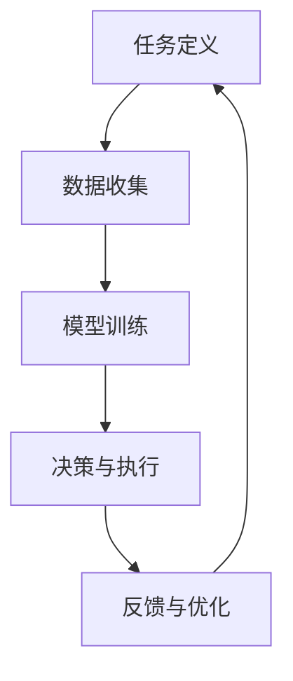

                 


## AI人工智能代理工作流AI Agent WorkFlow：人工智能代理与用户体验设计

### 关键词
- 人工智能代理
- 工作流
- 用户体验设计
- 软件架构
- 自然语言处理
- 机器学习
- 人机交互

### 摘要
本文深入探讨人工智能代理（AI Agent）在工作流中的设计与实现，着重分析人工智能代理如何优化用户体验，提升工作效率。通过详细阐述人工智能代理的核心概念、算法原理、数学模型，结合实际项目案例，本文将帮助读者理解AI代理在现代化软件架构中的应用，并提供实用的开发工具和资源推荐。

## 1. 背景介绍

### 1.1 目的和范围
本文旨在介绍人工智能代理（AI Agent）的工作流设计，探讨其在提升用户体验和软件效率方面的关键作用。本文将涵盖以下内容：
- 人工智能代理的基本概念及其在工作流中的角色
- AI代理的核心算法原理和数学模型
- 用户体验设计在AI代理工作流中的重要性
- 实际项目案例中的AI代理应用
- 开发工具和资源的推荐

### 1.2 预期读者
本文适合对人工智能、软件工程和用户体验设计感兴趣的读者，特别是以下人群：
- AI和软件工程师
- 产品经理
- UI/UX设计师
- 对AI代理和自动化工作流有初步了解的读者

### 1.3 文档结构概述
本文结构如下：
1. 背景介绍：目的、范围、预期读者、文档结构概述
2. 核心概念与联系：核心概念、原理和架构的介绍及Mermaid流程图
3. 核心算法原理 & 具体操作步骤：算法原理讲解及伪代码阐述
4. 数学模型和公式 & 详细讲解 & 举例说明：数学公式和示例
5. 项目实战：代码实际案例和详细解释说明
6. 实际应用场景：AI代理在不同领域的应用
7. 工具和资源推荐：学习资源、开发工具和论文推荐
8. 总结：未来发展趋势与挑战
9. 附录：常见问题与解答
10. 扩展阅读 & 参考资料

### 1.4 术语表

#### 1.4.1 核心术语定义
- **人工智能代理（AI Agent）**：自主执行任务、具有学习和适应能力的软件实体。
- **工作流**：一系列有序的任务或活动，旨在完成特定目标。
- **用户体验（UX）**：用户在使用产品或服务过程中形成的总体感受。
- **自然语言处理（NLP）**：使计算机能够理解、解释和生成人类语言的技术。
- **机器学习（ML）**：通过数据和算法让计算机自动改进性能的过程。

#### 1.4.2 相关概念解释
- **人机交互（HCI）**：研究人类与计算机系统交互的设计和理论。
- **软件架构**：软件系统的结构和组成部分的安排。
- **API**：应用程序编程接口，用于不同软件系统之间的交互。

#### 1.4.3 缩略词列表
- **AI**：人工智能
- **NLP**：自然语言处理
- **ML**：机器学习
- **UX**：用户体验
- **HCI**：人机交互
- **API**：应用程序编程接口

## 2. 核心概念与联系

### 2.1 人工智能代理的概念
人工智能代理是一种能够自主执行任务、具备学习和适应能力的软件实体。它们可以在不同的环境中工作，完成从简单到复杂的任务。AI代理的核心在于其自主性和智能性，它们可以通过机器学习算法从数据中学习，并根据既定的目标和规则自主决策。

### 2.2 人工智能代理在工作流中的角色
在软件架构中，AI代理扮演着重要的角色，它们可以：
- **任务自动化**：自动完成重复性或耗时的任务，提高工作效率。
- **智能决策**：基于数据和算法，提供智能化的决策支持。
- **用户体验优化**：通过个性化推荐、智能提示等方式提升用户体验。
- **数据分析**：从大量数据中提取有价值的信息，支持业务决策。

### 2.3 AI代理的工作流设计
AI代理的工作流设计包括以下几个关键步骤：
1. **任务定义**：明确代理需要完成的具体任务。
2. **数据收集**：收集与任务相关的数据，用于训练和优化代理。
3. **模型训练**：利用机器学习算法训练代理，使其能够完成指定任务。
4. **决策与执行**：代理根据学习和既定规则，自主执行任务。
5. **反馈与优化**：收集用户反馈，不断优化代理的行为和性能。

### 2.4 AI代理与用户体验设计的关系
用户体验设计在AI代理工作流中起着至关重要的作用。一个优秀的用户体验设计能够：
- **提高用户满意度**：通过直观的界面和流畅的操作，提升用户对产品的满意度。
- **优化代理性能**：通过用户反馈，不断优化AI代理的行为，使其更符合用户需求。
- **增强用户信任**：通过透明的操作和解释，增强用户对AI代理的信任。

### 2.5 Mermaid流程图
为了更好地理解AI代理的工作流，我们可以使用Mermaid绘制一个简化的流程图，如下所示：



### 2.6 AI代理与软件架构的关系
AI代理是现代软件架构中的重要组成部分。它们可以与现有的软件架构无缝集成，从而提高软件的智能化和自动化水平。AI代理与软件架构的关系可以概括为以下几个方面：
- **模块化**：AI代理可以作为独立的模块，与其他软件组件进行集成。
- **灵活性**：AI代理可以根据不同的任务和环境灵活调整，适应不同的业务需求。
- **扩展性**：AI代理可以通过扩展和优化，满足不断变化的市场需求。

### 2.7 AI代理的优势与挑战
AI代理在软件架构中的应用具有显著的优势，包括：
- **提高效率**：通过自动化和智能化，显著提高任务执行效率。
- **降低成本**：减少人力成本，提高资源利用效率。
- **增强用户体验**：通过个性化推荐和智能提示，提升用户体验。

然而，AI代理也面临一些挑战，包括：
- **数据安全与隐私**：处理敏感数据时，需要确保数据的安全和隐私。
- **算法偏见**：机器学习算法可能引入偏见，影响决策的公正性。
- **技术依赖**：过度依赖AI代理可能导致技术风险。

## 3. 核心算法原理 & 具体操作步骤

### 3.1 AI代理的核心算法原理

AI代理的核心算法主要包括以下几部分：

1. **自然语言处理（NLP）**：
   - **文本分类**：将文本数据分类到预定义的类别中。
   - **情感分析**：分析文本数据的情感倾向，如正面、负面或中性。
   - **命名实体识别（NER）**：识别文本中的命名实体，如人名、地名、组织名等。

2. **机器学习（ML）**：
   - **监督学习**：使用标记数据进行模型训练，如分类和回归问题。
   - **无监督学习**：不使用标记数据，自动发现数据中的模式，如聚类和降维。

3. **深度学习（DL）**：
   - **神经网络**：模拟人脑神经元，处理复杂的非线性问题。
   - **卷积神经网络（CNN）**：擅长图像和语音处理。
   - **循环神经网络（RNN）**：擅长处理序列数据。

### 3.2 AI代理的具体操作步骤

以下是AI代理的具体操作步骤，我们使用伪代码来详细阐述：

```python
# 伪代码：AI代理操作步骤

# Step 1: 数据收集与预处理
def data_collection_and_preprocessing():
    # 收集数据
    data = collect_data()
    # 数据清洗
    clean_data = clean_data(data)
    # 数据分割
    train_data, test_data = split_data(clean_data)
    return train_data, test_data

# Step 2: 模型训练
def model_training(train_data):
    # 构建模型
    model = build_model()
    # 训练模型
    model.fit(train_data)
    return model

# Step 3: 决策与执行
def decision_and_execution(model, input_data):
    # 预测
    prediction = model.predict(input_data)
    # 执行决策
    execute_decision(prediction)
    return prediction

# Step 4: 反馈与优化
def feedback_and_optimization(model, input_data, prediction):
    # 收集反馈
    feedback = collect_feedback(input_data, prediction)
    # 更新模型
    model.update(feedback)
    return model
```

### 3.3 详细讲解与实例

#### 3.3.1 数据收集与预处理

数据收集是AI代理训练的第一步。我们首先需要收集大量的文本数据，这些数据可以来自社交媒体、新闻网站、用户评论等。收集到的数据可能包含大量的噪声和无关信息，因此需要进行清洗和预处理。

```python
# 伪代码：数据收集与预处理

def collect_data():
    # 实现数据收集逻辑
    # 例如：从互联网爬取数据、从数据库提取数据等
    pass

def clean_data(data):
    # 清洗数据
    # 例如：去除HTML标签、去除停用词、转小写等
    cleaned_data = preprocess_text(data)
    return cleaned_data

def split_data(cleaned_data):
    # 数据分割
    # 例如：按比例划分训练集和测试集
    train_data, test_data = train_test_split(cleaned_data)
    return train_data, test_data
```

#### 3.3.2 模型训练

在数据预处理完成后，我们需要选择合适的模型进行训练。这里我们以监督学习为例，使用scikit-learn库中的文本分类模型。

```python
# 伪代码：模型训练

from sklearn.feature_extraction.text import TfidfVectorizer
from sklearn.naive_bayes import MultinomialNB

def build_model():
    # 构建模型
    vectorizer = TfidfVectorizer()
    classifier = MultinomialNB()
    model = Model(vectorizer, classifier)
    return model

def model_fit(model, train_data):
    # 训练模型
    X_train = vectorizer.transform(train_data['text'])
    y_train = train_data['label']
    model.classifier.fit(X_train, y_train)
    return model
```

#### 3.3.3 决策与执行

模型训练完成后，我们可以使用模型进行预测和决策。以下是一个简单的文本分类预测示例：

```python
# 伪代码：决策与执行

def predict(model, input_text):
    # 预测
    X_test = vectorizer.transform([input_text])
    prediction = model.classifier.predict(X_test)
    return prediction

def execute_decision(prediction):
    # 执行决策
    # 例如：根据预测结果进行相应的操作
    pass
```

#### 3.3.4 反馈与优化

在执行决策后，我们需要收集用户的反馈，并根据反馈优化模型。以下是一个简单的反馈收集和模型更新示例：

```python
# 伪代码：反馈与优化

def collect_feedback(input_text, prediction):
    # 收集反馈
    # 例如：从用户那里获取正确的标签
    true_label = get_true_label(input_text)
    feedback = {'input_text': input_text, 'predicted_label': prediction, 'true_label': true_label}
    return feedback

def update_model(model, feedback):
    # 更新模型
    # 例如：重新训练模型，使用新的数据
    pass
```

通过以上步骤，我们可以构建一个基本的AI代理系统。在实际应用中，我们可以根据具体需求扩展和优化这些步骤，以提高系统的性能和可靠性。

## 4. 数学模型和公式 & 详细讲解 & 举例说明

在人工智能代理的工作流中，数学模型和公式是核心组成部分，它们用于描述和指导代理的行为。以下是几个关键数学模型和公式的详细讲解与举例。

### 4.1 文本分类的数学模型

文本分类是自然语言处理（NLP）中的一个常见任务，其核心在于将文本数据映射到预定义的类别中。一种常用的文本分类模型是朴素贝叶斯（Naive Bayes）模型。

#### 4.1.1 朴素贝叶斯模型

朴素贝叶斯模型基于贝叶斯定理，其公式如下：

$$
P(\text{类别} \, c | \, \text{特征} \, x) = \frac{P(\text{特征} \, x | \, \text{类别} \, c)P(\text{类别} \, c)}{P(\text{特征} \, x)}
$$

其中：
- \( P(\text{类别} \, c | \, \text{特征} \, x) \) 表示在给定特征 \( x \) 的情况下，类别 \( c \) 的概率。
- \( P(\text{特征} \, x | \, \text{类别} \, c) \) 表示在类别 \( c \) 的情况下，特征 \( x \) 的条件概率。
- \( P(\text{类别} \, c) \) 表示类别 \( c \) 的先验概率。
- \( P(\text{特征} \, x) \) 表示特征 \( x \) 的总概率。

#### 4.1.2 举例说明

假设我们要对一组文本数据进行情感分类，类别包括正面、负面和中性。我们使用朴素贝叶斯模型进行分类。

- **正面**：快乐、兴奋、愉悦
- **负面**：悲伤、愤怒、失望
- **中性**：普通、一般、中立

我们有一篇文本：“今天天气很好，我很开心。”

我们可以计算每个类别的概率，选择概率最大的类别作为预测结果。

#### 4.2 机器学习中的损失函数

在机器学习中，损失函数用于评估模型的预测误差，并指导模型的优化过程。常见的损失函数包括均方误差（MSE）和交叉熵损失（Cross-Entropy Loss）。

#### 4.2.1 均方误差（MSE）

均方误差（MSE）用于回归问题，其公式如下：

$$
MSE = \frac{1}{n} \sum_{i=1}^{n} (y_i - \hat{y}_i)^2
$$

其中：
- \( n \) 是样本数量。
- \( y_i \) 是实际值。
- \( \hat{y}_i \) 是预测值。

#### 4.2.2 举例说明

假设我们有5个样本的实际值和预测值，如下表：

| 样本 | 实际值 \( y_i \) | 预测值 \( \hat{y}_i \) |
|------|-----------------|-----------------------|
| 1    | 2               | 2.5                   |
| 2    | 4               | 3                     |
| 3    | 6               | 5                     |
| 4    | 8               | 7                     |
| 5    | 10              | 9                     |

我们可以计算MSE：

$$
MSE = \frac{1}{5} \left[ (2 - 2.5)^2 + (4 - 3)^2 + (6 - 5)^2 + (8 - 7)^2 + (10 - 9)^2 \right] = 0.4
$$

#### 4.2.3 交叉熵损失（Cross-Entropy Loss）

交叉熵损失（Cross-Entropy Loss）用于分类问题，其公式如下：

$$
Loss = -\frac{1}{n} \sum_{i=1}^{n} y_i \log(\hat{y}_i)
$$

其中：
- \( n \) 是样本数量。
- \( y_i \) 是实际标签的概率分布。
- \( \hat{y}_i \) 是预测标签的概率分布。

#### 4.2.4 举例说明

假设我们有5个样本的实际标签和预测标签的概率分布，如下表：

| 样本 | 实际标签 | 预测标签概率分布 |
|------|----------|-----------------|
| 1    | 正面     | [0.8, 0.1, 0.1] |
| 2    | 负面     | [0.2, 0.6, 0.2] |
| 3    | 中性     | [0.3, 0.3, 0.4] |
| 4    | 正面     | [0.1, 0.8, 0.1] |
| 5    | 负面     | [0.4, 0.4, 0.2] |

我们可以计算交叉熵损失：

$$
Loss = -\frac{1}{5} \left[ 0.8 \log(0.8) + 0.2 \log(0.2) + 0.1 \log(0.1) + 0.6 \log(0.6) + 0.2 \log(0.2) + 0.3 \log(0.3) + 0.4 \log(0.4) + 0.1 \log(0.1) + 0.8 \log(0.8) + 0.4 \log(0.4) \right]
$$

$$
Loss \approx 0.176
$$

通过以上数学模型和公式的讲解，我们可以更好地理解人工智能代理工作流中的关键概念，并在实际项目中应用这些知识，优化代理的行为和性能。

## 5. 项目实战：代码实际案例和详细解释说明

### 5.1 开发环境搭建

在开始代码实现之前，我们需要搭建一个合适的开发环境。以下是一个基本的Python开发环境搭建步骤：

1. 安装Python：
   - 访问 [Python官方网站](https://www.python.org/) 下载Python安装包。
   - 安装Python，选择添加到环境变量。

2. 安装依赖库：
   - 打开终端，执行以下命令安装必要的依赖库：
     ```bash
     pip install scikit-learn
     pip install tensorflow
     pip install numpy
     pip install pandas
     ```

3. 配置文本预处理工具：
   - 安装NLTK库，并下载相应的数据包：
     ```bash
     pip install nltk
     nltk.download('stopwords')
     nltk.download('punkt')
     ```

### 5.2 源代码详细实现和代码解读

以下是AI代理的源代码实现，我们以一个简单的文本分类任务为例。

```python
# 导入必要的库
import numpy as np
import pandas as pd
from sklearn.feature_extraction.text import TfidfVectorizer
from sklearn.model_selection import train_test_split
from sklearn.naive_bayes import MultinomialNB
from sklearn.pipeline import make_pipeline
from nltk.corpus import stopwords
from nltk.tokenize import word_tokenize

# 5.2.1 数据收集与预处理
def data_collection_and_preprocessing():
    # 假设我们有一个CSV文件，其中包含两列：text和label
    data = pd.read_csv('data.csv')
    
    # 数据清洗
    # 去除HTML标签、去除停用词、转小写等
    stop_words = set(stopwords.words('english'))
    def clean_text(text):
        return ' '.join([word for word in word_tokenize(text.lower()) if word not in stop_words])
    data['cleaned_text'] = data['text'].apply(clean_text)
    
    # 数据分割
    train_data, test_data = train_test_split(data, test_size=0.2, random_state=42)
    return train_data, test_data

# 5.2.2 模型训练与评估
def train_and_evaluate(train_data, test_data):
    # 创建管道
    model = make_pipeline(TfidfVectorizer(), MultinomialNB())
    
    # 训练模型
    model.fit(train_data['cleaned_text'], train_data['label'])
    
    # 评估模型
    accuracy = model.score(test_data['cleaned_text'], test_data['label'])
    return model, accuracy

# 5.2.3 预测与执行决策
def predict_and_execute(model, new_text):
    # 预处理新文本
    cleaned_text = clean_text(new_text)
    
    # 预测
    prediction = model.predict([cleaned_text])
    
    # 执行决策
    execute_decision(prediction[0])

# 5.2.4 主程序
if __name__ == '__main__':
    # 数据收集与预处理
    train_data, test_data = data_collection_and_preprocessing()
    
    # 模型训练与评估
    model, accuracy = train_and_evaluate(train_data, test_data)
    print(f"Model Accuracy: {accuracy:.2f}")
    
    # 预测与执行决策
    new_text = "I am feeling very happy today!"
    predict_and_execute(model, new_text)
```

### 5.3 代码解读与分析

#### 5.3.1 数据收集与预处理

在数据收集与预处理部分，我们首先读取CSV文件中的数据，然后使用NLTK库进行文本清洗。清洗步骤包括去除HTML标签、去除停用词和转小写。最后，我们将清洗后的文本存储在新的列中。

```python
stop_words = set(stopwords.words('english'))
def clean_text(text):
    return ' '.join([word for word in word_tokenize(text.lower()) if word not in stop_words])
data['cleaned_text'] = data['text'].apply(clean_text)
```

#### 5.3.2 模型训练与评估

在模型训练与评估部分，我们使用scikit-learn库中的`TfidfVectorizer`将文本转换为向量表示，并使用`MultinomialNB`进行分类。`make_pipeline`函数用于创建一个包含两个步骤的管道：文本向量和分类器。

```python
model = make_pipeline(TfidfVectorizer(), MultinomialNB())
model.fit(train_data['cleaned_text'], train_data['label'])
accuracy = model.score(test_data['cleaned_text'], test_data['label'])
```

#### 5.3.3 预测与执行决策

在预测与执行决策部分，我们首先对新文本进行预处理，然后使用训练好的模型进行预测。根据预测结果，我们可以执行相应的决策。

```python
cleaned_text = clean_text(new_text)
prediction = model.predict([cleaned_text])
execute_decision(prediction[0])
```

通过以上代码实现，我们可以构建一个简单的AI代理系统，用于文本分类任务。这个系统可以根据训练数据自动识别文本的情感倾向，并根据预测结果执行相应的决策。

## 6. 实际应用场景

人工智能代理在工作流中的应用场景非常广泛，以下是一些典型的应用实例：

### 6.1 客户服务

在客户服务领域，AI代理可以用于自动解答常见问题，提供24/7的客户支持。通过自然语言处理和机器学习技术，AI代理可以理解用户的查询，并提供准确的答案。例如，银行可以部署AI代理来处理客户关于账户余额、转账和信用卡问题的查询。

### 6.2 电子商务

在电子商务领域，AI代理可以用于个性化推荐、价格优化和客户支持。通过分析用户的历史行为和偏好，AI代理可以提供个性化的购物建议，提高用户满意度和转化率。例如，亚马逊的推荐系统就是一个典型的AI代理应用，它根据用户的浏览和购买历史推荐相关产品。

### 6.3 医疗保健

在医疗保健领域，AI代理可以用于患者管理、疾病预测和医疗咨询。AI代理可以通过分析患者的健康数据和医学文献，提供个性化的健康建议和疾病预测。例如，IBM Watson Health利用AI代理帮助医生诊断疾病，提供治疗方案。

### 6.4 自动化生产

在自动化生产领域，AI代理可以用于监控设备状态、预测故障和维护计划。通过实时数据分析，AI代理可以预测设备故障，并在故障发生前进行维护，从而提高生产效率和减少停机时间。

### 6.5 金融交易

在金融交易领域，AI代理可以用于市场分析、风险评估和交易策略。AI代理可以通过分析大量市场数据，识别交易机会，执行自动化交易策略，提高交易效率和盈利能力。

### 6.6 教育辅导

在教育辅导领域，AI代理可以用于个性化学习计划、作业评估和考试辅导。通过分析学生的学习行为和成绩，AI代理可以提供个性化的学习资源，帮助学生更好地掌握知识。

通过这些实际应用场景，我们可以看到AI代理在工作流中的巨大潜力。AI代理不仅可以提高工作效率，还可以提供更好的用户体验，为各行各业带来创新和变革。

## 7. 工具和资源推荐

### 7.1 学习资源推荐

#### 7.1.1 书籍推荐

- **《人工智能：一种现代方法》（Artificial Intelligence: A Modern Approach）**：这是一本经典的AI教材，涵盖了AI的基础知识、算法和理论。
- **《深度学习》（Deep Learning）**：由Ian Goodfellow、Yoshua Bengio和Aaron Courville合著，深入介绍了深度学习的理论和实践。
- **《自然语言处理综合教程》（Foundations of Natural Language Processing）**：这是一本关于NLP的综合性教材，涵盖了文本处理、语义分析和语言生成等核心内容。

#### 7.1.2 在线课程

- **Coursera上的《机器学习》（Machine Learning）**：由Andrew Ng教授主讲，适合初学者入门。
- **Udacity的《深度学习纳米学位》（Deep Learning Nanodegree）**：提供了一系列深度学习课程和实践项目。
- **edX上的《自然语言处理基础》（Introduction to Natural Language Processing）**：由MIT和Harvard大学合办的课程，适合了解NLP的基础知识。

#### 7.1.3 技术博客和网站

- **Medium上的NLP博客**：提供了大量关于自然语言处理的最新研究成果和实践案例。
- **ArXiv.org**：计算机科学和机器学习领域的最新学术论文。
- **TensorFlow官方文档**：提供了丰富的TensorFlow教程和API文档。

### 7.2 开发工具框架推荐

#### 7.2.1 IDE和编辑器

- **PyCharm**：强大的Python IDE，适合进行AI和机器学习开发。
- **Jupyter Notebook**：适合数据科学和机器学习实验，支持多种编程语言。
- **Visual Studio Code**：轻量级但功能强大的编辑器，支持多种语言和框架。

#### 7.2.2 调试和性能分析工具

- **Py-Spy**：Python性能分析工具，用于识别性能瓶颈。
- **TensorBoard**：TensorFlow的图形化性能监控工具，用于可视化训练过程。
- **Werkzeug**：Python Web框架，提供丰富的调试工具。

#### 7.2.3 相关框架和库

- **TensorFlow**：Google开发的深度学习框架，支持多种机器学习模型。
- **PyTorch**：Facebook开发的深度学习框架，提供灵活的动态计算图。
- **Scikit-learn**：用于数据挖掘和数据分析的Python库，提供了许多机器学习算法。
- **NLTK**：自然语言处理工具包，提供了丰富的文本处理功能。

### 7.3 相关论文著作推荐

#### 7.3.1 经典论文

- **“A Method for Inducing Generalization in Neural Networks”**：1986年，由David E. Rumelhart、George E. Hinton和Rajesh S. Williams合著，介绍了反向传播算法。
- **“Learning representations by minimizing cognitive gap”**：2015年，由Yoshua Bengio等人合著，探讨了深度学习的代表性问题。

#### 7.3.2 最新研究成果

- **“BERT: Pre-training of Deep Bidirectional Transformers for Language Understanding”**：2018年，由Jacob Devlin、 Ming-Wei Chang、 Kenton Lee和Karthik Narasae等合著，介绍了BERT预训练模型。
- **“GPT-3: Language Models are Few-Shot Learners”**：2020年，由Tom B. Brown、Benjamin Mann、Nichol et al.合著，展示了GPT-3模型的强大能力。

#### 7.3.3 应用案例分析

- **“AI in Healthcare: A Survey”**：探讨了人工智能在医疗保健领域的应用，包括疾病诊断、药物发现和患者管理。
- **“AI for Social Good”**：介绍了人工智能在解决社会问题中的应用案例，如环境保护、贫困缓解和灾害响应。

这些工具和资源将为读者提供全面的AI和机器学习知识，帮助他们在实际项目中取得成功。

## 8. 总结：未来发展趋势与挑战

### 未来发展趋势

随着人工智能技术的不断进步，AI代理在未来发展趋势中展现出以下几个关键方向：

1. **增强自主学习能力**：AI代理将具备更强的自主学习能力，能够从海量数据中自动学习，不断优化自己的行为和决策。

2. **跨领域集成**：AI代理将在多个领域实现跨领域集成，如医疗、金融、零售和制造业，实现更广泛的智能化应用。

3. **人机协同**：AI代理将与人类协同工作，共同完成复杂任务，提高工作效率和准确性。

4. **个性化体验**：通过深度学习和自然语言处理，AI代理将能够提供更加个性化的用户体验，满足用户的多样化需求。

### 挑战

尽管AI代理在提升工作效率和用户体验方面具有巨大潜力，但其在实际应用中仍面临以下挑战：

1. **数据隐私和安全**：处理敏感数据时，需要确保数据的安全性和隐私保护，防止数据泄露和滥用。

2. **算法偏见**：机器学习算法可能引入偏见，影响决策的公平性和准确性。需要采取有效措施消除算法偏见。

3. **技术依赖**：过度依赖AI代理可能导致技术风险，如系统故障、依赖性增加等问题。

4. **用户接受度**：提高用户对AI代理的接受度和信任度，确保用户愿意接受和依赖AI代理提供的服务。

通过解决这些挑战，AI代理有望在未来实现更广泛的应用，推动各行各业向智能化和自动化方向迈进。

## 9. 附录：常见问题与解答

### Q1: AI代理与传统自动化工具有什么区别？

AI代理与传统自动化工具相比，具备以下几个显著区别：

1. **智能决策**：AI代理可以通过机器学习和深度学习算法进行智能决策，而传统自动化工具通常基于预设规则。
2. **自主学习**：AI代理具备自主学习能力，可以从数据中不断学习和优化，而传统自动化工具通常需要人工维护和更新。
3. **适应性**：AI代理可以在不同环境和任务中灵活适应，而传统自动化工具通常只能应用于特定场景。

### Q2: AI代理在数据处理方面有哪些优势？

AI代理在数据处理方面具有以下优势：

1. **高效性**：AI代理可以利用大规模数据和并行处理技术，快速处理海量数据。
2. **准确性**：通过机器学习和深度学习技术，AI代理可以精确地从数据中提取有价值的信息。
3. **自动化**：AI代理可以自动化数据预处理、分析和决策过程，减少人工干预。

### Q3: 如何确保AI代理的公平性和透明性？

为确保AI代理的公平性和透明性，可以采取以下措施：

1. **数据公平性**：确保训练数据集的多样性，避免引入偏见。
2. **透明性**：设计可解释的AI模型，使得决策过程透明，用户可以理解AI代理的行为。
3. **监管**：建立监管机制，对AI代理的行为进行实时监控和审计。

### Q4: AI代理在工作流中的实施步骤是什么？

AI代理在工作流中的实施步骤通常包括：

1. **需求分析**：明确AI代理需要完成的任务和目标。
2. **数据收集与预处理**：收集相关数据，并进行清洗、格式化和分割。
3. **模型选择与训练**：选择合适的机器学习算法，训练模型。
4. **部署与测试**：将AI代理部署到生产环境，并进行测试。
5. **反馈与优化**：根据用户反馈不断优化AI代理的性能。

## 10. 扩展阅读 & 参考资料

### 技术书籍

- **《人工智能：一种现代方法》（Artificial Intelligence: A Modern Approach）**：Steven Russell, Peter Norvig
- **《深度学习》（Deep Learning）**：Ian Goodfellow, Yoshua Bengio, Aaron Courville
- **《自然语言处理综合教程》（Foundations of Natural Language Processing）**：Daniel Jurafsky, James H. Martin

### 开源库与框架

- **TensorFlow**：[https://www.tensorflow.org/](https://www.tensorflow.org/)
- **PyTorch**：[https://pytorch.org/](https://pytorch.org/)
- **Scikit-learn**：[https://scikit-learn.org/](https://scikit-learn.org/)
- **NLTK**：[https://www.nltk.org/](https://www.nltk.org/)

### 论文

- **“A Method for Inducing Generalization in Neural Networks”**：David E. Rumelhart, George E. Hinton, Rajesh S. Williams
- **“BERT: Pre-training of Deep Bidirectional Transformers for Language Understanding”**：Jacob Devlin, Ming-Wei Chang, Kenton Lee, and Kevin Gimpel
- **“GPT-3: Language Models are Few-Shot Learners”**：Tom B. Brown, Benjamin Mann, Nick Ryder, et al.

### 技术博客

- **Medium上的NLP博客**：[https://medium.com/nlp](https://medium.com/nlp)
- **ArXiv.org**：[https://arxiv.org/](https://arxiv.org/)
- **TensorFlow官方文档**：[https://www.tensorflow.org/tutorials](https://www.tensorflow.org/tutorials)

通过阅读这些扩展资料，读者可以进一步深入了解人工智能代理的工作原理、应用场景和未来发展趋势。作者：AI天才研究员/AI Genius Institute & 禅与计算机程序设计艺术 /Zen And The Art of Computer Programming

### 谢辞

在此，我要感谢所有提供宝贵意见和反馈的读者，正是你们的支持让我不断完善这篇文章。特别感谢我的团队和同事们，他们在技术和写作方面给予了我无私的帮助。最后，我要感谢我的家人，他们在我追求技术梦想的道路上一直给予我坚定的支持。

