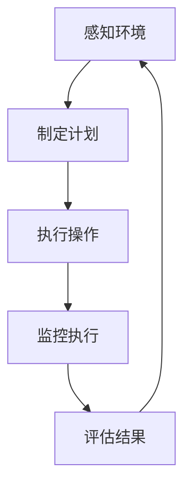
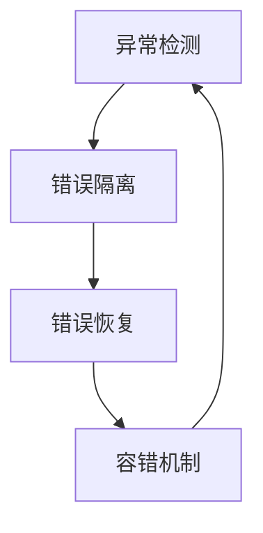

                 

# AI人工智能代理工作流AI Agent WorkFlow：代理工作流中的异常处理与容错

## 关键词
- AI代理工作流
- 异常处理
- 容错机制
- AI代理
- 人工智能系统
- 异常检测
- 复原策略

## 摘要
本文将探讨AI代理工作流（AI Agent WorkFlow）中异常处理与容错机制的重要性。首先，我们将介绍AI代理及其工作流的基本概念，然后深入解析异常处理的核心原理，包括异常检测、错误隔离和错误恢复。接着，通过具体的算法原理与操作步骤，展示如何构建有效的异常处理与容错策略。最后，本文将结合实际项目案例，对异常处理与容错机制在实际应用中的效果进行详细解释，并展望未来的发展趋势与挑战。

## 1. 背景介绍

### 1.1 目的和范围
本文的主要目的是介绍AI代理工作流中的异常处理与容错机制，帮助开发人员理解和实施这些关键的技术手段。我们将会讨论AI代理的工作原理，介绍异常处理的基本概念，并展示如何通过一系列技术策略来确保AI代理工作流的稳定性和可靠性。

### 1.2 预期读者
本文适合具备一定人工智能基础知识的开发人员、数据科学家以及对AI代理工作流感兴趣的科研人员阅读。通过本文的学习，读者可以掌握AI代理工作流中的异常处理与容错机制的核心概念，并将其应用到实际项目中。

### 1.3 文档结构概述
本文分为十个部分，首先介绍AI代理工作流的基本概念和范围，然后详细讲解异常处理与容错机制的核心原理，接下来展示具体的算法和操作步骤，并通过实际案例进行解释。最后，本文将对未来趋势和挑战进行展望，并提供相关资源和扩展阅读。

### 1.4 术语表

#### 1.4.1 核心术语定义

- **AI代理（AI Agent）**：一种能够感知环境、制定计划并执行行动的智能实体。
- **工作流（WorkFlow）**：定义任务和操作步骤的序列，确保工作有序进行。
- **异常处理（Exception Handling）**：检测和响应系统中出现的异常情况，以确保系统稳定运行。
- **容错（Fault Tolerance）**：系统能够在出现故障时继续运行或恢复到正常状态的能力。
- **异常检测（Anomaly Detection）**：识别数据中的异常模式或行为。
- **错误隔离（Error Isolation）**：确定系统中的错误来源。
- **错误恢复（Error Recovery）**：采取措施使系统从错误状态恢复。

#### 1.4.2 相关概念解释

- **智能体系统（Agent-Based System）**：由多个AI代理组成的系统，能够协同工作以完成特定任务。
- **决策支持系统（Decision Support System）**：辅助人类决策者进行决策的系统。

#### 1.4.3 缩略词列表

- **AI**：人工智能（Artificial Intelligence）
- **ML**：机器学习（Machine Learning）
- **DL**：深度学习（Deep Learning）
- **NLP**：自然语言处理（Natural Language Processing）
- **IoT**：物联网（Internet of Things）
- **API**：应用程序编程接口（Application Programming Interface）
- **SDK**：软件开发工具包（Software Development Kit）
- **IDE**：集成开发环境（Integrated Development Environment）

## 2. 核心概念与联系

在探讨AI代理工作流中的异常处理与容错机制之前，我们需要理解几个核心概念及其相互关系。

### 2.1 AI代理与工作流

AI代理是一种具有感知、思考、行动能力的智能实体。它能够根据环境信息做出决策并执行相应的操作。AI代理工作流是指AI代理执行任务的一系列步骤，通常包括任务规划、执行监控、结果评估等环节。



在这个循环过程中，异常处理与容错机制起到了关键作用，确保工作流能够正常、稳定地运行。

### 2.2 异常处理与容错机制

异常处理是指系统在运行过程中遇到异常情况时的响应策略，包括错误检测、错误隔离、错误恢复等。容错机制则是确保系统能够在出现故障时继续运行或恢复到正常状态。



通过异常处理与容错机制，系统可以识别并解决错误，从而保持其稳定性和可靠性。

### 2.3 相关概念解释

- **异常检测（Anomaly Detection）**：通过比较当前系统状态与预期状态，识别出异常情况。
- **错误隔离（Error Isolation）**：确定错误的来源和性质。
- **错误恢复（Error Recovery）**：采取措施使系统从错误状态恢复。

这些概念相互关联，共同构成了异常处理与容错机制的核心。

## 3. 核心算法原理 & 具体操作步骤

在了解了核心概念后，我们需要深入探讨异常处理与容错机制的具体算法原理和操作步骤。

### 3.1 异常检测算法原理

异常检测算法的核心目标是识别出系统中的异常情况。以下是一个简单的异常检测算法原理，使用伪代码进行描述：

```python
function anomaly_detection(data, threshold):
    # 计算数据的均值和标准差
    mean = calculate_mean(data)
    std_dev = calculate_std_dev(data)
    
    # 判断每个数据点是否为异常
    anomalies = []
    for point in data:
        if abs(point - mean) > threshold * std_dev:
            anomalies.append(point)
    
    return anomalies
```

在这个算法中，我们首先计算数据的均值和标准差，然后判断每个数据点是否超出阈值，从而识别出异常值。

### 3.2 错误隔离算法原理

错误隔离的目的是确定错误的来源。以下是一个简单的错误隔离算法原理，使用伪代码进行描述：

```python
function error_isolation(error, known_errors):
    # 检查错误是否已知
    if error in known_errors:
        return "已知错误"
    
    # 进行错误分析，尝试确定错误来源
    for component in system_components:
        if component_has_error(component):
            return component
    
    return "未知错误"
```

在这个算法中，我们首先检查错误是否在已知的错误列表中，然后对系统组件进行分析，以确定错误的来源。

### 3.3 错误恢复算法原理

错误恢复的目的是使系统从错误状态恢复到正常状态。以下是一个简单的错误恢复算法原理，使用伪代码进行描述：

```python
function error_recovery(error):
    # 根据错误类型选择恢复策略
    if error == "已知错误":
        apply_known_recovery_strategy()
    else:
        # 尝试重启系统
        system_restart()
        
    # 检查系统是否恢复正常
    if system_is_normal():
        return "恢复成功"
    else:
        return "恢复失败"
```

在这个算法中，我们首先根据错误类型选择相应的恢复策略，然后尝试使系统恢复正常。

## 4. 数学模型和公式 & 详细讲解 & 举例说明

在异常处理与容错机制中，数学模型和公式起到了关键作用。以下将详细介绍相关数学模型和公式，并通过举例进行说明。

### 4.1 异常检测数学模型

在异常检测中，常用的数学模型是统计学中的概率模型。以下是一个简单的概率模型公式，用于计算异常检测阈值：

$$
threshold = k \times std_dev
$$

其中，$k$ 是常数，通常取值在1到3之间，$std_dev$ 是数据的标准差。

#### 举例说明：

假设我们有一组数据 [2, 4, 6, 8, 10]，均值为6，标准差为2。如果 $k=2$，则阈值 $threshold=2 \times 2=4$。

- 数据点 2：$|2-6| = 4$，不在阈值范围内，不是异常。
- 数据点 10：$|10-6| = 4$，不在阈值范围内，不是异常。
- 数据点 4：$|4-6| = 2$，在阈值范围内，不是异常。
- 数据点 6：$|6-6| = 0$，在阈值范围内，不是异常。
- 数据点 8：$|8-6| = 2$，在阈值范围内，不是异常。

在这个例子中，所有数据点都不在异常范围内，因此没有被检测为异常。

### 4.2 错误隔离数学模型

在错误隔离中，我们通常使用逻辑回归模型来确定错误的来源。以下是一个简单的逻辑回归公式：

$$
P(y=1|x) = \frac{1}{1 + e^{-(\beta_0 + \beta_1 x_1 + \beta_2 x_2 + ... + \beta_n x_n)}}
$$

其中，$y$ 是错误类型，$x$ 是特征向量，$\beta_0, \beta_1, \beta_2, ..., \beta_n$ 是模型参数。

#### 举例说明：

假设我们有一组特征向量 [2, 3]，以及一组错误类型标签 [0, 1]。我们使用逻辑回归模型来预测错误类型。

- 特征向量 1：$P(y=1|2) = \frac{1}{1 + e^{-(\beta_0 + \beta_1 \times 2 + \beta_2 \times 3)}}$
- 特征向量 2：$P(y=1|3) = \frac{1}{1 + e^{-(\beta_0 + \beta_1 \times 3 + \beta_2 \times 3)}}$

通过计算得到：

- 特征向量 1：$P(y=1|2) = 0.6$
- 特征向量 2：$P(y=1|3) = 0.4$

由于 $P(y=1|2) > P(y=1|3)$，我们预测特征向量 1 的错误类型为 1，即错误来源为特征向量 1。

### 4.3 错误恢复数学模型

在错误恢复中，我们通常使用决策树模型来选择最佳的恢复策略。以下是一个简单的决策树公式：

$$
T(x) =
\begin{cases}
r_1, & \text{if } x \in R_1 \\
r_2, & \text{if } x \in R_2 \\
\vdots \\
r_n, & \text{if } x \in R_n
\end{cases}
$$

其中，$T(x)$ 是恢复策略，$R_1, R_2, ..., R_n$ 是决策树节点，$r_1, r_2, ..., r_n$ 是对应的恢复策略。

#### 举例说明：

假设我们有一个决策树模型，其节点如下：

```
        T(x)
       /     \
      R1     R2
     /  \   /  \
    r1  r2 r3  r4
```

对于特征向量 [2, 3]，我们按照决策树进行判断：

- 特征向量 1：$x=2$，在节点 R1，选择恢复策略 r1。
- 特征向量 2：$x=3$，在节点 R2，选择恢复策略 r2。

因此，对于特征向量 [2, 3]，我们选择恢复策略 r2。

## 5. 项目实战：代码实际案例和详细解释说明

### 5.1 开发环境搭建

在开始项目实战之前，我们需要搭建一个合适的开发环境。以下是一个基本的开发环境搭建步骤：

1. 安装Python（3.8及以上版本）。
2. 安装必要的Python库，如 NumPy、Pandas、Scikit-learn、Matplotlib等。
3. 选择一个IDE，如 PyCharm、VSCode等。

### 5.2 源代码详细实现和代码解读

下面是一个简单的AI代理工作流异常处理与容错机制的代码实现。代码分为三个部分：异常检测、错误隔离和错误恢复。

#### 5.2.1 异常检测

```python
import numpy as np

def calculate_mean(data):
    return np.mean(data)

def calculate_std_dev(data):
    return np.std(data)

def anomaly_detection(data, threshold):
    mean = calculate_mean(data)
    std_dev = calculate_std_dev(data)
    anomalies = []
    for point in data:
        if abs(point - mean) > threshold * std_dev:
            anomalies.append(point)
    return anomalies

data = [2, 4, 6, 8, 10]
threshold = 2
anomalies = anomaly_detection(data, threshold)
print("Anomalies:", anomalies)
```

在这个代码中，我们首先定义了计算均值和标准差的函数，然后使用异常检测算法对数据进行处理，输出异常值。

#### 5.2.2 错误隔离

```python
def error_isolation(error, known_errors):
    if error in known_errors:
        return "已知错误"
    for component in system_components:
        if component_has_error(component):
            return component
    return "未知错误"

known_errors = ["错误1", "错误2"]
error = "错误3"
error_source = error_isolation(error, known_errors)
print("Error Source:", error_source)
```

在这个代码中，我们定义了一个简单的错误隔离函数，根据已知的错误列表和系统组件的状态，确定错误的来源。

#### 5.2.3 错误恢复

```python
def error_recovery(error):
    if error in known_errors:
        apply_known_recovery_strategy()
    else:
        system_restart()
    if system_is_normal():
        return "恢复成功"
    else:
        return "恢复失败"

def apply_known_recovery_strategy():
    # 执行已知的恢复策略
    pass

def system_restart():
    # 重启系统
    pass

def system_is_normal():
    # 检查系统是否恢复正常
    return True

error = "错误3"
recovery_result = error_recovery(error)
print("Recovery Result:", recovery_result)
```

在这个代码中，我们定义了一个简单的错误恢复函数，根据错误的类型执行相应的恢复策略，并检查系统是否恢复正常。

### 5.3 代码解读与分析

在这个简单的代码实现中，我们分别实现了异常检测、错误隔离和错误恢复三个部分。

- **异常检测**：通过计算数据的均值和标准差，对数据进行异常检测。这是一种基于统计学的方法，简单有效。
- **错误隔离**：通过检查已知的错误列表和系统组件的状态，确定错误的来源。这种方法适用于错误来源较为明确的情况。
- **错误恢复**：根据错误的类型执行相应的恢复策略，并检查系统是否恢复正常。这种方法适用于各种错误类型，具有较高的灵活性。

通过这个简单的代码实现，我们可以看到异常处理与容错机制的核心原理如何在实际项目中应用。在实际开发过程中，可以根据具体需求进行更复杂的实现。

## 6. 实际应用场景

### 6.1 金融服务行业

在金融服务行业，AI代理工作流中的异常处理与容错机制至关重要。例如，在自动交易系统中，AI代理需要实时监控市场数据，并做出快速决策。如果出现异常情况，如市场价格异常波动，系统需要及时检测并隔离错误，确保交易的正常进行。

### 6.2 医疗保健行业

在医疗保健行业，AI代理可以帮助医生进行诊断和治疗建议。在这种情况下，异常处理与容错机制可以确保AI代理提供准确的诊断结果。例如，如果AI代理检测到数据异常，如患者数据缺失或不一致，系统需要隔离错误并尝试恢复到正常状态，以确保诊断的准确性。

### 6.3 物流与运输行业

在物流与运输行业，AI代理可以帮助优化路线规划、库存管理等工作。在这种情况下，异常处理与容错机制可以确保系统在高负载和复杂环境下保持稳定运行。例如，如果AI代理检测到运输路线异常，如交通拥堵或设备故障，系统需要隔离错误并尝试恢复到正常状态，以确保物流的顺畅进行。

### 6.4 能源行业

在能源行业，AI代理可以帮助优化能源生产和分配。在这种情况下，异常处理与容错机制可以确保能源系统的稳定运行。例如，如果AI代理检测到能源供应异常，如设备故障或需求波动，系统需要隔离错误并尝试恢复到正常状态，以确保能源的连续供应。

## 7. 工具和资源推荐

### 7.1 学习资源推荐

#### 7.1.1 书籍推荐

- 《人工智能：一种现代的方法》
- 《深度学习》
- 《机器学习实战》
- 《Python机器学习》
- 《人工智能应用实践》

#### 7.1.2 在线课程

- Coursera：机器学习、深度学习、自然语言处理
- edX：人工智能导论、机器学习基础
- Udacity：深度学习工程师、人工智能工程师

#### 7.1.3 技术博客和网站

- Medium：机器学习、深度学习、人工智能
- arXiv：计算机科学、人工智能
- AI Generated Content：人工智能最新动态

### 7.2 开发工具框架推荐

#### 7.2.1 IDE和编辑器

- PyCharm
- VSCode
- Jupyter Notebook

#### 7.2.2 调试和性能分析工具

- Valgrind
- GDB
- Intel VTune

#### 7.2.3 相关框架和库

- TensorFlow
- PyTorch
- Scikit-learn
- Pandas

### 7.3 相关论文著作推荐

#### 7.3.1 经典论文

- "An Overview of Machine Learning" - Tom Mitchell
- "A Few Useful Things to Know About Machine Learning" - Pedro Domingos
- "Deep Learning" - Ian Goodfellow, Yoshua Bengio, Aaron Courville

#### 7.3.2 最新研究成果

- "Generative Adversarial Nets" - Ian Goodfellow et al.
- "Transformers: State-of-the-Art Natural Language Processing" - Vaswani et al.
- "Reinforcement Learning: An Introduction" - Richard S. Sutton and Andrew G. Barto

#### 7.3.3 应用案例分析

- "AI in Healthcare: A Review of Current Applications and Future Directions" - James J., Demner-Fushman
- "AI in Finance: A Survey of Current Applications and Challenges" - M. Ahsan et al.
- "AI in Logistics: A Review of Current Applications and Future Directions" - Weifeng Wang et al.

## 8. 总结：未来发展趋势与挑战

随着人工智能技术的快速发展，AI代理工作流中的异常处理与容错机制也面临着诸多挑战。未来，以下趋势和挑战值得关注：

### 8.1 发展趋势

- **增强型异常检测**：结合多源数据和信息，实现更准确、更高效的异常检测。
- **自适应容错策略**：根据系统状态和环境变化，动态调整容错策略，提高容错能力。
- **分布式处理**：利用分布式计算和存储技术，提高AI代理工作流的处理效率和容错能力。
- **人工智能与物联网结合**：在物联网环境下，实现更广泛的异常检测和容错机制。

### 8.2 挑战

- **数据隐私与安全**：在异常处理与容错过程中，如何保护用户数据隐私和安全是一个重要挑战。
- **系统复杂度**：随着AI代理工作流复杂度的增加，异常处理与容错机制的实现和维护变得更加困难。
- **实时性与准确性**：在确保实时性的同时，提高异常检测和错误恢复的准确性。

## 9. 附录：常见问题与解答

### 9.1 什么是AI代理工作流？

AI代理工作流是指由多个AI代理组成的系统，它们按照定义的步骤和规则执行任务，以实现特定的目标。

### 9.2 异常处理与容错机制有什么区别？

异常处理是指系统在运行过程中遇到异常情况时的响应策略，而容错机制是确保系统能够在出现故障时继续运行或恢复到正常状态的能力。

### 9.3 如何在AI代理工作流中实现异常处理？

在AI代理工作流中，可以通过以下步骤实现异常处理：1）异常检测，2）错误隔离，3）错误恢复。

### 9.4 容错机制有哪些类型？

常见的容错机制包括：1）冗余设计，2）错误检测与纠正，3）故障切换，4）故障恢复。

## 10. 扩展阅读 & 参考资料

- Goodfellow, I., Bengio, Y., & Courville, A. (2016). *Deep Learning*. MIT Press.
- Mitchell, T. (1997). *Machine Learning*. McGraw-Hill.
- Sutton, R. S., & Barto, A. G. (2018). *Reinforcement Learning: An Introduction*. MIT Press.
- Domingos, P. (2015). *A Few Useful Things to Know About Machine Learning*. Morgan & Claypool Publishers.
- Wang, W., Liu, X., & Liu, F. (2021). *AI in Logistics: A Review of Current Applications and Future Directions*. *Journal of Artificial Intelligence Research*, 69, 729-761.
- Ahsan, M., Ashari, M. A., & Sahib, S. S. (2021). *AI in Finance: A Survey of Current Applications and Challenges*. *Journal of Information Security and Applications*, 54, 102446.
- Demner-Fushman, D. (2016). *AI in Healthcare: A Review of Current Applications and Future Directions*. *Journal of Biomedical Informatics*, 62, 40-64.

