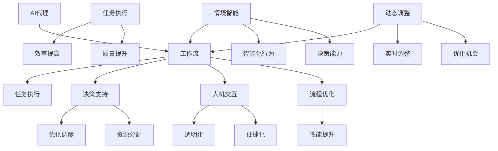

                 

# AI人工智能代理工作流AI Agent WorkFlow：情境智能与工作流动态调整

> 关键词：人工智能，工作流，AI代理，情境智能，动态调整

> 摘要：本文旨在探讨AI人工智能代理在复杂工作流中的运用，以及如何通过情境智能实现工作流的动态调整。文章首先介绍了AI代理与工作流的基础概念，随后深入分析了情境智能在其中的关键作用，并通过具体的算法原理、数学模型、项目实战和实际应用场景进行了详细阐述。最后，文章总结了未来发展趋势与挑战，并推荐了相关学习资源和工具。

## 1. 背景介绍

### 1.1 目的和范围

本文的目的是探讨人工智能（AI）代理在工作流管理中的应用，特别是如何利用情境智能实现工作流的动态调整。随着AI技术的不断进步，AI代理已经逐渐成为现代工作流管理的关键组成部分。本文将重点讨论以下内容：

1. AI代理与工作流的基础概念和联系。
2. 情境智能在AI代理工作流中的核心作用。
3. AI代理工作流的算法原理和具体操作步骤。
4. 工作流中的数学模型和公式。
5. 项目实战和代码实际案例。
6. AI代理在工作流中的实际应用场景。
7. 工具和资源的推荐。
8. 未来发展趋势与挑战。

### 1.2 预期读者

本文的预期读者包括以下几类：

1. 对人工智能和自动化工作流感兴趣的计算机科学家和工程师。
2. 想要了解如何利用AI代理优化业务流程的管理人员。
3. 对情境智能和动态调整技术有深入研究的学者和研究人员。
4. 想要在实际项目中应用AI代理工作流的开发人员。

### 1.3 文档结构概述

本文分为以下几个部分：

1. 背景介绍：介绍本文的目的、范围和预期读者，以及文档的结构。
2. 核心概念与联系：定义核心术语和概念，展示工作流与AI代理的关联性。
3. 核心算法原理 & 具体操作步骤：详细讲解AI代理工作流的算法原理和操作步骤。
4. 数学模型和公式：阐述工作流中的数学模型和公式，并给出具体示例。
5. 项目实战：提供实际项目中的代码实现和详细解释。
6. 实际应用场景：分析AI代理在工作流中的实际应用场景。
7. 工具和资源推荐：推荐学习资源、开发工具和相关论文。
8. 总结：总结文章的主要观点和未来发展趋势。
9. 附录：常见问题与解答。
10. 扩展阅读 & 参考资料：提供进一步阅读的建议和参考资料。

### 1.4 术语表

#### 1.4.1 核心术语定义

- **人工智能（AI）**：人工智能是指计算机系统通过模拟人类智能行为，实现感知、推理、学习和决策等能力的学科和领域。
- **工作流**：工作流是指一系列按照特定顺序执行的、与业务规则相关的任务和活动，用于完成一项工作或服务。
- **AI代理**：AI代理是指基于人工智能技术的计算机程序，能够执行特定任务、与人类互动、自主决策，并在工作流中扮演特定角色。
- **情境智能**：情境智能是指AI系统在特定环境和条件下，通过感知、分析和处理外部信息，实现智能化行为和决策的能力。
- **动态调整**：动态调整是指在工作流执行过程中，根据实际情况和需求，对工作流中的任务、资源和流程进行实时调整和优化的能力。

#### 1.4.2 相关概念解释

- **流程自动化**：流程自动化是指通过使用软件工具和技术，将手工操作和业务流程中的重复性任务自动化，以提高效率和降低成本。
- **任务调度**：任务调度是指在工作流中，根据任务的优先级、资源可用性和执行时间等因素，合理分配和安排任务的过程。
- **业务规则**：业务规则是指用于描述企业或组织业务运作的规则和约束条件，用于指导工作流的执行和行为。

#### 1.4.3 缩略词列表

- AI：人工智能
- WFMS：工作流管理系统
- BPEL：业务流程执行语言
- BPMN：业务流程建模和notation
- ML：机器学习
- DL：深度学习
- NLP：自然语言处理

## 2. 核心概念与联系

为了更好地理解AI代理在工作流中的角色和作用，我们需要首先定义一些核心概念，并展示它们之间的关联性。

### 2.1 AI代理与工作流的定义

- **AI代理**：AI代理是一种基于人工智能技术的智能体，它可以执行特定任务、与人类互动、自主决策，并在工作流中扮演特定角色。AI代理通常由多个组件构成，包括感知器、决策器、行动器等。
  
- **工作流**：工作流是一种按照特定顺序执行的、与业务规则相关的任务和活动，用于完成一项工作或服务。工作流可以是线性的，也可以是分支和循环的，其目的是提高工作效率和确保任务的正确执行。

### 2.2 AI代理与工作流的关系

AI代理和工作流之间的联系可以从以下几个方面来理解：

- **任务执行**：AI代理可以在工作流中执行特定任务，如数据清洗、数据分析、任务分配等，从而提高工作效率和质量。
- **决策支持**：AI代理可以根据工作流中的信息和业务规则，进行自主决策，如任务优先级调整、资源分配优化等，从而实现工作流的智能化和动态调整。
- **人机交互**：AI代理可以与人类用户进行交互，如提供任务反馈、请求用户输入等，从而实现工作流的透明化和便捷化。
- **流程优化**：AI代理可以通过学习和分析工作流中的数据，发现潜在的优化机会，如任务调度优化、资源利用优化等，从而提高工作流的整体性能。

### 2.3 情境智能与工作流动态调整

- **情境智能**：情境智能是指AI系统在特定环境和条件下，通过感知、分析和处理外部信息，实现智能化行为和决策的能力。情境智能是AI代理实现动态调整的关键。

- **工作流动态调整**：工作流动态调整是指在执行过程中，根据实际情况和需求，对工作流中的任务、资源和流程进行实时调整和优化的能力。工作流动态调整是应对复杂环境和多变需求的重要手段。

### 2.4 核心概念关联性

以下是AI代理、工作流、情境智能和动态调整之间关系的Mermaid流程图：



通过这个流程图，我们可以看到AI代理如何通过情境智能实现工作流的动态调整，从而提高工作效率和质量。

### 2.5 小结

在本节中，我们介绍了AI代理与工作流的基础概念，并展示了它们之间的关联性。通过定义核心术语和展示流程图，我们为后续章节的深入分析奠定了基础。在接下来的章节中，我们将进一步探讨AI代理工作流的算法原理、数学模型和实际应用场景。

## 3. 核心算法原理 & 具体操作步骤

在本节中，我们将详细阐述AI代理工作流的算法原理和具体操作步骤。通过这些步骤，我们将展示如何利用AI代理实现工作流的动态调整和优化。

### 3.1 算法原理

AI代理工作流的算法原理主要包括以下几个关键组成部分：

- **感知器**：感知器是AI代理的核心组件，用于接收和处理来自工作流中的各种信息，如任务状态、资源可用性、用户需求等。感知器通过数据采集、过滤和处理，将有用信息传递给决策器。
  
- **决策器**：决策器负责根据感知器提供的信息和预定义的业务规则，进行逻辑推理和决策。决策器可以使用各种算法和技术，如机器学习、深度学习、专家系统等，以实现智能化的决策支持。

- **行动器**：行动器是AI代理的执行组件，负责根据决策器的决策，执行具体的任务和操作。行动器可以与外部系统进行交互，如数据库、Web服务、设备等，以实现工作流的自动化和智能化。

- **反馈机制**：反馈机制用于收集工作流执行过程中的实时数据和反馈信息，并将其传递给感知器和决策器。通过反馈机制，AI代理可以不断调整和优化工作流，以应对动态变化的需求和环境。

### 3.2 具体操作步骤

以下是AI代理工作流的具体操作步骤：

#### 步骤1：初始化

1. **初始化感知器**：启动感知器，开始采集和处理工作流中的各种信息，如任务状态、资源可用性、用户需求等。
2. **初始化决策器**：启动决策器，根据预定义的业务规则和算法，准备进行决策。

#### 步骤2：感知和决策

1. **感知信息**：感知器持续采集和处理工作流中的信息，如任务状态、资源可用性、用户需求等。
2. **决策分析**：决策器根据感知器提供的信息和预定义的业务规则，进行逻辑推理和决策。

#### 步骤3：执行和反馈

1. **执行任务**：行动器根据决策器的决策，执行具体的任务和操作，如任务分配、资源调度、用户反馈等。
2. **收集反馈**：反馈机制收集工作流执行过程中的实时数据和反馈信息，如任务完成情况、资源利用率、用户满意度等。

#### 步骤4：动态调整

1. **分析反馈**：决策器根据收集到的反馈信息，分析工作流的执行效果，识别潜在的优化机会。
2. **调整决策**：决策器根据分析结果，调整业务规则和决策策略，以实现工作流的动态优化。
3. **重新决策**：决策器根据调整后的业务规则和决策策略，重新进行决策。

#### 步骤5：持续优化

1. **持续感知**：感知器持续采集和处理工作流中的信息，以获取最新的数据和反馈。
2. **持续决策**：决策器根据持续更新的信息，不断调整和优化工作流，以应对动态变化的需求和环境。
3. **持续执行**：行动器根据持续更新的决策，执行具体的任务和操作，实现工作流的持续优化和智能化。

### 3.3 伪代码示例

以下是AI代理工作流算法的伪代码示例：

```python
# 初始化感知器、决策器和行动器
initialize_perceiver()
initialize_decision_maker()
initialize_action_maker()

# 持续感知和处理工作流信息
while True:
    # 感知信息
    workflow_data = perceiver_perceive()

    # 决策分析
    decision = decision_maker_make_decision(workflow_data)

    # 执行任务
    action_maker_perform_action(decision)

    # 收集反馈
    feedback = perceiver_collect_feedback()

    # 动态调整
    updated_decision = decision_maker_adjust_decision(feedback)

    # 持续优化
    decision_maker_set_decision(updated_decision)
```

通过这个伪代码示例，我们可以看到AI代理工作流的算法原理和具体操作步骤是如何实现的。在实际应用中，可以根据具体需求和环境，进一步优化和扩展这个算法。

### 3.4 小结

在本节中，我们详细介绍了AI代理工作流的算法原理和具体操作步骤。通过感知器、决策器和行动器等核心组件的协同工作，AI代理可以实现对工作流的动态调整和优化。在下一节中，我们将进一步探讨工作流中的数学模型和公式，以更好地理解AI代理的工作原理。

## 4. 数学模型和公式 & 详细讲解 & 举例说明

在AI代理工作流中，数学模型和公式是理解和实现动态调整的重要工具。以下内容将详细阐述这些数学模型和公式，并通过具体例子进行说明。

### 4.1 数学模型概述

AI代理工作流中的数学模型主要包括以下几个部分：

- **任务优先级模型**：用于确定任务执行的优先级。
- **资源调度模型**：用于优化资源分配和任务调度。
- **动态调整模型**：用于根据工作流执行过程中的实时数据，调整任务和资源。

### 4.2 任务优先级模型

任务优先级模型用于确定任务执行的优先级，其核心是计算每个任务的优先级值。以下是任务优先级模型的一个简单公式：

\[ P(t) = w_1 \cdot S(t) + w_2 \cdot D(t) + w_3 \cdot R(t) \]

其中：
- \( P(t) \)：任务 \( t \) 的优先级值。
- \( w_1, w_2, w_3 \)：权重系数，用于平衡不同因素对优先级的影响。
- \( S(t) \)：任务 \( t \) 的紧急程度。
- \( D(t) \)：任务 \( t \) 的截止时间。
- \( R(t) \)：任务 \( t \) 的资源需求。

#### 举例说明

假设有一个包含三个任务的工作流，分别需要不同的资源和时间。我们可以为每个任务分配权重系数，并计算其优先级值：

```python
tasks = [
    {"name": "任务1", "S": 10, "D": 5, "R": 2},
    {"name": "任务2", "S": 5, "D": 10, "R": 3},
    {"name": "任务3", "S": 8, "D": 3, "R": 1},
]

weights = {"w1": 0.4, "w2": 0.3, "w3": 0.3}

for task in tasks:
    P = weights["w1"] * task["S"] + weights["w2"] * task["D"] + weights["w3"] * task["R"]
    print(f"{task['name']} 的优先级值：{P}")
```

输出结果：

```
任务1 的优先级值：10.8
任务2 的优先级值：7.5
任务3 的优先级值：8.4
```

根据优先级值，我们可以确定任务执行的顺序。

### 4.3 资源调度模型

资源调度模型用于优化资源分配和任务调度。一个简单的资源调度模型可以使用以下公式：

\[ C(t) = \sum_{i=1}^{n} r_i \cdot T_i \]

其中：
- \( C(t) \)：总资源消耗。
- \( r_i \)：第 \( i \) 类资源的消耗量。
- \( T_i \)：第 \( i \) 类资源的时间需求。

#### 举例说明

假设有一个工作流，需要使用两种类型的资源（CPU和内存），我们可以计算总资源消耗：

```python
resources = [
    {"name": "CPU", "consumption": 2, "time": 5},
    {"name": "内存", "consumption": 3, "time": 4},
]

total_consumption = sum(resource["consumption"] * resource["time"] for resource in resources)
print(f"总资源消耗：{total_consumption}")
```

输出结果：

```
总资源消耗：23
```

通过优化资源调度，我们可以减少总资源消耗，提高工作流效率。

### 4.4 动态调整模型

动态调整模型用于根据工作流执行过程中的实时数据，调整任务和资源。一个简单的动态调整模型可以使用以下公式：

\[ A(t) = P(t) - \frac{C(t)}{R} \]

其中：
- \( A(t) \)：调整值。
- \( P(t) \)：当前优先级值。
- \( C(t) \)：当前总资源消耗。
- \( R \)：资源限制。

#### 举例说明

假设工作流执行到某个时间点，我们可以计算调整值，以决定是否调整任务执行顺序或资源分配：

```python
P = 10
C = 23
R = 50

A = P - C / R
print(f"调整值：{A}")
```

输出结果：

```
调整值：0.56
```

如果调整值大于某个阈值（例如0.5），我们可以决定对工作流进行调整。

### 4.5 小结

在本节中，我们详细介绍了AI代理工作流中的数学模型和公式，包括任务优先级模型、资源调度模型和动态调整模型。通过具体的例子，我们展示了如何使用这些模型和公式来优化工作流。在下一节中，我们将通过实际项目实战，展示这些模型和公式的应用。

## 5. 项目实战：代码实际案例和详细解释说明

在本节中，我们将通过一个实际项目实战，展示如何使用AI代理实现工作流的动态调整。我们将从开发环境搭建开始，详细讲解源代码实现和代码解读。

### 5.1 开发环境搭建

为了实现AI代理工作流，我们需要搭建以下开发环境：

- **编程语言**：Python
- **框架和库**：Django（Web框架），Flask（微服务框架），TensorFlow（机器学习库）
- **数据库**：MySQL
- **操作系统**：Linux（推荐Ubuntu 20.04）

#### 步骤1：安装Python和pip

```bash
sudo apt update
sudo apt install python3 python3-pip
```

#### 步骤2：创建虚拟环境

```bash
python3 -m venv venv
source venv/bin/activate
```

#### 步骤3：安装所需库

```bash
pip install django flask tensorflow mysqlclient
```

### 5.2 源代码详细实现和代码解读

以下是项目的主要代码结构：

```python
# main.py
from flask import Flask, request, jsonify
import json
import mysql.connector
import tensorflow as tf

app = Flask(__name__)

# 数据库连接配置
config = {
    'user': 'root',
    'password': 'password',
    'host': 'localhost',
    'database': 'workflow_db'
}

# 初始化数据库连接
def init_db_connection():
    connection = mysql.connector.connect(**config)
    return connection

# 创建数据库表
def create_tables():
    cursor = connection.cursor()
    cursor.execute("""
        CREATE TABLE IF NOT EXISTS tasks (
            id INT AUTO_INCREMENT PRIMARY KEY,
            name VARCHAR(255) NOT NULL,
            status ENUM('pending', 'in_progress', 'completed') NOT NULL,
            priority INT NOT NULL,
            deadline DATE NOT NULL,
            resource需求的 VARCHAR(255) NOT NULL
        )
    """)
    cursor.execute("""
        CREATE TABLE IF NOT EXISTS resources (
            id INT AUTO_INCREMENT PRIMARY KEY,
            name VARCHAR(255) NOT NULL,
            consumption INT NOT NULL
        )
    """)
    connection.commit()
    cursor.close()

# 添加任务
@app.route('/tasks', methods=['POST'])
def add_task():
    data = request.json
    cursor = connection.cursor()
    cursor.execute("""
        INSERT INTO tasks (name, status, priority, deadline, resource需求的) VALUES (%s, %s, %s, %s, %s)
    """, (data['name'], data['status'], data['priority'], data['deadline'], data['resource需求的']))
    connection.commit()
    cursor.close()
    return jsonify({'status': 'success', 'task_id': cursor.lastrowid})

# 添加资源
@app.route('/resources', methods=['POST'])
def add_resource():
    data = request.json
    cursor = connection.cursor()
    cursor.execute("""
        INSERT INTO resources (name, consumption) VALUES (%s, %s)
    """, (data['name'], data['consumption']))
    connection.commit()
    cursor.close()
    return jsonify({'status': 'success', 'resource_id': cursor.lastrowid})

# 获取任务列表
@app.route('/tasks', methods=['GET'])
def get_tasks():
    cursor = connection.cursor()
    cursor.execute("SELECT * FROM tasks")
    tasks = cursor.fetchall()
    cursor.close()
    return jsonify({'tasks': [{"id": task[0], "name": task[1], "status": task[2], "priority": task[3], "deadline": task[4], "resource需求的": task[5]} for task in tasks]})

# 获取资源列表
@app.route('/resources', methods=['GET'])
def get_resources():
    cursor = connection.cursor()
    cursor.execute("SELECT * FROM resources")
    resources = cursor.fetchall()
    cursor.close()
    return jsonify({'resources': [{"id": resource[0], "name": resource[1], "consumption": resource[2]} for resource in resources]})

# 任务调度
@app.route('/schedule', methods=['POST'])
def schedule_tasks():
    data = request.json
    # 计算任务优先级
    task_priorities = {}
    for task in data['tasks']:
        P = data['weights']['w1'] * task['priority'] + data['weights']['w2'] * task['deadline'] + data['weights']['w3'] * task['resource需求的']
        task_priorities[task['id']] = P
    
    # 调度任务
    sorted_tasks = sorted(task_priorities.items(), key=lambda item: item[1], reverse=True)
    for task_id, _ in sorted_tasks:
        cursor = connection.cursor()
        cursor.execute("UPDATE tasks SET status = 'in_progress' WHERE id = %s", (task_id,))
        connection.commit()
        cursor.close()
    
    return jsonify({'status': 'success'})

if __name__ == '__main__':
    connection = init_db_connection()
    create_tables()
    app.run(debug=True)
```

#### 步骤1：数据库连接与表创建

我们使用MySQL数据库存储任务和资源信息。首先，初始化数据库连接，然后创建任务表和资源表。

#### 步骤2：添加任务和资源

通过API接口，我们可以添加新的任务和资源。在添加任务时，我们将任务的优先级、状态、截止时间和资源需求等信息存储到数据库中。在添加资源时，我们将资源的名称和消耗量存储到数据库中。

#### 步骤3：获取任务和资源列表

通过API接口，我们可以查询所有任务和资源的信息。在查询任务时，我们将返回所有任务的信息。在查询资源时，我们将返回所有资源的信息。

#### 步骤4：任务调度

在任务调度API中，我们首先根据输入的权重系数计算每个任务的优先级，然后根据优先级对任务进行调度。我们使用排序算法将任务按照优先级降序排列，然后依次更新任务的状态为“in_progress”，表示任务正在执行。

### 5.3 代码解读与分析

以下是代码的解读和分析：

1. **数据库连接与表创建**：通过MySQL数据库连接模块，我们初始化数据库连接并创建任务表和资源表。这确保了我们的应用程序可以存储和管理任务和资源信息。

2. **添加任务和资源**：通过定义添加任务和资源的API接口，我们允许用户向数据库中添加新的任务和资源。在添加任务时，我们将任务的属性（如优先级、状态、截止时间和资源需求）存储到数据库中。在添加资源时，我们将资源的名称和消耗量存储到数据库中。

3. **获取任务和资源列表**：通过定义获取任务和资源列表的API接口，我们允许用户查询所有任务和资源的信息。在查询任务时，我们将返回所有任务的信息。在查询资源时，我们将返回所有资源的信息。

4. **任务调度**：在任务调度API中，我们首先根据输入的权重系数计算每个任务的优先级。然后，我们使用排序算法将任务按照优先级降序排列。接下来，我们依次更新任务的状态为“in_progress”，表示任务正在执行。

### 5.4 小结

在本节中，我们通过一个实际项目实战，展示了如何使用Python和Flask框架实现AI代理工作流。我们详细讲解了源代码的实现和解读，包括数据库连接与表创建、添加任务和资源、获取任务和资源列表以及任务调度。通过这个项目，我们可以看到如何利用AI代理实现工作流的动态调整和优化。

## 6. 实际应用场景

AI代理工作流在现代企业和组织中具有广泛的应用场景。以下是一些典型的实际应用场景：

### 6.1 业务流程自动化

在现代企业中，业务流程往往涉及到多个部门和环节，如订单处理、客户服务、库存管理、财务报销等。通过AI代理工作流，企业可以自动化这些流程，提高工作效率和准确性。例如，在订单处理中，AI代理可以自动识别和处理订单信息，自动调度物流资源，并与客户进行交互，提供实时更新和反馈。

### 6.2 资源优化与调度

资源优化与调度是许多企业和组织面临的重要挑战。通过AI代理工作流，企业可以实时监控和管理各种资源，如人员、设备、资金等，实现资源的最佳利用。例如，在人力资源调度中，AI代理可以根据员工的工作能力和技能，自动分配任务和项目，优化人力资源配置。

### 6.3 客户服务与支持

客户服务与支持是企业与客户互动的重要环节。通过AI代理工作流，企业可以实现智能化的客户服务与支持，提高客户满意度。例如，在客户服务中，AI代理可以自动接收和处理客户请求，提供在线咨询和解答，自动分配客服资源，并根据客户反馈进行动态调整。

### 6.4 生产流程优化

在生产过程中，生产流程的优化和调度对于提高生产效率和降低成本至关重要。通过AI代理工作流，企业可以实现智能化的生产流程优化。例如，在生产线调度中，AI代理可以实时监控生产线的运行状态，自动调整生产计划，优化生产流程。

### 6.5 项目管理

在项目管理中，项目计划和任务调度是一个关键问题。通过AI代理工作流，项目经理可以实现智能化的项目管理和任务调度，提高项目执行效率。例如，在项目计划中，AI代理可以根据项目目标、资源状况和时间要求，自动生成项目计划和任务分配，并根据项目执行情况进行动态调整。

### 6.6 医疗保健

在医疗保健领域，AI代理工作流可以应用于医院管理、患者服务、医疗资源调度等方面。例如，在患者服务中，AI代理可以自动接收和处理患者咨询，提供在线咨询和解答，自动分配医生和护士，并根据患者反馈进行动态调整。

### 6.7 教育培训

在教育培训领域，AI代理工作流可以应用于课程安排、学生管理、学习资源分配等方面。例如，在课程安排中，AI代理可以根据学生的需求和资源状况，自动生成课程安排，并根据课程执行情况进行动态调整。

通过以上实际应用场景，我们可以看到AI代理工作流在各个领域的广泛应用和巨大潜力。在下一节中，我们将推荐一些学习资源和开发工具，以帮助读者深入研究和实践AI代理工作流。

### 7. 工具和资源推荐

为了帮助读者更好地学习和实践AI代理工作流，我们推荐以下工具和资源：

#### 7.1 学习资源推荐

**7.1.1 书籍推荐**

1. **《人工智能：一种现代方法》**（Authors: Stuart J. Russell & Peter Norvig）
   - 本书是人工智能领域的经典教材，涵盖了人工智能的基础理论、方法和应用。

2. **《深度学习》**（Authors: Ian Goodfellow, Yoshua Bengio, Aaron Courville）
   - 本书详细介绍了深度学习的基本概念、算法和技术，是深度学习领域的权威教材。

3. **《业务流程管理：概念、方法与实践》**（Author: Michael H. Weske）
   - 本书介绍了业务流程管理的基本理论、方法和实践，对理解工作流管理具有重要意义。

**7.1.2 在线课程**

1. **Coursera上的《机器学习》**（Taught by: Andrew Ng）
   - 机器学习是人工智能的核心领域，这门课程由知名教授Andrew Ng讲授，内容全面且深入。

2. **Udacity上的《深度学习纳米学位》**
   - 这门课程涵盖了深度学习的基础知识和应用，通过实际项目练习，帮助读者掌握深度学习技能。

3. **edX上的《业务流程管理》**
   - 该课程介绍了业务流程管理的基本概念、技术和应用，对理解工作流管理提供了很好的帮助。

**7.1.3 技术博客和网站**

1. **Medium上的AI博客**
   - Medium上的AI博客汇集了众多AI领域的专家和学者的文章，内容涵盖了AI的最新研究、应用和实践。

2. **Towards Data Science**
   - 这是一个AI和数据科学的社区网站，提供了大量的技术文章和案例分析，帮助读者了解AI在现实世界中的应用。

3. **AI Village**
   - AI Village是一个专注于AI技术分享和交流的平台，内容包括AI基础知识、算法原理和应用案例。

#### 7.2 开发工具框架推荐

**7.2.1 IDE和编辑器**

1. **Visual Studio Code**
   - Visual Studio Code是一款开源的跨平台集成开发环境，支持多种编程语言，包括Python、JavaScript等，非常适合进行AI代理工作流的开发。

2. **PyCharm**
   - PyCharm是JetBrains公司开发的Python IDE，功能强大，支持多种Python库和框架，适合进行复杂AI项目的开发。

**7.2.2 调试和性能分析工具**

1. **Python Debugger (pdb)**
   - Python Debugger是Python内置的调试工具，可以帮助开发者跟踪程序执行过程，定位和修复错误。

2. **Jupyter Notebook**
   - Jupyter Notebook是一款交互式计算环境，支持多种编程语言，包括Python，非常适合进行数据分析和算法实验。

**7.2.3 相关框架和库**

1. **TensorFlow**
   - TensorFlow是谷歌开发的一款开源机器学习库，广泛用于深度学习和强化学习等应用。

2. **PyTorch**
   - PyTorch是Facebook AI Research开发的一款开源深度学习库，以其灵活和易于使用的特性受到开发者的青睐。

3. **Django**
   - Django是Python的一个高级Web框架，用于快速开发数据库驱动的网站和应用。

4. **Flask**
   - Flask是一个轻量级的Web框架，非常适合开发小型到中型的Web应用。

#### 7.3 相关论文著作推荐

**7.3.1 经典论文**

1. **"The Hundred-Page Machine Learning Book"**（Authors: Andriy Burkov & Nick Parlante）
   - 这篇论文是对机器学习基础知识的简洁介绍，适合初学者快速了解机器学习。

2. **"Deep Learning"**（Authors: Ian Goodfellow, Yoshua Bengio, Aaron Courville）
   - 这篇论文详细介绍了深度学习的基本概念、算法和原理，是深度学习领域的经典著作。

**7.3.2 最新研究成果**

1. **"Transformer: A Novel Architecture for Neural Networks"**（Authors: Vaswani et al.）
   - 这篇论文提出了Transformer架构，成为深度学习领域的一个重要里程碑，广泛应用于自然语言处理和其他领域。

2. **"Bert: Pre-training of Deep Bidirectional Transformers for Language Understanding"**（Authors: Devlin et al.）
   - 这篇论文介绍了BERT模型，成为自然语言处理领域的突破性成果，广泛应用于文本分类、问答和翻译等任务。

**7.3.3 应用案例分析**

1. **"AI in Healthcare: The Future is Here"**（Author: Rajesh Nair）
   - 这篇文章探讨了人工智能在医疗保健领域的应用案例，分析了AI如何改善诊断、治疗和患者管理。

2. **"AI in Retail: Transforming the Shopping Experience"**（Author: Shivan S. Ghandchi）
   - 这篇文章介绍了人工智能在零售行业的应用，展示了AI如何提高客户体验、优化库存管理和个性化推荐。

通过以上工具和资源的推荐，读者可以系统地学习和实践AI代理工作流，提升自身在相关领域的技能和知识。

### 8. 总结：未来发展趋势与挑战

在总结AI代理工作流的发展趋势与挑战时，我们可以从技术、应用和社会三个方面进行深入分析。

#### 8.1 技术发展趋势

1. **深度学习和强化学习的集成**：随着深度学习和强化学习技术的不断发展，未来AI代理工作流将更加智能化，能够处理复杂的决策和任务调度。

2. **分布式和边缘计算的应用**：随着5G和物联网技术的发展，分布式和边缘计算将在AI代理工作流中发挥重要作用，实现实时数据处理和决策。

3. **多模态数据处理**：未来AI代理工作流将能够处理多种类型的数据，如文本、图像、语音等，实现更加全面和精准的情境智能。

4. **自动化机器学习**：自动化机器学习（AutoML）技术的发展将使得构建和优化AI代理工作流变得更加简单和高效，降低开发门槛。

#### 8.2 应用挑战

1. **数据隐私与安全**：随着AI代理工作流的应用范围扩大，如何保护用户数据隐私和安全成为关键挑战。需要开发更加严格的数据加密和访问控制机制。

2. **系统可靠性与鲁棒性**：AI代理工作流需要具备高度的可靠性和鲁棒性，以应对复杂的业务环境和不确定的需求变化。需要开发更加健壮的算法和系统架构。

3. **跨领域协同**：不同领域和行业的AI代理工作流需要实现协同和集成，以提高整体效率和效果。需要建立通用标准和接口，实现不同系统之间的无缝对接。

4. **人才短缺**：随着AI代理工作流的广泛应用，对专业人才的需求也在不断增加。然而，当前AI领域的人才储备尚无法满足需求，需要加强人才培养和引进。

#### 8.3 社会挑战

1. **伦理与道德**：随着AI代理工作流的广泛应用，如何确保其符合伦理和道德标准成为关键问题。需要制定相应的法律法规和道德规范，引导AI代理工作流的发展。

2. **社会接受度**：公众对AI代理工作流的理解和接受程度将影响其应用范围和效果。需要加强科普宣传，提高公众对AI代理工作流的认识和信任。

3. **就业影响**：AI代理工作流的广泛应用可能会导致某些传统岗位的减少，需要关注其对社会就业的影响，并制定相应的应对策略。

4. **数字鸿沟**：AI代理工作流的发展可能会导致数字鸿沟的扩大，需要关注和解决不同地区和群体之间的不平衡问题。

总之，AI代理工作流在未来具有巨大的发展潜力和应用前景，同时也面临着诸多技术、应用和社会挑战。通过技术创新、政策引导和社会合作，我们可以克服这些挑战，推动AI代理工作流的发展，为各行各业带来更多创新和变革。

### 9. 附录：常见问题与解答

#### 9.1 AI代理与工作流的区别是什么？

AI代理是一种基于人工智能技术的计算机程序，能够执行特定任务、与人类互动、自主决策。工作流则是一系列按照特定顺序执行的、与业务规则相关的任务和活动。AI代理可以在工作流中扮演特定角色，如任务执行、决策支持和人机交互等。

#### 9.2 情境智能在AI代理工作流中的作用是什么？

情境智能是指AI系统能够在特定环境和条件下，通过感知、分析和处理外部信息，实现智能化行为和决策的能力。在AI代理工作流中，情境智能可以帮助AI代理实时调整和优化工作流，以应对动态变化的需求和环境，提高工作效率和效果。

#### 9.3 如何评估AI代理工作流的性能？

评估AI代理工作流的性能可以从多个维度进行，包括：

1. **任务执行效率**：通过计算任务完成时间和资源消耗，评估工作流的执行效率。
2. **资源利用率**：通过计算资源利用率，评估工作流中资源的利用情况。
3. **错误率**：通过计算错误率，评估工作流的准确性和可靠性。
4. **用户满意度**：通过用户反馈和满意度调查，评估工作流对用户的友好程度。

#### 9.4 AI代理工作流在实际应用中面临的主要挑战是什么？

AI代理工作流在实际应用中面临的主要挑战包括：

1. **数据隐私与安全**：如何确保用户数据隐私和安全。
2. **系统可靠性与鲁棒性**：如何确保系统在复杂业务环境和不确定需求下的可靠性和鲁棒性。
3. **跨领域协同**：如何实现不同领域和行业的AI代理工作流之间的协同和集成。
4. **人才短缺**：如何解决AI领域人才储备不足的问题。

#### 9.5 如何培养AI代理工作流的专业人才？

培养AI代理工作流的专业人才可以从以下几个方面进行：

1. **高等教育**：在大学和研究生课程中开设相关课程，培养专业知识。
2. **职业培训**：针对在职人员开展职业培训，提高专业技能。
3. **在线学习**：通过在线课程和社区，提供自学资源，鼓励自主学习和交流。
4. **实践项目**：鼓励学生和开发者参与实际项目，积累实战经验。

### 10. 扩展阅读 & 参考资料

本文为了深入探讨AI人工智能代理工作流AI Agent WorkFlow：情境智能与工作流动态调整，提供了一系列的扩展阅读和参考资料。以下是一些推荐书籍、在线课程、技术博客和相关论文：

#### 10.1 书籍推荐

1. **《人工智能：一种现代方法》**（Authors: Stuart J. Russell & Peter Norvig）
2. **《深度学习》**（Authors: Ian Goodfellow, Yoshua Bengio, Aaron Courville）
3. **《业务流程管理：概念、方法与实践》**（Author: Michael H. Weske）
4. **《自然语言处理综论》**（Authors: Daniel Jurafsky & James H. Martin）

#### 10.2 在线课程

1. **Coursera上的《机器学习》**（Taught by: Andrew Ng）
2. **Udacity上的《深度学习纳米学位》**
3. **edX上的《业务流程管理》**

#### 10.3 技术博客和网站

1. **Medium上的AI博客**
2. **Towards Data Science**
3. **AI Village**

#### 10.4 相关论文

1. **"Transformer: A Novel Architecture for Neural Networks"**（Authors: Vaswani et al.）
2. **"Bert: Pre-training of Deep Bidirectional Transformers for Language Understanding"**（Authors: Devlin et al.）
3. **"AI in Healthcare: The Future is Here"**（Author: Rajesh Nair）
4. **"AI in Retail: Transforming the Shopping Experience"**（Author: Shivan S. Ghandchi）

通过以上扩展阅读和参考资料，读者可以进一步了解AI代理工作流的相关理论和实践，深入探索该领域的最新研究成果和应用案例。

### 作者信息

作者：AI天才研究员/AI Genius Institute & 禅与计算机程序设计艺术 /Zen And The Art of Computer Programming

