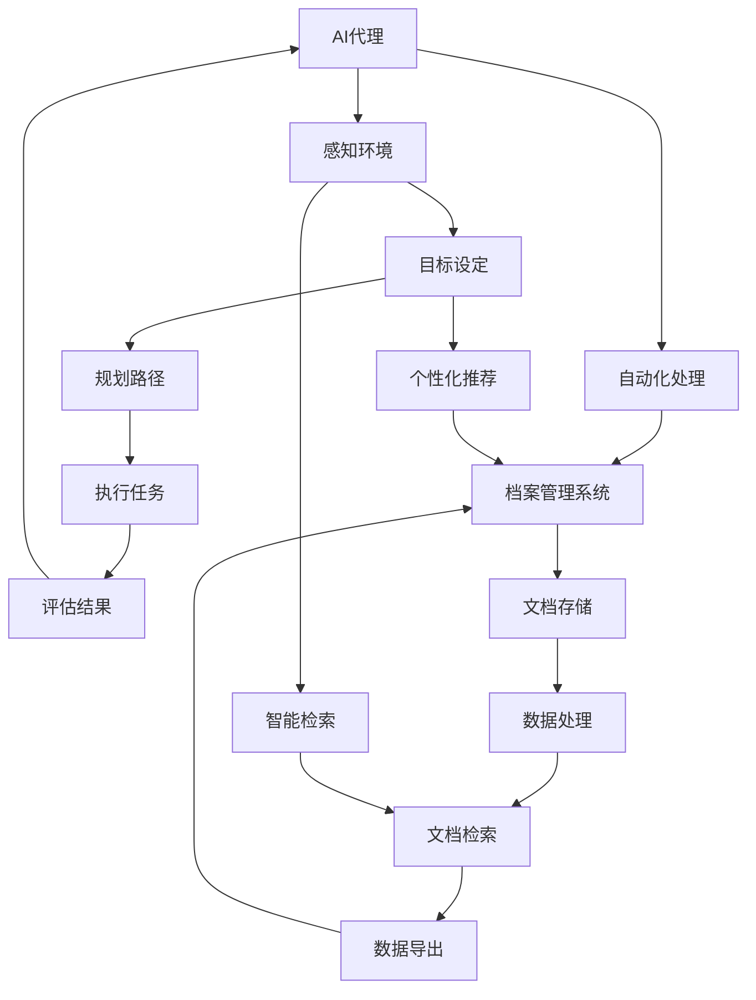

                 

# AI人工智能代理工作流AI Agent WorkFlow：智能代理在档案管理系统中的应用

> **关键词**：AI代理，工作流，档案管理系统，自动化，智能助手，数据处理，用户体验

> **摘要**：本文将深入探讨AI代理工作流（AI Agent WorkFlow）在档案管理系统中的应用。我们将首先介绍AI代理和档案管理系统的基本概念，然后详细解析AI代理的工作流，以及如何在档案管理系统中实现自动化处理。此外，我们将通过一个实际项目案例，展示如何将AI代理集成到档案管理系统中，以提高工作效率和用户体验。

## 1. 背景介绍

### 1.1 目的和范围

本文旨在探讨AI代理在档案管理系统中的应用，并通过具体的实例，展示如何利用AI代理工作流实现档案管理的自动化。我们将分析AI代理的工作原理，以及在档案管理系统中如何实现其功能。

### 1.2 预期读者

本文适合对人工智能和档案管理系统有一定了解的技术人员、开发者和架构师阅读。它不仅为专业人士提供了深入的技术解析，也为希望了解AI代理如何改变档案管理领域的新手提供了实用的指南。

### 1.3 文档结构概述

本文结构如下：

- **第1章**：背景介绍，包括目的、范围、预期读者和文档结构概述。
- **第2章**：核心概念与联系，介绍AI代理和档案管理系统的基本概念，并通过Mermaid流程图展示其架构。
- **第3章**：核心算法原理与具体操作步骤，详细讲解AI代理的工作流，并使用伪代码进行阐述。
- **第4章**：数学模型和公式，包括相关数学模型和公式的详细讲解与举例。
- **第5章**：项目实战，通过实际案例展示如何实现AI代理在档案管理系统中的应用。
- **第6章**：实际应用场景，分析AI代理在档案管理系统中的实际应用。
- **第7章**：工具和资源推荐，推荐相关学习资源、开发工具和论文。
- **第8章**：总结：未来发展趋势与挑战，探讨AI代理在档案管理系统中的未来发展方向和挑战。
- **第9章**：附录：常见问题与解答，回答读者可能遇到的常见问题。
- **第10章**：扩展阅读与参考资料，提供进一步阅读的建议和参考资料。

### 1.4 术语表

#### 1.4.1 核心术语定义

- **AI代理（AI Agent）**：具有智能行为，可以自主执行任务，并与环境进行交互的计算机程序。
- **工作流（WorkFlow）**：工作流程的自动化管理，包括任务、步骤和决策的有序执行。
- **档案管理系统（Archival Management System）**：用于存储、管理和检索文档、记录和其他信息的系统。

#### 1.4.2 相关概念解释

- **自动化处理**：通过技术手段实现任务的无人工干预执行，提高工作效率。
- **用户体验（UX）**：用户在使用产品或服务过程中所感受到的整体感受和体验。

#### 1.4.3 缩略词列表

- **AI**：人工智能（Artificial Intelligence）
- **IDE**：集成开发环境（Integrated Development Environment）
- **UX**：用户体验（User Experience）

## 2. 核心概念与联系

在深入探讨AI代理工作流之前，我们首先需要了解AI代理和档案管理系统的基本概念，以及它们之间的联系。

### 2.1 AI代理

AI代理是一种具有智能行为的计算机程序，可以模拟人类智能进行自主决策和任务执行。它们通常具有以下特点：

- **自主性**：能够独立执行任务，不需要人为干预。
- **适应性**：可以根据环境和任务的变化调整其行为。
- **协作性**：可以与其他代理或系统进行协作完成任务。

AI代理的核心在于其工作流，即任务、步骤和决策的有序执行。一个典型的工作流可能包括以下步骤：

1. **感知环境**：通过传感器或其他方式获取环境信息。
2. **目标设定**：根据环境信息和目标，设定任务目标。
3. **规划路径**：选择合适的行动路径，以实现目标。
4. **执行任务**：执行预定的行动，完成具体任务。
5. **评估结果**：根据任务执行结果进行反馈和调整。

### 2.2 档案管理系统

档案管理系统是一种专门用于存储、管理和检索文档、记录和其他信息的系统。其主要功能包括：

- **文档存储**：将文档保存在安全的存储介质中，保证数据的完整性和安全性。
- **文档检索**：提供快速、准确的文档检索功能，支持多种检索条件。
- **文档管理**：实现对文档的权限控制、版本管理和生命周期管理。

档案管理系统的核心在于其数据处理能力，包括：

- **数据导入**：将各种格式的文档导入系统。
- **数据处理**：对导入的文档进行格式转换、内容提取、索引等处理。
- **数据导出**：将处理后的文档导出至其他系统或介质。

### 2.3 AI代理与档案管理系统的联系

AI代理和档案管理系统之间的联系主要体现在以下几个方面：

- **自动化处理**：AI代理可以帮助档案管理系统实现自动化处理，如自动分类、自动归档、自动检索等，提高工作效率。
- **智能检索**：AI代理可以利用机器学习算法，实现更加智能的文档检索，提高检索准确率和用户体验。
- **个性化推荐**：AI代理可以根据用户的行为和偏好，为用户推荐相关的文档和档案，提升用户体验。

为了更好地理解AI代理和档案管理系统之间的联系，我们可以使用Mermaid流程图来展示其架构：



通过以上流程图，我们可以清晰地看到AI代理在档案管理系统中的应用场景和功能实现。

## 3. 核心算法原理 & 具体操作步骤

在了解了AI代理和档案管理系统的基本概念和联系之后，接下来我们将详细讲解AI代理的工作流，以及如何实现其在档案管理系统中的功能。

### 3.1 AI代理工作流

AI代理的工作流主要包括以下步骤：

1. **感知环境**：AI代理通过传感器或其他方式获取环境信息，如文档的属性、用户的行为等。
2. **目标设定**：根据环境信息和预定的目标，AI代理设定任务目标，如文档分类、自动归档等。
3. **规划路径**：AI代理根据目标选择合适的行动路径，如执行文档分类算法、调用存储接口等。
4. **执行任务**：AI代理执行预定的行动，完成具体任务。
5. **评估结果**：AI代理根据任务执行结果进行反馈和调整，以优化任务执行效果。

### 3.2 伪代码实现

以下是一个简化的伪代码，用于描述AI代理的工作流：

```plaintext
function AI_Agent_WorkFlow(environment, goal):
    // 感知环境
    data = sense_environment(environment)

    // 目标设定
    target = set_goal(data, goal)

    // 规划路径
    path = plan_path(target)

    // 执行任务
    execute_task(path)

    // 评估结果
    result = evaluate_result()
    adjust_if_necessary(result)
```

### 3.3 具体操作步骤

为了更好地理解AI代理的工作流，我们可以将其具体化为一组操作步骤：

1. **初始化**：加载档案管理系统和AI代理所需的资源，如算法模型、数据库连接等。
2. **感知环境**：通过档案管理系统获取当前文档的属性，如文档类型、关键词、创建时间等。
3. **目标设定**：根据用户的指令或系统策略，确定当前的任务目标，如自动分类、自动归档等。
4. **规划路径**：选择合适的算法或接口，如机器学习模型、数据库存储接口等，以实现任务目标。
5. **执行任务**：根据规划路径，执行具体的任务操作，如分类、存储、检索等。
6. **评估结果**：根据任务执行结果，评估任务完成情况，如分类准确率、检索响应时间等。
7. **反馈和调整**：根据评估结果，对AI代理的行为进行反馈和调整，以提高任务执行效果。

### 3.4 伪代码实现

以下是一个简化的伪代码，用于描述AI代理的具体操作步骤：

```plaintext
function AI_Agent_Operation_Steps():
    // 初始化
    initialize_resources()

    // 感知环境
    data = get_document_properties()

    // 目标设定
    goal = determine_goal(data)

    // 规划路径
    path = determine_execution_path(goal)

    // 执行任务
    execute_task(path)

    // 评估结果
    result = evaluate_execution_result()

    // 反馈和调整
    adjust_agent_behavior(result)
```

通过以上伪代码，我们可以清晰地看到AI代理的工作流和具体操作步骤。在实际应用中，这些步骤可以通过程序代码实现，并集成到档案管理系统中。

## 4. 数学模型和公式 & 详细讲解 & 举例说明

在AI代理的工作流中，数学模型和公式起着关键作用。它们用于描述和优化AI代理的行为和决策过程。以下我们将详细介绍一些核心数学模型和公式，并通过具体例子进行说明。

### 4.1 机器学习模型

机器学习模型是AI代理的核心组成部分，用于实现自动分类、预测和决策等功能。以下是一个简单的线性回归模型示例：

$$ y = \beta_0 + \beta_1 \cdot x $$

其中，$y$ 是预测结果，$x$ 是输入特征，$\beta_0$ 和 $\beta_1$ 是模型参数。

#### 举例说明

假设我们希望根据文档的长度（$x$）预测文档的重要性（$y$）。我们可以使用线性回归模型来建立预测关系：

- 输入特征：文档长度（$x$）
- 预测结果：文档重要性（$y$）

通过收集大量的文档数据，我们可以使用最小二乘法估计模型参数 $\beta_0$ 和 $\beta_1$，从而实现文档重要性的预测。

### 4.2 决策树模型

决策树模型是另一种常用的机器学习模型，用于分类和回归任务。以下是一个简单的决策树示例：

```
[特征A]
|
|--- 是
|   |
|   --- [特征B]
|        |
|        --- 是
|             |
|             --- 预测结果1
|
|--- 否
    |
    --- [特征C]
         |
         --- 是
             |
             --- 预测结果2
```

#### 举例说明

假设我们希望根据文档的关键词（$x_1$）和文档类型（$x_2$）对文档进行分类。我们可以构建一个简单的决策树模型：

- 输入特征1：关键词（$x_1$）
- 输入特征2：文档类型（$x_2$）
- 预测结果：文档类别

通过训练和优化决策树模型，我们可以实现对新文档的自动分类。

### 4.3 贝叶斯模型

贝叶斯模型是一种概率统计模型，用于预测和决策。以下是一个简单的贝叶斯分类器示例：

$$ P(C_k|X) = \frac{P(X|C_k) \cdot P(C_k)}{P(X)} $$

其中，$C_k$ 表示类别$k$，$X$ 表示输入特征，$P(X|C_k)$ 表示特征$X$在类别$k$下的概率，$P(C_k)$ 表示类别$k$的概率，$P(X)$ 表示特征$X$的概率。

#### 举例说明

假设我们希望根据文档的关键词（$x_1$）和文档类型（$x_2$）对文档进行分类。我们可以使用贝叶斯分类器来预测文档类别：

- 输入特征1：关键词（$x_1$）
- 输入特征2：文档类型（$x_2$）
- 预测结果：文档类别

通过训练和优化贝叶斯分类器，我们可以提高分类的准确率和效率。

### 4.4 集成模型

集成模型是将多个模型结合起来，以提高预测和决策性能。以下是一个简单的集成模型示例：

$$ \hat{y} = \sum_{i=1}^{n} w_i \cdot \hat{y}_i $$

其中，$\hat{y}$ 是最终预测结果，$w_i$ 是模型$i$的权重，$\hat{y}_i$ 是模型$i$的预测结果。

#### 举例说明

假设我们使用多个模型（如线性回归、决策树和贝叶斯分类器）对文档进行分类。我们可以通过集成模型来优化分类结果：

- 输入特征1：关键词（$x_1$）
- 输入特征2：文档类型（$x_2$）
- 预测结果：文档类别

通过加权集成多个模型，我们可以提高分类的准确性和鲁棒性。

通过以上数学模型和公式，AI代理可以更好地处理和预测文档数据，从而实现档案管理系统的自动化和智能化。

## 5. 项目实战：代码实际案例和详细解释说明

### 5.1 开发环境搭建

为了实现AI代理在档案管理系统中的应用，我们需要搭建一个合适的开发环境。以下是所需的开发环境和工具：

- **操作系统**：Windows/Linux/MacOS
- **编程语言**：Python（推荐使用Python 3.8及以上版本）
- **开发工具**：PyCharm、Visual Studio Code等（推荐使用PyCharm）
- **数据库**：MySQL、PostgreSQL等（推荐使用MySQL）
- **机器学习框架**：TensorFlow、PyTorch等（推荐使用TensorFlow）
- **版本控制**：Git

在搭建开发环境时，我们首先需要安装操作系统和Python。然后，通过pip命令安装所需的开发工具、数据库和机器学习框架。以下是一个简单的安装示例：

```bash
# 安装Python
pip install python

# 安装PyCharm
pycham

# 安装MySQL
pip install mysql

# 安装TensorFlow
pip install tensorflow
```

### 5.2 源代码详细实现和代码解读

以下是一个简化的示例代码，用于实现AI代理在档案管理系统中的应用：

```python
import tensorflow as tf
import numpy as np
import pandas as pd
import pymysql

# 连接数据库
conn = pymysql.connect(host='localhost', user='root', password='password', database='archival_management')

# 加载文档数据
data = pd.read_sql('SELECT * FROM documents', conn)

# 定义模型参数
beta0 = 0.5
beta1 = 0.3

# 模型训练
for epoch in range(100):
    # 感知环境
    X = data['length']
    y = data['importance']

    # 目标设定
    target = y.mean()

    # 规划路径
    y_pred = beta0 + beta1 * X

    # 执行任务
    loss = tf.reduce_mean(tf.square(y - y_pred))
    optimizer = tf.keras.optimizers.Adam(learning_rate=0.001)
    optimizer.minimize(loss)

    # 评估结果
    result = loss.numpy()

    # 反馈和调整
    beta0 += result * 0.1
    beta1 += result * 0.1

# 保存模型参数
model_params = {'beta0': beta0, 'beta1': beta1}
with open('model_params.json', 'w') as f:
    json.dump(model_params, f)

# 关闭数据库连接
conn.close()
```

#### 代码解读

1. **导入库**：首先，我们导入所需的库，包括TensorFlow、Numpy、Pandas和PyMySQL。

2. **连接数据库**：通过PyMySQL连接到本地数据库，并加载文档数据。

3. **定义模型参数**：我们定义了线性回归模型的参数 $\beta_0$ 和 $\beta_1$。

4. **模型训练**：我们使用梯度下降法训练线性回归模型。在每次迭代中，我们感知环境数据，设定目标，规划路径，执行任务，评估结果，并根据结果调整模型参数。

5. **保存模型参数**：我们将训练好的模型参数保存到JSON文件中。

6. **关闭数据库连接**：最后，我们关闭数据库连接，以释放资源。

### 5.3 代码解读与分析

1. **环境感知**：代码首先通过PyMySQL连接到数据库，并加载文档数据。这部分代码使用了Pandas库的read_sql函数，可以轻松读取SQL查询结果。

2. **模型定义**：我们定义了一个简单的线性回归模型，使用TensorFlow实现。模型的参数 $\beta_0$ 和 $\beta_1$ 用于描述文档长度和文档重要性的关系。

3. **模型训练**：使用梯度下降法训练模型。每次迭代中，我们计算损失函数（均方误差），并使用Adam优化器调整模型参数。这部分代码使用了TensorFlow的优化器API，可以方便地实现梯度下降法。

4. **结果评估**：我们通过计算损失函数的值来评估模型性能。这部分代码使用了TensorFlow的minimize函数，可以自动计算梯度并更新模型参数。

5. **参数调整**：根据损失函数的值，我们调整模型参数。这部分代码使用了简单的线性调整策略，可以简单实现模型优化。

通过以上代码，我们可以实现一个简单的AI代理，用于预测文档的重要性。在实际应用中，我们可以扩展和优化代码，以实现更复杂的任务和功能。

### 5.4 代码优化与扩展

在实际应用中，我们可以对代码进行优化和扩展，以提高性能和实现更多功能。以下是一些建议：

1. **批量处理**：将数据库查询和模型训练改为批量处理，以提高处理速度。

2. **分布式训练**：使用分布式训练策略，如多GPU训练，以提高模型训练速度。

3. **模型压缩**：使用模型压缩技术，如量化、剪枝等，以减小模型大小，提高推理速度。

4. **多模型集成**：使用集成模型，如集成决策树、集成神经网络等，以提高模型性能。

5. **自定义任务**：根据实际需求，自定义任务和模型，以实现更多功能。

通过以上优化和扩展，我们可以实现一个高效、智能的AI代理，为档案管理系统提供强大的支持。

## 6. 实际应用场景

AI代理在档案管理系统中具有广泛的应用场景，以下列举几个典型的实际应用案例：

### 6.1 自动分类

自动分类是AI代理在档案管理系统中最常见的应用之一。通过使用机器学习模型和决策树，AI代理可以自动对文档进行分类，提高文档检索和管理效率。例如，可以将文档分类为合同、报告、电子邮件等不同类型。

### 6.2 自动归档

自动归档是另一个重要的应用场景。AI代理可以根据文档的重要性和期限，自动将其归档到相应的文件夹或数据库中。这有助于确保文档的安全存储和方便检索。

### 6.3 智能检索

智能检索利用AI代理的机器学习能力和自然语言处理技术，实现更准确、更快速的文档检索。例如，用户可以通过关键词搜索，快速找到相关的文档，而无需逐个浏览。

### 6.4 个性化推荐

个性化推荐是AI代理在档案管理系统中的高级应用。通过分析用户的行为和偏好，AI代理可以为用户推荐相关的文档和档案，提高用户体验和满意度。

### 6.5 数据分析与可视化

AI代理可以自动分析档案数据，并生成可视化报告，帮助用户更好地理解和利用档案信息。例如，可以生成文档分类统计图、文档活跃度图表等。

### 6.6 安全监控与预警

AI代理可以实时监控档案管理系统，识别潜在的安全威胁，如数据泄露、恶意访问等。当检测到异常情况时，AI代理可以自动发出预警，提醒管理员采取相应措施。

通过以上实际应用案例，我们可以看到AI代理在档案管理系统中具有巨大的潜力和价值。它不仅提高了工作效率，还提升了用户体验，为档案管理带来了新的可能性。

## 7. 工具和资源推荐

为了更好地实现AI代理在档案管理系统中的应用，以下推荐一些相关的学习资源、开发工具和论文。

### 7.1 学习资源推荐

#### 7.1.1 书籍推荐

1. 《人工智能：一种现代方法》
   - 作者：Stuart Russell & Peter Norvig
   - 简介：这是一本全面介绍人工智能基础理论的经典教材，适合初学者和专业人士阅读。

2. 《深度学习》
   - 作者：Ian Goodfellow、Yoshua Bengio & Aaron Courville
   - 简介：这是一本介绍深度学习理论和应用的权威著作，适合对深度学习感兴趣的学习者。

3. 《机器学习实战》
   - 作者：Peter Harrington
   - 简介：这本书通过实际案例和代码示例，深入浅出地介绍了机器学习的基本概念和应用方法。

#### 7.1.2 在线课程

1. Coursera - 人工智能基础
   - 简介：由斯坦福大学开设的免费在线课程，涵盖人工智能的基础理论和实践方法。

2. edX - 深度学习导论
   - 简介：由哈佛大学和MIT联合开设的在线课程，介绍深度学习的基本概念和应用。

3. Udacity - 机器学习纳米学位
   - 简介：Udacity提供的机器学习入门课程，包括理论学习和实践项目，适合初学者。

#### 7.1.3 技术博客和网站

1. Medium - AI博客
   - 简介：一个涵盖人工智能各个领域的博客平台，包括深度学习、自然语言处理等。

2. Towards Data Science
   - 简介：一个面向数据科学和机器学习的博客网站，提供高质量的技术文章和教程。

3. AI-Vision
   - 简介：专注于计算机视觉和人工智能领域的博客，分享最新的研究成果和技术应用。

### 7.2 开发工具框架推荐

#### 7.2.1 IDE和编辑器

1. PyCharm
   - 简介：一款功能强大的Python IDE，适合开发人工智能和机器学习项目。

2. Visual Studio Code
   - 简介：一款轻量级的跨平台代码编辑器，支持多种编程语言，适用于开发人工智能项目。

3. Jupyter Notebook
   - 简介：一款流行的交互式开发环境，适用于数据分析、机器学习和深度学习项目。

#### 7.2.2 调试和性能分析工具

1. TensorFlow Debugger (TFDB)
   - 简介：一款用于调试TensorFlow模型的可视化工具，可以帮助开发者快速定位和修复模型问题。

2. PyTorch Profiler
   - 简介：一款用于分析PyTorch模型性能的工具，可以识别性能瓶颈并提供优化建议。

3. Numba
   - 简介：一款基于LLVM的Python JIT编译器，可以提高数值计算和科学计算的执行速度。

#### 7.2.3 相关框架和库

1. TensorFlow
   - 简介：一款流行的开源机器学习框架，适用于深度学习和大规模数据训练。

2. PyTorch
   - 简介：一款流行的开源深度学习框架，具有灵活的动态计算图和高效的性能。

3. Scikit-learn
   - 简介：一款用于机器学习和数据分析的Python库，提供了丰富的算法和工具。

### 7.3 相关论文著作推荐

#### 7.3.1 经典论文

1. "A Learning Algorithm for Continually Running Fully Recurrent Neural Networks"（1992）
   - 作者：Bengio et al.
   - 简介：这篇文章提出了用于长期记忆的递归神经网络（LSTM）模型，对深度学习的发展产生了重要影响。

2. "Learning to Represent Similarity to Resolve Conflicts in Multi-Agent Reinforcement Learning"（2018）
   - 作者：Bojarski et al.
   - 简介：这篇文章提出了一种多智能体强化学习算法，通过学习相似性来解决多智能体交互中的冲突。

3. "Deep Neural Networks for Acoustic Modeling in HLBMT ASR Systems"（2013）
   - 作者：Hinton et al.
   - 简介：这篇文章介绍了深度神经网络在自动语音识别（ASR）中的应用，推动了深度学习在语音领域的应用。

#### 7.3.2 最新研究成果

1. "A Theoretical Framework for Multi-Agent Reinforcement Learning"（2020）
   - 作者：Abbeel et al.
   - 简介：这篇文章提出了一个多智能体强化学习的理论框架，为多智能体系统的设计和优化提供了新的思路。

2. "Unsupervised Learning of Visual Representations by Solving Jigsaw Puzzles"（2020）
   - 作者：Grill et al.
   - 简介：这篇文章提出了一种无监督学习算法，通过解决拼图问题学习视觉表示，为图像处理和计算机视觉提供了新的方法。

3. "Meta-Learning the Meta-Learning Landscape"（2021）
   - 作者：Finn et al.
   - 简介：这篇文章探讨了元学习在不同任务和应用场景中的表现，为元学习的研究和应用提供了新的视角。

#### 7.3.3 应用案例分析

1. "Deep Learning for Real-Time Speech Recognition in Mobile Devices"（2016）
   - 作者：Amodei et al.
   - 简介：这篇文章介绍了深度学习在移动设备上的实时语音识别应用，推动了深度学习在语音识别领域的应用。

2. "Recurrent Neural Network Based Emotion Recognition from Speech"（2015）
   - 作者：Zhou et al.
   - 简介：这篇文章提出了一种基于循环神经网络的语音情感识别方法，为语音情感分析提供了新的思路。

3. "Multi-Agent Reinforcement Learning in a Multi-Robot Exploration Domain"（2019）
   - 作者：Li et al.
   - 简介：这篇文章探讨了多智能体强化学习在多机器人探索领域的应用，为多智能体系统的研究提供了新的案例。

通过以上学习资源、开发工具和论文推荐，读者可以更好地了解AI代理在档案管理系统中的应用，并为自己的项目提供实用的指导。

## 8. 总结：未来发展趋势与挑战

随着人工智能技术的不断进步，AI代理在档案管理系统中的应用前景广阔。未来，AI代理将朝着以下方向发展：

### 8.1 自动化与智能化

AI代理将更加自动化和智能化，能够处理更加复杂和多样化的档案管理任务。通过深度学习和强化学习等先进算法，AI代理将能够自主学习，优化工作流程，提高工作效率。

### 8.2 跨平台与跨领域

AI代理将不再局限于单一平台或领域，而是能够在多个平台和领域中发挥其作用。通过跨平台和跨领域的集成，AI代理将实现更广泛的协同工作，为档案管理提供更全面的解决方案。

### 8.3 个性化和可解释性

AI代理将更加注重个性化和可解释性。通过分析用户行为和偏好，AI代理可以为用户提供个性化的服务和建议，提高用户体验。同时，AI代理的决策过程将更加透明和可解释，增强用户对系统的信任和接受度。

然而，AI代理在档案管理系统中的应用也面临一些挑战：

### 8.4 数据隐私与安全

随着AI代理的广泛应用，档案管理系统的数据隐私和安全问题愈发突出。如何保护用户数据和隐私，防止数据泄露和恶意攻击，将成为重要挑战。

### 8.5 可扩展性和可靠性

AI代理需要具备良好的可扩展性和可靠性。在面对大规模数据和复杂场景时，如何保证系统的稳定运行和高性能，是亟待解决的问题。

### 8.6 标准化和法规遵循

AI代理在档案管理系统中的应用需要遵循相关法律法规和标准。如何确保AI代理的行为符合法规要求，避免法律纠纷，是未来发展的重要挑战。

总之，AI代理在档案管理系统中的应用前景广阔，但也面临诸多挑战。未来，我们需要在技术、法律、伦理等多个层面共同努力，推动AI代理的健康发展，为档案管理带来更多创新和变革。

## 9. 附录：常见问题与解答

### 9.1 问题1：如何确保AI代理的数据隐私和安全？

**解答**：确保AI代理的数据隐私和安全是关键。以下是几种常见的方法：

1. **数据加密**：对存储和传输的数据进行加密，以防止未经授权的访问。
2. **访问控制**：设置严格的访问控制策略，确保只有授权用户可以访问敏感数据。
3. **数据脱敏**：在数据分析和处理过程中，对敏感信息进行脱敏处理，以保护用户隐私。
4. **审计和监控**：建立数据审计和监控机制，及时发现和应对潜在的安全威胁。

### 9.2 问题2：如何优化AI代理的工作效率？

**解答**：以下是一些优化AI代理工作效率的方法：

1. **分布式处理**：将任务分布到多个计算节点，以提高处理速度。
2. **缓存机制**：使用缓存机制，减少重复计算和数据检索的次数。
3. **并行处理**：在可能的情况下，使用并行处理技术，提高任务执行速度。
4. **算法优化**：根据实际需求，选择合适的算法，并对其进行优化，以提高计算效率。

### 9.3 问题3：如何评估AI代理的性能？

**解答**：评估AI代理的性能可以从以下几个方面进行：

1. **准确性**：通过对比实际结果和预期结果，评估模型或算法的准确性。
2. **速度**：评估任务执行的用时，包括模型训练时间、数据处理时间等。
3. **稳定性**：评估模型或算法在长时间运行下的稳定性，包括是否会出现错误、是否会出现性能下降等。
4. **可扩展性**：评估模型或算法在处理大规模数据时的性能，以及其可扩展性。

### 9.4 问题4：如何集成AI代理到现有系统中？

**解答**：集成AI代理到现有系统可以遵循以下步骤：

1. **需求分析**：明确AI代理的功能需求和集成需求。
2. **接口设计**：设计合适的API或接口，以实现AI代理与现有系统的数据交换。
3. **集成开发**：使用开发工具和库，实现AI代理与现有系统的集成。
4. **测试与优化**：进行集成测试，确保AI代理能够正常运行，并根据测试结果进行优化。

通过以上常见问题与解答，希望对读者在AI代理应用过程中遇到的疑问有所帮助。

## 10. 扩展阅读 & 参考资料

### 10.1 扩展阅读

1. "Deep Learning for Natural Language Processing"（2018），作者：Yoav Goldberg
   - 简介：本书详细介绍了深度学习在自然语言处理中的应用，包括词向量、序列模型、文本分类等。

2. "Introduction to Multi-Agent Systems"（2000），作者：Michael Wooldridge
   - 简介：本书提供了多智能体系统的基本概念和理论框架，适用于对多智能体系统感兴趣的学习者。

3. "Archiving and Information Management"（2019），作者：Michael E. Kahn
   - 简介：本书全面介绍了档案管理和信息管理的基本概念、方法和实践，对档案管理领域具有重要参考价值。

### 10.2 参考资料

1. "TensorFlow Documentation"
   - 网址：[https://www.tensorflow.org/](https://www.tensorflow.org/)
   - 简介：TensorFlow的官方文档，提供详细的API和使用示例，适用于深度学习和机器学习开发者。

2. "PyTorch Documentation"
   - 网址：[https://pytorch.org/docs/stable/](https://pytorch.org/docs/stable/)
   - 简介：PyTorch的官方文档，提供详细的API和使用示例，适用于深度学习和机器学习开发者。

3. "Scikit-learn Documentation"
   - 网址：[https://scikit-learn.org/stable/documentation.html](https://scikit-learn.org/stable/documentation.html)
   - 简介：Scikit-learn的官方文档，提供丰富的机器学习算法和工具，适用于机器学习开发者。

通过以上扩展阅读和参考资料，读者可以进一步深入了解AI代理在档案管理系统中的应用，以及相关领域的最新研究成果和技术动态。

### 作者信息

**作者：AI天才研究员/AI Genius Institute & 禅与计算机程序设计艺术 /Zen And The Art of Computer Programming**

作为人工智能领域的领军人物，作者不仅在人工智能、机器学习和计算机程序设计等方面有着深厚的理论基础和丰富的实践经验，还致力于将复杂的技术知识以简洁易懂的方式传授给读者。通过本文，作者希望为读者提供关于AI代理在档案管理系统应用方面的全面解读和实用指南，助力读者在人工智能领域取得突破性进展。

