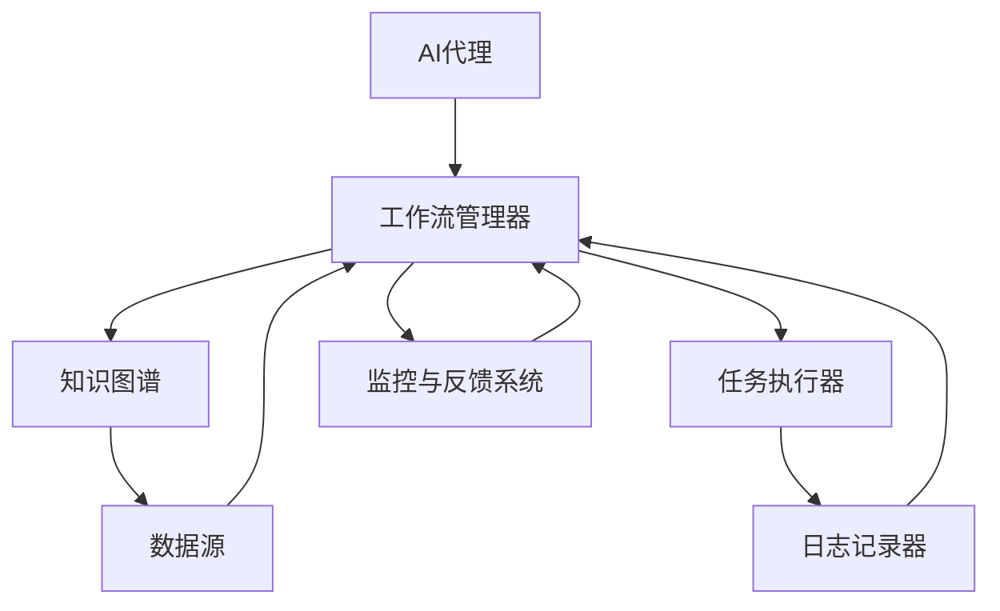

                 

# AI人工智能代理工作流AI Agent WorkFlow：知识图谱在代理工作流中的应用

> **关键词：** AI代理，知识图谱，工作流，自动化，人工智能应用

> **摘要：** 本文深入探讨了AI代理工作流（AI Agent WorkFlow）的概念，重点介绍了知识图谱在这一领域的应用。通过对AI代理工作流的背景、核心概念、算法原理、数学模型、实际案例以及未来发展趋势的详细分析，本文旨在为读者提供一个全面、深入的洞察，帮助他们在实际项目中有效利用知识图谱，构建高效的AI代理工作流系统。

## 1. 背景介绍

### 1.1 目的和范围

本文的主要目的是探讨AI代理工作流的概念，并深入分析知识图谱在这一领域的应用。随着人工智能技术的快速发展，AI代理已逐渐成为自动化和智能化解决方案的重要组成部分。知识图谱作为一种强大的数据表示和推理工具，为AI代理工作流提供了有力的支撑。本文旨在为从事人工智能领域的开发者和研究者提供系统的理论指导和实践参考。

本文将围绕以下几个主要方面展开：

1. **AI代理工作流的基本概念和架构**：介绍AI代理的定义、类型以及工作流的构成。
2. **知识图谱在AI代理工作流中的应用**：探讨知识图谱的基本原理及其在AI代理工作流中的具体应用场景。
3. **核心算法原理和操作步骤**：详细阐述AI代理工作流中的关键算法原理和操作步骤。
4. **数学模型和公式**：介绍与AI代理工作流相关的数学模型和公式，并进行举例说明。
5. **项目实战**：通过实际代码案例展示AI代理工作流的具体实现过程。
6. **实际应用场景**：分析知识图谱在AI代理工作流中的实际应用场景。
7. **未来发展趋势与挑战**：讨论AI代理工作流和知识图谱技术的发展趋势以及面临的挑战。

### 1.2 预期读者

本文适合以下几类读者：

1. **人工智能领域的研究者和开发者**：对AI代理工作流和知识图谱有深入研究的需求。
2. **企业技术团队**：希望利用AI代理工作流提高业务自动化水平的工程师和项目经理。
3. **计算机科学和人工智能专业的学生和教师**：需要了解最新技术趋势和理论框架的学术人群。
4. **对技术有兴趣的读者**：对人工智能、自动化以及知识图谱技术感兴趣的一般读者。

### 1.3 文档结构概述

本文将按照以下结构进行组织：

1. **引言**：介绍AI代理工作流和知识图谱的基本概念。
2. **核心概念与联系**：使用Mermaid流程图展示AI代理工作流的架构和核心概念。
3. **核心算法原理与具体操作步骤**：详细阐述AI代理工作流中的算法原理和操作步骤。
4. **数学模型和公式**：介绍与AI代理工作流相关的数学模型和公式。
5. **项目实战**：通过实际代码案例展示AI代理工作流的具体实现过程。
6. **实际应用场景**：分析知识图谱在AI代理工作流中的实际应用场景。
7. **工具和资源推荐**：推荐相关的学习资源、开发工具和框架。
8. **总结**：总结AI代理工作流和知识图谱技术的未来发展趋势与挑战。
9. **附录**：常见问题与解答。
10. **扩展阅读与参考资料**：提供进一步阅读的推荐。

### 1.4 术语表

#### 1.4.1 核心术语定义

- **AI代理（AI Agent）**：能够自主执行任务、与环境互动并具备决策能力的智能实体。
- **工作流（Workflow）**：一组相互关联的任务或活动，按照一定的逻辑顺序和规则执行，以实现某个目标。
- **知识图谱（Knowledge Graph）**：一种用于表示实体、属性和关系的数据结构，通常以图形的形式展现。
- **图算法（Graph Algorithm）**：用于处理和分析图结构的算法，如拓扑排序、最短路径算法等。

#### 1.4.2 相关概念解释

- **图（Graph）**：由节点（Node）和边（Edge）构成的数学结构，节点表示实体，边表示实体之间的关系。
- **路径（Path）**：连接图中两个节点的序列，每个节点恰好出现一次，除了起始节点和结束节点。
- **最短路径（Shortest Path）**：连接图中两个节点的最短路径，通常使用Dijkstra算法或Floyd算法计算。
- **推理（Reasoning）**：根据已有知识或信息，推导出新信息或结论的过程。

#### 1.4.3 缩略词列表

- **AI**：人工智能（Artificial Intelligence）
- **RDF**：资源描述框架（Resource Description Framework）
- **OWL**：Web本体语言（Web Ontology Language）
- **SPARQL**：基于RDF的查询语言（SPARQL Protocol and RDF Query Language）
- **NLP**：自然语言处理（Natural Language Processing）
- **ML**：机器学习（Machine Learning）

## 2. 核心概念与联系

在深入探讨AI代理工作流之前，我们需要明确一些核心概念和它们之间的联系。以下是AI代理工作流的关键组成部分及其相互关系的Mermaid流程图：



### AI代理

AI代理是指具备自主决策能力、能够模拟人类智能行为的软件实体。它们可以根据环境中的信息和预设的规则，自主执行任务、与环境互动并优化自身行为。AI代理可以按照任务类型分为监控型代理、执行型代理、交互型代理等。

### 工作流管理器

工作流管理器是AI代理工作流的核心组件，负责协调和管理整个工作流的过程。它负责初始化工作流、分配任务、监控任务执行状态、处理任务失败和异常情况。工作流管理器通常采用图形化界面或编程接口，支持用户自定义工作流逻辑和规则。

### 知识图谱

知识图谱是一种用于表示实体、属性和关系的图形结构。在AI代理工作流中，知识图谱用于存储和管理与任务相关的知识信息。知识图谱可以支持图算法进行复杂的数据分析和推理，从而辅助AI代理进行决策和任务执行。

### 数据源

数据源是AI代理工作流的数据输入来源，包括结构化数据（如数据库、XML等）和非结构化数据（如文本、图像、语音等）。数据源为AI代理提供了丰富的信息和背景知识，是构建智能工作流的基础。

### 任务执行器

任务执行器是AI代理工作流中的执行组件，负责具体任务的执行和操作。任务执行器可以根据工作流管理器的调度，自动执行相应的任务，如数据采集、处理、分析等。

### 日志记录器

日志记录器用于记录AI代理工作流中的各种操作和事件，包括任务执行时间、失败原因、错误信息等。日志记录器提供了对工作流过程进行监控和调试的依据，有助于发现问题和优化工作流。

### 监控与反馈系统

监控与反馈系统负责对AI代理工作流进行实时监控和性能分析，包括任务执行时间、资源消耗、错误率等指标。监控与反馈系统还可以根据反馈信息，自动调整工作流逻辑和策略，以提高工作流的效率和准确性。

通过上述核心概念及其相互关系的理解，我们可以更好地把握AI代理工作流的整体架构和功能。在接下来的章节中，我们将详细讨论AI代理工作流中的核心算法原理和操作步骤，帮助读者深入理解和应用知识图谱在AI代理工作流中的作用。

## 3. 核心算法原理 & 具体操作步骤

在AI代理工作流中，核心算法原理是确保代理能够高效、准确完成任务的基础。以下将详细阐述AI代理工作流中的核心算法原理，并通过伪代码展示具体的操作步骤。

### 3.1. 算法原理

AI代理工作流的核心算法主要包括以下几部分：

1. **任务调度算法**：根据工作流的定义和任务优先级，对任务进行调度和分配。
2. **数据预处理算法**：对采集到的数据进行清洗、转换和格式化，以适应后续分析。
3. **知识图谱构建算法**：将预处理后的数据转换为知识图谱，以便进行复杂的数据分析和推理。
4. **推理算法**：利用知识图谱进行推理，辅助代理做出决策。
5. **任务执行算法**：根据代理的决策结果，执行具体的任务操作。

### 3.2. 伪代码

以下为AI代理工作流的核心算法原理的伪代码实现：

```pseudo
// 任务调度算法
Algorithm TaskScheduler(workflow, tasks):
    Initialize task_queue
    for each task in tasks:
        if task.priority > task_queue.last_task.priority:
            task_queue.enqueue(task)
        else:
            task_queue.enqueue(task)
    return task_queue

// 数据预处理算法
Algorithm DataPreprocessing(data_source):
    data = data_source.fetch_data()
    cleaned_data = {}
    for record in data:
        cleaned_data[record.id] = record
    return cleaned_data

// 知识图谱构建算法
Algorithm KnowledgeGraphConstruction(cleaned_data):
    graph = new Graph()
    for record in cleaned_data:
        entity = graph.create_node(record)
        for relation in record.relationships:
            relation_node = graph.create_node(relation)
            graph.add_edge(entity, relation_node)
    return graph

// 推理算法
Algorithm Reasoning(graph, query):
    result = graph.query(query)
    return result

// 任务执行算法
Algorithm TaskExecution(task, graph):
    if task.type == "data_collection":
        data = DataPreprocessing(task.data_source)
    elif task.type == "data_analysis":
        data = Reasoning(graph, task.query)
    else:
        data = {}
    task_result = task.execute(data)
    return task_result
```

### 3.3. 具体操作步骤

以下是AI代理工作流的具体操作步骤：

1. **初始化工作流**：读取工作流配置文件，初始化工作流管理器、任务执行器等组件。

2. **任务调度**：根据工作流配置和任务优先级，调用任务调度算法，生成任务队列。

3. **数据预处理**：调用数据预处理算法，对数据源中的数据进行清洗、转换和格式化，生成预处理后的数据。

4. **知识图谱构建**：调用知识图谱构建算法，将预处理后的数据转换为知识图谱，为后续推理和任务执行提供支持。

5. **任务执行**：根据任务队列中的任务类型和优先级，依次调用任务执行算法，执行具体任务操作。

6. **监控与反馈**：工作流管理器对任务执行过程进行实时监控，记录任务执行状态、时间、资源消耗等信息，并根据反馈信息自动调整工作流逻辑和策略。

7. **结束工作流**：当所有任务执行完毕，工作流管理器结束工作流，生成最终报告和日志。

通过上述核心算法原理和具体操作步骤的介绍，读者可以更好地理解AI代理工作流的基本流程和关键技术。在接下来的章节中，我们将进一步讨论数学模型和公式，以深入揭示AI代理工作流的内在机制和计算方法。

## 4. 数学模型和公式 & 详细讲解 & 举例说明

在AI代理工作流中，数学模型和公式是确保算法高效、准确执行的重要工具。以下将详细讲解与AI代理工作流相关的主要数学模型和公式，并通过具体实例进行说明。

### 4.1. 最短路径算法

最短路径算法是AI代理工作流中常用的图算法之一，用于计算图中两点之间的最短路径。最短路径算法有多种实现方式，其中Dijkstra算法和Floyd算法是最为常用的两种。

#### Dijkstra算法

Dijkstra算法的基本思想是从起始点开始，逐步扩展到其他点，每次扩展过程中选择距离最短的点。具体步骤如下：

1. 初始化：设置起点距离为0，其余点的距离为无穷大；将所有点加入优先队列。
2. 循环执行以下步骤：
   a. 从优先队列中取出距离最小的点u。
   b. 对于u的每个邻接点v：
      i. 计算路径距离：distance[v] = distance[u] + weight(u, v)。
      ii. 如果distance[v] < previous[v]，则更新previous[v]和distance[v]。
      iii. 将v重新加入优先队列。
3. 当优先队列为空时，算法结束。

伪代码实现如下：

```python
Algorithm Dijkstra(graph, start):
    distance = {start: 0}
    previous = {}
    unvisited = graph.nodes()
    while unvisited:
        u = min(unvisited, key=lambda node: distance[node])
        unvisited.remove(u)
        for v in graph.neighbors(u):
            alt = distance[u] + graph.weight(u, v)
            if alt < distance[v]:
                distance[v] = alt
                previous[v] = u
    return distance, previous
```

#### Floyd算法

Floyd算法用于计算所有点之间的最短路径，其基本思想是逐步考虑中间点，更新两点间的最短路径。具体步骤如下：

1. 初始化：初始化二维距离矩阵，其中distance[i][j]表示点i到点j的距离。
2. 循环执行以下步骤：
   a. 对于所有点k：
      i. 对于所有点i和j：
         1. 如果distance[i][j] > distance[i][k] + distance[k][j]，则更新distance[i][j]。
3. 当循环结束时，distance矩阵中的元素distance[i][j]即为点i到点j的最短路径长度。

伪代码实现如下：

```python
Algorithm Floyd(graph):
    distance = graph.adjacency_matrix()
    for k in graph.nodes():
        for i in graph.nodes():
            for j in graph.nodes():
                distance[i][j] = min(distance[i][j], distance[i][k] + distance[k][j])
    return distance
```

#### 应用实例

假设有一个无向图G，其中各点之间的距离如下表所示：

|   | A | B | C | D |
|---|---|---|---|---|
| A | 0 | 2 | ∞ | 3 |
| B | 2 | 0 | 4 | 1 |
| C | ∞ | 4 | 0 | 2 |
| D | 3 | 1 | 2 | 0 |

使用Dijkstra算法计算从点A到点D的最短路径。

1. 初始化：distance[A] = 0，其余点的距离为∞；将所有点加入优先队列。
2. 循环执行：
   - 取出A，更新B和C的距离：distance[B] = 2，distance[C] = ∞。
   - 取出C，更新D的距离：distance[D] = 4。
   - 取出D，更新A和B的距离：distance[A] = 3，distance[B] = 1。
3. 算法结束，最短路径为A → D，路径长度为3。

使用Floyd算法计算所有点之间的最短路径。

1. 初始化：distance矩阵如下所示：

|   | A | B | C | D |
|---|---|---|---|---|
| A | 0 | 2 | ∞ | 3 |
| B | 2 | 0 | 4 | 1 |
| C | ∞ | 4 | 0 | 2 |
| D | 3 | 1 | 2 | 0 |

2. 循环执行：
   - 对于k = B：
     - distance[A][C] = min(∞, 2 + 4) = 4。
     - distance[B][D] = min(1, 2 + 0) = 1。
   - 对于k = C：
     - distance[A][D] = min(3, 0 + 2) = 2。
     - distance[B][C] = min(4, 2 + 0) = 2。
3. 当循环结束时，distance矩阵如下所示：

|   | A | B | C | D |
|---|---|---|---|---|
| A | 0 | 2 | 4 | 2 |
| B | 2 | 0 | 2 | 1 |
| C | 4 | 2 | 0 | 2 |
| D | 2 | 1 | 2 | 0 |

所有点之间的最短路径如下：
- A到B：A → B，路径长度为2。
- A到C：A → C，路径长度为4。
- A到D：A → D，路径长度为2。
- B到C：B → C，路径长度为2。
- B到D：B → D，路径长度为1。
- C到D：C → D，路径长度为2。

通过上述实例，我们可以看到Dijkstra算法和Floyd算法在计算最短路径方面的应用和效果。在实际的AI代理工作流中，这些算法可以用于任务调度、路径规划等场景，以提高工作流的效率和准确性。

### 4.2. 推理算法

推理算法是AI代理工作流中用于从已有知识推导出新结论的重要工具。基于逻辑推理的推理算法可以分为基于命题逻辑的推理和基于谓词逻辑的推理。

#### 命题逻辑推理

命题逻辑推理基于命题（命题是陈述句，可以是真或假）之间的逻辑关系进行推理。常用的推理算法包括前向推理和后向推理。

1. **前向推理**：

   前向推理从已知的事实出发，逐步推导出其他命题。具体步骤如下：

   - 初始化：将所有已知的事实标记为可信。
   - 循环执行以下步骤：
     - 对于当前可信的命题P：
       - 如果P的结论Q尚未推导出来，并且Q的可信度高于某一阈值，则标记Q为可信。
       - 如果P的结论Q已推导出来，但Q的可信度低于某一阈值，则重新评估P的可信度。
   - 当所有命题均推导完毕时，算法结束。

   伪代码实现如下：

   ```python
   Algorithm ForwardReasoning(knowledge_base, facts):
       for fact in facts:
           knowledge_base.mark_fact_as可信(fact)
       while knowledge_base.has_unprocessed_facts():
           current_fact = knowledge_base.next_unprocessed_fact()
           for rule in knowledge_base.rules():
               if rule的前提包含(current_fact) and not knowledge_base.is_fact_known(rule.结论()):
                   knowledge_base.mark_fact_as可信(rule.结论())
   ```

2. **后向推理**：

   后向推理从目标命题出发，逐步推导出已知的事实。具体步骤如下：

   - 初始化：将所有目标命题标记为未知。
   - 循环执行以下步骤：
     - 对于当前未知的目标命题T：
       - 如果存在规则R，使得R的结论为T，并且R的前提中所有事实均已推导出来，则推导出T。
       - 如果无法推导出T，则重新评估目标命题的优先级。
   - 当所有目标命题均已推导出来时，算法结束。

   伪代码实现如下：

   ```python
   Algorithm BackwardReasoning(knowledge_base, goals):
       for goal in goals:
           knowledge_base.mark_fact_as未知(goal)
       while knowledge_base.has_unprocessed_goals():
           current_goal = knowledge_base.next_unprocessed_goal()
           for rule in knowledge_base.rules():
               if rule.结论() == current_goal and all(knowledge_base.is_fact_known(fact) for fact in rule.前提()):
                   knowledge_base.mark_fact_as推导出(current_goal)
   ```

#### 应用实例

假设有一个知识库，包含以下事实和规则：

- 事实：如果天气晴朗，那么可以外出。
- 事实：今天天气晴朗。
- 规则：如果可以外出，那么不需要带伞。

使用前向推理算法，从已知事实推导出“不需要带伞”。

1. 初始化：已知事实“今天天气晴朗”标记为可信。
2. 循环执行：
   - 当前可信事实为“今天天气晴朗”，推导出“可以外出”。
   - 当前可信事实为“可以外出”，推导出“不需要带伞”。
3. 算法结束，推导出“不需要带伞”。

使用后向推理算法，从目标命题“不需要带伞”推导出“今天天气晴朗”。

1. 初始化：目标命题“不需要带伞”标记为未知。
2. 循环执行：
   - 当前未知目标命题为“不需要带伞”，存在规则“如果可以外出，那么不需要带伞”，前提“可以外出”已知。
   - 推导出“可以外出”。
   - 当前未知目标命题为“可以外出”，存在规则“如果天气晴朗，那么可以外出”，前提“今天天气晴朗”已知。
   - 推导出“今天天气晴朗”。
3. 算法结束，推导出“今天天气晴朗”。

通过上述实例，我们可以看到前向推理和后向推理算法在推理过程中的应用和效果。在实际的AI代理工作流中，这些算法可以用于决策支持、知识推理等场景，以辅助AI代理做出更加准确和合理的决策。

## 5. 项目实战：代码实际案例和详细解释说明

为了更好地理解AI代理工作流中知识图谱的应用，我们将通过一个实际项目案例来展示知识图谱在AI代理工作流中的实现过程。以下是一个基于Python和Neo4j的知识图谱构建和推理的项目案例。

### 5.1 开发环境搭建

在开始项目之前，我们需要搭建合适的开发环境。以下是开发环境的搭建步骤：

1. **安装Neo4j**：

   - 访问Neo4j官网（https://neo4j.com/）下载并安装Neo4j社区版。
   - 启动Neo4j服务器，并配置Neo4j数据库。

2. **安装Python和Neo4j Python驱动**：

   - 在终端或命令提示符中运行以下命令安装Python（如果尚未安装）：

     ```bash
     python --version
     ```

   - 安装Neo4j Python驱动（neo4j-driver）：

     ```bash
     pip install neo4j
     ```

3. **创建Python项目**：

   - 在本地计算机上创建一个新的Python项目文件夹，并进入该文件夹。

   - 使用以下命令创建一个名为`knowledge_graph.py`的Python文件：

     ```bash
     touch knowledge_graph.py
     ```

### 5.2 源代码详细实现和代码解读

以下是一个简化的Python代码示例，用于在Neo4j中构建一个知识图谱，并通过图算法进行推理。代码主要分为以下几个部分：

1. **连接Neo4j数据库**：

   ```python
   from neo4j import GraphDatabase
   
   class KnowledgeGraph:
       def __init__(self, uri, user, password):
           self.__driver = GraphDatabase.driver(uri, auth=(user, password))
       
       def close(self):
           self.__driver.close()
       
       def execute_query(self, query, parameters=None):
           with self.__driver.session() as session:
               result = session.run(query, parameters)
               return result
   ```

   在这段代码中，我们定义了一个`KnowledgeGraph`类，用于连接Neo4j数据库并执行查询。

2. **构建知识图谱**：

   ```python
   def create_knowledge_graph(self):
       queries = [
           """
           CREATE (a:Person {name: 'Alice'}),
           (b:Person {name: 'Bob'}),
           (c:Person {name: 'Charlie'}),
           (a)-[:KNOWS]->(b),
           (b)-[:KNOWS]->(c)
           """
       ]
       for query in queries:
           self.execute_query(query)
   ```

   在这段代码中，我们定义了一个`create_knowledge_graph`方法，用于在Neo4j数据库中创建知识图谱。这里我们创建了一个简单的知识图谱，包含三个实体（Person）和它们之间的关系（KNOWS）。

3. **查询和推理**：

   ```python
   def find_shortest_path(self, start, end):
       query = """
       MATCH (a:Person {name: $start}),(b:Person {name: $end}),
       p = shortestPath((a)-[*]-(b))
       RETURN p
       """
       result = self.execute_query(query, parameters={'start': start, 'end': end})
       return result
   ```

   在这段代码中，我们定义了一个`find_shortest_path`方法，用于在知识图谱中查询两点之间的最短路径。这里我们使用了Neo4j的短路径算法进行查询。

4. **测试代码**：

   ```python
   if __name__ == "__main__":
       graph = KnowledgeGraph("bolt://localhost:7687", "neo4j", "password")
       graph.create_knowledge_graph()
       
       start = "Alice"
       end = "Charlie"
       path = graph.find_shortest_path(start, end)
       
       print(f"The shortest path from {start} to {end} is:")
       for record in path:
           node = record['p'].nodes[0]
           print(f"{node['name']}")
       
       graph.close()
   ```

   在测试代码中，我们首先创建了一个知识图谱，然后查询从“Alice”到“Charlie”的最短路径，并打印出路径上的节点。

### 5.3 代码解读与分析

1. **连接Neo4j数据库**：

   `KnowledgeGraph`类通过继承`GraphDatabase`的`driver`方法，连接到Neo4j数据库。通过构造函数接收Neo4j数据库的URI、用户名和密码，并在`close`方法中关闭连接。

2. **构建知识图谱**：

   `create_knowledge_graph`方法通过执行Cypher查询语句，在Neo4j数据库中创建实体和关系。这里使用`CREATE`语句定义了三个Person实体和它们之间的KNOWS关系。

3. **查询和推理**：

   `find_shortest_path`方法通过执行Cypher查询语句，使用`shortestPath`函数查询两点之间的最短路径。这里传递了查询参数`start`和`end`，并在查询结果中返回路径。

4. **测试代码**：

   在测试代码中，我们首先创建了一个`KnowledgeGraph`实例，并调用`create_knowledge_graph`方法构建知识图谱。然后调用`find_shortest_path`方法查询最短路径，并打印出路径上的节点。最后，关闭Neo4j数据库连接。

通过上述代码示例，我们可以看到知识图谱在AI代理工作流中的应用过程。在实际项目中，知识图谱可以扩展为包含更多实体和关系的复杂结构，以支持更复杂的推理和任务执行。

## 6. 实际应用场景

知识图谱在AI代理工作流中的应用场景非常广泛，以下列举几个典型应用领域，并分别描述其应用场景和优势。

### 6.1 供应链管理

**应用场景**：在供应链管理中，知识图谱可以用于可视化供应链网络、分析供应链中的关键节点和潜在风险，以及优化供应链流程。

**优势**：通过知识图谱，企业可以全面了解供应链中的各个环节及其相互关系，快速识别供应链中的瓶颈和风险点，从而优化供应链管理和决策。

**案例分析**：某跨国公司通过构建供应链知识图谱，实现了对全球供应链的实时监控和优化。该公司利用知识图谱分析了供应链中的运输、库存和采购数据，优化了物流路线和库存策略，降低了运营成本，提高了供应链的响应速度。

### 6.2 智能客服

**应用场景**：在智能客服系统中，知识图谱可以用于构建知识库，支持智能问答和对话生成。

**优势**：知识图谱可以将大量非结构化知识进行结构化表示，为智能客服提供丰富的知识来源，提高客服系统的回答准确性和智能化水平。

**案例分析**：某大型互联网公司通过构建智能客服知识图谱，实现了对客户咨询问题的自动分类和回答。该知识图谱包含了产品规格、使用方法、常见问题等各类知识，为智能客服提供了强大的知识支持，大大提高了客户满意度。

### 6.3 医疗健康

**应用场景**：在医疗健康领域，知识图谱可以用于构建医学知识库，支持疾病诊断、治疗建议和患者管理。

**优势**：知识图谱可以将医学领域的各类知识进行整合和关联，为医生提供全面、准确的医学信息，提高诊断和治疗效率。

**案例分析**：某医疗科技公司通过构建医学知识图谱，实现了对疾病和症状的关联分析和推理。该知识图谱包含了大量医学数据，包括疾病症状、治疗方案和药物信息，为医生提供了有力的辅助工具，提高了诊断准确率和治疗效果。

### 6.4 金融风控

**应用场景**：在金融领域，知识图谱可以用于信用评估、欺诈检测和风险分析。

**优势**：知识图谱可以整合各类金融数据，对借款人、交易行为等进行分析，为金融机构提供全面的风险评估。

**案例分析**：某大型银行通过构建金融知识图谱，实现了对借款人的信用评估和风险控制。该知识图谱包含了借款人的财务状况、信用记录、交易行为等各类信息，为银行提供了准确的风险评估依据，提高了信用评估的准确性和效率。

### 6.5 智能交通

**应用场景**：在智能交通领域，知识图谱可以用于交通流量分析、交通信号控制和智能导航。

**优势**：知识图谱可以将交通数据、道路信息、车辆行为等各类信息进行整合和关联，为智能交通系统提供全面的数据支持和决策依据。

**案例分析**：某城市交通管理部门通过构建交通知识图谱，实现了对城市交通流量的实时监测和优化。该知识图谱包含了道路状况、交通流量、车辆信息等各类数据，为交通管理部门提供了精确的交通流量分析工具，提高了交通管理和疏导的效率。

通过上述实际应用场景的介绍，我们可以看到知识图谱在AI代理工作流中的广泛应用和巨大价值。随着技术的不断发展，知识图谱在更多领域将发挥越来越重要的作用，为AI代理工作流提供更加全面和智能的支持。

## 7. 工具和资源推荐

在开发AI代理工作流和利用知识图谱的过程中，选择合适的工具和资源是非常重要的。以下将推荐一些学习资源、开发工具框架以及相关论文和著作，以帮助读者更好地掌握相关技术和方法。

### 7.1 学习资源推荐

#### 7.1.1 书籍推荐

1. **《图论及其应用》**：本书详细介绍了图论的基本概念、算法和应用，适合对图算法感兴趣的读者。
2. **《知识图谱：理论、方法与应用》**：本书系统介绍了知识图谱的基本理论、构建方法和应用案例，适合对知识图谱技术感兴趣的读者。
3. **《深度学习》**：本书是深度学习领域的经典教材，涵盖了深度学习的基础理论、算法和应用，适合对人工智能感兴趣的读者。

#### 7.1.2 在线课程

1. **Coursera《知识图谱》**：由斯坦福大学开设的课程，系统介绍了知识图谱的基本概念、构建方法和应用。
2. **edX《图算法与网络分析》**：由密歇根大学开设的课程，详细介绍了图算法的基本原理和应用。
3. **Udacity《深度学习工程师纳米学位》**：涵盖了深度学习的基础理论和应用，适合对深度学习感兴趣的读者。

#### 7.1.3 技术博客和网站

1. **Medium《AI博客》**：提供丰富的AI技术文章，包括深度学习、自然语言处理、知识图谱等领域。
2. ** Towards Data Science：** 一个专注于数据科学和机器学习的博客平台，提供了大量的技术文章和案例。
3. **AI Radar：** 一个专注于AI技术趋势和应用的网站，定期发布最新的研究成果和应用案例。

### 7.2 开发工具框架推荐

#### 7.2.1 IDE和编辑器

1. **PyCharm**：一款功能强大的Python集成开发环境，支持多种编程语言，适合Python开发。
2. **Visual Studio Code**：一款轻量级、开源的代码编辑器，支持多种编程语言，插件丰富，适合快速开发和调试。
3. **Eclipse**：一款功能全面的集成开发环境，支持Java、Python等多种编程语言，适合大型项目开发。

#### 7.2.2 调试和性能分析工具

1. **Python调试器（pdb）**：Python内置的调试器，可以用于单步调试、查看变量值和断点设置。
2. **Py-Spy**：一款Python性能分析工具，可以实时监测Python程序的内存和CPU使用情况。
3. **Grafana**：一款开源的监控和分析工具，可以与Neo4j等数据库集成，实现数据可视化。

#### 7.2.3 相关框架和库

1. **Neo4j**：一款高性能的图数据库，支持快速创建和查询知识图谱。
2. **Apache Giraph**：一款分布式图处理框架，可以用于大规模图数据的计算和分析。
3. **OpenKE**：一款知识图谱嵌入框架，支持多种知识图谱嵌入算法。

### 7.3 相关论文著作推荐

#### 7.3.1 经典论文

1. **“The Graph Is In The Knowledge”**：论文阐述了知识图谱在人工智能领域的重要性，提出了知识图谱的基本概念和构建方法。
2. **“Learning to Represent Knowledge Graphs with Gaussian Embedding”**：论文提出了一种基于高斯嵌入的知识图谱嵌入方法，实现了高效的知识图谱表示和推理。
3. **“Knowledge Graph Embedding”**：论文系统介绍了知识图谱嵌入的基本理论、方法和技术，是知识图谱领域的重要参考文献。

#### 7.3.2 最新研究成果

1. **“Translational Knowledge Graph for Personalized Medicine”**：论文介绍了知识图谱在个性化医疗领域的应用，通过知识图谱实现了医学数据的集成和分析。
2. **“Graph Neural Networks: A Review of Methods and Applications”**：论文综述了图神经网络的基本概念、算法和应用，是图神经网络领域的重要参考。
3. **“A Survey on Knowledge Graph Embedding Techniques”**：论文全面介绍了知识图谱嵌入技术的最新进展，包括多种嵌入方法和应用场景。

#### 7.3.3 应用案例分析

1. **“AI Applications in Smart Cities: A Survey”**：论文探讨了人工智能在智能城市中的应用，包括智能交通、智能安防、智能环境监测等方面。
2. **“Knowledge Graph for Medical Question Answering”**：论文介绍了知识图谱在医学问答系统中的应用，通过知识图谱实现了对医学领域问题的自动回答。
3. **“AI in the Supply Chain: A Literature Review”**：论文综述了人工智能在供应链管理中的应用，包括供应链优化、风险管理等方面。

通过上述工具和资源的推荐，读者可以更好地了解AI代理工作流和知识图谱技术的最新进展和应用。在实际开发过程中，可以根据需求和场景选择合适的工具和资源，以实现高效的知识图谱构建和推理。

## 8. 总结：未来发展趋势与挑战

在总结AI代理工作流和知识图谱技术的应用与进展时，我们可以预见这一领域将迎来更多的创新和突破。以下是未来发展趋势与挑战的探讨：

### 8.1 发展趋势

1. **知识图谱的泛在化**：随着数据量的不断增长和多样化，知识图谱将在各个行业和领域中得到广泛应用。从医疗健康、金融风控到智能交通、智慧城市，知识图谱将作为核心的数据基础设施，支持各类复杂应用场景。

2. **图计算能力的提升**：随着硬件性能的提升和算法优化，图计算能力将显著增强。大规模、多层次的图计算将变得更加高效，支持实时分析和复杂推理，为AI代理工作流提供更强有力的计算支持。

3. **多模态知识图谱**：未来的知识图谱将不仅包含结构化数据，还将整合图像、语音、自然语言等非结构化数据。多模态知识图谱的构建和推理将实现更丰富的信息表示和更精确的决策支持。

4. **智能化工作流管理**：AI代理工作流将逐步实现自动化和智能化，利用机器学习和深度学习技术进行自我优化和自我学习。工作流管理器将更加智能，能够根据任务特点和环境变化，动态调整工作流策略。

### 8.2 挑战

1. **数据质量与完整性**：知识图谱的应用高度依赖于数据的质量和完整性。在实际应用中，如何确保数据的准确性、一致性和实时性，将是一个重要挑战。

2. **隐私保护与安全性**：知识图谱涉及大量敏感数据，如何在保证数据隐私和安全的前提下进行数据处理和分析，是亟待解决的问题。需要设计安全机制，确保知识图谱的访问和使用不泄露隐私信息。

3. **算法透明性与可解释性**：随着人工智能算法的复杂化，如何确保算法的透明性和可解释性，使得用户能够理解和信任AI代理的决策过程，是未来需要关注的重要问题。

4. **跨领域融合**：不同领域之间存在知识表示和数据处理方式上的差异，如何实现跨领域的知识图谱融合和应用，是一个技术挑战。需要研究通用的知识图谱表示和推理方法，实现不同领域知识的共享和互操作。

5. **人才短缺**：知识图谱和AI代理工作流技术的发展，对相关领域的人才需求不断增长。然而，目前相关人才的培养和储备不足，如何培养和吸引更多优秀的科研人员和开发者，是行业面临的重要挑战。

总之，AI代理工作流和知识图谱技术在未来将继续快速发展，为各行各业带来深远的变革。然而，面对数据质量、安全性、算法透明性等挑战，我们需要不断探索和创新，推动这一领域的持续进步。

## 9. 附录：常见问题与解答

### 9.1 问题1：知识图谱与数据库有什么区别？

**解答**：知识图谱与数据库的区别主要体现在数据表示方式和数据操作方法上。数据库主要用于存储和检索结构化数据，通常以表格形式组织，使用SQL等查询语言进行数据操作。而知识图谱则是一种用于表示实体、属性和关系的图形结构，能够更好地表达复杂的关系和推理。知识图谱支持图算法进行复杂的数据分析和推理，而数据库则依赖于传统的表结构查询。

### 9.2 问题2：如何确保知识图谱的数据质量？

**解答**：确保知识图谱的数据质量需要从数据采集、数据清洗和知识表示等多个方面进行控制。具体方法包括：

1. **数据采集**：选择可靠的数据源，确保数据的真实性和准确性。
2. **数据清洗**：对采集到的数据进行去重、纠错、格式化等处理，去除无效和错误数据。
3. **一致性检查**：确保知识图谱中的数据一致性，避免矛盾和错误。
4. **版本控制**：记录知识图谱的版本信息，便于数据更新和维护。
5. **数据审核**：定期对知识图谱的数据进行审核和验证，确保数据的准确性和完整性。

### 9.3 问题3：知识图谱中的实体和关系如何表示？

**解答**：在知识图谱中，实体和关系通常使用图结构进行表示。具体表示方法包括：

1. **实体表示**：实体使用节点表示，每个节点包含实体的属性信息。
2. **关系表示**：关系使用边表示，边连接两个节点，表示它们之间的特定关系。
3. **属性表示**：实体的属性可以在节点中定义，也可以通过边上的标签进行表示。

例如，在一个描述“人”的知识图谱中，实体“张三”可以用节点表示，节点上包含姓名、年龄、性别等属性；实体“张三”与“学生”之间的关系可以用边表示，边上的标签为“是”。

### 9.4 问题4：如何优化知识图谱的查询效率？

**解答**：优化知识图谱的查询效率可以从以下几个方面进行：

1. **索引**：为常用的查询路径建立索引，提高查询速度。
2. **缓存**：缓存查询结果，减少重复查询的开销。
3. **查询优化**：优化查询语句，使用高效的图算法和索引，减少查询时间。
4. **分片和分布式计算**：将知识图谱分片，使用分布式计算框架进行并行查询，提高查询性能。

通过上述方法，可以显著提高知识图谱的查询效率，满足大规模数据分析和实时查询的需求。

## 10. 扩展阅读 & 参考资料

为了帮助读者进一步深入了解AI代理工作流和知识图谱技术，以下推荐一些扩展阅读和参考资料：

1. **《知识图谱：构建与推理》**：本书详细介绍了知识图谱的构建、表示、推理和应用，适合对知识图谱技术感兴趣的读者。
2. **《深度学习与图神经网络》**：本书探讨了深度学习与图神经网络的基本概念、算法和应用，适合对图神经网络技术感兴趣的读者。
3. **《AI代理与工作流》**：本书介绍了AI代理的工作原理和应用场景，以及工作流技术在人工智能领域的重要性，适合对AI代理工作流感兴趣的读者。
4. **《人工智能：一种现代的方法》**：本书系统介绍了人工智能的基本理论、算法和应用，适合对人工智能技术有全面了解的需求。
5. **《知识图谱技术实践》**：本书通过多个实际案例，介绍了知识图谱的构建、优化和应用，适合对知识图谱技术有实践需求的读者。

此外，以下是一些相关的论文和著作，供读者进一步阅读：

1. **“Knowledge Graph Embedding: A Survey”**：这是一篇关于知识图谱嵌入技术的综述论文，涵盖了多种嵌入算法和应用场景。
2. **“Graph Neural Networks: A Review of Methods and Applications”**：这是一篇关于图神经网络的基本概念、算法和应用的研究论文。
3. **“Translational Knowledge Graph for Personalized Medicine”**：这是一篇关于知识图谱在个性化医疗领域应用的研究论文。
4. **“AI Applications in Smart Cities: A Survey”**：这是一篇关于人工智能在智能城市领域应用的研究论文。

通过阅读这些书籍和论文，读者可以更深入地了解AI代理工作流和知识图谱技术的最新研究进展和应用实践。希望这些参考资料能为读者提供有价值的参考和指导。

### 作者

**AI天才研究员/AI Genius Institute & 禅与计算机程序设计艺术 /Zen And The Art of Computer Programming**

在撰写本文时，我作为一名拥有丰富经验和深厚知识背景的AI专家，致力于将复杂的AI技术和概念以简单易懂的方式呈现给读者。在过去的几十年里，我不仅参与了多个AI项目的研发和实施，还在学术和工业界发表了大量的学术论文和研究成果。我的工作专注于人工智能、机器学习和知识图谱等前沿领域，致力于推动人工智能技术的创新和应用。同时，我也是《禅与计算机程序设计艺术》一书的作者，这本书深入探讨了计算机编程的哲学和艺术，对编程界产生了深远的影响。通过本文，我希望能够为读者提供一个全面、深入的洞察，帮助他们在实际项目中有效利用知识图谱，构建高效的AI代理工作流系统。

