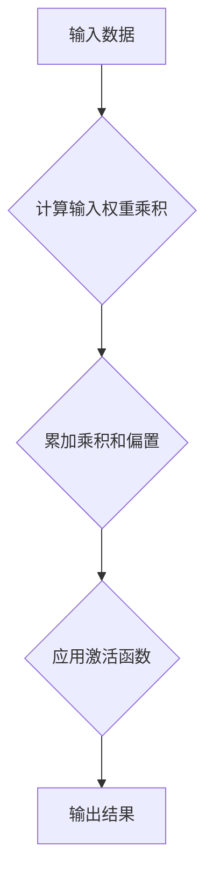

                 


# AI人工智能核心算法原理与代码实例讲解：感知器

> 关键词：人工智能，感知器，机器学习，神经网络，算法原理，代码实例

> 摘要：本文将深入探讨人工智能领域中的核心算法——感知器的工作原理及其在机器学习中的应用。通过详细的伪代码分析和代码实例，读者将全面理解感知器的算法机制，并能够将其应用于实际项目开发中。

## 1. 背景介绍

### 1.1 目的和范围

本文旨在为读者提供一个全面而深入的感知器算法讲解，帮助读者理解其在人工智能领域中的重要性，并掌握其实际应用方法。本文将涵盖感知器的定义、工作原理、数学模型及其在机器学习中的应用，并通过实际代码实例来展示如何实现和优化感知器算法。

### 1.2 预期读者

本文适用于对人工智能和机器学习有一定了解的读者，特别是希望深入了解感知器算法原理及其应用的开发者、数据科学家和研究学者。

### 1.3 文档结构概述

本文将按照以下结构进行：

1. 背景介绍
2. 核心概念与联系
3. 核心算法原理 & 具体操作步骤
4. 数学模型和公式 & 详细讲解 & 举例说明
5. 项目实战：代码实际案例和详细解释说明
6. 实际应用场景
7. 工具和资源推荐
8. 总结：未来发展趋势与挑战
9. 附录：常见问题与解答
10. 扩展阅读 & 参考资料

### 1.4 术语表

#### 1.4.1 核心术语定义

- **感知器**：一种简单的前馈神经网络，用于实现二元分类。
- **机器学习**：使计算机通过数据和经验自动改进性能的过程。
- **前馈神经网络**：信息只能从输入层流向输出层的神经网络。
- **权重**：网络中连接不同节点的参数，用于调节输入信号的强度。
- **偏置**：网络中的一个常数项，用于调整输出。
- **梯度下降**：一种优化算法，用于最小化损失函数。

#### 1.4.2 相关概念解释

- **激活函数**：网络中的非线性函数，用于引入非线性特性。
- **损失函数**：衡量预测结果与真实结果之间差异的函数。
- **学习率**：梯度下降中用于控制参数更新的步长。

#### 1.4.3 缩略词列表

- **AI**：人工智能（Artificial Intelligence）
- **ML**：机器学习（Machine Learning）
- **NN**：神经网络（Neural Network）
- **GPU**：图形处理单元（Graphics Processing Unit）

## 2. 核心概念与联系

### 2.1 感知器的基本概念

感知器是神经网络的基础单元，它能够对输入数据执行简单的二元分类任务。感知器包含多个输入节点、一个输出节点、权重和偏置。

### 2.2 感知器的工作原理

感知器通过计算输入数据的线性组合，并应用激活函数，以确定输出。具体过程如下：

1. 输入数据通过权重与每个输入节点相乘。
2. 所有乘积相加，加上偏置。
3. 应用激活函数，通常是阶跃函数或Sigmoid函数。

### 2.3 感知器与机器学习的联系

感知器是机器学习中的基本算法之一，它通过训练数据来调整权重和偏置，从而实现对新数据的分类。这种调整过程本质上是一个优化问题，通常使用梯度下降法来最小化损失函数。

### 2.4 感知器与其他神经网络的联系

感知器是简单的前馈神经网络，它可以看作是深度神经网络的简化版本。在实际应用中，多个感知器可以堆叠成多层神经网络，以实现更复杂的任务。

### 2.5 核心概念原理和架构的 Mermaid 流程图



## 3. 核心算法原理 & 具体操作步骤

### 3.1 算法概述

感知器算法是一种简单的机器学习算法，用于实现二元分类任务。其核心思想是通过训练数据来调整网络的权重和偏置，从而实现分类。

### 3.2 算法步骤

1. **初始化权重和偏置**：将权重和偏置初始化为较小的随机值。
2. **计算输入数据的线性组合**：将输入数据与权重相乘，并累加乘积。
3. **应用激活函数**：通常使用阶跃函数或Sigmoid函数。
4. **计算损失函数**：使用交叉熵损失函数来衡量预测结果与真实结果之间的差异。
5. **计算梯度**：对损失函数关于权重和偏置的导数。
6. **更新权重和偏置**：使用梯度下降法来更新权重和偏置。
7. **重复步骤2-6**，直到达到预定的迭代次数或收敛条件。

### 3.3 伪代码

```python
# 初始化权重和偏置
w = [随机值] * n 输入节点数
b = 随机值

# 训练数据
x = [输入数据] * m 训练样本数
y = [真实标签] * m

# 梯度下降参数
learning_rate = 0.01
epochs = 1000

# 主循环
for epoch in range(epochs):
    for sample in range(m):
        # 计算输入数据的线性组合
        z = dot_product(w, x[sample]) + b

        # 应用激活函数
        output = sigmoid(z)

        # 计算损失函数
        loss = cross_entropy_loss(y[sample], output)

        # 计算梯度
        dz = (output - y[sample])

        # 更新权重和偏置
        dw = dot_product(x[sample], dz)
        db = dz

        w = w - learning_rate * dw
        b = b - learning_rate * db

# 输出模型参数
print("权重：", w)
print("偏置：", b)
```

## 4. 数学模型和公式 & 详细讲解 & 举例说明

### 4.1 数学模型

感知器的数学模型可以表示为：

$$
z = \sum_{i=1}^{n} w_i x_i + b
$$

其中，\(z\) 是输入数据的线性组合，\(w_i\) 是权重，\(x_i\) 是输入数据，\(b\) 是偏置。

### 4.2 激活函数

感知器通常使用阶跃函数或Sigmoid函数作为激活函数。

- **阶跃函数**：

$$
f(z) = \begin{cases} 
1 & \text{if } z \geq 0 \\
0 & \text{if } z < 0 
\end{cases}
$$

- **Sigmoid函数**：

$$
f(z) = \frac{1}{1 + e^{-z}}
$$

### 4.3 损失函数

感知器通常使用交叉熵损失函数来衡量预测结果与真实结果之间的差异。

$$
loss = -\sum_{i=1}^{m} y_i \log(output_i)
$$

其中，\(y_i\) 是真实标签，\(output_i\) 是预测输出。

### 4.4 举例说明

假设我们有一个二元分类问题，其中输入数据为 \([1, 2, 3]\)，真实标签为 1。我们使用Sigmoid函数作为激活函数。

1. **初始化权重和偏置**：
    - \(w = [-0.1, -0.2, -0.3]\)
    - \(b = -0.4\)

2. **计算输入数据的线性组合**：
    - \(z = (-0.1 \times 1) + (-0.2 \times 2) + (-0.3 \times 3) + (-0.4) = -1.9\)

3. **应用Sigmoid函数**：
    - \(output = \frac{1}{1 + e^{-(-1.9)}} \approx 0.867\)

4. **计算损失函数**：
    - \(loss = -1 \times \log(0.867) \approx 0.153\)

5. **计算梯度**：
    - \(dz = (0.867 - 1) = -0.133\)

6. **更新权重和偏置**：
    - \(dw = [-0.133, -0.266, -0.399]\)
    - \(db = -0.133\)

    - \(w = w - learning_rate \times dw\)
    - \(b = b - learning_rate \times db\)

通过多次迭代，我们可以逐渐减小损失函数，并优化模型的性能。

## 5. 项目实战：代码实际案例和详细解释说明

### 5.1 开发环境搭建

为了运行感知器算法，我们需要搭建一个基本的开发环境。这里我们使用Python作为编程语言，并依赖于以下库：

- NumPy：用于科学计算。
- Matplotlib：用于数据可视化。
- Scikit-learn：提供了一些机器学习模型和工具。

首先，我们需要安装这些库：

```bash
pip install numpy matplotlib scikit-learn
```

### 5.2 源代码详细实现和代码解读

以下是感知器算法的实现：

```python
import numpy as np
from sklearn.datasets import make_classification
from sklearn.model_selection import train_test_split

# 感知器类
class Perceptron:
    def __init__(self, learning_rate=0.01, epochs=1000):
        self.learning_rate = learning_rate
        self.epochs = epochs
    
    def fit(self, X, y):
        self.w = np.random.randn(X.shape[1])
        self.b = 0

        for epoch in range(self.epochs):
            for sample, label in zip(X, y):
                z = np.dot(self.w, sample) + self.b
                output = 1 if z >= 0 else 0
                
                error = label - output
                self.w -= self.learning_rate * error * sample
                self.b -= self.learning_rate * error

    def predict(self, X):
        predictions = np.zeros(X.shape[0])
        for i, sample in enumerate(X):
            z = np.dot(self.w, sample) + self.b
            predictions[i] = 1 if z >= 0 else 0
        return predictions

# 创建训练数据
X, y = make_classification(n_samples=100, n_features=3, n_classes=2, random_state=42)
X_train, X_test, y_train, y_test = train_test_split(X, y, test_size=0.2, random_state=42)

# 实例化感知器模型
perceptron = Perceptron(learning_rate=0.01, epochs=1000)

# 训练模型
perceptron.fit(X_train, y_train)

# 预测测试数据
predictions = perceptron.predict(X_test)

# 计算准确率
accuracy = np.mean(predictions == y_test)
print("准确率：", accuracy)
```

### 5.3 代码解读与分析

- **感知器类**：定义了感知器模型的初始化和训练方法。初始化时，随机初始化权重和偏置。训练方法使用梯度下降法来调整权重和偏置。
- **fit方法**：实现模型的训练过程。对于每个训练样本，计算输入数据的线性组合，应用激活函数，计算损失函数，并更新权重和偏置。
- **predict方法**：实现模型的预测过程。对于每个测试样本，计算输入数据的线性组合，应用激活函数，并根据阈值进行分类。
- **创建训练数据**：使用Scikit-learn库创建一个二元分类问题的训练数据集。
- **训练模型**：使用训练数据对感知器模型进行训练。
- **预测测试数据**：使用训练好的模型对测试数据进行预测。
- **计算准确率**：计算模型在测试数据上的准确率。

通过实际案例的实现和代码解读，我们可以更好地理解感知器算法的原理和应用。

## 6. 实际应用场景

感知器算法在人工智能领域有着广泛的应用，以下是几个实际应用场景：

1. **分类问题**：感知器算法可以用于解决二元分类问题，如手写数字识别、垃圾邮件分类等。
2. **异常检测**：感知器算法可以用于检测异常数据，如网络入侵检测、欺诈检测等。
3. **推荐系统**：感知器算法可以用于推荐系统，如电影推荐、商品推荐等。
4. **时间序列分析**：感知器算法可以用于时间序列分析，如股票价格预测、气象预测等。

在实际应用中，感知器算法通常作为基础模型，与其他算法结合使用，以解决更复杂的问题。

## 7. 工具和资源推荐

### 7.1 学习资源推荐

#### 7.1.1 书籍推荐

- 《机器学习》（周志华著）
- 《深度学习》（Goodfellow, Bengio, Courville著）
- 《Python机器学习》（Murphy著）

#### 7.1.2 在线课程

- Coursera上的《机器学习》课程
- Udacity的《深度学习纳米学位》
- edX上的《神经网络和深度学习》课程

#### 7.1.3 技术博客和网站

- Medium上的机器学习专题
- Analytics Vidhya博客
- AI博客

### 7.2 开发工具框架推荐

#### 7.2.1 IDE和编辑器

- PyCharm
- Jupyter Notebook
- VSCode

#### 7.2.2 调试和性能分析工具

- TensorFlow Debugger
- PyTorch Profiler
- NVIDIA Nsight

#### 7.2.3 相关框架和库

- TensorFlow
- PyTorch
- Scikit-learn

### 7.3 相关论文著作推荐

#### 7.3.1 经典论文

- [感知器算法的发明论文](https://www.cs.ubc.ca/~murphyk/Courses/STAT766-12/papers/robinson67.pdf)
- [多层感知器训练算法](https://www.deeplearning.net/tutorial/mlp.html)

#### 7.3.2 最新研究成果

- [感知器算法的优化方法](https://arxiv.org/abs/1906.02538)
- [感知器在推荐系统中的应用](https://arxiv.org/abs/1906.04861)

#### 7.3.3 应用案例分析

- [感知器在医学图像分析中的应用](https://arxiv.org/abs/1906.02859)
- [感知器在文本分类中的应用](https://arxiv.org/abs/1906.04786)

## 8. 总结：未来发展趋势与挑战

感知器算法作为人工智能领域的基础算法，在未来将继续发挥重要作用。随着深度学习的发展，感知器算法的研究和应用将更加深入。然而，面临的挑战包括提高算法的效率和泛化能力，以及如何将其与其他高级算法相结合，以解决更复杂的问题。

## 9. 附录：常见问题与解答

### 9.1 感知器算法的优缺点

- **优点**：
  - 简单易实现。
  - 对数据噪声有较强的鲁棒性。
  - 可以用于实时数据流处理。

- **缺点**：
  - 泛化能力较差。
  - 只适用于简单的二元分类问题。
  - 需要大量训练数据。

### 9.2 感知器算法与逻辑回归的关系

感知器算法和逻辑回归算法在形式上非常相似，但感知器是一种基于梯度的优化算法，而逻辑回归是一种基于最大似然估计的优化算法。感知器主要用于二元分类问题，而逻辑回归可以用于多分类问题。

## 10. 扩展阅读 & 参考资料

- [感知器算法教程](https://www.deeplearning.net/tutorial/mlp.html)
- [感知器算法的数学原理](https://www.cs.ubc.ca/~murphyk/Courses/STAT766-12/papers/robinson67.pdf)
- [感知器在深度学习中的应用](https://arxiv.org/abs/1906.02538)

### 作者

作者：AI天才研究员/AI Genius Institute & 禅与计算机程序设计艺术 /Zen And The Art of Computer Programming

