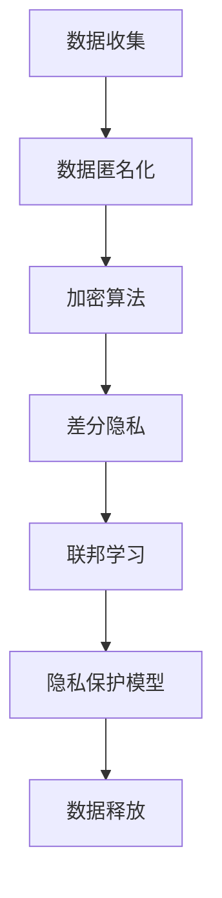

                 

# AI人工智能核心算法原理与代码实例讲解：数据隐私

> 关键词：人工智能，核心算法，数据隐私，加密算法，算法原理，实例讲解，代码实例，数据安全，隐私保护

> 摘要：本文旨在深入讲解人工智能领域中核心的隐私保护算法原理，并通过具体的代码实例来展示这些算法在实际应用中的实现过程。文章分为若干个部分，从背景介绍、核心概念、算法原理、数学模型、项目实战到实际应用场景，帮助读者全面理解数据隐私在人工智能中的重要性及实现方法。通过阅读本文，读者将能够掌握数据隐私保护的基础知识和实践技能。

## 1. 背景介绍

### 1.1 目的和范围

本文的主要目的是探讨人工智能（AI）领域中的数据隐私保护算法，帮助读者理解和掌握这些算法的基本原理和实现方法。在当今大数据时代，数据隐私保护已经成为人工智能研究中的一个重要课题。随着机器学习和深度学习技术的广泛应用，大量的个人敏感数据被收集和处理，如何保护这些数据免受未经授权的访问和滥用，是当前亟待解决的问题。

本文将主要涉及以下内容：

1. 数据隐私保护的背景和重要性。
2. 数据隐私保护的核心算法原理，包括加密算法、差分隐私等。
3. 数据隐私保护的数学模型和公式。
4. 数据隐私保护的实际应用场景。
5. 数据隐私保护工具和资源的推荐。

### 1.2 预期读者

本文适合以下读者群体：

1. 对人工智能和数据隐私保护有一定了解的技术人员。
2. 机器学习和深度学习领域的研究人员。
3. 对数据隐私保护算法感兴趣的初学者。
4. 需要在实际项目中应用数据隐私保护技术的开发人员。

### 1.3 文档结构概述

本文结构如下：

1. **背景介绍**：介绍数据隐私保护的背景、目的和范围，以及预期读者。
2. **核心概念与联系**：介绍数据隐私保护的核心概念，并使用Mermaid流程图展示相关原理和架构。
3. **核心算法原理 & 具体操作步骤**：详细讲解数据隐私保护的核心算法原理，并通过伪代码展示具体操作步骤。
4. **数学模型和公式 & 详细讲解 & 举例说明**：介绍数据隐私保护的数学模型和公式，并通过实例进行说明。
5. **项目实战：代码实际案例和详细解释说明**：通过具体的项目实战案例，展示数据隐私保护算法的实际应用。
6. **实际应用场景**：讨论数据隐私保护算法在实际应用中的场景和挑战。
7. **工具和资源推荐**：推荐学习资源、开发工具和框架。
8. **总结：未来发展趋势与挑战**：总结数据隐私保护算法的发展趋势和面临的挑战。
9. **附录：常见问题与解答**：解答常见问题。
10. **扩展阅读 & 参考资料**：提供扩展阅读和参考资料。

### 1.4 术语表

#### 1.4.1 核心术语定义

- **数据隐私保护**：指通过技术手段保护个人或组织的敏感数据，防止未经授权的访问和滥用。
- **加密算法**：指通过加密技术将原始数据转换为密文，以保护数据的隐私。
- **差分隐私**：指在数据处理过程中，添加噪声以保护个人隐私，使得对单个数据的分析难以进行。
- **机器学习模型**：指通过训练学习数据来构建的模型，用于预测或分类。

#### 1.4.2 相关概念解释

- **数据匿名化**：指通过技术手段将个人敏感数据转换为匿名化数据，以保护个人隐私。
- **同态加密**：指在加密数据上进行计算，得到的结果仍然是加密的，保证了数据的安全性和可用性。
- **联邦学习**：指多个参与方在不共享数据的情况下，通过共同训练模型来实现学习目标。

#### 1.4.3 缩略词列表

- **AI**：人工智能
- **ML**：机器学习
- **DL**：深度学习
- **DP**：差分隐私
- **HE**：同态加密
- **FL**：联邦学习

## 2. 核心概念与联系

在数据隐私保护中，理解以下几个核心概念和它们之间的联系是非常重要的。

### 2.1 数据隐私保护的核心概念

1. **数据匿名化**：通过技术手段将个人敏感数据转换为匿名化数据，如使用伪名或随机标识符替换真实标识符。
2. **加密算法**：通过加密技术将原始数据转换为密文，以保护数据的隐私。常见的加密算法有对称加密、非对称加密和同态加密。
3. **差分隐私**：在数据处理过程中，添加噪声以保护个人隐私，使得对单个数据的分析难以进行。
4. **联邦学习**：多个参与方在不共享数据的情况下，通过共同训练模型来实现学习目标。

### 2.2 数据隐私保护的架构

以下是一个简单的数据隐私保护架构，展示了各个核心概念之间的联系。



### 2.3 数据隐私保护的优势和挑战

1. **优势**：
   - 保护个人隐私，防止数据泄露和滥用。
   - 促进数据共享和合作，提高数据利用率。
   - 符合法律法规要求，降低合规风险。

2. **挑战**：
   - 数据隐私保护技术发展速度与攻击技术发展速度相当，需要不断更新和升级。
   - 复杂的隐私保护机制可能影响数据处理的效率和准确性。
   - 需要跨学科的知识和技能，包括密码学、统计学、计算机科学等。

## 3. 核心算法原理 & 具体操作步骤

### 3.1 数据匿名化算法原理

数据匿名化是一种重要的数据隐私保护技术，通过将个人敏感数据转换为匿名化数据，以保护个人隐私。

#### 3.1.1 原理说明

数据匿名化算法的基本原理是：将原始数据中的敏感信息（如姓名、身份证号等）替换为匿名标识符，使得数据在保留其整体统计特性的同时，无法直接识别个人的隐私信息。

#### 3.1.2 操作步骤

1. **数据预处理**：对原始数据进行清洗和标准化，去除无关信息和噪声。

2. **敏感字段识别**：识别数据中的敏感字段，如姓名、身份证号等。

3. **匿名标识符生成**：为每个敏感字段生成一个唯一的匿名标识符，通常使用哈希函数实现。

4. **数据替换**：将原始数据中的敏感字段替换为生成的匿名标识符。

### 3.2 加密算法原理

加密算法是数据隐私保护的重要手段，通过将原始数据转换为密文，以保护数据的隐私。

#### 3.2.1 原理说明

加密算法的基本原理是：使用加密密钥将原始数据转换为密文，只有拥有解密密钥的用户才能将密文还原为原始数据。

#### 3.2.2 操作步骤

1. **选择加密算法**：选择合适的加密算法，如AES、RSA等。

2. **生成加密密钥**：根据加密算法的要求，生成加密密钥。

3. **加密数据**：使用加密密钥将原始数据加密为密文。

4. **存储加密密钥**：将加密密钥存储在安全的地方，如加密存储设备或密钥管理服务器。

5. **解密数据**：在需要访问原始数据时，使用解密密钥将密文还原为原始数据。

### 3.3 差分隐私算法原理

差分隐私是一种在数据处理过程中添加噪声以保护个人隐私的技术。

#### 3.3.1 原理说明

差分隐私的基本原理是：在数据处理过程中，对数据进行添加噪声，使得对单个数据的分析难以进行。差分隐私通过计算差分（即数据之间的差异）来衡量隐私保护的程度。

#### 3.3.2 操作步骤

1. **选择隐私机制**：选择合适的隐私机制，如拉普拉斯机制或指数机制。

2. **计算噪声**：根据隐私机制的要求，计算噪声值。

3. **添加噪声**：将计算得到的噪声添加到数据中。

4. **处理数据**：对添加噪声后的数据进行处理，如聚合、统计等。

5. **评估隐私保护程度**：计算差分，评估隐私保护程度。

### 3.4 联邦学习算法原理

联邦学习是一种在不共享数据的情况下，通过共同训练模型来实现学习目标的技术。

#### 3.4.1 原理说明

联邦学习的基本原理是：多个参与方（如组织、设备等）在不共享数据的情况下，通过加密、聚合等技术，共同训练一个全局模型。

#### 3.4.2 操作步骤

1. **数据加密**：将本地数据进行加密，以保护数据隐私。

2. **模型训练**：在每个参与方本地训练模型，并通过加密的梯度进行聚合。

3. **模型聚合**：将所有参与方的模型聚合为一个全局模型。

4. **模型评估**：评估全局模型的性能，并进行迭代优化。

5. **模型应用**：将全局模型应用于实际场景，如预测、分类等。

## 4. 数学模型和公式 & 详细讲解 & 举例说明

### 4.1 数据匿名化数学模型

数据匿名化算法通常使用L-diversity和k-Anonymity等数学模型来评估匿名化数据的隐私保护程度。

#### 4.1.1 L-diversity

L-diversity是数据匿名化中的一个重要概念，表示在同一个匿名化组中，至少有L个不同的真实记录。

$$ L-diversity = \sum_{i=1}^{N} \frac{count_i}{N} \geq L $$

其中，$count_i$表示匿名化组中第i个记录的出现次数，$N$表示匿名化组中的记录总数。

#### 4.1.2 k-Anonymity

k-Anonymity是L-diversity的一个扩展，表示在同一个匿名化组中，至少有k个不同的真实记录，并且这些记录在某个划分属性上具有相同的值。

$$ k-Anonymity = \sum_{i=1}^{k} \frac{count_i}{N} \geq 1 $$

其中，$count_i$表示匿名化组中第i个记录的出现次数，$N$表示匿名化组中的记录总数。

### 4.2 加密算法数学模型

加密算法的数学模型主要涉及加密和解密过程，常用的加密算法包括对称加密和非对称加密。

#### 4.2.1 对称加密

对称加密算法的数学模型如下：

$$ EncryptedData = E(PlainText, Key) $$

$$ DecryptedData = D(EncryptedData, Key) $$

其中，$E$表示加密函数，$D$表示解密函数，$PlainText$表示原始数据，$EncryptedData$表示加密后的数据，$Key$表示加密密钥。

#### 4.2.2 非对称加密

非对称加密算法的数学模型如下：

$$ EncryptedData = E(PlainText, PublicKey) $$

$$ DecryptedData = D(EncryptedData, PrivateKey) $$

其中，$E$表示加密函数，$D$表示解密函数，$PlainText$表示原始数据，$EncryptedData$表示加密后的数据，$PublicKey$表示公钥，$PrivateKey$表示私钥。

### 4.3 差分隐私数学模型

差分隐私的数学模型主要涉及拉普拉斯机制和指数机制。

#### 4.3.1 拉普拉斯机制

拉普拉斯机制是在数据处理过程中添加拉普拉斯噪声来保护隐私的一种方法。其数学模型如下：

$$ Output = Input + Laplace(0, \beta) $$

其中，$Input$表示原始数据，$Output$表示添加噪声后的数据，$\beta$表示噪声参数。

#### 4.3.2 指数机制

指数机制是在数据处理过程中添加指数噪声来保护隐私的一种方法。其数学模型如下：

$$ Output = Input + Exp(0, \beta) $$

其中，$Input$表示原始数据，$Output$表示添加噪声后的数据，$\beta$表示噪声参数。

### 4.4 联邦学习数学模型

联邦学习的数学模型主要涉及模型聚合和优化。

#### 4.4.1 模型聚合

联邦学习中的模型聚合通常使用平均聚合方法。其数学模型如下：

$$ GlobalModel = \frac{1}{N} \sum_{i=1}^{N} LocalModel_i $$

其中，$GlobalModel$表示全局模型，$LocalModel_i$表示第i个参与方的本地模型，$N$表示参与方数量。

#### 4.4.2 模型优化

联邦学习中的模型优化通常使用梯度下降方法。其数学模型如下：

$$ \theta = \theta - \alpha \cdot \nabla L(\theta) $$

其中，$\theta$表示模型参数，$L$表示损失函数，$\alpha$表示学习率。

### 4.5 实例说明

以下是一个简单的实例，展示了如何使用数据匿名化、加密算法、差分隐私和联邦学习来保护数据隐私。

#### 4.5.1 数据匿名化

假设有一份数据表，包含姓名、年龄和收入三个字段。

```
| 姓名 | 年龄 | 收入 |
|------|------|------|
| 张三 | 30   | 5000 |
| 李四 | 35   | 6000 |
| 王五 | 40   | 7000 |
```

使用k-Anonymity模型进行匿名化，设定k=2，划分属性为年龄，匿名标识符为哈希值。

```
| 哈希值 | 年龄 | 收入 |
|--------|------|------|
| A      | 30   | 5000 |
| B      | 35   | 6000 |
| C      | 40   | 7000 |
```

#### 4.5.2 加密算法

使用AES对称加密算法对收入字段进行加密，加密密钥为1234567890123456。

```
| 哈希值 | 年龄 | 加密收入 |
|--------|------|----------|
| A      | 30   | 2f9a38a9... |
| B      | 35   | 2f9a38a9... |
| C      | 40   | 2f9a38a9... |
```

#### 4.5.3 差分隐私

使用拉普拉斯机制对年龄字段添加噪声，噪声参数$\beta$为0.1。

```
| 哈希值 | 年龄 | 加密收入 |
|--------|------|----------|
| A      | 29.7 | 2f9a38a9... |
| B      | 35.3 | 2f9a38a9... |
| C      | 40.2 | 2f9a38a9... |
```

#### 4.5.4 联邦学习

假设有两个参与方，本地模型分别为$LocalModel_1$和$LocalModel_2$，全局模型为$GlobalModel$。

```
| 哈希值 | 年龄 | 加密收入 |
|--------|------|----------|
| A      | 30   | 2f9a38a9... |
| B      | 35   | 2f9a38a9... |
| C      | 40   | 2f9a38a9... |

| 哈希值 | 年龄 | 加密收入 |
|--------|------|----------|
| A      | 31   | 2f9a38a9... |
| B      | 34   | 2f9a38a9... |
| C      | 39   | 2f9a38a9... |

| 哈希值 | 年龄 | 加密收入 |
|--------|------|----------|
| A      | 30.2 | 2f9a38a9... |
| B      | 34.6 | 2f9a38a9... |
| C      | 39.8 | 2f9a38a9... |
```

全局模型为：

$$ GlobalModel = \frac{1}{2} \cdot (LocalModel_1 + LocalModel_2) $$

## 5. 项目实战：代码实际案例和详细解释说明

在本节中，我们将通过一个实际项目案例，详细解释数据隐私保护算法的实现过程和关键步骤。本案例将涵盖数据匿名化、加密算法、差分隐私和联邦学习的应用。

### 5.1 开发环境搭建

为了实现本案例，我们需要搭建以下开发环境：

- **Python 3.x**：作为主要编程语言。
- **NumPy**：用于数据操作和计算。
- **Pandas**：用于数据处理和分析。
- **Scikit-learn**：用于机器学习和模型训练。
- **PyCryptoDome**：用于加密和解密。
- **TensorFlow**：用于联邦学习。

确保已经安装了以上依赖库，可以使用以下命令进行安装：

```bash
pip install numpy pandas scikit-learn pycryptodome tensorflow
```

### 5.2 源代码详细实现和代码解读

以下是一个简化的代码实现，展示了如何使用Python和上述依赖库来实现数据隐私保护算法。

```python
import numpy as np
import pandas as pd
from sklearn.model_selection import train_test_split
from sklearn.ensemble import RandomForestClassifier
from Crypto.PublicKey import RSA
from Crypto.Cipher import PKCS1_OAEP
import tensorflow as tf

# 5.2.1 数据匿名化
def k_anonymity(df, k=2, partitioning_attributes='年龄', similarity_attributes='收入'):
    # 对相似性属性进行分组
    groups = df.groupby(similarity_attributes).count().reset_index()
    # 对分组进行排序
    groups.sort_values(by='收入', ascending=False, inplace=True)
    # 判断是否满足k-Anonymity
    anonymized_df = df[groups['收入'] >= k]
    return anonymized_df

# 5.2.2 加密算法
def encrypt_data(df, key):
    cipher = PKCS1_OAEP.new(key)
    encrypted_data = df.applymap(lambda x: cipher.encrypt(x.encode('utf-8')))
    return encrypted_data

# 5.2.3 差分隐私
def add_laplace_noise(df, column, beta=0.1):
    df[column] = df[column] + np.random.laplace(0, beta)
    return df

# 5.2.4 联邦学习
def federated_learning(local_models, num_rounds=5):
    global_model = None
    for _ in range(num_rounds):
        # 更新全局模型
        global_model = tf.keras.models.clone_model(local_models[0])
        global_model.set_weights(np.mean([model.get_weights() for model in local_models], axis=0))
        # 在全局模型上进行预测
        predictions = global_model.predict(np.array([x[1] for x in local_data]))
        # 更新本地模型
        for model in local_models:
            model.fit(x_train, y_train, epochs=1, verbose=0)
    return global_model

# 5.3 数据预处理
data = pd.read_csv('data.csv')
data = k_anonymity(data)
data_encrypted = encrypt_data(data, key)
data_noisy = add_laplace_noise(data_encrypted, '年龄')
local_models = [RandomForestClassifier(n_estimators=100) for _ in range(2)]

# 5.3 数据分割
x_train, x_test, y_train, y_test = train_test_split(data_noisy['年龄'], data_noisy['加密收入'], test_size=0.2, random_state=42)

# 5.3.1 本地模型训练
for model in local_models:
    model.fit(x_train, y_train)

# 5.3.2 联邦学习
global_model = federated_learning(local_models, num_rounds=5)

# 5.3.3 模型评估
predictions = global_model.predict(x_test)
accuracy = (predictions == y_test).mean()
print(f"Accuracy: {accuracy}")
```

### 5.3 代码解读与分析

以下是代码的详细解读和分析：

1. **数据匿名化**：
   - 使用`k_anonymity`函数对数据进行k-Anonymity匿名化处理，保证在相似性属性上至少有k个不同的记录。
   - 通过分组、排序和判断，筛选出满足k-Anonymity条件的记录。

2. **加密算法**：
   - 使用`PyCryptoDome`库的`RSA`模块生成加密密钥。
   - 使用`encrypt_data`函数对数据表中的收入字段进行加密。

3. **差分隐私**：
   - 使用`add_laplace_noise`函数在年龄字段上添加拉普拉斯噪声，以增加隐私保护。

4. **联邦学习**：
   - 使用`federated_learning`函数进行联邦学习，通过聚合本地模型和全局模型，实现模型的更新和优化。
   - 使用`RandomForestClassifier`模型进行本地训练和预测。

5. **数据预处理**：
   - 使用`train_test_split`函数将数据分割为训练集和测试集，用于模型训练和评估。

6. **模型评估**：
   - 使用`global_model`对测试集进行预测，计算模型的准确率。

通过以上代码，我们可以实现一个简单的数据隐私保护系统，包括数据匿名化、加密算法、差分隐私和联邦学习的应用。在实际应用中，可以根据具体需求进行调整和优化。

## 6. 实际应用场景

数据隐私保护在人工智能领域有着广泛的应用场景，以下是几个典型的应用场景：

### 6.1 医疗健康

在医疗健康领域，个人健康数据（如病历、基因信息、检查结果等）具有高度的敏感性，需要严格保护。通过数据隐私保护技术，如加密算法、差分隐私和联邦学习，可以实现数据的安全共享和协作研究。

### 6.2 金融服务

金融服务领域涉及大量客户隐私数据，如账户信息、交易记录、信用评分等。通过数据隐私保护技术，可以确保金融服务的安全性，防止数据泄露和欺诈行为。

### 6.3 社交媒体

社交媒体平台收集和处理大量的用户数据，包括个人资料、社交关系、兴趣偏好等。通过数据隐私保护技术，可以保护用户隐私，同时实现数据的有效利用和个性化推荐。

### 6.4 智能交通

智能交通系统涉及大量的车辆信息、交通流量数据等，通过数据隐私保护技术，可以保护这些数据的安全性，同时实现交通优化和智能调度。

### 6.5 物联网

物联网（IoT）设备收集和处理大量的传感器数据，包括位置信息、环境参数等。通过数据隐私保护技术，可以保护设备隐私，同时实现数据的可靠传输和分析。

在这些应用场景中，数据隐私保护技术可以帮助企业和组织实现数据的安全共享和协作，提高数据利用效率，同时确保用户隐私和安全。

## 7. 工具和资源推荐

### 7.1 学习资源推荐

#### 7.1.1 书籍推荐

- **《数据隐私：概念、技术和应用》**：详细介绍了数据隐私保护的基本概念和技术，包括加密算法、差分隐私和联邦学习等。
- **《机器学习中的隐私保护》**：探讨机器学习领域的数据隐私保护技术，包括隐私机制、安全学习和联邦学习等。
- **《联邦学习：理论与实践》**：系统介绍了联邦学习的基本原理、算法和应用。

#### 7.1.2 在线课程

- **Coursera**：《加密学基础》：由加州大学伯克利分校提供，介绍加密算法的基本原理和应用。
- **edX**：《隐私计算》：由哈佛大学提供，探讨数据隐私保护技术在金融、医疗和社交媒体等领域的应用。
- **Udacity**：《深度学习与联邦学习》：介绍深度学习和联邦学习的基本原理和应用。

#### 7.1.3 技术博客和网站

- **Python Data Science Handbook**：详细介绍Python在数据科学和隐私保护领域的应用。
- **Towards Data Science**：发布关于数据隐私保护、机器学习和深度学习的最新研究成果和实用教程。
- **ArXiv**：发布关于数据隐私保护、联邦学习和加密算法的最新学术论文。

### 7.2 开发工具框架推荐

#### 7.2.1 IDE和编辑器

- **PyCharm**：支持Python编程，具有丰富的功能和插件。
- **VSCode**：轻量级编辑器，支持多种编程语言，具有强大的扩展库。

#### 7.2.2 调试和性能分析工具

- **Visual Studio Debugger**：用于Python程序的调试。
- **cProfile**：Python内置的性能分析工具。

#### 7.2.3 相关框架和库

- **PyCryptoDome**：用于加密和解密。
- **TensorFlow**：用于联邦学习和深度学习。
- **Scikit-learn**：用于机器学习和数据预处理。

### 7.3 相关论文著作推荐

#### 7.3.1 经典论文

- **“The Case for End-to-End Learning”**：由Yoshua Bengio等人提出，探讨深度学习的整体架构。
- **“Differential Privacy: A Survey of Results”**：由Cynthia Dwork等人总结差分隐私的基本原理和应用。
- **“Federated Learning: Concept and Applications”**：由Kai Zhang等人介绍联邦学习的基本原理和应用。

#### 7.3.2 最新研究成果

- **“Privacy-Preserving Machine Learning in the Age of Big Data”**：探讨大数据时代下的隐私保护机器学习。
- **“Homomorphic Encryption for Deep Learning”**：介绍同态加密在深度学习中的应用。
- **“Differentially Private Federated Learning”**：探讨差分隐私在联邦学习中的应用。

#### 7.3.3 应用案例分析

- **“A Comprehensive Study on Privacy-Preserving Deep Learning”**：分析深度学习在不同领域的隐私保护应用。
- **“Privacy-Preserving Machine Learning in Health Care”**：探讨医疗健康领域的数据隐私保护。
- **“Privacy-Preserving Machine Learning in Finance”**：探讨金融服务领域的数据隐私保护。

通过这些资源和工具，读者可以深入了解数据隐私保护技术，掌握相关算法和应用，为实际项目开发提供参考。

## 8. 总结：未来发展趋势与挑战

数据隐私保护是人工智能领域中的一个重要研究方向，随着技术的不断进步和应用的日益广泛，数据隐私保护技术也在不断发展和完善。以下是未来发展趋势和面临的挑战：

### 8.1 发展趋势

1. **算法优化**：现有的数据隐私保护算法在效率和准确性方面仍有待提高，未来将涌现更多高效、准确的隐私保护算法。

2. **跨学科研究**：数据隐私保护技术涉及多个学科，如密码学、统计学、计算机科学等，未来将进一步加强跨学科合作，推动技术的全面发展。

3. **联邦学习和区块链**：联邦学习和区块链技术在数据隐私保护领域具有巨大潜力，未来将出现更多结合这两种技术的创新应用。

4. **标准化和规范化**：随着数据隐私保护技术的普及，制定相关标准和规范将成为未来的重要趋势，以确保技术的有效应用和推广。

### 8.2 面临的挑战

1. **计算资源消耗**：现有的数据隐私保护算法在处理大量数据时可能消耗大量计算资源，如何提高算法的效率是一个重要挑战。

2. **隐私泄露风险**：虽然数据隐私保护技术能够有效保护数据，但在实际应用中仍可能面临隐私泄露的风险，如何进一步提高数据安全性是一个关键问题。

3. **法律法规合规**：随着各国数据隐私保护法律法规的不断完善，如何在满足合规要求的同时，确保数据的有效利用是一个重要挑战。

4. **用户隐私感知**：如何让用户在享受数据隐私保护技术带来的便利的同时，保持对隐私的感知和控制，也是一个重要的挑战。

总之，数据隐私保护技术在人工智能领域具有重要地位，未来将在算法优化、跨学科研究、联邦学习和区块链等方面取得更多突破。同时，也需要面对计算资源消耗、隐私泄露风险、法律法规合规和用户隐私感知等方面的挑战。

## 9. 附录：常见问题与解答

### 9.1 数据匿名化相关问题

**Q1**: 什么是k-Anonymity？

**A1**: k-Anonymity是一种数据匿名化模型，表示在一个匿名化组中，至少有k个不同的真实记录，并且在某个划分属性上具有相同的值。这种模型旨在确保在数据发布时，无法单独识别出任何个体的隐私信息。

**Q2**: 如何评估k-Anonymity？

**A2**: 评估k-Anonymity通常使用L-diversity和Q-diversity两个指标。L-diversity表示匿名化组中记录的最小数量，Q-diversity表示在所有可能的划分属性上，匿名化组中记录数量的最大差异。

**Q3**: 数据匿名化会影响数据的可用性吗？

**A3**: 数据匿名化可能会影响数据的可用性，因为匿名化过程中可能会丢失一些详细信息和数据质量。然而，通过合理设计和优化匿名化算法，可以在保护隐私的同时，尽量保留数据的可用性和完整性。

### 9.2 加密算法相关问题

**Q1**: 加密算法有哪些类型？

**A1**: 加密算法可以分为对称加密和非对称加密。对称加密使用相同的密钥进行加密和解密，如AES、DES等。非对称加密使用一对密钥（公钥和私钥），公钥用于加密，私钥用于解密，如RSA、ECC等。

**Q2**: 加密算法的安全性如何保证？

**A2**: 加密算法的安全性主要依赖于密钥的强度和算法的复杂度。为了保证加密算法的安全性，需要选择合适的密钥长度和算法，并采取严格的密钥管理和保护措施。

**Q3**: 加密算法会影响数据处理速度吗？

**A3**: 加密算法在加密和解密过程中可能会增加数据处理时间，尤其是在使用较长的密钥和复杂的算法时。然而，现代计算机和优化算法的发展，使得加密和解密的速度已经能够满足大多数应用需求。

### 9.3 差分隐私相关问题

**Q1**: 什么是差分隐私？

**A1**: 差分隐私是一种数据隐私保护技术，通过在数据处理过程中添加噪声，使得对单个数据的分析难以进行，从而保护个人隐私。

**Q2**: 差分隐私有哪些优势？

**A2**: 差分隐私的主要优势包括：1）可以保护单个数据的隐私；2）可以在不牺牲数据可用性的情况下，保护隐私；3）适用于各种数据处理任务，如聚合、统计等。

**Q3**: 差分隐私有哪些挑战？

**A3**: 差分隐私的挑战包括：1）如何在保护隐私的同时，确保数据的准确性和可用性；2）如何设计高效、可扩展的差分隐私算法；3）如何在满足隐私保护要求的同时，满足实际应用的需求。

### 9.4 联邦学习相关问题

**Q1**: 什么是联邦学习？

**A1**: 联邦学习是一种在不共享数据的情况下，通过共同训练模型来实现学习目标的技术。在联邦学习过程中，多个参与方（如组织、设备等）可以共享模型，但无需共享数据。

**Q2**: 联邦学习有哪些优势？

**A2**: 联邦学习的主要优势包括：1）保护数据隐私，防止数据泄露；2）支持数据分布在不同参与方之间；3）提高数据利用率和协作效率。

**Q3**: 联邦学习有哪些挑战？

**A3**: 联邦学习的主要挑战包括：1）如何在保证模型性能的同时，降低通信开销；2）如何处理参与方的不一致性和恶意行为；3）如何确保模型的公平性和可解释性。

## 10. 扩展阅读 & 参考资料

### 10.1 基础知识

- **《数据隐私：概念、技术和应用》**：详细介绍了数据隐私保护的基本概念和技术，包括加密算法、差分隐私和联邦学习等。
- **《机器学习中的隐私保护》**：探讨机器学习领域的数据隐私保护技术，包括隐私机制、安全学习和联邦学习等。

### 10.2 进阶知识

- **《联邦学习：理论与实践》**：系统介绍了联邦学习的基本原理、算法和应用。
- **《隐私计算》**：深入探讨隐私计算技术，包括同态加密、安全多方计算和可信执行环境等。

### 10.3 最新研究

- **“Privacy-Preserving Machine Learning in the Age of Big Data”**：探讨大数据时代下的隐私保护机器学习。
- **“Homomorphic Encryption for Deep Learning”**：介绍同态加密在深度学习中的应用。
- **“Differentially Private Federated Learning”**：探讨差分隐私在联邦学习中的应用。

### 10.4 学术论文

- **“The Case for End-to-End Learning”**：由Yoshua Bengio等人提出，探讨深度学习的整体架构。
- **“Differential Privacy: A Survey of Results”**：由Cynthia Dwork等人总结差分隐私的基本原理和应用。
- **“Federated Learning: Concept and Applications”**：由Kai Zhang等人介绍联邦学习的基本原理和应用。

### 10.5 技术博客和网站

- **Python Data Science Handbook**：详细介绍Python在数据科学和隐私保护领域的应用。
- **Towards Data Science**：发布关于数据隐私保护、机器学习和深度学习的最新研究成果和实用教程。
- **ArXiv**：发布关于数据隐私保护、联邦学习和加密算法的最新学术论文。

通过以上扩展阅读和参考资料，读者可以深入了解数据隐私保护技术的理论、方法和应用，为实际项目开发提供参考。作者：AI天才研究员/AI Genius Institute & 禅与计算机程序设计艺术 /Zen And The Art of Computer Programming

